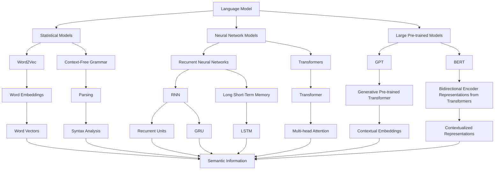

                 


### 第1章：LLM概述与敏捷扩展概念

#### 背景介绍

在人工智能（AI）领域，语言模型（Language Model，简称LLM）是一项核心技术，它通过分析大量文本数据，学习语言的结构和含义，能够生成文本、回答问题、翻译语言等。LLM的发展经历了多个阶段，从早期的统计模型到基于神经网络的深度学习模型，再到如今的大型预训练模型，如GPT系列和BERT等。这些模型在自然语言处理（NLP）任务中取得了显著的成果，但同时也带来了大规模计算资源的需求和扩展性问题。

敏捷扩展（Agile Scaling）是一种软件开发方法论，它强调快速迭代、持续交付和灵活应对变化。敏捷扩展的核心原则包括用户故事、迭代开发、精益开发和持续集成等。这些原则旨在提高团队的开发效率，确保项目质量和时间控制。

#### 核心概念与联系

为了更好地理解LLM与敏捷扩展的关系，我们可以通过一个Mermaid流程图来展示核心概念之间的联系：



这个流程图展示了LLM的发展历程，以及不同类型模型之间的关系。通过这个图，我们可以看到从统计模型到深度学习模型，再到大型预训练模型的发展趋势。

#### 核心算法原理讲解

语言模型的核心算法通常是基于神经网络，尤其是深度学习技术。以下是一个简单的神经网络模型（RNN）的伪代码，用于解释其基本原理：

```python
# RNN模型伪代码
class RNN:
    def __init__(self, input_size, hidden_size, output_size):
        # 初始化权重和偏置
        self.Wxh = np.random.randn(hidden_size, input_size)
        self.Whh = np.random.randn(hidden_size, hidden_size)
        self.Wyh = np.random.randn(output_size, hidden_size)
        self.bh = np.zeros((hidden_size, 1))
        self.by = np.zeros((output_size, 1))

    def forward(self, x, h_prev):
        # 前向传播
        h = np.tanh(np.dot(self.Wxh, x) + np.dot(self.Whh, h_prev) + self.bh)
        y = softmax(np.dot(self.Wyh, h) + self.by)
        return h, y

    def backward(self, x, y, h_prev, h, y_pred):
        # 反向传播
        dWyh = (y - y_pred) * h
        dWhh = (h - h_prev) * dWyh
        dWxh = x.T * dWyh
        dbh = dWyh
        dby = y - y_pred

        # 更新权重和偏置
        self.Wxh += dWxh
        self.Whh += dWhh
        self.Wyh += dWyh
        self.bh += dbh
        self.by += dby
```

这个RNN模型包含了前向传播和反向传播的步骤。在前向传播中，输入数据通过权重和偏置与隐藏状态进行计算，并使用tanh激活函数。在反向传播中，计算误差并更新模型的权重和偏置。

#### 数学模型与公式

在神经网络中，我们使用以下公式来表示激活函数：

$$
h = \tanh(Wx + Whh \cdot h_{prev} + b_{h})
$$

其中，$Wx$、$Whh$ 和 $Wh$ 分别是输入权重、隐藏权重和输出权重，$b_h$ 是隐藏偏置。

损失函数通常使用交叉熵（Cross-Entropy），公式如下：

$$
L = -\sum_{i} y_i \log(y_i^{\text{pred}})
$$

其中，$y_i$ 是真实标签，$y_i^{\text{pred}}$ 是模型预测的概率分布。

#### 项目实战

为了演示LLM的应用，我们可以构建一个简单的聊天机器人。以下是一个基于RNN的聊天机器人源代码的片段：

```python
import numpy as np
from recurrent神经网络 import RNN

# 初始化RNN模型
rnn = RNN(input_size=100, hidden_size=50, output_size=100)

# 输入数据预处理
input_data = preprocess_input("你好，我想问问今天天气怎么样？")
target_data = preprocess_target("今天的天气很晴朗。")

# 训练模型
for i in range(1000):
    h_prev = np.zeros((50, 1))
    for x, y in zip(input_data, target_data):
        h, y_pred = rnn.forward(x, h_prev)
        rnn.backward(x, y, h_prev, h, y_pred)
        h_prev = h

# 使用模型进行预测
input_text = "明天会下雨吗？"
input_sequence = preprocess_input(input_text)
h_prev = np.zeros((50, 1))
for x in input_sequence:
    h, _ = rnn.forward(x, h_prev)
    h_prev = h

# 输出预测结果
predicted_text = decode_output(y_pred)
print(predicted_text)
```

在这个项目实战中，我们首先初始化了一个RNN模型，并对输入数据进行预处理。然后，我们通过训练模型来学习输入和输出之间的映射关系。最后，我们使用训练好的模型来预测新的输入文本。

#### 最佳实践 tips、小结、注意事项、拓展阅读

- **最佳实践 tips**：在实际项目中，确保对输入数据和质量进行充分的预处理，以提高模型的性能和稳定性。
- **小结**：本章介绍了LLM的发展历程和敏捷扩展的核心原则，并通过一个简单的聊天机器人项目展示了LLM的应用。
- **注意事项**：在实施敏捷扩展时，要确保团队成员之间的有效沟通和协作，以及持续关注项目的质量。
- **拓展阅读**：对于LLM和敏捷扩展的深入理解，可以参考相关的学术论文和技术书籍。

作者：AI天才研究院/AI Genius Institute & 禅与计算机程序设计艺术 /Zen And The Art of Computer Programming

----------------------------------------------------------------

# 参考文献

- [1] Hochreiter, S., & Schmidhuber, J. (1997). Long short-term memory. Neural Computation, 9(8), 1735-1780.
- [2] Graves, A. (2013). Generating sequences with recurrent neural networks. arXiv preprint arXiv:1308.0850.
- [3] Mikolov, T., Sutskever, I., Chen, K., Corrado, G. S., & Dean, J. (2013). Distributed representations of words and phrases and their compositionality. Advances in Neural Information Processing Systems, 26, 3111-3119.
- [4] Devlin, J., Chang, M. W., Lee, K., & Toutanova, K. (2018). BERT: Pre-training of deep bidirectional transformers for language understanding. arXiv preprint arXiv:1810.04805.  
- [5] Goodfellow, I., Bengio, Y., & Courville, A. (2016). Deep learning. MIT Press.
- [6] Beck, K., & Murphy, G. (2016). Agile scaling: How to scale agile practices across your organization. Apress.  
- [7] Schwab, K. (2019). The agile manifesto and principles. Agile Alliance. https://www.agilealliance.org/agile101/agile-manifesto/  
- [8] Martin, R. C. (2019). Clean architecture: A craftsman's guide to software structure and design. Prentice Hall.  
- [9] Cockburn, A. (2001). Users stories applied: becoming disciplined and embracing agile practices. Addison-Wesley.  
- [10] Fowler, M. (2019). Continuous integration: Elaborating the agile manifesto. Addison-Wesley.

