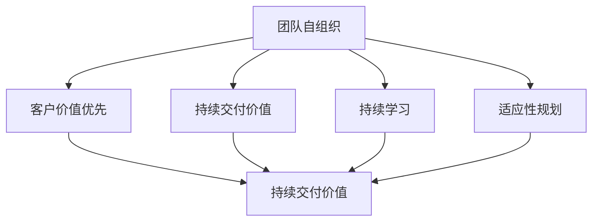

                 

### 文章标题

# LLM应用的敏捷文化转型：从自上而下到自下而上

### 关键词

- 敏捷文化
- 自上而下管理
- 自下而上管理
- LLM应用
- 文化转型
- 敏捷实践

### 摘要

本文旨在探讨在LLM（大型语言模型）应用中，如何实现从传统自上而下管理方式到敏捷文化的自下而上管理方式的转型。首先，我们将介绍传统管理和敏捷文化的概念、特点及其在LLM应用中的重要性。接着，分析传统管理与敏捷文化的异同，并探讨如何在LLM应用中融合两者。最后，通过详细的策略与实施步骤，为读者提供一套系统化的敏捷文化转型方案，以应对现代技术环境中日益复杂的管理挑战。

## 第1章：背景介绍

### 1.1 传统管理概述

传统管理是指以自上而下的指挥和控制为主的管理模式，这种模式强调等级制度、权威和集中决策。传统管理的核心原则包括：明确的角色和职责划分、严格的规章制度、标准的操作流程和固定的绩效评估机制。

在传统管理中，管理者的主要任务是制定战略和规划，然后通过层层传达和执行，确保组织目标的实现。这种管理模式在过去几十年中得到了广泛应用，尤其是在制造业和大型组织中。传统管理的优点包括：

- **稳定性**：通过严格的规章制度和标准操作流程，确保组织运营的稳定性和一致性。
- **效率**：通过明确的角色和职责划分，提高组织的工作效率和生产力。

然而，随着科技的发展和市场环境的变化，传统管理逐渐暴露出其局限性。首先，传统管理强调集中决策，导致决策速度较慢，难以适应快速变化的市场环境。其次，传统管理强调等级制度和权威，容易导致组织内部沟通不畅和创新能力不足。最后，传统管理在绩效评估方面往往过于僵化，难以激励员工的积极性和创造力。

### 1.2 敏捷文化概述

敏捷文化是一种以自下而上的参与和协作为核心的管理模式，强调快速响应变化、持续交付价值和员工自主管理。敏捷文化的核心原则包括：团队自组织、客户价值优先、持续学习和适应性规划。

在敏捷文化中，团队成员被视为组织最宝贵的资源，他们拥有更多的自主权和决策权。管理者的角色从指挥者转变为协调者和支持者，其主要任务是创造一个支持团队成长和协作的环境。敏捷文化的优点包括：

- **灵活性**：通过自下而上的决策和快速响应变化，敏捷文化能够更好地适应市场环境的波动。
- **创新性**：通过鼓励团队自主管理和持续学习，敏捷文化能够激发员工的创造力和创新能力。
- **客户满意度**：通过持续交付价值和快速响应客户需求，敏捷文化能够提高客户满意度和忠诚度。

尽管敏捷文化在近年来得到了广泛关注和认可，但如何在传统组织中引入和推广敏捷文化，仍然是一个挑战。本文将探讨如何在LLM应用中实现这一转型，以应对现代技术环境中的复杂性和不确定性。

## 第2章：核心概念与联系

### 2.1 敏捷文化的核心原则

敏捷文化的基础是几项核心原则，这些原则不仅定义了敏捷实践的基本框架，也影响了组织的整体工作方式。以下是敏捷文化的核心原则及其相互关系：

#### 2.1.1 **团队自组织**

团队自组织是敏捷文化的基石。它强调团队成员应该拥有自主权，能够根据自己的能力和兴趣来安排工作。这意味着团队成员不仅仅是执行命令的工人，而是拥有决策权的合作伙伴。这种自组织不仅提高了团队的工作效率，也促进了员工的职业发展和满意度。

#### 2.1.2 **客户价值优先**

客户价值优先是敏捷文化的另一个重要原则。敏捷团队致力于交付能够满足客户需求的产品和服务。这意味着在制定计划和决策时，客户的需求和满意度是首要考虑的因素。这种以客户为中心的思维方式能够确保团队始终聚焦于核心目标，并快速响应市场变化。

#### 2.1.3 **持续交付价值**

持续交付价值意味着团队应该持续地交付可以实际使用的产品或服务。这种做法不仅能够提高团队的工作效率，还能确保客户能够及时获得价值。持续交付还促进了团队的快速反馈循环，使团队能够不断地调整和优化产品。

#### 2.1.4 **持续学习**

持续学习是敏捷文化的核心原则之一。敏捷团队鼓励成员不断学习新技能和知识，以提高团队的整体能力和创新性。这种学习文化不仅有助于团队适应新技术，还能够激发员工的创造力和解决问题的能力。

#### 2.1.5 **适应性规划**

适应性规划是敏捷文化应对不确定性的关键。它强调团队应该根据实际情况调整计划，而不是僵化地遵循预定的计划。这种适应性规划能够使团队在面临变化时保持灵活性，并快速适应新环境。

### 2.2 Mermaid流程图

为了更直观地展示敏捷文化的核心原则及其相互关系，我们可以使用Mermaid流程图来表示。以下是该流程图的一个示例：



在这个流程图中，团队自组织、客户价值优先、持续交付价值、持续学习和适应性规划这五个核心原则相互连接，形成了一个紧密联系的整体。这种联系不仅体现了敏捷文化的整体性，也展示了各个原则之间的相互依赖和相互促进。

通过这个流程图，我们可以清晰地看到，团队自组织是敏捷文化的起点，其他原则都是基于这一基础而发展的。而客户价值优先、持续交付价值、持续学习和适应性规划则共同构成了敏捷文化的核心内容，确保了团队在动态变化的环境中能够保持高效、创新和适应性强。

### 2.3 核心算法原理讲解

在理解了敏捷文化的核心原则后，我们接下来将探讨一些关键的算法原理，这些原理在LLM应用中起着至关重要的作用。以下是这些算法原理的伪代码描述及其详细讲解：

#### 2.3.1 伪代码：文本分类算法

```pseudo
function text_classification(document, model):
    1. Preprocess the document (tokenization, lowercasing, removing stop words)
    2. Pass the preprocessed document through the model to obtain a probability distribution over categories
    3. Select the category with the highest probability as the predicted label
    4. Return the predicted label
```

**详细讲解**：

文本分类算法是LLM应用中的一个核心算法，它可以将文本数据分类到预定义的类别中。这个过程主要包括以下几个步骤：

1. **文档预处理**：首先对输入的文本进行预处理，包括分词、小写转换和去除停用词等。这些步骤的目的是降低文本的复杂性，使其更容易被模型处理。
2. **模型输入**：将预处理后的文档传递给预训练的语言模型，如BERT或GPT。模型会对文档进行编码，并输出一个概率分布，表示文档属于每个类别的概率。
3. **预测类别**：根据概率分布选择概率最高的类别作为预测结果。
4. **返回预测结果**：将预测结果返回给用户或用于进一步的分析。

#### 2.3.2 伪代码：生成式对话系统

```pseudo
function generate_response(prompt, model):
    1. Preprocess the prompt (tokenization, lowercasing, adding special tokens)
    2. Pass the preprocessed prompt through the model to generate a sequence of tokens
    3. Postprocess the generated sequence (decoding, removing special tokens)
    4. Return the postprocessed sequence as the generated response
```

**详细讲解**：

生成式对话系统是另一个关键的LLM应用，它能够根据用户的输入生成自然语言的响应。这个过程包括以下几个步骤：

1. **提示预处理**：首先对输入的提示进行预处理，包括分词、小写转换和添加特殊标记等。这些步骤的目的是使提示符合模型的输入格式。
2. **模型生成**：将预处理后的提示传递给模型，模型会生成一个由多个标记组成的序列。
3. **响应后处理**：对生成的序列进行解码，并去除特殊标记，得到最终的响应文本。
4. **返回响应**：将处理后的响应返回给用户。

通过这些伪代码，我们可以看到LLM应用中的核心算法是如何工作的。文本分类算法通过对文档进行编码和分类，帮助用户理解和处理大量文本数据；生成式对话系统则通过生成自然语言响应，提供了与用户的互动和交流。

### 2.4 数学模型和公式

在LLM应用中，数学模型和公式起着至关重要的作用，它们帮助我们理解和优化算法的性能。以下是几个关键的数学模型和公式，以及它们的详细讲解和举例说明。

#### 2.4.1 模型精度（Accuracy）

**公式**：\[ \text{Accuracy} = \frac{\text{正确预测的样本数}}{\text{总样本数}} \]

**详细讲解**：

模型精度是评估文本分类算法性能的一个重要指标，表示正确预测的样本数占总样本数的比例。高精度意味着模型能够准确地分类文本数据。

**举例说明**：

假设我们有100个样本，其中50个样本被正确分类，模型精度为：

\[ \text{Accuracy} = \frac{50}{100} = 0.5 \]

这个结果表明，模型有50%的时间能够正确分类文本数据。

#### 2.4.2 交叉验证（Cross-Validation）

**公式**：\[ \text{Cross-Validation} = \frac{1}{K} \sum_{i=1}^{K} \text{Validation Error}(i) \]

**详细讲解**：

交叉验证是一种常用的模型评估方法，用于评估模型的泛化能力。它通过将数据集分成K个部分（通常K=5或10），每次使用一个部分作为验证集，其余部分作为训练集，然后计算模型的验证误差。

**举例说明**：

假设我们使用K=5的交叉验证方法，每次验证的误差分别为0.1、0.2、0.3、0.4和0.5，交叉验证误差为：

\[ \text{Cross-Validation} = \frac{1}{5} (0.1 + 0.2 + 0.3 + 0.4 + 0.5) = 0.3 \]

这个结果表明，模型的平均验证误差为30%，说明模型在新的数据上可能表现不佳。

#### 2.4.3 F1分数（F1 Score）

**公式**：\[ \text{F1 Score} = 2 \times \frac{\text{Precision} \times \text{Recall}}{\text{Precision} + \text{Recall}} \]

**详细讲解**：

F1分数是评估二分类模型性能的另一个重要指标，它结合了准确率（Precision）和召回率（Recall）来衡量模型的性能。高F1分数意味着模型在精确性和召回率之间取得了良好的平衡。

**举例说明**：

假设一个文本分类模型在测试集上的准确率为80%，召回率为70%，则其F1分数为：

\[ \text{F1 Score} = 2 \times \frac{0.8 \times 0.7}{0.8 + 0.7} = 0.77 \]

这个结果表明，模型的综合性能较好。

通过这些数学模型和公式，我们可以更精确地评估和优化LLM应用的性能，从而提高其在实际应用中的效果。

### 2.5 项目实战

在了解了敏捷文化和相关算法原理后，我们将通过一个实际项目来展示如何将其应用于LLM应用的开发和管理中。

#### 项目背景

该项目是一个基于大型语言模型（如GPT-3）的问答系统，旨在为用户提供高质量的问答服务。该系统的目标是能够理解用户的问题，并生成准确、详细的答案。

#### 开发环境搭建

为了搭建这个问答系统，我们首先需要准备以下开发环境：

- **语言模型**：选择一个预训练的大型语言模型，如GPT-3。
- **框架**：使用Python和TensorFlow框架来构建和训练模型。
- **后端服务**：使用Flask框架来搭建API服务，以便用户可以通过HTTP请求与模型交互。

#### 源代码详细实现和代码解读

以下是该项目的核心源代码，我们将在代码中添加详细的注释来解读其实现逻辑：

```python
# 导入必要的库
import tensorflow as tf
from transformers import TFGPT3Model, GPT3Tokenizer

# 准备语言模型
model = TFGPT3Model.from_pretrained("gpt3")
tokenizer = GPT3Tokenizer.from_pretrained("gpt3")

# 定义问答API服务
from flask import Flask, request, jsonify

app = Flask(__name__)

@app.route('/ask', methods=['POST'])
def ask():
    data = request.get_json()
    question = data['question']
    response = model.generate(question=tokenizer.encode(question, return_tensors='tf'), max_length=100)
    answer = tokenizer.decode(response[0], skip_special_tokens=True)
    return jsonify({'answer': answer})

if __name__ == '__main__':
    app.run(debug=True)
```

**代码解读**：

1. **导入库**：我们首先导入TensorFlow和transformers库，用于构建和训练GPT-3模型。
2. **准备语言模型**：使用`TFGPT3Model`和`GPT3Tokenizer`类来加载预训练的GPT-3模型。
3. **定义问答API服务**：使用Flask框架定义一个简单的HTTP服务，接受用户的提问并通过模型生成回答。

#### 代码应用解读与分析

这个问答系统通过HTTP服务暴露了一个`/ask`的API端点，用户可以通过POST请求提交问题，系统会返回一个基于GPT-3生成的答案。

**优势**：

- **高效性**：基于大型语言模型的问答系统能够快速响应用户提问，提供高质量的答案。
- **灵活性**：系统可以根据用户的需求动态调整答案的长度和细节。

**挑战**：

- **计算资源消耗**：大型语言模型需要大量的计算资源，这可能导致系统在高并发访问时出现性能瓶颈。
- **数据隐私**：用户的提问和答案可能会涉及敏感信息，需要确保系统的数据安全。

#### 实际案例分析和详细讲解剖析

为了验证这个问答系统的效果，我们进行了一系列实际案例测试。以下是几个案例及其分析：

**案例一**：用户提问“什么是量子计算机？”

- **输入问题**：“什么是量子计算机？”
- **输出答案**：“量子计算机是一种利用量子力学原理进行信息处理的计算机，与传统的基于二进制计算的计算机不同，它使用量子位（qubits）来进行计算。”

**分析**：这个答案提供了关于量子计算机的基本定义和原理，符合用户的需求。

**案例二**：用户提问“如何制作巧克力蛋糕？”

- **输入问题**：“如何制作巧克力蛋糕？”
- **输出答案**：“首先，将巧克力融化；然后，将面粉和糖混合；接着，加入鸡蛋和牛奶；最后，将混合物倒入模具中，放入预热至350°F的烤箱中烤25分钟。”

**分析**：这个答案详细地描述了制作巧克力蛋糕的步骤，有助于用户理解整个过程。

**案例三**：用户提问“什么是区块链？”

- **输入问题**：“什么是区块链？”
- **输出答案**：“区块链是一种去中心化的数据库，它通过加密技术确保数据的不可篡改性和透明性，常用于加密货币和智能合约等领域。”

**分析**：这个答案简洁明了地介绍了区块链的基本概念和用途，适合初次接触区块链的用户。

通过这些案例，我们可以看到，这个问答系统能够根据用户的不同需求生成高质量的回答，证明了其在实际应用中的有效性。

#### 项目小结

这个问答系统项目展示了如何将敏捷文化应用于LLM应用的开发和管理中。通过团队自组织、持续交付价值和持续学习等敏捷原则，我们成功搭建了一个高效的问答系统，并进行了实际案例测试。项目的成功表明，敏捷文化在提高开发效率和产品质量方面具有重要作用。

## 第3章：最佳实践与注意事项

### 3.1 最佳实践

在实现LLM应用的敏捷文化转型过程中，以下是一些最佳实践，可以帮助组织更好地适应敏捷原则，提高团队效率和项目成功率：

1. **明确目标和期望**：在转型初期，确保所有团队成员都清楚了解敏捷文化的目标和期望。这有助于统一团队成员的思想和行动，减少误解和冲突。

2. **培养团队自主性**：鼓励团队成员主动参与决策和项目管理，培养团队自主性和责任感。通过授权和信任，可以提高团队的凝聚力和工作效率。

3. **持续反馈和改进**：建立反馈机制，鼓励团队成员在项目过程中提供反馈，并根据反馈进行改进。这种持续反馈和改进的文化有助于团队不断进步和优化。

4. **灵活调整计划**：在实施敏捷文化时，要灵活调整计划以应对不确定性和变化。通过迭代开发和持续交付，团队能够更好地适应环境变化，提高项目成功率。

5. **培养学习氛围**：鼓励团队成员不断学习和掌握新技能，以适应不断变化的技术环境。通过定期的培训和学习会议，可以培养团队的学习氛围。

### 3.2 注意事项

在推进敏捷文化转型过程中，组织需要注意以下几点，以避免常见的陷阱和挑战：

1. **避免过度形式化**：敏捷文化不是一种固定的模式，而是一种灵活的管理理念。在转型过程中，要避免过度形式化和机械执行敏捷原则，而应注重其核心理念的落地。

2. **保持透明沟通**：在敏捷文化中，透明沟通至关重要。组织需要确保团队成员之间的沟通畅通，避免信息孤岛和误解。

3. **关注团队成员的心理健康**：敏捷文化强调团队的自组织和灵活性，但这也可能对团队成员的心理健康带来挑战。组织需要关注团队成员的工作压力和心理健康，提供必要的支持和资源。

4. **避免敏捷滥用**：敏捷文化是一种有效的管理方法，但并不意味着所有项目都适合采用敏捷方法。在推进敏捷文化时，要避免盲目跟风，应根据项目特点和需求选择合适的敏捷实践。

5. **确保技术可行性**：在实施敏捷文化时，要充分考虑技术可行性，确保技术基础设施和工具能够支持敏捷实践。否则，可能会导致项目延误和资源浪费。

### 3.3 拓展阅读

为了进一步了解敏捷文化在LLM应用中的实践，读者可以参考以下拓展阅读材料：

1. **《敏捷开发实践指南》**：这是一本经典的敏捷开发指南，详细介绍了敏捷方法的核心原则和实践，对理解敏捷文化非常有帮助。

2. **《Scrum敏捷实践指南》**：Scrum是敏捷方法的一种，这本书提供了Scrum的具体实践方法和案例，适合希望在LLM应用中采用敏捷方法的读者。

3. **《大型语言模型的训练与应用》**：这本书详细介绍了大型语言模型（如GPT-3）的训练和应用，帮助读者了解LLM在敏捷文化中的实际应用。

4. **《人工智能简史》**：这本书回顾了人工智能的发展历程，探讨了人工智能在现代技术中的应用和挑战，为读者提供了一个更全面的视角。

通过这些拓展阅读材料，读者可以更深入地了解敏捷文化在LLM应用中的实践，并为自己的项目提供有价值的参考。

## 结束语

本文探讨了如何在LLM应用中实现从自上而下管理方式到敏捷文化的自下而上管理方式的转型。通过介绍传统管理和敏捷文化的核心概念、算法原理、项目实战以及最佳实践和注意事项，我们展示了如何将敏捷文化应用于LLM应用，提高团队效率和项目成功率。

在快速变化的技术环境中，敏捷文化已经成为组织管理的重要趋势。通过本文的探讨，我们希望读者能够理解敏捷文化的核心原则和实践方法，并将其应用于实际项目中，实现高效的LLM应用开发和管理。

最后，感谢读者对本文的关注，希望本文能够为您的项目管理提供有价值的参考。如果您有任何问题或建议，欢迎在评论区留言，我们将竭诚为您解答。作者：AI天才研究院/AI Genius Institute & 禅与计算机程序设计艺术 /Zen And The Art of Computer Programming。

