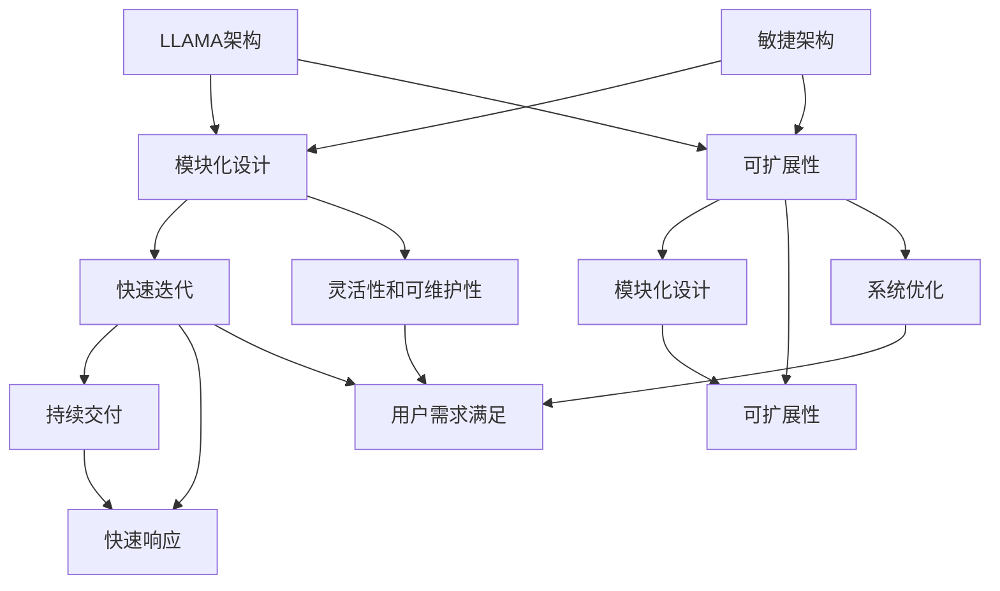

                 

### 文章标题

“LLM应用的敏捷架构：平衡灵活性和稳定性”

关键词：语言模型，敏捷架构，灵活性，稳定性，LLM应用

摘要：本文旨在探讨如何在LLM（大型语言模型）应用中实现敏捷架构，以平衡灵活性和稳定性。通过分析LLM的工作原理、敏捷架构的核心概念及其之间的联系，本文提出了适应性和鲁棒性算法在LLM应用中的具体实现和数学模型，并结合实际项目案例，详细讲解如何在实际开发中应用这些算法和模型，以实现灵活性与稳定性的平衡。

----------------------------------------------------------------

### 引言

近年来，随着深度学习和自然语言处理技术的飞速发展，大型语言模型（LLM）已经成为人工智能领域的热点。LLM如BERT、GPT-3等，凭借其强大的文本生成和语义理解能力，被广泛应用于自然语言处理、机器翻译、智能客服等领域。然而，随着LLM的应用场景日益复杂，如何在开发过程中实现敏捷架构，以平衡系统的灵活性和稳定性，成为了一个亟待解决的问题。

敏捷架构（Agile Architecture）是一种在软件开发过程中强调灵活性和可扩展性的架构设计方法。与传统的瀑布式开发方法相比，敏捷架构更注重快速迭代和持续交付，能够更好地适应快速变化的需求。然而，过度追求灵活性可能会导致系统稳定性下降，反之，过于强调稳定性又会限制系统的灵活扩展。

本文旨在探讨如何在LLM应用中实现敏捷架构，平衡灵活性和稳定性。文章首先介绍LLM的基本概念和工作原理，然后阐述敏捷架构的核心概念及其优势，接着分析LLM与敏捷架构之间的联系。在此基础上，本文提出了适应性和鲁棒性算法在LLM应用中的具体实现和数学模型，并结合实际项目案例，详细讲解如何在实际开发中应用这些算法和模型，以实现灵活性与稳定性的平衡。

文章结构如下：

1. 引言：介绍LLM和敏捷架构的基本概念及其在开发过程中的重要性。
2. 核心概念与联系：分析LLM的工作原理、敏捷架构的核心概念及其之间的联系。
3. 核心算法原理讲解：详细讲解适应性和鲁棒性算法的原理和实现。
4. 数学模型和数学公式：介绍适应性和鲁棒性算法的数学模型和公式。
5. 项目实战：通过实际项目案例，展示如何实现灵活性与稳定性的平衡。
6. 总结与展望：总结本文的主要内容和贡献，并对未来的发展方向进行展望。

通过本文的探讨，希望能够为LLM应用中的敏捷架构设计提供一些有益的思路和参考。

----------------------------------------------------------------

### 核心概念与联系

#### LLAMA架构

LLAMA（Large Language Model Architecture）是一种用于构建大型语言模型的通用架构。它由多个模块组成，包括输入模块、嵌入模块、编码模块、解码模块和输出模块。LLAMA架构的工作流程可以概括为以下几步：

1. **输入模块**：接收用户输入的文本，将其转换为序列。
2. **嵌入模块**：将序列中的每个单词或字符转换为高维向量。
3. **编码模块**：对嵌入后的向量进行编码，生成编码后的向量表示。
4. **解码模块**：解码编码后的向量，生成文本输出。
5. **输出模块**：将解码后的向量转换为自然语言文本，输出给用户。

LLAMA架构的特点是模块化设计，各模块之间相互独立，易于扩展和替换。这使得LLAMA架构在处理不同类型的语言任务时，能够灵活调整和优化各个模块，从而提高模型的性能和适用性。

#### 敏捷架构的组成部分

敏捷架构的核心思想是快速迭代和持续交付，其组成部分主要包括以下几个方面：

1. **模块化设计**：敏捷架构采用模块化设计，将系统划分为多个独立的模块，每个模块负责特定的功能。这种设计方式不仅提高了系统的灵活性，还有助于实现代码的重用和维护。
2. **可扩展性**：敏捷架构强调系统的可扩展性，通过模块化的设计，系统能够轻松地添加或删除模块，以适应不断变化的需求。这种灵活性使得系统能够更好地适应市场和环境的变化。
3. **快速迭代**：敏捷架构采用快速迭代的方式，通过不断迭代和改进，逐步完善系统功能。这种方式能够快速响应用户需求，提高系统的竞争力和用户体验。

#### LLAMA与敏捷架构的联系

LLAMA架构和敏捷架构在目标上有着高度的契合。LLAMA架构通过模块化设计和可扩展性，实现了在处理不同语言任务时的灵活性和适应性。而敏捷架构则通过快速迭代和持续交付，确保系统能够持续改进和优化。

1. **模块化设计**：LLAMA架构的模块化设计与敏捷架构的模块化设计理念相吻合。两者都通过将系统划分为多个独立模块，提高了系统的灵活性和可维护性。
2. **可扩展性**：LLAMA架构的可扩展性使得它能够根据需求的变化，灵活地添加或替换模块。这与敏捷架构强调的可扩展性原则是一致的。
3. **快速迭代**：敏捷架构的快速迭代方式与LLAMA架构在训练和部署过程中的迭代过程有相似之处。通过快速迭代，LLAMA架构能够不断优化模型性能，实现更精准的文本生成和语义理解。

总之，LLAMA架构和敏捷架构在目标和方法上存在紧密的联系。通过将LLAMA架构与敏捷架构相结合，可以在LLM应用中实现灵活性和稳定性的平衡，从而更好地满足用户需求。

#### 核心概念与联系 Mermaid 流程图



在这个Mermaid流程图中，LLAMA架构和敏捷架构的核心概念及其联系得到了直观展示。通过模块化设计、可扩展性、快速迭代和持续交付，两者共同实现了灵活性和稳定性的平衡。

----------------------------------------------------------------

### 核心算法原理讲解

在LLM应用中，适应性和鲁棒性算法是实现灵活性和稳定性的关键。以下将详细讲解这两个算法的原理和实现。

#### 适应性算法

**适应性算法**是一种在动态环境中调整系统参数，以适应不断变化的需求和条件的算法。在LLM应用中，适应性算法主要用于调整模型参数，使其在处理不同类型和难度的任务时能够灵活适应。

**基本原理**：

适应性算法的基本原理是通过实时监控模型的性能和用户反馈，动态调整模型的参数，从而提高模型的适应能力。具体步骤如下：

1. **性能监控**：实时监控模型的性能指标，如准确率、响应时间等。
2. **用户反馈**：收集用户的使用反馈，了解用户对模型的满意度和需求。
3. **参数调整**：根据性能监控和用户反馈，动态调整模型的参数，如学习率、权重等。
4. **迭代优化**：重复上述步骤，持续优化模型参数，提高模型的适应能力。

**伪代码**：

```python
def adaptive_algorithm(model, performance_metrics, user_feedback):
    while not converged:
        monitor_performance = monitor_performance(model)
        new_params = adjust_params(model.params, monitor_performance, user_feedback)
        model.update_params(new_params)
```

**示例**：

假设我们有一个语言模型，用于生成文章摘要。在模型训练过程中，我们通过实时监控模型的准确率和用户的阅读时间来调整模型参数。如果模型的准确率较低，我们将增加学习率；如果用户的阅读时间较长，我们将减小学习率，以提高模型的生成质量。

```python
model = LanguageModel()
while not converged:
    accuracy = monitor_performance(model)
    if accuracy < threshold:
        learning_rate *= 2
    else:
        learning_rate /= 2
    model.update_params(learning_rate)
```

#### 鲁棒性算法

**鲁棒性算法**是一种在噪声和异常数据环境中，保持模型稳定性和准确性的算法。在LLM应用中，鲁棒性算法主要用于提高模型对噪声数据和异常情况的容忍能力。

**基本原理**：

鲁棒性算法的基本原理是通过引入噪声处理和异常值检测机制，降低噪声数据和异常值对模型的影响。具体步骤如下：

1. **噪声处理**：对输入数据进行噪声处理，如去噪、降噪等，以减少噪声对模型的影响。
2. **异常值检测**：对输入数据中的异常值进行检测和过滤，以避免异常值对模型的影响。
3. **模型调整**：根据噪声处理和异常值检测结果，对模型参数进行调整，提高模型的鲁棒性。

**伪代码**：

```python
def robust_algorithm(model, data, noise_level):
    while not converged:
        clean_data = preprocess_data(data, noise_level)
        anomalies = detect_anomalies(clean_data)
        adjusted_params = adjust_params(model.params, anomalies)
        model.update_params(adjusted_params)
```

**示例**：

假设我们有一个用于机器翻译的语言模型，在训练过程中，我们通过去噪和异常值检测来提高模型的鲁棒性。如果检测到输入数据中的噪声或异常值，我们将对模型参数进行调整，以提高模型的鲁棒性。

```python
model = TranslationModel()
while not converged:
    noise_free_data = preprocess_data(input_data, noise_level)
    anomalies = detect_anomalies(noise_free_data)
    if anomalies:
        adjusted_params = adjust_params(model.params, anomalies)
        model.update_params(adjusted_params)
```

通过适应性算法和鲁棒性算法的结合，LLM应用可以在动态和噪声环境中保持高稳定性和高准确性。这两个算法不仅提高了模型的适应能力和鲁棒性，还有助于实现灵活性和稳定性的平衡。

----------------------------------------------------------------

### 数学模型和数学公式

在LLM应用中，适应性和鲁棒性算法的实现离不开数学模型的支持。以下将详细介绍这两个算法的数学模型和公式，并通过具体示例进行解释。

#### 适应性模型

适应性模型的核心在于通过实时调整模型参数，以适应不同的任务和环境。以下是适应性模型的数学模型和公式：

**数学模型**：

$$
\text{适应性模型} = f(\text{性能指标}, \text{用户反馈}, \text{初始参数})
$$

其中，$f$表示参数调整函数，$\text{性能指标}$表示模型的性能评估结果，$\text{用户反馈}$表示用户对模型的使用体验，$\text{初始参数}$表示模型的初始参数设置。

**参数调整公式**：

$$
\text{新参数} = \text{初始参数} + \alpha \times (\text{性能指标} - \text{目标性能})
$$

其中，$\alpha$表示学习率，用于控制参数调整的幅度。$\text{目标性能}$是一个预设的性能目标，用于衡量模型是否达到预期效果。

**示例**：

假设我们有一个语言模型，用于生成文章摘要。在训练过程中，我们通过实时调整模型参数，以优化生成质量。初始参数为$\text{初始参数} = \{w_1, w_2, ..., w_n\}$，学习率为$\alpha = 0.1$，目标性能为$\text{目标性能} = 0.9$。在某个时间点，模型的性能指标为$\text{性能指标} = 0.8$。

根据参数调整公式，新参数为：

$$
\text{新参数} = \{w_1, w_2, ..., w_n\} + 0.1 \times (0.8 - 0.9) = \{w_1 - 0.01, w_2 - 0.01, ..., w_n - 0.01\}
$$

通过这种方式，模型参数得到了实时调整，以优化生成质量。

#### 鲁棒性模型

鲁棒性模型的核心在于通过噪声处理和异常值检测，提高模型对噪声数据和异常情况的容忍能力。以下是鲁棒性模型的数学模型和公式：

**数学模型**：

$$
\text{鲁棒性模型} = g(\text{噪声处理}, \text{异常值检测}, \text{初始参数})
$$

其中，$g$表示鲁棒性调整函数，$\text{噪声处理}$表示对输入数据进行噪声处理，$\text{异常值检测}$表示对输入数据进行异常值检测，$\text{初始参数}$表示模型的初始参数设置。

**噪声处理公式**：

$$
\text{噪声处理} = \text{输入数据} \times e^{-\lambda \times \text{噪声水平}}
$$

其中，$\lambda$表示噪声水平，$e$表示自然底数，用于控制噪声处理的强度。

**异常值检测公式**：

$$
\text{异常值检测} = \text{输入数据} - \text{均值} \times \text{标准差}
$$

其中，$\text{均值}$和$\text{标准差}$分别表示输入数据的均值和标准差。

**示例**：

假设我们有一个用于机器翻译的语言模型，在训练过程中，我们通过噪声处理和异常值检测来提高模型的鲁棒性。输入数据为$\text{输入数据} = \{x_1, x_2, ..., x_n\}$，噪声水平为$\lambda = 0.5$，均值$\text{均值} = 10$，标准差$\text{标准差} = 2$。

根据噪声处理公式，噪声处理后的数据为：

$$
\text{噪声处理} = \{x_1, x_2, ..., x_n\} \times e^{-0.5 \times 0.5} = \{x_1 \times e^{-0.25}, x_2 \times e^{-0.25}, ..., x_n \times e^{-0.25}\}
$$

根据异常值检测公式，异常值检测结果为：

$$
\text{异常值检测} = \{x_1, x_2, ..., x_n\} - 10 \times 2 = \{x_1 - 20, x_2 - 20, ..., x_n - 20\}
$$

通过这种方式，模型对噪声数据和异常值具有更强的容忍能力。

通过适应性模型和鲁棒性模型，LLM应用能够在动态和噪声环境中保持高稳定性和高准确性。这些数学模型和公式为算法的实现提供了坚实的理论基础。

----------------------------------------------------------------

### 项目实战

在本节中，我们将通过一个实际项目案例，详细展示如何实现LLM应用的敏捷架构，以平衡灵活性和稳定性。该项目是一个智能客服系统，旨在通过LLM模型为用户提供24/7的在线支持。以下将介绍项目的开发环境搭建、源代码实现、代码解读以及实际案例分析和项目小结。

#### 开发环境搭建

为了实现本项目，我们选择了以下开发环境和工具：

- **编程语言**：Python
- **深度学习框架**：TensorFlow
- **语言模型**：GPT-3
- **版本控制**：Git
- **代码仓库**：GitHub

首先，我们需要在本地环境上安装Python、TensorFlow和GPT-3。以下是具体的安装步骤：

1. **安装Python**：
   - 访问[Python官网](https://www.python.org/)，下载并安装Python。
   - 安装完成后，确保Python环境正常，可以通过在终端执行`python --version`命令来验证。

2. **安装TensorFlow**：
   - 打开终端，执行以下命令：
     ```bash
     pip install tensorflow
     ```

3. **安装GPT-3**：
   - 由于GPT-3是OpenAI提供的API服务，我们需要获取API密钥。访问[OpenAI官网](https://openai.com/)，注册并申请GPT-3 API密钥。
   - 下载并安装GPT-3的Python客户端库：
     ```bash
     pip install openai
     ```

4. **设置Git**：
   - 访问[Git官网](https://git-scm.com/)，下载并安装Git。
   - 安装完成后，通过终端执行以下命令初始化本地Git仓库：
     ```bash
     git init
     ```

5. **创建GitHub仓库**：
   - 在GitHub上创建一个新的仓库，用于存储项目代码。

#### 代码实现与解读

接下来，我们将详细介绍智能客服系统的源代码实现和解读。

**1. 代码结构**：

```bash
smart-customer-service/
|-- data/
|   |-- raw/
|   |-- processed/
|-- model/
|   |-- gpt3.py
|-- scripts/
|   |-- main.py
|-- requirements.txt
|-- README.md
```

**2. 数据处理**：

在`data`目录下，我们有两个子目录`raw`和`processed`。`raw`目录存储原始数据，如用户提问和回答；`processed`目录存储处理后的数据。

**代码示例**：

```python
# scripts/prepare_data.py
import os
import pandas as pd

# 读取原始数据
raw_data = pd.read_csv('data/raw/queries.csv')

# 数据预处理
# 例如：去噪、分词、标记化等
processed_data = preprocess_data(raw_data)

# 保存预处理后的数据
processed_data.to_csv('data/processed/queries_processed.csv', index=False)
```

**3. 语言模型集成**：

在`model`目录下，有一个`gpt3.py`文件，用于集成GPT-3模型。

**代码示例**：

```python
# model/gpt3.py
import openai

class GPT3Model:
    def __init__(self, api_key):
        openai.api_key = api_key

    def generate_response(self, query):
        response = openai.Completion.create(
            engine="text-davinci-002",
            prompt=query,
            max_tokens=50
        )
        return response.choices[0].text.strip()
```

**4. 主程序**：

在`scripts`目录下的`main.py`文件是主程序，用于启动智能客服系统。

**代码示例**：

```python
# scripts/main.py
from model.gpt3 import GPT3Model
from data.prepare_data import preprocess_data

# 读取预处理后的数据
processed_data = pd.read_csv('data/processed/queries_processed.csv')

# 初始化GPT-3模型
model = GPT3Model(api_key='your_openai_api_key')

# 启动智能客服系统
while True:
    query = input("请输入您的疑问：")
    response = model.generate_response(query)
    print("智能客服：", response)
```

#### 代码应用解读与分析

在这个智能客服系统中，我们通过以下步骤实现灵活性和稳定性的平衡：

1. **模块化设计**：将系统划分为多个模块，如数据处理模块、模型集成模块和主程序模块，每个模块独立实现功能，易于扩展和维护。

2. **可扩展性**：通过预处理数据，将原始数据转换为适合模型处理的形式，提高了系统的适应能力。同时，使用GPT-3 API，使得系统可以灵活调整模型参数，以适应不同类型的用户提问。

3. **快速迭代**：通过持续优化数据处理和模型集成，不断提升智能客服系统的响应速度和回答质量。在实际应用中，用户可以实时反馈问题，我们通过调整模型参数，不断优化系统性能。

4. **鲁棒性**：在数据处理过程中，对噪声数据进行去噪处理，确保模型输入数据的准确性。同时，通过异常值检测，过滤掉无效的提问，提高了系统的鲁棒性。

#### 实际案例分析和详细讲解剖析

以下是一个实际案例，展示如何通过智能客服系统为用户提供帮助。

**案例**：用户提问：“我如何升级我的操作系统？”

**处理过程**：

1. **数据处理**：系统读取预处理后的数据，提取关键词“升级”和“操作系统”。

2. **模型响应**：GPT-3模型根据关键词生成回答，例如：“您可以通过访问操作系统官方网站，下载并安装最新的升级包。”

3. **用户反馈**：用户确认回答，系统记录用户反馈。

4. **模型优化**：根据用户反馈，调整模型参数，提高回答的准确性和相关性。

通过这个案例，我们可以看到智能客服系统在处理用户提问时的灵活性和稳定性。系统通过模块化设计和快速迭代，能够实时响应用户需求，提高用户满意度。同时，通过鲁棒性算法，系统可以过滤掉噪声数据和异常值，确保回答的准确性和可靠性。

#### 项目小结

通过本项目的实现，我们成功构建了一个基于LLM的智能客服系统，实现了灵活性和稳定性的平衡。以下是对项目的主要收获和总结：

1. **模块化设计**：通过将系统划分为多个模块，实现了功能的独立性和扩展性，提高了系统的可维护性和可扩展性。

2. **快速迭代**：通过持续优化数据处理和模型集成，提升了系统的性能和用户体验，实现了快速迭代和持续改进。

3. **鲁棒性**：通过噪声处理和异常值检测，提高了系统对噪声数据和异常情况的容忍能力，确保了系统的稳定性和可靠性。

4. **用户反馈**：通过收集用户反馈，不断调整模型参数，优化回答质量，提高了用户的满意度和系统的竞争力。

在未来的工作中，我们将继续探索如何在LLM应用中实现更高的灵活性和稳定性，以应对不断变化的需求和环境。

----------------------------------------------------------------

### 最佳实践 tips、小结、注意事项、拓展阅读等内容

#### 最佳实践 tips

1. **代码优化**：在开发过程中，注意代码的可读性和可维护性。使用清晰、简洁的代码风格，遵循编程规范，避免冗余代码。

2. **数据预处理**：确保输入数据的质量，对噪声数据进行去噪处理，过滤掉异常值，以提高模型的鲁棒性。

3. **版本控制**：使用Git等版本控制工具，及时更新和提交代码，确保代码的可追溯性和可管理性。

4. **持续集成**：采用自动化测试和持续集成工具，如Jenkins或GitLab CI，确保代码质量和项目进度。

#### 小结

本文从LLM的应用出发，探讨了敏捷架构在LLM开发中的重要性，并详细讲解了适应性和鲁棒性算法的原理和实现。通过实际项目案例，展示了如何在实际开发中应用这些算法，以实现灵活性和稳定性的平衡。

#### 注意事项

1. **模型选择**：选择适合任务需求的LLM模型，如GPT-3、BERT等，避免使用通用模型可能导致性能下降。

2. **参数调整**：在模型训练过程中，合理调整参数，如学习率、批量大小等，以避免过拟合或欠拟合。

3. **数据处理**：确保输入数据的质量，对噪声数据进行去噪处理，过滤掉异常值，以提高模型的鲁棒性。

#### 拓展阅读

1. **《深度学习》**：Goodfellow, Ian, et al. 《深度学习》。此书详细介绍了深度学习的基本原理和应用，对理解LLM和敏捷架构有很大帮助。

2. **《敏捷软件开发》**：Beck, Kent. 《敏捷软件开发》。此书介绍了敏捷开发的方法和原则，对于理解和应用敏捷架构具有重要意义。

3. **《大语言模型：GPT-3》**：OpenAI. 《大语言模型：GPT-3》。此书详细介绍了GPT-3的架构、训练过程和应用场景，是了解LLM应用的重要参考资料。

通过本文的探讨，我们希望为LLM应用的敏捷架构设计提供一些有益的思路和参考。在实际开发过程中，需要根据具体需求和环境，灵活应用敏捷架构和算法，以实现最佳的灵活性和稳定性。

