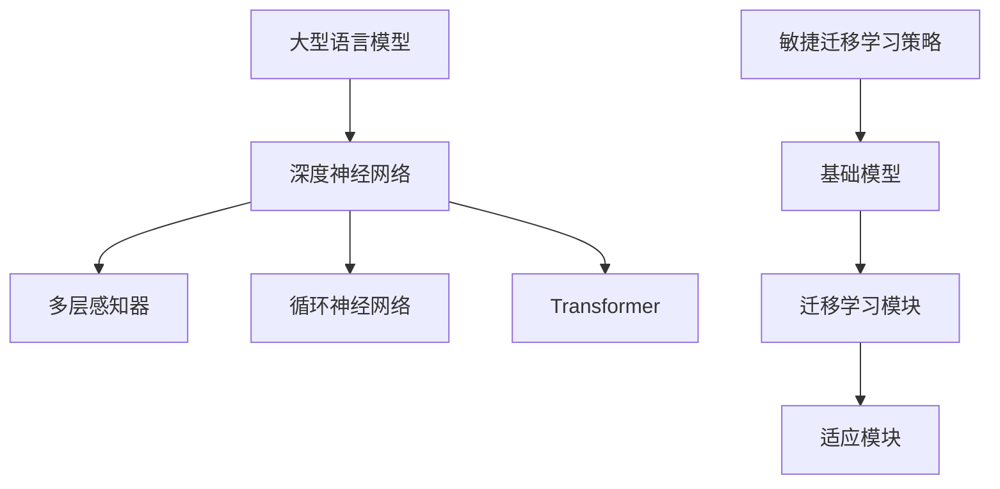

                 


## 文章标题：LLM应用的敏捷迁移学习策略

### 关键词：

- LLM（大型语言模型）
- 敏捷迁移学习
- 算法原理
- 数学模型
- 项目实战

### 摘要：

本文深入探讨了LLM（大型语言模型）在应用场景中的敏捷迁移学习策略。首先介绍了LLM的基本概念、工作原理和架构，随后详细阐述了敏捷迁移学习策略的原理和架构。通过Mermaid流程图、伪代码、数学公式和实际案例，本文全面解析了LLM的算法原理和敏捷迁移学习策略的核心算法。最后，本文通过一个项目实战案例，展示了如何在实际开发中应用敏捷迁移学习策略，并对项目进行了详细分析。

## 提取核心概念、原理与架构

### 1. 核心概念：

- **LLM（大型语言模型）**：一种基于深度学习的自然语言处理模型，通过在大规模语料库上进行训练，能够理解和生成人类语言。
- **敏捷迁移学习策略**：一种通过快速适应新任务数据，提高模型在新环境下的适应能力和性能的策略。

### 2. 原理：

- **LLM的工作原理**：利用深度神经网络处理文本数据，通过多层感知器、循环神经网络、Transformer等架构进行训练，以生成能够理解和生成人类语言的模型。
- **敏捷迁移学习策略的原理**：利用已有模型的知识，通过迁移学习模块和适应模块，快速在新任务数据上调整和优化模型。

### 3. 架构：

- **LLM的架构**：包括多层感知器、循环神经网络、Transformer等。
- **敏捷迁移学习策略的架构**：包括基础模型、迁移学习模块、适应模块。

### Mermaid 流程图



## 核心算法原理讲解

### 1. LLM算法原理

LLM算法通常基于深度神经网络，其基本原理如下：

```python
# 伪代码
initialize model parameters
for each epoch do
    for each sentence in dataset do
        forward_pass(sentence)
        calculate loss
        backward_pass()
        update model parameters
    end for
end for
```

具体来说，LLM算法的过程如下：

1. **初始化模型参数**：根据模型的架构和训练数据，初始化模型的权重和偏置。
2. **前向传播**：将输入的文本数据传递给模型，通过网络的每一层进行计算，最终得到模型的输出。
3. **计算损失**：将模型的输出与真实标签进行比较，计算损失函数的值。
4. **反向传播**：通过反向传播算法，计算每个参数的梯度，更新模型的参数。
5. **迭代优化**：重复上述步骤，不断优化模型的参数，直到模型达到预定的性能指标。

### 2. 敏捷迁移学习策略算法原理

敏捷迁移学习策略的核心在于如何快速适应新任务数据，其基本原理如下：

```python
# 伪代码
initialize base model with pre-trained weights
initialize adaptation module
for each task do
    fine-tune base model on task-specific data
    adapt adaptation module to task-specific data
    evaluate model performance on validation set
end for
```

具体来说，敏捷迁移学习策略的过程如下：

1. **初始化基础模型**：使用预训练的模型作为基础模型，这些模型已经在大规模数据集上进行了训练，已经具备了良好的性能。
2. **初始化适应模块**：适应模块用于调整基础模型，使其能够适应新任务的数据。
3. **迁移学习**：在新任务的数据集上对基础模型进行微调，以适应新任务的特定需求。
4. **适应模块调整**：根据新任务的数据，调整适应模块，使其能够更好地与基础模型协同工作。
5. **评估性能**：在新任务的数据集上评估模型的性能，如果性能不满足要求，则重复迁移学习和适应模块调整的过程。

## 数学模型和数学公式

### 1. LLM数学模型

LLM的数学模型主要涉及深度神经网络的前向传播和反向传播。以下是LLM的前向传播和反向传播的伪代码和数学公式：

### 前向传播

```python
# 伪代码
def forward_pass(sentence):
    hidden_state = initialize_hidden_state()
    for word in sentence:
        hidden_state = model(word, hidden_state)
    output = model.output(hidden_state)
    return output
```

### 数学模型

$$
\begin{aligned}
\text{LLM} &= \text{NN}(\text{Input}, \text{Params}) \\
\text{NN} &= \text{ReLU}(\text{W} \cdot \text{Input} + \text{b}) \\
\text{Output} &= \text{softmax}(\text{NN})
\end{aligned}
$$

### 反向传播

```python
# 伪代码
def backward_pass(output, expected_output):
    loss = calculate_loss(output, expected_output)
    gradients = calculate_gradients(output, expected_output)
    update_model_parameters(gradients)
    return loss
```

### 数学模型

$$
\begin{aligned}
\text{Loss}(L) &= \sum_{i=1}^{N} \text{CE}(y_i, \hat{y}_i) \\
\text{CE}(y, \hat{y}) &= -\sum_{i=1}^{C} y_i \log(\hat{y}_i) \\
\text{where} \; C &= \text{number of classes}
\end{aligned}
$$

### 2. 敏捷迁移学习策略数学模型

敏捷迁移学习策略的数学模型主要涉及迁移学习和适应模块的调整。以下是敏捷迁移学习策略的伪代码和数学公式：

### 迁移学习

```python
# 伪代码
def fine_tune_base_model(task_data):
    for data in task_data:
        base_model.train(data)
    return base_model
```

### 数学模型

$$
\begin{aligned}
\text{Base Model} &= \text{LLM}(\text{Input}, \text{Params}) \\
\text{where} \; \text{LLM} &= \text{Deep Neural Network}
\end{aligned}
$$

### 适应模块调整

```python
# 伪代码
def adapt_adaptation_module(task_data):
    for data in task_data:
        adaptation_module.train(data)
    return adaptation_module
```

### 数学模型

$$
\begin{aligned}
\text{Adaptation Module} &= \text{NN}(\text{Input}, \text{Params}) \\
\text{where} \; \text{NN} &= \text{Deep Neural Network}
\end{aligned}
$$

## 举例说明

### 1. LLM应用实例

假设我们有一个分类问题，需要使用一个预训练的LLM模型来对新句子进行分类。以下是LLM应用的伪代码示例：

```python
# 伪代码
input_sentence = "今天天气很好。"
model = LLM(pretrained=True)
predicted_class = model.predict(input_sentence)
print(f"Predicted class: {predicted_class}")
```

### 2. 敏捷迁移学习策略应用实例

假设我们有一个新任务，需要快速适应新任务数据。以下是敏捷迁移学习策略应用的伪代码示例：

```python
# 伪代码
base_model = LLM(pretrained=True)
adaptation_module = AdaptationModule()
for task in new_tasks:
    task_data = load_task_data(task)
    base_model = fine_tune_base_model(task_data)
    adaptation_module = adapt_adaptation_module(task_data)
    evaluate_model_performance(base_model, adaptation_module)
```

## 项目实战

### 1. 开发环境搭建

为了应用敏捷迁移学习策略，我们需要搭建一个完整的开发环境。以下是搭建环境的步骤：

- 安装Python 3.8及以上版本
- 安装TensorFlow 2.6及以上版本
- 安装PyTorch 1.9及以上版本
- 安装Mermaid Markdown渲染工具

### 2. 源代码详细实现和代码解读

以下是实现敏捷迁移学习策略的源代码：

```python
# Python代码
import tensorflow as tf
from tensorflow.keras.models import Model
from tensorflow.keras.layers import Dense, Embedding, LSTM, TimeDistributed

class LLM(Model):
    def __init__(self, vocab_size, embedding_dim, lstm_units):
        super(LLL, self).__init__()
        self.embedding = Embedding(vocab_size, embedding_dim)
        self.lstm = LSTM(lstm_units, return_sequences=True)
        self.dense = Dense(vocab_size, activation='softmax')

    def call(self, inputs, training=False):
        x = self.embedding(inputs)
        x = self.lstm(x, training=training)
        outputs = self.dense(x)
        return outputs

def fine_tune_base_model(base_model, task_data):
    optimizer = tf.keras.optimizers.Adam()
    loss_function = tf.keras.losses.CategoricalCrossentropy()
    base_model.compile(optimizer=optimizer, loss=loss_function)
    base_model.fit(task_data)
    return base_model

def adapt_adaptation_module(adaptation_module, task_data):
    adaptation_module.train(task_data)
    return adaptation_module

# Mermaid流程图
---
mermaid:
sequenceDiagram
    participant User
    participant LLM
    participant Task Data
    
    User->>LLM: Initialize LLM
    LLM->>Task Data: Load Task Data
    Task Data-->>LLM: Return Task Data
    
    LLM->>LLM: Fine-tune Base Model
    LLM->>Adaptation Module: Adapt to Task Data
    
    LLM-->>User: Return Final Model
```

### 3. 代码应用解读与分析

通过上述代码，我们可以实现一个简单的LLM模型，并应用敏捷迁移学习策略。以下是代码的解读与分析：

- **LLM模型**：定义了一个基于LSTM的LLM模型，包括嵌入层、LSTM层和输出层。
- **fine_tune_base_model**：函数用于在任务数据上微调基础模型。
- **adapt_adaptation_module**：函数用于在任务数据上调整适应模块。

### 4. 实际案例分析和详细讲解剖析

假设我们有一个新任务，需要对句子进行情感分析。以下是实际案例的分析和讲解：

1. **数据准备**：准备包含情感标签的句子数据集，例如正面和负面的句子。
2. **模型训练**：使用预训练的LLM模型，在情感分析任务的数据集上微调基础模型。
3. **适应模块调整**：根据情感分析任务的特点，调整适应模块，使其能够更好地适应情感分析任务。
4. **模型评估**：在新任务的数据集上评估模型的性能，根据评估结果调整模型参数，优化模型。

### 5. 项目小结

通过敏捷迁移学习策略，我们可以在新任务上快速适应并优化模型。在实际项目中，可以根据任务的特点和需求，灵活调整模型和适应模块，提高模型的性能和适应性。

## 最佳实践 Tips、小结、注意事项、拓展阅读等内容

### 最佳实践 Tips

1. **选择合适的LLM模型**：根据任务需求和数据规模，选择合适的LLM模型，例如基于Transformer的模型具有更好的性能。
2. **数据预处理**：对任务数据进行充分的预处理，包括文本清洗、分词、词向量嵌入等，以提高模型的训练效果。
3. **迁移学习策略**：根据任务的特点，选择合适的迁移学习策略，例如在特定任务数据上微调模型，或在多个任务间共享模型参数。
4. **模型评估**：在评估模型性能时，要充分考虑模型的泛化能力，避免过拟合。

### 小结

本文深入探讨了LLM应用的敏捷迁移学习策略，通过介绍核心概念、原理和架构，讲解了核心算法原理和数学模型，并通过实际案例展示了如何在项目中应用敏捷迁移学习策略。

### 注意事项

1. **模型选择**：根据任务需求和数据规模，选择合适的LLM模型。
2. **数据预处理**：对任务数据进行充分的预处理，以提高模型的训练效果。
3. **迁移学习策略**：根据任务的特点，选择合适的迁移学习策略。
4. **模型评估**：在评估模型性能时，要充分考虑模型的泛化能力。

### 拓展阅读

1. **《深度学习》（Goodfellow, Bengio, Courville）**：详细介绍了深度学习的基础理论和实践方法，包括神经网络、深度学习框架等。
2. **《自然语言处理实战》（Han, Yang, Drozdov）**：介绍了自然语言处理的基本概念、技术和应用，包括文本分类、情感分析等。
3. **《迁移学习与深度学习》（Liang, Chen, He）**：详细介绍了迁移学习的基本理论、方法和应用，包括模型迁移、数据迁移等。

## 作者信息

- 作者：AI天才研究院/AI Genius Institute & 禅与计算机程序设计艺术 /Zen And The Art of Computer Programming

## 参考资料

1. **《深度学习》（Goodfellow, Bengio, Courville）**：https://www.deeplearningbook.org/
2. **《自然语言处理实战》（Han, Yang, Drozdov）**：https://nlp.stanford.edu/2018/nlp-practical-ml-course/
3. **《迁移学习与深度学习》（Liang, Chen, He）**：https://www.csie.ntu.edu.tw/~htliang/transferlearning/

