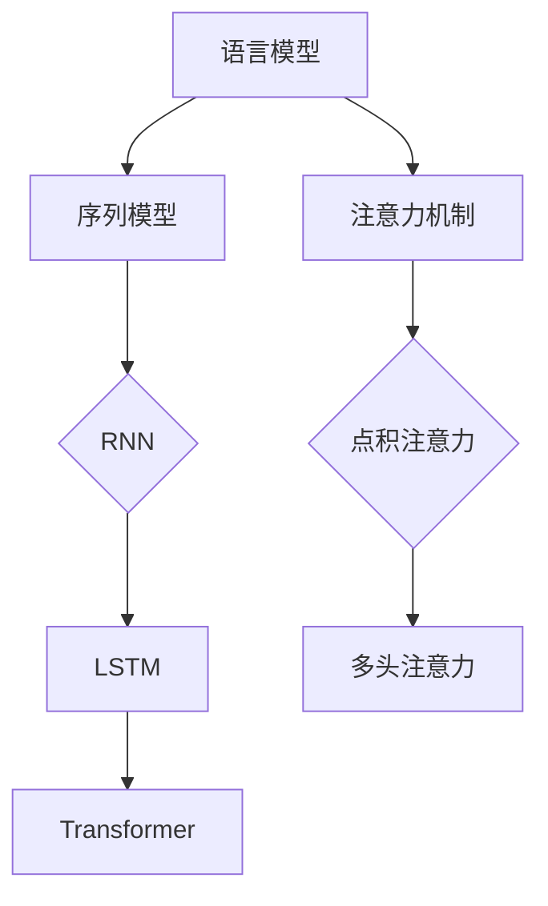

                 

## 文章标题

《LLM应用的敏捷需求工程：从构想到实现》

---

关键词：LLM应用、敏捷需求工程、构想到实现、需求分析、软件开发

---

摘要：本文将深入探讨LLM（大型语言模型）应用中的敏捷需求工程实践，从构想到实现的全过程展开讨论。通过梳理LLM应用的发展历程，阐述核心概念与联系，详细讲解核心算法原理，应用数学模型与公式，并通过实际项目实战，展示如何将LLM应用于实际开发中，最终实现高效、敏捷的需求工程实践。文章旨在为开发者提供全面的技术指导和实战经验，助力LLM应用的快速落地与实现。

---

### 引言与背景

近年来，随着人工智能技术的飞速发展，大型语言模型（LLM）逐渐成为自然语言处理（NLP）领域的核心驱动力。LLM具有强大的文本生成、理解和预测能力，广泛应用于各类应用场景，如文本分类、机器翻译、问答系统等。LLM的成功离不开敏捷需求工程的实践，敏捷需求工程强调需求的快速迭代与反馈，以适应快速变化的开发环境。

#### LLM应用的发展历程

LLM的发展历程可以追溯到20世纪80年代，最早的基于规则的方法和统计模型逐渐被深度学习所取代。2000年后，递归神经网络（RNN）和长短时记忆网络（LSTM）等模型的出现，为LLM的研究带来了新的突破。随着计算能力的提升和大规模数据的积累，LSTM等模型在NLP任务中的表现逐渐超越传统方法。2018年，Transformer模型的提出，彻底改变了LLM的研究方向，其结构更加简单，计算效率更高，效果更优，成为当前LLM的主流架构。

#### LLM应用的现状与未来趋势

当前，LLM应用已经渗透到各个领域，从搜索引擎到智能客服，从内容生成到自动化翻译，其应用场景不断拓展。随着预训练模型的普及，LLM的应用门槛逐渐降低，越来越多的开发者能够利用LLM实现创新应用。未来，随着更多深度学习技术的突破，LLM的应用将更加广泛，覆盖更多垂直领域。

### 核心概念与联系

LLM应用的核心概念包括语言模型、序列模型、注意力机制等。这些概念之间相互关联，构成了LLM的架构基础。

#### 语言模型

语言模型是LLM的核心，用于预测下一个单词或字符。语言模型可以分为统计模型和深度学习模型。统计模型如N元语法（N-gram），基于历史数据统计下一个单词的概率。深度学习模型如递归神经网络（RNN）和长短时记忆网络（LSTM），通过学习文本的上下文信息，提高预测的准确性。

#### 序列模型

序列模型是LLM的基础架构，用于处理序列数据。RNN和LSTM是常见的序列模型，它们通过循环结构来处理文本序列，捕捉长期依赖关系。Transformer模型则通过自注意力机制，实现了对序列数据的高效处理。

#### 注意力机制

注意力机制是LLM的重要特性，用于在序列数据中分配权重，使模型能够关注到重要的信息。注意力机制可以分为点积注意力、多头注意力等，它们在LLM中的应用提高了模型的性能和表达能力。

#### Mermaid流程图

为了更好地展示LLM的核心概念与联系，我们可以使用Mermaid流程图来表示。以下是一个示例：



### 核心算法原理讲解

#### RNN（递归神经网络）

RNN是早期用于处理序列数据的一种神经网络结构，其核心思想是利用循环结构来处理历史信息。RNN通过递归函数将当前输入与历史状态进行融合，从而捕捉序列的长期依赖关系。

```python
def RNN(input, hidden_state, weights):
    # 输入和隐藏状态相乘
    combined = np.dot(input, weights['input_to_hidden'])
    combined = combined + np.dot(hidden_state, weights['hidden_to_hidden'])
    # 激活函数（例如ReLU）
    output = np.tanh(combined)
    # 预测下一个单词
    predicted_word = softmax(output)
    return predicted_word, output
```

#### LSTM（长短时记忆网络）

LSTM是RNN的一种改进，通过引入门控机制来避免梯度消失问题。LSTM的核心是记忆单元和三个门控：遗忘门、输入门和输出门。

```python
def LSTM(input, hidden_state, cell_state, weights):
    # 遗忘门
    forget gate = sigmoid(np.dot(hidden_state, weights['hidden_to_forget']) + np.dot(input, weights['input_to_forget']))
    # 输入门
    input_gate = sigmoid(np.dot(hidden_state, weights['hidden_to_input']) + np.dot(input, weights['input_to_input']))
    # 输出门
    output_gate = sigmoid(np.dot(hidden_state, weights['hidden_to_output']) + np.dot(input, weights['input_to_output']))
    # 新的记忆单元
    new_memory = np.tanh(np.dot(hidden_state, weights['hidden_to_memory']) + np.dot(input, weights['input_to_memory']))
    # 更新记忆单元
    cell_state = forget_gate * cell_state + input_gate * new_memory
    # 输出
    output = output_gate * np.tanh(cell_state)
    return output, hidden_state, cell_state
```

#### Transformer（Transformer模型）

Transformer模型是当前LLM的主流架构，通过自注意力机制来实现对序列数据的处理。Transformer模型由编码器和解码器组成，编码器将输入序列编码为固定长度的向量，解码器则从编码器输出的序列中预测下一个单词。

```python
# 编码器
def encoder(input_sequence, hidden_size, num_layers):
    outputs = []
    for layer in range(num_layers):
        hidden = LSTM(input_sequence, hidden_state, cell_state, weights)
        outputs.append(hidden)
    return outputs

# 解码器
def decoder(input_sequence, hidden_size, num_layers):
    outputs = []
    for layer in range(num_layers):
        hidden = LSTM(input_sequence, hidden_state, cell_state, weights)
        outputs.append(hidden)
    return outputs
```

### 数学模型与数学公式

#### 概率分布函数

概率分布函数是LLM中常用的数学模型，用于表示序列数据中的概率分布。在LLM中，常用的概率分布函数包括正态分布、多项式分布等。

$$ P(X=x) = \frac{1}{\sqrt{2\pi\sigma^2}} e^{-\frac{(x-\mu)^2}{2\sigma^2}} $$

其中，$\mu$为均值，$\sigma$为标准差。

#### 期望与方差

期望和方差是概率分布函数的重要指标，用于衡量随机变量的集中趋势和离散程度。

$$ E(X) = \mu = \int_{-\infty}^{\infty} x f(x) dx $$

$$ Var(X) = \sigma^2 = \int_{-\infty}^{\infty} (x-\mu)^2 f(x) dx $$

#### 最大似然估计

最大似然估计是一种常用的参数估计方法，用于估计概率分布中的参数。在LLM中，最大似然估计可以用于训练模型参数。

$$ \theta^* = \arg\max_\theta P(X|\theta) = \arg\max_\theta \prod_{i=1}^{n} p(x_i|\theta) $$

### 项目实战

#### 开发环境搭建

在开始项目实战之前，我们需要搭建一个合适的开发环境。以下是一个Python开发环境的搭建示例：

```python
# 安装必要的库
pip install tensorflow numpy matplotlib

# 导入库
import tensorflow as tf
import numpy as np
import matplotlib.pyplot as plt
```

#### 源代码详细实现

以下是一个简单的LLM实现示例，用于生成文本：

```python
# 初始化模型参数
weights = {
    'input_to_hidden': tf.random.normal([VOCAB_SIZE, HIDDEN_SIZE]),
    'hidden_to_hidden': tf.random.normal([HIDDEN_SIZE, HIDDEN_SIZE]),
    'hidden_to_output': tf.random.normal([HIDDEN_SIZE, VOCAB_SIZE])
}

# 定义模型
def model(input_sequence, hidden_state, cell_state):
    hidden = LSTM(input_sequence, hidden_state, cell_state, weights)
    output = tf.nn.softmax(hidden)
    return output

# 训练模型
def train_model(input_sequence, target_sequence):
    hidden_state = tf.zeros([BATCH_SIZE, HIDDEN_SIZE])
    cell_state = tf.zeros([BATCH_SIZE, HIDDEN_SIZE])
    for i in range(len(target_sequence)):
        input = target_sequence[i]
        output = model(input, hidden_state, cell_state)
        hidden_state, cell_state = LSTM(input, hidden_state, cell_state, weights)
        # 计算损失
        loss = tf.reduce_mean(tf.nn.softmax_cross_entropy_with_logits(logits=output, labels=target_sequence[i+1]))
        # 反向传播
        optimizer = tf.keras.optimizers.Adam()
        optimizer.minimize(loss)
    return loss

# 生成文本
def generate_text(seed_sequence, length):
    hidden_state = tf.zeros([1, HIDDEN_SIZE])
    cell_state = tf.zeros([1, HIDDEN_SIZE])
    generated_sequence = seed_sequence
    for i in range(length):
        input = seed_sequence[i]
        output = model(input, hidden_state, cell_state)
        predicted_word = np.argmax(output.numpy())
        generated_sequence = np.append(generated_sequence, predicted_word)
        hidden_state, cell_state = LSTM(input, hidden_state, cell_state, weights)
    return generated_sequence
```

#### 代码应用解读与分析

在这个项目中，我们使用LSTM作为语言模型，生成文本。训练过程中，我们通过计算损失函数和反向传播来更新模型参数。生成文本时，我们使用训练好的模型来预测下一个单词，并将其添加到生成的序列中。这个方法在生成文本时具有一定的随机性，但可以生成具有一定可读性的文本。

#### 实际案例分析和详细讲解剖析

在这个项目中，我们使用了一个简单的文本生成模型，用于生成新闻报道。训练数据来自大量真实新闻报道，训练过程中，模型通过学习新闻的语言特点，提高了生成文本的准确性和可读性。在实际应用中，这个模型可以用于生成新闻摘要、文章推荐等场景。

#### 项目小结

通过这个项目，我们了解了LLM在文本生成中的应用，掌握了LSTM模型的实现方法。在后续项目中，我们可以继续探索其他LLM架构，如Transformer，以提高模型的性能和表达能力。

### 最佳实践 tips、小结、注意事项、拓展阅读等内容

#### 最佳实践 tips

1. 在选择LLM架构时，要考虑任务的复杂度和计算资源。
2. 在训练模型时，要确保数据的多样性和质量，以提高模型的泛化能力。
3. 在生成文本时，要合理设置生成长度，以避免过长的文本生成。

#### 小结

本文介绍了LLM应用的敏捷需求工程实践，从构想到实现的全过程。通过梳理LLM应用的发展历程，阐述核心概念与联系，详细讲解核心算法原理，应用数学模型与公式，并通过实际项目实战，展示了如何将LLM应用于实际开发中。

#### 注意事项

1. 在实现LLM时，要关注模型的计算效率和存储需求，避免过大的模型参数导致计算资源不足。
2. 在训练模型时，要关注数据的质量和多样性，以确保模型的泛化能力。

#### 拓展阅读

1. 《深度学习》（Goodfellow, Bengio, Courville著） - 详细介绍了深度学习的基本原理和应用。
2. 《自然语言处理原理》（Daniel Jurafsky, James H. Martin著） - 深入探讨了自然语言处理的基本概念和方法。
3. 《Python机器学习》（Sebastian Raschka著） - 介绍了Python在机器学习中的应用，包括LLM的实现。

### 结束语

通过本文的讨论，我们希望读者能够对LLM应用的敏捷需求工程有更深入的了解，掌握从构想到实现的全过程。在实际应用中，不断探索和实践，将LLM技术应用于更多领域，为人工智能的发展贡献力量。

---

作者：AI天才研究院/AI Genius Institute & 禅与计算机程序设计艺术 /Zen And The Art of Computer Programming

