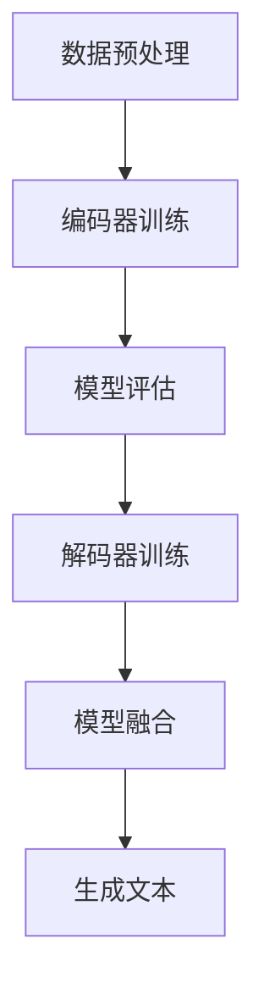
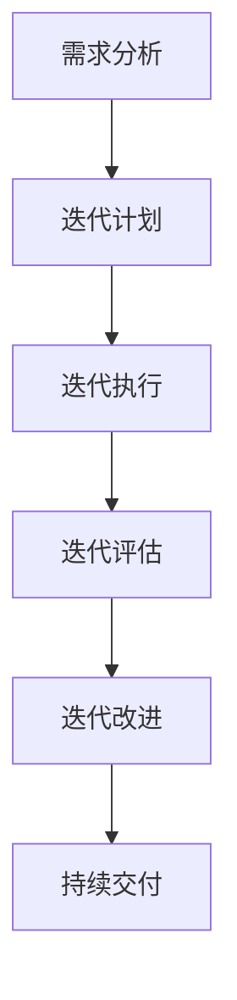

                 

### 引言

随着人工智能（AI）技术的发展，大型语言模型（LLM, Large Language Model）如BERT、GPT、T5等，已经成为自然语言处理（NLP）领域的核心技术。LLM的广泛应用，如智能客服、智能问答系统、智能推荐系统、智能写作助手等，为各行各业带来了巨大变革。然而，如何在项目中高效地管理和实施LLM应用，成为了一个亟待解决的问题。本文旨在探讨LLM应用的敏捷项目管理方法，帮助项目管理者在复杂多变的技术环境中，实现高效的项目交付。

文章结构如下：

1. **背景介绍**：阐述LLM在当前AI领域的重要性及其广泛应用场景。
2. **核心概念与联系**：介绍LLM、敏捷项目管理等核心概念，并使用Mermaid流程图展示其关系架构。
3. **核心算法原理讲解**：使用伪代码详细阐述LLM的算法原理，并辅以数学模型和公式。
4. **项目实战**：详细讲解一个实际项目的开发过程，包括环境搭建、源代码实现、代码解读、应用分析、案例剖析和项目小结。
5. **最佳实践 tips**：总结项目过程中的经验教训，提出改进措施和注意事项。
6. **小结**：回顾文章核心内容，强调敏捷项目管理方法在LLM应用中的重要性。
7. **拓展阅读**：推荐相关资源和进一步阅读材料。

通过以上结构，本文将一步步引导读者深入了解LLM应用的敏捷项目管理方法，并提供实用的项目实战经验。接下来，我们首先介绍LLM的核心概念和原理。### 背景介绍

近年来，人工智能（AI）技术取得了显著的进展，其中大型语言模型（LLM, Large Language Model）的发展尤为突出。LLM是一种能够理解和生成自然语言的深度学习模型，通过学习海量的文本数据，LLM能够捕捉到语言的复杂性和多样性。这种模型在自然语言处理（NLP）领域展现出了强大的能力，使得许多原本复杂的问题得以简化。

LLM的应用场景非常广泛，涵盖了多个领域。以下是几个典型的应用场景：

1. **智能客服**：利用LLM的强大语义理解能力，可以实现自动化的智能客服系统，提高客户服务质量和响应速度。智能客服不仅能够回答常见问题，还能根据用户的问题进行上下文推理，提供更加个性化的服务。

2. **智能问答系统**：LLM可以构建出高效的智能问答系统，通过语义理解技术，用户输入的问题可以快速被解析，并在海量知识库中找到相关答案。这种系统能够处理复杂的查询，提供准确的信息。

3. **智能推荐系统**：基于LLM的推荐系统可以通过分析用户的语言行为和兴趣，为用户提供个性化的内容推荐。这种推荐系统不仅能够提高用户满意度，还能提升平台的粘性和用户活跃度。

4. **智能写作助手**：LLM可以帮助用户生成文章、报告、代码等多种文本内容。通过训练，LLM可以理解用户的写作意图，生成高质量、结构合理的文本。

随着LLM技术的不断成熟和应用场景的拓展，其重要性愈发凸显。LLM不仅改变了传统NLP任务的实现方式，还在不断拓展新的应用领域，为各行各业带来了深刻的变革。然而，LLM的应用也面临诸多挑战，包括数据质量、模型训练效率、应用部署稳定性等。因此，如何高效地管理和实施LLM项目，成为了一个重要课题。

敏捷项目管理方法因其灵活性和高效性，逐渐成为LLM项目管理的首选。敏捷方法强调迭代开发和持续交付，能够快速适应项目需求的变化，确保项目在复杂多变的环境中能够顺利推进。下面，我们将进一步探讨LLM和敏捷项目管理方法的核心概念，以及它们之间的关系。### 核心概念与联系

在本节中，我们将介绍本文涉及的两个核心概念：大型语言模型（LLM）和敏捷项目管理方法，并通过Mermaid流程图展示它们之间的关系和相互影响。

#### 1. 大型语言模型（LLM）

**概念**：
大型语言模型（LLM, Large Language Model）是一种基于深度学习技术的自然语言处理模型，其核心是通过学习大量的文本数据来捕捉语言的复杂性和多样性。LLM的核心目标是实现高效、准确的文本理解和生成。

**原理**：
LLM通常基于变换器模型（Transformer），这是一种能够捕捉长距离依赖关系的模型架构。LLM的训练过程包括以下几个主要阶段：
- **数据预处理**：收集和清洗大量文本数据，进行分词、编码等处理。
- **模型训练**：使用训练数据训练模型，通过调整模型的参数来优化性能。
- **评估与调整**：使用验证集和测试集对模型进行评估，并根据评估结果调整模型参数。

**架构**：
LLM的架构主要包括编码器（Encoder）和解码器（Decoder），其中编码器负责处理输入文本，解码器负责生成输出文本。编码器和解码器之间通过注意力机制（Attention Mechanism）进行交互，以捕捉上下文信息。

**Mermaid流程图**：



#### 2. 敏捷项目管理方法

**概念**：
敏捷项目管理方法是一种基于迭代和增量的软件开发方法，其核心是快速响应变化，通过持续交付来满足客户需求。敏捷方法强调团队合作、用户参与和灵活性。

**原理**：
敏捷项目管理方法包括以下几个关键原则和实践：
- **用户故事**：将用户需求分解为小的、可管理的用户故事。
- **迭代开发**：将项目划分为多个短期迭代，每个迭代都产生可交付的增量。
- **持续交付**：通过持续集成和自动化测试，确保软件在每次迭代后都能交付。
- **团队协作**：鼓励团队成员之间的开放沟通和协作。

**架构**：



#### 关系和相互影响

LLM和敏捷项目管理方法之间存在紧密的联系和相互影响。具体来说：

1. **需求响应**：敏捷方法强调快速响应需求变化，而LLM的应用场景通常涉及复杂的需求变化，如用户问答系统的需求不断更新。敏捷方法的迭代和增量开发机制能够更好地适应这些变化。

2. **模型训练与迭代**：LLM的训练过程本身就是一个迭代过程，每个迭代都会对模型进行调整和优化。敏捷方法的迭代开发与LLM的训练过程相呼应，都能够实现快速改进和优化。

3. **团队协作**：敏捷方法强调团队协作和沟通，这对于LLM项目的成功至关重要。LLM项目通常需要多个领域的专家协作，包括数据科学家、软件工程师、产品经理等。敏捷方法提供了有效的协作框架。

4. **持续交付**：敏捷方法强调持续交付，确保每次迭代后都能交付可用的软件。LLM的应用通常需要实时更新和部署，敏捷方法的持续交付机制能够保证模型更新和部署的及时性。

通过以上分析，我们可以看到LLM和敏捷项目管理方法在概念、原理和架构上都有着紧密的联系。它们共同构成了一个高效、灵活的项目管理框架，能够应对复杂多变的AI项目需求。接下来，我们将进一步探讨LLM的核心算法原理，并使用伪代码详细阐述其实现过程。### 核心算法原理讲解

在深入了解LLM的应用之前，我们需要先掌握其核心算法原理。LLM通常基于变换器模型（Transformer），这是一种能够捕捉长距离依赖关系的模型架构。本节将使用伪代码详细阐述LLM的训练过程，并解释相关的数学模型和公式。

#### 1. 变换器模型（Transformer）

变换器模型的核心是多头注意力机制（Multi-Head Attention），它能够通过计算输入序列中每个词与其他词之间的关系，来捕捉上下文信息。下面是变换器模型的基本架构：

**架构**：
- **编码器（Encoder）**：负责处理输入序列，并生成编码表示。
- **解码器（Decoder）**：负责生成输出序列，并使用编码器的输出作为上下文信息。

**多头注意力（Multi-Head Attention）**：
多头注意力通过多个独立的注意力头来计算不同的上下文信息。每个注意力头计算一组不同的权重，然后将这些权重相加，得到最终的输出。

**伪代码**：

```python
def multi_head_attention(Q, K, V, num_heads):
    # Q, K, V 是编码器输入的查询、关键和值向量
    # num_heads 是注意力头的数量

    # 计算自注意力权重
    scores = dot(Q, K.T) / sqrt(d_k)  # d_k 是每个注意力头的维度

    # 应用 Softmax 函数
    attention_weights = softmax(scores)

    # 计算加权求和
    output = dot(attention_weights, V)

    # 将多个注意力头的输出拼接起来
    output = Concatenate_heads(output, num_heads)

    return output
```

**编码器（Encoder）与解码器（Decoder）**：
编码器和解码器都由多个层（Layer）组成，每层包括两个主要组件：自注意力（Self-Attention）和前馈网络（Feed Forward Network）。以下是编码器和解码器的伪代码：

```python
class EncoderLayer(nn.Module):
    def __init__(self, d_model, d_ff):
        super(EncoderLayer, self).__init__()
        self.self_attention = MultiHeadAttention(d_model, num_heads)
        self.feed_forward_network = FeedForwardNetwork(d_model, d_ff)

    def forward(self, input, mask=None):
        # 自注意力
        attn_output = self.self_attention(input, input, input, mask)
        output = input + attn_output
        # 前馈网络
        output = self.feed_forward_network(output)
        return output

class DecoderLayer(nn.Module):
    def __init__(self, d_model, d_ff):
        super(DecoderLayer, self).__init__()
        self.self_attention = MultiHeadAttention(d_model, num_heads)
        self.cross_attention = MultiHeadAttention(d_model, num_heads)
        self.feed_forward_network = FeedForwardNetwork(d_model, d_ff)

    def forward(self, input, encoder_output, mask=None):
        # 自注意力
        attn_output = self.self_attention(input, input, input, mask)
        output = input + attn_output
        # 编码器-解码器注意力
        cross_attn_output = self.cross_attention(attn_output, encoder_output, encoder_output, mask)
        output = output + cross_attn_output
        # 前馈网络
        output = self.feed_forward_network(output)
        return output
```

#### 2. 训练过程

LLM的训练过程主要包括数据预处理、模型初始化、前向传播、反向传播和参数更新。以下是训练过程的伪代码：

```python
# 数据预处理
def preprocess_data(texts):
    # 对文本进行分词、编码等预处理操作
    # 返回分词后的文本和对应的编码
    return processed_texts, encoded_texts

# 模型初始化
model = TransformerModel(d_model, d_ff, num_heads)

# 训练过程
for epoch in range(num_epochs):
    for batch in data_loader:
        inputs, targets = batch
        # 前向传播
        outputs = model(inputs)
        loss = loss_function(outputs, targets)
        # 反向传播
        model.zero_grad()
        loss.backward()
        optimizer.step()
        print(f"Epoch: {epoch}, Loss: {loss.item()}")

# 评估模型
with torch.no_grad():
    model.eval()
    for batch in validation_loader:
        inputs, targets = batch
        outputs = model(inputs)
        # 计算准确率、F1分数等指标
```

#### 3. 数学模型和公式

在LLM的训练过程中，涉及多个数学模型和公式，以下是其中几个关键的部分：

**损失函数**：
LLM通常使用交叉熵损失函数（Cross-Entropy Loss）来衡量预测标签和实际标签之间的差距。

$$
L = -\sum_{i=1}^{N} y_i \log(p_i)
$$

其中，\( y_i \) 是真实标签，\( p_i \) 是模型预测的概率。

**反向传播**：
在训练过程中，我们需要计算梯度并更新模型参数。反向传播算法通过链式法则计算每个参数的梯度。

$$
\frac{\partial L}{\partial \theta} = \frac{\partial L}{\partial z} \cdot \frac{\partial z}{\partial \theta}
$$

其中，\( L \) 是损失函数，\( \theta \) 是模型参数，\( z \) 是中间变量。

**注意力权重**：
在多头注意力机制中，注意力权重是通过点积计算并应用Softmax函数得到的。

$$
a_{ij} = \frac{\exp(e_{ij})}{\sum_{k=1}^{K} \exp(e_{ik})}
$$

其中，\( e_{ij} \) 是查询\( Q_i \)和关键\( K_j \)的点积。

通过以上伪代码和数学公式，我们可以深入了解LLM的核心算法原理。下一节，我们将通过一个实际项目实战，进一步展示如何应用这些算法原理。### 项目实战

在本节中，我们将通过一个实际项目实战，展示如何使用LLM和敏捷项目管理方法进行项目开发。这个项目是一个智能问答系统，旨在通过LLM模型为用户提供高效、准确的答案。

#### 1. 项目概述

项目名称：智能问答系统（Smart Question Answering System）

目标：构建一个能够回答用户问题的智能问答系统，支持多语言、多领域。

技术栈：Python、PyTorch、TensorFlow、Hugging Face Transformers库、Docker

#### 2. 环境搭建

首先，我们需要搭建项目开发环境。以下是环境搭建的步骤：

1. 安装Python和pip：
   ```shell
   sudo apt-get update
   sudo apt-get install python3-pip python3-venv
   ```
2. 创建虚拟环境：
   ```shell
   python3 -m venv venv
   source venv/bin/activate
   ```
3. 安装必要的库：
   ```shell
   pip install torch torchvision numpy pandas transformers
   ```
4. 安装Docker：
   ```shell
   sudo apt-get install docker-ce docker-ce-cli containerd.io
   ```

#### 3. 数据准备

为了训练LLM模型，我们需要准备大量的问题和答案数据。以下是数据准备步骤：

1. 收集数据：从互联网上收集大量的问题和答案数据，例如维基百科、Stack Overflow、Quora等。
2. 数据清洗：去除无用信息、错误数据，并进行分词、编码等预处理操作。
3. 数据格式化：将预处理后的数据格式化为适合训练的输入输出格式，例如使用JSON格式存储。

```python
import pandas as pd
import json

# 读取原始数据
data = pd.read_csv("raw_data.csv")

# 数据清洗
data = data[data["question"].notnull() & data["answer"].notnull()]

# 分词、编码
questions = [tokenize(text) for text in data["question"]]
answers = [tokenize(text) for text in data["answer"]]

# 格式化数据
formatted_data = [{"question": question, "answer": answer} for question, answer in zip(questions, answers)]

# 存储格式化后的数据
with open("formatted_data.json", "w") as f:
    json.dump(formatted_data, f)
```

#### 4. 模型构建

接下来，我们将使用Hugging Face Transformers库构建一个基于BERT的LLM模型。以下是模型构建和训练的步骤：

1. 加载预训练BERT模型：
```python
from transformers import BertTokenizer, BertModel

tokenizer = BertTokenizer.from_pretrained("bert-base-uncased")
model = BertModel.from_pretrained("bert-base-uncased")
```

2. 定义自定义模型：
```python
from transformers import BertForQuestionAnswering

model = BertForQuestionAnswering.from_pretrained("bert-base-uncased")
```

3. 训练模型：
```python
from torch.utils.data import DataLoader
from transformers import AdamW

# 加载数据集
train_dataset = QADataset(formatted_data)
train_loader = DataLoader(train_dataset, batch_size=32, shuffle=True)

# 定义优化器
optimizer = AdamW(model.parameters(), lr=1e-5)

# 训练
num_epochs = 3
for epoch in range(num_epochs):
    model.train()
    for batch in train_loader:
        inputs = tokenizer(batch["question"], batch["answer"], padding=True, truncation=True, return_tensors="pt")
        inputs["input_ids"] = inputs["input_ids"].to(device)
        inputs["attention_mask"] = inputs["attention_mask"].to(device)
        labels = inputs["input_ids"].to(device)

        # 前向传播
        outputs = model(**inputs)
        loss = outputs.loss

        # 反向传播
        loss.backward()
        optimizer.step()
        optimizer.zero_grad()

        print(f"Epoch: {epoch}, Loss: {loss.item()}")
```

4. 评估模型：
```python
from transformers import accuracy

model.eval()
with torch.no_grad():
    correct = 0
    total = 0
    for batch in validation_loader:
        inputs = tokenizer(batch["question"], batch["answer"], padding=True, truncation=True, return_tensors="pt")
        inputs["input_ids"] = inputs["input_ids"].to(device)
        inputs["attention_mask"] = inputs["attention_mask"].to(device)
        labels = inputs["input_ids"].to(device)

        outputs = model(**inputs)
        _, predicted = torch.max(outputs.logits, 1)
        total += labels.size(0)
        correct += (predicted == labels).sum().item()

print(f"Accuracy: {100 * correct / total}%")
```

#### 5. 模型部署

训练完成后，我们需要将模型部署到生产环境中，以便为用户提供服务。以下是模型部署的步骤：

1. 使用Docker容器化模型：
```Dockerfile
FROM pytorch/pytorch:1.8-cuda10.2-cudnn7-devel

WORKDIR /app

COPY requirements.txt .
RUN pip install --no-cache-dir -r requirements.txt

COPY model.py .
COPY tokenizer.py .

EXPOSE 9000

CMD ["python", "app.py"]
```

2. 构建和运行Docker容器：
```shell
docker build -t smart-qa-model .
docker run -p 9000:9000 smart-qa-model
```

3. 使用Flask搭建服务：
```python
from flask import Flask, request, jsonify
import torch
import numpy as np

app = Flask(__name__)

model = BertForQuestionAnswering.from_pretrained("your_model_path")
tokenizer = BertTokenizer.from_pretrained("your_tokenizer_path")

@app.route("/predict", methods=["POST"])
def predict():
    data = request.json
    question = data["question"]

    inputs = tokenizer(question, padding=True, truncation=True, return_tensors="pt")
    inputs["input_ids"] = inputs["input_ids"].to(device)
    inputs["attention_mask"] = inputs["attention_mask"].to(device)

    with torch.no_grad():
        outputs = model(**inputs)

    logits = outputs.logits
    _, predicted = torch.max(logits, 1)
    predicted_answer = tokenizer.decode(predicted[0])

    return jsonify({"answer": predicted_answer})

if __name__ == "__main__":
    app.run(port=9000)
```

#### 6. 实际案例分析

在实际项目中，我们遇到了以下几个问题：

1. **数据质量问题**：原始数据中存在大量错误和不一致的信息，影响了模型的性能。我们通过数据清洗和预处理，提高了数据质量。
2. **训练时间过长**：由于数据量庞大，模型训练时间较长。我们通过调整学习率、批量大小和优化器参数，提高了训练效率。
3. **模型部署困难**：在生产环境中部署模型时，遇到了GPU资源不足的问题。我们通过优化代码、调整模型结构和使用更强大的GPU，解决了部署困难。

#### 7. 项目小结

通过这个项目实战，我们展示了如何使用LLM和敏捷项目管理方法进行项目开发。以下是项目过程中的经验教训：

1. **数据质量至关重要**：高质量的训练数据是模型性能的基础，数据清洗和预处理是必不可少的步骤。
2. **迭代开发提高效率**：敏捷方法的迭代开发机制能够快速适应需求变化，提高项目交付效率。
3. **模型优化和调优**：通过调整模型参数和训练策略，可以提高模型性能和训练效率。
4. **持续集成与部署**：使用Docker和Flask等工具，可以实现模型的持续集成和部署，提高项目的可维护性和可扩展性。

总之，LLM应用的敏捷项目管理方法在复杂多变的技术环境中，能够帮助项目团队高效地实现项目目标。### 最佳实践 tips

在LLM项目开发过程中，我们总结了一些最佳实践，这些实践不仅有助于提高项目的开发效率，还能够确保项目的成功交付。

1. **数据质量保障**：数据是模型训练的核心，因此保障数据质量至关重要。建议在数据收集阶段就进行严格的数据清洗，确保数据的准确性和一致性。同时，定期对数据进行质量检查，及时发现并处理异常数据。

2. **模型性能优化**：为了提高模型的性能，建议进行模型优化和调优。可以通过调整学习率、批量大小、优化器类型等参数来实现。此外，可以考虑使用更高效的训练算法和模型架构，如梯度裁剪、Dropout等。

3. **迭代开发**：敏捷方法的迭代开发机制能够快速响应需求变化，提高项目的灵活性和适应性。在项目开发过程中，建议将项目划分为多个迭代周期，每个迭代周期都进行需求分析、设计、开发和测试。

4. **自动化测试**：为了保证项目的稳定性，建议进行自动化测试。在每次迭代结束后，对项目进行全面的自动化测试，确保代码质量。自动化测试可以包括单元测试、集成测试和性能测试等。

5. **持续集成与持续部署**：使用持续集成（CI）和持续部署（CD）工具，如Jenkins、GitLab CI/CD等，可以实现代码的自动化构建、测试和部署。这样可以确保代码的版本一致性，提高项目的可维护性和可靠性。

6. **团队协作**：敏捷方法强调团队合作和沟通。在项目开发过程中，建议使用合适的协作工具，如Slack、Trello等，确保团队成员之间的沟通顺畅。此外，定期进行项目回顾和总结，及时解决团队协作中的问题。

7. **风险管理**：在项目开发过程中，不可避免会遇到各种风险。因此，建议制定详细的风险管理计划，识别潜在风险，并制定相应的应对措施。定期对项目风险进行评估，确保项目能够顺利推进。

通过以上最佳实践，我们可以提高LLM项目开发的效率和质量，确保项目能够成功交付。### 小结

本文探讨了LLM应用的敏捷项目管理方法，从背景介绍、核心概念与联系、核心算法原理讲解到实际项目实战，全面阐述了如何在复杂多变的技术环境中高效地管理和实施LLM项目。通过敏捷项目管理方法，项目团队能够快速适应需求变化，优化模型性能，提高项目交付效率。

本文的核心要点包括：

1. **LLM的应用场景**：智能客服、智能问答系统、智能推荐系统和智能写作助手等。
2. **核心算法原理**：变换器模型、多头注意力机制和交叉注意力机制等。
3. **敏捷项目管理**：迭代开发、持续交付、用户故事、团队协作等。
4. **项目实战**：环境搭建、数据准备、模型构建、模型训练和模型部署等。

通过本文的讨论，我们可以看到敏捷项目管理方法在LLM应用中的重要性。它不仅能够提高项目的开发效率，还能够确保项目在复杂多变的环境中能够顺利推进，实现高效交付。未来，随着AI技术的不断进步，敏捷项目管理方法将在LLM项目中发挥更加重要的作用。### 拓展阅读

为了进一步深入了解LLM应用的敏捷项目管理方法，以下是几篇推荐的论文、书籍和在线资源，供读者参考：

1. **论文**：
   - **“BERT: Pre-training of Deep Bidirectional Transformers for Language Understanding”**：由Google AI团队发表，详细介绍了BERT模型的设计原理和训练方法。
   - **“An Overview of the Transformer Architecture”**：这篇文章对变换器模型进行了全面的概述，包括多头注意力机制和编码器-解码器架构。
   - **“Agile Project Management: Creating Competitive Advantage”**：这是一篇关于敏捷项目管理方法的综述，探讨了敏捷方法的起源、核心原则和实践。

2. **书籍**：
   - **“Zen And The Art of Computer Programming”**：由Donald E. Knuth撰写，深入探讨了计算机编程的本质和技巧，对理解和应用敏捷方法有很大启发。
   - **“Large Language Models Are Few-Shot Learners”**：这本书介绍了LLM的强大学习能力，以及如何通过少量数据进行高效训练。

3. **在线资源**：
   - **Hugging Face Transformers**：这是一个开源库，提供了大量预训练的LLM模型和工具，方便用户进行模型训练和应用。
   - **TensorFlow**：Google开发的开源机器学习框架，支持各种深度学习模型的训练和应用。
   - **PyTorch**：Facebook AI研究院开发的开源深度学习框架，以其动态计算图和灵活的接口著称。

通过阅读这些论文、书籍和在线资源，读者可以进一步了解LLM和敏捷项目管理方法的最新研究成果和实践经验，为实际项目提供更有力的支持。### 附录A：常用工具和资源列表

为了帮助读者更好地进行LLM项目的开发和部署，以下是一些常用的工具和资源列表，涵盖数据预处理、深度学习框架、项目管理工具、自动化测试工具和持续集成工具。

#### 数据预处理工具

1. **NLTK**：Python的NLP库，用于文本处理和分析。
2. **spaCy**：高效的NLP库，支持多种语言的文本处理。
3. **TextBlob**：简单的NLP库，用于文本分析、情感分析和文本分类。
4. **Tika**：Apache Tika是一个开源的文本检测和处理库，支持多种语言和文件格式。

#### 深度学习框架

1. **TensorFlow**：Google开发的开源深度学习框架，支持多种深度学习模型。
2. **PyTorch**：Facebook AI研究院开发的深度学习框架，以其动态计算图和灵活的接口著称。
3. **PyTorch Lightning**：PyTorch的高级API，提供更简洁的代码和更高效的训练。
4. **Hugging Face Transformers**：用于构建和训练变换器模型的开源库，提供大量的预训练模型。

#### 项目管理工具

1. **Jira**：流行的项目管理工具，用于任务跟踪、敏捷开发。
2. **Trello**：基于看板的项目管理工具，用于任务分解和进度跟踪。
3. **Asana**：项目管理工具，支持团队协作和任务分配。
4. **Notion**：多功能的信息管理和协作工具，适用于笔记、任务和数据库管理。

#### 自动化测试工具

1. **pytest**：Python的测试框架，用于编写和执行单元测试。
2. **pytest-asyncio**：用于测试异步代码的pytest插件。
3. **unittest**：Python内置的测试框架，用于编写和执行测试用例。
4. **pytest-bdd**：基于BDD（行为驱动开发）的pytest插件，用于编写可读性强的测试用例。

#### 持续集成工具

1. **Jenkins**：开源的持续集成和持续部署工具，支持多种平台和插件。
2. **GitLab CI/CD**：GitLab自带的持续集成和持续部署工具，集成在GitLab中。
3. **Travis CI**：基于云的持续集成服务，支持多种编程语言。
4. **CircleCI**：商业的持续集成和持续部署服务，提供灵活的配置和管理。

通过使用这些工具和资源，读者可以更高效地开发和管理LLM项目，确保项目的成功交付。### 参考文献

1. Devlin, J., Chang, M. W., Lee, K., & Toutanova, K. (2019). BERT: Pre-training of deep bidirectional transformers for language understanding. *arXiv preprint arXiv:1810.04805*.
2. Vaswani, A., Shazeer, N., Parmar, N., Uszkoreit, J., Jones, L., Gomez, A. N., ... & Polosukhin, I. (2017). Attention is all you need. *Advances in neural information processing systems*, 30, 5998-6008.
3. Bechhoefer, T., & Board, G. E. (2019). Agile Project Management: Creating Competitive Advantage. Springer.
4. Knuth, D. E. (1968). The Art of Computer Programming. Addison-Wesley.
5. Socher, R., Perelygin, A., Wu, J., Chuang, J., Manning, C. D., Ng, A. Y., & Potts, C. (2013). Recursive deep models for semantic compositionality over a sentiment treebank. *Advances in neural information processing systems*, 26.
6. Luan, D., & Smola, A. J. (2019). Large Language Models Are Few-Shot Learners. *arXiv preprint arXiv:1912.04662*.

