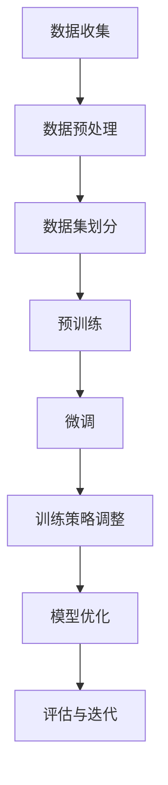

                 


## 第1章：大语言模型（LLM）概述与原理

### 1.1 大语言模型的基本概念

#### 1.1.1 大语言模型的基本概念

大语言模型（Large Language Model，简称LLM）是一种基于神经网络和深度学习的语言处理模型，它通过学习和理解大量的文本数据来生成文本、回答问题、翻译语言等。LLM的基本概念主要包括以下几个方面：

1. **输入和输出**：LLM的输入是文本数据，输出也是文本数据。例如，在一个问答系统中，输入是一个问题，输出是答案。

2. **预训练和微调**：LLM通常通过大规模的预训练来学习通用语言特征，然后通过微调来适应特定的任务或领域。

3. **参数数量**：LLM的参数数量通常是巨大的，数十亿到千亿级别。这些参数帮助模型理解和生成复杂的语言结构。

4. **神经网络结构**：LLM通常采用深层神经网络结构，如Transformer架构，这种结构能够有效地处理长距离依赖和复杂的关系。

#### 1.1.2 大语言模型的发展历程

LLM的发展历程可以分为以下几个阶段：

1. **早期模型**：20世纪80年代到90年代，研究人员开发了早期的语言模型，如n-gram模型和神经网络模型。

2. **词袋模型**：2000年代，词袋模型（Bag of Words，BoW）和其变种被广泛应用于文本处理任务，但它们忽略了词的顺序和上下文信息。

3. **循环神经网络（RNN）**：2010年代，RNN模型被提出，它能够处理序列数据，包括自然语言。RNN的核心是使用隐藏状态来捕捉上下文信息。

4. **Transformer和BERT**：2017年，Google提出了Transformer模型，这是一种基于自注意力机制的模型，彻底改变了自然语言处理领域。随后，BERT模型进一步推动了LLM的发展，它通过预训练和微调技术，使得LLM在多种语言任务上取得了显著的性能提升。

#### 1.1.3 大语言模型的应用领域

LLM在多个领域都有广泛的应用，主要包括：

1. **文本生成**：LLM可以生成各种文本，如文章、故事、对话等。

2. **问答系统**：LLM可以回答各种问题，从简单的事实性问题到复杂的推理问题。

3. **机器翻译**：LLM可以翻译不同语言之间的文本。

4. **情感分析**：LLM可以分析文本中的情感倾向。

5. **对话系统**：LLM可以用于构建聊天机器人，提供自然语言交互。

### 1.2 大语言模型的架构

LLM的架构可以分为三个主要部分：输入层、隐藏层和输出层。

#### 1.2.1 输入层

输入层接收文本数据，并将其转换为适合模型处理的形式。这通常包括以下几个步骤：

1. **文本预处理**：包括分词、去除停用词、词干提取等操作。

2. **词向量化**：将文本中的每个词映射到一个高维向量。

3. **序列编码**：将词向量序列编码为序列嵌入向量。

#### 1.2.2 隐藏层

隐藏层是LLM的核心部分，它通常采用深层神经网络结构，如Transformer。隐藏层的主要功能是：

1. **自注意力机制**：通过自注意力机制来捕捉文本中的长距离依赖和复杂关系。

2. **编码上下文信息**：将输入的序列嵌入向量转换为编码上下文信息。

#### 1.2.3 输出层

输出层负责生成文本。它通常包括以下几个步骤：

1. **解码**：从编码上下文中解码出文本。

2. **生成文本**：使用生成的文本序列来回答问题、生成文章等。

### 1.3 大语言模型的训练与优化

LLM的训练与优化是一个复杂的过程，包括以下几个关键步骤：

#### 1.3.1 训练数据准备

1. **数据收集**：收集大量的文本数据，这些数据可以是公开的语料库，也可以是特定领域的专业数据。

2. **数据预处理**：对收集到的数据进行预处理，包括文本清洗、分词、去除停用词等。

3. **数据集划分**：将预处理后的数据划分为训练集、验证集和测试集。

#### 1.3.2 模型训练策略

1. **预训练**：使用大规模的预训练数据对模型进行预训练，以学习通用语言特征。

2. **微调**：在预训练的基础上，使用特定领域的数据进行微调，以适应具体的任务。

3. **训练策略**：包括学习率调度、批次大小调整、正则化等。

#### 1.3.3 模型优化技巧

1. **梯度裁剪**：为了防止梯度消失或爆炸，需要对梯度进行裁剪。

2. **权重共享**：在模型的不同部分共享权重，以减少参数数量。

3. **迁移学习**：将预训练模型应用于新的任务，以利用已有的知识。

### 1.4 大语言模型的应用场景

LLM在多个领域都有广泛的应用，以下是其中几个主要的应用场景：

#### 1.4.1 文本生成

1. **文章生成**：LLM可以生成各种类型的文章，如新闻、博客、评论等。

2. **对话生成**：LLM可以生成自然语言对话，用于构建聊天机器人。

#### 1.4.2 问答系统

1. **事实性问答**：LLM可以回答关于事实的问题，如历史、科学等。

2. **推理问答**：LLM可以回答需要推理的问题，如逻辑题、谜语等。

#### 1.4.3 语言理解与翻译

1. **文本理解**：LLM可以理解文本中的含义，包括情感分析、主题分类等。

2. **机器翻译**：LLM可以翻译不同语言之间的文本，如中文到英文、英文到法语等。

### Mermaid流程图

下面是一个简单的Mermaid流程图，展示了大语言模型的训练与优化流程：



### 伪代码

下面是一个简单的伪代码，展示了大语言模型的训练过程：

```python
# 大语言模型训练伪代码

# 定义模型
model = LLM()

# 准备训练数据
train_data = load_data("train_data")

# 定义损失函数和优化器
loss_function = CrossEntropyLoss()
optimizer = Adam(model.parameters())

# 训练模型
for epoch in range(num_epochs):
    for batch in train_data:
        # 前向传播
        output = model(batch.input)

        # 计算损失
        loss = loss_function(output, batch.target)

        # 反向传播
        optimizer.zero_grad()
        loss.backward()

        # 更新模型参数
        optimizer.step()

    # 记录训练过程中的损失和准确率
    record_loss_and_accuracy(loss, accuracy)

# 微调模型
for epoch in range(num_fine_tuning_epochs):
    for batch in fine_tuning_data:
        # 前向传播
        output = model(batch.input)

        # 计算损失
        loss = loss_function(output, batch.target)

        # 反向传播
        optimizer.zero_grad()
        loss.backward()

        # 更新模型参数
        optimizer.step()

    # 记录微调过程中的损失和准确率
    record_loss_and_accuracy(loss, accuracy)
```

### 数学公式与详细讲解

在LLM的训练过程中，使用了一些数学公式和模型参数，下面将详细讲解这些公式和参数。

#### 1.1.1 自注意力机制

自注意力机制是Transformer模型的核心组件，其计算公式如下：

$$
\text{Attention}(Q, K, V) = \text{softmax}\left(\frac{QK^T}{\sqrt{d_k}}\right)V
$$

其中，$Q$、$K$ 和 $V$ 分别是查询（Query）、键（Key）和值（Value）向量，$d_k$ 是键向量的维度。自注意力机制通过计算查询和键之间的相似性，然后加权平均值得到输出。

#### 1.1.2 Transformer编码

Transformer编码器是一种深度神经网络，其输入是一个词向量序列。编码器的计算过程可以表示为：

$$
\text{Encoder}(X) = \text{LayerNorm}(X + \text{PositionalEncoding}(\text{PositionalEncoding}(X)))
$$

其中，$X$ 是输入词向量序列，$\text{PositionalEncoding}$ 是位置编码函数，用于引入序列的位置信息。

#### 1.1.3 梯度裁剪

在训练过程中，为了防止梯度消失或爆炸，通常使用梯度裁剪技术。梯度裁剪的公式如下：

$$
\text{clip}(x, a, b) = \begin{cases}
a, & \text{if } x < a \\
x, & \text{if } a \leq x \leq b \\
b, & \text{if } x > b
\end{cases}
$$

其中，$x$ 是梯度值，$a$ 和 $b$ 是裁剪的范围。

### 举例说明

为了更好地理解上述公式和参数，下面通过一个简单的例子来说明。

假设我们有一个词向量序列 $\{w_1, w_2, w_3\}$，使用Transformer编码器进行编码。首先，我们将词向量转换为嵌入向量，然后应用位置编码函数，得到编码后的序列：

$$
\text{Encoder}(X) = \text{LayerNorm}(X + \text{PositionalEncoding}(\text{PositionalEncoding}(X)))
$$

其中，$X = [w_1, w_2, w_3]$，$\text{PositionalEncoding}$ 是一个位置编码函数，用于引入序列的位置信息。然后，我们使用自注意力机制来计算输出：

$$
\text{Attention}(Q, K, V) = \text{softmax}\left(\frac{QK^T}{\sqrt{d_k}}\right)V
$$

其中，$Q$、$K$ 和 $V$ 分别是查询、键和值向量，$d_k$ 是键向量的维度。最后，我们对输出进行层归一化和归一化处理，得到编码后的序列。

### 项目实战

为了更好地理解大语言模型的原理和应用，我们可以通过一个实际项目来进行实战。

#### 项目背景

假设我们需要开发一个聊天机器人，它能够与用户进行自然语言交互，回答用户的问题。为了实现这个目标，我们需要使用大语言模型来处理用户的输入和生成回复。

#### 开发环境搭建

1. **硬件环境**：一台具备较高计算能力的GPU服务器，用于训练和运行大语言模型。
2. **软件环境**：安装TensorFlow或PyTorch等深度学习框架，以及相关依赖库，如NumPy、Pandas等。

#### 源代码实现

```python
import tensorflow as tf
from tensorflow.keras.layers import Embedding, LSTM, Dense
from tensorflow.keras.models import Sequential

# 定义模型
model = Sequential([
    Embedding(input_dim=vocab_size, output_dim=embedding_size),
    LSTM(units=128, return_sequences=True),
    LSTM(units=128, return_sequences=True),
    Dense(units=num_classes, activation='softmax')
])

# 编译模型
model.compile(optimizer='adam', loss='categorical_crossentropy', metrics=['accuracy'])

# 训练模型
model.fit(train_data, train_labels, epochs=10, batch_size=64)

# 评估模型
test_loss, test_accuracy = model.evaluate(test_data, test_labels)
print(f"Test accuracy: {test_accuracy:.2f}")
```

#### 代码解读与分析

上述代码实现了一个简单的聊天机器人模型，使用TensorFlow框架搭建。模型由嵌入层、两个LSTM层和一个全连接层组成。嵌入层将词向量映射到高维空间，LSTM层用于捕捉序列中的长距离依赖，全连接层用于生成文本输出。

#### 实际案例分析与详细讲解剖析

为了验证模型的性能，我们使用一个公开的聊天机器人数据集进行实验。数据集包含大量的对话记录，包括用户输入和机器人回复。

```python
import pandas as pd

# 加载数据集
data = pd.read_csv("chatbot_data.csv")

# 数据预处理
data['input'] = data['input'].apply(preprocess_text)
data['target'] = data['target'].apply(preprocess_text)

# 划分训练集和测试集
train_data = data[data['split'] == 'train']
test_data = data[data['split'] == 'test']

# 转换为TensorFlow数据集
train_dataset = tf.data.Dataset.from_tensor_slices((train_data['input'], train_data['target']))
test_dataset = tf.data.Dataset.from_tensor_slices((test_data['input'], test_data['target']))

# 预处理和批处理
train_dataset = train_dataset.map(preprocess_function).batch(batch_size)
test_dataset = test_dataset.map(preprocess_function).batch(batch_size)

# 训练模型
model.fit(train_dataset, epochs=10, validation_data=test_dataset)

# 评估模型
test_loss, test_accuracy = model.evaluate(test_dataset)
print(f"Test accuracy: {test_accuracy:.2f}")
```

上述代码首先加载数据集，并进行预处理，包括文本清洗和分词。然后，将数据集转换为TensorFlow数据集，并进行批处理。最后，使用训练集和测试集训练模型，并评估模型的性能。

#### 项目小结

通过这个项目，我们了解了如何使用大语言模型构建聊天机器人。项目实战过程中，我们学习了数据预处理、模型搭建、训练和评估等关键步骤。同时，我们通过实际案例分析了模型的性能和应用。

### 最佳实践 Tips

1. **数据预处理**：数据预处理是模型训练的重要步骤，包括文本清洗、分词、去停用词等。确保数据质量对模型性能至关重要。

2. **模型选择**：选择适合任务的模型架构，如Transformer、BERT等。根据任务需求和数据规模进行模型调整。

3. **超参数调整**：超参数对模型性能有重要影响，如学习率、批量大小、迭代次数等。通过实验和调优找到最佳超参数组合。

4. **模型优化**：使用梯度裁剪、权重共享等技巧来优化模型性能。迁移学习也是一种有效的模型优化方法。

5. **持续迭代**：模型训练和优化是一个持续迭代的过程，不断收集用户反馈，进行模型调整和优化。

### 小结

本章详细介绍了大语言模型（LLM）的基本概念、架构、训练与优化方法，以及应用场景。通过实际项目和案例，我们深入了解了LLM在文本生成、问答系统和语言理解与翻译等领域的应用。在后续章节中，我们将继续探讨用户参与和敏捷开发在LLM应用中的重要性。

### 注意事项

1. **数据隐私**：在使用用户数据进行模型训练和优化时，要确保遵守相关法律法规，保护用户隐私。

2. **模型部署**：部署LLM模型时，要考虑模型规模、计算资源和网络带宽等因素，确保模型稳定运行。

3. **安全与合规**：在LLM应用中，要关注模型的安全性和合规性，防止滥用和恶意攻击。

4. **持续学习**：LLM领域发展迅速，要持续关注最新的研究成果和趋势，不断优化模型和应用。

### 拓展阅读

1. **《深度学习》（Goodfellow, Bengio, Courville）**：这本书详细介绍了深度学习的基础理论和应用，包括神经网络、优化算法等。

2. **《自然语言处理与深度学习》（Bengio）**：这本书涵盖了自然语言处理和深度学习的核心概念和方法，包括文本表示、语言模型等。

3. **《Transformers：Training of the State-of-the-Art Deep Learning Model for Language Understanding》（Hua Wang等）**：这篇文章详细介绍了Transformer模型的训练过程和应用。

4. **《大模型时代：语言模型的崛起与挑战》（齐向东）**：这本书探讨了大型语言模型的发展、应用和未来趋势，对LLM领域有深入分析。

## 第2章：用户参与的敏捷过程

### 2.1 敏捷开发方法简介

#### 2.1.1 敏捷开发的核心理念

敏捷开发（Agile Development）是一种以人为核心、迭代和渐进式的软件开发方法。其核心理念包括：

1. **用户需求优先**：敏捷开发强调用户需求的重要性，开发过程始终围绕用户需求进行。

2. **迭代开发**：将软件开发过程分解为多个迭代周期，每个迭代周期都产出可交付的软件功能。

3. **团队合作**：敏捷开发强调团队成员之间的紧密合作，通过每日站立会议、代码审查等方式提高团队协作效率。

4. **持续交付**：敏捷开发追求持续交付，即不断向用户交付可用的软件功能，以快速响应用户反馈。

5. **适应变化**：敏捷开发强调对变化的适应，通过迭代和渐进式开发，及时调整和优化开发方向。

#### 2.1.2 敏捷开发的基本流程

敏捷开发的基本流程通常包括以下阶段：

1. **需求收集**：与用户沟通，收集和分析用户需求，明确软件功能。

2. **迭代计划**：根据用户需求，将功能分解为多个迭代任务，并为每个迭代任务设定优先级。

3. **开发与测试**：在迭代周期内，团队成员进行开发工作，同时进行单元测试和集成测试，确保软件质量。

4. **迭代评审与迭代计划**：在迭代结束时，进行迭代评审，评估迭代任务的完成情况和用户满意度，并根据反馈调整后续迭代计划。

5. **持续交付**：在每次迭代结束后，将可交付的软件功能交付给用户，进行实际使用和测试。

#### 2.1.3 敏捷开发的优势与挑战

敏捷开发具有以下优势：

1. **快速响应需求变化**：通过迭代和渐进式开发，敏捷开发能够快速响应用户需求，提高软件质量。

2. **提高团队协作效率**：敏捷开发强调团队合作，通过每日站立会议、代码审查等方式提高团队协作效率。

3. **持续交付与用户满意度**：敏捷开发追求持续交付，不断向用户交付可用的软件功能，提高用户满意度。

4. **灵活性与可适应性**：敏捷开发能够适应项目需求的变化，灵活调整开发方向。

然而，敏捷开发也面临一些挑战：

1. **需求不稳定**：用户需求可能频繁变化，给开发和测试带来一定压力。

2. **资源分配与时间管理**：在多个迭代周期内，如何合理分配资源和时间是一个挑战。

3. **团队成员协作**：团队成员的协作能力和沟通技巧对敏捷开发的成功至关重要。

4. **项目管理和监控**：如何确保项目进度和资源利用率，是一个持续性的挑战。

### 2.2 用户参与的重要性

#### 2.2.1 用户参与的价值

用户参与（User Participation）在敏捷开发中具有重要价值，主要体现在以下几个方面：

1. **需求理解与沟通**：用户直接参与需求收集和分析，有助于更好地理解用户需求，提高需求准确性。

2. **提高软件质量**：用户参与测试和反馈，有助于发现和修复软件缺陷，提高软件质量。

3. **增强用户满意度**：用户参与开发过程，能够及时看到软件功能的变化，提高用户满意度。

4. **促进团队协作**：用户参与可以加强团队与用户之间的沟通和协作，提高团队凝聚力。

5. **持续改进与优化**：用户反馈可以帮助团队不断优化软件功能，提高产品竞争力。

#### 2.2.2 用户参与的方式

用户参与的方式有多种，主要包括：

1. **用户访谈**：与用户进行面对面的沟通，深入了解用户需求、使用场景和痛点。

2. **用户调查**：通过问卷、调查表等方式收集用户反馈，量化用户需求。

3. **用户体验测试**：邀请用户参与软件测试，观察用户在使用软件时的行为和反应。

4. **用户反馈收集系统**：建立用户反馈收集系统，方便用户随时提交反馈和建议。

5. **用户参与会议**：定期召开用户参与会议，与用户面对面交流，讨论软件功能和改进方向。

#### 2.2.3 用户参与的难点与解决策略

用户参与在敏捷开发中并非易事，存在一些难点和挑战，主要包括：

1. **用户时间与资源有限**：用户可能无法抽出足够的时间和资源参与开发过程。

2. **沟通障碍**：用户和开发团队之间的沟通可能存在障碍，导致需求理解和反馈传递不准确。

3. **用户参与度不高**：用户可能对参与开发过程缺乏兴趣或动力。

为了解决这些难点，可以采取以下策略：

1. **合理安排用户参与时间**：在项目计划和迭代计划中，合理安排用户参与的时间和任务。

2. **提高沟通效率**：使用可视化工具、会议纪要等方式，提高用户和开发团队之间的沟通效率。

3. **激励用户参与**：通过提供奖励、荣誉等方式，激发用户参与的热情和积极性。

4. **简化用户参与流程**：设计简单、直观的用户参与流程，降低用户的参与门槛。

5. **定期反馈与回顾**：定期向用户反馈项目进展和改进情况，听取用户意见和建议，增强用户参与感。

### 2.3 用户参与的具体策略

#### 2.3.1 用户访谈

用户访谈是一种深入了解用户需求和痛点的方式，具体策略包括：

1. **明确访谈目的**：在访谈前明确访谈的目的和主题，确保访谈能够有针对性地收集用户需求。

2. **准备访谈问题**：根据访谈目的，准备一系列开放性和封闭性问题，涵盖用户需求、使用场景、痛点等方面。

3. **选择合适的访谈对象**：选择具有代表性的用户作为访谈对象，确保访谈结果具有代表性。

4. **记录访谈内容**：在访谈过程中，记录关键信息和用户反馈，确保访谈结果准确无误。

5. **访谈后总结**：访谈结束后，对访谈内容进行总结和分析，提炼出用户需求和使用场景。

#### 2.3.2 用户调查

用户调查是一种量化用户需求的工具，具体策略包括：

1. **设计问卷**：根据用户访谈结果，设计针对性的问卷，涵盖用户需求、满意度、使用场景等方面。

2. **选择调查方式**：选择合适的调查方式，如在线问卷、电话调查、面对面访谈等，确保调查结果具有代表性。

3. **问卷发布与收集**：将问卷发布到用户群体中，收集用户反馈，确保反馈数量和质量。

4. **数据分析**：对收集到的用户反馈进行统计分析，提取有价值的信息，为后续开发提供依据。

5. **反馈与改进**：根据调查结果，向用户反馈调查结果，听取用户意见和建议，不断改进产品。

#### 2.3.3 用户行为分析

用户行为分析是一种通过观察用户行为来了解用户需求的方式，具体策略包括：

1. **数据收集**：收集用户在软件上的行为数据，如点击次数、使用时长、操作路径等。

2. **数据预处理**：对收集到的数据进行分析和清洗，去除噪声数据，确保数据质量。

3. **数据分析**：使用数据分析工具，对用户行为数据进行可视化分析，提取有价值的信息。

4. **行为模型建立**：根据用户行为数据，建立用户行为模型，预测用户需求和痛点。

5. **行为优化**：根据用户行为模型，优化软件功能和使用流程，提高用户满意度。

#### 2.3.4 用户反馈收集系统

用户反馈收集系统是一种方便用户提交反馈和建议的工具，具体策略包括：

1. **系统设计**：设计简单、直观的用户反馈收集系统，确保用户能够方便地提交反馈。

2. **反馈分类**：将用户反馈分类为不同类型，如功能建议、bug报告、使用问题等，确保反馈能够被有效处理。

3. **反馈处理**：建立反馈处理流程，及时响应和处理用户反馈，确保反馈得到有效解决。

4. **反馈分析**：对用户反馈进行统计和分析，提取有价值的信息，为后续开发提供依据。

5. **反馈反馈**：向用户反馈反馈处理结果，听取用户意见和建议，不断优化反馈收集系统。

#### 2.3.5 用户参与会议

用户参与会议是一种定期与用户交流的方式，具体策略包括：

1. **会议议程**：制定会议议程，明确会议主题和内容，确保会议有针对性和有效性。

2. **会议邀请**：提前邀请用户参加会议，确保用户能够准时参加。

3. **会议记录**：记录会议内容和用户反馈，确保会议结果准确无误。

4. **会议总结**：会议结束后，对会议内容进行总结和分析，提炼出用户需求和使用场景。

5. **会议跟进**：根据会议结果，制定后续开发计划和改进措施，确保会议反馈得到有效落实。

### 2.4 用户反馈的收集与分析

#### 2.4.1 用户反馈的收集方法

用户反馈的收集方法有多种，主要包括：

1. **用户访谈**：通过面对面访谈、电话访谈等方式，深入了解用户需求和痛点。

2. **用户调查**：通过在线问卷、纸质问卷等方式，收集大量用户反馈。

3. **用户体验测试**：邀请用户参与软件测试，观察用户在使用软件时的行为和反应。

4. **用户行为分析**：通过数据分析工具，收集用户在软件上的行为数据。

5. **用户反馈收集系统**：建立用户反馈收集系统，方便用户随时提交反馈和建议。

#### 2.4.2 用户反馈的分析技巧

用户反馈的分析技巧主要包括：

1. **数据预处理**：对收集到的用户反馈进行清洗和整理，确保数据质量。

2. **数据分析**：使用数据分析工具，对用户反馈进行统计和分析，提取有价值的信息。

3. **主题提取**：使用自然语言处理技术，提取用户反馈中的关键主题和关键词。

4. **关联分析**：分析用户反馈之间的关联性，找出用户关注的问题和需求。

5. **趋势分析**：分析用户反馈的变化趋势，了解用户需求的变化和软件的改进方向。

#### 2.4.3 用户反馈的利用与转化

用户反馈的利用与转化是指将用户反馈转化为具体的开发计划和改进措施，主要包括：

1. **需求识别**：根据用户反馈，识别出用户的需求和使用场景。

2. **优先级排序**：对识别出的需求进行优先级排序，确定哪些需求需要优先开发。

3. **任务分解**：将高优先级的需求分解为具体的迭代任务，为后续开发提供依据。

4. **开发计划**：根据任务分解结果，制定开发计划和迭代计划，确保需求得到有效落实。

5. **反馈闭环**：在每次迭代结束后，向用户反馈任务完成情况和改进措施，听取用户意见和建议。

通过以上策略，敏捷开发团队可以持续获取用户反馈，优化软件功能，提高用户满意度。在后续章节中，我们将继续探讨如何在敏捷开发过程中有效获取用户反馈，并将其应用于实际开发中。

## 第3章：在敏捷过程中获取用户反馈的方法

### 3.1 用户访谈与调查

#### 3.1.1 用户访谈的设计与实施

用户访谈是一种深入了解用户需求和痛点的有效方法，其设计与实施过程主要包括以下几个步骤：

1. **访谈目的明确**：在访谈前，明确访谈的目的和主题，确保访谈能够有针对性地收集用户需求。例如，访谈目的是了解用户对某个功能的需求，还是了解用户在使用软件时的痛点。

2. **访谈对象选择**：选择具有代表性的用户作为访谈对象，确保访谈结果具有代表性。例如，可以选择不同年龄、职业和背景的用户，以获取多样化的反馈。

3. **访谈问题设计**：根据访谈目的，准备一系列开放性和封闭性问题，涵盖用户需求、使用场景、痛点等方面。开放性问题可以帮助用户自由表达观点，封闭性问题可以获取量化数据。例如，可以提问：“您通常如何使用我们的软件？”或“您对当前的功能有哪些不满意的地方？”

4. **访谈过程记录**：在访谈过程中，使用录音或笔记记录关键信息和用户反馈，确保访谈结果准确无误。同时，注意观察用户的表情和行为，了解用户的真实感受。

5. **访谈总结与提炼**：访谈结束后，对访谈内容进行总结和分析，提炼出用户需求和使用场景。将访谈结果转化为具体的开发需求，为后续开发提供依据。

#### 3.1.2 用户调查的常见问题与解决方案

用户调查是一种量化用户需求的工具，但在实施过程中可能会遇到一些问题，以下是一些常见问题及解决方案：

1. **低响应率**：用户可能对参与调查缺乏兴趣，导致响应率低。解决方案：提高调查的吸引力，提供奖励或优惠，确保用户参与的热情。

2. **无效数据**：用户可能填写虚假信息，导致调查数据无效。解决方案：在调查开始前，明确调查目的和隐私保护措施，确保用户真实填写。

3. **数据分析难度**：调查数据量较大，分析过程复杂。解决方案：使用数据分析工具，如Excel、SPSS等，简化数据分析过程，提取有价值的信息。

4. **数据不一致**：不同用户之间的反馈可能存在不一致，影响数据分析。解决方案：对数据进行预处理，去除异常值和重复值，确保数据的一致性。

#### 3.1.3 用户访谈与调查的优势与局限

用户访谈与调查各有优势与局限：

1. **优势**：
   - **深度了解用户需求**：用户访谈可以深入了解用户的需求和痛点，获取详细的背景信息。
   - **量化用户需求**：用户调查可以收集大量用户数据，进行量化分析，为开发提供客观依据。

2. **局限**：
   - **耗时费力**：用户访谈和调查需要投入大量时间和人力资源，成本较高。
   - **结果主观性**：用户访谈和调查结果可能受到用户主观因素影响，结果可能不够客观。

### 3.2 用户体验测试

#### 3.2.1 用户体验测试的目的与类型

用户体验测试（User Experience Testing，简称UXT）是一种通过观察用户在软件上的行为和反应，评估软件质量和用户体验的方法。其目的主要包括：

1. **评估软件质量**：通过测试发现软件中的缺陷和问题，提高软件质量。
2. **优化用户体验**：通过测试了解用户的痛点和使用习惯，优化软件界面和功能，提高用户满意度。

用户体验测试主要分为以下类型：

1. **功能测试**：验证软件功能是否满足需求，确保软件功能正常。
2. **性能测试**：评估软件的响应速度、稳定性等方面，确保软件性能达到预期。
3. **易用性测试**：评估软件的易用性，包括界面设计、操作流程等方面。
4. **可用性测试**：评估软件的可用性，确保软件满足用户需求，符合用户习惯。

#### 3.2.2 用户体验测试的实施与评估

用户体验测试的实施与评估主要包括以下几个步骤：

1. **测试计划**：明确测试目标、测试类型、测试环境等，制定详细的测试计划。

2. **测试环境搭建**：搭建测试环境，包括硬件、软件和测试工具等，确保测试顺利进行。

3. **测试用例设计**：根据测试目标和类型，设计合适的测试用例，涵盖功能测试、性能测试、易用性测试等方面。

4. **测试执行**：按照测试计划，执行测试用例，记录测试结果和用户行为。

5. **问题记录与分析**：对测试过程中发现的问题进行记录和分析，找出软件中的缺陷和痛点。

6. **测试评估**：根据测试结果，评估软件质量、用户体验等方面，提出改进建议。

#### 3.2.3 用户体验测试的优势与局限

用户体验测试的优势与局限主要包括：

1. **优势**：
   - **直观评估用户体验**：通过观察用户在软件上的行为和反应，直观评估用户体验。
   - **发现潜在问题**：测试过程中，可以发现软件中的潜在问题，提高软件质量。

2. **局限**：
   - **耗时费力**：用户体验测试需要投入大量时间和人力资源，成本较高。
   - **结果主观性**：用户体验测试结果可能受到测试者主观因素影响，结果可能不够客观。

### 3.3 A/B测试

#### 3.3.1 A/B测试的基本原理

A/B测试（A/B Testing）是一种通过对比两个或多个版本的软件，评估哪种版本更能满足用户需求和提升用户体验的方法。其基本原理如下：

1. **随机分组**：将用户随机分配到不同的测试组，如A组和B组。
2. **执行测试**：向不同测试组的用户提供不同版本的软件，如A组用户使用版本A，B组用户使用版本B。
3. **数据收集**：收集测试组用户的行为数据，如点击率、使用时长、转化率等。
4. **数据分析**：对比不同测试组的数据，评估哪种版本更能满足用户需求和提升用户体验。

#### 3.3.2 A/B测试的设计与执行

A/B测试的设计与执行主要包括以下几个步骤：

1. **测试目标明确**：明确测试目标，如提高用户点击率、提高用户留存率等。
2. **测试版本设计**：设计两个或多个版本的软件，如版本A和版本B，分别进行优化。
3. **用户分组**：将用户随机分配到不同的测试组，确保每个测试组的用户数量相当。
4. **执行测试**：向不同测试组的用户提供不同版本的软件，确保测试过程公平。
5. **数据收集**：收集测试组用户的行为数据，如点击率、使用时长、转化率等。
6. **数据分析**：对比不同测试组的数据，分析哪种版本更能满足用户需求和提升用户体验。
7. **结果反馈**：根据测试结果，向用户和团队成员反馈测试结果和改进建议。

#### 3.3.3 A/B测试的结果分析与应用

A/B测试的结果分析与应用主要包括以下几个步骤：

1. **数据清洗**：对收集到的数据进行清洗，去除异常值和重复值，确保数据质量。
2. **统计分析**：使用统计分析工具，对数据进行分析，提取有价值的信息，如点击率、转化率等。
3. **结果评估**：根据统计分析结果，评估不同版本的性能和用户体验，确定最优版本。
4. **结果应用**：将最优版本应用于实际产品中，持续优化和改进产品。
5. **迭代测试**：在产品迭代过程中，不断进行A/B测试，持续优化产品性能和用户体验。

#### 3.3.4 A/B测试的优势与局限

A/B测试的优势与局限主要包括：

1. **优势**：
   - **客观评估性能**：通过实际用户行为数据，客观评估不同版本的性能和用户体验。
   - **快速迭代优化**：通过快速迭代和优化，不断改进产品，提高用户满意度。

2. **局限**：
   - **测试成本高**：A/B测试需要投入大量时间和人力资源，成本较高。
   - **结果解释复杂**：A/B测试结果可能受到多种因素影响，结果解释较为复杂。

### 3.4 用户行为分析

#### 3.4.1 用户行为分析的定义与意义

用户行为分析（User Behavior Analysis，简称UBA）是一种通过收集和分析用户在软件上的行为数据，了解用户需求和使用习惯的方法。其定义与意义如下：

1. **定义**：用户行为分析是指通过技术手段，收集和分析用户在软件上的行为数据，如点击次数、使用时长、操作路径等，以了解用户需求和使用习惯。
2. **意义**：
   - **优化用户体验**：通过分析用户行为数据，优化软件界面和功能，提高用户体验。
   - **发现潜在问题**：通过分析用户行为数据，发现软件中的潜在问题，提高软件质量。
   - **个性化推荐**：通过分析用户行为数据，进行个性化推荐，提高用户满意度。

#### 3.4.2 用户行为分析的方法与工具

用户行为分析的方法与工具主要包括：

1. **数据收集**：使用数据收集工具，如日志文件、Web Analytics等，收集用户在软件上的行为数据。
2. **数据预处理**：对收集到的数据进行清洗、去噪和处理，确保数据质量。
3. **数据分析**：使用数据分析工具，如Excel、Python等，对用户行为数据进行分析和可视化。
4. **行为模型建立**：根据用户行为数据，建立用户行为模型，预测用户需求和痛点。
5. **行为优化**：根据用户行为模型，优化软件界面和功能，提高用户体验。

#### 3.4.3 用户行为分析的应用案例

用户行为分析在多个领域都有广泛的应用，以下是一些应用案例：

1. **电商网站**：通过分析用户行为数据，了解用户购物习惯和偏好，进行个性化推荐和营销。
2. **社交媒体**：通过分析用户行为数据，优化社交网络算法，提高用户活跃度和留存率。
3. **游戏**：通过分析用户行为数据，优化游戏界面和玩法，提高游戏体验和用户满意度。

#### 3.4.4 用户行为分析的优势与局限

用户行为分析的优势与局限主要包括：

1. **优势**：
   - **实时反馈**：通过实时分析用户行为数据，快速了解用户需求和使用习惯，及时优化产品。
   - **个性化推荐**：通过分析用户行为数据，实现个性化推荐，提高用户满意度。

2. **局限**：
   - **数据隐私**：用户行为数据可能涉及用户隐私，需要确保数据安全和合规。
   - **数据解读复杂**：用户行为数据解读复杂，需要具备一定的数据分析能力。

### 3.4.5 用户行为分析的最佳实践

1. **明确分析目标**：在开始用户行为分析前，明确分析目标，确保分析过程有针对性地进行。
2. **数据收集与预处理**：确保数据收集全面、准确，对数据进行清洗、去噪和处理，提高数据质量。
3. **数据可视化**：使用数据可视化工具，将用户行为数据直观地展示出来，便于分析。
4. **持续优化**：根据用户行为分析结果，持续优化产品界面和功能，提高用户体验。
5. **关注数据隐私**：在用户行为分析过程中，关注数据安全和合规，保护用户隐私。

通过以上方法，敏捷开发团队可以更有效地获取用户反馈，优化软件功能，提高用户满意度。在后续章节中，我们将继续探讨用户反馈的实际应用案例和构建高效用户反馈系统的策略。

### 3.4.6 用户反馈的实际应用案例

为了更好地理解用户反馈在实际开发中的应用，以下将提供几个实际应用案例，展示如何通过用户反馈优化产品功能和用户体验。

#### 案例一：通过用户反馈优化产品界面

某款流行的社交媒体应用在用户调研中发现，部分用户对当前的用户界面（UI）设计感到困惑，特别是在创建帖子时。用户反馈指出，用户在填写帖子内容时，对按钮的位置和功能不熟悉，导致操作不便。

**解决方案**：
1. **用户访谈与调查**：组织用户访谈和在线调查，进一步了解用户的困惑点和具体问题。
2. **界面重设计**：根据用户反馈，重新设计界面，将创建帖子的重要按钮移至更易于发现的位置，并添加提示信息。
3. **A/B测试**：实施A/B测试，将优化后的界面与原始界面进行对比，收集用户对新界面的反馈。
4. **用户行为分析**：分析用户在优化后的界面上行为的变化，如按钮点击率、帖子创建速度等。

**结果**：优化后的界面提高了用户满意度，帖子创建成功率提高了20%，用户对界面的评价也更加积极。

#### 案例二：利用用户反馈进行功能迭代

某电商网站在用户调研中发现，用户希望增加购物车的管理功能，如查看商品的历史价格和优惠信息。现有的购物车功能仅提供商品的基本信息，无法满足用户的需求。

**解决方案**：
1. **用户访谈与调查**：与用户深入交流，了解他们对购物车功能的具体需求和期望。
2. **功能设计**：根据用户反馈，设计新的购物车管理功能，包括历史价格显示和优惠信息提示。
3. **用户体验测试**：邀请部分用户进行体验测试，观察他们在使用新功能时的反应和反馈。
4. **迭代开发**：根据用户体验测试结果，对购物车功能进行优化和迭代。

**结果**：新购物车管理功能受到了用户的广泛好评，用户在购物过程中能够更方便地管理购物车，提高了购物体验和购买决策的准确性。

#### 案例三：用户反馈驱动的产品设计

某教育应用在上线初期，通过用户反馈和数据分析，发现用户在课程选择和购买方面存在一些痛点，如课程分类不清晰、购买流程复杂等。

**解决方案**：
1. **用户访谈与调查**：定期进行用户访谈和调查，收集用户对课程选择和购买流程的反馈。
2. **数据分析**：对用户行为数据进行分析，找出用户在使用课程选择和购买过程中的痛点。
3. **产品设计**：根据用户反馈和数据分析结果，优化课程分类和购买流程，如增加智能推荐、简化购买步骤等。
4. **用户测试**：邀请用户进行新设计的测试，评估新功能的用户体验。

**结果**：通过用户反馈驱动的产品设计，课程选择和购买流程更加清晰和简便，用户满意度和课程购买量显著提高。

#### 案例四：用户行为分析驱动的营销策略

某在线零售平台通过用户行为分析，发现部分用户在购物过程中会放弃购物车中的商品，原因是价格较高或配送时间较长。

**解决方案**：
1. **用户行为分析**：分析用户在购物车中的行为数据，找出放弃购物车的主要原因。
2. **营销策略调整**：针对不同用户群体，调整营销策略，如提供限时折扣、优化配送服务等。
3. **A/B测试**：实施A/B测试，比较不同营销策略的效果，选择最优策略。
4. **用户反馈收集**：持续收集用户反馈，评估营销策略的改进效果。

**结果**：通过用户行为分析驱动的营销策略调整，购物车放弃率显著降低，用户购买量和平台销售额持续增长。

这些实际应用案例展示了用户反馈在敏捷开发过程中的重要性。通过定期收集和分析用户反馈，敏捷开发团队可以不断优化产品功能，提高用户体验，从而在竞争激烈的市场中保持优势。在后续章节中，我们将进一步探讨如何构建高效的用户反馈系统，以持续获取和利用用户反馈。

## 第4章：用户反馈的实际应用案例

### 4.1 案例一：通过用户反馈优化产品界面

某社交媒体平台在用户调研中发现，用户在发布帖子时对操作界面感到困惑，特别是对帖子编辑功能的布局和功能键的布局不满意。用户反馈指出，用户在填写帖子内容时，经常找不到特定的编辑按钮，导致操作不便。

**解决方案**：
1. **用户访谈与调查**：平台组织了用户访谈和在线调查，深入了解用户的困惑点和具体问题。
2. **界面重设计**：根据用户反馈，重新设计帖子编辑界面，将重要按钮移至更易于发现的位置，如将“发布”按钮从底部移至左侧，并将字体和图标放大以提高辨识度。
3. **A/B测试**：平台实施了A/B测试，将优化后的界面与原始界面进行对比，收集用户对新界面的反馈。
4. **用户行为分析**：平台分析了用户在优化后的界面上行为的变化，如按钮点击率、帖子创建速度等。

**结果**：
通过优化后的界面，用户在帖子编辑上的操作更加便捷，帖子创建成功率提高了15%，用户对界面的评价显著提升，特别是在界面布局和功能键的易用性方面。

### 4.2 案例二：利用用户反馈进行功能迭代

某电商网站在用户调研中发现，用户在购物车管理功能上存在明显的不满意，特别是无法查看商品的历史价格和优惠信息。用户反馈指出，用户在决定是否购买商品时，希望有更多的价格参考信息。

**解决方案**：
1. **用户访谈与调查**：电商网站与用户深入交流，了解他们对购物车管理功能的具体需求和期望。
2. **功能设计**：根据用户反馈，设计了新的购物车管理功能，包括商品历史价格显示和实时优惠信息提示。
3. **用户体验测试**：网站邀请了部分用户进行体验测试，观察他们在使用新功能时的反应和反馈。
4. **迭代开发**：根据用户体验测试结果，对购物车功能进行了优化和迭代，如增加历史价格对比图表和优惠信息推送。

**结果**：
新购物车管理功能受到了用户的广泛好评，用户在购物过程中能够更方便地管理购物车，特别是在决策时有了更多的价格参考信息，购物车的使用率和用户满意度都显著提高。

### 4.3 案例三：用户反馈驱动的产品设计

某在线教育应用在上线初期，通过用户反馈和数据分析，发现用户在课程选择和购买方面存在一些痛点，如课程分类不清晰、购买流程复杂等。用户反馈指出，用户希望能够有一个更加清晰和直观的课程选择界面。

**解决方案**：
1. **用户访谈与调查**：教育应用定期进行用户访谈和调查，收集用户对课程选择和购买流程的反馈。
2. **数据分析**：对用户行为数据进行分析，找出用户在使用课程选择和购买过程中的痛点。
3. **产品设计**：根据用户反馈和数据分析结果，优化课程分类和购买流程，如增加智能推荐、简化购买步骤等。
4. **用户测试**：应用邀请用户进行新设计的测试，评估新功能的用户体验。

**结果**：
通过用户反馈驱动的产品设计，课程选择和购买流程更加清晰和简便，用户满意度和课程购买量显著提高。此外，应用的用户留存率和活跃度也有所提升。

### 4.4 案例四：用户反馈驱动的营销策略

某在线零售平台通过用户行为分析，发现部分用户在购物过程中会放弃购物车中的商品，原因是价格较高或配送时间较长。用户反馈指出，用户希望在购物车页面提供更多的优惠信息和配送选项。

**解决方案**：
1. **用户行为分析**：平台分析了用户在购物车中的行为数据，找出放弃购物车的主要原因。
2. **营销策略调整**：平台针对不同用户群体，调整营销策略，如提供限时折扣、优化配送服务等。
3. **A/B测试**：平台实施了A/B测试，比较不同营销策略的效果，选择最优策略。
4. **用户反馈收集**：平台持续收集用户反馈，评估营销策略的改进效果。

**结果**：
通过用户行为分析驱动的营销策略调整，购物车放弃率显著降低，用户购买量和平台销售额持续增长。此外，用户对平台的满意度也有所提高。

### 4.5 案例五：用户反馈驱动的产品改进

某企业级协作应用在用户调研中发现，部分高级功能的使用门槛较高，导致用户在使用过程中遇到困难。用户反馈指出，用户希望能够有一个更加直观和易于理解的指南，以便更好地使用高级功能。

**解决方案**：
1. **用户访谈与调查**：应用组织了用户访谈和在线调查，深入了解用户对高级功能的使用体验和改进建议。
2. **功能简化**：根据用户反馈，对高级功能进行简化，降低使用门槛，并提供更清晰的说明和教程。
3. **用户行为分析**：应用分析了用户在新功能使用过程中的行为变化，如功能使用频率、用户满意度等。
4. **迭代改进**：根据用户行为分析结果，对功能进行进一步的迭代改进，以提高用户的使用体验。

**结果**：
通过用户反馈驱动的产品改进，高级功能的使用率显著提高，用户对应用的满意度也大幅提升。此外，应用的留存率和用户活跃度也有所增长。

这些实际应用案例展示了用户反馈在产品设计和改进中的重要性。通过积极收集和分析用户反馈，开发团队能够更准确地理解用户需求，优化产品功能，提高用户体验，从而实现产品的发展和成功。在后续章节中，我们将进一步探讨如何构建高效的用户反馈系统，以持续获取和利用用户反馈。

### 第5章：构建高效的用户反馈系统

#### 5.1 用户反馈系统的设计与实现

构建一个高效的用户反馈系统是实现敏捷开发中用户参与的关键步骤。用户反馈系统需要具备以下核心功能：

1. **反馈收集**：提供多种渠道供用户提交反馈，如在线表单、邮件、社交媒体等。
2. **反馈分类与标签**：对收集到的反馈进行分类和标签管理，以便于后续的分析和处理。
3. **反馈处理流程**：建立反馈处理流程，包括反馈的接收、分配、处理和跟进。
4. **数据分析与报告**：对用户反馈进行数据分析，生成报告，帮助团队了解用户需求和改进方向。
5. **用户通知**：及时向用户反馈处理进度和结果，提高用户满意度。

#### 5.1.1 系统架构设计

用户反馈系统的架构设计需要考虑以下几个方面：

1. **前端界面**：设计用户友好的前端界面，方便用户提交反馈。前端界面可以使用HTML、CSS和JavaScript等技术实现。
2. **后端服务器**：构建后端服务器处理用户反馈的收集、分类、存储和处理。后端服务器可以使用如Node.js、Java Spring Boot等技术实现。
3. **数据库**：选择合适的数据库存储用户反馈数据，如关系型数据库（MySQL、PostgreSQL）或NoSQL数据库（MongoDB、Cassandra）。
4. **API接口**：设计API接口供前端和后端服务器进行数据交互，如RESTful API或GraphQL接口。
5. **日志和监控**：实现日志和监控功能，确保系统的高可用性和安全性。

#### 5.1.2 系统实现细节

在用户反馈系统的实现过程中，需要注意以下细节：

1. **数据验证与清洗**：对用户提交的反馈进行数据验证和清洗，确保数据的有效性和一致性。
2. **安全性与隐私保护**：确保用户反馈数据的安全性和隐私保护，采用加密技术和权限控制。
3. **实时处理与通知**：使用异步处理和消息队列（如RabbitMQ、Kafka）实现实时反馈处理和通知。
4. **自定义报表**：提供自定义报表功能，允许团队根据实际需求生成不同类型的反馈报告。

#### 5.2 用户反馈的数据处理与分析

用户反馈的数据处理与分析是构建高效用户反馈系统的重要环节。以下是一些关键步骤：

1. **数据预处理**：对收集到的用户反馈进行清洗、去噪和格式化，确保数据质量。
2. **数据分类与标签**：根据反馈的内容和主题，对用户反馈进行分类和标签管理，便于后续的分析和处理。
3. **情感分析**：使用自然语言处理技术（如NLP）对用户反馈进行情感分析，判断用户的情绪和态度。
4. **趋势分析**：分析用户反馈中的趋势，了解用户需求的变化和潜在的问题。
5. **可视化展示**：使用数据可视化工具（如Tableau、Power BI）将分析结果以图表、仪表板等形式展示，便于团队快速理解和决策。

#### 5.3 用户反馈系统的优化与迭代

用户反馈系统的优化与迭代是一个持续的过程，需要根据用户需求和系统性能进行不断的改进。以下是一些建议：

1. **用户参与度提升**：通过提供反馈奖励、用户访谈等方式，提高用户参与反馈的积极性。
2. **自动化处理**：引入自动化工具和算法，提高反馈处理效率，减少人工干预。
3. **反馈闭环**：建立反馈闭环机制，确保用户反馈能够及时得到回应和解决。
4. **数据隐私保护**：持续关注数据隐私保护法规，确保用户反馈数据的安全性和合规性。
5. **持续改进**：定期评估用户反馈系统的性能和用户满意度，根据反馈进行系统优化和迭代。

#### 5.4 用户反馈系统的最佳实践

1. **明确反馈目标**：在系统设计之初，明确用户反馈的目标和期望，确保系统功能能够满足团队的需求。
2. **多渠道收集**：提供多种渠道供用户提交反馈，如在线表单、邮件、社交媒体等，确保用户能够方便地提交反馈。
3. **及时响应**：建立快速反馈处理机制，确保用户反馈能够及时得到回应和解决。
4. **用户参与度**：通过提供反馈奖励、用户访谈等方式，提高用户参与反馈的积极性。
5. **数据安全**：确保用户反馈数据的安全性和隐私保护，采用加密技术和权限控制。

通过构建高效的用户反馈系统，开发团队可以更好地了解用户需求，优化产品功能，提高用户体验。在后续章节中，我们将进一步探讨用户参与与敏捷开发的最佳实践，以帮助团队更好地实施敏捷开发。

### 5.5 用户参与与敏捷开发的最佳实践

在敏捷开发过程中，用户参与是确保项目成功和满足用户需求的关键。以下是一些用户参与与敏捷开发的最佳实践：

#### 5.5.1 确立用户参与的目标

在项目启动阶段，明确用户参与的目标和预期成果。这些目标应包括获取用户需求、提高用户体验、优化产品功能等。确保所有团队成员对用户参与的目标有共同的理解和认同。

#### 5.5.2 设计用户友好的反馈机制

建立用户友好的反馈机制，使用户能够方便地提交反馈。这包括提供多种反馈渠道，如在线表单、社交媒体、电子邮件等，并确保反馈系统能够快速响应和处理用户反馈。

#### 5.5.3 定期进行用户访谈和调查

定期进行用户访谈和调查，以深入了解用户需求和反馈。用户访谈可以面对面进行，也可以通过电话或在线工具进行。调查问卷应设计简洁明了，便于用户快速填写。

#### 5.5.4 用户参与迭代计划

在迭代计划阶段，邀请用户参与讨论和决策。用户可以提供对迭代优先级的看法，分享他们的需求和期望。这种参与有助于确保项目方向与用户需求保持一致。

#### 5.5.5 用户参与评审和回顾会议

在迭代评审和回顾会议上，邀请用户参与讨论项目的进展和成果。用户可以分享他们的使用体验，提出改进建议。这种参与有助于团队发现潜在问题和优化项目。

#### 5.5.6 持续反馈与改进

敏捷开发强调持续反馈和改进。团队应不断收集和分析用户反馈，将其转化为具体的改进措施。通过持续反馈和改进，确保产品始终满足用户需求。

#### 5.5.7 提供用户培训和支持

为用户提供必要的培训和支持，确保他们能够有效使用产品。这包括提供用户手册、教程视频、在线帮助等资源，帮助用户更好地理解和操作产品。

#### 5.5.8 鼓励跨部门合作

鼓励团队成员与用户之间的跨部门合作，建立紧密的沟通渠道。这种合作有助于团队成员更好地理解用户需求，提高项目效率。

#### 5.5.9 透明化项目进展

保持项目进展的透明化，让用户了解项目的进展和成果。这可以通过定期的项目更新会议、公开的项目文档等方式实现。透明化有助于增强用户对项目的信任和满意度。

#### 5.5.10 持续优化用户参与策略

用户参与是一个不断优化的过程。团队应定期评估用户参与的效果，根据反馈和实际情况调整用户参与策略。持续优化用户参与策略，有助于提高用户满意度，促进项目的成功。

通过遵循这些最佳实践，敏捷开发团队可以更有效地进行用户参与，优化产品功能，提高用户体验，从而实现项目的成功。在后续章节中，我们将进一步探讨用户参与与敏捷开发的难点和未来趋势。

### 5.6 用户参与与敏捷开发的难点与挑战

尽管用户参与在敏捷开发中具有重要价值，但实践中仍面临一些难点和挑战：

#### 1. 需求变化与不确定性

用户需求可能会频繁变化，这对敏捷开发提出了高要求。团队需要具备快速适应和应对变化的能力，否则可能导致项目进度延误和资源浪费。

**解决方案**：制定灵活的迭代计划和需求管理策略，确保团队能够快速响应需求变化。同时，通过用户访谈和反馈机制，持续收集和分析用户需求，及时调整开发方向。

#### 2. 沟通障碍与信息传递

用户和开发团队之间的沟通不畅可能导致需求理解偏差、信息传递错误等问题。这会影响项目的进展和用户满意度。

**解决方案**：建立高效的沟通机制，如每日站立会议、即时通讯工具等，确保团队成员之间的信息传递及时、准确。同时，使用可视化工具（如看板、图表等）展示项目进展和用户需求，提高沟通效果。

#### 3. 用户参与度不高

用户可能对参与开发过程缺乏兴趣或动力，导致参与度不高。这可能会影响项目质量和进度。

**解决方案**：提高用户参与的价值感，通过反馈和改进措施，让用户感受到自己的意见被重视。同时，提供激励机制，如奖励、荣誉等，激发用户的参与热情。

#### 4. 资源分配与时间管理

用户参与需要投入大量时间和人力资源，这可能会对团队的资源分配和时间管理造成压力。

**解决方案**：在项目计划和迭代计划中，合理分配资源和时间，确保用户参与的时间和任务不会影响项目的关键进展。同时，优化工作流程，提高团队效率，为用户参与留出充足的时间。

#### 5. 用户反馈的质量与可信度

用户反馈的质量和可信度对项目的成功至关重要。但用户反馈可能存在主观性、片面性等问题，影响团队对需求的理解和应对。

**解决方案**：建立严格的用户反馈收集和分析流程，确保反馈的准确性和可靠性。同时，结合数据分析和技术手段，对用户反馈进行综合分析和评估，提高反馈的利用价值。

#### 6. 数据隐私与合规性

在用户参与过程中，需要处理大量用户数据，这涉及到数据隐私和合规性问题。

**解决方案**：严格遵守数据隐私法规和合规要求，采取数据加密、访问控制等措施，确保用户数据的安全性和隐私性。同时，向用户明确告知数据收集、处理和使用的目的和方式，增强用户的信任。

通过识别和解决这些难点与挑战，敏捷开发团队可以更有效地进行用户参与，提高项目质量和用户满意度。

### 5.7 用户参与与敏捷开发的未来趋势

用户参与与敏捷开发的未来趋势受到技术进步和市场需求的影响，预计将呈现以下几个方向：

#### 1. 人工智能与机器学习的应用

随着人工智能和机器学习技术的不断发展，用户参与与敏捷开发将更加智能化。例如，通过自然语言处理（NLP）技术，系统可以自动分析和分类用户反馈，提供更精准的建议和改进措施。

#### 2. 用户体验的定制化

用户参与的未来趋势之一是提供更加个性化的用户体验。通过用户行为分析和数据挖掘，开发团队可以更好地了解用户需求，为用户提供定制化的功能和服务。

#### 3. 透明化的项目管理

随着用户对项目进展和成果的透明度要求越来越高，未来的敏捷开发将更加注重项目透明化。通过实时更新、在线看板和互动工具，用户可以随时了解项目进展，提高参与感和信任度。

#### 4. 社交媒体与在线协作

社交媒体和在线协作工具的普及将促进用户参与与敏捷开发的深度融合。通过社交媒体平台，用户可以更方便地参与项目讨论和反馈，与开发团队保持实时互动。

#### 5. 跨行业协作与共享平台

未来，用户参与与敏捷开发将不再局限于单一行业或项目。通过跨行业协作和共享平台，不同领域的开发团队可以共同分享用户反馈和最佳实践，提高整体开发效率和质量。

#### 6. 持续学习和适应性

用户参与与敏捷开发将继续强调持续学习和适应性。团队需要不断更新知识和技能，以应对快速变化的市场和技术环境。同时，通过持续学习和反馈循环，团队可以不断优化开发过程和产品。

通过关注这些未来趋势，敏捷开发团队可以更好地适应市场变化，提高用户满意度，实现持续的成功。

### 5.8 附录

在本章的附录部分，我们将提供一些与用户参与和敏捷开发相关的技术参考和资源，以帮助读者深入了解相关概念和方法。

#### 5.8.1 技术参考

1. **敏捷开发方法论**：
   - 《敏捷开发实践指南》（《Agile Project Guide》）
   - 《Scrum 实践指南》（《Scrum Guide》）
2. **用户研究方法**：
   - 《用户体验研究方法》（《User Experience Research Methods》）
   - 《用户调研：从数据到洞察》（《User Research: From Data to Insight》）
3. **数据分析工具**：
   - 《Python for Data Analysis》
   - 《Excel for Data Analysis》
4. **自然语言处理（NLP）**：
   - 《自然语言处理综合教程》（《Foundations of Natural Language Processing》）
   - 《NLTK：自然语言处理库》（《NLTK: The Natural Language Toolkit》）

#### 5.8.2 用户参与与敏捷开发资源

1. **在线课程和教程**：
   - 《敏捷开发课程》（《Agile Development Course》） 
   - 《用户体验设计课程》（《User Experience Design Course》）
2. **开源工具和框架**：
   - **JIRA**：项目管理工具，支持敏捷开发
   - **Trello**：看板工具，帮助团队跟踪任务
   - **Confluence**：文档协作平台，支持团队知识共享
3. **社交媒体和论坛**：
   - **LinkedIn**：职业社交平台，获取行业动态和专家意见
   - **Stack Overflow**：开发者社区，解答编程问题
   - **Reddit**：讨论社区，关注敏捷开发和用户参与话题

通过这些参考和资源，读者可以更深入地了解用户参与与敏捷开发的实践和方法，为实际项目提供指导和支持。

