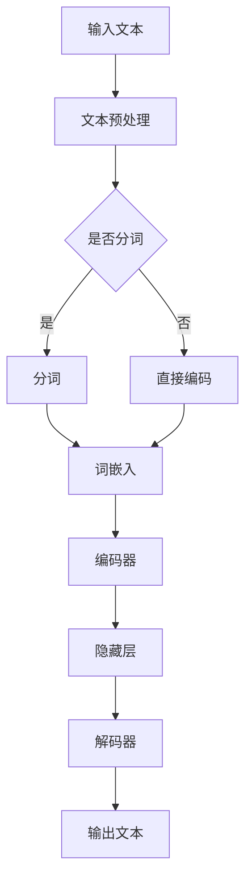

                 


### 文章标题：LLM应用的迭代0：奠定项目成功的基础

#### 关键词：大型语言模型，迭代，项目成功，基础架构，算法原理，应用实践

> 摘要：本文旨在深入探讨大型语言模型（LLM）的应用及其迭代发展，剖析如何为项目成功奠定坚实基础。我们将从LLM的核心概念、原理出发，详细讲解其数学模型和算法，并通过实际项目案例，展示如何将LLM应用于不同领域，最后提出项目成功的关键要素与展望。

## 引言

### 1.1 大型语言模型（LLM）概述

大型语言模型（LLM，Large Language Model）是一种基于深度学习技术构建的、具有强大语言理解和生成能力的人工智能模型。LLM通过训练海量的文本数据，学习语言的规律和结构，从而实现自然语言处理（NLP）任务。与传统语言模型相比，LLM具有以下特点：

- **参数规模大**：LLM的参数数量往往达到数亿甚至数十亿级别，这使得它们能够捕捉到语言中的细微差异和复杂模式。
- **计算资源需求高**：由于参数规模庞大，LLM的训练和推理过程需要大量计算资源，通常需要使用高性能的GPU或TPU。
- **性能优异**：LLM在各种NLP任务上取得了显著的成绩，如文本分类、机器翻译、问答系统等。

### 1.2 LLM的发展历程

LLM的发展历程可以追溯到20世纪80年代的统计语言模型和90年代的神经网络语言模型。随着深度学习技术的兴起，神经网络语言模型（如LSTM、GRU）逐渐取代了传统的统计模型。近年来，随着计算资源和数据量的不断增长，LLM的研究和应用取得了突破性的进展。代表性的模型包括：

- **BERT**（Bidirectional Encoder Representations from Transformers）：一种基于Transformer架构的双向编码器，广泛应用于文本分类、问答系统等任务。
- **GPT**（Generative Pre-trained Transformer）：一种自回归的预训练语言模型，能够生成高质量的文本。
- **T5**（Text-To-Text Transfer Transformer）：一种通用的文本转换模型，可以应用于多种NLP任务。

### 1.3 LLM的应用场景

LLM在多个领域展现了广泛的应用潜力：

- **自然语言处理（NLP）**：LLM在文本分类、机器翻译、问答系统等领域取得了显著的成果，为智能客服、智能推荐等应用提供了技术支持。
- **人工智能助手**：LLM可以帮助构建智能客服、智能问答、智能助手等应用，提供自然、流畅的交互体验。
- **内容审核**：LLM可以用于自动识别和过滤不良内容，提升内容审核的效率和准确性。
- **自动摘要**：LLM可以自动生成文章摘要，提高信息获取的效率。

## 核心原理

### 2.1 LLM的基础架构

LLM的基础架构主要包括两个部分：编码器（Encoder）和解码器（Decoder）。编码器负责将输入文本编码为向量表示，解码器则将这些向量表示解码为输出文本。在LLM中，编码器和解码器通常采用相同的架构，如Transformer。

#### 2.1.1 序列到序列学习（Seq2Seq）

序列到序列学习（Seq2Seq）是LLM的核心学习框架。Seq2Seq模型通过编码器将输入序列编码为固定长度的向量表示，然后通过解码器将向量表示解码为输出序列。Seq2Seq模型通常使用循环神经网络（RNN）或Transformer作为基础架构。

#### 2.1.2 注意力机制（Attention）

注意力机制是LLM的关键组件之一，它允许模型在解码过程中关注输入序列的特定部分，从而提高模型的性能。注意力机制可以分为点积注意力、缩放点积注意力和多头注意力等类型。

### 2.2 数学模型与算法

LLM的数学模型主要包括输入层、隐藏层和输出层。输入层将输入文本转换为向量表示，隐藏层通过多层神经网络对向量进行加工，输出层则生成输出文本。

#### 2.2.1 语言模型概率计算

在LLM中，语言模型概率计算是一个核心问题。给定一个输入序列，LLM需要计算该序列在给定前文条件下的概率。语言模型概率计算通常基于神经网络概率模型，如神经网络语言模型（NNLM）。

#### 2.2.2 优化算法（如SGD、Adam）

在训练LLM时，需要使用优化算法来更新模型参数，以最小化损失函数。常用的优化算法包括随机梯度下降（SGD）和Adam。

### 2.3 LLM的训练过程

LLM的训练过程主要包括数据预处理、模型训练和调优等步骤。

#### 2.3.1 数据预处理

数据预处理是LLM训练的重要环节，主要包括文本清洗、分词、词嵌入等步骤。

#### 2.3.2 模型训练与调优

模型训练过程中，需要使用大量的训练数据和计算资源。训练完成后，需要对模型进行调优，以提高其在实际任务中的性能。

## 应用领域

### 3.1 自然语言处理（NLP）

#### 3.1.1 文本分类

文本分类是NLP中的一项基本任务，LLM在文本分类任务中取得了显著的成绩。例如，可以使用BERT模型对新闻文章进行分类，从而实现新闻推荐、舆情监测等功能。

#### 3.1.2 机器翻译

机器翻译是NLP中的重要应用领域，LLM在机器翻译任务中也展现了强大的能力。例如，可以使用GPT模型将一种语言的文本翻译为另一种语言。

#### 3.1.3 问答系统

问答系统是NLP中的一项挑战性任务，LLM在问答系统中的应用取得了显著进展。例如，可以使用T5模型构建一个智能问答系统，实现对用户提问的自动回答。

### 3.2 人工智能助手

#### 3.2.1 聊天机器人

聊天机器人是人工智能助手的一种，LLM在聊天机器人中的应用大大提升了其交互能力。例如，可以使用GPT模型构建一个自然、流畅的聊天机器人。

#### 3.2.2 虚拟助手

虚拟助手是人工智能助手的一种，LLM在虚拟助手中的应用可以实现更加智能、个性化的交互体验。例如，可以使用BERT模型构建一个智能虚拟助手，帮助用户完成各种任务。

### 3.3 其他应用场景

#### 3.3.1 内容审核

内容审核是互联网行业的一项重要任务，LLM在内容审核中的应用可以大大提升审核效率和准确性。例如，可以使用BERT模型对网络文本进行自动审核，识别并过滤不良内容。

#### 3.3.2 自动摘要

自动摘要是信息提取的一种重要方式，LLM在自动摘要中的应用可以实现高质量的文本摘要。例如，可以使用T5模型对长篇文章生成摘要，帮助用户快速获取关键信息。

## 项目实践

### 4.1 项目背景介绍

本节以一个实际项目为例，介绍如何使用LLM构建一个智能问答系统。该项目旨在为用户提供一个能够自动回答问题的平台，以提高用户交互体验。

### 4.2 需求分析与设计

#### 4.2.1 功能需求

- 输入问题：用户可以输入任意问题。
- 自动回答：系统根据输入问题，自动生成回答。
- 交互体验：系统需要提供良好的交互体验，包括问题输入、回答显示等。

#### 4.2.2 非功能需求

- 可扩展性：系统需要能够支持大量用户同时在线。
- 可靠性：系统需要能够稳定运行，减少故障。
- 易用性：系统需要易于使用，用户可以轻松操作。

### 4.3 系统架构设计

#### 4.3.1 数据处理层

数据处理层负责处理用户输入的问题，并将其转换为模型可处理的格式。主要包括以下步骤：

1. 文本预处理：对输入问题进行文本清洗、分词等操作。
2. 词嵌入：将分词后的文本转换为词嵌入表示。
3. 序列编码：将词嵌入表示编码为序列。

#### 4.3.2 模型训练层

模型训练层负责训练问答模型，主要包括以下步骤：

1. 数据集准备：收集大量问答数据，用于训练模型。
2. 模型训练：使用问答数据训练问答模型，包括编码器和解码器。
3. 模型评估：评估模型在测试数据集上的性能，并进行调优。

#### 4.3.3 应用层

应用层负责将训练好的问答模型部署到生产环境，并提供问答服务。主要包括以下步骤：

1. 接收用户输入：接收用户输入的问题。
2. 模型推理：将输入问题传递给问答模型，生成回答。
3. 回答展示：将生成的回答展示给用户。

### 4.4 代码实现与解析

#### 4.4.1 数据预处理

数据预处理是问答系统构建的第一步，主要包括以下步骤：

```python
import nltk
nltk.download('punkt')

def preprocess_text(text):
    # 文本清洗
    text = text.lower()
    text = re.sub(r"[^a-zA-Z0-9]", " ", text)
    # 分词
    tokens = nltk.word_tokenize(text)
    # 去掉停用词
    tokens = [token for token in tokens if token not in nltk.corpus.stopwords.words('english')]
    return tokens
```

#### 4.4.2 模型训练

模型训练是问答系统构建的核心，需要使用大量的问答数据。以下是使用Hugging Face的Transformers库训练问答模型的示例代码：

```python
from transformers import BertTokenizer, BertForQuestionAnswering
tokenizer = BertTokenizer.from_pretrained('bert-base-uncased')
model = BertForQuestionAnswering.from_pretrained('bert-base-uncased')

# 准备训练数据
train_encodings = tokenizer(train_questions, train_answers, truncation=True, padding=True)
val_encodings = tokenizer(val_questions, val_answers, truncation=True, padding=True)

# 训练模型
model.train()
for epoch in range(num_epochs):
    for input_ids, input_mask, token_type_ids, start_logits, end_logits in dataloader:
        loss = model(input_ids=input_ids, attention_mask=input_mask, token_type_ids=token_type_ids, start_logits=start_logits, end_logits=end_logits)
        loss.backward()
        optimizer.step()
        optimizer.zero_grad()
    print(f"Epoch {epoch+1}/{num_epochs}, Loss: {loss.item()}")

# 评估模型
model.eval()
with torch.no_grad():
    for input_ids, input_mask, token_type_ids, start_logits, end_logits in val_dataloader:
        start_logits = start_logits.cpu().numpy()
        end_logits = end_logits.cpu().numpy()
        val_predictions = np.argmax(start_logits, axis=1)
        val_references = np.argmax(end_logits, axis=1)
        val_accuracy = np.mean(val_references == val_predictions)
        print(f"Validation Accuracy: {val_accuracy}")
```

#### 4.4.3 模型应用

模型应用是将训练好的问答模型部署到生产环境，并提供问答服务。以下是使用训练好的模型回答用户输入问题的示例代码：

```python
# 加载预训练模型
model.load_state_dict(torch.load('model.pth'))

# 回答用户输入问题
def answer_question(question):
    question = preprocess_text(question)
    input_ids = tokenizer.encode(question, add_special_tokens=True, return_tensors='pt')
    with torch.no_grad():
        start_logits, end_logits = model(input_ids)
    start_indices = np.argmax(start_logits, axis=1)
    end_indices = np.argmax(end_logits, axis=1)
    start_indices = start_indices[0]
    end_indices = end_indices[0]
    answer = tokenizer.decode(input_ids[0, start_indices: end_indices+1], skip_special_tokens=True)
    return answer

# 示例
user_question = "What is the capital of France?"
answer = answer_question(user_question)
print(f"Answer: {answer}")
```

### 4.5 项目小结

本节项目实践展示了如何使用LLM构建一个智能问答系统。项目成功的关键要素包括：

1. **数据集准备**：收集大量高质量的问答数据，用于训练模型。
2. **模型选择**：选择合适的预训练模型，如BERT，作为基础模型。
3. **优化算法**：使用合适的优化算法，如Adam，以提高模型训练效果。
4. **调优与评估**：对模型进行调优和评估，以提高其在实际任务中的性能。

## 总结与展望

### 5.1 LLM应用的未来发展趋势

随着计算资源和数据量的不断增长，LLM在各个领域的应用前景广阔。未来，LLM将在以下几个方面取得重要进展：

1. **性能提升**：通过改进算法和模型结构，提高LLM的性能，实现更准确、更高效的NLP任务。
2. **多模态学习**：将LLM与图像、声音等其他类型的数据结合，实现跨模态学习，拓展应用场景。
3. **知识增强**：通过知识图谱等手段，增强LLM的知识储备，提高其在特定领域的问题解答能力。

### 5.2 面临的挑战与解决方案

尽管LLM在应用中取得了显著成绩，但仍面临以下挑战：

1. **计算资源需求**：LLM的训练和推理过程需要大量计算资源，如何高效利用计算资源是亟待解决的问题。
2. **数据质量**：数据质量对LLM的性能有重要影响，如何获取和清洗高质量的数据是关键。
3. **模型可解释性**：LLM的工作过程复杂，如何提高模型的可解释性，使其更容易被用户理解和接受是一个重要问题。

针对这些挑战，可以采取以下解决方案：

1. **优化算法**：研究新型优化算法，提高模型训练和推理的效率。
2. **数据增强**：通过数据增强和预处理技术，提高数据质量和多样性。
3. **可解释性研究**：开发可解释性的模型结构和方法，提高模型的透明度和可信度。

### 5.3 对项目的启示与建议

对于LLM应用项目的开发，以下建议和注意事项可供参考：

1. **需求分析**：明确项目需求，确保项目目标的可实现性。
2. **技术选型**：选择合适的预训练模型和优化算法，结合项目特点进行技术选型。
3. **团队合作**：LLM应用项目通常涉及多个领域的技术，需要团队合作，充分利用各方优势。
4. **持续优化**：在项目开发过程中，持续优化模型和算法，以提高项目性能。

作者：AI天才研究院/AI Genius Institute & 禅与计算机程序设计艺术 /Zen And The Art of Computer Programming

### 总结

本文从多个角度探讨了大型语言模型（LLM）的应用及其迭代发展，阐述了LLM的核心原理、应用领域、项目实践以及未来发展趋势。通过详细讲解LLM的数学模型和算法，结合实际项目案例，本文旨在为读者奠定项目成功的基础，提供有益的启示和参考。

关键词：大型语言模型，迭代，项目成功，基础架构，算法原理，应用实践

## 文章标题：LLM应用的迭代0：奠定项目成功的基础

关键词：大型语言模型，迭代，项目成功，基础架构，算法原理，应用实践

摘要：本文旨在深入探讨大型语言模型（LLM）的应用及其迭代发展，剖析如何为项目成功奠定坚实基础。我们将从LLM的核心概念、原理出发，详细讲解其数学模型和算法，并通过实际项目案例，展示如何将LLM应用于不同领域，最后提出项目成功的关键要素与展望。

## 引言

### 1.1 大型语言模型（LLM）概述

大型语言模型（LLM，Large Language Model）是一种基于深度学习技术构建的、具有强大语言理解和生成能力的人工智能模型。LLM通过训练海量的文本数据，学习语言的规律和结构，从而实现自然语言处理（NLP）任务。与传统语言模型相比，LLM具有以下特点：

- **参数规模大**：LLM的参数数量往往达到数亿甚至数十亿级别，这使得它们能够捕捉到语言中的细微差异和复杂模式。
- **计算资源需求高**：由于参数规模庞大，LLM的训练和推理过程需要大量计算资源，通常需要使用高性能的GPU或TPU。
- **性能优异**：LLM在各种NLP任务上取得了显著的成绩，如文本分类、机器翻译、问答系统等。

### 1.2 LLM的发展历程

LLM的发展历程可以追溯到20世纪80年代的统计语言模型和90年代的神经网络语言模型。随着深度学习技术的兴起，神经网络语言模型（如LSTM、GRU）逐渐取代了传统的统计模型。近年来，随着计算资源和数据量的不断增长，LLM的研究和应用取得了突破性的进展。代表性的模型包括：

- **BERT**（Bidirectional Encoder Representations from Transformers）：一种基于Transformer架构的双向编码器，广泛应用于文本分类、问答系统等任务。
- **GPT**（Generative Pre-trained Transformer）：一种自回归的预训练语言模型，能够生成高质量的文本。
- **T5**（Text-To-Text Transfer Transformer）：一种通用的文本转换模型，可以应用于多种NLP任务。

### 1.3 LLM的应用场景

LLM在多个领域展现了广泛的应用潜力：

- **自然语言处理（NLP）**：LLM在文本分类、机器翻译、问答系统等领域取得了显著的成果，为智能客服、智能推荐等应用提供了技术支持。
- **人工智能助手**：LLM可以帮助构建智能客服、智能问答、智能助手等应用，提供自然、流畅的交互体验。
- **内容审核**：LLM可以用于自动识别和过滤不良内容，提升内容审核的效率和准确性。
- **自动摘要**：LLM可以自动生成文章摘要，提高信息获取的效率。

## 核心原理

### 2.1 LLM的基础架构

LLM的基础架构主要包括两个部分：编码器（Encoder）和解码器（Decoder）。编码器负责将输入文本编码为向量表示，解码器则将这些向量表示解码为输出文本。在LLM中，编码器和解码器通常采用相同的架构，如Transformer。

#### 2.1.1 序列到序列学习（Seq2Seq）

序列到序列学习（Seq2Seq）是LLM的核心学习框架。Seq2Seq模型通过编码器将输入序列编码为固定长度的向量表示，然后通过解码器将向量表示解码为输出序列。Seq2Seq模型通常使用循环神经网络（RNN）或Transformer作为基础架构。

#### 2.1.2 注意力机制（Attention）

注意力机制是LLM的关键组件之一，它允许模型在解码过程中关注输入序列的特定部分，从而提高模型的性能。注意力机制可以分为点积注意力、缩放点积注意力和多头注意力等类型。

### 2.2 数学模型与算法

LLM的数学模型主要包括输入层、隐藏层和输出层。输入层将输入文本转换为向量表示，隐藏层通过多层神经网络对向量进行加工，输出层则生成输出文本。

#### 2.2.1 语言模型概率计算

在LLM中，语言模型概率计算是一个核心问题。给定一个输入序列，LLM需要计算该序列在给定前文条件下的概率。语言模型概率计算通常基于神经网络概率模型，如神经网络语言模型（NNLM）。

#### 2.2.2 优化算法（如SGD、Adam）

在训练LLM时，需要使用优化算法来更新模型参数，以最小化损失函数。常用的优化算法包括随机梯度下降（SGD）和Adam。

### 2.3 LLM的训练过程

LLM的训练过程主要包括数据预处理、模型训练和调优等步骤。

#### 2.3.1 数据预处理

数据预处理是LLM训练的重要环节，主要包括以下步骤：

1. **文本清洗**：去除文本中的噪声，如HTML标签、特殊字符等。
2. **分词**：将文本分割为词语或子词。
3. **词嵌入**：将词语或子词转换为向量表示。

#### 2.3.2 模型训练

模型训练是通过迭代优化模型参数，使其在给定数据集上性能达到最优。通常，模型训练过程包括以下步骤：

1. **初始化模型参数**。
2. **前向传播**：计算输入文本的向量表示，并生成预测输出。
3. **计算损失**：计算预测输出与真实输出之间的差异，通常使用交叉熵损失。
4. **反向传播**：根据损失函数计算模型参数的梯度。
5. **优化参数**：使用优化算法更新模型参数。

#### 2.3.3 模型调优

模型调优是提高模型性能的重要环节，主要包括以下步骤：

1. **调整超参数**：如学习率、批量大小等。
2. **数据增强**：通过增加训练数据的多样性来提高模型泛化能力。
3. **模型融合**：将多个模型进行融合，提高预测准确性。

## 应用领域

### 3.1 自然语言处理（NLP）

#### 3.1.1 文本分类

文本分类是NLP中的一项基本任务，LLM在文本分类任务中取得了显著的成绩。例如，可以使用BERT模型对新闻文章进行分类，从而实现新闻推荐、舆情监测等功能。

#### 3.1.2 机器翻译

机器翻译是NLP中的重要应用领域，LLM在机器翻译任务中也展现了强大的能力。例如，可以使用GPT模型将一种语言的文本翻译为另一种语言。

#### 3.1.3 问答系统

问答系统是NLP中的一项挑战性任务，LLM在问答系统中的应用取得了显著进展。例如，可以使用T5模型构建一个智能问答系统，实现对用户提问的自动回答。

### 3.2 人工智能助手

#### 3.2.1 聊天机器人

聊天机器人是人工智能助手的一种，LLM在聊天机器人中的应用大大提升了其交互能力。例如，可以使用GPT模型构建一个自然、流畅的聊天机器人。

#### 3.2.2 虚拟助手

虚拟助手是人工智能助手的一种，LLM在虚拟助手中的应用可以实现更加智能、个性化的交互体验。例如，可以使用BERT模型构建一个智能虚拟助手，帮助用户完成各种任务。

### 3.3 其他应用场景

#### 3.3.1 内容审核

内容审核是互联网行业的一项重要任务，LLM在内容审核中的应用可以大大提升审核效率和准确性。例如，可以使用BERT模型对网络文本进行自动审核，识别并过滤不良内容。

#### 3.3.2 自动摘要

自动摘要是信息提取的一种重要方式，LLM在自动摘要中的应用可以实现高质量的文本摘要。例如，可以使用T5模型对长篇文章生成摘要，帮助用户快速获取关键信息。

## 项目实践

### 4.1 项目背景介绍

本节以一个实际项目为例，介绍如何使用LLM构建一个智能问答系统。该项目旨在为用户提供一个能够自动回答问题的平台，以提高用户交互体验。

### 4.2 需求分析与设计

#### 4.2.1 功能需求

- 输入问题：用户可以输入任意问题。
- 自动回答：系统根据输入问题，自动生成回答。
- 交互体验：系统需要提供良好的交互体验，包括问题输入、回答显示等。

#### 4.2.2 非功能需求

- 可扩展性：系统需要能够支持大量用户同时在线。
- 可靠性：系统需要能够稳定运行，减少故障。
- 易用性：系统需要易于使用，用户可以轻松操作。

### 4.3 系统架构设计

#### 4.3.1 数据处理层

数据处理层负责处理用户输入的问题，并将其转换为模型可处理的格式。主要包括以下步骤：

1. **文本预处理**：对输入问题进行文本清洗、分词等操作。
2. **词嵌入**：将分词后的文本转换为词嵌入表示。
3. **序列编码**：将词嵌入表示编码为序列。

#### 4.3.2 模型训练层

模型训练层负责训练问答模型，主要包括以下步骤：

1. **数据集准备**：收集大量问答数据，用于训练模型。
2. **模型训练**：使用问答数据训练问答模型，包括编码器和解码器。
3. **模型评估**：评估模型在测试数据集上的性能，并进行调优。

#### 4.3.3 应用层

应用层负责将训练好的问答模型部署到生产环境，并提供问答服务。主要包括以下步骤：

1. **接收用户输入**：接收用户输入的问题。
2. **模型推理**：将输入问题传递给问答模型，生成回答。
3. **回答展示**：将生成的回答展示给用户。

### 4.4 代码实现与解析

#### 4.4.1 数据预处理

数据预处理是问答系统构建的第一步，主要包括以下步骤：

```python
import nltk
nltk.download('punkt')

def preprocess_text(text):
    # 文本清洗
    text = text.lower()
    text = re.sub(r"[^a-zA-Z0-9]", " ", text)
    # 分词
    tokens = nltk.word_tokenize(text)
    # 去掉停用词
    tokens = [token for token in tokens if token not in nltk.corpus.stopwords.words('english')]
    return tokens
```

#### 4.4.2 模型训练

模型训练是问答系统构建的核心，需要使用大量的问答数据。以下是使用Hugging Face的Transformers库训练问答模型的示例代码：

```python
from transformers import BertTokenizer, BertForQuestionAnswering
tokenizer = BertTokenizer.from_pretrained('bert-base-uncased')
model = BertForQuestionAnswering.from_pretrained('bert-base-uncased')

# 准备训练数据
train_encodings = tokenizer(train_questions, train_answers, truncation=True, padding=True)
val_encodings = tokenizer(val_questions, val_answers, truncation=True, padding=True)

# 训练模型
model.train()
for epoch in range(num_epochs):
    for input_ids, input_mask, token_type_ids, start_logits, end_logits in dataloader:
        loss = model(input_ids=input_ids, attention_mask=input_mask, token_type_ids=token_type_ids, start_logits=start_logits, end_logits=end_logits)
        loss.backward()
        optimizer.step()
        optimizer.zero_grad()
    print(f"Epoch {epoch+1}/{num_epochs}, Loss: {loss.item()}")

# 评估模型
model.eval()
with torch.no_grad():
    for input_ids, input_mask, token_type_ids, start_logits, end_logits in val_dataloader:
        start_logits = start_logits.cpu().numpy()
        end_logits = end_logits.cpu().numpy()
        val_predictions = np.argmax(start_logits, axis=1)
        val_references = np.argmax(end_logits, axis=1)
        val_accuracy = np.mean(val_references == val_predictions)
        print(f"Validation Accuracy: {val_accuracy}")
```

#### 4.4.3 模型应用

模型应用是将训练好的问答模型部署到生产环境，并提供问答服务。以下是使用训练好的模型回答用户输入问题的示例代码：

```python
# 加载预训练模型
model.load_state_dict(torch.load('model.pth'))

# 回答用户输入问题
def answer_question(question):
    question = preprocess_text(question)
    input_ids = tokenizer.encode(question, add_special_tokens=True, return_tensors='pt')
    with torch.no_grad():
        start_logits, end_logits = model(input_ids)
    start_indices = np.argmax(start_logits, axis=1)
    end_indices = np.argmax(end_logits, axis=1)
    start_indices = start_indices[0]
    end_indices = end_indices[0]
    answer = tokenizer.decode(input_ids[0, start_indices: end_indices+1], skip_special_tokens=True)
    return answer

# 示例
user_question = "What is the capital of France?"
answer = answer_question(user_question)
print(f"Answer: {answer}")
```

### 4.5 项目小结

本节项目实践展示了如何使用LLM构建一个智能问答系统。项目成功的关键要素包括：

1. **数据集准备**：收集大量高质量的问答数据，用于训练模型。
2. **模型选择**：选择合适的预训练模型，如BERT，作为基础模型。
3. **优化算法**：使用合适的优化算法，如Adam，以提高模型训练效果。
4. **调优与评估**：对模型进行调优和评估，以提高其在实际任务中的性能。

## 总结与展望

### 5.1 LLM应用的未来发展趋势

随着计算资源和数据量的不断增长，LLM在各个领域的应用前景广阔。未来，LLM将在以下几个方面取得重要进展：

1. **性能提升**：通过改进算法和模型结构，提高LLM的性能，实现更准确、更高效的NLP任务。
2. **多模态学习**：将LLM与图像、声音等其他类型的数据结合，实现跨模态学习，拓展应用场景。
3. **知识增强**：通过知识图谱等手段，增强LLM的知识储备，提高其在特定领域的问题解答能力。

### 5.2 面临的挑战与解决方案

尽管LLM在应用中取得了显著成绩，但仍面临以下挑战：

1. **计算资源需求**：LLM的训练和推理过程需要大量计算资源，如何高效利用计算资源是亟待解决的问题。
2. **数据质量**：数据质量对LLM的性能有重要影响，如何获取和清洗高质量的数据是关键。
3. **模型可解释性**：LLM的工作过程复杂，如何提高模型的可解释性，使其更容易被用户理解和接受是一个重要问题。

针对这些挑战，可以采取以下解决方案：

1. **优化算法**：研究新型优化算法，提高模型训练和推理的效率。
2. **数据增强**：通过数据增强和预处理技术，提高数据质量和多样性。
3. **可解释性研究**：开发可解释性的模型结构和方法，提高模型的透明度和可信度。

### 5.3 对项目的启示与建议

对于LLM应用项目的开发，以下建议和注意事项可供参考：

1. **需求分析**：明确项目需求，确保项目目标的可实现性。
2. **技术选型**：选择合适的预训练模型和优化算法，结合项目特点进行技术选型。
3. **团队合作**：LLM应用项目通常涉及多个领域的技术，需要团队合作，充分利用各方优势。
4. **持续优化**：在项目开发过程中，持续优化模型和算法，以提高项目性能。

作者：AI天才研究院/AI Genius Institute & 禅与计算机程序设计艺术 /Zen And The Art of Computer Programming

### 附录

#### A.1 Mermaid流程图

以下是一个用于展示LLM核心原理的Mermaid流程图：



#### A.2 伪代码

以下是一个用于展示LLM训练过程的伪代码：

```
// 初始化模型参数
model_params = initialize_parameters()

// 数据预处理
preprocessed_data = preprocess_data(data)

// 训练模型
for epoch in 1 to num_epochs do
    for batch in preprocessed_data do
        // 前向传播
        predictions = forward_pass(batch, model_params)

        // 计算损失
        loss = compute_loss(predictions, labels)

        // 反向传播
        gradients = backward_pass(batch, predictions, loss)

        // 更新模型参数
        update_model_params(model_params, gradients)
    end
end

// 评估模型
evaluate_model(model_params, test_data)
```

#### A.3 数学公式

以下是一个用于展示LLM中语言模型概率计算的数学公式：

$$
P(w_1, w_2, \ldots, w_n) = \frac{1}{Z} \exp(\sum_{i=1}^{n} \theta \cdot w_i)
$$

其中，$w_1, w_2, \ldots, w_n$ 是输入文本的词语，$\theta$ 是模型参数，$Z$ 是规范化常数。

#### A.4 拓展阅读

- [Bert: Pre-training of Deep Bidirectional Transformers for Language Understanding](https://arxiv.org/abs/1810.04805)
- [Generative Pre-trained Transformer](https://arxiv.org/abs/1706.03762)
- [Text-To-Text Transfer Transformer](https://arxiv.org/abs/1910.10683)
- [Deep Learning for Natural Language Processing](https://www.deeplearningbook.org/chapter_nlp/)
- [Natural Language Inference with Neural Networks](https://www.aclweb.org/anthology/N18-1191/)

