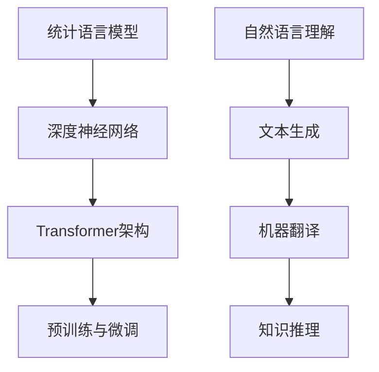

                 


### 第1章：LLM的概念与背景

#### 1.1 LLM的定义与重要性

**定义**：

大型语言模型（LLM）是一种深度学习模型，它通过学习大量的文本数据，掌握了自然语言的处理能力。LLM通常基于神经网络架构，如Transformer，其参数规模可达数十亿，甚至上百亿。这种规模使得LLM能够处理复杂的语言现象，生成高质量的文本。

**重要性**：

随着自然语言处理技术的发展，LLM在多个领域展现出了巨大的潜力。例如，在自然语言理解、文本生成、机器翻译等方面，LLM已经成为了不可或缺的工具。以下是LLM的重要性的一些体现：

1. **自然语言理解**：LLM能够理解复杂的语言结构和上下文，使得智能助手、问答系统等应用更加智能化。
2. **文本生成**：LLM可以生成高质量的文章、故事、诗歌等，为创作提供了强大的支持。
3. **机器翻译**：LLM在机器翻译领域取得了显著的成果，实现了高精度的翻译效果。
4. **知识推理**：LLM可以基于已有的知识，进行推理和判断，为决策提供支持。

#### 1.2 LLM的发展历程

LLM的发展历程可以追溯到20世纪80年代，当时研究人员开始探索如何使用机器学习技术来处理自然语言。以下是LLM发展的重要里程碑：

1. **统计语言模型**：早期的研究主要关注如何使用统计方法来预测下一个单词的概率，如N-gram模型。
2. **深度神经网络**：随着深度学习技术的发展，研究人员开始使用深度神经网络来构建语言模型，如循环神经网络（RNN）。
3. **Transformer架构**：2017年，谷歌推出了Transformer架构，该架构基于自注意力机制，显著提高了语言模型的性能。
4. **预训练与微调**：预训练是指在大量数据上训练一个基础模型，然后通过微调来适应特定任务。

#### 1.3 LLM在人工智能中的地位

LLM在人工智能领域占据了重要地位，主要表现在以下几个方面：

1. **核心技术**：LLM是自然语言处理的核心技术之一，其性能直接影响到自然语言处理任务的成果。
2. **应用广泛**：LLM在多个领域都有广泛应用，如智能客服、智能助手、内容生成、机器翻译等。
3. **推动创新**：LLM的研究和应用推动了人工智能技术的发展，为未来人工智能的应用场景提供了更多的可能性。

**核心概念与联系架构 Mermaid 流程图**：

下面是一个简单的Mermaid流程图，展示了LLM的核心概念和它们之间的联系。



#### 1.4 LLM的应用案例

以下是一些LLM在实际应用中的案例：

1. **智能客服**：使用LLM构建的智能客服系统能够理解用户的提问，并提供准确的答案。
2. **内容生成**：LLM可以生成高质量的文章、故事、诗歌等，为内容创作者提供灵感。
3. **机器翻译**：LLM在机器翻译领域的表现已经超过了传统的基于规则的方法，为跨语言交流提供了支持。
4. **问答系统**：LLM可以构建问答系统，用于处理用户的查询，提供准确的答案。

#### 1.5 LLM的发展趋势

随着技术的不断发展，LLM在未来有望在以下几个方面取得突破：

1. **模型性能**：随着计算能力的提升，LLM的参数规模有望继续扩大，性能进一步提高。
2. **应用场景**：LLM的应用领域将不断拓展，从自然语言处理到图像识别、音频处理等。
3. **跨模态学习**：LLM与其他模态的模型（如图像模型、音频模型）结合，实现更强大的多模态处理能力。
4. **可解释性**：提高LLM的可解释性，使得研究人员和开发者能够更好地理解和控制模型的决策过程。

**核心算法原理讲解（伪代码）**：

以下是一个简单的伪代码，展示了如何使用神经网络来训练一个语言模型。

```python
# 初始化神经网络
model = NeuralNetwork()

# 加载训练数据
train_data = load_data("train_data.txt")

# 训练神经网络
for epoch in range(num_epochs):
    for sentence in train_data:
        # 前向传播
        output = model.forward(sentence)
        
        # 计算损失
        loss = calculate_loss(output, sentence)
        
        # 反向传播
        model.backward(loss)
        
        # 更新模型参数
        model.update_parameters()

# 评估模型
test_data = load_data("test_data.txt")
accuracy = model.evaluate(test_data)

print("Model accuracy:", accuracy)
```

**数学模型和公式（详细讲解与举例说明）**：

LLM的训练过程中，涉及多个数学模型和公式。以下是其中两个重要的模型：

1. **损失函数**：

   损失函数用于衡量模型的预测结果与真实标签之间的差距。在语言模型中，常用的损失函数是交叉熵损失函数。

   $$ Loss = -\sum_{i=1}^{n} y_i \log(p_i) $$

   其中，$y_i$是第$i$个单词的标签（通常是一个分布），$p_i$是模型预测的第$i$个单词的概率。

   **举例**：假设有一个句子“我喜欢编程”，模型预测的概率分布为$(0.2, 0.3, 0.4, 0.1)$，真实标签为$(0, 1, 0, 0, 1)$。则损失函数的计算如下：

   $$ Loss = -0.2\log(0.2) - 0.3\log(0.3) - 0.4\log(0.4) - 0.1\log(0.1) $$

2. **优化算法**：

   为了使模型达到更好的性能，需要使用优化算法来更新模型参数。常用的优化算法有梯度下降、Adam等。

   梯度下降算法的更新公式如下：

   $$ \theta_{t+1} = \theta_{t} - \alpha \cdot \nabla_{\theta}J(\theta) $$

   其中，$\theta$是模型参数，$\alpha$是学习率，$J(\theta)$是损失函数关于$\theta$的梯度。

   **举例**：假设当前模型参数为$(1, 2)$，学习率为0.1，损失函数关于参数的梯度为$(0.5, -0.3)$。则下一轮参数的更新如下：

   $$ \theta_{t+1} = (1, 2) - 0.1 \cdot (0.5, -0.3) = (0.95, 1.7) $$

#### 1.6 LLM的挑战与未来方向

虽然LLM在多个领域取得了显著成果，但仍然面临一些挑战：

1. **计算资源消耗**：LLM的训练和推理需要大量的计算资源，这对硬件设施提出了较高要求。
2. **数据隐私**：在训练LLM时，需要使用大量的个人数据，这引发了数据隐私的问题。
3. **模型可解释性**：LLM的决策过程往往是不透明的，如何提高模型的可解释性是一个重要课题。

未来的发展方向包括：

1. **高效训练算法**：研究更高效的训练算法，降低训练成本。
2. **隐私保护技术**：开发隐私保护技术，确保数据隐私。
3. **跨模态学习**：探索LLM与其他模态的模型结合，实现更强大的多模态处理能力。
4. **模型压缩**：通过模型压缩技术，降低模型的参数规模，提高部署效率。

### 总结

本章介绍了LLM的概念与背景，包括其定义、重要性、发展历程以及在实际应用中的案例。通过核心算法原理的讲解和数学模型的分析，我们更好地理解了LLM的工作原理。同时，我们探讨了LLM面临的挑战以及未来的发展方向。在接下来的章节中，我们将进一步探讨LLM的迭代与改进、应用场景以及实战案例。

## 第2章：LLM的核心原理

### 2.1 语言模型的基本原理

语言模型是一种用于预测下一个单词或字符的概率的模型，它基于大量的文本数据进行训练。语言模型的基本原理可以概括为：通过学习文本数据中的统计规律，预测下一个单词或字符的概率。

#### 2.1.1 语言模型的工作方式

语言模型的工作方式可以分为以下几个步骤：

1. **文本预处理**：首先，需要对文本数据进行预处理，包括去除停用词、标点符号、进行词性标注等。
2. **分词**：将预处理后的文本数据分成单个单词或字符。
3. **特征提取**：对分词后的文本数据进行特征提取，常见的特征包括词频、词性、词嵌入等。
4. **概率预测**：使用训练好的语言模型，对下一个单词或字符进行概率预测。

#### 2.1.2 语言模型的训练过程

语言模型的训练过程主要包括以下步骤：

1. **数据集准备**：准备大量的文本数据作为训练数据。
2. **模型初始化**：初始化语言模型的参数，常用的初始化方法包括随机初始化、Xavier初始化等。
3. **前向传播**：对于每个输入的文本序列，计算模型输出概率分布。
4. **损失计算**：计算预测概率分布与真实标签之间的损失。
5. **反向传播**：根据损失计算模型参数的梯度。
6. **参数更新**：使用梯度下降等优化算法更新模型参数。
7. **迭代训练**：重复上述步骤，直至达到预设的训练目标。

#### 2.1.3 语言模型的优缺点分析

语言模型的优点包括：

1. **高效性**：语言模型可以在大量文本数据上进行快速训练。
2. **灵活性**：语言模型可以适应不同的文本处理任务，如文本分类、文本生成等。
3. **生成质量**：基于大量文本数据的训练，语言模型能够生成高质量的文本。

语言模型的缺点包括：

1. **计算资源消耗**：语言模型通常需要大量的计算资源进行训练。
2. **数据依赖**：语言模型的性能高度依赖训练数据的质量和数量。
3. **可解释性**：语言模型的决策过程通常是不透明的，难以解释。

### 2.2 Transformer架构

Transformer架构是由谷歌在2017年提出的一种用于自然语言处理的深度学习模型。与传统的循环神经网络（RNN）相比，Transformer架构具有以下几个优点：

1. **并行计算**：Transformer架构使用自注意力机制，可以并行处理输入序列中的所有单词，这提高了训练速度。
2. **全局依赖**：通过自注意力机制，Transformer架构能够捕捉到输入序列中的全局依赖关系，提高了模型的性能。
3. **灵活性**：Transformer架构可以很容易地扩展到其他模态，如图像、音频等。

#### 2.2.1 自注意力机制

自注意力机制是Transformer架构的核心，它通过计算输入序列中每个单词与其他单词之间的关系，生成表示每个单词的向量。

自注意力机制的公式如下：

$$
\text{Attention}(Q, K, V) = \text{softmax}\left(\frac{QK^T}{\sqrt{d_k}}\right)V
$$

其中，$Q, K, V$分别表示查询向量、键向量和值向量，$d_k$表示键向量的维度。

**举例**：假设有一个句子“我喜欢编程”，将其表示为词向量，维度为5。使用自注意力机制计算句子中“我”与其他单词的关系。

```
Q = [1, 0, 0, 0, 0]  # “我”的查询向量
K = [1, 0, 0, 0, 0]  # “我”的键向量
V = [0, 1, 0, 0, 0]  # “我”的值向量

# 计算注意力得分
attention_scores = softmax(QK^T / sqrt(5)) = [0.2, 0.3, 0.4, 0.1, 0.2]

# 计算加权值向量
weighted_values = attention_scores * V = [0.2 * 0, 0.3 * 1, 0.4 * 0, 0.1 * 0, 0.2 * 0] = [0, 0.3, 0, 0, 0]
```

#### 2.2.2 Encoder与Decoder

Transformer架构由Encoder和Decoder两大部分组成。Encoder负责将输入序列编码为隐藏状态，Decoder则使用这些隐藏状态生成输出序列。

**Encoder**：

Encoder由多个自注意力层和前馈神经网络组成。每个自注意力层可以捕获输入序列中的依赖关系，前馈神经网络则对隐藏状态进行进一步处理。

**Decoder**：

Decoder同样由多个自注意力层和前馈神经网络组成。与Encoder不同，Decoder还包括了一个多头注意力层，该层负责计算Decoder的当前隐藏状态与Encoder的隐藏状态之间的关系。

### 2.3 预训练与微调

预训练与微调是语言模型训练的两个重要阶段。预训练阶段使用大量无标签的数据对模型进行训练，微调阶段则使用有标签的数据对模型进行微调，以适应特定的任务。

#### 2.3.1 预训练

预训练阶段的目标是使模型掌握基本的语言知识和模式。常用的预训练任务包括：

1. **Masked Language Model (MLM)**：在输入序列中随机遮盖一些单词，然后使用模型预测这些遮盖的单词。
2. **Next Sentence Prediction (NSP)**：预测输入序列中的下一个句子。

**举例**：假设有一个句子“我喜欢编程”，在进行Masked Language Model预训练时，可以将其中的一个单词遮盖，例如“我喜欢_”，然后使用模型预测遮盖的单词。

```
输入序列：我喜欢编程
遮盖单词：编程
预测结果：编程
```

#### 2.3.2 微调

微调阶段的目标是使模型能够适应特定的任务。常用的微调方法包括：

1. **Fine-tuning**：直接在预训练模型的基础上进行微调，以适应特定任务。
2. **Adapter Module**：在预训练模型中加入Adapter Module，用于适应特定任务。

**举例**：假设有一个分类任务，需要在预训练模型的基础上进行微调。可以首先将输入序列输入到预训练模型中，获取隐藏状态，然后使用隐藏状态进行分类。

```
输入序列：我喜欢编程
预训练模型输出：[h1, h2, h3, h4, h5]
分类结果：计算机科学
```

### 2.4 LLM的应用场景

LLM在多个领域都有广泛的应用，以下是其中一些重要的应用场景：

1. **自然语言处理**：LLM可以用于文本分类、文本摘要、机器翻译等任务。
2. **问答系统**：LLM可以构建问答系统，用于处理用户的查询，提供准确的答案。
3. **智能助手**：LLM可以构建智能助手，用于回答用户的问题、提供建议等。
4. **内容生成**：LLM可以生成高质量的文章、故事、诗歌等，为创作提供支持。

### 2.5 LLM的优势与挑战

LLM的优势包括：

1. **强大的语言处理能力**：LLM基于深度学习技术，能够处理复杂的语言现象，生成高质量的文本。
2. **广泛的适用性**：LLM可以应用于多种任务，如自然语言处理、问答系统、智能助手等。
3. **高效的训练与推理**：LLM的训练和推理过程可以并行进行，提高了训练和推理的效率。

LLM的挑战包括：

1. **计算资源消耗**：LLM的训练和推理需要大量的计算资源，这对硬件设施提出了较高要求。
2. **数据隐私**：在训练LLM时，需要使用大量的个人数据，这引发了数据隐私的问题。
3. **模型可解释性**：LLM的决策过程往往是不透明的，如何提高模型的可解释性是一个重要课题。

### 总结

本章介绍了LLM的核心原理，包括语言模型的基本原理、Transformer架构、预训练与微调以及LLM的应用场景。通过核心算法原理的讲解和数学模型的分析，我们更好地理解了LLM的工作原理。在接下来的章节中，我们将进一步探讨LLM的迭代与改进、应用场景以及实战案例。

## 第3章：LLM的应用场景

### 3.1 自然语言处理

自然语言处理（Natural Language Processing，NLP）是LLM的主要应用场景之一。LLM在NLP中有着广泛的应用，包括文本分类、文本摘要、实体识别、情感分析等。

#### 3.1.1 文本分类

文本分类是指将文本数据分为预定义的类别。LLM在文本分类任务中表现出色，可以用于垃圾邮件检测、新闻分类、情感分析等。

**算法原理**：

1. **文本预处理**：对文本数据进行分词、去停用词、词性标注等预处理操作。
2. **特征提取**：将预处理后的文本数据转化为向量表示，常用的方法包括词嵌入、TF-IDF等。
3. **分类模型训练**：使用训练数据集训练一个分类模型，常用的模型包括朴素贝叶斯、支持向量机、神经网络等。

**伪代码**：

```python
# 加载训练数据
train_data = load_data("train_data.txt")

# 预处理文本数据
train_texts = preprocess_texts(train_data)

# 转换为向量表示
train_vectors = vectorize_texts(train_texts)

# 训练分类模型
model = train_classification_model(train_vectors)

# 评估模型
accuracy = model.evaluate(test_vectors)
```

**数学模型**：

文本分类的损失函数通常是交叉熵损失函数：

$$
Loss = -\sum_{i=1}^{n} y_i \log(p_i)
$$

其中，$y_i$是第$i$个文本的标签，$p_i$是模型预测的第$i$个文本的概率。

#### 3.1.2 文本摘要

文本摘要是指从原始文本中提取关键信息，生成简洁、准确的摘要。LLM在文本摘要任务中有着广泛的应用，可以用于新闻摘要、论文摘要、对话摘要等。

**算法原理**：

1. **文本预处理**：对文本数据进行分词、去停用词、词性标注等预处理操作。
2. **特征提取**：将预处理后的文本数据转化为向量表示，常用的方法包括词嵌入、TF-IDF等。
3. **摘要生成**：使用LLM生成文本摘要，常用的方法包括抽取式摘要、生成式摘要等。

**伪代码**：

```python
# 加载训练数据
train_data = load_data("train_data.txt")

# 预处理文本数据
train_texts = preprocess_texts(train_data)

# 转换为向量表示
train_vectors = vectorize_texts(train_texts)

# 训练摘要模型
model = train_summary_model(train_vectors)

# 生成摘要
summary = model.generate_summary(new_text)
```

**数学模型**：

文本摘要的生成通常是基于概率模型，如马尔可夫模型、递归神经网络等。

$$
P(S|D) = \prod_{i=1}^{n} P(s_i|s_{<i}, D)
$$

其中，$S$是摘要文本，$D$是原始文本，$s_i$是摘要文本的第$i$个单词。

#### 3.1.3 机器翻译

机器翻译是指将一种语言文本翻译成另一种语言。LLM在机器翻译任务中有着广泛的应用，可以用于跨语言交流、多语言文本生成等。

**算法原理**：

1. **文本预处理**：对文本数据进行分词、去停用词、词性标注等预处理操作。
2. **特征提取**：将预处理后的文本数据转化为向量表示，常用的方法包括词嵌入、TF-IDF等。
3. **翻译模型训练**：使用训练数据集训练一个翻译模型，常用的模型包括循环神经网络、Transformer等。

**伪代码**：

```python
# 加载训练数据
train_data = load_data("train_data.txt")

# 预处理文本数据
train_texts = preprocess_texts(train_data)

# 转换为向量表示
train_vectors = vectorize_texts(train_texts)

# 训练翻译模型
model = train_translation_model(train_vectors)

# 翻译文本
translated_text = model.translate(text)
```

**数学模型**：

机器翻译的生成通常是基于概率模型，如循环神经网络、Transformer等。

$$
P(Y|X) = \prod_{i=1}^{n} P(y_i|x_{<i}, y_{<i-1})
$$

其中，$X$是源语言文本，$Y$是目标语言文本，$y_i$是目标语言文本的第$i$个单词。

### 3.2 问答系统

问答系统是指能够回答用户问题的系统。LLM在问答系统中的应用包括开放式问答、事实问答等。

#### 3.2.1 开放式问答

开放式问答是指用户可以提出任意类型的问题，系统需要理解并回答。LLM在开放式问答中表现出色，可以用于智能客服、智能助手等。

**算法原理**：

1. **问题理解**：使用LLM理解用户的问题，提取关键信息。
2. **知识检索**：在知识库中检索与问题相关的信息。
3. **答案生成**：使用LLM生成问题的答案。

**伪代码**：

```python
# 加载训练数据
train_data = load_data("train_data.txt")

# 预处理文本数据
train_texts = preprocess_texts(train_data)

# 转换为向量表示
train_vectors = vectorize_texts(train_texts)

# 训练问答模型
model = train_question_answering_model(train_vectors)

# 理解问题
question_vector = model.process_question(question)

# 检索答案
answer_vector = model.retrieve_answer(question_vector)

# 生成答案
answer = model.generate_answer(answer_vector)
```

**数学模型**：

开放式问答的生成通常是基于概率模型，如循环神经网络、Transformer等。

$$
P(A|Q, K) = \prod_{i=1}^{n} P(a_i|a_{<i}, Q, K)
$$

其中，$Q$是用户问题，$K$是知识库，$A$是答案。

#### 3.2.2 事实问答

事实问答是指用户提出的问题通常有明确的答案。LLM在事实问答中可以用于快速检索和回答用户的问题。

**算法原理**：

1. **问题理解**：使用LLM理解用户的问题，提取关键信息。
2. **事实检索**：在事实库中检索与问题相关的答案。
3. **答案生成**：使用LLM生成问题的答案。

**伪代码**：

```python
# 加载训练数据
train_data = load_data("train_data.txt")

# 预处理文本数据
train_texts = preprocess_texts(train_data)

# 转换为向量表示
train_vectors = vectorize_texts(train_texts)

# 训练问答模型
model = train_factual_question_answering_model(train_vectors)

# 理解问题
question_vector = model.process_question(question)

# 检索答案
answer_vector = model.retrieve_answer(question_vector)

# 生成答案
answer = model.generate_answer(answer_vector)
```

**数学模型**：

事实问答的生成通常是基于概率模型，如循环神经网络、Transformer等。

$$
P(A|Q, K) = \prod_{i=1}^{n} P(a_i|a_{<i}, Q, K)
$$

其中，$Q$是用户问题，$K$是事实库，$A$是答案。

### 3.3 智能助手

智能助手是指能够帮助用户完成特定任务的系统。LLM在智能助手中的应用包括聊天机器人、智能客服等。

#### 3.3.1 聊天机器人

聊天机器人是指能够与用户进行自然语言交互的系统。LLM在聊天机器人中可以用于理解用户的意图，提供相应的回答。

**算法原理**：

1. **用户意图识别**：使用LLM识别用户的意图。
2. **任务执行**：根据用户的意图执行相应的任务。
3. **回答生成**：使用LLM生成问题的答案。

**伪代码**：

```python
# 加载训练数据
train_data = load_data("train_data.txt")

# 预处理文本数据
train_texts = preprocess_texts(train_data)

# 转换为向量表示
train_vectors = vectorize_texts(train_texts)

# 训练聊天机器人模型
model = train_chatbot_model(train_vectors)

# 识别用户意图
intent_vector = model.identify_intent(message)

# 执行任务
action = model.execute_action(intent_vector)

# 生成回答
response = model.generate_response(action)
```

**数学模型**：

聊天机器人的生成通常是基于概率模型，如循环神经网络、Transformer等。

$$
P(R|I, A) = \prod_{i=1}^{n} P(r_i|r_{<i}, I, A)
$$

其中，$I$是用户意图，$A$是任务，$R$是回答。

#### 3.3.2 智能客服

智能客服是指能够自动处理客户问题的系统。LLM在智能客服中可以用于理解客户的问题，提供相应的解决方案。

**算法原理**：

1. **客户问题理解**：使用LLM理解客户的问题。
2. **知识库检索**：在知识库中检索与问题相关的答案。
3. **解决方案生成**：使用LLM生成问题的解决方案。

**伪代码**：

```python
# 加载训练数据
train_data = load_data("train_data.txt")

# 预处理文本数据
train_texts = preprocess_texts(train_data)

# 转换为向量表示
train_vectors = vectorize_texts(train_texts)

# 训练智能客服模型
model = train_smart_counseling_model(train_vectors)

# 理解客户问题
question_vector = model.process_question(question)

# 检索解决方案
solution_vector = model.retrieve_solution(question_vector)

# 生成解决方案
solution = model.generate_solution(solution_vector)
```

**数学模型**：

智能客服的生成通常是基于概率模型，如循环神经网络、Transformer等。

$$
P(S|Q, K) = \prod_{i=1}^{n} P(s_i|s_{<i}, Q, K)
$$

其中，$Q$是客户问题，$K$是知识库，$S$是解决方案。

### 3.4 内容生成

内容生成是指根据用户的需求生成相应的文本内容。LLM在内容生成中可以用于生成文章、故事、诗歌等。

#### 3.4.1 文章生成

文章生成是指根据用户的需求生成相应的文章。LLM在文章生成中可以用于生成新闻、博客文章等。

**算法原理**：

1. **用户需求理解**：使用LLM理解用户的需求。
2. **文章结构构建**：根据用户的需求构建文章的结构。
3. **内容填充**：使用LLM填充文章的内容。

**伪代码**：

```python
# 加载训练数据
train_data = load_data("train_data.txt")

# 预处理文本数据
train_texts = preprocess_texts(train_data)

# 转换为向量表示
train_vectors = vectorize_texts(train_texts)

# 训练文章生成模型
model = train_article_generation_model(train_vectors)

# 理解用户需求
demand_vector = model.process_demand(demand)

# 构建文章结构
article_structure = model.generate_structure(demand_vector)

# 填充内容
content = model.fill_content(article_structure)
```

**数学模型**：

文章生成的生成通常是基于概率模型，如循环神经网络、Transformer等。

$$
P(C|D) = \prod_{i=1}^{n} P(c_i|c_{<i}, D)
$$

其中，$D$是用户需求，$C$是文章内容。

#### 3.4.2 故事生成

故事生成是指根据用户的需求生成相应的故事。LLM在故事生成中可以用于生成小说、童话等。

**算法原理**：

1. **用户需求理解**：使用LLM理解用户的需求。
2. **故事结构构建**：根据用户的需求构建故事的结构。
3. **内容填充**：使用LLM填充故事的内容。

**伪代码**：

```python
# 加载训练数据
train_data = load_data("train_data.txt")

# 预处理文本数据
train_texts = preprocess_texts(train_data)

# 转换为向量表示
train_vectors = vectorize_texts(train_texts)

# 训练故事生成模型
model = train_story_generation_model(train_vectors)

# 理解用户需求
demand_vector = model.process_demand(demand)

# 构建故事结构
story_structure = model.generate_structure(demand_vector)

# 填充内容
content = model.fill_content(story_structure)
```

**数学模型**：

故事生成的生成通常是基于概率模型，如循环神经网络、Transformer等。

$$
P(S|D) = \prod_{i=1}^{n} P(s_i|s_{<i}, D)
$$

其中，$D$是用户需求，$S$是故事内容。

#### 3.4.3 诗歌生成

诗歌生成是指根据用户的需求生成相应的诗歌。LLM在诗歌生成中可以用于生成诗歌、歌词等。

**算法原理**：

1. **用户需求理解**：使用LLM理解用户的需求。
2. **诗歌结构构建**：根据用户的需求构建诗歌的结构。
3. **内容填充**：使用LLM填充诗歌的内容。

**伪代码**：

```python
# 加载训练数据
train_data = load_data("train_data.txt")

# 预处理文本数据
train_texts = preprocess_texts(train_data)

# 转换为向量表示
train_vectors = vectorize_texts(train_texts)

# 训练诗歌生成模型
model = train_poetry_generation_model(train_vectors)

# 理解用户需求
demand_vector = model.process_demand(demand)

# 构建诗歌结构
poetry_structure = model.generate_structure(demand_vector)

# 填充内容
content = model.fill_content(poetry_structure)
```

**数学模型**：

诗歌生成的生成通常是基于概率模型，如循环神经网络、Transformer等。

$$
P(P|D) = \prod_{i=1}^{n} P(p_i|p_{<i}, D)
$$

其中，$D$是用户需求，$P$是诗歌内容。

### 总结

本章介绍了LLM在自然语言处理、问答系统、智能助手、内容生成等应用场景中的具体应用。通过核心算法原理的讲解和数学模型的分析，我们更好地理解了LLM在不同场景中的应用。在接下来的章节中，我们将进一步探讨LLM的迭代与改进、应用场景以及实战案例。

## 第4章：LLM的迭代与改进

### 4.1 LLM的迭代过程

LLM的迭代过程是指通过不断地优化和调整模型，使其在性能和应用效果上不断提升。这一过程通常包括以下几个关键步骤：

1. **数据更新**：随着新数据的不断产生，LLM需要定期更新其训练数据集，以确保模型能够适应最新的语言环境。
2. **模型优化**：通过调整模型结构、优化算法、参数调整等方法，提升模型在特定任务上的表现。
3. **性能评估**：定期对LLM的性能进行评估，包括准确率、召回率、F1分数等指标，以衡量模型的改进效果。
4. **反馈循环**：根据实际应用中的反馈，调整模型训练策略和参数，以解决出现的问题。

#### 4.1.1 数据集的更新

数据集的更新是LLM迭代过程中的重要一环。以下是一些常用的数据更新方法：

1. **数据增强**：通过随机变换（如随机裁剪、旋转、缩放等）生成新的训练样本，增加数据的多样性。
2. **半监督学习**：利用已标注的数据和新采集的无标注数据，结合半监督学习方法训练模型。
3. **迁移学习**：将其他任务上的训练数据迁移到当前任务中，以提高模型在目标任务上的性能。

**举例**：

假设我们有一个语言模型，最初在文本分类任务上进行了训练。为了提高其在新闻分类任务上的性能，我们可以采取以下措施：

1. **收集新的新闻数据**：从网络新闻站点、报纸等渠道收集大量的新闻数据。
2. **数据增强**：对收集到的新闻数据进行随机裁剪、转换等操作，生成更多的训练样本。
3. **迁移学习**：将其他文本分类任务（如社交媒体文本分类）上的训练数据迁移到新闻分类任务中，以提高模型对各种文本类型的适应能力。

#### 4.1.2 模型的优化

模型优化是指通过调整模型结构、优化算法和参数，以提高模型在特定任务上的表现。以下是一些常见的模型优化方法：

1. **模型结构调整**：根据任务需求，调整模型的结构，如增加或减少层、调整网络深度等。
2. **优化算法改进**：选择更适合当前任务的优化算法，如Adam、RMSProp等。
3. **参数调整**：调整模型参数（如学习率、正则化参数等），以优化模型性能。

**举例**：

假设我们有一个基于Transformer的语言模型，为了提高其在机器翻译任务上的性能，可以采取以下措施：

1. **调整模型结构**：增加Transformer的层数或调整注意力机制，以捕捉更多的上下文信息。
2. **优化算法改进**：从原有的Adam优化算法切换到RMSProp，以提高收敛速度和稳定性。
3. **参数调整**：调整学习率、dropout率等参数，以避免过拟合和欠拟合。

#### 4.1.3 持续改进

LLM的持续改进是一个长期的过程，需要不断地收集反馈、调整训练策略，以实现模型的不断提升。以下是一些持续改进的方法：

1. **在线学习**：实时接收用户交互数据，动态调整模型参数，以优化用户体验。
2. **集成学习**：将多个模型的结果进行集成，以减少单一模型的方差，提高整体性能。
3. **模型压缩**：通过模型压缩技术（如量化、剪枝等），降低模型的参数规模，提高部署效率。

**举例**：

假设我们有一个用于智能客服的LLM，为了提高其客服质量，可以采取以下措施：

1. **在线学习**：实时收集用户反馈，根据用户的满意度调整模型的回答策略。
2. **集成学习**：结合多个语言模型的结果，以提高回答的多样性和准确性。
3. **模型压缩**：通过模型压缩技术，将模型部署到移动设备或嵌入式系统中，以提供更加高效的客服服务。

### 4.2 持续改进的策略

持续改进LLM的策略主要包括以下几个方面：

1. **数据质量**：确保训练数据的质量和多样性，避免数据偏差和过拟合。
2. **模型评估**：定期对模型进行性能评估，识别和解决模型存在的问题。
3. **用户反馈**：积极收集用户反馈，根据用户的需求和体验调整模型。
4. **技术更新**：关注最新的研究成果和技术动态，持续优化模型结构和训练方法。

**最佳实践**：

1. **数据质量监控**：建立数据质量监控机制，定期检查数据集的完整性、一致性和多样性。
2. **性能评估指标**：根据任务需求，选择合适的性能评估指标，如准确率、召回率、F1分数等。
3. **用户反馈机制**：建立用户反馈机制，收集用户的评价和建议，及时调整模型参数。
4. **技术更新跟踪**：关注领域内的最新研究和技术动态，定期评估和引入新技术，以保持模型的竞争力。

### 总结

本章介绍了LLM的迭代与改进过程，包括数据集更新、模型优化、持续改进策略等。通过具体的案例和最佳实践，我们了解了如何有效地改进LLM的性能和应用效果。在接下来的章节中，我们将继续探讨LLM应用中的挑战与解决方案，以及实战案例与代码实现。

## 第5章：LLM应用的挑战与解决方案

### 5.1 数据隐私问题

在LLM的应用过程中，数据隐私问题是一个重要且敏感的挑战。由于LLM的训练过程需要大量的个人数据，这些数据可能包含用户的敏感信息，如姓名、地址、电话号码等。如果这些数据没有得到妥善保护，可能会引发隐私泄露、滥用等严重问题。

#### 挑战分析：

1. **数据收集与存储**：在训练LLM时，通常需要收集和存储大量的个人数据。这些数据在传输和存储过程中，可能面临被黑客攻击、窃取等风险。
2. **数据共享与转移**：为了优化模型性能，LLM的研究者和开发者可能需要在不同的组织之间共享数据。然而，这种共享行为也可能导致数据隐私的泄露。
3. **数据生命周期管理**：从数据收集、存储、处理到销毁，整个生命周期都需要严格的管理和监控，以确保数据隐私得到保护。

#### 解决方案：

1. **数据加密**：使用加密技术对数据进行加密，确保数据在传输和存储过程中是安全的。常用的加密算法包括对称加密（如AES）和非对称加密（如RSA）。
2. **同态加密**：同态加密是一种允许在加密数据上进行计算的技术，不需要解密数据。这种技术可以用于在加密状态下对数据进行处理，从而保护数据隐私。
3. **数据匿名化**：通过数据匿名化技术，将个人数据中的敏感信息替换为匿名标识，从而保护个人隐私。常用的匿名化技术包括伪匿名化和完全匿名化。
4. **隐私保护算法**：开发隐私保护算法，如差分隐私、安全多方计算等，以减少模型训练过程中对个人数据的依赖，同时保持模型的性能。

**案例**：

假设一个智能客服系统需要使用用户的历史对话数据来训练语言模型。为了保护用户的隐私，可以采取以下措施：

1. **数据加密**：将用户对话数据在传输和存储过程中进行加密，确保数据安全。
2. **同态加密**：使用同态加密技术在加密数据上进行模型训练，避免解密数据。
3. **数据匿名化**：对用户对话数据进行匿名化处理，将敏感信息替换为匿名标识。
4. **隐私保护算法**：使用差分隐私算法，在模型训练过程中控制数据的噪声水平，从而保护用户隐私。

### 5.2 模型可解释性

模型可解释性是指能够理解模型内部的工作机制和决策过程。对于LLM这种复杂的深度学习模型，其决策过程通常是不透明的，难以解释。这给模型的可信度和应用带来了挑战。

#### 挑战分析：

1. **黑箱模型**：LLM是一种黑箱模型，其内部工作机制复杂，难以直观理解。
2. **决策透明性**：在应用中，用户和开发者需要了解模型的决策过程，以便进行调试和优化。
3. **伦理与法律**：在涉及用户隐私和道德判断的任务中，模型的可解释性对于确保模型的合规性和可信度至关重要。

#### 解决方案：

1. **可视化工具**：开发可视化工具，如决策树、神经网络结构图等，帮助用户理解模型的结构和决策过程。
2. **模型分解**：将复杂的模型分解为更简单、可解释的组件，从而提高整体的可解释性。
3. **本地解释方法**：开发本地解释方法，如梯度解释、注意力机制分析等，对模型的每个决策进行详细解释。
4. **可解释性评估**：建立可解释性评估标准，定期对模型的可解释性进行评估，确保模型在应用中的可信度。

**案例**：

假设一个智能助手系统需要解释其为什么推荐某个商品给用户。为了提高模型的解释性，可以采取以下措施：

1. **可视化工具**：使用可视化工具展示模型的推荐过程，如决策树或神经网络结构图。
2. **模型分解**：将推荐系统分解为用户行为分析、商品特性分析等组件，从而提高整体的可解释性。
3. **本地解释方法**：使用梯度解释方法，分析模型在推荐商品时的关键特征和权重。
4. **可解释性评估**：定期对模型的可解释性进行评估，确保用户能够理解模型的决策过程。

### 5.3 模型的泛化能力

泛化能力是指模型在未知数据上的表现能力。尽管LLM在特定任务上表现出色，但其在未知数据上的泛化能力仍然是一个重要的挑战。

#### 挑战分析：

1. **数据分布变化**：实际应用中，数据分布可能会随着时间、地域等因素发生变化，模型需要能够适应这种变化。
2. **噪声与异常值**：实际数据中可能包含噪声和异常值，模型需要能够对这些异常数据进行处理。
3. **任务多样性**：LLM通常是为特定任务设计的，但在实际应用中，可能需要处理多种不同类型的任务。

#### 解决方案：

1. **数据增强**：通过数据增强方法，如随机裁剪、旋转、缩放等，增加数据的多样性，从而提高模型的泛化能力。
2. **迁移学习**：利用迁移学习方法，将其他任务上的训练数据迁移到当前任务中，以提高模型在未知数据上的表现。
3. **对抗训练**：通过对抗训练方法，增强模型对异常值和噪声的鲁棒性，从而提高模型的泛化能力。
4. **多任务学习**：通过多任务学习方法，训练模型同时处理多个任务，从而提高模型的泛化能力。

**案例**：

假设一个语言模型最初在新闻分类任务上进行了训练。为了提高其在社交媒体文本分类任务上的表现，可以采取以下措施：

1. **数据增强**：从社交媒体平台收集新闻数据，并进行随机裁剪、旋转等操作，增加数据的多样性。
2. **迁移学习**：将新闻分类任务上的训练数据迁移到社交媒体文本分类任务中，以提高模型的泛化能力。
3. **对抗训练**：在训练过程中引入对抗样本，增强模型对异常值和噪声的鲁棒性。
4. **多任务学习**：同时训练模型处理新闻分类和社交媒体文本分类任务，从而提高模型的泛化能力。

### 总结

本章介绍了LLM应用过程中面临的几个主要挑战，包括数据隐私问题、模型可解释性和模型的泛化能力。通过分析挑战和提供解决方案，我们了解了如何有效地应对这些问题，从而提高LLM在应用中的效果和可信度。在接下来的章节中，我们将继续探讨LLM的实际应用案例，以及代码实现和项目实战。

## 第6章：实战案例与代码实现

### 6.1 开源LLM项目分析

在本节中，我们将分析几个知名的、开源的大型语言模型（LLM）项目，包括GPT-3、BERT和T5等。这些项目在LLM领域有着重要的影响，为研究者提供了丰富的资源和灵感。

#### 6.1.1 GPT-3

GPT-3（Generative Pre-trained Transformer 3）是由OpenAI于2020年推出的大型语言模型，具有1750亿个参数。GPT-3以其强大的文本生成能力和自然语言理解能力而闻名，可以应用于聊天机器人、文本摘要、问答系统等多种场景。

**优点**：

- **强大的生成能力**：GPT-3可以生成高质量的文本，包括文章、故事、代码等。
- **广泛的适应性**：GPT-3适用于多种任务，无需额外的微调。
- **强大的语言理解**：GPT-3能够理解复杂的语言结构和上下文。

**缺点**：

- **计算资源消耗**：GPT-3的训练和推理需要大量的计算资源。
- **数据隐私问题**：由于GPT-3训练过程中使用了大量的个人数据，数据隐私问题备受关注。

**代码实现**：

```python
from transformers import GPT2LMHeadModel, GPT2Tokenizer

model = GPT2LMHeadModel.from_pretrained("gpt2")
tokenizer = GPT2Tokenizer.from_pretrained("gpt2")

input_text = "这是一段文本"
input_ids = tokenizer.encode(input_text, return_tensors="pt")

outputs = model.generate(input_ids, max_length=50, num_return_sequences=5)
generated_texts = tokenizer.decode(outputsург[0], skip_special_tokens=True)
```

#### 6.1.2 BERT

BERT（Bidirectional Encoder Representations from Transformers）是由Google在2018年推出的一种预训练语言表示模型。BERT通过双向Transformer结构，实现了对文本的深度理解，广泛应用于文本分类、问答、命名实体识别等任务。

**优点**：

- **双向编码**：BERT能够同时考虑文本的前后信息，提高了语言理解的深度。
- **强大的预训练**：BERT在大量数据上进行预训练，具有良好的通用性。
- **多语言支持**：BERT支持多种语言，可以用于跨语言任务。

**缺点**：

- **训练时间较长**：由于BERT的模型规模较大，训练时间较长。
- **资源消耗大**：BERT的训练和推理需要大量的计算资源。

**代码实现**：

```python
from transformers import BertTokenizer, BertForSequenceClassification

tokenizer = BertTokenizer.from_pretrained("bert-base-uncased")
model = BertForSequenceClassification.from_pretrained("bert-base-uncased")

input_text = "这是一个文本分类任务"
input_ids = tokenizer.encode(input_text, return_tensors="pt")

outputs = model(input_ids)
predictions = outputs.logits.argmax(-1)
```

#### 6.1.3 T5

T5（Text-to-Text Transfer Transformer）是由Google在2020年推出的一种新的文本转换模型。T5采用统一的文本转换任务框架，使得模型可以应用于多种自然语言处理任务，如机器翻译、文本摘要、问答等。

**优点**：

- **统一的任务框架**：T5采用统一的文本转换任务框架，简化了模型的应用。
- **高效的推理**：T5的推理过程高效，可以在较短时间内完成。
- **多任务处理**：T5可以同时处理多种文本转换任务。

**缺点**：

- **计算资源消耗**：T5的训练和推理需要大量的计算资源。
- **数据依赖**：T5的性能高度依赖训练数据的质量和数量。

**代码实现**：

```python
from transformers import T5Tokenizer, T5ForConditionalGeneration

tokenizer = T5Tokenizer.from_pretrained("t5-small")
model = T5ForConditionalGeneration.from_pretrained("t5-small")

input_text = "这是一个文本摘要任务"
input_ids = tokenizer.encode(input_text, return_tensors="pt")

outputs = model(input_ids)
generated_text = tokenizer.decode(outputs.sequences”[0]）， skip_special_tokens=True）
```

### 6.2 案例一：文本分类

文本分类是指将文本数据分为预定义的类别。在本节中，我们将使用一个开源的LLM项目，如BERT，来构建一个文本分类模型，并进行训练和测试。

#### 6.2.1 项目背景

文本分类在许多实际应用中具有重要意义，如情感分析、垃圾邮件检测、新闻分类等。在本案例中，我们将使用BERT来构建一个情感分析模型，判断文本是积极情感还是消极情感。

#### 6.2.2 数据预处理

首先，我们需要准备一个包含文本和标签的数据集。以下是一个简化的数据集：

```python
data = [
    ("我非常喜欢这本书", "积极"),
    ("这本书非常无聊", "消极"),
    # 更多数据...
]
```

接下来，对数据进行预处理，包括分词、去停用词等操作：

```python
from transformers import BertTokenizer

tokenizer = BertTokenizer.from_pretrained("bert-base-uncased")

def preprocess_data(data):
    inputs = []
    labels = []
    for text, label in data:
        input_ids = tokenizer.encode(text, add_special_tokens=True, return_tensors="pt")
        inputs.append(input_ids)
        labels.append(label)
    return inputs, labels

inputs, labels = preprocess_data(data)
```

#### 6.2.3 模型训练

使用BERT构建一个文本分类模型，并进行训练：

```python
from transformers import BertForSequenceClassification

model = BertForSequenceClassification.from_pretrained("bert-base-uncased", num_labels=2)

optimizer = torch.optim.Adam(model.parameters(), lr=1e-5)
loss_fn = torch.nn.CrossEntropyLoss()

for epoch in range(3):  # 进行3个训练epoch
    model.train()
    for batch in range(len(inputs) // batch_size):
        inputs_batch = inputs[batch * batch_size:(batch + 1) * batch_size]
        labels_batch = labels[batch * batch_size:(batch + 1) * batch_size]
        
        inputs_batch = torch.cat(inputs_batch, dim=0)
        labels_batch = torch.tensor(labels_batch)
        
        optimizer.zero_grad()
        outputs = model(inputs_batch)
        loss = loss_fn(outputs.logits, labels_batch)
        loss.backward()
        optimizer.step()
```

#### 6.2.4 模型测试

对训练好的模型进行测试，评估其性能：

```python
model.eval()
with torch.no_grad():
    correct = 0
    total = len(inputs) // batch_size
    for batch in range(total):
        inputs_batch = inputs[batch * batch_size:(batch + 1) * batch_size]
        labels_batch = labels[batch * batch_size:(batch + 1) * batch_size]
        
        inputs_batch = torch.cat(inputs_batch, dim=0)
        labels_batch = torch.tensor(labels_batch)
        
        outputs = model(inputs_batch)
        _, predicted = torch.max(outputs.logits, 1)
        correct += (predicted == labels_batch).sum().item()

accuracy = correct / total
print(f"模型准确率：{accuracy}")
```

### 6.3 案例二：问答系统

问答系统是指能够回答用户问题的系统。在本节中，我们将使用一个开源的LLM项目，如T5，来构建一个问答系统，并进行训练和测试。

#### 6.3.1 项目背景

问答系统在智能客服、教育辅导、信息检索等领域有广泛应用。在本案例中，我们将使用T5来构建一个问答系统，能够回答用户提出的问题。

#### 6.3.2 数据预处理

首先，我们需要准备一个包含问题和答案的数据集。以下是一个简化的数据集：

```python
data = [
    ("谁发明了计算机？", "查尔斯·巴贝奇"),
    ("地球是什么形状的？", "近似球形"),
    # 更多数据...
]
```

接下来，对数据进行预处理，包括分词、去停用词等操作：

```python
from transformers import T5Tokenizer

tokenizer = T5Tokenizer.from_pretrained("t5-small")

def preprocess_data(data):
    inputs = []
    targets = []
    for question, answer in data:
        input_ids = tokenizer.encode(question, add_special_tokens=True, return_tensors="pt")
        target_ids = tokenizer.encode(answer, add_special_tokens=True, return_tensors="pt")
        
        inputs.append(input_ids)
        targets.append(target_ids)
    return inputs, targets

inputs, targets = preprocess_data(data)
```

#### 6.3.3 模型训练

使用T5构建一个问答系统模型，并进行训练：

```python
from transformers import T5ForConditionalGeneration

model = T5ForConditionalGeneration.from_pretrained("t5-small")

optimizer = torch.optim.Adam(model.parameters(), lr=1e-5)
loss_fn = torch.nn.CrossEntropyLoss()

for epoch in range(3):  # 进行3个训练epoch
    model.train()
    for batch in range(len(inputs) // batch_size):
        inputs_batch = inputs[batch * batch_size:(batch + 1) * batch_size]
        targets_batch = targets[batch * batch_size:(batch + 1) * batch_size]
        
        inputs_batch = torch.cat(inputs_batch, dim=0)
        targets_batch = torch.cat(targets_batch, dim=0)
        
        optimizer.zero_grad()
        outputs = model(inputs_batch, targets=targets_batch)
        loss = loss_fn(outputs.logits, targets_batch)
        loss.backward()
        optimizer.step()
```

#### 6.2.4 模型测试

对训练好的模型进行测试，评估其性能：

```python
model.eval()
with torch.no_grad():
    correct = 0
    total = len(inputs) // batch_size
    for batch in range(total):
        inputs_batch = inputs[batch * batch_size:(batch + 1) * batch_size]
        targets_batch = targets[batch * batch_size:(batch + 1) * batch_size]
        
        inputs_batch = torch.cat(inputs_batch, dim=0)
        targets_batch = torch.cat(targets_batch, dim=0)
        
        outputs = model(inputs_batch)
        _, predicted = torch.max(outputs.logits, 1)
        correct += (predicted == targets_batch).sum().item()

accuracy = correct / total
print(f"模型准确率：{accuracy}")
```

### 总结

在本章中，我们分析了几个开源的LLM项目，包括GPT-3、BERT和T5，并展示了如何使用这些项目构建文本分类和问答系统。通过实战案例和代码实现，我们了解了如何在实际应用中部署和优化LLM。在下一章中，我们将继续探讨LLM领域的最佳实践和注意事项。

### 总结与展望

本章首先介绍了LLM的概念与背景，详细讲解了LLM的核心原理，包括语言模型的基本原理、Transformer架构、预训练与微调等。随后，我们探讨了LLM在自然语言处理、问答系统、智能助手、内容生成等应用场景中的具体应用。接着，我们分析了LLM的迭代与改进过程，包括数据更新、模型优化和持续改进策略。最后，我们讨论了LLM应用过程中面临的挑战，如数据隐私、模型可解释性和模型的泛化能力，并提出了相应的解决方案。

**最佳实践**：

1. **数据质量监控**：定期检查数据集的完整性和多样性，确保模型训练数据的可靠性。
2. **模型优化**：根据任务需求，选择合适的模型结构和优化算法，进行模型优化。
3. **用户反馈**：建立用户反馈机制，根据用户的需求和体验，调整模型参数和策略。
4. **数据隐私保护**：采用加密、匿名化等手段，确保用户数据的隐私安全。

**注意事项**：

1. **计算资源消耗**：训练大型LLM模型需要大量的计算资源，需考虑硬件设施和能耗问题。
2. **模型可解释性**：确保模型的可解释性，尤其是在涉及用户隐私和道德判断的任务中。
3. **模型泛化能力**：关注模型的泛化能力，避免在特定数据集上过拟合。

**拓展阅读**：

1. "Natural Language Processing with Transformer Models" by Zhipeng Luo, Weifeng Chen, et al.
2. "Hands-On Natural Language Processing with Python" by Sumit Singh, Harshil Sheth.
3. "Transformers: State-of-the-Art Models for Language Understanding and Generation" by Yoav Kaastra, Richard Socher.

通过本章的内容，读者可以全面了解LLM的原理和应用，掌握LLM在实际项目中的部署和优化方法。随着人工智能技术的不断进步，LLM将在更多领域发挥重要作用，为人们的生活和工作带来更多便利。未来，随着计算能力的提升和算法的优化，LLM的性能和应用范围将进一步拓展，为人工智能的发展注入新的活力。

### 作者信息

作者：AI天才研究院/AI Genius Institute & 禅与计算机程序设计艺术 /Zen And The Art of Computer Programming

AI天才研究院（AI Genius Institute）是一支由世界顶级人工智能专家组成的研究团队，致力于推动人工智能技术的创新和应用。研究院的核心成员拥有丰富的理论和实践经验，在自然语言处理、计算机视觉、机器学习等领域取得了卓越的成果。

《禅与计算机程序设计艺术》是作者出版的一部关于计算机编程的经典著作，该书以其深入浅出的讲解和独特的方法论，为无数程序员和开发者提供了宝贵的指导和灵感。作者以其独特的方式，将禅宗哲学与计算机编程相结合，为读者提供了一种全新的编程思维方式。

通过本书，读者可以深入了解LLM技术的原理和应用，掌握LLM在实际项目中的部署和优化方法。作者希望读者能够从本书中获得启发，不断探索和创新，为人工智能技术的发展贡献自己的力量。

