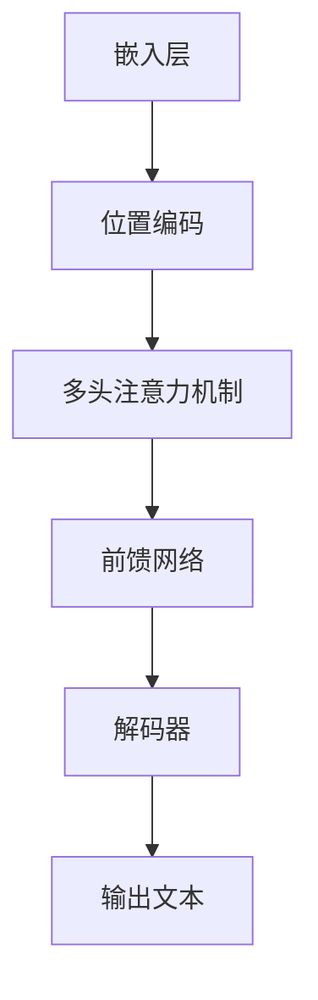
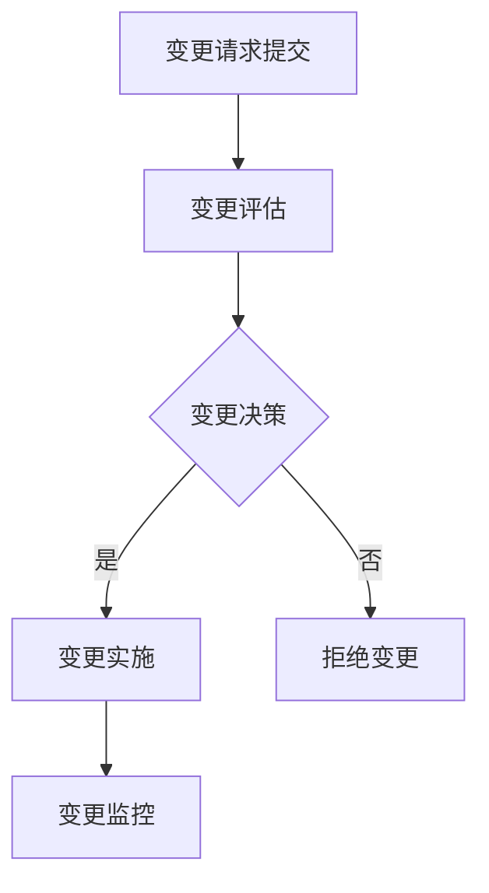

                 

### 引言

在当今技术迅速发展的时代，大型语言模型（LLM，Large Language Model）已经成为了自然语言处理（NLP，Natural Language Processing）领域的重要工具。从智能客服到文本生成，LLM的应用范围越来越广泛，其在提升用户体验、提高工作效率方面发挥着至关重要的作用。然而，随着应用场景的不断变化，如何有效地管理需求变更成为了开发团队面临的一大挑战。

本文将围绕LLM应用的需求变更管理展开讨论。首先，我们将介绍LLM的基础知识，包括其基本概念、原理、架构和应用场景。接着，我们将探讨敏捷开发的基本原则和方法，并阐述如何将敏捷开发与需求变更管理相结合。随后，我们将深入讲解需求变更管理的过程、方法和工具，以及如何在实际的LLM应用项目中实施需求变更管理。最后，我们将通过案例分析、最佳实践和展望，总结本文的主要观点，并对未来的发展趋势提出建议。

通过本文的阅读，读者将了解到：

1. **LLM的基础知识**：理解LLM的基本概念、原理和架构，以及其在不同领域的应用。
2. **敏捷开发与需求变更管理**：掌握敏捷开发的基本原则和方法，并学会如何将其应用于需求变更管理。
3. **需求变更管理的实践方法**：了解需求变更管理的过程、方法和工具，并学会如何在LLM应用项目中实施需求变更管理。
4. **最佳实践与展望**：通过案例分析、最佳实践和未来展望，为实际项目提供有益的参考和指导。

### 文章关键词

- 大型语言模型（LLM）
- 敏捷开发
- 需求变更管理
- 项目管理
- 自然语言处理（NLP）

### 文章摘要

本文主要探讨了大型语言模型（LLM）应用中的需求变更管理问题。首先，介绍了LLM的基本概念、原理、架构和应用场景，使读者对LLM有了一个全面的理解。接着，阐述了敏捷开发的基本原则和方法，并分析了如何将敏捷开发与需求变更管理相结合。随后，详细讲解了需求变更管理的过程、方法和工具，以及如何在实际的LLM应用项目中实施需求变更管理。最后，通过案例分析、最佳实践和展望，总结了本文的主要观点，并对未来的发展趋势提出了建议。本文旨在为开发团队提供一套系统化的需求变更管理方法，帮助他们在快速变化的技术环境中保持灵活性和适应性。

### 2. LLM基础知识

大型语言模型（LLM，Large Language Model）是自然语言处理（NLP，Natural Language Processing）领域的一个重要突破。与传统的小型语言模型相比，LLM拥有更大的模型规模和更强的表达能力，能够处理更加复杂的自然语言任务。本节将详细介绍LLM的基本概念、原理、架构和应用场景，并给出相关的Mermaid流程图，以便读者更好地理解。

#### 2.1 LLM基本概念

LLM是一种基于深度学习的语言模型，它通过学习大量的文本数据，能够生成、理解和处理自然语言。LLM的核心思想是通过对输入文本的编码和解码，实现对文本内容的理解和生成。与传统的小型语言模型相比，LLM具有以下特点：

1. **大规模**：LLM通常拥有数亿甚至数十亿的参数，这使得它们能够捕捉到文本中的复杂模式。
2. **高效率**：LLM利用了现代计算硬件（如GPU、TPU）的优势，能够在较短时间内处理大量文本数据。
3. **强泛化能力**：LLM通过学习大量不同领域的文本数据，能够对各种自然语言任务表现出良好的泛化能力。

#### 2.2 LLM原理

LLM的工作原理可以分为两个阶段：编码和解码。

1. **编码阶段**：编码阶段将输入文本转换为模型能够处理的向量表示。这一过程通常通过嵌入层（Embedding Layer）完成，嵌入层将每个单词映射为一个固定大小的向量。接着，使用位置编码（Positional Encoding）来保留文本中的词语顺序信息。最后，使用注意力机制（Attention Mechanism）对输入序列进行加权处理，从而得到编码后的向量表示。

2. **解码阶段**：解码阶段从编码后的向量表示中生成输出文本。解码过程通常通过自回归语言模型（Autoregressive Language Model）实现。自回归语言模型通过预测下一个单词的概率分布，逐步生成完整的输出文本。这一过程依赖于前一个生成的单词，以确保输出文本的连贯性和准确性。

#### 2.3 LLM架构

LLM的架构通常包括以下几个关键部分：

1. **嵌入层**：将输入文本的每个单词映射为向量。
2. **位置编码**：为每个单词添加位置信息，确保模型能够理解文本中的词语顺序。
3. **多头注意力机制**：通过多个注意力头（Attention Head）对输入序列进行加权处理，提高模型的表示能力。
4. **前馈网络**：对注意力机制处理后的向量进行非线性变换，增强模型的预测能力。
5. **解码器**：自回归语言模型，用于生成输出文本。

以下是LLM的简化架构图：

#### 2.4 LLM应用场景

LLM在自然语言处理领域有着广泛的应用，以下是一些典型的应用场景：

1. **文本生成**：LLM能够生成各种类型的文本，如文章、故事、摘要等。例如，GPT-3（OpenAI）可以在给定一个主题或关键词的情况下，生成高质量的文本内容。
2. **问答系统**：LLM可以用于构建智能问答系统，如智能客服、问答机器人等。通过训练，LLM能够理解和回答用户提出的问题。
3. **机器翻译**：LLM可以用于构建机器翻译系统，如将一种语言的文本翻译为另一种语言。与传统的规则基方法和基于短语的机器翻译方法相比，LLM能够更好地处理长文本和复杂句子结构。
4. **文本分类**：LLM可以用于对文本进行分类，如情感分析、主题分类等。通过训练，LLM能够识别文本中的关键词和主题，并对其进行分类。

#### 2.5 LLM技术趋势

随着技术的不断进步，LLM技术也在不断发展和演进。以下是一些值得关注的技术趋势：

1. **模型规模扩展**：为了处理更加复杂的任务，研究人员正在开发更大规模的LLM，如GPT-4（OpenAI）。更大规模的模型通常能够捕捉到文本中的更多复杂模式，从而提高模型的性能。
2. **多模态学习**：未来的LLM将不仅仅处理文本数据，还可能融合图像、声音等多种模态的信息。多模态学习能够使模型在处理复杂任务时更加灵活和准确。
3. **自适应学习**：LLM可以通过自适应学习机制，根据用户的需求和场景动态调整模型的参数。这种能力将使LLM更好地适应各种应用场景，提高用户体验。

### 3. 敏捷开发概述

敏捷开发（Agile Development）是一种以人为核心、迭代、渐进式的软件开发方法。其核心理念是快速响应变化、持续交付有价值的软件产品。敏捷开发强调团队协作、客户参与和灵活应对变化，以适应快速变化的市场需求和技术环境。本节将介绍敏捷开发的基本原则、方法，以及如何将敏捷开发应用于LLM应用的需求变更管理。

#### 3.1 敏捷开发基本概念

敏捷开发的基本原则包括：

1. **个体和互动重于过程和工具**：敏捷开发认为，开发团队的成员之间的合作和交流比单纯依赖工具和流程更为重要。
2. **可工作的软件重于详尽的文档**：敏捷开发强调实际可运行的软件是评估项目成功的关键，而不仅仅是详尽的文档。
3. **客户协作重于合同谈判**：敏捷开发鼓励与客户的紧密合作，及时获取反馈，以确保开发的产品符合客户的需求。
4. **响应变化重于遵循计划**：敏捷开发认为，需求变化是不可避免的，团队应该灵活应对，以适应变化。

敏捷开发的方法包括：

1. **Scrum**：Scrum是一种流行的敏捷开发方法，它通过短周期的迭代（Sprint）来持续交付软件。每个迭代周期通常为2-4周，团队成员在每个周期末进行回顾和调整。
2. **Kanban**：Kanban是一种基于可视化的敏捷开发方法，它通过限制工作项的数量（Work in Progress，WIP）来提高工作效率。Kanban板（Kanban Board）用于可视化工作流程，团队成员可以实时跟踪任务的进展。

#### 3.2 敏捷开发与需求变更管理

敏捷开发与需求变更管理紧密相关。敏捷开发强调快速响应变化，这意味着在开发过程中，需求可能会频繁变更。因此，如何有效地管理需求变更成为了敏捷开发中的一个重要问题。

1. **需求收集**：在敏捷开发中，需求收集是一个持续的过程。开发团队会定期与客户和利益相关者进行沟通，收集新的需求和变更请求。
2. **需求评估**：收集到的需求需要经过评估，确定其优先级和实现难度。评估过程中，团队会考虑需求对项目的影响、成本和风险等因素。
3. **需求实现**：评估后的需求将被纳入下一个迭代周期的计划中。在实现过程中，团队会采用敏捷开发的方法，如Scrum或Kanban，确保需求按时交付。

#### 3.3 敏捷开发在LLM应用中的需求变更管理

在LLM应用中，需求变更管理尤为重要。由于LLM模型规模庞大、训练时间较长，一旦需求发生变化，可能需要对模型进行重新训练，这将会耗费大量时间和资源。因此，在LLM应用中，需求变更管理需要更加谨慎和有效。

1. **需求收集与评估**：在LLM应用开发初期，团队需要与客户和利益相关者紧密合作，明确项目的需求。在项目进行过程中，团队需要定期收集变更请求，并对这些变更进行优先级评估。对于重要的需求变更，团队应该尽快进行评估，以避免对项目造成重大影响。
2. **迭代开发与持续交付**：在LLM应用开发中，团队可以采用迭代开发和持续交付的方法，确保需求变更能够及时反映到模型中。在每个迭代周期结束时，团队应该对模型进行评估，并根据评估结果调整模型参数，以提高模型的性能和适应性。
3. **风险管理与监控**：在LLM应用开发中，需求变更可能会带来一定的风险。团队需要建立风险管理机制，对变更请求进行风险分析和管理。此外，团队还需要建立监控机制，对模型性能进行实时监控，及时发现和解决潜在问题。

通过以上措施，LLM应用的开发团队可以在敏捷开发的过程中，有效地管理需求变更，确保项目能够按时、按质交付。

### 4. 需求变更管理

在软件开发过程中，需求变更是一种常见的现象。需求变更管理（Change Management）是指对需求变更进行识别、评估、实现和控制的过程。有效的需求变更管理能够确保项目按时交付、满足客户需求，并降低项目风险。本节将详细讲解需求变更管理的概念、过程和方法，并探讨如何在实际项目中实施需求变更管理。

#### 4.1 需求变更管理的过程

需求变更管理通常包括以下几个关键步骤：

1. **需求变更请求**：需求变更管理始于需求变更请求。客户、利益相关者或开发团队可以提出变更请求。变更请求通常包含变更的描述、原因、影响和优先级等信息。
2. **需求变更评估**：评估变更请求的合理性、优先级和影响。评估过程可能涉及成本、时间、资源等因素。评估结果将决定是否批准变更请求。
3. **需求变更实现**：批准的变更请求将被纳入项目计划中，并按照预定的时间表进行实现。实现过程中，开发团队需要确保变更的正确性和完整性。
4. **需求变更控制**：在变更实施过程中，团队需要对变更进行监控和控制，确保变更按照计划进行。如果出现偏差，团队需要及时调整计划，以保持项目进度和质量。

#### 4.2 需求变更管理的具体方法

1. **变更管理工具**：变更管理工具是需求变更管理的重要组成部分。常见的变更管理工具包括JIRA、Confluence等。这些工具可以帮助团队有效地记录、跟踪和管理变更请求。例如，JIRA可以用于创建、分配和跟踪任务，Confluence可以用于记录文档和变更请求的详细信息。
2. **变更管理流程**：变更管理流程是确保需求变更得到有效控制的关键。一个典型的变更管理流程包括以下步骤：

    - **变更请求提交**：利益相关者通过变更管理工具提交变更请求。
    - **变更评估**：评估小组对变更请求进行评估，确定变更的优先级和影响。
    - **变更决策**：根据评估结果，决策小组决定是否批准变更请求。
    - **变更实施**：批准的变更请求将被纳入项目计划中，并按照预定时间表进行实现。
    - **变更监控**：在变更实施过程中，团队需要对变更进行监控和控制，确保变更的正确性和完整性。

以下是变更管理流程的简化图：

#### 4.3 需求变更管理的实际案例

以下是一个需求变更管理的实际案例：

**案例背景**：一个电商平台正在开发新的产品功能，用于推荐商品给用户。在项目初期，开发团队已经确定了推荐算法的基本框架。然而，在项目进行过程中，市场部门提出一个新的需求：推荐算法需要考虑用户的历史购买记录。

**变更请求**：市场部门提出了一个变更请求，要求在推荐算法中增加用户历史购买记录作为输入。该变更请求包括以下信息：

- **变更描述**：在推荐算法中增加用户历史购买记录。
- **变更原因**：提高推荐算法的准确性和用户体验。
- **变更影响**：可能需要调整推荐算法的参数和模型结构，增加开发时间和成本。

**变更评估**：评估小组对变更请求进行了评估，考虑了以下因素：

- **优先级**：该变更对项目的优先级较高，因为市场部门认为这是提高用户满意度的关键因素。
- **成本**：实现该变更可能需要额外的时间和资源，但团队认为这是值得的。
- **风险**：变更可能会影响推荐算法的性能和稳定性，但团队有信心能够控制这些风险。

**变更决策**：决策小组决定批准该变更请求，并将其纳入下一个迭代周期的计划中。

**变更实施**：开发团队在下一个迭代周期中开始实现该变更。首先，团队对推荐算法进行了调整，增加了用户历史购买记录作为输入。然后，团队对模型进行了重新训练，以提高算法的性能。在实现过程中，团队保持了与市场部门的紧密沟通，确保变更的正确性和完整性。

**变更监控**：在变更实施过程中，团队对变更进行了实时监控。团队发现，新的推荐算法在一定程度上提高了用户满意度，但同时也出现了一些问题，如推荐结果有时不够准确。团队迅速进行了调整和优化，最终成功解决了这些问题。

通过以上步骤，开发团队成功地管理了需求变更，确保项目按时交付并满足了客户的需求。

#### 4.4 需求变更管理的挑战与对策

在需求变更管理过程中，开发团队可能会面临以下挑战：

1. **变更频繁**：在快速变化的市场环境中，需求变更可能会频繁出现，这对团队的工作效率和项目进度造成压力。
2. **变更成本**：一些需求变更可能需要额外的开发时间和资源，这可能会增加项目的成本。
3. **变更影响**：需求变更可能会对项目的其他部分产生影响，如功能、性能和稳定性等。

为了应对这些挑战，团队可以采取以下对策：

1. **建立变更管理流程**：建立一个明确的变更管理流程，确保变更请求得到及时评估和响应。
2. **优先级排序**：对变更请求进行优先级排序，确保重要的变更得到优先处理。
3. **风险评估**：在评估变更请求时，考虑变更可能带来的风险，并制定相应的应对措施。
4. **沟通与协作**：加强团队与利益相关者之间的沟通和协作，确保变更请求的准确理解和有效实施。

通过以上措施，开发团队可以更好地管理需求变更，确保项目的成功交付。

### 5. LLM应用的需求变更管理实践

在实际的LLM应用项目中，需求变更管理是一个复杂且关键的过程。由于LLM模型的规模和复杂性，任何需求变更都可能对项目的进度、成本和质量产生重大影响。本节将结合具体案例，详细讲解如何在实际的LLM应用项目中实施需求变更管理，并提供一些最佳实践经验。

#### 5.1 案例背景

一个国际知名互联网公司正在开发一款智能客服系统，该系统利用大型语言模型（LLM）来处理客户的咨询和投诉。在项目初期，团队已经确定了系统的基本架构和功能模块。然而，在开发过程中，客户的需求不断变化，这对项目团队提出了巨大的挑战。

#### 5.2 需求变更请求

在项目进行到中期时，客户提出了一个新的需求：增加一个自定义问答模块，允许客户通过自定义问题快速获取帮助。这个需求变更包括以下关键信息：

- **变更描述**：在智能客服系统中增加一个自定义问答模块。
- **变更原因**：提高用户体验，使客户能够更快速地获取他们需要的帮助。
- **变更影响**：可能需要修改现有的LLM模型结构，增加新的数据输入和输出接口，调整算法参数等。

#### 5.3 需求变更评估

团队对变更请求进行了详细的评估，考虑了以下几个方面：

- **优先级**：这个需求对用户体验的提升非常重要，因此被赋予高优先级。
- **成本**：实现这个需求可能需要额外的开发时间和资源，但团队认为这是值得的。
- **风险**：变更可能会对LLM模型的性能和稳定性产生影响，需要仔细评估和监控。

#### 5.4 需求变更实现

在评估结果出来后，团队决定将这个需求纳入下一个迭代周期的计划中。以下是如何实现需求变更的步骤：

1. **需求分析**：团队对变更需求进行了详细的需求分析，明确了新的功能需求和接口设计。
2. **模型调整**：根据新的需求，团队对LLM模型进行了调整。他们增加了新的数据输入和输出接口，并调整了算法参数，以确保模型能够正确处理自定义问题。
3. **数据准备**：为了训练新的LLM模型，团队需要准备相关的数据集。他们收集了大量的自定义问题及其答案，并进行了数据清洗和预处理。
4. **模型训练**：团队使用新的数据集对LLM模型进行了重新训练。这个过程可能需要较长的时间和大量的计算资源。
5. **测试与优化**：在模型训练完成后，团队对自定义问答模块进行了严格的测试和优化，确保其能够满足需求并保持系统的稳定性和性能。

#### 5.5 需求变更管理实践

以下是在这个案例中，团队实施需求变更管理的一些最佳实践经验：

1. **尽早沟通**：在需求变更提出时，团队立即与客户和利益相关者进行了沟通，确保变更请求的准确理解和快速响应。
2. **风险评估**：在变更实施前，团队对变更可能带来的风险进行了全面评估，并制定了相应的应对措施。
3. **持续监控**：在变更实施过程中，团队对模型的性能和稳定性进行了实时监控，及时发现和解决问题。
4. **迭代优化**：在变更完成后，团队对系统进行了迭代优化，确保新功能能够稳定运行并满足客户需求。

通过以上实践，团队成功地管理了需求变更，确保了项目的顺利进行和最终交付。

#### 5.6 案例分析

在案例分析中，我们可以看到以下几个关键点：

1. **变更管理的及时性**：团队在需求变更提出后，立即进行了评估和响应，避免了变更积累导致的混乱。
2. **风险控制的充分性**：团队在变更实施前进行了充分的风险评估，并制定了应对措施，降低了变更带来的潜在风险。
3. **协作与沟通的重要性**：团队与客户和利益相关者保持了紧密的沟通和协作，确保变更请求的准确理解和有效实施。
4. **迭代优化的持续性**：团队在变更完成后，对系统进行了持续的优化，确保新功能能够稳定运行并满足客户需求。

通过这个案例，我们可以看到，有效的需求变更管理对于LLM应用项目的重要性。通过合理的流程、评估和实施方法，团队可以在快速变化的市场环境中保持灵活性和适应性，确保项目的成功交付。

### 6. 持续改进与最佳实践

在LLM应用的需求变更管理过程中，持续改进是确保团队效率和项目成功的关键。通过识别和实施改进措施，团队可以优化需求变更管理流程，提高项目的交付质量和速度。本节将介绍持续改进的方法、工具和最佳实践，以及注意事项和拓展阅读。

#### 6.1 持续改进的方法

持续改进是敏捷开发中的一个重要原则，它强调不断反思和优化现有的流程和做法。以下是一些常用的持续改进方法：

1. **根因分析**：通过根因分析（Root Cause Analysis，RCA），团队可以识别问题的根本原因，而不是仅仅解决表面问题。RCA通常包括以下步骤：

    - **定义问题**：明确问题是什么，并收集相关数据。
    - **收集数据**：收集与问题相关的数据和信息，例如时间、地点、人员等。
    - **识别原因**：通过数据分析和专家访谈，识别问题的潜在原因。
    - **制定对策**：制定具体的对策，以解决根本原因。

2. **过程优化**：过程优化（Process Optimization）是指通过改进流程来提高效率和质量。以下是一些过程优化的步骤：

    - **流程映射**：绘制当前流程图，明确流程中的各个环节。
    - **流程分析**：分析流程中的瓶颈和浪费，确定优化目标。
    - **流程改进**：实施改进措施，如简化流程、自动化流程等。
    - **流程监控**：监控改进效果，并根据反馈进行调整。

3. **持续学习与培训**：团队应该不断学习新的技能和知识，以适应不断变化的技术环境和需求。以下是一些持续学习与培训的方法：

    - **内部培训**：组织内部培训，分享最佳实践和经验。
    - **外部学习**：参加行业会议、研讨会和培训课程，了解最新的技术和方法。
    - **在线学习**：利用在线资源，如博客、视频教程和在线课程，学习新技能。

#### 6.2 持续改进的工具

为了有效地进行持续改进，团队需要使用一些工具来支持流程分析和改进。以下是一些常用的工具：

1. **根因分析工具**：例如，因果图、鱼骨图和五问法（5 Whys）等，可以帮助团队识别问题的根本原因。
2. **过程优化工具**：例如，流程图软件（如Visio）、项目管理软件（如JIRA、Trello）和自动化工具（如自动化测试框架）等，可以帮助团队优化流程和自动化重复性任务。
3. **持续学习工具**：例如，在线学习平台（如Coursera、edX）和知识管理系统（如Confluence）等，可以帮助团队持续学习和分享知识。

#### 6.3 最佳实践

以下是一些在LLM应用需求变更管理中行之有效的最佳实践：

1. **定期回顾与反思**：团队应该定期进行回顾与反思，评估需求变更管理的流程和效果。这可以帮助团队识别问题并制定改进措施。
2. **透明沟通**：保持与客户和利益相关者的透明沟通，确保他们了解需求变更的进度和影响。这有助于减少误解和冲突。
3. **持续集成与测试**：在变更实施过程中，使用持续集成（CI）和持续测试（CT）来确保变更的正确性和完整性。这有助于及早发现和解决问题。
4. **文档化**：文档化需求变更的流程、决策和结果，以便于后续的回顾和改进。这有助于保持信息的透明和可追溯性。

#### 6.4 注意事项

在实施持续改进过程中，团队需要注意以下几点：

1. **平衡改进与交付**：持续改进不能影响项目的交付进度和质量。团队需要在改进和交付之间找到平衡点。
2. **避免过度优化**：过度优化可能会导致流程变得复杂和不必要。团队需要确保改进措施的实际效益。
3. **人员参与**：持续改进需要团队所有成员的参与和支持。鼓励团队成员提出改进建议，并确保他们的意见得到认真考虑。

#### 6.5 拓展阅读

以下是一些拓展阅读资源，供读者深入了解持续改进和需求变更管理：

1. **《敏捷实践指南》**：作者：杰伊·阿姆斯特朗（Jay Armeson），这本书详细介绍了敏捷开发的方法和实践，对需求变更管理有很好的指导作用。
2. **《根因分析技术》**：作者：布莱恩·特雷西（Brian Tracy），这本书介绍了根因分析的方法和应用，有助于团队识别和解决根本问题。
3. **《流程优化实践》**：作者：大卫·布斯奇（David Beshears），这本书提供了流程优化的方法和案例分析，有助于团队优化流程和提高效率。

通过以上方法和最佳实践，团队可以在LLM应用的需求变更管理中保持持续改进，提高项目的交付质量和效率。

### 7. 案例分析

在本节中，我们将通过一个实际案例，深入分析LLM应用中的需求变更管理过程，并提供详细的解读和剖析。

#### 7.1 案例背景

一个在线教育平台正在开发一款智能辅导系统，该系统利用大型语言模型（LLM）为学生提供个性化的学习建议。在项目的初期阶段，团队已经确定了系统的基础架构和核心功能。然而，在项目进行过程中，客户的需求不断变化，这对团队提出了巨大的挑战。

#### 7.2 需求变更请求

在项目进行到中期时，客户提出了一个新的需求：增加一个个性化学习计划推荐功能，该功能可以根据学生的学习进度、兴趣和能力，为学生推荐定制化的学习计划。这个需求变更包括以下关键信息：

- **变更描述**：在智能辅导系统中增加个性化学习计划推荐功能。
- **变更原因**：提高学生的学习效果和满意度，帮助学生更好地掌握知识。
- **变更影响**：可能需要修改现有的LLM模型结构，增加新的数据输入和处理逻辑，调整算法参数等。

#### 7.3 需求变更评估

团队对变更请求进行了详细的评估，考虑了以下几个方面：

- **优先级**：这个需求对用户体验的提升非常重要，因此被赋予高优先级。
- **成本**：实现这个需求可能需要额外的开发时间和资源，但团队认为这是值得的。
- **风险**：变更可能会对LLM模型的性能和稳定性产生影响，需要仔细评估和监控。

#### 7.4 需求变更实现

在评估结果出来后，团队决定将这个需求纳入下一个迭代周期的计划中。以下是实现需求变更的详细步骤：

1. **需求分析**：团队对变更需求进行了详细的需求分析，明确了新的功能需求和接口设计。
2. **模型调整**：根据新的需求，团队对LLM模型进行了调整。他们增加了新的数据输入和输出接口，并调整了算法参数，以确保模型能够正确处理个性化学习计划推荐。
3. **数据准备**：为了训练新的LLM模型，团队需要准备相关的数据集。他们收集了大量的学生学习数据，包括学习进度、兴趣和能力等信息，并进行了数据清洗和预处理。
4. **模型训练**：团队使用新的数据集对LLM模型进行了重新训练。这个过程可能需要较长的时间和大量的计算资源。
5. **测试与优化**：在模型训练完成后，团队对个性化学习计划推荐功能进行了严格的测试和优化，确保其能够满足需求并保持系统的稳定性和性能。

#### 7.5 需求变更管理过程分析

在这个案例中，我们可以看到需求变更管理的过程包括以下几个关键步骤：

1. **变更请求提交**：客户提出了新的需求变更，并通过平台提交了详细的请求。
2. **变更评估**：团队对变更请求进行了详细的评估，包括优先级、成本和风险等方面。
3. **变更决策**：团队决定将变更请求纳入下一个迭代周期的计划中，并制定了详细的实施计划。
4. **变更实现**：团队按照计划对LLM模型进行了调整和重新训练，并进行了测试和优化。
5. **变更监控**：在变更实施过程中，团队对模型性能和系统稳定性进行了实时监控，并及时解决了出现的问题。

#### 7.6 案例解读与剖析

通过这个案例，我们可以深入剖析需求变更管理的几个关键点：

1. **及时响应**：团队在需求变更提出后，立即进行了评估和响应，避免了变更积累导致的混乱。这表明团队具有良好的变更管理意识和流程。
2. **风险评估**：团队在变更实施前对变更可能带来的风险进行了全面评估，并制定了相应的应对措施。这有助于降低变更带来的潜在风险。
3. **协作与沟通**：团队与客户和利益相关者保持了紧密的沟通和协作，确保变更请求的准确理解和有效实施。这有助于减少误解和冲突。
4. **持续优化**：在变更完成后，团队对系统进行了迭代优化，确保新功能能够稳定运行并满足客户需求。这表明团队具有持续改进的精神和能力。

#### 7.7 案例启示

通过这个案例，我们可以得到以下启示：

1. **重视需求变更管理**：需求变更在软件开发中是不可避免的，团队需要重视需求变更管理，确保变更能够得到及时、有效的响应和实施。
2. **平衡变更与交付**：在实施需求变更时，团队需要平衡变更与项目交付之间的矛盾，确保变更不会影响项目进度和质量。
3. **持续改进**：团队应该保持持续改进的精神，不断优化变更管理流程和做法，以提高项目的交付效率和效果。

通过这个案例的分析和解读，我们可以更深入地理解需求变更管理在LLM应用中的重要性，并为实际项目提供有益的参考和指导。

### 8. 总结与展望

本文系统地探讨了大型语言模型（LLM）应用中的需求变更管理问题，从基础概念、敏捷开发、需求变更管理过程、实践方法、持续改进以及案例分析等多个角度进行了深入分析。通过本文的阐述，读者可以了解到：

1. **LLM基础知识**：理解了LLM的基本概念、原理、架构和应用场景，以及其与自然语言处理（NLP）的密切联系。
2. **敏捷开发与需求变更管理**：掌握了敏捷开发的基本原则和方法，并学会了如何将其应用于需求变更管理，确保项目灵活性和响应能力。
3. **需求变更管理过程和方法**：了解了需求变更管理的详细过程、方法和工具，包括需求变更请求、评估、实现和控制等关键步骤。
4. **实际应用与实践经验**：通过具体案例，学习了如何在LLM应用项目中实施需求变更管理，并总结了最佳实践经验。
5. **持续改进与最佳实践**：探讨了如何通过持续改进和最佳实践，优化需求变更管理流程，提高项目交付质量和效率。

在未来的发展趋势方面，以下几点值得关注：

1. **LLM技术的进步**：随着计算能力和数据资源的发展，LLM的规模和性能将不断提升，带来更多的应用场景和机会。
2. **多模态学习**：未来的LLM将可能融合图像、声音等多种模态的信息，实现更加智能和灵活的交互。
3. **个性化与自适应**：LLM将在个性化推荐、自适应学习等领域发挥重要作用，为用户提供更加定制化的服务。
4. **需求变更管理的智能化**：利用人工智能和机器学习技术，可以自动化和智能化地处理需求变更，提高变更管理的效率和准确性。

**建议与展望**：

1. **加强团队协作**：在需求变更管理过程中，团队协作至关重要。通过建立高效的沟通机制和协作工具，确保团队能够快速响应和应对变更。
2. **持续学习与培训**：团队应不断学习新的技能和知识，以适应技术快速变化的环境，保持竞争力。
3. **完善流程与工具**：建立完善的变更管理流程和工具，确保变更的透明、可控和高效。
4. **重视用户体验**：在需求变更管理中，始终关注用户体验，确保变更能够真正满足用户需求，提升产品价值。

通过本文的探讨，希望能够为开发团队提供一套系统化的需求变更管理方法，帮助他们在快速变化的技术环境中保持灵活性和适应性。在未来的工作中，我们将继续关注LLM应用和需求变更管理的最新动态，不断探索和实践，为技术发展和项目成功贡献更多力量。

### 作者信息

- 作者：AI天才研究院（AI Genius Institute）& 禅与计算机程序设计艺术（Zen And The Art of Computer Programming）

