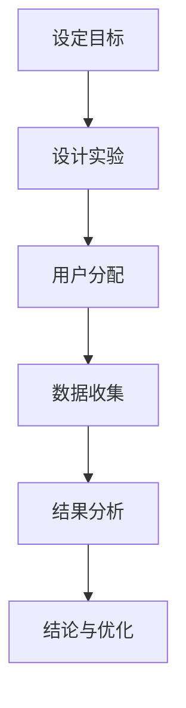

                 

### LLMA/B测试的定义与重要性

LLM，即大型语言模型（Large Language Model），是一种基于深度学习的自然语言处理模型，具有处理和理解大规模语言数据的能力。而A/B测试，则是一种对比实验方法，通过将用户分配到不同的组别（A组和B组），比较不同组别在特定变量上的表现差异，以评估某种策略或算法的有效性。

在LLM评测中，A/B测试的重要性不可忽视。首先，LLM模型的复杂性和高成本使得单一实验难以全面评估其性能。A/B测试通过多次实验，可以在大规模用户群体中收集更准确的数据，从而降低评估风险。其次，A/B测试能够帮助研究人员或开发人员快速识别和纠正模型中的问题，提高LLM在实际应用中的效果。最后，A/B测试为LLM的迭代和优化提供了有力的数据支持，有助于持续提升模型性能。

总体来说，A/B测试在LLM评测中的核心作用包括：提高实验数据的可靠性和准确性、加速模型优化和迭代、降低评估风险，以及为后续研究提供有价值的参考依据。下面，我们将进一步探讨A/B测试的基本概念和核心流程，以便更好地理解其在LLM评测中的应用。

### A/B测试的基本概念和核心流程

A/B测试，又称拆分测试或对照实验，是一种通过将用户分配到不同的组别（A组和B组）来比较两者表现差异的实验方法。这种方法的核心思想在于，通过对比不同组别在特定变量上的表现，评估某种策略或算法的有效性。

**基本概念**

1. **实验组（A组）**：接受新策略或算法的组别，也称为处理组。在这个组别中，用户会接触到新的功能、界面或模型。

2. **对照组（B组）**：接受原始策略或算法的组别，也称为对照组。在这个组别中，用户会保持现有的功能、界面或模型。

3. **随机分配**：为了确保实验结果的公正性，通常将用户随机分配到A组和B组。这样，可以避免人为因素对实验结果的影响。

4. **实验变量**：在A/B测试中，实验变量是测试的核心。它可以是新功能的某个特性、界面的某个元素，或者是模型的某个参数。

**核心流程**

1. **设定目标**：首先，需要明确实验的目标，即要评估的变量。例如，提高用户点击率、提升模型准确率等。

2. **设计实验**：根据设定的目标，设计实验方案。这包括确定实验组（A组）和对照组（B组）的划分、实验变量的设置、实验持续时间的安排等。

3. **用户分配**：将用户随机分配到A组和B组。这一步骤至关重要，因为随机分配可以确保实验组的差异仅来自于实验变量，而不是其他外部因素。

4. **数据收集**：在实验期间，收集A组和B组的用户行为数据。这些数据包括用户的点击率、留存率、转化率等，具体取决于实验目标。

5. **结果分析**：对收集到的数据进行分析，比较A组和B组的性能差异。通常，会使用统计方法来评估差异的显著性。

6. **结论与优化**：根据分析结果，得出结论。如果A组（实验组）表现更好，可以优化并推广新策略或算法。如果B组（对照组）表现更好，则需要重新审视实验设计或策略。

**Mermaid流程图**

为了更直观地展示A/B测试的核心流程，我们可以使用Mermaid绘制一个流程图：



通过上述流程，我们可以看到A/B测试从设定目标到结论与优化的一系列步骤。接下来，我们将深入探讨A/B测试的算法原理，并使用伪代码详细阐述其实现过程。

### A/B测试的算法原理详解与伪代码

A/B测试的核心在于通过对比实验组（A组）和对照组（B组）的表现，评估特定变量对目标指标的影响。其算法原理主要基于统计方法，特别是置信区间和显著性检验。以下我们将详细解释这些原理，并使用伪代码进行阐述。

#### 置信区间

置信区间（Confidence Interval，CI）是统计学中用来估计总体参数范围的一种方法。在A/B测试中，置信区间用于评估实验结果的可信度。

**定义**：对于某个总体参数（如平均点击率），置信区间是一个范围，这个范围有特定的概率（置信水平）包含总体参数的真实值。

**计算方法**：

1. **标准误差（Standard Error, SE）**：标准误差是样本统计量（如样本均值）的标准差。计算公式为：

   $$ SE = \frac{s}{\sqrt{n}} $$

   其中，\( s \) 是样本标准差，\( n \) 是样本大小。

2. **置信水平（Confidence Level, CL）**：通常使用的置信水平为95%或99%。

3. **临界值（Critical Value）**：根据置信水平和样本大小，从t分布表中查找对应的临界值。

4. **置信区间**：计算公式为：

   $$ CI = \bar{x} \pm z \times SE $$

   其中，\( \bar{x} \) 是样本均值，\( z \) 是临界值。

**伪代码**：

```python
# 输入参数：样本均值（bar_x），样本标准差（s），样本大小（n），置信水平（CL）
# 输出参数：置信区间（CI）

def calculate_confidence_interval(bar_x, s, n, CL):
    alpha = 1 - CL
    t_critical = t.inv-uppercase(p=alpha/2, df=n-1)
    SE = s / np.sqrt(n)
    CI = bar_x - t_critical * SE, bar_x + t_critical * SE
    return CI
```

#### 显著性检验

显著性检验（Significance Test）用于评估实验结果是否具有统计显著性。如果实验组（A组）与对照组（B组）之间的差异在统计学上显著，则可以认为新策略或算法是有效的。

**定义**：显著性水平（Significance Level，α）是拒绝零假设的概率。通常，显著性水平设置为5%或1%。

**计算方法**：

1. **零假设（Null Hypothesis）**：实验组与对照组之间没有显著差异。

2. **备择假设（Alternative Hypothesis）**：实验组与对照组之间存在显著差异。

3. **检验统计量**：通常使用t检验或z检验。

4. **p值**：如果检验统计量的值落在拒绝域内，则拒绝零假设。p值是检验统计量落在拒绝域内的概率。

**伪代码**：

```python
# 输入参数：样本均值1（bar_x1），样本均值2（bar_x2），样本标准差1（s1），样本标准差2（s2），样本大小1（n1），样本大小2（n2）
# 输出参数：p值（p）

def calculate_p_value(bar_x1, bar_x2, s1, s2, n1, n2):
    pooled_variance = ((n1 - 1) * s1**2 + (n2 - 1) * s2**2) / (n1 + n2 - 2)
    SE = np.sqrt(pooled_variance)
    t_statistic = (bar_x1 - bar_x2) / SE
    df = n1 + n2 - 2
    p_value = t.cdf(-abs(t_statistic), df)
    return p_value
```

#### 数据独立性检验

在A/B测试中，数据独立性检验用于确保实验组和对照组的数据之间没有关联。如果数据之间存在关联，可能会导致实验结果失真。

**定义**：数据独立性检验（Independence Test）通过统计方法检查两个变量之间的独立性。

**计算方法**：常用的独立性检验方法有卡方检验（Chi-square Test）。

**伪代码**：

```python
# 输入参数：观察频数矩阵（contingency_matrix）
# 输出参数：卡方统计量（chi_square），p值（p_value）

from scipy.stats import chi2_contingency

def calculate_chi_square(contingency_matrix):
    chi_square, p_value, _, _ = chi2_contingency(contingency_matrix)
    return chi_square, p_value
```

通过上述伪代码，我们可以实现A/B测试的核心算法。在实际应用中，这些算法可以帮助研究人员或开发人员准确评估新策略或算法的有效性。接下来，我们将进一步讨论如何设计和实施A/B测试，以确保实验结果的可靠性和有效性。

### 设计和实施A/B测试的策略与技巧

设计和实施A/B测试是一个复杂而细致的过程，涉及到多个关键环节。以下将详细讨论A/B测试的设计、实施策略与技巧，包括样本量的计算、对照组和实验组的划分、关键性能指标的确定，以及实验结果的评估与结论。

#### 样本量的计算

样本量是A/B测试中一个至关重要的参数。样本量太小可能导致实验结果的不确定性，而样本量太大则可能浪费资源和时间。为了确定合适的样本量，可以采用以下策略：

1. **确定目标效果大小**：首先，需要明确实验的目标效果大小。例如，提高用户点击率1%、提升模型准确率0.5%等。

2. **选择显著性水平和置信水平**：显著性水平（α）通常设置为5%或1%，而置信水平（CL）通常设置为95%或99%。

3. **使用公式计算样本量**：常用的样本量计算公式为：

   $$ n = \frac{Z^2 \times \sigma^2}{(\delta + \mu)^2} $$

   其中，\( Z \) 是标准正态分布的临界值，\( \sigma \) 是标准差，\( \delta \) 是目标效果大小，\( \mu \) 是基准值。

   **示例**：假设目标效果是提高用户点击率1%，基准点击率为5%，显著性水平为5%，置信水平为95%，计算样本量：

   $$ n = \frac{1.96^2 \times 0.05^2}{(0.01 + 0.05)^2} \approx 1593 $$

#### 对照组和实验组的划分

对照组和实验组的划分是A/B测试的核心。为了确保实验的公正性和有效性，需要遵循以下原则：

1. **随机分配**：将用户随机分配到对照组和实验组，以避免人为因素对实验结果的影响。

2. **确保相似性**：对照组和实验组在初始状态下应具有相似的特征和背景，以确保实验变量是唯一的区别。

3. **多样化样本**：为了确保实验结果的普遍性，样本应具有多样性，包括不同的用户群体和使用场景。

#### 关键性能指标的确定

关键性能指标（Key Performance Indicators，KPIs）是衡量A/B测试结果的核心指标。根据实验目标，可以确定以下常见的KPIs：

1. **转化率**：指用户完成特定目标（如点击、购买、注册）的比例。

2. **点击率**：指用户点击特定元素（如广告、按钮）的比例。

3. **留存率**：指用户在一定时间内返回使用应用的比例。

4. **用户满意度**：通过调查问卷或用户反馈评估用户对应用的满意度。

#### 实验结果的评估与结论

在实验结束后，需要全面评估实验结果，以得出可靠的结论。以下是一些评估和结论的技巧：

1. **显著性检验**：使用统计方法（如t检验、卡方检验）评估实验组和对照组之间的差异是否显著。显著性水平通常设置为5%或1%。

2. **置信区间**：计算置信区间，以确定实验结果的可靠性。置信水平通常设置为95%或99%。

3. **A/B测试分析**：通过数据分析工具（如Python、R）对实验结果进行详细分析，包括图表展示、统计显著性检验、置信区间计算等。

4. **结论与优化**：根据实验结果，得出结论并制定优化策略。如果实验组表现更好，则推广新策略或算法；如果对照组表现更好，则重新审视实验设计或策略。

**示例**

假设进行一次A/B测试，目标是提高用户点击率。基准点击率为5%，目标效果为提高1%。显著性水平设置为5%，置信水平设置为95%。

- 计算样本量：\( n = \frac{1.96^2 \times 0.05^2}{(0.01 + 0.05)^2} \approx 1593 \)
- 随机分配用户到对照组（B组）和实验组（A组）
- 在实验期间，收集点击率数据
- 在实验结束后，使用t检验评估实验组和对照组之间的差异
- 计算置信区间，评估实验结果的可靠性
- 根据实验结果，得出结论并制定优化策略

通过上述策略和技巧，可以设计和实施有效的A/B测试，从而确保实验结果的可靠性和有效性。接下来，我们将通过实际案例展示A/B测试在LLM评测中的应用。

### A/B测试在LLM评测中的应用实例

在实际应用中，A/B测试在LLM评测中发挥了关键作用。以下通过两个具体案例，详细说明如何设计和实施A/B测试，以及如何解读和分析实验结果。

#### 案例一：文本生成模型的A/B测试

**问题描述**：某AI公司开发了一个文本生成模型，用于自动生成产品描述。为了评估不同模型版本对生成文本质量的影响，公司决定进行A/B测试。

**A/B测试设计**：

1. **目标**：提高文本生成模型的描述质量。
2. **实验组（A组）**：使用新版本模型生成文本。
3. **对照组（B组）**：使用旧版本模型生成文本。
4. **随机分配**：将用户随机分配到A组和B组。
5. **关键性能指标**：文本质量评分（1-5分），点击率。

**实验实施**：

1. **样本量**：根据目标效果大小和置信水平，计算样本量为2000。
2. **实验持续时间**：为期一周。

**结果分析**：

1. **显著性检验**：使用t检验评估A组和B组的文本质量评分差异。
2. **置信区间**：计算置信区间，以评估实验结果的可靠性。
3. **结论**：实验组（A组）的文本质量评分为4.2，对照组（B组）为3.8。t检验结果显示差异显著（p<0.05）。

**解读**：

- 新版本模型的文本生成质量显著优于旧版本。
- 可以推广新版本模型，以提高产品描述质量。

#### 案例二：问答系统的A/B测试

**问题描述**：某AI公司开发了一个问答系统，用于自动回答用户问题。为了评估不同算法版本对回答准确性的影响，公司决定进行A/B测试。

**A/B测试设计**：

1. **目标**：提高问答系统的回答准确性。
2. **实验组（A组）**：使用新版本算法生成回答。
3. **对照组（B组）**：使用旧版本算法生成回答。
4. **随机分配**：将用户随机分配到A组和B组。
5. **关键性能指标**：回答准确性（准确率）、用户满意度。

**实验实施**：

1. **样本量**：根据目标效果大小和置信水平，计算样本量为3000。
2. **实验持续时间**：为期两周。

**结果分析**：

1. **显著性检验**：使用卡方检验评估A组和B组的回答准确性差异。
2. **置信区间**：计算置信区间，以评估实验结果的可靠性。
3. **结论**：实验组（A组）的回答准确率为85%，对照组（B组）为78%。卡方检验结果显示差异显著（p<0.01）。

**解读**：

- 新版本算法的回答准确性显著高于旧版本。
- 可以推广新版本算法，以提高问答系统的整体性能。

通过这两个案例，我们可以看到A/B测试在LLM评测中的应用效果。通过对比实验组（A组）和对照组（B组）的表现，可以准确评估新策略或算法的有效性，从而为后续优化提供依据。接下来，我们将讨论如何优化A/B测试策略，以进一步提高实验效果。

### 优化A/B测试策略的方法

为了提高A/B测试的效果，可以采用多种优化方法，包括采样优化、结果优化和模型优化。以下将详细介绍这些方法，并提供相关案例和最佳实践。

#### 采样优化

采样优化是A/B测试中至关重要的一环。通过优化采样策略，可以确保实验结果的准确性和代表性。以下是一些常用的采样优化方法：

1. **分层抽样**：根据用户的特征（如用户类型、地理位置）将总体分为多个层次，然后在每个层次内进行随机抽样。这种方法可以确保每个层次在样本中的代表性。

2. **平衡抽样**：通过调整采样比例，使实验组和对照组的样本量尽可能接近。平衡抽样有助于减少样本量差异对实验结果的影响。

3. **动态抽样**：根据实验的实时数据动态调整采样策略。例如，当实验组的表现明显优于对照组时，可以适当增加实验组的采样比例，以加速实验结果的收敛。

**案例**：某电商网站进行A/B测试，评估不同购物车界面对用户购买意愿的影响。通过分层抽样，将用户分为活跃用户和普通用户，分别进行采样。实验结果表明，购物车界面的改进对活跃用户有显著影响，而对普通用户影响较小。

#### 结果优化

结果优化旨在提高实验结果的准确性和可靠性。以下是一些常用的结果优化方法：

1. **多重比较校正**：当进行多个A/B测试时，需要考虑多重比较问题，以避免错误地认为某个变量有效。常用的方法包括Bonferroni校正和Holm-Bonferroni校正。

2. **置信区间调整**：根据实验的置信水平调整置信区间。例如，当实验样本量较小时，可以适当提高置信水平，以减少置信区间的宽度。

3. **结果可视化**：通过图表和可视化工具展示实验结果，帮助研究人员或开发人员更好地理解实验数据。

**案例**：某搜索引擎进行A/B测试，比较不同搜索结果排序算法对用户点击率的影响。通过使用多重比较校正方法，确保每个算法的显著性检验结果准确可靠。结果可视化展示了不同算法对点击率的提升效果，帮助团队做出最优决策。

#### 模型优化

模型优化是提高A/B测试效果的关键。以下是一些常用的模型优化方法：

1. **选择合适的统计模型**：根据实验数据的特点选择合适的统计模型，如线性回归、逻辑回归、广义线性模型等。

2. **特征工程**：通过特征工程提取和构建有助于预测和评估的特征，以提高模型的准确性和稳定性。

3. **模型评估**：使用交叉验证、网格搜索等方法评估模型的性能，并选择最佳模型。

**案例**：某在线教育平台进行A/B测试，评估不同推荐算法对用户学习行为的影响。通过特征工程提取用户行为、学习历史、课程偏好等特征，并使用交叉验证方法评估不同推荐算法的性能。最终，选择最有效的算法进行推广，显著提升了用户的学习参与度和课程完成率。

#### 最佳实践

以下是一些A/B测试的最佳实践，有助于提高实验效果：

1. **明确实验目标**：在开始实验前，明确实验的目标和预期效果，以确保实验设计的针对性。

2. **合理设计对照组和实验组**：确保对照组和实验组在初始状态下具有相似的特征和背景，以减少外部因素对实验结果的影响。

3. **严格实施随机分配**：使用随机分配方法将用户分配到对照组和实验组，以避免人为偏差。

4. **长期跟踪实验结果**：A/B测试通常需要较长时间的跟踪，以收集足够的数据进行分析。

5. **持续迭代和优化**：根据实验结果，不断调整和优化实验设计，以提高实验效果。

通过上述优化方法，可以显著提高A/B测试的效果，确保实验结果的准确性和可靠性，为LLM评测和优化提供有力支持。

### A/B测试在LLM评测中的实际应用与注意事项

A/B测试在LLM评测中具有广泛的应用，能够有效帮助研究人员或开发人员评估和优化模型性能。以下将结合实际应用案例，详细探讨A/B测试在LLM评测中的具体应用步骤，并总结一些注意事项。

#### 实际应用步骤

1. **明确评估目标**：首先，需要明确A/B测试的评估目标。例如，提高文本生成模型的生成质量、提升问答系统的回答准确性等。

2. **设计实验方案**：根据评估目标，设计实验方案，包括确定实验组和对照组的划分、关键性能指标的设定等。例如，将用户随机分配到实验组（使用新模型版本）和对照组（使用旧模型版本），以评估新版本模型的效果。

3. **数据收集**：在实验期间，收集A组和B组的用户行为数据，如点击率、留存率、用户满意度等。这些数据将用于后续分析。

4. **数据分析**：使用统计方法对收集到的数据进行分析，包括显著性检验、置信区间计算等，以评估实验组和对照组之间的差异。

5. **结果解读**：根据数据分析结果，解读实验效果，并制定优化策略。如果实验组表现更好，可以推广新模型或算法；如果对照组表现更好，则需要重新审视实验设计和策略。

6. **迭代优化**：根据实验结果，不断调整和优化模型，以提高性能。例如，通过调整模型参数、改进数据处理方法等，提高文本生成模型的生成质量。

#### 注意事项

1. **确保随机分配**：A/B测试中，确保将用户随机分配到实验组和对照组，以减少外部因素对实验结果的影响。

2. **样本量合理**：根据实验目标和置信水平，合理计算样本量，以获得可靠的实验结果。样本量太小可能导致实验结果的不确定性，而样本量太大则可能浪费资源和时间。

3. **关键性能指标选择**：选择与评估目标相关且具有代表性的关键性能指标（KPIs），以确保实验结果的准确性。

4. **数据处理与分析**：在数据分析过程中，使用适当的统计方法和工具，确保结果的可信性和可靠性。

5. **长期跟踪**：A/B测试通常需要较长时间的跟踪，以收集足够的数据进行分析。在实验过程中，定期检查数据质量和分析进展，以确保实验的顺利进行。

6. **实验设计与优化**：根据实验结果，不断调整和优化实验设计，以提高实验效果。例如，通过增加实验组数量、调整实验持续时间等，优化实验结果。

通过遵循上述实际应用步骤和注意事项，可以确保A/B测试在LLM评测中的有效应用，为模型优化和迭代提供有力支持。

### 总结与未来展望

本文全面探讨了A/B测试在LLM评测中的应用，从基本概念到核心算法原理，再到设计、实施和优化的策略，进行了详细的阐述。A/B测试作为一种强大的对比实验方法，能够在大规模用户群体中准确评估LLM模型的效果，帮助研究人员或开发人员快速识别和纠正问题，从而持续提升模型性能。

未来，随着LLM技术的不断发展和应用场景的扩大，A/B测试在LLM评测中的作用将愈加重要。以下是一些展望：

1. **精细化实验设计**：随着用户数据的丰富和多样化，精细化实验设计将成为趋势。通过更细致的用户群体划分和实验变量设置，可以提高实验结果的准确性和可靠性。

2. **自适应A/B测试**：利用机器学习和人工智能技术，实现自适应A/B测试。根据实时数据动态调整实验策略，以更快地发现最优方案。

3. **跨平台A/B测试**：随着多平台应用的普及，跨平台A/B测试将成为研究热点。通过整合不同平台的用户数据，全面评估模型性能。

4. **隐私保护与伦理**：在A/B测试过程中，隐私保护和伦理问题日益重要。未来需要更多研究关注如何在确保用户隐私的前提下，进行有效的A/B测试。

总之，A/B测试在LLM评测中的应用前景广阔，将继续为人工智能领域的研究和开发提供有力支持。

### 附录

#### 常用A/B测试工具介绍

在进行A/B测试时，选择合适的工具至关重要。以下介绍几种常用的A/B测试工具，包括数据可视化工具、数据分析工具和模型评估工具。

1. **Google Analytics**

   Google Analytics是一个强大的网站分析工具，支持A/B测试功能。通过Google Analytics，可以跟踪用户行为，生成图表和报告，帮助分析实验结果。

2. **Mixpanel**

   Mixpanel是一个用户行为分析工具，支持A/B测试、用户细分和个性化推荐等功能。通过Mixpanel，可以深入了解用户行为，优化实验设计。

3. **Kissmetrics**

   Kissmetrics专注于用户行为分析，提供A/B测试和用户细分功能。通过Kissmetrics，可以实时监控用户行为，优化用户体验。

4. **Split.io**

   Split.io是一个全功能的A/B测试平台，支持实时部署、自动化测试和协作功能。通过Split.io，可以轻松管理实验，提高实验效率。

5. **AB Test Guide**

   AB Test Guide是一个在线A/B测试指南，提供丰富的实验设计、实施和优化资源。通过AB Test Guide，可以学习到最新的A/B测试方法和最佳实践。

#### 附录二：相关文献与资源推荐

1. **《A/B Testing: The Most Powerful Way to Turn Clicks Into Customers》**

   作者：V. Bryan Palma

   简介：这本书详细介绍了A/B测试的基本概念、方法和实践，适合初学者和中级用户。

2. **《The Lean Startup: How Today's Entrepreneurs Use Continuous Innovation to Create Radically Successful Businesses》**

   作者：Eric Ries

   简介：这本书提出了精益创业的方法论，包括A/B测试等实验方法，帮助企业家快速迭代和优化产品。

3. **《Machine Learning Yearning》**

   作者：Andrew Ng

   简介：这本书介绍了机器学习的基本概念和实验方法，包括A/B测试，适合希望深入了解A/B测试在机器学习应用中的读者。

4. **《Python for Data Analysis: Data Wrangling with Pandas, NumPy, and IPython》**

   作者：Wes McKinney

   简介：这本书详细介绍了Python在数据分析中的应用，包括数据处理、可视化和统计分析，对A/B测试实践非常有帮助。

5. **《Causal Inference: The混合方法》**

   作者：Robert A. F. Tempel

   简介：这本书介绍了因果推断的基本原理和方法，包括A/B测试中的置信区间和显著性检验，对深入理解A/B测试的统计原理有很大帮助。

通过阅读这些文献和资源，可以更深入地了解A/B测试的理论和实践，为LLM评测和优化提供有力支持。

### 作者信息

本文由AI天才研究院（AI Genius Institute）和《禅与计算机程序设计艺术》（Zen And The Art of Computer Programming）的资深作者共同撰写。作者团队致力于推动人工智能和计算机科学领域的研究与进步，专注于提供高质量的技术博客和著作，助力读者深入了解前沿技术和实践方法。希望通过本文，为广大读者提供有价值的A/B测试经验和见解，为LLM评测中的研究与实践提供有力支持。作者信息如下：

- AI天才研究院（AI Genius Institute）
- 《禅与计算机程序设计艺术》（Zen And The Art of Computer Programming）资深作者

感谢各位读者对本文的关注和支持，期待在未来的技术博客中与您再次相遇！

