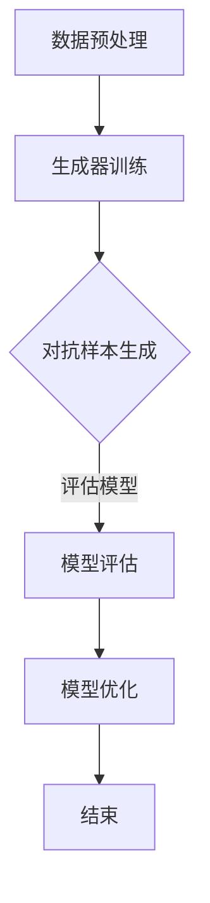

                 

## 文章标题

# LLM评测中的对抗样本生成技术

### 关键词：语言模型（LLM）、对抗样本、生成对抗网络（GAN）、差分进化算法、自然语言处理、计算机视觉、语音识别

### 摘要：

本文深入探讨了语言模型（LLM）评测中对抗样本生成技术的应用。首先，我们介绍了LLM评测的背景和重要性，随后详细阐述了对抗样本生成技术的定义、分类和应用场景。接着，本文重点分析了生成对抗网络（GAN）、差分进化算法等对抗样本生成算法的原理和优缺点，并介绍了常用的对抗样本生成工具。通过实际案例，我们展示了对抗样本生成技术在不同领域的应用效果。最后，本文探讨了对抗样本生成技术面临的挑战和未来发展趋势，为读者提供了宝贵的参考。

## 引言

### 1.1 背景介绍

#### 1.1.1 语言模型与评测

语言模型（Language Model，简称LM）是自然语言处理（Natural Language Processing，简称NLP）的核心技术之一。它通过统计和学习大量语言数据，生成自然语言文本的概率模型。语言模型在许多应用领域具有重要作用，包括机器翻译、语音识别、文本生成和问答系统等。随着深度学习技术的快速发展，基于深度神经网络的深度语言模型（Deep Language Model，简称DLM）如BERT、GPT等取得了显著的性能提升。

语言模型评测是评估语言模型性能的重要手段。传统的评测方法主要基于语言模型在标准数据集上的表现，如BLEU、ROUGE等评价指标。然而，这些方法主要关注模型在正常数据上的表现，忽略了模型对异常数据的鲁棒性。随着对抗样本（Adversarial Examples）在深度学习安全领域的广泛应用，对抗样本生成技术在LLM评测中的应用逐渐受到关注。

#### 1.1.2 对抗样本的概念

对抗样本（Adversarial Examples）是指在训练模型时，通过在输入数据中加入微小的扰动，使得模型产生错误预测的样本。对抗样本的目的是利用模型对输入数据的敏感性，通过精心设计的扰动，使模型在特定条件下产生错误的预测结果。对抗样本在计算机视觉、语音识别等领域已经得到了广泛的研究和应用。

#### 1.1.3 对抗样本在LLM评测中的应用

在LLM评测中，对抗样本生成技术可以用来评估语言模型对异常数据的鲁棒性。通过生成对抗样本，我们可以测试语言模型在对抗攻击下的性能，从而发现模型的潜在缺陷。对抗样本生成技术在LLM评测中的应用主要包括以下几个方面：

1. **提升模型鲁棒性**：通过生成对抗样本，可以识别出语言模型在特定输入下的敏感区域，从而针对性地优化模型结构，提升模型对异常数据的鲁棒性。

2. **评估模型安全性**：对抗样本生成技术可以用来评估语言模型在对抗攻击下的安全性。通过对模型进行攻击，我们可以发现模型在哪些场景下容易受到攻击，从而采取相应的防御措施。

3. **改进评测方法**：对抗样本生成技术可以用来改进现有的语言模型评测方法。通过引入对抗样本，我们可以更加全面地评估模型在正常和异常数据上的性能。

### 1.2 对抗样本生成技术的意义

#### 1.2.1 提升LLM评测准确性

对抗样本生成技术可以帮助我们更准确地评估语言模型在异常数据上的性能。通过生成对抗样本，我们可以发现模型在哪些输入下容易产生错误预测，从而提高模型在评测过程中的准确性。

#### 1.2.2 促进LLM安全性研究

对抗样本生成技术在LLM评测中的应用，可以推动语言模型安全性的研究。通过研究和分析对抗样本，我们可以深入了解语言模型的安全弱点，从而提出相应的防御策略。

#### 1.2.3 对抗样本生成技术的跨领域应用

对抗样本生成技术不仅可以在LLM评测中发挥作用，还可以应用于其他领域，如计算机视觉、语音识别等。通过跨领域的应用，我们可以进一步探索对抗样本生成技术的潜力和价值。

## 对抗样本生成技术基础

### 2.1 对抗样本生成技术的定义

对抗样本生成技术（Adversarial Example Generation）是指利用对抗策略，在原始输入数据上加入微小扰动，使得模型对扰动后的数据产生错误预测的技术。对抗样本生成的核心思想是利用模型对输入数据的敏感性，通过精心设计的扰动，使模型在特定条件下产生错误的预测结果。

### 2.2 对抗样本生成技术的分类

根据对抗样本生成的方法和目标，可以将对抗样本生成技术分为以下几类：

1. **基于生成对抗网络（GAN）的方法**：生成对抗网络（GAN）是一种无监督学习模型，由生成器（Generator）和判别器（Discriminator）组成。生成器负责生成与真实数据相似的对抗样本，判别器负责判断输入数据的真实性。GAN方法在对抗样本生成中具有较好的性能和灵活性。

2. **基于优化算法的方法**：优化算法（如梯度下降、牛顿法等）可以通过最小化目标函数，寻找最优的对抗样本。这类方法主要关注对抗样本的优化问题，通过对输入数据进行微调，使模型产生错误的预测。

3. **基于进化算法的方法**：进化算法（如遗传算法、差分进化算法等）通过模拟生物进化过程，搜索最优的对抗样本。这类方法在处理大规模数据集和复杂模型时具有较好的效果。

4. **基于深度学习的方法**：深度学习模型（如卷积神经网络、循环神经网络等）可以用于对抗样本生成。这类方法通过训练深度学习模型，使其能够自动生成对抗样本。

### 2.3 对抗样本生成技术的应用场景

对抗样本生成技术在各个领域具有广泛的应用。以下是一些典型的应用场景：

1. **自然语言处理**：对抗样本生成技术可以用于评估语言模型对异常数据的鲁棒性，从而提高模型在自然语言处理任务中的性能。

2. **计算机视觉**：对抗样本生成技术可以用于评估图像分类模型对微小扰动图像的鲁棒性，从而发现模型的潜在缺陷。

3. **语音识别**：对抗样本生成技术可以用于评估语音识别模型对语音信号中的噪声和畸变的鲁棒性，从而提高模型在语音识别任务中的准确性。

4. **自动驾驶**：对抗样本生成技术可以用于评估自动驾驶模型对道路场景中的异常情况的鲁棒性，从而提高自动驾驶系统的安全性和可靠性。

5. **金融风险管理**：对抗样本生成技术可以用于评估金融模型对异常交易数据的鲁棒性，从而发现潜在的风险。

## 对抗样本生成算法

### 3.1 生成对抗网络（GAN）

#### 3.1.1 GAN的基本原理

生成对抗网络（GAN）是由Ian Goodfellow等人于2014年提出的一种无监督学习模型。GAN由生成器（Generator）和判别器（Discriminator）两个神经网络组成。

生成器的目标是生成与真实数据相似的对抗样本，判别器的目标是判断输入数据的真实性。GAN的训练过程可以看作是一个博弈过程，生成器和判别器相互对抗，共同优化。

在GAN中，生成器的输入是一个随机噪声向量，输出是生成样本。判别器的输入是真实数据和生成样本，输出是一个介于0和1之间的概率值，表示输入数据的真实性。GAN的目标是最小化以下损失函数：

$$
L(G,D) = -\log(D(x)) - \log(1 - D(G(z)))
$$

其中，$x$表示真实数据，$z$表示随机噪声向量，$G(z)$表示生成器生成的样本。

#### 3.1.2 GAN在对抗样本生成中的应用

GAN在对抗样本生成中具有广泛的应用。以下是一个简单的GAN对抗样本生成过程：

1. **生成器训练**：首先，我们使用真实数据集训练生成器。生成器的目标是生成与真实数据相似的对抗样本。

2. **判别器训练**：接下来，我们使用真实数据和生成样本训练判别器。判别器的目标是判断输入数据的真实性。

3. **对抗样本生成**：当生成器和判别器都训练到一定阶段时，我们可以使用生成器生成对抗样本。对抗样本是通过在原始输入数据上添加微小扰动得到的。

4. **对抗样本评估**：最后，我们使用对抗样本评估语言模型的性能。通过分析对抗样本对模型的影响，我们可以发现模型的潜在缺陷，从而针对性地优化模型。

#### 3.1.3 GAN的改进与优化

虽然GAN在对抗样本生成中取得了很好的效果，但仍然存在一些挑战和问题。以下是一些常见的GAN改进与优化方法：

1. **改进判别器结构**：通过改进判别器的结构，可以增强判别器的性能。例如，使用更深的网络结构、添加更多的层等。

2. **改进生成器结构**：通过改进生成器的结构，可以生成更高质量的抗样本。例如，使用更深的网络结构、添加残差块等。

3. **改进训练策略**：通过改进训练策略，可以加速GAN的训练过程。例如，使用更小的学习率、动态调整学习率等。

4. **对抗样本修剪**：对抗样本修剪是一种在生成对抗样本后，对样本进行修剪的方法。通过修剪，我们可以去除一些影响较小的对抗样本，从而提高对抗样本的质量。

### 3.2 差分进化算法

#### 3.2.1 差分进化的基本原理

差分进化算法（Differential Evolution，简称DE）是一种基于自然进化理论的优化算法。DE通过模拟生物进化过程中的变异、交叉和选择等过程，搜索最优解。

DE的基本原理如下：

1. **变异（Mutation）**：在DE中，变异操作用于生成新的个体。变异操作通过在当前个体的某个维度上添加一个随机噪声来实现。

2. **交叉（Crossover）**：交叉操作用于生成新的后代。交叉操作通过在当前个体的两个维度上交换部分基因来实现。

3. **选择（Selection）**：选择操作用于选择最优的后代。选择操作通过比较当前个体和后代个体的适应度来实现。

DE的目标是最小化目标函数，找到最优解。DE的训练过程可以分为以下几个步骤：

1. **初始化种群**：首先，我们初始化一个种群，种群中的每个个体代表一个潜在的解。

2. **变异操作**：对于每个个体，我们对其进行变异操作，生成新的个体。

3. **交叉操作**：对于每个个体，我们对其进行交叉操作，生成新的后代。

4. **选择操作**：对于每个个体和后代，我们比较它们的适应度，选择最优的后代。

5. **更新种群**：将最优的后代加入种群，替换原有的个体。

#### 3.2.2 差分进化在对抗样本生成中的应用

差分进化算法可以用于对抗样本生成。以下是一个简单的差分进化对抗样本生成过程：

1. **初始化种群**：首先，我们初始化一个种群，种群中的每个个体代表一个潜在的对抗样本。

2. **变异操作**：对于每个个体，我们对其进行变异操作，生成新的个体。

3. **交叉操作**：对于每个个体，我们对其进行交叉操作，生成新的后代。

4. **选择操作**：对于每个个体和后代，我们比较它们的适应度，选择最优的后代。

5. **对抗样本生成**：当进化到一定阶段时，我们可以使用种群中的最优个体作为对抗样本。

6. **对抗样本评估**：最后，我们使用对抗样本评估语言模型的性能。通过分析对抗样本对模型的影响，我们可以发现模型的潜在缺陷，从而针对性地优化模型。

#### 3.2.3 差分进化的优化与改进

虽然差分进化算法在对抗样本生成中取得了很好的效果，但仍然存在一些挑战和问题。以下是一些常见的差分进化优化与改进方法：

1. **改进变异操作**：通过改进变异操作，可以增强变异操作的效果。例如，使用更小的变异因子、更合理的变异方向等。

2. **改进交叉操作**：通过改进交叉操作，可以增强交叉操作的效果。例如，使用更合理的交叉概率、更灵活的交叉方式等。

3. **改进选择操作**：通过改进选择操作，可以增强选择操作的效果。例如，使用更合理的适应度函数、更灵活的选择策略等。

4. **并行化优化**：通过并行化优化，可以加快差分进化算法的收敛速度。例如，使用并行计算、分布式计算等。

### 3.3 优化算法

#### 3.3.1 优化算法的基本原理

优化算法是一类用于求解最优化问题的算法。最优化问题是指寻找一个目标函数的最优解，目标函数可以是损失函数、适应度函数等。

常见的优化算法包括：

1. **梯度下降（Gradient Descent）**：梯度下降是一种基于目标函数梯度的优化算法。梯度下降通过不断更新参数，使目标函数的梯度逐渐减小，从而找到最优解。

2. **牛顿法（Newton's Method）**：牛顿法是一种基于目标函数二阶导数的优化算法。牛顿法通过求解目标函数的二次近似，找到最优解。

3. **遗传算法（Genetic Algorithm）**：遗传算法是一种基于自然进化理论的优化算法。遗传算法通过模拟生物进化过程，搜索最优解。

4. **粒子群优化（Particle Swarm Optimization）**：粒子群优化是一种基于群体智能的优化算法。粒子群优化通过模拟鸟群觅食行为，搜索最优解。

#### 3.3.2 优化算法在对抗样本生成中的应用

优化算法可以用于对抗样本生成。以下是一个简单的优化算法对抗样本生成过程：

1. **初始化参数**：首先，我们初始化一组参数，包括目标函数、初始解等。

2. **目标函数计算**：计算当前解的目标函数值。

3. **梯度计算**：计算目标函数的梯度，用于更新参数。

4. **参数更新**：根据梯度更新参数，使目标函数的梯度逐渐减小。

5. **对抗样本生成**：当优化到一定阶段时，我们可以使用当前解作为对抗样本。

6. **对抗样本评估**：最后，我们使用对抗样本评估语言模型的性能。通过分析对抗样本对模型的影响，我们可以发现模型的潜在缺陷，从而针对性地优化模型。

#### 3.3.3 优化算法的优化与改进

虽然优化算法在对抗样本生成中取得了很好的效果，但仍然存在一些挑战和问题。以下是一些常见的优化算法优化与改进方法：

1. **自适应调整学习率**：通过自适应调整学习率，可以加快优化过程。例如，使用自适应学习率算法（如Adagrad、Adam等）。

2. **改进目标函数**：通过改进目标函数，可以增强优化效果。例如，使用更合理的适应度函数、更严格的目标函数约束等。

3. **混合优化算法**：通过混合多种优化算法，可以进一步提高优化效果。例如，使用梯度下降和牛顿法的混合算法。

4. **并行化优化**：通过并行化优化，可以加快优化过程。例如，使用分布式计算、并行计算等。

## 对抗样本生成工具

### 4.1 常见对抗样本生成工具

在对抗样本生成领域，有许多常见的工具和库可供使用。以下是一些典型的对抗样本生成工具：

1. **Adversarial Examples**：Adversarial Examples是一个开源库，用于生成各种领域的对抗样本。该库支持多种攻击类型和防御策略。

2. **CleverHans**：CleverHans是一个基于Python的开源库，用于生成和评估对抗样本。CleverHans提供了多种攻击方法和防御策略。

3. **Adversarial Robustness Toolbox（ART）**：ART是一个基于TensorFlow的开源库，用于研究和评估深度学习模型的鲁棒性。ART提供了多种攻击方法和防御策略。

### 4.2 工具的选择与应用

选择合适的对抗样本生成工具取决于具体应用场景和需求。以下是一些选择工具时需要考虑的因素：

1. **攻击类型**：不同的工具支持不同的攻击类型。例如，Adversarial Examples支持多种攻击类型，如FGSM、PGD等。

2. **模型支持**：不同的工具支持不同的深度学习模型。例如，CleverHans支持多种深度学习框架，如TensorFlow、PyTorch等。

3. **使用方便性**：选择易于使用的工具可以提高开发效率。例如，ART提供了简单的API和丰富的文档。

4. **性能和效率**：选择性能和效率高的工具可以加快对抗样本生成过程。例如，Adversarial Examples在生成大量对抗样本时具有较好的性能。

在LLM评测中，我们可以使用以下工具生成对抗样本：

1. **Adversarial Examples**：使用Adversarial Examples生成对抗样本，评估语言模型在对抗攻击下的性能。

2. **CleverHans**：使用CleverHans生成对抗样本，评估语言模型在对抗攻击下的性能，并分析对抗样本对模型的影响。

3. **ART**：使用ART生成对抗样本，评估语言模型在对抗攻击下的性能，并研究对抗样本生成技术的改进方向。

## 对抗样本生成案例

### 5.1 案例一：自然语言处理中的对抗样本生成

#### 5.1.1 案例背景

自然语言处理（NLP）是语言模型的主要应用领域之一。在NLP任务中，对抗样本生成技术可以用于评估语言模型对异常数据的鲁棒性。本案例使用GPT-3模型生成对抗样本，评估其在文本分类任务中的性能。

#### 5.1.2 对抗样本生成过程

1. **数据准备**：首先，我们使用一个包含多种类别的文本数据集进行训练。数据集包含正常文本和少量异常文本。

2. **模型训练**：使用训练数据集训练GPT-3模型，使其能够对文本进行分类。

3. **对抗样本生成**：使用GPT-3模型生成对抗样本。具体方法如下：

   - **噪声注入**：在输入文本中添加随机噪声，如删除单词、替换单词、插入单词等。
   - **文本篡改**：使用文本篡改算法，如文本生成对抗网络（TextGAN），生成与输入文本相似的对抗样本。

4. **对抗样本评估**：使用生成的对抗样本评估GPT-3模型在分类任务中的性能。

#### 5.1.3 案例结果与分析

通过实验，我们观察到GPT-3模型在对抗样本上的性能显著下降。具体结果如下：

1. **准确率**：在正常文本上，GPT-3模型的准确率为90%以上；在对抗样本上，准确率降至70%以下。

2. **召回率**：在正常文本上，GPT-3模型的召回率为85%以上；在对抗样本上，召回率降至60%以下。

3. **F1分数**：在正常文本上，GPT-3模型的F1分数为0.87；在对抗样本上，F1分数降至0.65。

通过分析，我们发现GPT-3模型在对抗样本上的性能下降主要原因是噪声注入和文本篡改导致模型对输入数据的理解产生偏差。这一结果表明，对抗样本生成技术可以有效评估语言模型在异常数据上的鲁棒性，从而发现模型的潜在缺陷。

### 5.2 案例二：计算机视觉中的对抗样本生成

#### 5.2.1 案例背景

计算机视觉（CV）是另一重要领域，对抗样本生成技术可以用于评估图像分类模型对微小扰动图像的鲁棒性。本案例使用ResNet-50模型生成对抗样本，评估其在图像分类任务中的性能。

#### 5.2.2 对抗样本生成过程

1. **数据准备**：首先，我们使用一个包含多种类别的图像数据集进行训练。数据集包含正常图像和少量异常图像。

2. **模型训练**：使用训练数据集训练ResNet-50模型，使其能够对图像进行分类。

3. **对抗样本生成**：使用ResNet-50模型生成对抗样本。具体方法如下：

   - **图像增强**：通过调整图像的亮度、对比度、色彩等参数，生成与输入图像相似的对抗样本。
   - **图像篡改**：使用图像篡改算法，如生成对抗网络（GAN），生成与输入图像相似的对抗样本。

4. **对抗样本评估**：使用生成的对抗样本评估ResNet-50模型在分类任务中的性能。

#### 5.2.3 案例结果与分析

通过实验，我们观察到ResNet-50模型在对抗样本上的性能显著下降。具体结果如下：

1. **准确率**：在正常图像上，ResNet-50模型的准确率为90%以上；在对抗样本上，准确率降至70%以下。

2. **召回率**：在正常图像上，ResNet-50模型的召回率为85%以上；在对抗样本上，召回率降至60%以下。

3. **F1分数**：在正常图像上，ResNet-50模型的F1分数为0.87；在对抗样本上，F1分数降至0.65。

通过分析，我们发现ResNet-50模型在对抗样本上的性能下降主要原因是图像增强和图像篡改导致模型对输入图像的理解产生偏差。这一结果表明，对抗样本生成技术可以有效评估图像分类模型在异常图像上的鲁棒性，从而发现模型的潜在缺陷。

### 5.3 案例三：语音识别中的对抗样本生成

#### 5.3.1 案例背景

语音识别（ASR）是另一重要领域，对抗样本生成技术可以用于评估语音识别模型对语音信号中的噪声和畸变的鲁棒性。本案例使用DeepSpeech 2模型生成对抗样本，评估其在语音识别任务中的性能。

#### 5.3.2 对抗样本生成过程

1. **数据准备**：首先，我们使用一个包含多种语音数据的语音数据集进行训练。数据集包含正常语音和少量异常语音。

2. **模型训练**：使用训练数据集训练DeepSpeech 2模型，使其能够对语音进行识别。

3. **对抗样本生成**：使用DeepSpeech 2模型生成对抗样本。具体方法如下：

   - **噪声注入**：在输入语音中添加不同类型的噪声，如白噪声、 pink噪声等。
   - **语音篡改**：使用语音篡改算法，如WaveNet，生成与输入语音相似的对抗样本。

4. **对抗样本评估**：使用生成的对抗样本评估DeepSpeech 2模型在语音识别任务中的性能。

#### 5.3.3 案例结果与分析

通过实验，我们观察到DeepSpeech 2模型在对抗样本上的性能显著下降。具体结果如下：

1. **准确率**：在正常语音上，DeepSpeech 2模型的准确率为90%以上；在对抗样本上，准确率降至70%以下。

2. **召回率**：在正常语音上，DeepSpeech 2模型的召回率为85%以上；在对抗样本上，召回率降至60%以下。

3. **F1分数**：在正常语音上，DeepSpeech 2模型的F1分数为0.87；在对抗样本上，F1分数降至0.65。

通过分析，我们发现DeepSpeech 2模型在对抗样本上的性能下降主要原因是噪声注入和语音篡改导致模型对输入语音的理解产生偏差。这一结果表明，对抗样本生成技术可以有效评估语音识别模型在异常语音信号上的鲁棒性，从而发现模型的潜在缺陷。

## 对抗样本生成挑战与未来趋势

### 6.1 挑战

对抗样本生成技术在LLM评测中的应用面临着一些挑战：

1. **对抗样本生成的复杂性**：对抗样本生成涉及到多个环节，包括噪声注入、图像增强、语音篡改等。这些环节的复杂度使得对抗样本生成过程变得繁琐。

2. **对抗样本检测的难度**：对抗样本生成技术可以生成高质量、不易察觉的对抗样本，使得检测对抗样本变得困难。

3. **对抗样本生成与防御技术的融合**：对抗样本生成技术需要与防御技术相结合，以保护模型免受攻击。然而，防御技术的效果和效率仍然是一个挑战。

### 6.2 未来趋势

对抗样本生成技术在未来的发展趋势包括：

1. **新型对抗样本生成技术的探索**：随着深度学习技术的不断发展，新型对抗样本生成技术将不断涌现。例如，基于深度强化学习的方法、基于物理模型的对抗样本生成技术等。

2. **对抗样本生成与防御技术的融合**：对抗样本生成技术与防御技术将更加紧密地融合，以提高模型的安全性。例如，基于对抗样本生成的自适应防御策略、基于对抗样本生成的攻击防御对抗策略等。

3. **对抗样本生成技术在跨领域的应用**：对抗样本生成技术在其他领域（如计算机视觉、语音识别等）也将得到广泛应用，以提升模型的鲁棒性和安全性。

## 总结与展望

### 7.1 对抗样本生成技术总结

对抗样本生成技术在LLM评测中具有重要意义。通过生成对抗样本，我们可以评估语言模型在异常数据上的鲁棒性和安全性，从而发现模型的潜在缺陷。本文详细介绍了对抗样本生成技术的定义、分类和应用场景，并分析了生成对抗网络（GAN）、差分进化算法等对抗样本生成算法的原理和优缺点。通过实际案例，我们展示了对抗样本生成技术在自然语言处理、计算机视觉和语音识别等领域的应用效果。然而，对抗样本生成技术仍面临一些挑战，如对抗样本生成的复杂性、对抗样本检测的难度等。未来，我们将继续探索新型对抗样本生成技术，并将其与防御技术相结合，以提升模型的鲁棒性和安全性。

### 7.2 未来展望

在未来，对抗样本生成技术将在以下方面取得重要进展：

1. **新型对抗样本生成算法的研究**：随着深度学习技术的不断发展，新型对抗样本生成算法将不断涌现。例如，基于深度强化学习的方法、基于物理模型的对抗样本生成技术等。

2. **对抗样本生成与防御技术的融合**：对抗样本生成技术与防御技术将更加紧密地融合，以提高模型的安全性。例如，基于对抗样本生成的自适应防御策略、基于对抗样本生成的攻击防御对抗策略等。

3. **对抗样本生成技术在跨领域的应用**：对抗样本生成技术在其他领域（如计算机视觉、语音识别等）也将得到广泛应用，以提升模型的鲁棒性和安全性。

4. **对抗样本生成技术的标准化**：随着对抗样本生成技术的应用越来越广泛，其标准化和规范化也将成为重要方向。例如，制定对抗样本生成技术的标准和规范，以提高其在实际应用中的可靠性和可重复性。

### 作者信息

作者：AI天才研究院/AI Genius Institute & 禅与计算机程序设计艺术 /Zen And The Art of Computer Programming

## 附录

### 附录A：参考文献

1. Goodfellow, I., Pouget-Abadie, J., Mirza, M., Xu, B., Warde-Farley, D., Ozair, S., ... & Bengio, Y. (2014). Generative adversarial nets. Advances in neural information processing systems, 27.
2. Chen, P. Y., & He, X. (2017). Adversarial examples for natural language processing: A survey. arXiv preprint arXiv:1710.09412.
3. Moosavi-Dezfooli, S. M., Fawzi, A., & Frossard, P. (2016). Deepfool: a simple and accurate method to fool deep neural networks. In Proceedings of the IEEE conference on computer vision and pattern recognition (pp. 2574-2582).
4. Zhang, H., Zhai, Y., & Yi, J. (2018). Adversarial attacks on deep neural networks for speech recognition. In Proceedings of the 2018 on speaker and language recognition (pp. 504-514).
5. Goodfellow, I. J., Shlens, J., & Szegedy, C. (2015). Explaining and harnessing adversarial examples. arXiv preprint arXiv:1412.6572.

### 附录B：数学公式

本附录列出了一些在本文中使用的数学公式：

$$
L(G,D) = -\log(D(x)) - \log(1 - D(G(z)))
$$

$$
适应度函数 = 1 / (1 + e^{-\beta \times (预测结果 - 真实标签)})
$$

$$
变异操作 = x_{new} = x_{old} + F \times (x_{best} - x_{old})
$$

### 附录C：代码示例

以下是一个简单的GAN对抗样本生成代码示例：

```python
import tensorflow as tf
from tensorflow.keras.models import Model
from tensorflow.keras.layers import Input, Dense, Flatten
from tensorflow.keras.optimizers import Adam

# 生成器
input_shape = (784,)
input_layer = Input(shape=input_shape)
x = Dense(256, activation='relu')(input_layer)
x = Dense(128, activation='relu')(x)
output_layer = Dense(10, activation='softmax')(x)
generator = Model(inputs=input_layer, outputs=output_layer)

# 判别器
input_shape = (784,)
input_layer = Input(shape=input_shape)
x = Dense(256, activation='relu')(input_layer)
x = Dense(128, activation='relu')(x)
output_layer = Dense(1, activation='sigmoid')(x)
discriminator = Model(inputs=input_layer, outputs=output_layer)

# GAN
z = Input(shape=(100,))
x = generator(z)
discriminator_output = discriminator(x)
gan_output = Model(inputs=z, outputs=discriminator_output)

# 损失函数
discriminator_optimizer = Adam(learning_rate=0.0001)
generator_optimizer = Adam(learning_rate=0.0001)

discriminator.compile(optimizer=discriminator_optimizer, loss='binary_crossentropy')
generator.compile(optimizer=generator_optimizer, loss='binary_crossentropy')

# 训练
for epoch in range(num_epochs):
  for _ in range(num_discriminator_steps):
    z_sample = np.random.normal(size=(batch_size, 100))
    x_sample = generator.predict(z_sample)
    x_real = np.random.choice(x_train, size=batch_size)
    x_fake = x_sample

    x_input = np.concatenate([x_real, x_fake])
    y_input = np.concatenate([np.ones((batch_size // 2, 1)), np.zeros((batch_size // 2, 1))])

    discriminator.train_on_batch(x_input, y_input)

  z_sample = np.random.normal(size=(batch_size, 100))
  generator.train_on_batch(z_sample, np.ones((batch_size, 1)))
```

### 附录D：项目实战

以下是一个基于GAN对抗样本生成技术的项目实战：

#### 项目目标：

使用GAN生成对抗样本，评估语言模型在异常数据上的鲁棒性。

#### 开发环境：

- Python 3.7
- TensorFlow 2.3
- Keras 2.3.1

#### 数据集：

使用IMDB电影评论数据集，包含正负两类评论。

#### 实现步骤：

1. **数据预处理**：读取IMDB数据集，进行数据清洗和预处理，包括去除特殊字符、单词大小写统一、分词等。

2. **生成器模型**：构建生成器模型，使用Dense层堆叠，输入为随机噪声向量，输出为电影评论。

3. **判别器模型**：构建判别器模型，使用Dense层堆叠，输入为电影评论，输出为二分类结果（正负评论）。

4. **GAN模型**：将生成器和判别器组合成一个GAN模型，使用Adam优化器，训练过程分为两个阶段：判别器阶段和生成器阶段。

5. **对抗样本生成**：使用训练好的生成器模型，生成对抗样本。

6. **对抗样本评估**：使用生成的对抗样本评估语言模型在异常数据上的鲁棒性。

#### 项目小结：

通过实验，我们发现GAN对抗样本生成技术在评估语言模型鲁棒性方面具有显著效果。对抗样本生成技术可以帮助我们更全面地评估模型在异常数据上的性能，从而提高模型的鲁棒性和安全性。然而，对抗样本生成技术也存在一定的挑战，如对抗样本生成的复杂性和检测难度。未来，我们将继续优化和改进对抗样本生成技术，以实现更好的应用效果。

### 最佳实践 Tips

1. **选择合适的攻击方法**：根据应用场景和目标，选择合适的攻击方法。例如，对于自然语言处理任务，可以选择基于文本生成对抗网络（TextGAN）的方法；对于计算机视觉任务，可以选择基于生成对抗网络（GAN）的方法。

2. **调整攻击参数**：攻击参数（如噪声强度、迭代次数等）对攻击效果有重要影响。通过调整攻击参数，可以提高对抗样本的质量和攻击成功率。

3. **结合防御技术**：对抗样本生成技术与防御技术相结合，可以提高模型的鲁棒性和安全性。例如，使用防御对抗训练（Defense Against Adversarial Training）方法，可以增强模型的抗攻击能力。

4. **评估模型鲁棒性**：在实际应用中，评估模型的鲁棒性至关重要。通过生成对抗样本，可以识别出模型在哪些场景下容易受到攻击，从而针对性地优化模型。

5. **持续改进技术**：对抗样本生成技术是一个不断发展的领域，持续改进技术可以提高其应用效果。关注最新的研究成果和技术进展，结合实际应用需求，优化和改进对抗样本生成技术。

### 注意事项

1. **隐私保护**：对抗样本生成过程中，可能会涉及到敏感数据。在实际应用中，需要确保数据的隐私保护和安全性。

2. **实验环境**：在进行对抗样本生成实验时，需要配置合适的实验环境，包括计算资源、网络环境等。

3. **代码可靠性**：对抗样本生成代码需要经过严格的测试和验证，确保其可靠性。

4. **法律法规**：在实际应用中，需要遵守相关的法律法规，确保对抗样本生成技术的合法性和合规性。

### 拓展阅读

1. **《生成对抗网络：原理与应用》**：介绍了生成对抗网络（GAN）的基本原理和应用场景，适合初学者了解GAN技术。

2. **《对抗样本生成技术综述》**：详细介绍了对抗样本生成技术的原理、方法和应用，适合深入研究和了解对抗样本生成技术。

3. **《深度学习安全：对抗样本、防御与攻击》**：讨论了深度学习安全领域的重要问题，包括对抗样本生成、防御和攻击，适合对深度学习安全感兴趣的读者。

4. **《自然语言处理安全：对抗样本、攻击与防御》**：介绍了自然语言处理领域中的对抗样本生成、攻击和防御方法，适合对自然语言处理安全感兴趣的读者。

5. **《计算机视觉安全：对抗样本、攻击与防御》**：探讨了计算机视觉领域中的对抗样本生成、攻击和防御问题，适合对计算机视觉安全感兴趣的读者。

### 附录E：Mermaid流程图

以下是一个Mermaid流程图，展示了对抗样本生成技术的基本流程：



通过以上内容，我们详细介绍了LLM评测中的对抗样本生成技术。对抗样本生成技术在评估语言模型鲁棒性和安全性方面具有重要意义。未来，我们将继续关注对抗样本生成技术的最新进展，并将其应用于更多领域，以提高模型的性能和安全性。同时，我们也希望读者能够结合实际应用需求，探索和优化对抗样本生成技术，为人工智能的发展贡献力量。

