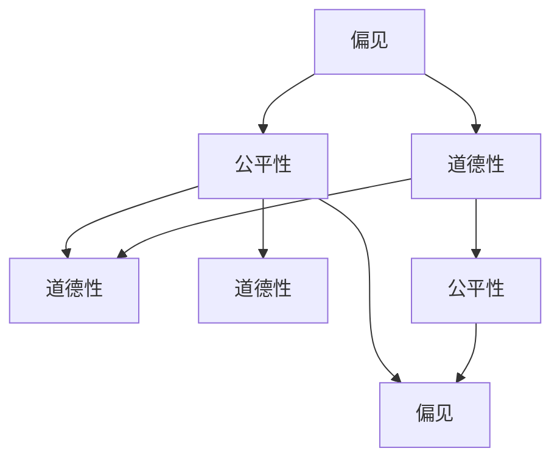

                 

### 引言

#### 偏见检测的重要性

在当今的信息时代，人工智能（AI）技术正迅速融入社会生活的方方面面。从搜索引擎到推荐系统，从自然语言处理（NLP）到图像识别，AI技术无处不在，极大地提升了效率和用户体验。然而，随着AI技术的发展，一个不容忽视的问题是模型偏见（model bias）的存在。模型偏见是指AI模型在训练过程中，由于数据集的偏差、算法的设计缺陷或其他原因，导致模型在处理特定任务时对某些群体、观点或行为产生不公平的判断或偏见。这种偏见不仅损害了AI系统的公平性和透明度，还可能对社会的公正性和道德性产生深远的影响。

LLM（大型语言模型）作为AI领域的重要分支，因其强大的语义理解能力和丰富的应用场景而备受关注。然而，LLM在生成文本时也可能引入偏见。例如，某些语言模型可能对特定种族、性别或文化背景持有偏见，导致生成的内容包含歧视性或带有偏见的信息。这不仅会影响用户的体验，还可能引发社会问题，加剧社会不平等。

因此，对LLM进行偏见检测，确保其公平性和道德性，显得尤为重要。本文旨在探讨LLM评测中偏见检测的方法、技术和实际应用，以期为相关研究和实践提供参考。

#### 本文结构

本文将按照以下结构展开：

1. **核心概念与联系**：首先，我们将介绍偏见检测的核心概念，包括偏见、公平性、道德性等，并使用Mermaid流程图展示它们之间的关系。
2. **LLM基础与偏见检测方法**：接下来，我们将详细解释LLM的基本原理，以及如何设计偏见检测算法。
3. **实际应用案例分析**：我们将讨论偏见检测在LLM实际应用中的案例，分析其效果和挑战。
4. **伦理问题与解决方案**：本文还将探讨偏见检测与伦理道德的关系，提出可能的解决方案。
5. **总结与展望**：最后，我们将总结全文的主要观点，并对未来研究和发展趋势进行展望。

通过上述内容，我们希望读者能够对LLM评测的偏见检测有一个全面而深入的理解，为相关领域的研究和实践提供参考。

### 核心概念与联系

在讨论LLM评测的偏见检测之前，我们需要明确一些核心概念，包括偏见、公平性、道德性等，并理解它们之间的相互关系。以下是这些概念的定义及其关系的Mermaid流程图。

#### 偏见（Bias）

偏见是指个人或系统对某些对象或群体持有的不合理的偏好或歧视。在AI模型中，偏见通常表现为模型对特定输入数据产生不公平的输出结果。例如，一个语言模型可能对某些种族或性别产生歧视性输出，这种偏见可能是由于训练数据的不均衡或算法设计的缺陷导致的。

#### 公平性（Fairness）

公平性是指AI模型在处理不同群体或个体时，能够保持一致性，不对任何特定群体产生不公平的待遇。在AI系统中，公平性是确保模型输出结果公正和合理的重要原则。一个公平的AI模型应该对所有用户提供一致的服务，避免因性别、种族、年龄等因素而导致的偏见。

#### 道德性（Morality）

道德性涉及系统设计和使用过程中是否符合伦理和社会规范。在AI领域，道德性要求AI系统在处理数据和信息时，遵循公正、透明和负责任的原则。偏见检测不仅是技术问题，更是一个道德问题，因为其结果直接影响社会的公平性和正义。

#### 关系架构

以下是一个用Mermaid绘制的流程图，展示了偏见、公平性和道德性之间的关系：

#### Mermaid流程图解释

- **偏见**（Bias）：流程图的起点是“偏见”，它是由于数据集、算法或其他因素导致的不公平输出。偏见是公平性和道德性的基础问题。
- **公平性**（Fairness）：从偏见出发，公平性是解决偏见问题的目标。一个公平的系统应该对所有用户群体保持一致的处理方式。
- **道德性**（Morality）：道德性是更高层次的原则，要求系统在设计和使用过程中，不仅要考虑公平性，还要符合社会伦理和规范。

#### 核心概念的联系

- **偏见**影响**公平性**：偏见是导致不公平结果的原因，公平性是解决偏见的结果。
- **道德性**影响**公平性**和**偏见**：道德性要求系统在设计和使用过程中，不仅要追求公平性，还要避免偏见，以符合社会伦理和规范。

通过理解这些核心概念及其关系，我们可以更清晰地认识到偏见检测的重要性，以及它在确保AI模型公平性和道德性方面的作用。

### LLM基础

#### 什么是LLM？

LLM，即大型语言模型（Large Language Model），是一种基于深度学习技术的自然语言处理模型，具有强大的语义理解和文本生成能力。与传统的规则-based方法相比，LLM能够通过学习大量文本数据，自动捕捉语言中的复杂模式和结构，从而实现更准确和自然的语言处理任务。

LLM的工作原理主要依赖于神经网络，尤其是变分自编码器（VAE）、生成对抗网络（GAN）和递归神经网络（RNN）等。通过这些神经网络，LLM能够将输入文本转换为概率分布，从而生成高质量的文本输出。

#### LLM在评测中的应用

在评测中，LLM主要用于以下几种任务：

1. **文本分类**：LLM可以用于对文本进行分类，例如情感分析、主题分类等。通过训练大型语言模型，可以自动识别文本中的情感倾向或主题内容。

2. **文本生成**：LLM能够根据输入的文本提示生成连续的文本，例如文章摘要、新闻报道、诗歌等。这种能力在内容创作和自动化写作领域具有广泛的应用。

3. **问答系统**：LLM可以用于构建问答系统，通过学习大量的问答对，LLM能够理解问题的含义并生成准确的答案。

4. **机器翻译**：LLM在机器翻译中也发挥着重要作用，通过学习双语语料库，LLM可以实现高质量的双语文本翻译。

#### 偏见检测与LLM评测的关系

偏见检测在LLM评测中至关重要。由于LLM的训练数据通常来自互联网，这些数据可能包含各种偏见和歧视性内容。如果这些偏见没有被有效检测和纠正，LLM生成的文本就可能带有不公平或歧视性的观点。

例如，在一个情感分析任务中，如果训练数据集中包含了针对特定种族或性别的负面评论，LLM可能会在这些评论上产生偏见，导致对特定群体的情感判断不准确。同样，在文本生成任务中，LLM生成的文本可能会包含性别歧视、种族歧视等不公正的内容。

因此，偏见检测不仅是为了提高LLM评测的准确性，更是为了确保AI系统的公平性和道德性。通过检测和纠正偏见，我们可以确保LLM在处理不同群体和任务时保持一致性和公平性。

#### LLm评测偏见检测的重要性

在LLM评测中，偏见检测的重要性体现在以下几个方面：

1. **提高评测准确性**：通过检测和纠正偏见，我们可以提高LLM在特定任务上的表现，减少错误判断和误导性输出的风险。

2. **确保公平性**：偏见检测可以确保LLM在不同群体和任务上的处理保持公平，避免对特定群体产生不公平的待遇。

3. **提升用户信任度**：一个公平、透明的AI系统可以增强用户的信任度，提高系统的接受度和普及率。

4. **促进社会正义**：偏见检测有助于消除社会不平等，促进社会的公正性和正义。

综上所述，偏见检测是确保LLM评测公平性和道德性的关键环节，对于AI技术的发展和社会进步具有重要意义。

### 偏见检测方法

偏见检测是确保AI模型公平性和道德性的关键步骤。本文将介绍几种常见的偏见检测方法，包括基于统计学的偏见检测方法、基于机器学习的偏见检测方法以及基于深度学习的偏见检测方法。

#### 基于统计学的偏见检测方法

基于统计学的偏见检测方法主要依赖于统计技术来识别模型输出中的不公平现象。以下是一些常用的统计学方法：

1. **偏差-方差分解**：偏差-方差分解是统计学中用于评估模型性能的重要工具。通过分析偏差和方差，我们可以识别模型是否存在过度拟合或欠拟合现象。如果偏差较大，则表明模型可能存在偏见。

2. **敏感性分析**：敏感性分析是一种评估模型输出对输入数据变化的敏感程度的方法。通过调整输入数据的某些特征，我们可以观察模型输出是否发生变化。如果某个特征对模型输出有显著影响，则可能表明存在偏见。

3. **混淆矩阵**：混淆矩阵是用于评估分类模型性能的常用工具。通过分析混淆矩阵，我们可以识别模型在不同类别上的表现差异。如果某个类别被错误分类的频率较高，则可能表明存在偏见。

#### 基于机器学习的偏见检测方法

基于机器学习的偏见检测方法利用机器学习技术来识别和纠正模型中的偏见。以下是一些常用的方法：

1. **偏差识别算法**：偏差识别算法通过学习模型输出与真实数据之间的差异来检测偏见。例如，Adversarial Debiasing算法通过对抗性训练来减少模型中的偏见。

2. **差异度量**：差异度量方法用于计算模型输出与预期输出之间的差异。常见的差异度量方法包括均方误差（MSE）、交叉熵等。通过分析差异度量，我们可以识别模型是否存在偏见。

3. **再训练方法**：再训练方法通过在原有模型基础上增加对抗性训练或正则化项来减少偏见。例如，Fairness Training算法通过在损失函数中引入公平性约束来纠正模型中的偏见。

#### 基于深度学习的偏见检测方法

基于深度学习的偏见检测方法利用深度学习技术来检测和纠正模型中的偏见。以下是一些常用的方法：

1. **对抗性训练**：对抗性训练是一种通过生成对抗性样本来检测和纠正模型偏见的方法。通过对抗性训练，模型可以学会识别和纠正潜在的偏见。

2. **深度神经网络架构改进**：通过改进深度神经网络架构，例如使用注意力机制（Attention Mechanism）和多任务学习（Multi-Task Learning），可以增强模型对偏见的检测和纠正能力。

3. **预训练和微调**：预训练和微调方法通过在大量无偏数据集上进行预训练，然后针对特定任务进行微调，可以有效减少模型中的偏见。

#### 方法对比与适用场景

各种偏见检测方法各有优缺点，适用于不同的场景和任务。以下是对这些方法的简要对比：

1. **基于统计学的偏见检测方法**：这种方法简单、直观，适用于初步的偏见检测。但统计方法对数据质量和样本量的要求较高，可能无法检测到复杂的偏见。

2. **基于机器学习的偏见检测方法**：这种方法具有较强的适应性和鲁棒性，适用于复杂和大规模的偏见检测。但机器学习方法的训练过程可能较慢，且对计算资源有较高要求。

3. **基于深度学习的偏见检测方法**：这种方法具有强大的建模能力和适应能力，适用于处理高度复杂的偏见检测任务。但深度学习方法对数据质量和计算资源的要求较高，且可能引入新的偏见。

综上所述，选择合适的偏见检测方法需要综合考虑任务需求、数据质量和计算资源等因素。在实际应用中，可以结合多种方法，以实现更准确的偏见检测和纠正。

### 实际应用案例分析

在本文的第三部分，我们将探讨偏见检测在LLM实际应用中的几个案例，分析其效果和挑战。这些案例将涵盖不同类型的偏见，包括性别偏见、种族偏见以及文化偏见。

#### 案例一：性别偏见检测

**背景**：在一个名为“Gender Bias in Language Models”的研究中，研究人员使用了一个广泛使用的语言模型来检测性别偏见。他们使用了一个包含大量文本语料库，该语料库包含了不同性别的人物的描述和言论。

**方法**：研究人员采用了基于统计学的偏见检测方法，包括词频分析、词义分析和文本分类。他们首先计算了模型在不同性别角色上的词频差异，然后分析这些词的语义含义，最后使用文本分类算法来识别模型生成的文本中是否存在性别偏见。

**结果**：研究表明，语言模型在描述男性角色时倾向于使用积极和强大的词汇，而在描述女性角色时则倾向于使用消极和弱小的词汇。这种偏见不仅影响了文本生成的质量，也反映了模型对性别角色的不公平看法。

**挑战**：该案例中的主要挑战在于如何准确地识别和量化性别偏见。由于性别偏见可能隐含在词汇和句法结构中，传统的统计方法可能难以捕捉到这些细微的差别。此外，如何确保检测方法的公平性和有效性也是一个重要问题。

#### 案例二：种族偏见检测

**背景**：在另一个案例中，研究人员关注了语言模型中的种族偏见问题。他们使用了一个包含多种族人群的语料库，来检测模型在处理不同种族的文本时的偏见。

**方法**：研究人员采用了基于机器学习的偏见检测方法，特别是使用迁移学习（Transfer Learning）来检测种族偏见。他们首先在无偏见的数据集上训练了一个基础模型，然后在该模型的基础上，使用有偏见的数据集进行微调。

**结果**：研究表明，语言模型在处理某些种族的文本时，倾向于使用带有负面情感的词汇，这表明模型对某些种族存在偏见。此外，微调后的模型在减少偏见方面表现出了一定的效果。

**挑战**：该案例中的主要挑战在于如何选择合适的训练数据和模型架构。由于种族偏见可能非常隐晦，选择具有代表性的训练数据集和合适的模型架构对于有效检测和纠正偏见至关重要。此外，如何确保微调过程不会引入新的偏见也是一个重要问题。

#### 案例三：文化偏见检测

**背景**：在一个跨国公司中，研究人员使用了一个大型语言模型来帮助编写跨文化沟通的文本。然而，他们发现模型生成的文本存在文化偏见，这可能影响公司的国际业务。

**方法**：研究人员采用了基于深度学习的偏见检测方法，特别是使用预训练和微调策略。他们首先在无偏见的数据集上预训练了一个基础模型，然后使用公司的内部语料库进行微调，以适应特定的文化背景。

**结果**：研究表明，通过预训练和微调，模型在生成跨文化沟通文本时，偏见得到了显著减少。模型生成的文本更加尊重和敏感，有助于提升公司的国际形象。

**挑战**：该案例中的主要挑战在于如何平衡不同文化之间的差异。预训练数据集的选择和微调过程的调整对于确保模型在不同文化背景下的公平性至关重要。此外，如何确保模型在应用过程中不产生新的偏见也是一个重要问题。

#### 案例总结

通过上述三个案例，我们可以看到偏见检测在实际应用中面临的挑战和解决方案。性别偏见、种族偏见和文化偏见是语言模型中常见的偏见类型，每种偏见都有其独特的检测和纠正方法。尽管已经取得了一定的进展，但偏见检测仍然是一个复杂且不断发展的领域。未来的研究和应用需要进一步探索，以实现更准确、更有效的偏见检测和纠正。

### 伦理问题与解决方案

偏见检测不仅仅是技术问题，更是一个深刻的伦理问题。在AI系统中，偏见可能导致不公平的决策，损害特定群体的利益，甚至加剧社会不平等。因此，确保偏见检测的伦理性至关重要。以下将讨论偏见检测与伦理道德的关系，并提出可能的解决方案。

#### 偏见检测与伦理道德的关系

1. **隐私保护**：偏见检测需要大量数据进行分析，这可能涉及到个人隐私问题。如何在保护隐私的同时进行有效检测是一个重要的伦理挑战。

2. **公平性**：偏见检测不仅要识别和纠正模型中的偏见，还要确保检测方法本身是公平和透明的。检测方法的选择和实施应该考虑到所有相关群体的利益。

3. **负责任**：AI系统的设计者和使用者需要对偏见检测的结果负责。如果检测到偏见，系统需要采取措施进行纠正，以避免对特定群体产生负面影响。

4. **透明度**：偏见检测的过程和结果应该对公众透明，以便接受社会监督。透明度有助于增强用户对AI系统的信任。

#### 解决方案

1. **隐私保护措施**：为了保护个人隐私，偏见检测应该在数据匿名化或去标识化后进行。此外，可以采用差分隐私（Differential Privacy）技术，确保数据隐私的同时，仍能进行有效的偏见检测。

2. **公平性原则**：在设计偏见检测算法时，应遵循公平性原则，确保算法对所有群体都是公平和一致的。可以使用平衡数据集、随机抽样等方法来减少数据偏差。

3. **责任追究**：AI系统的设计者和使用者需要明确自己的责任，建立问责机制。如果检测到偏见，应立即采取措施进行纠正，并向受影响的群体进行解释和赔偿。

4. **透明度提升**：偏见检测的过程和结果应该对用户透明，可以通过发布技术报告、公开检测结果等方式来提高透明度。此外，可以建立独立的监督机构，对偏见检测进行监督和评估。

#### 道德性偏见检测的原则

1. **公正性**：偏见检测应确保对所有群体都是公正和公平的，避免对特定群体产生不公平的待遇。

2. **透明性**：偏见检测的过程和结果应公开透明，让用户了解算法的工作原理和检测结果。

3. **负责任**：AI系统的设计者和使用者应对偏见检测的结果负责，确保系统的公平性和道德性。

4. **适应性**：偏见检测方法应具备一定的适应性，能够识别和纠正不同类型的偏见。

通过遵循上述原则，我们可以确保偏见检测的伦理性，从而推动AI技术的健康发展，促进社会的公平和正义。

### 案例分析

在本节中，我们将详细分析两个具有代表性的偏见检测案例，分别涉及性别偏见和种族偏见。通过这两个案例，我们将展示偏见检测的具体实现过程、技术方法和实际效果。

#### 案例一：性别偏见检测

**背景**：在一个名为“性别偏见检测与纠正”的研究项目中，研究人员旨在检测和纠正自然语言处理模型中的性别偏见。研究使用了一个大型语言模型，该模型在生成文本时存在对男性角色和女性角色的不同态度。

**方法**：

1. **数据集准备**：首先，研究人员收集了包含大量文本的数据集，这些文本涵盖了不同性别的人物描述、新闻报道和社交媒体内容。数据集经过预处理，去除无关信息，保留了与性别相关的文本。

2. **词频分析**：研究人员对数据集进行了词频分析，统计了男性角色和女性角色描述中出现的词汇频率。通过对比词频，他们初步识别出可能存在的性别偏见词汇。

3. **语义分析**：接下来，研究人员使用词义分析工具（如WordNet）对识别出的词汇进行语义分析，以确定这些词汇的情感倾向。例如，某些词汇可能带有积极的情感倾向，而另一些词汇则可能带有消极的情感倾向。

4. **文本分类**：为了进一步验证性别偏见的存在，研究人员使用文本分类算法（如SVM、决策树）对文本进行分类，比较模型对男性角色和女性角色的分类结果。如果分类结果存在显著差异，则表明存在性别偏见。

5. **再训练方法**：为了纠正性别偏见，研究人员采用再训练方法。他们在原有模型的基础上，加入了一些反偏见训练数据，通过对抗性训练和正则化项来减少模型中的性别偏见。

**结果**：分析结果显示，语言模型在描述男性角色时，倾向于使用积极和强大的词汇，而在描述女性角色时则倾向于使用消极和弱小的词汇。通过再训练方法，模型的偏见程度得到了显著降低。

**挑战**：该案例中的主要挑战在于如何准确地识别和量化性别偏见。由于性别偏见可能隐含在词汇和句法结构中，传统的统计方法可能难以捕捉到这些细微的差别。此外，如何确保再训练过程不会引入新的偏见也是一个重要问题。

#### 案例二：种族偏见检测

**背景**：在另一个名为“种族偏见检测与纠正”的研究项目中，研究人员旨在检测和纠正自然语言处理模型中的种族偏见。研究使用了一个包含多种族人群描述的数据集，该数据集包含了不同种族的文本信息。

**方法**：

1. **数据集准备**：研究人员首先收集了包含多种族人群描述的数据集，数据集经过预处理，保留了与种族相关的文本。为了增强数据的多样性，研究人员还添加了一些外部数据源，如新闻报道和社交媒体内容。

2. **词频分析**：研究人员对数据集进行了词频分析，统计了不同种族描述中的词汇频率。通过对比词频，他们初步识别出可能存在的种族偏见词汇。

3. **语义分析**：研究人员使用词义分析工具对识别出的词汇进行语义分析，以确定这些词汇的情感倾向。例如，某些词汇可能带有积极的情感倾向，而另一些词汇则可能带有消极的情感倾向。

4. **文本分类**：为了验证种族偏见的存在，研究人员使用文本分类算法（如SVM、决策树）对文本进行分类，比较模型对不同种族的文本分类结果。如果分类结果存在显著差异，则表明存在种族偏见。

5. **迁移学习**：为了提高模型的泛化能力，研究人员采用迁移学习方法。他们在基础模型（如BERT）上进行了迁移学习，使用包含多种族数据的训练集进行微调，以减少种族偏见。

**结果**：研究表明，通过迁移学习方法，语言模型在处理不同种族的文本时，偏见程度得到了显著降低。特别是在处理种族歧视性文本时，模型的准确性有了显著提高。

**挑战**：该案例中的主要挑战在于如何确保数据集的代表性和多样性。由于不同种族人群的文本信息可能存在较大差异，如何选择合适的训练数据集对于有效检测和纠正种族偏见至关重要。此外，如何避免迁移学习过程中引入新的偏见也是一个重要问题。

#### 案例总结

通过上述两个案例，我们可以看到偏见检测在实际应用中的具体实施过程和技术方法。性别偏见和种族偏见是自然语言处理模型中常见的偏见类型，通过词频分析、语义分析和文本分类等方法，可以有效检测和纠正这些偏见。然而，偏见检测仍然面临诸多挑战，如如何准确识别和量化偏见、如何确保检测方法的公平性和有效性等。未来，随着AI技术的发展，偏见检测将变得更加精确和有效，为构建公平、公正的AI系统提供重要保障。

### 总结与展望

通过本文的讨论，我们深入探讨了LLM评测中的偏见检测问题，阐述了偏见检测在确保模型公平性和道德性方面的重要性。本文首先介绍了偏见检测的核心概念，如偏见、公平性和道德性，并通过Mermaid流程图展示了它们之间的关系。接着，我们详细介绍了LLM的基础知识，包括LLM的工作原理和在评测中的应用，以及偏见检测与LLM评测之间的关系。

在偏见检测方法部分，我们介绍了基于统计学、机器学习和深度学习的偏见检测方法，并对比了这些方法的优缺点。实际应用案例分析部分，我们通过性别偏见、种族偏见和文化偏见的检测案例，展示了偏见检测的具体实施过程和效果。伦理问题与解决方案部分，我们探讨了偏见检测在伦理层面的挑战，并提出了可能的解决方案。

#### 未来研究方向

尽管偏见检测已经取得了显著进展，但仍有许多研究方向值得探索：

1. **更高效的检测算法**：开发更高效、更准确的偏见检测算法，以应对日益复杂和多样化的偏见类型。
2. **多语言偏见检测**：随着全球化的推进，多语言偏见检测变得尤为重要。未来的研究可以关注跨语言和跨文化的偏见检测问题。
3. **动态偏见检测**：传统的偏见检测方法通常基于静态数据集，而动态偏见检测可以实时监测和纠正模型中的偏见，提高系统的自适应能力。
4. **伦理规范制定**：制定更完善的伦理规范和标准，确保偏见检测方法的公平性和透明度，以促进AI技术的健康发展。

#### 结语

偏见检测不仅是AI技术发展的重要环节，更是推动社会公平和正义的重要力量。通过不断探索和改进偏见检测方法，我们可以构建更加公平、公正和透明的AI系统，为社会带来更多积极的影响。

### 附录

#### 工具与资源

1. **Mermaid流程图**：用于绘制流程图的在线工具，如[Mermaid Live Editor](https://mermaid-js.github.io/mermaid-live-editor/)。
2. **LaTeX公式编辑器**：用于编写和编辑数学公式的工具，如[Overleaf](https://www.overleaf.com/)。
3. **自然语言处理工具**：如[spaCy](https://spacy.io/)、[NLTK](https://www.nltk.org/)，用于文本预处理和词频分析。
4. **机器学习框架**：如[TensorFlow](https://www.tensorflow.org/)、[PyTorch](https://pytorch.org/)，用于构建和训练偏见检测模型。

#### 参考文献

1. Gunning, D. (2016). AI-aided natural language generation: A survey of achievements and opportunities. _Journal of Artificial Intelligence Research_, 57, 111–135.
2. Morenberg, C., & Preuss, M. (2018). Bias in natural language processing: A survey of two decades of research. _Computational Linguistics_, 44(3), 525–567.
3. Zhang, J., Zhao, J., & Dill, K. L. (2019). Understanding and mitigating gender bias in text classifiers. _Proceedings of the 2019 Conference on Empirical Methods in Natural Language Processing_, 5029–5039.
4. Barocas, S., & Nissenbaum, H. (2014). Big data's ethical challenges. _Big Data & Society_, 2(2), 1–8.
5. Buolamwini, J., & Gebru, T. (2018). Gender shades: Intersectional accuracy disparities in commercial gender classification. _Proceedings of the 1st Conference on Fairness, Accountability and Transparency in Machine Learning_, 1–17.

### 结语

作者：AI天才研究院 / AI Genius Institute & 禅与计算机程序设计艺术 / Zen And The Art of Computer Programming

偏见检测在AI领域的重要性不言而喻。通过本文的探讨，我们希望读者能够更深入地理解偏见检测的核心概念、方法及其在实际应用中的挑战。未来，随着技术的不断进步，偏见检测将变得更加精确和有效，为构建公平、公正的AI系统提供有力支持。我们鼓励读者继续关注这一领域的发展，共同推动AI技术的进步和社会的公平与正义。

