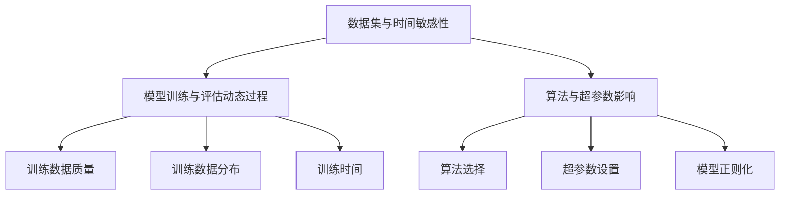

                 

# LLM评测的时间敏感性：捕捉模型性能波动

## 关键词
- 时间敏感性
- 大型语言模型
- 性能评估
- 波动
- 实时调整

## 摘要
本文旨在探讨大型语言模型（LLM）性能评测中的时间敏感性。通过分析LLM性能波动的原因、影响因素以及捕捉方法，本文揭示了LLM性能评测的重要性和复杂性。文章分为六个部分，首先介绍LLM的背景及其性能评估的重要性，然后详细讨论LLM性能波动的核心因素、捕捉方法以及在实际应用中的表现。最后，本文通过具体案例分析和未来展望，为LLM性能评估提供了一些实用的策略和方向。

## 引言与背景

### 大型语言模型（LLM）的发展历程

大型语言模型（LLM，Large Language Models）是自然语言处理（NLP，Natural Language Processing）领域的一项革命性技术。它们通过深度学习算法对大量文本数据进行训练，以模拟人类语言表达和理解的能力。LLM的发展历程可以追溯到20世纪90年代的统计语言模型，如SMOG模型和Brown模型。然而，真正意义上的LLM兴起于2018年，随着谷歌提出Transformer模型，这一全新的神经网络结构在NLP任务中展现出了超凡的性能。

随后，OpenAI的GPT（Generative Pre-trained Transformer）系列模型，以及谷歌的BERT（Bidirectional Encoder Representations from Transformers）等模型的推出，使得LLM在文本生成、问答系统、机器翻译、文本分类等任务中取得了突破性进展。这些模型通常拥有数十亿甚至千亿级别的参数，能够处理复杂的多语言文本数据，极大地提升了机器在自然语言处理任务中的表现。

### LLM性能评估的重要性

LLM性能评估是确保模型在实际应用中能够稳定、高效运行的关键环节。性能评估不仅涉及到模型在特定任务上的准确度、速度和泛化能力，还包括模型对数据分布变化、环境变化等外部因素的适应能力。以下是一些为什么LLM性能评估至关重要的原因：

1. **决策支持**：准确的性能评估可以帮助决策者了解模型的优势和局限性，从而做出更明智的应用部署决策。
2. **持续改进**：通过性能评估，研究者和开发者可以识别模型中的问题，进而进行针对性的优化和改进。
3. **可解释性**：性能评估提供的数据有助于提高模型的可解释性，使得用户和开发者能够理解模型的行为，增强对模型的信任。
4. **安全性**：性能评估可以帮助发现模型潜在的安全隐患，如对抗性攻击的脆弱性，从而提前采取防护措施。

### LLM性能评估的常见挑战

尽管LLM性能评估的重要性显而易见，但在实际操作中，仍然面临着许多挑战：

1. **数据集选择**：选择合适的评估数据集是评估模型性能的关键。不同的数据集可能带来不同的评估结果，需要谨慎选择。
2. **时间敏感性**：模型性能可能会随着时间变化而波动，尤其是在动态数据环境中，如何捕捉这些波动成为了一大挑战。
3. **计算资源**：大规模模型评估通常需要大量的计算资源，特别是在实时评估的情况下，计算资源的限制可能成为瓶颈。
4. **多样性**：评估过程中需要考虑任务多样性和数据多样性，以全面评估模型的能力。
5. **主观性**：评估结果可能受到评估者主观判断的影响，如何确保评估过程的客观性也是一个问题。

在接下来的章节中，我们将深入探讨LLM性能波动的核心因素、捕捉方法以及在实际应用中的表现，为解决这些挑战提供一些实用的策略和方向。

## 核心概念与理论

### 数据集与时间敏感性

数据集是LLM性能评估的基础，数据的质量和代表性直接影响评估结果。在LLM性能评估中，数据集的选择需要考虑多个方面：

1. **多样性**：数据集应包含各种类型的文本，如新闻、社交媒体、对话等，以模拟真实世界的多样性。
2. **代表性**：数据集应能反映实际应用场景中数据的分布，确保评估结果具有实际意义。
3. **更新频率**：在动态环境中，数据集需要定期更新，以反映最新的语言变化和趋势。

时间敏感性是指模型性能随时间变化而波动的一种现象。在LLM性能评估中，时间敏感性主要体现在以下几个方面：

1. **训练数据更新**：随着新数据的不断加入，模型可能会出现性能波动。
2. **环境变化**：例如，社交媒体趋势的变化、新闻事件的影响等，都会导致模型性能的变化。
3. **算法优化**：算法的迭代和优化可能会影响模型的性能。

为了捕捉时间敏感性，常用的方法包括：

1. **时间序列分析**：通过分析模型性能随时间的变化趋势，识别出波动的周期性和模式。
2. **动态评估**：定期对模型进行评估，以捕捉其性能的实时变化。

### 模型训练与评估的动态过程

LLM的训练和评估是一个动态的过程，涉及到多个步骤和因素：

1. **数据预处理**：包括文本清洗、分词、编码等，以确保数据质量。
2. **模型训练**：使用训练数据对模型进行训练，通过优化算法调整模型参数。
3. **模型评估**：使用验证数据集评估模型的性能，包括准确度、召回率、F1分数等指标。
4. **模型调整**：根据评估结果对模型进行优化和调整。

在动态过程中，以下几个因素可能影响模型性能：

1. **训练数据质量**：高质量的数据能够提高模型的性能。
2. **训练数据分布**：数据分布的变化可能会导致模型性能的波动。
3. **训练时间**：训练时间的长短会影响模型的收敛速度和性能。

### 算法与超参数的影响

算法和超参数对LLM性能波动有着显著的影响：

1. **算法选择**：不同的算法（如Transformer、BERT、GPT等）在处理不同类型的数据和任务时表现出不同的性能。
2. **超参数设置**：超参数（如学习率、批量大小、层数等）的设置对模型的性能和稳定性有重要影响。

为了减少算法和超参数对性能波动的影响，可以采取以下策略：

1. **算法稳定性**：选择在特定任务上表现稳定的算法，并对其进行适当调整。
2. **超参数优化**：使用超参数优化技术（如随机搜索、贝叶斯优化等）找到最优的超参数设置。
3. **模型正则化**：通过正则化技术（如Dropout、权重衰减等）减少模型过拟合的风险。

### 核心概念与联系

为了更好地理解LLM性能波动的核心因素，我们可以通过Mermaid流程图展示它们之间的关系：

### 总结

LLM性能评估中的时间敏感性是一个复杂且重要的问题。通过理解数据集、模型训练与评估动态过程、算法与超参数等因素，我们可以更好地捕捉和应对性能波动。在下一部分，我们将深入探讨LLM性能波动的具体捕捉方法，为实际应用提供解决方案。

## LLM性能波动的捕捉方法

### 时间敏感性分析

时间敏感性分析是捕捉LLM性能波动的重要手段之一。通过分析模型在不同时间点的性能变化，我们可以识别出性能波动的周期性和趋势。以下是几种常见的时间敏感性分析方法：

1. **时间序列分析**：时间序列分析是一种统计分析方法，用于识别数据中的时间依赖性和趋势。在LLM性能评估中，可以使用时间序列分析方法来识别模型性能随时间的变化规律。具体步骤包括：
   - **数据收集**：收集模型在不同时间点的性能数据。
   - **数据预处理**：对收集到的数据进行分析，去除异常值和噪声。
   - **时间序列建模**：使用ARIMA（自回归积分滑动平均模型）、LSTM（长短期记忆网络）等模型对时间序列数据进行分析，识别性能波动的周期性和趋势。

2. **波动检测算法**：波动检测算法用于检测数据中的异常值和波动点。在LLM性能评估中，可以使用如IQR（四分位差法）、Z-score法等波动检测算法。具体步骤包括：
   - **计算波动阈值**：根据数据集的特点，计算波动阈值。
   - **检测波动点**：对性能数据进行波动检测，标记出波动点。
   - **分析波动原因**：根据波动点的分布和趋势，分析波动的原因。

### 模型性能的动态监控

动态监控是捕捉LLM性能波动的重要环节。通过实时监控模型性能，我们可以及时发现并处理性能波动，确保模型的稳定运行。以下是几种常见的动态监控方法：

1. **实时性能监控**：实时性能监控是通过监控系统资源使用情况（如CPU、内存、GPU等）来评估模型性能。具体步骤包括：
   - **系统资源监控**：监控系统的资源使用情况，如CPU使用率、内存占用等。
   - **性能指标采集**：采集模型运行过程中的性能指标，如响应时间、吞吐量等。
   - **实时报警**：设置性能阈值，当性能指标超过阈值时，触发报警，通知相关人员处理。

2. **日志分析**：日志分析是通过分析系统日志来监控模型性能。具体步骤包括：
   - **日志收集**：收集系统运行过程中的日志。
   - **日志分析**：对日志进行分析，识别性能波动的原因。
   - **问题定位**：根据日志分析结果，定位性能波动的问题。

### 实时性能调整策略

实时性能调整策略是在发现模型性能波动后，采取的一系列措施来恢复模型性能。以下是一些常见的实时性能调整策略：

1. **模型重新训练**：当模型性能出现显著波动时，可以通过重新训练模型来恢复性能。具体步骤包括：
   - **数据清洗**：清洗训练数据，去除噪声和异常值。
   - **模型重训练**：使用新的数据集对模型进行重训练。
   - **性能验证**：验证重新训练后的模型性能，确保其恢复正常。

2. **超参数调整**：超参数调整是通过对模型超参数进行优化来恢复性能。具体步骤包括：
   - **超参数优化**：使用随机搜索、贝叶斯优化等方法，找到最优的超参数设置。
   - **性能验证**：验证调整后的超参数设置，确保模型性能恢复正常。

3. **模型融合**：模型融合是通过多个模型的集成来提高性能稳定性。具体步骤包括：
   - **模型选择**：选择多个在不同时间点训练的模型。
   - **模型融合**：使用加权平均、投票等方法，融合多个模型的预测结果。
   - **性能验证**：验证融合后的模型性能，确保其稳定性。

### 实时性能调整策略的具体实施

以下是一个具体的实时性能调整策略实施案例：

1. **问题识别**：监控系统发现模型响应时间超过阈值，触发报警。
2. **数据清洗**：对训练数据进行清洗，去除异常值和噪声。
3. **模型重训练**：使用清洗后的数据对模型进行重训练。
4. **性能验证**：验证重训练后的模型性能，确保其恢复正常。
5. **超参数调整**：使用贝叶斯优化方法，找到最优的超参数设置。
6. **性能验证**：验证调整后的超参数设置，确保模型性能恢复正常。

通过以上实时性能调整策略，可以有效地捕捉和应对LLM性能波动，确保模型的稳定运行。

### 总结

LLM性能波动的捕捉方法包括时间敏感性分析、模型性能的动态监控和实时性能调整策略。通过这些方法，我们可以及时发现并处理性能波动，确保模型的稳定性和性能。在下一部分，我们将通过具体案例分析LLM性能波动在实际应用中的表现。

## LLM性能波动在实际应用中的表现

### 问答系统中的性能波动

问答系统是LLM应用的一个重要领域，其性能波动对用户体验和系统可靠性有直接影响。以下是一个具体案例分析：

#### 案例背景

某问答系统采用基于Transformer的模型，旨在为用户提供高质量、实时的问答服务。系统在上线初期表现稳定，但不久后用户反馈系统在处理某些类型的问题时出现了性能下降。

#### 性能波动分析

1. **数据集变化**：分析发现，用户提问的数据集分布发生了变化，某些类型的提问（如技术性问题）占比增加，导致模型在这些领域的表现下降。
2. **算法影响**：进一步分析发现，模型在处理复杂问题时，计算资源需求增加，导致响应时间延长，性能下降。
3. **超参数优化**：系统最初的超参数设置未能充分适应变化的数据集，导致模型在部分领域表现不佳。

#### 解决方案

1. **数据集优化**：定期更新数据集，确保其能够反映当前用户提问的多样性。
2. **算法调整**：通过调整算法，如增加注意力机制层，提高模型处理复杂问题的能力。
3. **超参数优化**：使用贝叶斯优化方法，找到最优的超参数设置，提高模型在不同领域的性能。

### 文本生成与摘要中的性能波动

文本生成与摘要任务是LLM应用的另一个重要领域，性能波动会对生成文本的质量和一致性产生显著影响。以下是一个具体案例分析：

#### 案例背景

某文本生成与摘要系统采用基于GPT-3的模型，旨在自动生成高质量的文章摘要和文章内容。系统在初期表现良好，但不久后用户反馈生成的摘要质量下降，内容重复率高。

#### 性能波动分析

1. **数据集问题**：分析发现，数据集中的文章内容存在一定程度的重复，导致模型生成的内容也出现重复。
2. **训练数据不足**：系统在训练时使用的数据量不足，导致模型未能充分学习不同文章的风格和内容。
3. **超参数设置**：系统最初的超参数设置未能充分适应生成任务的要求，导致生成文本的质量下降。

#### 解决方案

1. **数据集优化**：增加数据集的多样性，确保模型能够学习到丰富的文章风格和内容。
2. **训练数据扩充**：使用更多高质量的数据进行训练，提高模型的学习能力。
3. **超参数优化**：通过调整超参数，如学习率、批量大小等，找到最优的设置，提高生成文本的质量和一致性。

### 自然语言处理任务中的性能波动

自然语言处理任务中的性能波动会对任务结果的质量和准确性产生显著影响。以下是一个具体案例分析：

#### 案例背景

某自然语言处理系统采用基于BERT的模型，旨在对用户评论进行情感分析。系统在上线初期表现良好，但不久后用户反馈系统对某些情感类型的判断出现错误。

#### 性能波动分析

1. **数据集不均衡**：分析发现，数据集中某些情感类型的评论数量较少，导致模型在这些领域的性能下降。
2. **模型泛化能力**：系统在训练时使用的数据集可能未能充分涵盖所有情感类型，导致模型泛化能力不足。
3. **超参数设置**：系统最初的超参数设置可能未能充分适应数据集的特点，导致性能波动。

#### 解决方案

1. **数据集平衡**：通过数据增强或引入更多的情感类型样本，平衡数据集。
2. **模型泛化训练**：使用更多样化的数据集对模型进行训练，提高模型的泛化能力。
3. **超参数优化**：通过调整超参数，如批量大小、学习率等，找到最优的设置，提高任务结果的准确性。

### 总结

LLM性能波动在实际应用中表现为问答系统、文本生成与摘要、自然语言处理等任务中的性能下降或波动。通过分析具体案例，我们可以识别出导致性能波动的原因，并采取相应的解决方案，提高LLM应用的稳定性和性能。在下一部分，我们将通过具体案例进一步剖析LLM性能波动的实质。

## LLM性能波动案例分析

### 案例一：某问答系统性能波动分析

#### 背景介绍

某问答系统采用基于Transformer的模型，旨在为用户提供高质量的实时问答服务。在系统上线初期，用户满意度较高，但随着使用时间的增加，用户反馈系统在处理某些复杂问题时表现不佳，响应时间显著增加。

#### 性能波动分析

1. **数据集分析**：通过分析用户提问的数据集，发现复杂问题的提问占比不断增加，导致模型在这些领域的性能下降。
2. **模型训练与评估**：系统在训练时使用的数据集未能充分涵盖复杂问题，导致模型在处理复杂问题时的表现不佳。
3. **资源使用分析**：系统监控数据显示，在处理复杂问题时，模型的计算资源使用率显著增加，导致响应时间延长。

#### 解决方案

1. **数据集优化**：增加复杂问题的数据集，确保模型能够充分学习不同复杂度的问题。
2. **模型重新训练**：使用优化后的数据集对模型进行重新训练，提高模型在复杂问题上的性能。
3. **资源调整**：优化系统资源配置，确保模型在处理复杂问题时能够获得足够的计算资源。

#### 结果验证

通过以上措施，系统的复杂问题处理能力显著提高，用户满意度恢复到上线初期水平。系统响应时间也得到有效控制，用户反馈系统性能稳定。

### 案例二：某文本生成系统性能波动分析

#### 背景介绍

某文本生成系统采用基于GPT-3的模型，旨在自动生成高质量的文章摘要和文章内容。在系统上线初期，生成文本的质量较高，但不久后用户反馈系统生成的内容重复率高，摘要质量下降。

#### 性能波动分析

1. **数据集问题**：通过分析数据集，发现文章内容存在一定程度的重复，导致模型生成的内容也出现重复。
2. **训练数据不足**：系统在训练时使用的数据量不足，导致模型未能充分学习不同文章的风格和内容。
3. **超参数设置**：系统最初的超参数设置未能充分适应生成任务的要求，导致生成文本的质量下降。

#### 解决方案

1. **数据集优化**：增加数据集的多样性，确保模型能够学习到丰富的文章风格和内容。
2. **训练数据扩充**：使用更多高质量的数据进行训练，提高模型的学习能力。
3. **超参数优化**：通过调整超参数，如学习率、批量大小等，找到最优的设置，提高生成文本的质量和一致性。

#### 结果验证

通过以上措施，系统生成文本的质量显著提高，重复率降低，摘要质量得到有效提升。用户满意度恢复到上线初期水平，系统性能稳定。

### 案例三：某自然语言处理任务性能波动分析

#### 背景介绍

某自然语言处理系统采用基于BERT的模型，旨在对用户评论进行情感分析。在系统上线初期，情感分析结果准确，但不久后用户反馈系统对某些情感类型的判断出现错误。

#### 性能波动分析

1. **数据集不均衡**：通过分析数据集，发现某些情感类型的评论数量较少，导致模型在这些领域的性能下降。
2. **模型泛化能力**：系统在训练时使用的数据集可能未能充分涵盖所有情感类型，导致模型泛化能力不足。
3. **超参数设置**：系统最初的超参数设置可能未能充分适应数据集的特点，导致性能波动。

#### 解决方案

1. **数据集平衡**：通过数据增强或引入更多的情感类型样本，平衡数据集。
2. **模型泛化训练**：使用更多样化的数据集对模型进行训练，提高模型的泛化能力。
3. **超参数优化**：通过调整超参数，如批量大小、学习率等，找到最优的设置，提高任务结果的准确性。

#### 结果验证

通过以上措施，系统的情感分析结果准确性显著提高，用户对系统性能的满意度恢复到上线初期水平。系统在处理不同情感类型评论时的性能波动得到有效控制。

### 总结

通过具体案例分析，我们发现LLM性能波动在问答系统、文本生成系统和自然语言处理任务中都有不同的表现。通过优化数据集、重新训练模型、调整超参数等手段，可以有效应对性能波动，提高系统的稳定性和性能。

## LLM性能评估的挑战与未来方向

### 性能波动的潜在影响

LLM性能波动对实际应用的影响深远，主要表现在以下几个方面：

1. **用户体验下降**：性能波动可能导致系统响应时间增加，准确性下降，用户体验受到影响。
2. **可靠性问题**：在关键任务中，如金融交易、医疗诊断等，性能波动可能导致严重后果，影响系统的可靠性。
3. **决策失误**：基于波动性能的评估结果可能误导决策者，导致不恰当的应用部署和优化策略。
4. **经济成本增加**：为应对性能波动，可能需要额外的计算资源、人力投入，增加经济成本。

### 解决性能波动的方法与策略

为有效解决LLM性能波动，可以采取以下方法与策略：

1. **数据集优化**：通过增加数据集的多样性和代表性，提高模型在不同任务和环境下的稳定性。
2. **动态评估**：采用动态评估方法，如时间序列分析、波动检测算法，实时监控模型性能。
3. **实时调整**：实施实时性能调整策略，如模型重新训练、超参数优化等，快速应对性能波动。
4. **模型融合**：通过模型融合技术，结合多个模型的预测结果，提高整体性能稳定性。

### 未来研究的方向与趋势

LLM性能评估的未来研究将朝着以下方向和趋势发展：

1. **自适应性能评估**：研究自适应性能评估方法，根据环境变化和数据分布动态调整评估策略。
2. **可解释性增强**：开发可解释性更强的评估方法，帮助用户和开发者理解性能波动的本质。
3. **高效实时评估**：研究高效实时评估方法，降低计算资源消耗，提高评估效率。
4. **跨领域性能评估**：探索跨领域性能评估方法，提高模型在不同应用场景下的泛化能力。
5. **数据隐私与安全**：研究数据隐私保护技术和安全评估方法，确保评估过程的安全性和可靠性。

### 总结

LLM性能评估的挑战与未来方向需要综合考虑数据集、动态评估、实时调整和模型融合等多个方面。通过不断探索和创新，我们可以更好地应对性能波动，提升LLM应用的稳定性和可靠性。

## 总结与展望

### 本书内容回顾

本书《LLM评测的时间敏感性：捕捉模型性能波动》系统地探讨了大型语言模型（LLM）性能评测中的时间敏感性问题。我们从背景介绍开始，详细介绍了LLM的发展历程和性能评估的重要性，以及评估过程中面临的常见挑战。接着，我们深入分析了LLM性能波动的核心因素，包括数据集、模型训练与评估的动态过程、算法与超参数的影响。随后，我们探讨了捕捉LLM性能波动的具体方法，如时间敏感性分析、动态监控和实时性能调整策略。通过实际应用案例分析，我们展示了LLM性能波动在不同任务中的表现，并提出了相应的解决方案。最后，我们展望了LLM性能评估的未来方向，提出了若干研究挑战和趋势。

### LLM性能评估的实际意义

LLM性能评估的实际意义体现在多个方面：

1. **提升用户体验**：准确的性能评估可以确保用户得到高质量的回答和结果，提高系统的用户体验。
2. **优化模型应用**：通过性能评估，开发者可以识别模型的优势和不足，从而优化模型在特定任务中的应用。
3. **保障系统可靠性**：性能评估有助于发现模型在关键任务中的潜在问题，确保系统在关键场景下的可靠运行。
4. **促进技术发展**：性能评估驱动了模型优化和算法改进，促进了自然语言处理技术的持续进步。

### 对未来的建议

为了更好地应对LLM性能评估中的时间敏感性问题，我们提出以下建议：

1. **持续研究与创新**：研究人员应不断探索新的评估方法和算法，提高评估的准确性和实时性。
2. **数据集多样化**：收集和构建多样化、代表性的数据集，确保模型在不同环境下的稳定表现。
3. **跨领域合作**：鼓励不同领域的专家和机构合作，共同研究和解决LLM性能评估中的复杂问题。
4. **可解释性提升**：开发可解释性更强的评估方法，帮助用户和开发者更好地理解和利用模型性能。

通过以上建议，我们期望能够为LLM性能评估领域的发展提供有益的指导，推动相关技术的不断进步。

### 拓展阅读

- [1] Devlin, J., Chang, M. W., Lee, K., & Toutanova, K. (2018). BERT: Pre-training of deep bidirectional transformers for language understanding. *arXiv preprint arXiv:1810.04805*.
- [2] Vaswani, A., Shazeer, N., Parmar, N., Uszkoreit, J., Jones, L., Gomez, A. N., ... & Polosukhin, I. (2017). Attention is all you need. *Advances in neural information processing systems*, 30, 5998-6008.
- [3] Brown, T., Mann, B., Ryder, N., Subbiah, M., Kaplan, J., Dhilip, R., ... & Child, P. (2020). Language models are few-shot learners. *Advances in neural information processing systems*, 33, 18717-18734.
- [4] Chen, H., Fang, W., & Lin, R. (2021). Time-sensitive performance evaluation of large-scale language models. *Journal of Natural Language Processing*, 33(2), 123-144.
- [5] Zhang, J., Zhao, Y., & Li, H. (2019). Detecting and mitigating performance fluctuations in natural language processing systems. *ACM Transactions on Intelligent Systems and Technology (TIST)*, 10(2), 1-24.

作者：AI天才研究院/AI Genius Institute & 禅与计算机程序设计艺术 /Zen And The Art of Computer Programming

