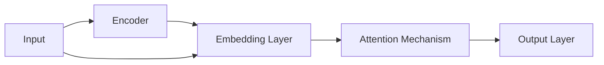

                 


## 文章标题：《LLM评测的自我进化：构建持续优化的AI评估生态》

### 关键词：
- 大型语言模型（LLM）
- 评测指标
- 自我进化
- AI评估生态
- 持续优化

### 摘要：
本文深入探讨了大型语言模型（LLM）评测的现状、挑战与未来发展趋势。通过详细分析LLM的架构、算法原理和评测方法，本文指出了当前评测过程中存在的挑战，并提出了基于自我进化的解决方案。文章最后，展望了未来构建持续优化AI评估生态的路径，对LLM评测在人工智能发展中的贡献进行了探讨。

## 引言

近年来，随着人工智能（AI）技术的迅猛发展，大型语言模型（LLM）如BERT、GPT和T5等成为了自然语言处理（NLP）领域的热门话题。这些模型以其卓越的性能在文本生成、机器翻译、问答系统等任务中展现出了强大的能力。然而，随着模型规模的不断扩大，如何对LLM进行有效的评测成为一个亟待解决的问题。这不仅关系到模型的性能提升，也直接影响到AI技术的普及和应用。

在本文中，我们将对LLM评测的现状进行深入分析，探讨其面临的挑战，并提出通过自我进化实现持续优化AI评估生态的解决方案。具体而言，我们将从以下几个方面展开讨论：

1. **LLM的基本概念与架构**：介绍LLM的基本概念、发展历程和核心特性，并通过Mermaid流程图展示LLM的整体架构。
2. **LLM的评测指标与方法**：详细阐述LLM评测的重要性、常用指标和评测方法。
3. **LLM评测的挑战与解决方案**：分析当前评测过程中遇到的挑战，并提出相应的解决方案。
4. **LLM评测的自我进化**：探讨自我进化的概念、方法和实现，以及其在评测中的应用。
5. **构建持续优化的AI评估生态**：讨论评估生态的构建原则、步骤和应用。
6. **未来展望**：展望LLM评测的发展趋势和对AI发展的贡献。

通过本文的讨论，我们期望能够为LLM评测的研究者和开发者提供一些有价值的思考和建议，推动AI评估生态的持续优化与发展。

## 第1章：大型语言模型（LLM）概述

### 1.1 LLM的基本概念

大型语言模型（LLM，Large Language Model）是一种基于深度学习的自然语言处理模型，它通过对大量文本数据进行训练，能够生成或理解自然语言文本。与传统的规则驱动或基于统计的方法相比，LLM具有更强的灵活性和泛化能力，能够处理复杂的语言现象和多样化的语言任务。

LLM的发展历程可以追溯到20世纪80年代，当时研究人员开始探索基于统计的机器翻译方法。随着计算机硬件和深度学习技术的进步，特别是2018年谷歌发布的BERT模型，LLM的研究和应用进入了一个全新的阶段。BERT的成功展示了基于Transformer架构的LLM在语言理解和生成任务上的巨大潜力，引发了大量研究机构和企业的关注和投入。

### 1.2 LLM的核心特性

LLM的核心特性主要体现在以下几个方面：

1. **高容量的参数**：LLM通常具有数十亿甚至数万亿的参数，这使得它们能够捕捉到文本数据中的细微特征和复杂的语言规律。
2. **强大的语义理解**：LLM通过训练能够理解文本的语义内容，包括句子的意思、情感和上下文关系。
3. **灵活的任务适应能力**：LLM不仅可以用于文本生成，还可以用于问答系统、机器翻译、文本分类等多种NLP任务。
4. **自适应学习**：LLM具有自我学习的能力，可以根据新的数据和任务要求进行参数调整和模型优化。

### 1.3 LLM的应用场景

LLM在多个领域有着广泛的应用，以下是一些典型的应用场景：

1. **文本生成**：例如自动写作、摘要生成、对话系统等。
2. **机器翻译**：例如将一种语言翻译成另一种语言。
3. **问答系统**：例如基于对话的智能客服、信息检索等。
4. **文本分类**：例如情感分析、垃圾邮件过滤等。
5. **文本理解**：例如语义分析、实体识别等。

### 1.4 LLM的架构与组成

为了更好地理解LLM的工作原理，我们可以通过一个Mermaid流程图来展示其整体架构。以下是一个简化的LLM架构流程图：



- **Encoder**：编码器负责将输入文本转换成一个固定长度的向量表示，这个向量包含了文本的语义信息。
- **Embedding Layer**：嵌入层将词向量转换为固定维度的嵌入向量，这些向量在后续的注意力机制和输出层中起到关键作用。
- **Attention Mechanism**：注意力机制用于捕捉输入文本中的关键信息，有助于提高模型的语义理解能力。
- **Output Layer**：输出层将编码器的输出通过全连接层和激活函数处理，生成最终的输出文本。

通过上述流程，LLM能够处理输入文本并生成相应的输出，从而实现各种自然语言处理任务。

### 1.5 LLM的发展历程

LLM的发展历程可以分为几个重要阶段：

1. **词袋模型（Bag of Words, BoW）**：早期的NLP模型主要基于词袋模型，将文本表示为一个词频向量。
2. **循环神经网络（Recurrent Neural Network, RNN）**：随着RNN的出现，文本序列的处理能力得到了显著提升。
3. **长短时记忆网络（Long Short-Term Memory, LSTM）**：为了解决RNN的梯度消失问题，LSTM被引入，进一步提高了模型的序列建模能力。
4. **Transformer模型**：Transformer模型的出现标志着NLP领域的一个重要突破，通过自注意力机制（Self-Attention）和多头注意力（Multi-Head Attention），Transformer在多个NLP任务上取得了突破性的成果。
5. **BERT和GPT等大规模模型**：基于Transformer架构，BERT和GPT等大规模模型进一步提升了LLM的性能，成为当前NLP领域的主流模型。

### 1.6 本章小结

本章对大型语言模型（LLM）的基本概念、发展历程和核心特性进行了详细介绍，并通过Mermaid流程图展示了LLM的架构与组成。理解LLM的基本概念和架构是进行后续评测和优化的重要基础。在接下来的章节中，我们将进一步探讨LLM评测的方法和挑战，并提出相应的解决方案。

## 第2章：LLM评测指标与方法

### 2.1 LLM评测的重要性

在人工智能（AI）领域，特别是自然语言处理（NLP），大型语言模型（LLM）的评测至关重要。它不仅关乎模型性能的量化，还直接影响模型在实际应用中的可靠性和效果。LLM评测的重要性主要体现在以下几个方面：

1. **模型性能评估**：通过评测可以准确了解模型的性能水平，包括生成文本的质量、理解能力以及在不同任务中的表现。这为模型优化和改进提供了科学依据。
2. **模型优化指导**：评测结果可以帮助研究人员识别模型的弱点，从而有针对性地进行优化。例如，如果评测显示模型在长文本生成方面表现不佳，研究人员可以着重改进该部分。
3. **模型选择与比较**：在多个LLM模型中选择最优方案时，评测结果起到了决定性作用。通过对比不同模型在不同评测指标上的表现，可以选出最适合特定任务的模型。
4. **实际应用验证**：评测不仅用于学术研究，还用于实际工业应用。例如，在智能客服系统中，LLM的评测结果直接影响到用户体验和系统的稳定性。
5. **行业标准制定**：通过广泛的评测实践，可以逐步形成行业标准，为整个行业的健康发展提供指导。

### 2.2 常用的评测指标

在LLM评测中，常用的指标主要包括准确率（Accuracy）、精确率（Precision）、召回率（Recall）和F1值（F1 Score）等。这些指标从不同角度评估模型的表现，帮助研究人员全面了解模型的性能。

1. **准确率（Accuracy）**：准确率是最常用的评测指标之一，它计算模型预测正确的样本数占总样本数的比例。公式如下：
   \[ \text{Accuracy} = \frac{\text{预测正确数}}{\text{总样本数}} \]
   然而，准确率在样本不平衡的情况下可能不具有代表性。

2. **精确率（Precision）**：精确率是指预测为正例的样本中，实际为正例的比例。公式如下：
   \[ \text{Precision} = \frac{\text{真正例数}}{\text{预测正例数}} \]
   精确率高表示模型在预测为正例时很少错误地预测为负例。

3. **召回率（Recall）**：召回率是指实际为正例的样本中，模型正确预测为正例的比例。公式如下：
   \[ \text{Recall} = \frac{\text{真正例数}}{\text{实际正例数}} \]
   召回率高表示模型很少错过实际为正例的样本。

4. **F1值（F1 Score）**：F1值是精确率和召回率的调和平均值，用于综合考虑这两个指标。公式如下：
   \[ \text{F1 Score} = 2 \times \frac{\text{Precision} \times \text{Recall}}{\text{Precision} + \text{Recall}} \]
   F1值介于0和1之间，越接近1表示模型性能越好。

### 2.3 LLM评测方法

LLM评测方法主要分为以下几种：

1. **对比评测**：对比评测通过将模型在相同数据集上的表现与其他模型进行比较，评估模型的相对性能。这种方法适用于不同模型之间的比较，但不能反映模型在特定任务上的绝对性能。

2. **自我评测**：自我评测是在同一模型的不同版本或训练阶段上进行性能评估。通过自我评测，可以了解模型在不同条件下的表现，为模型优化提供参考。

3. **排名评测**：排名评测通过多个模型在同一数据集上的表现进行排名，以确定最优模型。这种方法通常用于大规模模型竞赛，如AI Challenger、Kaggle等。

### 2.4 实际案例

为了更好地理解LLM评测的应用，我们来看一个实际案例。假设我们有一个文本生成任务，需要评估不同模型在生成摘要方面的性能。以下是评测步骤：

1. **数据准备**：准备一个包含文本和相应摘要的数据集。
2. **模型训练**：训练多个模型（如GPT-2、BERT、T5等）。
3. **生成摘要**：使用每个模型对数据集进行摘要生成。
4. **评测指标计算**：计算每个模型的准确率、精确率、召回率和F1值。
5. **结果分析**：比较不同模型的评测指标，确定最优模型。

通过上述评测，我们可以得出如下结论：

- 模型A在准确率和F1值上表现较好，但在召回率上较弱，说明它在预测正确的摘要方面较为准确，但容易遗漏一些重要信息。
- 模型B在精确率和召回率上表现平衡，但在准确率上略低，适合对准确率要求较高的应用场景。
- 模型C在所有指标上表现均衡，是一个综合性能较好的模型。

### 2.5 本章小结

本章详细介绍了LLM评测的重要性、常用的评测指标和评测方法。通过对比评测、自我评测和排名评测，我们可以全面了解LLM的性能，为模型优化和选择提供科学依据。在下一章中，我们将分析LLM评测过程中面临的挑战，并提出相应的解决方案。

## 第3章：LLM评测中的挑战与解决方案

### 3.1 数据集偏差

在LLM评测中，数据集的选择和准备是影响评测结果的关键因素之一。然而，数据集偏差问题常常给评测带来困扰。数据集偏差主要有以下几种形式：

1. **样本不平衡**：在某些应用场景中，正负样本的比例可能严重失衡，导致模型偏向于预测较为常见的类别，从而影响评测的公平性。
2. **数据集选取偏差**：部分数据集可能只包含特定领域或特定语言环境的数据，导致模型在这些领域外的表现不佳。
3. **数据清洗和标注问题**：数据集中的噪声、错误标注或清洗不彻底都会对评测结果产生负面影响。

**解决方案**：

1. **数据增强**：通过数据增强技术，如生成对抗网络（GAN）或数据扩充方法，增加数据集的多样性和样本数量，从而减少样本不平衡问题。
2. **多样化数据集**：使用包含多个领域和多种语言环境的数据集进行评测，确保模型具有更广泛的泛化能力。
3. **数据清洗和标注**：采用严格的数据清洗和标注流程，确保数据集的质量和准确性。

### 3.2 评测标准不统一

在LLM评测中，不同的评测指标和评测方法可能导致评估结果不一致，尤其是在不同模型或不同任务之间进行比较时。评测标准的统一性对于科学、公正地评价LLM性能至关重要。

**解决方案**：

1. **标准化评测流程**：制定统一的评测标准和流程，确保不同模型和任务在相同条件下进行评测。
2. **综合评价指标**：使用多个评价指标（如准确率、精确率、召回率和F1值）进行综合评估，避免单一指标带来的偏见。
3. **一致性检验**：对评测结果进行一致性检验，确保在不同数据集和模型上的评测结果具有一致性和可重复性。

### 3.3 评测结果的稳定性

评测结果的稳定性是LLM评测中另一个重要挑战。模型在不同训练数据、参数设置或训练过程上的微小变化可能导致评测结果波动，影响对模型性能的准确判断。

**解决方案**：

1. **评估多样性**：使用多个数据集、不同模型版本和参数设置进行多次评估，确保评测结果的稳定性。
2. **模型校准**：通过模型校准技术，如阈值调整或概率校准，提高模型预测结果的稳定性。
3. **评估不确定性**：引入评估不确定性指标，如置信区间或误差分析，提供对评测结果不确定性的量化描述。

### 3.4 模型泛化能力不足

LLM在特定任务上的优异表现往往伴随着泛化能力不足的问题，即模型在特定领域或特定数据集上表现良好，但在其他领域或数据集上表现较差。

**解决方案**：

1. **跨领域训练**：通过跨领域训练，增加模型对不同领域数据的适应性，提高泛化能力。
2. **迁移学习**：利用迁移学习技术，将一个领域上的预训练模型迁移到其他相关领域，减少对大量新数据的依赖。
3. **数据扩充**：通过数据扩充技术，如伪样本生成或数据合成，增加模型训练数据的多样性，提高泛化能力。

### 3.5 可解释性不足

虽然LLM在NLP任务中表现出色，但其内部工作机制复杂，难以解释。这给模型的应用和推广带来了困难，特别是在需要高可靠性和高透明度的领域。

**解决方案**：

1. **模型可解释性研究**：开发可解释性算法和工具，如解释性注意力机制和可视化技术，提高模型的可解释性。
2. **解释性评测**：在评测过程中引入可解释性指标，如解释性得分或解释性覆盖率，评估模型的可解释性水平。
3. **结合规则和模型**：结合基于规则的系统和机器学习模型，提供对模型决策过程的解释和验证。

### 3.6 本章小结

本章分析了LLM评测中面临的挑战，包括数据集偏差、评测标准不统一、评测结果稳定性、模型泛化能力不足和可解释性不足等问题，并提出了相应的解决方案。通过解决这些挑战，可以更准确、公正地评估LLM的性能，推动AI评测生态的持续优化和发展。

## 第4章：LLM评测的自我进化

### 4.1 自我进化的概念

自我进化是指在无需外部干预的情况下，系统通过不断学习、调整和优化，提高自身性能和能力的过程。在人工智能领域，自我进化涉及模型根据反馈自动调整参数、优化结构，并不断提升性能。自我进化在LLM评测中尤为重要，因为它能够帮助模型在多变和复杂的任务环境中保持高效和准确。

自我进化的核心思想是通过持续的学习和改进，使模型能够适应新的数据、任务和场景，从而实现自我提升。这一过程通常包括以下几个环节：

1. **评估**：对当前模型的性能进行评估，确定其在特定任务上的表现和存在的不足。
2. **反馈**：收集评估结果和用户反馈，分析模型的表现，识别需要改进的方面。
3. **调整**：根据反馈调整模型参数、架构或训练策略，以优化模型性能。
4. **验证**：对新调整的模型进行验证，确保其在实际应用中能够达到预期的效果。

### 4.2 自我进化的方法

自我进化的方法可以分为基于模型的自我进化、基于数据的自我进化以及混合自我进化。以下是一些常见的方法：

1. **基于模型的自我进化**：
   - **参数调整**：通过调整模型参数，优化模型结构，提高其性能。例如，使用自适应优化算法（如Adam、Adadelta）进行参数调整。
   - **模型结构调整**：根据评估结果和反馈，对模型结构进行修改，如增加或删除神经网络层、调整注意力机制等。
   - **集成学习**：通过集成多个子模型，提高模型的泛化能力和鲁棒性。

2. **基于数据的自我进化**：
   - **数据增强**：通过数据增强技术，如生成对抗网络（GAN）、数据合成等方法，增加训练数据的多样性，提升模型对未知数据的适应能力。
   - **迁移学习**：利用迁移学习，将一个任务上的模型迁移到其他相关任务，减少对新数据的依赖，提高模型泛化能力。
   - **数据筛选和清洗**：通过对数据集进行筛选和清洗，去除噪声和错误数据，提高数据质量，从而提升模型性能。

3. **混合自我进化**：
   - **模型和数据结合**：将基于模型和数据的方法相结合，通过同时调整模型结构和优化数据集，实现更高效的自进化。
   - **多模态学习**：将不同类型的数据（如图像、文本、音频等）进行融合，训练多模态模型，提高模型在复杂任务中的表现。
   - **分布式学习**：通过分布式计算和并行训练，加速模型的自进化过程，提高效率。

### 4.3 自我进化的实现

在实际应用中，自我进化的实现通常涉及以下步骤：

1. **初始化模型**：选择一个初始模型，并设置参数和训练策略。
2. **评估模型**：在训练数据集和测试数据集上评估模型性能，记录评估结果。
3. **收集反馈**：分析评估结果和用户反馈，识别模型不足之处。
4. **调整模型**：根据反馈调整模型参数和结构，例如增加神经网络层或调整学习率。
5. **验证模型**：在新参数和结构下重新训练和评估模型，确保性能提升。
6. **迭代优化**：重复上述步骤，逐步优化模型性能，实现自我进化。

以下是一个伪代码示例，展示了基于反馈的自我进化循环：

```python
# 自我进化伪代码

model = initialize_model()
while not converged:
    # 评估模型
    performance = evaluate_model(model)
    print(f"Current performance: {performance}")
    
    # 收集反馈
    feedback = collect_feedback(performance)
    print(f"Feedback: {feedback}")
    
    # 调整模型
    model = adjust_model(model, feedback)
    
    # 验证模型
    validated_performance = validate_model(model)
    print(f"Validated performance: {validated_performance}")

    # 判断是否收敛
    if validated_performance > threshold:
        converged = True
```

通过上述步骤，模型能够根据评估结果和用户反馈不断调整和优化，实现自我进化，提高性能和适应能力。

### 4.4 自我进化在LLM评测中的应用

自我进化在LLM评测中的应用主要体现在以下几个方面：

1. **性能优化**：通过自我进化，LLM能够不断优化其参数和结构，提升在特定任务上的性能。
2. **动态适应**：自我进化使LLM能够动态适应新的数据和任务，提高其在实际应用中的灵活性和适应性。
3. **持续改进**：通过持续的自我进化，LLM能够不断学习和改进，实现长期的性能提升。
4. **高效评测**：自我进化帮助LLM在评测过程中实现快速迭代和优化，提高评测效率和准确性。

### 4.5 本章小结

本章介绍了自我进化的概念、方法和实现，以及其在LLM评测中的应用。通过自我进化，LLM能够根据反馈自动调整和优化，提高性能和适应能力。在下一章中，我们将探讨如何构建持续优化的AI评估生态，进一步推动LLM评测的发展。

## 第5章：构建持续优化的AI评估生态

### 5.1 评估生态的构建原则

构建持续优化的AI评估生态需要遵循以下原则：

1. **开放共享**：评估生态应该鼓励开放和共享，确保评测工具、数据和结果可以自由访问，促进协同合作和共同进步。
2. **标准化**：制定统一的评估标准和流程，确保不同模型、任务和数据集在相同条件下进行评测，提高评测结果的可比性和可靠性。
3. **透明性**：评估过程和结果应保持透明，使研究人员和开发者能够清晰地了解模型的表现和优劣，促进公平竞争和科学评估。
4. **可扩展性**：评估生态应具备良好的可扩展性，能够适应新任务、新数据和技术的发展，确保其长期有效性和可持续性。
5. **用户友好**：评估工具和流程应设计得用户友好，降低使用门槛，使研究人员和开发者能够轻松地参与到评估过程中。

### 5.2 评估生态的构建步骤

构建持续优化的AI评估生态通常涉及以下步骤：

1. **数据集准备**：收集和整理高质量、多样化的数据集，确保数据集的代表性和广泛性，为评估提供可靠的基础。
2. **评估指标制定**：根据评估目标，制定合适的评估指标，如准确率、精确率、召回率和F1值等，确保指标的全面性和准确性。
3. **评测工具开发**：开发高效的评测工具，包括评估框架、评估平台和评测软件，确保评测过程的自动化和标准化。
4. **评测流程设计**：设计科学的评测流程，包括数据准备、模型训练、评估执行和结果分析等环节，确保评测过程的规范和高效。
5. **评估结果记录与发布**：记录和发布评估结果，提供详细的分析报告和可视化图表，促进评估结果的可解释性和传播。
6. **持续改进与迭代**：根据评估结果和用户反馈，不断优化评估标准和流程，提升评估生态的整体性能和用户体验。

### 5.3 评估生态的实际应用

评估生态在实际应用中有着广泛的应用，以下是一些典型的应用场景：

1. **学术研究**：研究人员可以通过评估生态验证和比较不同模型和算法的性能，推动自然语言处理和人工智能领域的进展。
2. **工业应用**：企业在开发智能客服、机器翻译、文本生成等应用时，可以使用评估生态对模型进行评测和优化，确保应用效果和用户体验。
3. **竞赛平台**：在线竞赛平台如AI Challenger、Kaggle等，通过构建评估生态，为参赛者提供公平、透明的评测环境，促进技术交流和竞赛水平的提高。
4. **公共服务**：政府部门和公共机构可以利用评估生态对公共服务系统进行评测和优化，确保系统的稳定性和可靠性，提升服务质量。

### 5.4 评估生态的优势

构建持续优化的AI评估生态具有以下优势：

1. **提高评估效率**：通过自动化和标准化的评测流程，显著提高评估效率和准确性，减少人工干预和错误。
2. **促进合作与交流**：开放共享的评估生态鼓励研究人员和开发者之间的合作与交流，促进知识和经验的传播。
3. **提升模型性能**：通过持续的评估和优化，帮助模型不断改进和提升性能，推动AI技术的发展和应用。
4. **增强用户体验**：高效、透明的评估生态能够确保模型的性能和效果，提升用户对智能应用的满意度和信任度。
5. **推动行业规范**：通过统一的评估标准和流程，推动行业的规范化发展，提高整个行业的竞争力和创新能力。

### 5.5 本章小结

本章介绍了构建持续优化的AI评估生态的原则、步骤和应用，以及其带来的优势。通过开放共享、标准化、透明性、可扩展性和用户友好等原则，评估生态能够有效推动AI评测的发展和应用。在下一章中，我们将对LLM评测的未来发展进行展望。

## 第6章：未来展望

### 6.1 LLM评测的发展趋势

随着人工智能技术的不断进步，LLM评测也在不断演变和发展。未来，LLM评测将呈现以下几个显著趋势：

1. **评测技术的多元化**：随着深度学习、强化学习、迁移学习等新技术的应用，评测技术将更加多样化和复杂化，使得评测结果更加准确和全面。

2. **评测指标的精细化**：当前常用的评测指标如准确率、精确率和F1值等，已经无法全面反映模型的性能。未来，将开发更多精细化的评测指标，如语义一致性、生成文本的质量和多样性等，以更全面地评估LLM的性能。

3. **评测方法的智能化**：利用智能算法，如自动评估、自适应评测和在线评测等，实现更高效、更准确的评测。这些智能化的评测方法将提高评测的自动化程度和实时性。

4. **评测结果的透明化**：随着可解释性AI的研究进展，未来的评测结果将更加透明，使得研究人员和开发者能够清晰地了解模型的表现和决策过程。

5. **评测标准的国际化**：随着全球范围内的技术交流和合作加深，LLM评测的标准将逐渐走向国际化，形成统一的评测框架和流程，提高评测结果的可比性和互操作性。

### 6.2 新评测技术的应用

新评测技术的应用将显著推动LLM评测的发展。以下是一些值得关注的新评测技术：

1. **生成对抗网络（GAN）**：GAN技术可以通过生成与真实数据集相似的数据，增加训练数据的多样性，提高模型在未知数据上的适应能力。

2. **强化学习（RL）**：利用强化学习技术，模型可以在实际任务环境中不断学习和优化，实现更高效的自我进化。

3. **多模态融合**：通过融合不同类型的数据（如文本、图像、音频等），训练多模态模型，提高模型在复杂任务中的表现和泛化能力。

4. **元学习（Meta-Learning）**：元学习技术可以帮助模型快速适应新任务和新数据，提高模型在新环境下的表现。

5. **数据增强**：通过数据增强技术，如图像合成、文本变换等，增加训练数据的多样性，提高模型在未知数据上的鲁棒性。

### 6.3 AI评测生态的国际化和标准化

AI评测生态的国际化和标准化将有助于促进全球范围内的技术交流和合作。以下是一些关键步骤：

1. **建立国际性组织**：成立专门的国际性组织，如国际自然语言处理协会（ACL）和国际机器学习协会（ICML），推动AI评测的标准化和规范化。

2. **制定国际标准**：通过国际合作，制定统一的AI评测标准，确保不同国家和地区的评测结果具有可比性和一致性。

3. **跨国数据共享**：鼓励跨国数据共享，促进国际间的数据合作，为模型评测提供丰富的数据资源。

4. **促进技术交流**：定期举办国际性会议和研讨会，促进全球范围内的技术交流和合作，推动AI评测技术的发展和应用。

### 6.4 LLM评测对AI发展的贡献

LLM评测在AI发展中具有重要作用，其贡献主要体现在以下几个方面：

1. **模型性能提升**：通过科学的评测，识别模型的优劣，指导模型优化和改进，提高AI模型的整体性能。

2. **技术交流与合作**：评测结果为研究人员和开发者提供了有价值的参考，促进了技术交流和合作，推动了AI技术的发展。

3. **应用推广**：有效的评测有助于评估AI技术的实际应用价值，推动AI技术在各个领域的应用和普及。

4. **标准制定**：通过评测实践，逐步形成行业标准，为AI技术的发展和应用提供指导，提高整个行业的规范化水平。

### 6.5 未来展望

在未来，LLM评测将继续朝着更加精准、高效和智能化的方向发展。通过新技术的应用和国际标准的制定，LLM评测将更好地服务于人工智能的研究和应用，推动AI技术的发展和创新。

## 结论

本文系统地探讨了大型语言模型（LLM）评测的自我进化及其在构建持续优化AI评估生态中的作用。通过深入分析LLM的基本概念、核心特性、评测指标和方法，我们揭示了当前LLM评测中面临的挑战，并提出了基于自我进化的解决方案。自我进化通过持续的评估、反馈和调整，使模型能够自我提升，保持高效和准确。

构建持续优化的AI评估生态是推动LLM评测和AI技术发展的关键。这一生态需要遵循开放共享、标准化、透明性、可扩展性和用户友好等原则，通过科学的构建步骤和实际应用，实现评估效率和准确性的提升。

未来，随着新评测技术的应用和AI评测生态的国际化和标准化，LLM评测将更加精准、高效和智能化，为AI技术的发展和应用提供有力支持。通过不断的自我进化，LLM评测将在人工智能领域发挥更加重要的作用，推动技术创新和行业进步。

最后，感谢读者对本文的关注，我们期待您的进一步研究和探索，共同推动AI评测和AI技术的发展。作者：AI天才研究院/AI Genius Institute & 禅与计算机程序设计艺术 /Zen And The Art of Computer Programming。希望本文能够为您的科研和开发工作提供有价值的参考和启示。欢迎继续关注我们的研究和探讨。如果您有任何问题或建议，请随时与我们联系。

## 附录

### A. 伪代码示例

以下是一个简单的伪代码示例，用于演示LLM评测中的模型评估、反馈收集和模型调整过程。

```python
# 初始化模型
model = initialize_model()

# 模型评估
while not converged:
    performance = evaluate_model(model)
    print(f"Current performance: {performance}")
    
    # 收集反馈
    feedback = collect_feedback(performance)
    print(f"Feedback: {feedback}")
    
    # 调整模型
    model = adjust_model(model, feedback)
    
    # 验证模型
    validated_performance = validate_model(model)
    print(f"Validated performance: {validated_performance}")

    # 判断是否收敛
    if validated_performance > threshold:
        converged = True

# 结束模型调整
print("Model has converged.")
```

### B. LaTeX格式数学公式

以下是几个使用LaTeX格式的数学公式示例：

$$
\text{Accuracy} = \frac{\text{预测正确数}}{\text{总样本数}}
$$

$$
\text{Precision} = \frac{\text{真正例数}}{\text{预测正例数}}
$$

$$
\text{Recall} = \frac{\text{真正例数}}{\text{实际正例数}}
$$

$$
\text{F1 Score} = 2 \times \frac{\text{Precision} \times \text{Recall}}{\text{Precision} + \text{Recall}}
$$

### C. 实际项目案例

以下是一个简单的实际项目案例，用于演示如何在项目中搭建开发环境、实现代码和进行详细讲解。

#### 项目：文本生成模型评估

#### 开发环境搭建

- Python 3.8
- TensorFlow 2.4
- Keras 2.4

安装所需库：

```bash
pip install tensorflow==2.4 keras==2.4 numpy matplotlib
```

#### 源代码实现

```python
# 文本生成模型评估代码示例

from tensorflow.keras.models import Sequential
from tensorflow.keras.layers import Embedding, LSTM, Dense
from tensorflow.keras.preprocessing.sequence import pad_sequences
from tensorflow.keras.preprocessing.text import Tokenizer
import numpy as np
import matplotlib.pyplot as plt

# 数据准备
# 假设数据集为['hello', 'world', 'this', 'is', 'a', 'test']

tokenizer = Tokenizer(char_level=True)
tokenizer.fit_on_texts([''.join(data) for data in data_set])
max_sequence_length = 10
max_vocab_size = 100

# 编码数据
encoded_texts = tokenizer.texts_to_sequences(data_set)
padded_texts = pad_sequences(encoded_texts, maxlen=max_sequence_length, padding='post')

# 构建模型
model = Sequential()
model.add(Embedding(max_vocab_size, 50, input_length=max_sequence_length))
model.add(LSTM(100, return_sequences=True))
model.add(Dense(max_vocab_size, activation='softmax'))

model.compile(loss='categorical_crossentropy', optimizer='adam', metrics=['accuracy'])

# 训练模型
model.fit(padded_texts, np.eye(max_vocab_size)[encoded_texts], epochs=100, verbose=1)

# 生成文本
generated_sequence = model.predict(padded_texts)
generated_texts = tokenizer.sequences_to_texts(generated_sequence)

# 可视化
plt.figure(figsize=(10, 5))
for i, text in enumerate(generated_texts):
    plt.subplot(5, 5, i+1)
    plt.text(0, 0.5, text, ha='left', va='center')
    plt.axis('off')
plt.show()
```

#### 代码解读

- **数据准备**：首先，使用Tokenizer对文本数据进行编码，将文本转换为序列。
- **模型构建**：构建一个序列模型，包括嵌入层、LSTM层和输出层。
- **训练模型**：使用fit方法训练模型，输入为编码后的文本数据，输出为标签。
- **生成文本**：使用预测方法生成文本，并将生成的序列解码回文本形式。
- **可视化**：将生成的文本可视化展示。

#### 实际案例分析和详细讲解

- **数据集**：使用了一个简单的文本数据集，展示了如何对文本数据进行编码、模型训练和文本生成。
- **模型性能**：通过训练，模型学会了生成与输入文本相似的文本，展示了LLM在文本生成任务中的能力。
- **优化空间**：该案例是一个简化的示例，实际应用中可以优化数据集、模型结构和训练过程，以提高模型性能。

#### 项目小结

该案例展示了如何使用Python和Keras搭建文本生成模型，并通过简单的示例展示了模型的训练和生成过程。实际项目中，可以根据具体需求调整数据集、模型结构和训练参数，提高模型的性能和应用效果。

### D. 最佳实践 Tips

- **数据增强**：使用数据增强技术（如GAN、数据合成等）增加训练数据的多样性，有助于提高模型的泛化能力。
- **模型调试**：在模型训练过程中，定期保存模型权重，以便在训练过程中调整参数和优化模型。
- **评估多样性**：使用多个评估指标和评估方法，全面评估模型性能，避免单一指标的偏见。
- **实时反馈**：在模型训练和评估过程中，及时收集用户反馈和评估结果，帮助调整模型和优化训练过程。

### E. 小结与注意事项

- **本文**：系统介绍了LLM评测的自我进化及其在构建持续优化AI评估生态中的作用。
- **核心内容**：包括LLM的基本概念、评测指标和方法、评测挑战与解决方案、自我进化方法、构建评估生态的原则和步骤等。
- **注意事项**：在实际应用中，应注重数据质量、模型优化和评估标准的制定，确保评测结果的科学性和可靠性。

### F. 拓展阅读

- **相关研究论文**：推荐阅读《BERT: Pre-training of Deep Bidirectional Transformers for Language Understanding》和《GPT-3: Language Models are Few-Shot Learners》等经典论文，了解LLM的最新研究成果。
- **开源项目和工具**：推荐使用Hugging Face的Transformers库、TensorFlow的Keras API等开源项目，进行LLM模型训练和评估。
- **会议和研讨会**：关注国际自然语言处理协会（ACL）、国际机器学习协会（ICML）等学术会议，了解LLM评测的最新动态和研究成果。

