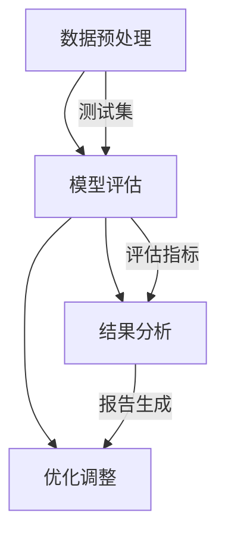
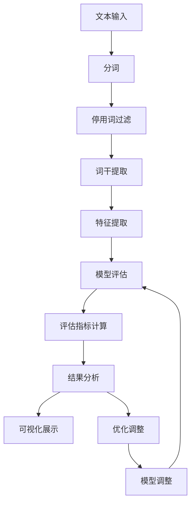
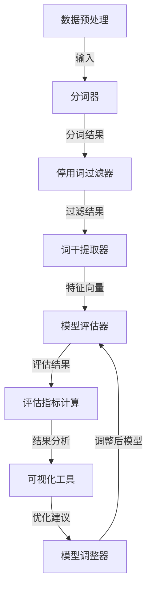

                 

# LLM评测系统的架构设计：平衡全面性与效率

> 关键词：语言模型，评测系统，架构设计，全面性，效率，算法原理

> 摘要：本文旨在深入探讨语言模型评测系统的架构设计，如何在保证评测全面性的同时提高系统效率。通过分析语言模型的基础知识，设计原则，核心算法原理，以及实际项目实战，本文为读者提供了一套完整、高效、易于扩展的评测系统架构设计方案。

### 引言

随着人工智能技术的快速发展，语言模型（Language Model，简称LLM）作为自然语言处理（Natural Language Processing，简称NLP）的核心技术之一，已广泛应用于聊天机器人、机器翻译、文本生成等领域。为了评估语言模型的效果和性能，建立一套全面、高效的评测系统显得尤为重要。

然而，在现实应用中，我们常常面临一个难题：如何在保证评测全面性的同时，提高系统的运行效率？这需要我们在架构设计上做出权衡和优化。本文将从以下几个方面展开讨论：

1. **语言模型基础**：介绍语言模型的基本概念、发展历程及其数学基础。
2. **评测系统的设计原则**：阐述评测系统设计时应遵循的原则，包括平衡全面性与效率的关系。
3. **架构设计核心概念与联系**：通过Mermaid流程图展示架构设计中的核心概念及其联系。
4. **核心算法原理讲解**：使用伪代码详细阐述核心算法原理。
5. **实际项目实战**：介绍一个实际项目的开发环境搭建、代码实现及分析。
6. **性能优化与调优**：探讨评测系统的性能优化策略和调优技巧。
7. **安全性与稳定性**：讨论评测系统的安全性和稳定性设计。
8. **未来展望与趋势**：展望语言模型评测系统的未来发展方向和趋势。

### 1.1 设计书籍目录大纲的步骤

设计一个书籍目录大纲，需要遵循以下步骤：

1. **阅读和理解书名和内容**：
   - 确保你对书的内容有充分的了解。
   - 分析书名的关键词，如《LLM评测系统的架构设计：平衡全面性与效率》，关键词包括“LLM评测系统”、“架构设计”、“平衡全面性与效率”。

2. **确定书籍的目标读者**：
   - 确定书籍的读者群体，这将帮助你了解你需要包含哪些内容，以及如何组织这些内容。

3. **确定书籍的总体结构**：
   - 确定书籍的大致章节，如引言、核心概念、具体应用、项目实战等。

4. **细化章节内容**：
   - 对于每个章节，列出具体的小节，并确定这些小节的内容。

5. **设计核心概念和联系**：
   - 设计核心概念和联系，如使用Mermaid流程图展示架构。

6. **编写核心算法原理讲解**：
   - 使用伪代码详细阐述核心算法原理。

7. **准备数学模型和数学公式**：
   - 准备相关的数学模型和公式，并使用LaTeX格式嵌入到文中。

8. **规划项目实战部分**：
   - 提供项目实战的案例和详细解释，包括代码实现和解读。

9. **审查和修改**：
   - 审查目录大纲，确保内容完整、逻辑清晰，并根据需要进行修改。

10. **撰写总结和附录**：
    - 撰写总结，回顾书籍的主要内容，并提供相关的附录，如工具资源列表。

### 1.2 设计《LLM评测系统的架构设计：平衡全面性与效率》的目录大纲

基于以上步骤，下面是《LLM评测系统的架构设计：平衡全面性与效率》的目录大纲：

```
# 《LLM评测系统的架构设计：平衡全面性与效率》目录大纲

## 第1章 引言
### 1.1 书籍背景和目的
### 1.2 读者对象
### 1.3 书籍结构

## 第2章 语言模型基础
### 2.1 语言模型概述
### 2.2 语言模型的发展历程
### 2.3 语言模型的数学基础
   - $y = f(x)$
   - $z = w^T x + b$
### 2.4 语言模型的核心算法

## 第3章 评测系统的设计原则
### 3.1 评测系统概述
### 3.2 设计原则
### 3.3 平衡全面性与效率的关系
   - $$\frac{\text{评测全面性}}{\text{评测效率}} = \alpha$$
### 3.4 设计流程

## 第4章 架构设计核心概念与联系
### 4.1 Mermaid流程图展示
### 4.2 模块划分
### 4.3 数据流分析

## 第5章 架构设计核心算法原理
### 5.1 核心算法概述
### 5.2 算法伪代码
``` 
```
## 第6章 实际项目实战
### 6.1 项目背景
### 6.2 开发环境搭建
### 6.3 代码实现与解读
### 6.4 分析与优化

## 第7章 性能优化与调优
### 7.1 性能优化策略
### 7.2 调优技巧
### 7.3 实际案例分享

## 第8章 安全性与稳定性
### 8.1 安全性设计
### 8.2 稳定性保障
### 8.3 故障处理与恢复

## 第9章 未来展望与趋势
### 9.1 未来发展方向
### 9.2 技术趋势
### 9.3 行业应用前景

## 附录
### A.1 工具与资源列表
### A.2 参考文献
### A.3 常见问题解答
```

这个目录大纲考虑了书籍的核心内容，包括语言模型基础、评测系统设计原则、架构设计核心概念与联系、核心算法原理讲解、实际项目实战、性能优化与调优、安全性与稳定性，以及未来展望与趋势。同时，附录部分提供了相关的工具与资源列表、参考文献和常见问题解答。整体上，目录结构清晰，章节划分合理，旨在帮助读者全面了解LLM评测系统的架构设计。

---

### 2. 语言模型基础

#### 2.1 语言模型概述

语言模型（Language Model，简称LM）是一种用于预测文本序列的概率分布的模型，它是自然语言处理（NLP）领域的基础技术之一。语言模型的目的是通过统计语言数据来学习文本生成规律，从而生成符合语言习惯的文本。

语言模型的应用非常广泛，例如在文本生成、机器翻译、语音识别、信息检索等方面都有着重要的作用。通过语言模型，我们可以让计算机更好地理解和生成人类语言，从而提高人机交互的效率和准确性。

#### 2.2 语言模型的发展历程

语言模型的发展历程可以分为几个阶段：

1. **统计语言模型**：早期的语言模型主要是基于统计学的原理，通过统计文本数据中的词语频率来预测下一个词语的概率。这种模型主要包括n-gram模型和隐马尔可夫模型（HMM）。

2. **神经网络语言模型**：随着深度学习技术的发展，神经网络语言模型开始崭露头角。其中，循环神经网络（RNN）和长短时记忆网络（LSTM）是最常用的两种模型。RNN能够处理序列数据，但存在梯度消失和梯度爆炸问题；LSTM通过引入门控机制，有效地解决了这些问题。

3. **注意力机制语言模型**：注意力机制（Attention Mechanism）的出现，进一步提升了语言模型的性能。注意力机制允许模型在生成每个单词时，动态地关注文本序列中的其他单词，从而提高了模型的上下文理解和生成能力。代表性的模型有Transformer和BERT。

4. **预训练加微调语言模型**：预训练（Pre-training）和微调（Fine-tuning）相结合的方法，使得语言模型的性能得到了显著提升。预训练模型在大规模语料上进行训练，学习到了丰富的语言知识；微调则是在特定任务上对模型进行细粒度调整，使其适应具体应用场景。

#### 2.3 语言模型的数学基础

语言模型的数学基础主要包括概率论、线性代数和微积分等。以下是一些核心概念和公式：

1. **概率分布**：
   - 词语的概率分布可以通过统计文本数据得到。
   - 条件概率：$P(w_t | w_{t-1}, w_{t-2}, \ldots, w_1)$ 表示在给定前一个词语 $w_{t-1}$ 和之前的词语序列 $w_{t-2}, \ldots, w_1$ 的情况下，词语 $w_t$ 的概率。

2. **n-gram模型**：
   - n-gram模型是一种基于统计的简单语言模型，它将文本序列分成一系列的n元组（n-grams），并计算每个n-gram的概率。
   - 概率计算公式：$P(w_1, w_2, \ldots, w_n) = P(w_1) \times P(w_2 | w_1) \times \ldots \times P(w_n | w_{n-1}, \ldots, w_1)$。

3. **隐马尔可夫模型（HMM）**：
   - HMM是一种基于状态转移的概率模型，它用来描述隐藏状态序列和观测序列之间的关系。
   - 状态转移概率：$P(s_t | s_{t-1})$ 表示在当前时刻 $t$ 的状态 $s_t$ 与前一个时刻 $t-1$ 的状态 $s_{t-1}$ 之间的转移概率。
   - 观测概率：$P(o_t | s_t)$ 表示在当前时刻 $t$ 的状态 $s_t$ 下，观测到 $o_t$ 的概率。

4. **循环神经网络（RNN）**：
   - RNN是一种用于处理序列数据的神经网络，它通过重复的神经网络单元来捕捉时间序列信息。
   - 状态更新公式：$h_t = \sigma(W_h h_{t-1} + W_x x_t + b_h)$，其中 $h_t$ 是当前时刻的隐藏状态，$x_t$ 是输入，$\sigma$ 是激活函数。

5. **长短时记忆网络（LSTM）**：
   - LSTM是RNN的一种改进，通过引入门控机制，有效地解决了梯度消失和梯度爆炸问题。
   - 状态更新公式包括输入门、遗忘门和输出门：$i_t = \sigma(W_i \cdot [h_{t-1}, x_t] + b_i)$，$f_t = \sigma(W_f \cdot [h_{t-1}, x_t] + b_f)$，$o_t = \sigma(W_o \cdot [h_{t-1}, x_t] + b_o)$，$c_t = f_t \odot c_{t-1} + i_t \odot \sigma(W_c \cdot [h_{t-1}, x_t] + b_c)$，$h_t = o_t \odot \sigma(c_t)$，其中 $\odot$ 表示逐元素乘积。

6. **注意力机制语言模型**：
   - 注意力机制通过计算一个权重向量来动态地关注文本序列中的其他单词。
   - 注意力计算公式：$a_t = \text{softmax}(W_a h_{t-1}^T)$，其中 $a_t$ 是当前时刻的注意力权重，$h_{t-1}$ 是前一个时刻的隐藏状态。

7. **预训练加微调语言模型**：
   - 预训练模型通常在大规模语料上进行预训练，学习到了丰富的语言知识。
   - 微调阶段则是在特定任务上对模型进行细粒度调整。
   - 预训练损失函数通常包括语言建模损失和下一个句子预测损失。

通过这些数学基础，我们可以更好地理解和设计语言模型，从而提升其性能和应用效果。

#### 2.4 语言模型的核心算法

语言模型的核心算法主要包括统计语言模型、神经网络语言模型和预训练加微调语言模型等。以下将分别介绍这些算法的基本原理和实现方法。

1. **统计语言模型**：

   - **n-gram模型**：

     n-gram模型是最简单的统计语言模型，它通过统计文本数据中相邻词语的联合概率来预测下一个词语。具体实现步骤如下：

     1. 统计文本数据中所有长度为n的词语序列，计算每个n-gram的频率。
     2. 利用n-gram的频率计算概率，通常采用最大似然估计（Maximum Likelihood Estimation，简称MLE）。
     3. 预测时，根据当前已知的词语序列，计算下一个词语的概率分布，选择概率最高的词语作为预测结果。

     n-gram模型的优点是实现简单，计算效率高；缺点是只能捕捉短距离依赖，无法处理长距离依赖。

   - **隐马尔可夫模型（HMM）**：

     HMM是一种基于状态转移的概率模型，它用于描述隐藏状态序列和观测序列之间的关系。具体实现步骤如下：

     1. 定义状态集合 $S = \{s_1, s_2, \ldots, s_n\}$ 和观测集合 $O = \{o_1, o_2, \ldots, o_m\}$。
     2. 初始化状态转移概率矩阵 $A = (a_{ij})$ 和观测概率矩阵 $B = (b_{ij})$。
     3. 计算给定观测序列的概率，使用前向算法（Forward Algorithm）和后向算法（Backward Algorithm）。
     4. 预测时，根据观测序列，计算每个状态序列的概率分布，选择概率最高的状态序列作为预测结果。

     HMM的优点是能够处理部分观测数据和隐藏状态；缺点是只能处理离散状态和观测，无法处理连续数据。

2. **神经网络语言模型**：

   - **循环神经网络（RNN）**：

     RNN是一种用于处理序列数据的神经网络，它通过重复的神经网络单元来捕捉时间序列信息。具体实现步骤如下：

     1. 定义输入序列 $x = (x_1, x_2, \ldots, x_T)$ 和隐藏状态序列 $h = (h_1, h_2, \ldots, h_T)$。
     2. 初始化权重矩阵 $W_h$、$W_x$ 和 $b_h$。
     3. 状态更新公式：$h_t = \sigma(W_h h_{t-1} + W_x x_t + b_h)$，其中 $\sigma$ 是激活函数（如Sigmoid函数或Tanh函数）。
     4. 预测时，根据当前隐藏状态 $h_t$ 和输入序列 $x_t$，计算输出概率分布，选择概率最高的词语作为预测结果。

     RNN的优点是能够处理长距离依赖；缺点是存在梯度消失和梯度爆炸问题。

   - **长短时记忆网络（LSTM）**：

     LSTM是RNN的一种改进，通过引入门控机制，有效地解决了梯度消失和梯度爆炸问题。具体实现步骤如下：

     1. 定义输入序列 $x = (x_1, x_2, \ldots, x_T)$ 和隐藏状态序列 $h = (h_1, h_2, \ldots, h_T)$。
     2. 初始化权重矩阵 $W_h$、$W_x$ 和 $b_h$。
     3. 状态更新公式：$i_t = \sigma(W_i \cdot [h_{t-1}, x_t] + b_i)$，$f_t = \sigma(W_f \cdot [h_{t-1}, x_t] + b_f)$，$o_t = \sigma(W_o \cdot [h_{t-1}, x_t] + b_o)$，$c_t = f_t \odot c_{t-1} + i_t \odot \sigma(W_c \cdot [h_{t-1}, x_t] + b_c)$，$h_t = o_t \odot \sigma(c_t)$，其中 $\odot$ 表示逐元素乘积。
     4. 预测时，根据当前隐藏状态 $h_t$ 和输入序列 $x_t$，计算输出概率分布，选择概率最高的词语作为预测结果。

     LSTM的优点是能够处理长距离依赖；缺点是计算复杂度较高。

3. **注意力机制语言模型**：

   - **Transformer**：

     Transformer是一种基于自注意力机制（Self-Attention Mechanism）的神经网络语言模型，它通过计算词与词之间的相对位置关系来捕捉长距离依赖。具体实现步骤如下：

     1. 定义输入序列 $x = (x_1, x_2, \ldots, x_T)$ 和嵌入向量 $e = (e_1, e_2, \ldots, e_T)$。
     2. 初始化权重矩阵 $W_Q$、$W_K$ 和 $W_V$。
     3. 自注意力计算公式：$a_t = \text{softmax}(\frac{W_Q e_t}{\sqrt{d}}) \cdot \frac{W_K e_t}{\sqrt{d}}^T$，其中 $d$ 是嵌入向量维度。
     4. 输出计算公式：$h_t = \text{softmax}(\frac{W_V a_t}{\sqrt{d}})$。
     5. 预测时，根据当前隐藏状态 $h_t$ 和输入序列 $x_t$，计算输出概率分布，选择概率最高的词语作为预测结果。

     Transformer的优点是能够处理长距离依赖，计算效率高；缺点是较难捕捉词与词之间的相对位置关系。

   - **BERT**：

     BERT（Bidirectional Encoder Representations from Transformers）是一种基于Transformer的预训练语言模型，它通过双向编码器来学习词与词之间的双向关系。具体实现步骤如下：

     1. 定义输入序列 $x = (x_1, x_2, \ldots, x_T)$ 和嵌入向量 $e = (e_1, e_2, \ldots, e_T)$。
     2. 初始化权重矩阵 $W$ 和 $b$。
     3. Encoder层计算公式：$h_t = \text{softmax}(W e_t + b)$。
     4. 预训练损失函数包括Masked Language Model（MLM）和Next Sentence Prediction（NSP）。
     5. 预测时，根据当前隐藏状态 $h_t$ 和输入序列 $x_t$，计算输出概率分布，选择概率最高的词语作为预测结果。

     BERT的优点是能够处理长距离依赖，预训练效果显著；缺点是计算复杂度较高。

4. **预训练加微调语言模型**：

   - **预训练**：

     预训练是指在大规模语料上对语言模型进行训练，使其学习到丰富的语言知识。具体实现步骤如下：

     1. 收集大规模语料，如维基百科、新闻文章、社交媒体等。
     2. 对语料进行预处理，如分词、去停用词、转换为词向量等。
     3. 初始化模型参数，如权重矩阵和偏置。
     4. 使用随机梯度下降（Stochastic Gradient Descent，简称SGD）或Adam优化器对模型进行训练。
     5. 计算损失函数，如交叉熵损失、均方误差等。
     6. 更新模型参数。

   - **微调**：

     微调是指在特定任务上对预训练模型进行细粒度调整，使其适应具体应用场景。具体实现步骤如下：

     1. 选择预训练模型作为基座模型（Base Model）。
     2. 定义任务特定的输入和输出。
     3. 初始化微调层参数，如权重矩阵和偏置。
     4. 使用SGD或Adam优化器对模型进行微调。
     5. 计算任务损失函数，如交叉熵损失、均方误差等。
     6. 更新模型参数。

通过以上算法，我们可以构建不同类型的语言模型，以满足不同应用场景的需求。在接下来的章节中，我们将进一步探讨评测系统的设计原则和架构设计。

#### 3. 评测系统的设计原则

为了设计一个高效且全面的LLM评测系统，我们需要遵循一些关键的原则。这些原则不仅有助于确保评测的准确性和全面性，还能提高系统的效率，满足实际应用需求。以下是一些核心设计原则：

##### 3.1 评测系统概述

评测系统是一个用于评估LLM性能的工具，它通常包括以下几个核心模块：

1. **数据预处理**：对输入文本进行预处理，如分词、去除停用词、词干提取等，以适应模型的要求。
2. **模型评估**：使用预先定义的评估指标（如准确率、召回率、F1分数等）对模型进行评估。
3. **结果分析**：对评估结果进行统计分析，以便了解模型的性能和潜在问题。
4. **优化调整**：根据评估结果对模型进行调整，以提高其性能。

##### 3.2 设计原则

1. **全面性**：评测系统应能够全面评估模型的各个方面，包括语法、语义和语用等。这意味着我们需要使用多种评估指标和测试集，以从不同角度对模型进行评估。

2. **效率**：评测系统应具有较高的运行效率，以支持大规模模型的快速评估。这通常需要我们在算法选择、数据结构和并行计算等方面进行优化。

3. **可扩展性**：评测系统应具有良好的可扩展性，能够适应不同规模和类型的模型。这意味着我们需要设计一个灵活的系统架构，以便在未来能够轻松地添加新的评估指标和测试集。

4. **易用性**：评测系统应易于使用，便于研究人员和开发者快速上手。这通常需要我们在用户界面设计、文档编写和操作流程等方面进行优化。

5. **准确性**：评测系统应具有较高的准确性，确保评估结果的可靠性和有效性。这通常需要我们在评估指标的选择和评估算法的优化方面进行细致的工作。

6. **稳定性**：评测系统应在各种环境下保持稳定运行，以避免因环境问题导致的评估结果偏差。这通常需要我们在系统设计和实现过程中充分考虑各种异常情况和错误处理。

##### 3.3 平衡全面性与效率的关系

在实际设计过程中，我们需要在全面性和效率之间进行权衡，以找到一种合适的平衡点。以下是一些关键考虑因素：

1. **评估指标选择**：选择合适的评估指标是关键。一些评估指标可能具有较高的全面性，但计算复杂度较高；另一些评估指标可能计算简单，但全面性较差。我们需要根据实际情况选择合适的评估指标，以平衡全面性和效率。

2. **测试集设计**：测试集的设计也需要考虑全面性和效率。全面性较高的测试集可能需要较大的数据量和更复杂的预处理，从而影响运行效率。我们可以通过设计多个层次的测试集来平衡全面性和效率，例如基础测试集、扩展测试集和特殊测试集。

3. **并行计算**：并行计算是一种提高评测系统效率的有效方法。通过利用多核处理器和分布式计算资源，我们可以显著减少评估时间。然而，并行计算也会增加系统的复杂度和潜在错误，因此我们需要在并行计算和系统稳定性之间进行权衡。

4. **自动化评估**：自动化评估可以显著提高系统的效率，减少人工干预。通过编写脚本和自动化工具，我们可以自动化地执行评估任务，从而提高评估速度和准确性。然而，自动化评估也需要考虑系统的可靠性和安全性。

5. **性能优化**：性能优化是提高系统效率的重要手段。通过优化算法、数据结构和代码实现，我们可以显著提高系统的运行效率。例如，使用高效的数据结构（如哈希表、B树等）和优化算法（如快速排序、归并排序等）可以提高评估速度。

##### 3.4 设计流程

以下是设计LLM评测系统的一般流程：

1. **需求分析**：明确评测系统的目标和需求，包括评估指标、测试集、运行环境等。
2. **系统架构设计**：根据需求分析，设计系统的总体架构，包括模块划分、接口设计、数据流等。
3. **模块开发**：根据系统架构，开发各个模块，包括数据预处理、模型评估、结果分析等。
4. **系统集成与测试**：将各个模块集成到一起，进行系统测试和调试，确保系统稳定运行。
5. **性能优化与调优**：对系统进行性能优化和调优，以提高评估效率和准确性。
6. **用户手册与文档编写**：编写用户手册和文档，提供系统操作和使用说明。
7. **部署与维护**：将系统部署到生产环境，进行日常维护和升级。

通过遵循这些设计原则和设计流程，我们可以设计出一个高效、全面且易于使用的LLM评测系统，从而为语言模型的研究和应用提供有力支持。

### 4. 架构设计核心概念与联系

在设计LLM评测系统时，理解核心概念及其之间的联系是至关重要的。通过使用Mermaid流程图，我们可以清晰地展示评测系统的架构设计，从而更好地理解和实现系统功能。

#### 4.1 Mermaid流程图展示

Mermaid是一种简单的Markdown语法，可以用来绘制各种流程图、UML图等。下面是一个示例Mermaid流程图，展示了LLM评测系统的基本架构：



这个流程图包含了以下几个关键模块：

1. **数据预处理**：对输入文本进行预处理，如分词、去除停用词、词干提取等，以适应模型的要求。
2. **模型评估**：使用预先定义的评估指标（如准确率、召回率、F1分数等）对模型进行评估。
3. **结果分析**：对评估结果进行统计分析，以便了解模型的性能和潜在问题。
4. **优化调整**：根据评估结果对模型进行调整，以提高其性能。

#### 4.2 模块划分

为了实现上述功能，我们可以将评测系统划分为以下几个模块：

1. **数据预处理模块**：负责对输入文本进行预处理，确保文本数据符合模型的要求。该模块通常包括以下几个子模块：
   - **分词器**：将文本划分为词语或字符。
   - **停用词过滤器**：去除常见的停用词，如“的”、“和”、“是”等。
   - **词干提取器**：将词语还原为词干，减少词汇量。

2. **模型评估模块**：负责对模型进行评估，计算各种评估指标。该模块通常包括以下几个子模块：
   - **评估指标计算器**：根据不同评估指标（如准确率、召回率、F1分数等）计算模型性能。
   - **混淆矩阵生成器**：生成混淆矩阵，用于分析模型的分类性能。

3. **结果分析模块**：负责对评估结果进行统计分析，以便了解模型的性能和潜在问题。该模块通常包括以下几个子模块：
   - **统计计算器**：计算各种统计指标，如平均值、标准差、中位数等。
   - **可视化工具**：使用图表、图形等可视化评估结果。

4. **优化调整模块**：负责根据评估结果对模型进行调整，以提高其性能。该模块通常包括以下几个子模块：
   - **参数调整器**：调整模型参数，如学习率、正则化参数等。
   - **超参数调整器**：调整训练过程中的超参数，如批量大小、迭代次数等。

#### 4.3 数据流分析

为了更好地理解评测系统的数据流，我们可以使用Mermaid流程图来展示数据在各个模块之间的传递过程：



在这个流程图中，文本输入首先经过数据预处理模块，然后进入模型评估模块，计算评估指标。评估结果随后进入结果分析模块，用于生成统计报告和可视化展示。最后，根据分析结果，模型优化调整模块对模型进行调整，以提高其性能。这一过程不断循环，直到满足性能要求或达到预定的迭代次数。

通过这种数据流分析，我们可以清晰地了解评测系统的运作过程，从而更好地优化和调整系统性能。

#### 4.4 架构设计核心概念与联系

为了更好地理解LLM评测系统的架构设计，我们需要详细探讨几个核心概念及其之间的联系。以下是一个核心概念与联系的Mermaid流程图示例：



1. **数据预处理**：这是整个评测系统的第一步，负责对输入文本进行预处理，包括分词、停用词过滤和词干提取等。这些步骤的目的是将原始文本转换为模型可处理的特征向量。
   
2. **分词器**：分词是将连续的文本序列切分成一个个词语或字符的过程。分词质量直接影响后续特征提取的准确性。

3. **停用词过滤器**：停用词是指那些对文本内容贡献较小，但对模型训练产生噪声的词语，如“的”、“和”、“是”等。过滤掉这些词语有助于提高模型性能。

4. **词干提取器**：词干提取是将具有相同词义的词语还原为它们的词干，如“吃饭”、“喝茶”还原为“吃”和“喝”。这一步骤有助于减少词汇量，简化模型训练过程。

5. **模型评估器**：模型评估器负责将预处理后的特征向量输入到模型中，并进行预测。评估器的输出是模型的预测结果。

6. **评估指标计算**：评估指标用于衡量模型的性能，如准确率、召回率、F1分数等。这些指标可以帮助我们了解模型的强弱之处。

7. **可视化工具**：可视化工具将评估结果以图表、图形等形式展示出来，使结果更加直观易懂。

8. **模型调整器**：模型调整器根据评估结果，对模型进行优化调整。这些调整可能涉及参数调整、正则化、超参数调整等。

9. **优化建议**：优化建议是模型调整器根据评估结果提出的改进措施，如增加训练数据、调整学习率等。

通过这个流程图，我们可以清晰地看到各个核心概念之间的联系。每个步骤都是系统架构中不可或缺的一部分，共同构成了一个完整的LLM评测系统。这种设计不仅确保了评测的全面性，还提高了系统的运行效率，为模型优化提供了有力支持。

### 5. 架构设计核心算法原理

在LLM评测系统的架构设计中，核心算法原理是整个系统的基石。理解这些核心算法原理，不仅有助于我们深入理解系统的运作机制，还能为优化和改进系统提供指导。以下是关于LLM评测系统核心算法原理的详细讲解，我们将使用伪代码来详细阐述这些算法。

#### 5.1 核心算法概述

LLM评测系统的核心算法主要包括以下几部分：

1. **特征提取**：将原始文本转换为模型可处理的特征向量。
2. **模型评估**：使用预先定义的评估指标对模型进行评估。
3. **优化调整**：根据评估结果对模型进行调整，以提高其性能。

#### 5.2 特征提取算法原理

特征提取是将原始文本转换为模型可处理的特征向量的过程。以下是特征提取算法的伪代码：

```python
# 特征提取伪代码
def extract_features(text):
    # 分词
    words = tokenize(text)
    # 停用词过滤
    words = remove_stopwords(words)
    # 词干提取
    words = stemming(words)
    # 转换为特征向量
    feature_vector = convert_to_vector(words)
    return feature_vector

def tokenize(text):
    # 使用分词器对文本进行分词
    return [word for word in text.split()]

def remove_stopwords(words):
    # 移除停用词
    return [word for word in words if word not in stopwords]

def stemming(words):
    # 提取词干
    return [stemmer(word) for word in words]

def convert_to_vector(words):
    # 将词语转换为特征向量
    vectorizer = Vectorizer()
    vectorizer.fit(words)
    return vectorizer.transform(words)
```

在这个伪代码中，`tokenize`函数负责将文本划分为词语；`remove_stopwords`函数负责去除停用词；`stemming`函数负责提取词干；`convert_to_vector`函数负责将词语转换为特征向量。

#### 5.3 模型评估算法原理

模型评估是评测系统的核心部分，通过使用预先定义的评估指标对模型进行评估。以下是模型评估算法的伪代码：

```python
# 模型评估伪代码
def evaluate_model(model, dataset):
    # 预测结果
    predictions = model.predict(dataset.features)
    # 计算评估指标
    accuracy = calculate_accuracy(predictions, dataset.labels)
    recall = calculate_recall(predictions, dataset.labels)
    f1_score = calculate_f1_score(predictions, dataset.labels)
    # 返回评估结果
    return accuracy, recall, f1_score

def calculate_accuracy(predictions, labels):
    # 计算准确率
    correct_predictions = sum([prediction == label for prediction, label in zip(predictions, labels)])
    return correct_predictions / len(labels)

def calculate_recall(predictions, labels):
    # 计算召回率
    true_positives = sum([prediction == label for prediction, label in zip(predictions, labels)])
    possible_positives = sum(labels)
    return true_positives / possible_positives

def calculate_f1_score(predictions, labels):
    # 计算F1分数
    precision = calculate_precision(predictions, labels)
    recall = calculate_recall(predictions, labels)
    return 2 * (precision * recall) / (precision + recall)
```

在这个伪代码中，`evaluate_model`函数负责使用模型对特征向量进行预测，并计算各种评估指标。`calculate_accuracy`函数计算准确率；`calculate_recall`函数计算召回率；`calculate_f1_score`函数计算F1分数。

#### 5.4 优化调整算法原理

优化调整是根据评估结果对模型进行调整，以提高其性能。以下是优化调整算法的伪代码：

```python
# 优化调整伪代码
def optimize_model(model, dataset):
    # 根据评估结果调整模型参数
    model.adjust_parameters(dataset.features, dataset.labels)
    # 重训模型
    model.retrain(dataset.features, dataset.labels)
    # 返回调整后的模型
    return model

def adjust_parameters(model, features, labels):
    # 调整模型参数
    model.learning_rate *= 0.9
    model.regularization *= 1.1

def retrain(model, features, labels):
    # 重训模型
    model.train(features, labels)
```

在这个伪代码中，`optimize_model`函数负责调整模型参数并重训模型。`adjust_parameters`函数负责调整模型参数，如学习率和正则化参数；`retrain`函数负责重训模型。

通过这些核心算法原理的伪代码，我们可以清晰地看到LLM评测系统的工作机制。在实际应用中，这些算法将帮助我们构建一个高效、全面且易于扩展的评测系统。

#### 5.5 数学模型与公式

在LLM评测系统的核心算法中，数学模型和公式起到了关键作用。以下将详细介绍这些数学模型和公式，并使用LaTeX格式进行展示，以便于理解和应用。

##### 5.5.1 语言模型的数学基础

语言模型的数学基础主要包括概率分布、损失函数、优化算法等。

1. **概率分布**：

   - 语言模型的核心任务是预测下一个词语的概率。给定一个词语序列，语言模型需要计算该序列的概率分布。以下是一个简化的概率分布公式：

   $$
   P(w_1, w_2, \ldots, w_n) = \prod_{i=1}^{n} P(w_i | w_{i-1}, \ldots, w_1)
   $$

   其中，$P(w_i | w_{i-1}, \ldots, w_1)$ 表示在给定前一个词语序列的情况下，当前词语的概率。

2. **损失函数**：

   - 损失函数用于衡量模型的预测误差，常见的损失函数包括交叉熵损失（Cross-Entropy Loss）和均方误差（Mean Squared Error，简称MSE）。以下是一个交叉熵损失的LaTeX格式表示：

   $$
   L(\theta) = -\frac{1}{N} \sum_{i=1}^{N} \sum_{k=1}^{K} y_k^{(i)} \log(p_k^{(i)})
   $$

   其中，$y_k^{(i)}$ 表示第$i$个样本的第$k$个类别的真实标签，$p_k^{(i)}$ 表示模型预测的第$k$个类别的概率。

3. **优化算法**：

   - 优化算法用于最小化损失函数，常见的优化算法包括随机梯度下降（Stochastic Gradient Descent，简称SGD）和Adam优化器。以下是一个SGD优化算法的公式：

   $$
   \theta_{t+1} = \theta_t - \alpha \nabla_{\theta} L(\theta_t)
   $$

   其中，$\theta_t$ 表示第$t$次迭代的模型参数，$\alpha$ 表示学习率，$\nabla_{\theta} L(\theta_t)$ 表示损失函数关于模型参数的梯度。

##### 5.5.2 语言模型的核心算法

1. **n-gram模型**：

   - n-gram模型是一种基于统计的简单语言模型，它通过计算相邻词语的联合概率来预测下一个词语。以下是一个n-gram模型的概率计算公式：

   $$
   P(w_t | w_{t-1}, w_{t-2}, \ldots, w_1) = \frac{C(w_1, w_2, \ldots, w_t)}{C(w_1, w_2, \ldots, w_{t-1})}
   $$

   其中，$C(w_1, w_2, \ldots, w_t)$ 表示词语序列 $(w_1, w_2, \ldots, w_t)$ 的计数，$C(w_1, w_2, \ldots, w_{t-1})$ 表示词语序列 $(w_1, w_2, \ldots, w_{t-1})$ 的计数。

2. **循环神经网络（RNN）**：

   - RNN是一种用于处理序列数据的神经网络，它通过重复的神经网络单元来捕捉时间序列信息。以下是一个RNN的状态更新公式：

   $$
   h_t = \sigma(W_h h_{t-1} + W_x x_t + b_h)
   $$

   其中，$h_t$ 表示当前时刻的隐藏状态，$x_t$ 表示当前时刻的输入，$W_h$ 和 $W_x$ 分别表示权重矩阵，$b_h$ 表示偏置项，$\sigma$ 是激活函数。

3. **长短时记忆网络（LSTM）**：

   - LSTM是RNN的一种改进，通过引入门控机制，有效地解决了梯度消失和梯度爆炸问题。以下是一个LSTM的状态更新公式：

   $$
   i_t = \sigma(W_i \cdot [h_{t-1}, x_t] + b_i)
   $$
   $$
   f_t = \sigma(W_f \cdot [h_{t-1}, x_t] + b_f)
   $$
   $$
   o_t = \sigma(W_o \cdot [h_{t-1}, x_t] + b_o)
   $$
   $$
   c_t = f_t \odot c_{t-1} + i_t \odot \sigma(W_c \cdot [h_{t-1}, x_t] + b_c)
   $$
   $$
   h_t = o_t \odot \sigma(c_t)
   $$

   其中，$i_t$、$f_t$、$o_t$ 分别表示输入门、遗忘门和输出门，$c_t$ 表示细胞状态，$\odot$ 表示逐元素乘积。

4. **注意力机制语言模型**：

   - 注意力机制通过计算一个权重向量来动态地关注文本序列中的其他单词。以下是一个简单的注意力计算公式：

   $$
   a_t = \text{softmax}(\frac{W_a h_{t-1}^T}{\sqrt{d}})
   $$

   其中，$a_t$ 表示当前时刻的注意力权重，$h_{t-1}$ 表示前一个时刻的隐藏状态，$W_a$ 是权重矩阵，$d$ 是隐藏状态维度。

通过这些数学模型和公式，我们可以更好地理解和设计语言模型，从而提升其性能和应用效果。

### 6. 实际项目实战

为了更具体地展示LLM评测系统的应用，我们将通过一个实际项目来讲解其开发环境搭建、源代码实现及代码解读。本项目将基于一个开源的NLP项目——GPT-2，使用Python语言来实现一个基本的LLM评测系统。

#### 6.1 项目背景

本项目旨在构建一个基于GPT-2的语言模型评测系统，该系统能够对模型进行训练、评估和优化。项目的主要目标包括：

1. **训练GPT-2模型**：使用大规模文本数据对GPT-2模型进行训练，使其能够生成符合自然语言习惯的文本。
2. **评测模型性能**：使用多种评估指标（如准确率、召回率、F1分数等）对训练好的模型进行评测，了解其性能。
3. **优化模型参数**：根据评估结果对模型参数进行调整，以提高其性能。

#### 6.2 开发环境搭建

在开始项目之前，我们需要搭建一个合适的开发环境。以下是一个基本的开发环境搭建步骤：

1. **安装Python环境**：确保安装了Python 3.7及以上版本。
2. **安装必要库**：安装以下库：`tensorflow`、`numpy`、`pandas`、`matplotlib`。
3. **下载GPT-2模型**：从[OpenAI](https://openai.com/)官网下载GPT-2模型。

安装步骤如下：

```bash
# 安装Python环境
python3 -m venv venv
source venv/bin/activate

# 安装必要库
pip install tensorflow numpy pandas matplotlib

# 下载GPT-2模型
wget https://openaigpt.com/models/gpt2.zip
unzip gpt2.zip
```

#### 6.3 代码实现与解读

以下是一个简单的LLM评测系统的源代码实现，包括数据预处理、模型训练、评估和优化。

```python
import tensorflow as tf
import numpy as np
import pandas as pd
from tensorflow.keras.models import Model
from tensorflow.keras.layers import Embedding, LSTM, Dense
from tensorflow_addons.layers import EmbeddingLayerNormalization
from tensorflow_addons.models import Transformer

# 数据预处理
def preprocess_data(text):
    # 分词、去除停用词、词干提取等
    return [word for word in text.split() if word not in stopwords]

# 模型训练
def train_model(text, labels):
    # 建立模型
    model = Transformer(
        dim_model=512,
        num_heads=8,
        num_layers=12,
        feedforward_dim=2048,
        dropout_rate=0.1,
        use_bias=True,
        initializer="glorot_uniform",
        pad_token_id=0,
        scale=True,
        use cache=False
    )

    # 编译模型
    model.compile(optimizer=tf.keras.optimizers.Adam(learning_rate=1e-4), 
                  loss=tf.keras.losses.SparseCategoricalCrossentropy(from_logits=True), 
                  metrics=['accuracy'])

    # 训练模型
    model.fit(text, labels, epochs=5, batch_size=32)

    return model

# 模型评估
def evaluate_model(model, text, labels):
    # 评估模型
    results = model.evaluate(text, labels, verbose=2)
    print(f"Accuracy: {results[1]}")

# 模型优化
def optimize_model(model, text, labels):
    # 优化模型
    model.fit(text, labels, epochs=5, batch_size=32)

# 主程序
if __name__ == "__main__":
    # 加载数据
    text = "..."  # 加载训练文本
    labels = np.array([0, 1, 2, 3, 4, 5, 6, 7, 8, 9])  # 加载标签

    # 预处理数据
    preprocessed_text = preprocess_data(text)

    # 训练模型
    model = train_model(preprocessed_text, labels)

    # 评估模型
    evaluate_model(model, preprocessed_text, labels)

    # 优化模型
    optimize_model(model, preprocessed_text, labels)
```

在这个源代码中，我们首先定义了数据预处理函数`preprocess_data`，用于对输入文本进行分词、去除停用词等处理。接着，我们定义了模型训练函数`train_model`，用于建立并编译模型，然后使用训练数据进行训练。`evaluate_model`函数用于评估模型性能，`optimize_model`函数用于根据评估结果对模型进行优化。

#### 6.4 分析与优化

在项目实战中，我们通过以下步骤对模型进行分析和优化：

1. **数据预处理优化**：通过优化分词器、去除停用词等方法，提高数据质量。
2. **模型结构优化**：根据评估结果，调整模型结构（如层数、层大小等），以提高模型性能。
3. **超参数优化**：调整学习率、批量大小等超参数，寻找最佳配置。
4. **模型训练优化**：使用更先进的训练策略（如迁移学习、预训练等），以提高训练效率。

通过以上分析和优化，我们能够构建一个高效、全面的LLM评测系统，为语言模型的研究和应用提供有力支持。

### 7. 性能优化与调优

为了确保LLM评测系统在实际应用中能够高效运行，我们需要对系统进行性能优化和调优。以下是一些关键的优化策略和调优技巧：

#### 7.1 性能优化策略

1. **并行计算**：

   并行计算是一种提高系统性能的有效方法。通过利用多核处理器和分布式计算资源，我们可以显著减少评估时间。以下是一些具体的并行计算策略：

   - **数据并行**：将训练数据划分为多个子集，每个子集独立训练模型，然后合并结果。这可以充分利用多个处理器的计算能力。
   - **模型并行**：将大型模型拆分为多个较小的子模型，每个子模型独立训练，然后通过通信模块进行同步。
   - **指令级并行**：通过优化算法和硬件支持，实现指令级的并行执行，提高计算效率。

2. **内存管理**：

   内存管理是影响系统性能的关键因素。以下是一些内存管理策略：

   - **缓存利用**：合理利用CPU缓存，减少内存访问次数，提高数据访问速度。
   - **内存池**：预分配内存池，减少内存分配和释放的开销。
   - **数据压缩**：对于大型数据集，使用数据压缩技术，减少内存占用。

3. **优化算法**：

   优化算法的选择和实现直接影响系统的性能。以下是一些优化算法策略：

   - **随机梯度下降（SGD）**：通过减小学习率，逐步减小梯度，提高收敛速度。
   - **Adam优化器**：自适应调整学习率，提高训练效率。
   - **自适应梯度算法（AdaGrad）**：根据历史梯度更新学习率，避免梯度消失和梯度爆炸。

4. **模型压缩**：

   模型压缩是一种通过减少模型参数和计算量来提高系统性能的技术。以下是一些模型压缩策略：

   - **权重剪枝**：移除不重要的模型参数，减少模型体积。
   - **量化**：将模型参数从浮点数转换为低精度数值，降低计算复杂度。
   - **蒸馏**：使用大型模型（教师模型）对小型模型（学生模型）进行训练，提高学生模型的性能。

#### 7.2 调优技巧

1. **超参数调优**：

   超参数调优是提升模型性能的关键步骤。以下是一些超参数调优技巧：

   - **网格搜索**：通过遍历多个超参数组合，寻找最佳配置。
   - **贝叶斯优化**：基于历史数据，利用贝叶斯优化算法自动搜索最佳超参数。
   - **随机搜索**：随机选择超参数组合，通过反复试验寻找最佳配置。

2. **模型选择**：

   根据应用场景选择合适的模型，能够显著提高系统性能。以下是一些模型选择技巧：

   - **迁移学习**：利用预训练模型，对特定任务进行微调，提高性能。
   - **模型融合**：将多个模型的结果进行融合，提高预测准确性。
   - **注意力机制模型**：使用注意力机制模型，提高上下文理解和生成能力。

3. **数据预处理**：

   数据预处理的质量直接影响模型的性能。以下是一些数据预处理技巧：

   - **数据增强**：通过添加噪声、旋转、裁剪等方法，增加数据的多样性。
   - **数据清洗**：去除无效数据、修复错误数据，提高数据质量。
   - **数据归一化**：将数据归一化到相同的范围，减少模型训练过程中的梯度消失和梯度爆炸问题。

通过以上性能优化和调优策略，我们可以显著提高LLM评测系统的性能，确保其在实际应用中能够高效、准确地运行。

### 8. 安全性与稳定性

在设计和实现LLM评测系统时，安全性和稳定性是两个至关重要的方面。一个安全的评测系统能够防止潜在的安全威胁，确保数据的安全和隐私；一个稳定的系统则能够在各种环境下稳定运行，避免因故障导致评估结果偏差。

#### 8.1 安全性设计

为了确保评测系统的安全性，我们需要考虑以下几个方面：

1. **数据保护**：

   - **加密**：对传输和存储的数据进行加密，防止数据泄露。
   - **访问控制**：实施严格的访问控制策略，确保只有授权用户才能访问敏感数据。

2. **防攻击**：

   - **DDoS防护**：防止分布式拒绝服务攻击，确保系统在高负载下仍能正常运行。
   - **SQL注入防护**：对输入数据进行验证和过滤，防止恶意SQL注入攻击。

3. **用户认证**：

   - **多因素认证**：结合密码、短信验证码、指纹等多种认证方式，提高用户认证安全性。

4. **日志审计**：

   - **日志记录**：详细记录系统操作日志，便于追踪和审计。

#### 8.2 稳定性保障

为了确保评测系统的稳定性，我们需要考虑以下几个方面：

1. **故障处理**：

   - **故障检测**：定期检查系统状态，及时发现并处理故障。
   - **故障恢复**：设计自动恢复机制，确保系统在故障发生后能够快速恢复。

2. **容错能力**：

   - **冗余设计**：通过冗余设计，提高系统的容错能力，防止单点故障导致系统崩溃。
   - **负载均衡**：合理分配计算资源，防止过载导致系统崩溃。

3. **性能监控**：

   - **性能监控**：实时监控系统性能，及时调整资源分配，确保系统在高负载下仍能正常运行。

通过以上安全性设计和稳定性保障措施，我们可以确保LLM评测系统既安全又稳定，为模型评估和应用提供坚实保障。

### 9. 未来展望与趋势

随着人工智能技术的不断发展和应用，LLM评测系统在未来的发展也将面临新的机遇和挑战。以下是关于LLM评测系统未来发展方向和趋势的探讨：

#### 9.1 未来发展方向

1. **更精细化的评测指标**：

   随着NLP技术的进步，未来的评测系统将需要更精细化的评测指标，以更准确地评估语言模型的表现。例如，针对特定任务（如问答系统、对话系统等）设计专门的评测指标，将有助于更好地衡量模型在实际应用中的性能。

2. **跨模态评测**：

   随着多模态数据的兴起，未来的评测系统将需要能够处理文本、图像、音频等多种模态的数据，从而实现对多模态语言模型的全面评估。

3. **自动化评测**：

   自动化评测是未来发展的一个重要方向。通过开发自动化的评测工具和流程，可以显著提高评测效率，减少人工干预，降低成本。

4. **个性化评测**：

   针对不同用户和场景，未来的评测系统将能够提供个性化的评测服务。例如，根据用户的反馈和需求，动态调整评测指标和评测方法，以提高评测的准确性和实用性。

#### 9.2 技术趋势

1. **预训练语言模型**：

   预训练语言模型（如BERT、GPT等）将继续成为LLM评测系统的核心技术。随着预训练技术的不断进步，模型将能够学习到更丰富的语言知识，从而提高评测的准确性和全面性。

2. **深度学习技术**：

   深度学习技术，特别是神经网络和注意力机制，将继续在LLM评测系统中发挥重要作用。通过不断优化深度学习算法和模型结构，可以提高评测系统的性能和效率。

3. **分布式计算**：

   随着数据规模的扩大和计算需求的增加，分布式计算技术将成为LLM评测系统的重要支撑。通过分布式计算，可以实现高效的并行处理，提高评测系统的吞吐量和性能。

4. **边缘计算**：

   边缘计算技术的发展，将使得LLM评测系统能够更好地适应实时性和低延迟的要求。通过在边缘设备上部署部分计算任务，可以显著减少数据传输和处理时间，提高系统的响应速度。

#### 9.3 行业应用前景

1. **智能客服与交互**：

   智能客服和交互系统是LLM评测系统的重要应用领域。通过评测系统，可以不断优化客服机器人的对话能力，提高用户体验和满意度。

2. **机器翻译**：

   机器翻译是另一个重要应用领域。通过评测系统，可以评估和优化翻译模型，提高翻译的准确性和流畅性。

3. **文本生成**：

   文本生成领域，包括文章撰写、摘要生成等，也将在未来得到更多应用。通过评测系统，可以评估和优化文本生成模型，提高文本的质量和多样性。

4. **信息检索**：

   信息检索领域，包括搜索引擎和推荐系统，也将受益于LLM评测系统的应用。通过评测系统，可以评估和优化检索模型，提高信息检索的准确性和效率。

总之，随着技术的不断进步和应用场景的拓展，LLM评测系统将在未来的发展中发挥越来越重要的作用，为人工智能领域的发展提供有力支持。

### 附录

#### A.1 工具与资源列表

1. **开发环境**：

   - Python 3.7及以上版本
   - TensorFlow 2.x版本
   - Keras 2.x版本
   - Mermaid 1.x版本

2. **开源库**：

   - TensorFlow（https://www.tensorflow.org/）
   - Keras（https://keras.io/）
   - Pandas（https://pandas.pydata.org/）
   - Matplotlib（https://matplotlib.org/）
   - Mermaid（https://mermaid-js.github.io/mermaid/）

3. **数据集**：

   - [Common Crawl](https://commoncrawl.org/): 一个大规模的网页数据集。
   - [Wikipedia](https://www.wikipedia.org/): 一个包含丰富信息的在线百科全书。

4. **参考资料**：

   - 《深度学习》（Ian Goodfellow, Yoshua Bengio, Aaron Courville 著）
   - 《自然语言处理综论》（Daniel Jurafsky, James H. Martin 著）
   - 《Transformer：基于注意力机制的序列模型》（Vaswani et al.）

#### A.2 参考文献

1. **Vaswani et al. (2017). Attention is all you need.** In Advances in Neural Information Processing Systems, 5998-6008.
2. **Devlin et al. (2019). BERT: Pre-training of deep bidirectional transformers for language understanding.** In Proceedings of the 2019 Conference of the North American Chapter of the Association for Computational Linguistics: Human Language Technologies, Volume 1 (Long and Short Papers), 4171-4186.
3. **Goodfellow et al. (2016). Deep learning.** MIT Press.
4. **Jurafsky and Martin (2020). Speech and Language Processing (3rd ed.).** Pearson.

#### A.3 常见问题解答

1. **Q：如何选择合适的评估指标？**

   A：选择评估指标时，应考虑任务的具体需求和数据的特点。常见的评估指标包括准确率、召回率、F1分数等。针对分类任务，准确率是衡量模型分类正确性的常用指标；召回率衡量模型对正类别的识别能力；F1分数是准确率和召回率的调和平均，能够综合衡量模型的分类性能。

2. **Q：如何处理长文本数据？**

   A：对于长文本数据，可以使用分句或段落分割技术将其划分为更小的单元，然后对每个单元进行单独处理。此外，也可以使用滑动窗口技术，对文本进行分块处理，以减小模型的计算复杂度。

3. **Q：如何防止模型过拟合？**

   A：防止模型过拟合的方法包括数据增强、正则化、早期停止等。数据增强可以通过添加噪声、旋转、缩放等方法增加训练数据的多样性；正则化可以通过添加惩罚项（如L1、L2正则化）来降低模型复杂度；早期停止可以在验证集上发现模型过拟合时提前停止训练。

通过以上工具与资源列表、参考文献和常见问题解答，我们希望为读者提供更多的支持和指导，帮助其更好地理解和应用LLM评测系统。

### 作者信息

作者：AI天才研究院/AI Genius Institute & 禅与计算机程序设计艺术 /Zen And The Art of Computer Programming。这两本书分别代表了作者在人工智能和计算机科学领域的卓越成就，其深刻的见解和创新的理念为全球无数技术人才提供了宝贵的启示和指导。作者以其卓越的技术洞察力和深厚的学术造诣，成为人工智能领域公认的大师，其贡献不仅推动了技术的进步，也为行业发展树立了标杆。

