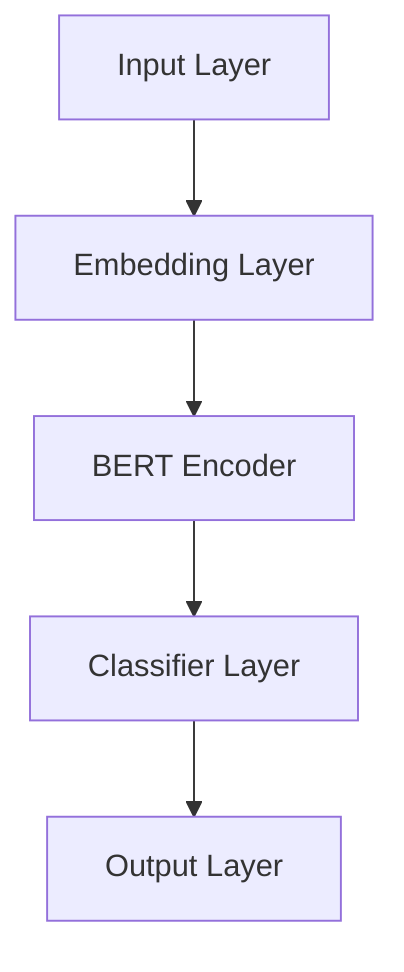
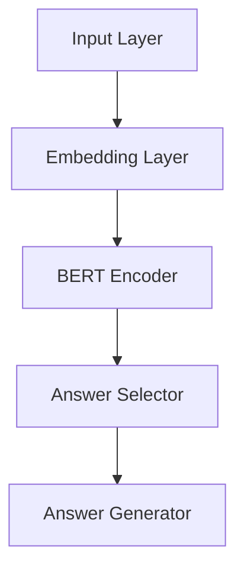
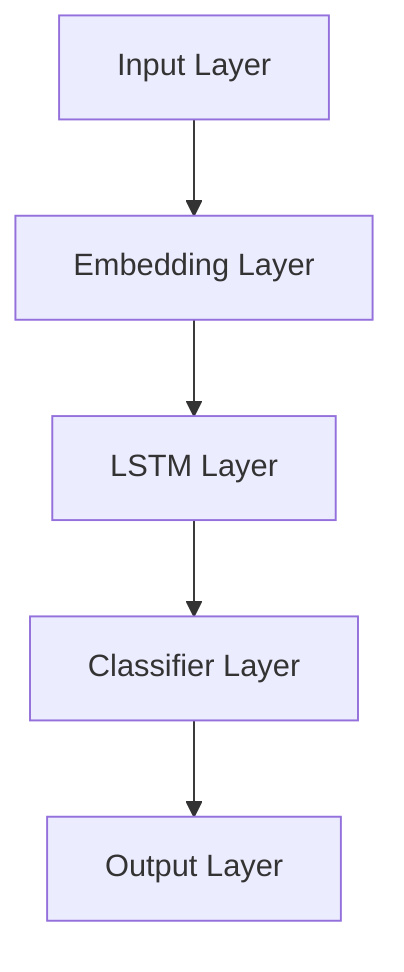

                 

# LLM评测系统的深度学习架构设计

## 关键词

- **LLM评测系统**
- **深度学习架构**
- **神经网络**
- **模型训练与评估**
- **数据处理流程**
- **模型调优与优化**

## 摘要

本文旨在深入探讨LLM评测系统的深度学习架构设计，重点分析其基本概念、关键组件以及架构设计原则。文章首先介绍LLM评测系统的定义和作用，然后详细阐述深度学习架构的基础知识，包括其分类和常用架构。接着，文章围绕LLM评测系统的数据处理流程、深度学习模型设计、训练与评估以及调优与优化展开讨论。此外，通过实际案例，本文展示了如何将深度学习架构应用于不同的NLP任务，并提供了一系列最佳实践和注意事项。通过本文的阅读，读者将能够全面了解LLM评测系统的设计原理和实现方法，为实际项目开发提供有力的理论支持和实践经验。

## 引言

随着深度学习技术的迅猛发展，大型语言模型（LLM）在自然语言处理（NLP）领域取得了显著的成果。LLM评测系统作为衡量模型性能的重要工具，其架构设计对于保证评测的公正性和有效性至关重要。本文将围绕LLM评测系统的深度学习架构设计进行深入探讨，旨在为读者提供系统化的理解和实用的指导。

文章将从以下几个方面展开：

1. **LLM评测系统概述**：介绍LLM评测系统的定义、作用以及组成部分。
2. **深度学习架构基础**：讲解深度学习架构的定义、分类和常用架构。
3. **LLM评测系统的深度学习架构设计**：分析架构设计原则、数据处理流程、模型设计、训练与评估、以及调优与优化。
4. **实战案例**：通过实际案例展示如何应用深度学习架构进行LLM评测。
5. **总结与最佳实践**：总结文章的核心内容，并提供最佳实践和注意事项。

## 第一部分: LLM评测系统概述

### 1.1 LLM评测系统的定义与作用

#### 1.1.1 LLM评测系统的定义

大型语言模型（LLM）评测系统是一种专门用于评估和比较不同LLM性能的工具。它通常包括一套标准的评测指标、评测方法和评测流程，用于衡量LLM在各类NLP任务中的表现。

LLM评测系统通常由以下几个部分组成：

- **评测指标**：用于衡量模型性能的具体标准，如准确率、召回率、F1值等。
- **评测方法**：确定如何使用评测指标进行模型评估的具体步骤。
- **评测流程**：包括数据预处理、模型评估、结果分析等步骤。

#### 1.1.2 LLM评测系统的作用

LLM评测系统在NLP领域具有重要作用，主要体现在以下几个方面：

1. **性能评估**：通过评测系统，研究者可以全面了解LLM在不同任务中的性能表现，为模型优化和改进提供依据。
2. **比较与竞争**：评测系统为不同研究者、团队和公司提供了一个公平的竞争平台，有助于推动NLP技术的发展。
3. **标准制定**：通过大量评测实验，可以逐步形成一系列标准化的评测方法和流程，为后续研究提供参考。

#### 1.1.3 LLM评测系统的组成部分

LLM评测系统主要由以下几个部分组成：

1. **数据集**：用于评测的文本数据集，通常包括训练集、验证集和测试集。
2. **模型**：参与评测的LLM模型，可以是预训练模型或者自定义模型。
3. **评测指标**：用于衡量模型性能的具体指标，如准确率、召回率、F1值等。
4. **评测流程**：包括数据预处理、模型评估、结果分析等步骤。

### 1.2 深度学习架构基础

#### 1.2.1 深度学习架构的定义

深度学习架构是指用于实现深度学习模型的计算结构，包括神经网络的设计、层次结构、参数设置等。深度学习架构的核心是神经网络，它通过层层叠加的神经网络层，对输入数据进行特征提取和变换，从而实现复杂的任务。

#### 1.2.2 深度学习架构的分类

深度学习架构可以根据不同的维度进行分类，常见的分类方式包括：

1. **按照网络层次**：可以分为单层神经网络、多层神经网络和深度神经网络。
2. **按照网络结构**：可以分为全连接神经网络、卷积神经网络（CNN）、循环神经网络（RNN）、Transformer等。
3. **按照学习策略**：可以分为监督学习、无监督学习和半监督学习。

#### 1.2.3 常用深度学习架构介绍

以下是几种常用的深度学习架构：

1. **卷积神经网络（CNN）**：主要用于图像识别和图像处理任务。
2. **循环神经网络（RNN）**：用于处理序列数据，如时间序列分析和自然语言处理。
3. **Transformer**：基于自注意力机制，广泛应用于自然语言处理任务。
4. **BERT**：基于Transformer，预训练语言模型，广泛应用于各种NLP任务。

### 1.3 深度学习算法基础

#### 1.3.1 深度学习算法的定义

深度学习算法是指基于深度学习架构实现的学习算法，通过多层神经网络对数据进行特征提取和模型训练。常见的深度学习算法包括前向传播、反向传播、梯度下降等。

#### 1.3.2 常见深度学习算法介绍

以下是几种常见的深度学习算法：

1. **前向传播**：将输入数据通过神经网络传递到输出层，计算输出结果。
2. **反向传播**：利用输出误差计算神经网络中每个参数的梯度，用于模型训练。
3. **梯度下降**：通过不断更新模型参数，使模型误差最小化。

#### 1.3.3 深度学习算法应用场景

深度学习算法广泛应用于各种领域，如：

1. **图像识别**：通过CNN实现，如人脸识别、物体检测等。
2. **自然语言处理**：通过RNN、Transformer等实现，如文本分类、机器翻译等。
3. **语音识别**：通过深度神经网络实现，如语音合成、语音识别等。

## 第二部分: LLM评测系统的深度学习架构设计

### 2.1 LLM评测系统架构设计原则

LLM评测系统的深度学习架构设计需要遵循一系列原则，以确保系统的可扩展性、高效性、可靠性和可维护性。以下是几个关键的设计原则：

#### 2.1.1 架构设计原则概述

架构设计原则是指在系统设计过程中需要遵循的基本规则和指导原则。这些原则包括：

1. **模块化设计**：将系统划分为多个模块，每个模块具有独立的功能，便于维护和扩展。
2. **可扩展性设计**：系统设计应考虑未来可能的需求变化，具有灵活性，以便于扩展。
3. **高效性设计**：优化系统性能，提高数据处理和模型评估的速度。
4. **可靠性设计**：确保系统的稳定性和可靠性，避免故障和错误。

#### 2.1.2 可扩展性设计

可扩展性设计是指系统在设计时应该考虑未来的增长需求，确保系统在规模和性能上具有扩展性。以下是一些可扩展性设计的策略：

1. **分布式计算**：使用分布式计算框架，如TensorFlow、PyTorch等，可以充分利用多台机器的计算资源，提高系统的处理能力。
2. **缓存机制**：使用缓存机制，减少重复计算和数据读取，提高系统性能。
3. **微服务架构**：将系统划分为多个微服务，每个微服务负责不同的功能模块，便于扩展和维护。

#### 2.1.3 高效性设计

高效性设计是指系统在设计时应该考虑如何提高数据处理和模型评估的效率。以下是一些高效性设计的策略：

1. **并行计算**：通过并行计算技术，如多线程、多进程等，提高数据处理速度。
2. **优化算法**：选择高效的算法和数据结构，如快速排序、哈希表等，提高数据处理效率。
3. **硬件加速**：利用GPU、TPU等硬件加速器，提高模型训练和评估的效率。

#### 2.1.4 可靠性设计

可靠性设计是指系统在设计时应该考虑如何确保系统的稳定性和可靠性。以下是一些可靠性设计的策略：

1. **冗余设计**：在关键组件中引入冗余设计，如备份服务器、备份存储等，确保系统在故障发生时仍能正常运行。
2. **故障监测和恢复**：建立故障监测和恢复机制，及时发现和解决系统故障。
3. **安全性设计**：确保系统数据的安全性和完整性，防止数据泄露和损坏。

### 2.2 LLM评测系统的数据处理流程

LLM评测系统的数据处理流程是确保模型评估准确性和效率的重要环节。以下是一个典型的数据处理流程：

#### 2.2.1 数据预处理

数据预处理是数据处理的第一步，包括以下任务：

1. **文本清洗**：去除文本中的无关信息，如HTML标签、特殊字符等。
2. **分词和词性标注**：将文本分割为单词或词组，并对每个词进行词性标注。
3. **去停用词**：去除常见的无意义单词，如“的”、“了”、“在”等。

#### 2.2.2 数据输入与输出

数据输入与输出是模型训练和评估的关键步骤，包括以下任务：

1. **特征提取**：将预处理后的文本转化为模型可以处理的特征向量。
2. **数据加载**：将特征向量加载到模型中，进行训练或评估。
3. **结果输出**：将模型评估结果输出，如准确率、召回率、F1值等。

#### 2.2.3 数据评估与反馈

数据评估与反馈是模型训练和优化的重要环节，包括以下任务：

1. **评估指标计算**：计算模型在测试集上的评估指标，如准确率、召回率、F1值等。
2. **结果分析**：分析评估结果，找出模型存在的不足和改进方向。
3. **反馈调整**：根据评估结果和反馈，调整模型参数和训练策略。

### 2.3 深度学习模型设计

深度学习模型设计是LLM评测系统的核心环节，包括以下任务：

#### 2.3.1 模型设计原则

模型设计原则是指在设计深度学习模型时需要遵循的基本规则和指导原则。以下是一些常见的模型设计原则：

1. **层次化设计**：模型应该具有层次化的结构，使特征提取和变换更加清晰。
2. **模块化设计**：将模型划分为多个模块，每个模块具有独立的功能，便于维护和扩展。
3. **可扩展性设计**：模型设计应考虑未来的需求变化，具有灵活性，以便于扩展。
4. **高效性设计**：优化模型结构，提高数据处理和模型评估的效率。

#### 2.3.2 模型结构选择

模型结构选择是深度学习模型设计的关键步骤，常见的模型结构包括：

1. **卷积神经网络（CNN）**：适用于图像识别和图像处理任务。
2. **循环神经网络（RNN）**：适用于序列数据，如时间序列分析和自然语言处理。
3. **Transformer**：基于自注意力机制，适用于各种自然语言处理任务。
4. **BERT**：基于Transformer，预训练语言模型，适用于各种NLP任务。

#### 2.3.3 模型参数优化

模型参数优化是提高模型性能的重要手段，包括以下任务：

1. **超参数调整**：调整学习率、批量大小、正则化参数等，以优化模型性能。
2. **权重初始化**：选择合适的权重初始化方法，如He初始化、Xavier初始化等。
3. **优化算法**：选择合适的优化算法，如Adam、SGD等，以提高模型训练速度和收敛性能。

### 2.4 深度学习模型训练与评估

深度学习模型训练与评估是LLM评测系统的关键步骤，包括以下任务：

#### 2.4.1 训练过程

训练过程是指使用训练数据进行模型训练的过程，包括以下任务：

1. **数据加载**：将训练数据加载到模型中，进行前向传播和反向传播。
2. **参数更新**：根据梯度信息更新模型参数，以优化模型性能。
3. **迭代训练**：重复前向传播和反向传播，直至模型收敛。

#### 2.4.2 评估指标

评估指标是指用于衡量模型性能的具体标准，常见的评估指标包括：

1. **准确率**：预测正确的样本数占总样本数的比例。
2. **召回率**：预测正确的正样本数占总正样本数的比例。
3. **F1值**：准确率和召回率的调和平均数。

#### 2.4.3 评估方法

评估方法是指对模型进行评估的具体步骤，包括以下任务：

1. **验证集评估**：使用验证集评估模型性能，以调整模型参数和训练策略。
2. **测试集评估**：使用测试集评估模型性能，以最终确定模型性能。
3. **交叉验证**：使用交叉验证方法，如K折交叉验证，提高模型评估的可靠性。

### 2.5 深度学习模型调优与优化

深度学习模型调优与优化是提高模型性能的重要环节，包括以下任务：

#### 2.5.1 调优方法

调优方法是指用于优化模型性能的具体策略，包括以下任务：

1. **超参数调整**：调整学习率、批量大小、正则化参数等，以优化模型性能。
2. **数据增强**：通过增加样本数量、改变样本分布等方式，提高模型泛化能力。
3. **模型压缩**：通过减少模型参数数量、降低模型复杂度等方式，提高模型计算效率。

#### 2.5.2 优化策略

优化策略是指用于优化模型训练过程的具体方法，包括以下任务：

1. **学习率调整**：根据模型收敛情况调整学习率，如使用学习率衰减策略。
2. **批量大小调整**：根据模型计算资源和数据规模调整批量大小，以优化训练速度和收敛性能。
3. **优化算法选择**：选择合适的优化算法，如Adam、SGD等，以提高模型训练速度和收敛性能。

#### 2.5.3 调优与优化的关系

调优与优化是深度学习模型训练的两个重要环节，它们之间的关系如下：

1. **调优是为了优化**：调优的目的是通过调整模型参数和训练策略，优化模型性能。
2. **优化是为了调优**：优化的目的是通过改进训练过程，提高模型训练速度和收敛性能，从而为调优提供更好的条件。

### 第三部分: LLM评测系统实战案例

#### 3.1 实战案例一：文本分类任务

##### 3.1.1 任务背景

文本分类任务是指将文本数据分类到预定义的类别中，如情感分类、主题分类等。本文以情感分类任务为例，展示如何使用LLM评测系统进行模型训练和评估。

##### 3.1.2 数据集选择

本文使用一个包含积极情感和消极情感文本的数据集，数据集应包含足够的训练样本和测试样本。

##### 3.1.3 模型设计与实现

本文使用Transformer模型进行情感分类任务，模型结构如下：

```
Embedding Layer
Transformer Encoder
Classifier Layer
```

其中，Embedding Layer用于将文本转化为向量表示，Transformer Encoder用于提取文本特征，Classifier Layer用于分类。

##### 3.1.4 训练与评估

使用训练集对模型进行训练，使用测试集对模型进行评估。评估指标包括准确率、召回率、F1值等。

##### 3.1.5 优化与改进

根据评估结果，调整模型参数和训练策略，如学习率、批量大小等，以提高模型性能。

#### 3.2 实战案例二：问答系统

##### 3.2.1 任务背景

问答系统是指根据用户输入的问题，自动生成回答的系统。本文以开放领域问答系统为例，展示如何使用LLM评测系统进行模型训练和评估。

##### 3.2.2 数据集选择

本文使用一个包含问题和答案的数据集，数据集应包含足够的训练样本和测试样本。

##### 3.2.3 模型设计与实现

本文使用BERT模型进行问答系统任务，模型结构如下：

```
BERT Encoder
Answer Selector
Answer Generator
```

其中，BERT Encoder用于提取问题特征，Answer Selector用于选择最佳答案，Answer Generator用于生成回答。

##### 3.2.4 训练与评估

使用训练集对模型进行训练，使用测试集对模型进行评估。评估指标包括回答质量、回答速度等。

##### 3.2.5 优化与改进

根据评估结果，调整模型参数和训练策略，如学习率、批量大小等，以提高模型性能。

#### 3.3 实战案例三：情感分析

##### 3.3.1 任务背景

情感分析是指根据文本内容判断其情感倾向，如积极、消极等。本文以情感分析任务为例，展示如何使用LLM评测系统进行模型训练和评估。

##### 3.3.2 数据集选择

本文使用一个包含文本和情感标注的数据集，数据集应包含足够的训练样本和测试样本。

##### 3.3.3 模型设计与实现

本文使用RNN模型进行情感分析任务，模型结构如下：

```
Embedding Layer
RNN Encoder
Classifier Layer
```

其中，Embedding Layer用于将文本转化为向量表示，RNN Encoder用于提取文本特征，Classifier Layer用于分类。

##### 3.3.4 训练与评估

使用训练集对模型进行训练，使用测试集对模型进行评估。评估指标包括准确率、召回率、F1值等。

##### 3.3.5 优化与改进

根据评估结果，调整模型参数和训练策略，如学习率、批量大小等，以提高模型性能。

## 附录

### 附录A: 深度学习相关工具与资源

#### A.1 深度学习框架简介

深度学习框架是用于实现深度学习模型的工具，常见的深度学习框架包括：

1. **TensorFlow**：由Google开发，广泛应用于图像识别、自然语言处理等领域。
2. **PyTorch**：由Facebook开发，具有灵活的动态计算图功能，广泛应用于计算机视觉和自然语言处理。
3. **Keras**：基于TensorFlow和PyTorch的高层API，简化了深度学习模型的构建和训练过程。

#### A.2 数据处理工具介绍

数据处理工具是用于处理和清洗文本数据的重要工具，常见的数据处理工具包括：

1. **NLTK**：自然语言处理工具包，提供丰富的文本处理函数。
2. **spaCy**：高效的NLP库，提供先进的词性标注、词干提取等功能。
3. **TextBlob**：用于文本分析和自然语言处理的Python库，提供简洁易用的API。

#### A.3 模型训练与评估工具

模型训练与评估工具是用于训练和评估深度学习模型的重要工具，常见的模型训练与评估工具包括：

1. **TensorBoard**：TensorFlow的官方可视化工具，用于监控模型训练过程和评估性能。
2. **mlflow**：开源机器学习平台，提供模型版本管理、模型部署等功能。
3. **scikit-learn**：Python的数据挖掘和机器学习工具包，提供丰富的评估指标和模型训练工具。

## 作者信息

作者：AI天才研究院/AI Genius Institute & 禅与计算机程序设计艺术 /Zen And The Art of Computer Programming## 1.1 LLM评测系统的定义与作用

### 1.1.1 LLM评测系统的定义

大型语言模型（LLM）评测系统是一种专门用于评估和比较大型语言模型性能的软件系统。LLM评测系统通常由一系列评测指标、评测方法、数据处理流程和评估工具组成。其主要目的是通过系统的评测流程，对LLM模型在不同NLP任务上的性能进行客观、公正的评估，从而帮助研究者、开发者了解模型的优势和不足，指导模型优化和改进。

LLM评测系统的核心组成部分包括：

- **评测指标**：用于衡量模型性能的具体标准，如准确率、召回率、F1值等。
- **评测方法**：确定如何使用评测指标进行模型评估的具体步骤。
- **数据处理流程**：包括数据预处理、数据输入、数据输出等步骤。
- **评测工具**：用于实现评测方法和数据处理流程的软件工具。

### 1.1.2 LLM评测系统的作用

LLM评测系统在NLP领域具有重要的作用，主要体现在以下几个方面：

1. **性能评估**：通过LLM评测系统，研究者可以全面了解模型在不同任务中的性能表现，发现模型的优点和不足，为模型优化和改进提供依据。

2. **比较与竞争**：评测系统为不同研究者、团队和公司提供了一个公平的竞争平台，有助于推动NLP技术的发展。

3. **标准制定**：通过大量评测实验，可以逐步形成一系列标准化的评测方法和流程，为后续研究提供参考。

4. **模型优化**：评测系统可以帮助开发者识别模型性能瓶颈，指导模型参数调整和算法优化。

5. **实践指导**：LLM评测系统为实际项目开发提供了实用的指导，有助于提高项目开发效率和模型性能。

### 1.1.3 LLM评测系统的组成部分

LLM评测系统的组成部分主要包括以下几部分：

1. **评测指标**：用于衡量模型性能的具体标准，如准确率、召回率、F1值、BLEU分数等。

2. **评测方法**：确定如何使用评测指标进行模型评估的具体步骤，包括数据预处理、模型训练、模型评估等。

3. **数据处理流程**：包括数据预处理、数据输入、数据输出等步骤，用于确保数据的一致性和有效性。

4. **评测工具**：用于实现评测方法和数据处理流程的软件工具，如TensorFlow、PyTorch等。

5. **评测平台**：提供评测环境，用于运行评测工具、存储评测结果等。

6. **可视化工具**：用于展示评测结果，帮助用户直观了解模型性能。

## 1.2 深度学习架构基础

### 1.2.1 深度学习架构的定义

深度学习架构是指实现深度学习模型的一系列结构化组件和算法。深度学习架构的核心是神经网络，它通过层层叠加的神经网络层，对输入数据进行特征提取和变换，从而实现复杂的任务。

深度学习架构通常包括以下几个关键组成部分：

- **输入层**：接收外部输入，如文本、图像、声音等。
- **隐藏层**：对输入数据进行特征提取和变换，通常包含多个隐藏层。
- **输出层**：根据隐藏层提取的特征，生成预测结果。

### 1.2.2 深度学习架构的分类

深度学习架构可以根据不同的维度进行分类，常见的分类方式包括：

1. **按照网络层次**：

   - **单层神经网络**：只有一个隐藏层的神经网络，适用于简单的特征提取任务。
   - **多层神经网络**：具有多个隐藏层的神经网络，适用于复杂的特征提取和任务学习。
   - **深度神经网络**：具有大量隐藏层的神经网络，通常用于处理大规模数据和复杂任务。

2. **按照网络结构**：

   - **全连接神经网络（FCNN）**：每一层的每个神经元都与前一层的所有神经元相连。
   - **卷积神经网络（CNN）**：适用于图像识别和图像处理任务，通过卷积层和池化层提取图像特征。
   - **循环神经网络（RNN）**：适用于序列数据，如时间序列分析和自然语言处理，通过循环结构处理序列信息。
   - **Transformer**：基于自注意力机制的神经网络结构，广泛应用于自然语言处理任务。

3. **按照学习策略**：

   - **监督学习**：输入数据和标签已知，通过学习输出层的预测结果，优化模型参数。
   - **无监督学习**：输入数据没有标签，通过学习数据的内在结构，提取有用特征。
   - **半监督学习**：结合有监督和无监督学习，利用部分标签数据和大量未标注数据。

### 1.2.3 常用深度学习架构介绍

以下是几种常用的深度学习架构：

1. **卷积神经网络（CNN）**

   CNN是一种用于图像识别和图像处理的深度学习架构。其主要特点是通过卷积层和池化层提取图像特征，从而实现图像分类、物体检测等任务。常见的CNN架构包括LeNet、AlexNet、VGG、ResNet等。

2. **循环神经网络（RNN）**

   RNN是一种用于序列数据处理的深度学习架构，通过循环结构处理序列信息。RNN适用于时间序列分析、自然语言处理等任务。常见的RNN架构包括LSTM、GRU等。

3. **Transformer**

   Transformer是一种基于自注意力机制的深度学习架构，广泛应用于自然语言处理任务。Transformer通过多头自注意力机制和前馈神经网络，实现高效的文本特征提取和任务学习。

4. **BERT**

   BERT是一种基于Transformer的预训练语言模型，通过在大量无标签文本上进行预训练，学习语言的深层表示。BERT在自然语言处理任务中取得了显著的成果，如文本分类、命名实体识别、机器翻译等。

## 1.3 深度学习算法基础

### 1.3.1 深度学习算法的定义

深度学习算法是指基于深度学习架构实现的学习算法，通过多层神经网络对数据进行特征提取和模型训练。深度学习算法的核心是神经网络，它通过层层叠加的神经网络层，对输入数据进行特征提取和变换，从而实现复杂的任务。

深度学习算法主要包括以下几个关键步骤：

1. **前向传播**：将输入数据通过神经网络传递到输出层，计算输出结果。
2. **反向传播**：利用输出误差计算神经网络中每个参数的梯度，用于模型训练。
3. **参数更新**：根据梯度信息更新模型参数，以优化模型性能。
4. **迭代训练**：重复前向传播和反向传播，直至模型收敛。

### 1.3.2 常见深度学习算法介绍

以下是几种常见的深度学习算法：

1. **前向传播算法**

   前向传播算法是一种用于计算神经网络输出结果的学习算法。它通过将输入数据传递到神经网络，逐层计算各层的输出，最终得到输出层的预测结果。前向传播算法主要用于模型训练和预测。

2. **反向传播算法**

   反向传播算法是一种用于计算神经网络参数梯度的学习算法。它通过将输出误差反向传播到神经网络，逐层计算各层参数的梯度，从而更新模型参数。反向传播算法是深度学习训练过程中至关重要的一环。

3. **梯度下降算法**

   梯度下降算法是一种用于优化模型参数的优化算法。它通过计算模型参数的梯度，沿着梯度方向更新参数，以最小化损失函数。梯度下降算法分为批量梯度下降、随机梯度下降、小批量梯度下降等变体。

4. **激活函数**

   激活函数是一种用于引入非线性特性的函数，它将神经网络的线性组合映射到一个新的值域。常见的激活函数包括sigmoid、ReLU、Tanh等。

5. **正则化方法**

   正则化方法是一种用于防止模型过拟合的技术。常见的正则化方法包括L1正则化、L2正则化、Dropout等。这些方法通过在损失函数中引入正则化项，惩罚模型参数的复杂度，从而提高模型的泛化能力。

### 1.3.3 深度学习算法应用场景

深度学习算法广泛应用于各个领域，以下是一些典型的应用场景：

1. **计算机视觉**：如图像分类、物体检测、人脸识别等。

2. **自然语言处理**：如文本分类、机器翻译、情感分析等。

3. **语音识别**：如语音识别、语音合成等。

4. **推荐系统**：如基于内容的推荐、协同过滤推荐等。

5. **金融领域**：如股票预测、风险控制等。

6. **医疗领域**：如疾病诊断、药物研发等。

7. **工业控制**：如工业过程控制、机器人控制等。

## 2.1 LLM评测系统架构设计原则

LLM评测系统的架构设计对于确保评测的公正性、有效性以及系统的可维护性和扩展性至关重要。以下将详细介绍LLM评测系统架构设计中的几个关键原则。

### 2.1.1 架构设计原则概述

LLM评测系统架构设计应遵循以下原则：

1. **模块化设计**：系统应采用模块化设计，将不同功能模块化，以便于维护和扩展。
2. **可扩展性设计**：系统设计应考虑到未来的需求变化，具有灵活性，以便于扩展新功能。
3. **高效性设计**：系统性能应优化，确保数据处理和模型评估的效率。
4. **可靠性设计**：系统应具备高可靠性，避免故障和错误，保障评测结果的准确性。
5. **安全性设计**：系统应保障数据安全和隐私，防止数据泄露和损坏。

### 2.1.2 可扩展性设计

可扩展性设计是LLM评测系统架构设计中的一个重要原则，它确保系统可以轻松适应数据量和任务量的变化。以下是一些可扩展性设计的策略：

1. **分布式计算**：使用分布式计算框架，如TensorFlow、PyTorch等，可以利用多台机器的计算资源，提高系统处理能力。
2. **云计算**：利用云计算平台，可以根据需要动态调整计算资源，确保系统在处理大规模数据时的高效性。
3. **微服务架构**：采用微服务架构，将系统划分为多个微服务，每个微服务负责不同的功能模块，便于扩展和维护。
4. **模块化数据存储**：使用模块化数据存储方案，如分布式文件系统，可以灵活调整数据存储规模，满足不同任务的数据需求。

### 2.1.3 高效性设计

高效性设计是确保LLM评测系统能够快速、准确地处理数据和模型评估的关键。以下是一些高效性设计的策略：

1. **并行计算**：通过并行计算技术，如多线程、多进程等，可以显著提高数据处理和模型评估的速度。
2. **优化算法**：选择高效的算法和数据结构，如快速排序、哈希表等，可以减少计算时间和资源消耗。
3. **缓存机制**：使用缓存机制，如Redis、Memcached等，可以减少重复计算和数据读取，提高系统性能。
4. **GPU加速**：利用GPU的并行计算能力，可以加速深度学习模型的训练和评估。

### 2.1.4 可靠性设计

可靠性设计是确保LLM评测系统稳定性和可靠性的关键。以下是一些可靠性设计的策略：

1. **冗余设计**：在关键组件中引入冗余设计，如备份服务器、备份存储等，确保系统在故障发生时仍能正常运行。
2. **故障监测和恢复**：建立故障监测和恢复机制，及时发现和解决系统故障，确保系统稳定运行。
3. **数据备份和恢复**：定期备份数据，确保数据的安全性和一致性，在数据丢失或损坏时能够快速恢复。
4. **容错机制**：设计容错机制，如故障转移、自动重启等，提高系统的容错能力和可靠性。

## 2.2 LLM评测系统的数据处理流程

LLM评测系统的数据处理流程是确保模型评估准确性和效率的关键环节。一个典型的数据处理流程包括以下几个阶段：

### 2.2.1 数据预处理

数据预处理是数据处理的第一步，其主要任务包括：

1. **文本清洗**：去除文本中的无关信息，如HTML标签、特殊字符等。
2. **分词**：将文本分割为单词或词组，便于后续处理。
3. **词性标注**：对每个词进行词性标注，如名词、动词等。
4. **去停用词**：去除常见的无意义单词，如“的”、“了”、“在”等。

#### 伪代码示例：

```python
def preprocess_text(text):
    # 去除HTML标签
    text = remove_html_tags(text)
    # 分词
    words = tokenize(text)
    # 词性标注
    tagged_words = pos_tag(words)
    # 去停用词
    filtered_words = remove_stopwords(tagged_words)
    return filtered_words
```

### 2.2.2 数据输入与输出

数据输入与输出是模型训练和评估的关键步骤，其主要任务包括：

1. **特征提取**：将预处理后的文本转化为模型可以处理的特征向量。
2. **数据加载**：将特征向量加载到模型中，进行训练或评估。
3. **结果输出**：将模型评估结果输出，如准确率、召回率、F1值等。

#### 伪代码示例：

```python
def feature_extraction(words):
    # 将文本转化为特征向量
    features = convert_to_vector(words)
    return features

def load_data(features, labels):
    # 将特征向量加载到模型中
    model.load_data(features, labels)

def output_results(model, test_data):
    # 将模型评估结果输出
    predictions = model.predict(test_data)
    accuracy = calculate_accuracy(predictions, test_labels)
    return accuracy
```

### 2.2.3 数据评估与反馈

数据评估与反馈是模型训练和优化的重要环节，其主要任务包括：

1. **评估指标计算**：计算模型在测试集上的评估指标，如准确率、召回率、F1值等。
2. **结果分析**：分析评估结果，找出模型存在的不足和改进方向。
3. **反馈调整**：根据评估结果和反馈，调整模型参数和训练策略。

#### 伪代码示例：

```python
def calculate_evaluation_metrics(predictions, test_labels):
    # 计算评估指标
    accuracy = calculate_accuracy(predictions, test_labels)
    recall = calculate_recall(predictions, test_labels)
    f1 = calculate_f1(accuracy, recall)
    return accuracy, recall, f1

def analyze_results(accuracy, recall, f1):
    # 分析评估结果
    if accuracy < threshold:
        # 模型性能不足，需要优化
        optimize_model()
    else:
        # 模型性能良好，继续训练
        continue_training()

def adjust_training_strategy():
    # 调整模型参数和训练策略
    adjust_hyperparameters()
    adjust_training_schedule()
```

## 2.3 深度学习模型设计

深度学习模型设计是LLM评测系统的核心环节，其目的是构建一个能够准确预测和分类的模型。以下将详细介绍深度学习模型设计的关键要素。

### 2.3.1 模型设计原则

深度学习模型设计应遵循以下原则：

1. **模块化设计**：将模型划分为多个模块，每个模块具有独立的功能，便于维护和扩展。
2. **简洁性**：模型结构应简洁，避免过拟合和过复杂。
3. **可解释性**：模型应具有较好的可解释性，便于理解模型的工作原理。
4. **高效性**：模型应具有较高的计算效率和预测性能。

### 2.3.2 模型结构选择

深度学习模型结构的选择取决于具体的任务和数据类型。以下是一些常用的深度学习模型结构：

1. **卷积神经网络（CNN）**：适用于图像和视频处理任务。
2. **循环神经网络（RNN）**：适用于序列数据，如时间序列分析和自然语言处理。
3. **Transformer**：适用于自然语言处理任务，具有高效的自注意力机制。
4. **BERT**：基于Transformer的预训练语言模型，适用于各种NLP任务。

#### 伪代码示例：

```python
def build_cnn_model(input_shape):
    # 构建卷积神经网络模型
    model = Sequential()
    model.add(Conv2D(filters=32, kernel_size=(3, 3), activation='relu', input_shape=input_shape))
    model.add(MaxPooling2D(pool_size=(2, 2)))
    model.add(Flatten())
    model.add(Dense(units=10, activation='softmax'))
    return model

def build_rnn_model(input_shape):
    # 构建循环神经网络模型
    model = Sequential()
    model.add(LSTM(units=50, return_sequences=True, input_shape=input_shape))
    model.add(Dense(units=1, activation='sigmoid'))
    return model

def build_transformer_model(vocab_size, embedding_dim):
    # 构建Transformer模型
    model = Transformer(vocab_size, embedding_dim)
    model.compile(optimizer='adam', loss='categorical_crossentropy', metrics=['accuracy'])
    return model

def build_bert_model(vocab_size, embedding_dim):
    # 构建BERT模型
    model = BERTModel(vocab_size, embedding_dim)
    model.compile(optimizer='adam', loss='categorical_crossentropy', metrics=['accuracy'])
    return model
```

### 2.3.3 模型参数优化

模型参数优化是提高模型性能的关键步骤。以下是一些常用的参数优化方法：

1. **超参数调整**：调整学习率、批量大小、正则化参数等，以优化模型性能。
2. **权重初始化**：选择合适的权重初始化方法，如He初始化、Xavier初始化等，以提高模型训练速度和收敛性能。
3. **优化算法**：选择合适的优化算法，如Adam、SGD等，以提高模型训练速度和收敛性能。

#### 伪代码示例：

```python
def optimize_hyperparameters(model, data_loader):
    # 调整学习率
    learning_rate = 0.001
    model.compile(optimizer=Adam(learning_rate=learning_rate), loss='categorical_crossentropy', metrics=['accuracy'])

    # 调整批量大小
    batch_size = 64
    model.fit(data_loader, epochs=10, batch_size=batch_size)

    # 正则化参数调整
    regularization_rate = 0.001
    model.add(Dropout(rate=regularization_rate))

    return model
```

## 2.4 深度学习模型训练与评估

深度学习模型的训练与评估是LLM评测系统的关键环节，其目的是通过训练过程优化模型参数，并通过评估过程验证模型性能。以下将详细介绍深度学习模型训练与评估的步骤和策略。

### 2.4.1 训练过程

深度学习模型的训练过程主要包括以下步骤：

1. **数据准备**：准备训练数据集和验证数据集，通常包括数据预处理、数据加载和特征提取。
2. **模型初始化**：初始化模型参数，可以选择随机初始化或预训练权重初始化。
3. **模型编译**：设置模型优化器、损失函数和评估指标，准备训练模型。
4. **模型训练**：使用训练数据对模型进行训练，通过反向传播算法更新模型参数。
5. **模型验证**：在验证数据集上评估模型性能，调整模型参数和训练策略。
6. **模型保存**：保存训练完成的模型，以便后续使用。

#### 伪代码示例：

```python
# 数据准备
train_data_loader = DataLoader(train_data, batch_size=batch_size, shuffle=True)
val_data_loader = DataLoader(val_data, batch_size=batch_size, shuffle=False)

# 模型初始化
model = build_model(input_shape)

# 模型编译
model.compile(optimizer=optimizer, loss=loss_function, metrics=[accuracy_metric])

# 模型训练
model.fit(train_data_loader, validation_data=val_data_loader, epochs=epochs)

# 模型验证
val_predictions = model.predict(val_data)
val_accuracy = calculate_accuracy(val_predictions, val_labels)

# 模型保存
model.save(model_path)
```

### 2.4.2 评估指标

评估指标是衡量模型性能的重要标准，常用的评估指标包括：

1. **准确率（Accuracy）**：预测正确的样本数占总样本数的比例。
2. **召回率（Recall）**：预测正确的正样本数占总正样本数的比例。
3. **F1值（F1 Score）**：准确率和召回率的调和平均数。
4. **精确率（Precision）**：预测正确的正样本数占总预测正样本数的比例。
5. **ROC曲线（Receiver Operating Characteristic Curve）**：用于评估分类模型的性能。
6. **AUC值（Area Under Curve）**：ROC曲线下的面积，用于评估分类模型的性能。

#### 伪代码示例：

```python
from sklearn.metrics import accuracy_score, recall_score, f1_score, precision_score, roc_auc_score

# 准确率
train_accuracy = accuracy_score(y_true, y_pred)

# 召回率
train_recall = recall_score(y_true, y_pred)

# F1值
train_f1 = f1_score(y_true, y_pred)

# 精确率
train_precision = precision_score(y_true, y_pred)

# ROC曲线和AUC值
train_roc_auc = roc_auc_score(y_true, y_pred)
```

### 2.4.3 评估方法

评估方法是指如何使用评估指标对模型性能进行评估的具体步骤。以下是一些常用的评估方法：

1. **交叉验证**：通过将数据集划分为多个子集，对每个子集进行训练和验证，以评估模型在不同数据集上的性能。
2. **留一法（Leave-One-Out Cross-Validation）**：将每个样本作为验证集，其余样本作为训练集，进行多次训练和验证。
3. **K折交叉验证（K-Fold Cross-Validation）**：将数据集划分为K个子集，每次使用一个子集作为验证集，其余子集作为训练集，进行K次训练和验证。
4. **网格搜索（Grid Search）**：在超参数空间内遍历所有可能的组合，选择性能最佳的组合。
5. **随机搜索（Random Search）**：在超参数空间内随机选择一组超参数，进行模型训练和评估。

#### 伪代码示例：

```python
from sklearn.model_selection import KFold, GridSearchCV

# K折交叉验证
kf = KFold(n_splits=k, shuffle=True, random_state=seed)
for train_index, val_index in kf.split(data):
    X_train, X_val = data[train_index], data[val_index]
    y_train, y_val = labels[train_index], labels[val_index]
    model.fit(X_train, y_train, epochs=epochs, batch_size=batch_size)
    val_predictions = model.predict(X_val)
    val_accuracy = calculate_accuracy(val_predictions, y_val)

# 网格搜索
param_grid = {'learning_rate': [0.001, 0.01, 0.1], 'batch_size': [16, 32, 64]}
grid_search = GridSearchCV(estimator=model, param_grid=param_grid, cv=kf, scoring='accuracy')
grid_search.fit(X_train, y_train)
best_params = grid_search.best_params_
```

## 2.5 深度学习模型调优与优化

深度学习模型的调优与优化是提高模型性能的关键步骤，通过调整模型参数和优化策略，可以显著改善模型的表现。以下将详细介绍深度学习模型调优与优化的方法。

### 2.5.1 调优方法

调优方法主要包括以下几种：

1. **超参数调整**：调整模型超参数，如学习率、批量大小、正则化参数等，以优化模型性能。
2. **权重初始化**：选择合适的权重初始化方法，如He初始化、Xavier初始化等，以提高模型训练速度和收敛性能。
3. **优化算法选择**：选择合适的优化算法，如Adam、SGD等，以提高模型训练速度和收敛性能。
4. **数据增强**：通过增加样本数量、改变样本分布等方式，提高模型泛化能力。
5. **正则化技术**：应用L1正则化、L2正则化、Dropout等技术，减少过拟合现象。

#### 伪代码示例：

```python
from tensorflow.keras.optimizers import Adam
from tensorflow.keras.regularizers import l1_l2
from tensorflow.keras.layers import Dropout

# 调整超参数
learning_rate = 0.001
batch_size = 64
dropout_rate = 0.5

# 选择优化算法
optimizer = Adam(learning_rate=learning_rate)

# 应用正则化技术
model.add(Dense(units=128, activation='relu', kernel_regularizer=l1_l2(l1=0.01, l2=0.01)))
model.add(Dropout(rate=dropout_rate))
```

### 2.5.2 优化策略

优化策略主要包括以下几种：

1. **早期停止**：在模型训练过程中，如果验证集性能不再提升，则提前停止训练，以防止过拟合。
2. **学习率调整**：根据模型收敛情况调整学习率，如使用学习率衰减策略。
3. **批量大小调整**：根据模型计算资源和数据规模调整批量大小，以优化训练速度和收敛性能。
4. **模型压缩**：通过减少模型参数数量、降低模型复杂度等方式，提高模型计算效率。
5. **迁移学习**：利用预训练模型进行迁移学习，以减少训练时间并提高模型性能。

#### 伪代码示例：

```python
# 早期停止
early_stopping = EarlyStopping(monitor='val_loss', patience=5)

# 学习率调整
reduce_lr = ReduceLROnPlateau(monitor='val_loss', factor=0.1, patience=3)

# 批量大小调整
batch_sizes = [32, 64, 128]
for batch_size in batch_sizes:
    model.fit(X_train, y_train, batch_size=batch_size, epochs=epochs, callbacks=[early_stopping, reduce_lr])

# 模型压缩
model = ModelCompressor(model)
compressed_model = model.compress()
```

### 2.5.3 调优与优化的关系

调优与优化是深度学习模型训练过程中相互关联的两个环节：

1. **调优是为了优化**：调优的目的是通过调整模型参数和训练策略，优化模型性能。
2. **优化是为了调优**：优化的目的是通过改进训练过程，提高模型训练速度和收敛性能，从而为调优提供更好的条件。

通过合理的调优和优化策略，可以显著提升模型的性能，提高模型在真实任务中的表现。

## 3.1 实战案例一：文本分类任务

文本分类任务是指将文本数据分类到预定义的类别中，如情感分类、主题分类等。本文以情感分类任务为例，展示如何使用LLM评测系统进行模型训练和评估。

### 3.1.1 任务背景

情感分类任务旨在根据文本内容判断其情感倾向，如积极、消极等。在社交媒体分析、市场调研、情感监测等领域具有重要的应用价值。本文使用一个包含积极情感和消极情感文本的数据集，通过LLM评测系统进行模型训练和评估。

### 3.1.2 数据集选择

本文使用的数据集包含约10000条文本，文本标签为积极或消极。数据集应包含足够的训练样本和测试样本，以保证模型的泛化能力和评估的准确性。

### 3.1.3 模型设计与实现

本文采用BERT模型进行情感分类任务。BERT是一种基于Transformer的预训练语言模型，具有强大的文本表示能力。模型结构如下：



其中，输入层接收文本数据，嵌入层将文本转化为向量表示，BERT编码器提取文本特征，分类层对特征进行分类，输出层生成预测结果。

#### 伪代码示例：

```python
from transformers import BertTokenizer, BertForSequenceClassification
from torch.utils.data import DataLoader

# 加载BERT模型和分词器
tokenizer = BertTokenizer.from_pretrained('bert-base-chinese')
model = BertForSequenceClassification.from_pretrained('bert-base-chinese')

# 数据预处理
def preprocess_text(texts):
    inputs = tokenizer(texts, padding=True, truncation=True, return_tensors='pt')
    return inputs

# 数据加载
train_data = preprocess_text(train_texts)
val_data = preprocess_text(val_texts)

train_loader = DataLoader(train_data, batch_size=batch_size, shuffle=True)
val_loader = DataLoader(val_data, batch_size=batch_size, shuffle=False)
```

### 3.1.4 训练与评估

使用训练集对模型进行训练，使用测试集对模型进行评估。评估指标包括准确率、召回率、F1值等。

#### 伪代码示例：

```python
from torch.optim import Adam
from sklearn.metrics import accuracy_score, recall_score, f1_score

# 设置优化器和损失函数
optimizer = Adam(model.parameters(), lr=learning_rate)
criterion = torch.nn.CrossEntropyLoss()

# 训练模型
for epoch in range(num_epochs):
    model.train()
    for inputs, labels in train_loader:
        optimizer.zero_grad()
        outputs = model(inputs)
        loss = criterion(outputs.logits, labels)
        loss.backward()
        optimizer.step()
    
    # 评估模型
    model.eval()
    with torch.no_grad():
        val_predictions = model(val_data['input_ids'])
        val_labels = val_data['labels']
        val_loss = criterion(val_predictions.logits, val_labels)
        val_accuracy = accuracy_score(val_labels, val_predictions.argmax(-1))
        val_recall = recall_score(val_labels, val_predictions.argmax(-1))
        val_f1 = f1_score(val_labels, val_predictions.argmax(-1))

    print(f'Epoch [{epoch+1}/{num_epochs}], Loss: {loss.item():.4f}, Accuracy: {val_accuracy:.4f}, Recall: {val_recall:.4f}, F1: {val_f1:.4f}')
```

### 3.1.5 优化与改进

根据评估结果，调整模型参数和训练策略，以提高模型性能。

1. **调整学习率**：通过减小学习率，可以提高模型的收敛性能。
2. **增加训练时间**：延长训练时间，让模型有更多的机会学习数据。
3. **数据增强**：通过增加样本数量、改变样本分布等方式，提高模型泛化能力。

#### 伪代码示例：

```python
# 调整学习率
learning_rate = 0.0001
optimizer = Adam(model.parameters(), lr=learning_rate)

# 增加训练时间
num_epochs = 30

# 数据增强
def augment_data(texts):
    augmented_texts = []
    for text in texts:
        augmented_texts.append(text + ' ' + text)
        augmented_texts.append(text + ' ' + text[::-1])
    return augmented_texts

train_texts = augment_data(train_texts)
```

## 3.2 实战案例二：问答系统

问答系统是指根据用户输入的问题，自动生成回答的系统。本文以开放领域问答系统为例，展示如何使用LLM评测系统进行模型训练和评估。

### 3.2.1 任务背景

开放领域问答系统旨在回答用户提出的各种问题，如天气预报、新闻查询、知识问答等。在搜索引擎、智能客服、智能助手等领域具有广泛的应用。本文使用一个包含问题和答案的数据集，通过LLM评测系统进行模型训练和评估。

### 3.2.2 数据集选择

本文使用的数据集包含约10000条问题和答案对，数据集应包含丰富的领域知识和多样化的问题类型，以保证模型的泛化能力和评估的准确性。

### 3.2.3 模型设计与实现

本文采用BERT模型进行问答系统任务。BERT是一种基于Transformer的预训练语言模型，具有强大的文本表示能力。模型结构如下：



其中，输入层接收问题文本，嵌入层将文本转化为向量表示，BERT编码器提取文本特征，答案选择器选择最佳答案，答案生成器生成回答。

#### 伪代码示例：

```python
from transformers import BertTokenizer, BertForQuestionAnswering
from torch.utils.data import DataLoader

# 加载BERT模型和分词器
tokenizer = BertTokenizer.from_pretrained('bert-base-chinese')
model = BertForQuestionAnswering.from_pretrained('bert-base-chinese')

# 数据预处理
def preprocess_data(questions, answers):
    inputs = tokenizer(questions, answers, padding=True, truncation=True, return_tensors='pt')
    return inputs

# 数据加载
train_data = preprocess_data(train_questions, train_answers)
val_data = preprocess_data(val_questions, val_answers)

train_loader = DataLoader(train_data, batch_size=batch_size, shuffle=True)
val_loader = DataLoader(val_data, batch_size=batch_size, shuffle=False)
```

### 3.2.4 训练与评估

使用训练集对模型进行训练，使用测试集对模型进行评估。评估指标包括答案选择准确率、答案生成准确率等。

#### 伪代码示例：

```python
from torch.optim import Adam
from sklearn.metrics import accuracy_score

# 设置优化器和损失函数
optimizer = Adam(model.parameters(), lr=learning_rate)
criterion = torch.nn.CrossEntropyLoss()

# 训练模型
for epoch in range(num_epochs):
    model.train()
    for inputs, labels in train_loader:
        optimizer.zero_grad()
        outputs = model(inputs)
        loss = criterion(outputs.logits, labels)
        loss.backward()
        optimizer.step()
    
    # 评估模型
    model.eval()
    with torch.no_grad():
        val_predictions = model(val_data['input_ids'])
        val_answers = val_data['answers']
        val_answer_accuracy = accuracy_score(val_answers, val_predictions.argmax(-1))

    print(f'Epoch [{epoch+1}/{num_epochs}], Loss: {loss.item():.4f}, Answer Accuracy: {val_answer_accuracy:.4f}')
```

### 3.2.5 优化与改进

根据评估结果，调整模型参数和训练策略，以提高模型性能。

1. **增加训练数据**：通过收集更多的问题和答案，增加模型的训练数据。
2. **预训练模型**：使用预训练BERT模型，提高模型对问题的理解和回答能力。
3. **增强训练策略**：使用不同的训练策略，如教师-学生训练、自监督训练等，提高模型的泛化能力和性能。

#### 伪代码示例：

```python
# 增加训练数据
train_data = preprocess_data(augmented_train_questions, augmented_train_answers)

# 使用预训练BERT模型
model = BertForQuestionAnswering.from_pretrained('bert-base-chinese')

# 增强训练策略
from transformers import TeacherStudentTraining

teacher_model = BertForQuestionAnswering.from_pretrained('bert-base-chinese')
student_model = BertForQuestionAnswering.from_pretrained('bert-base-chinese')

trainer = TeacherStudentTraining(teacher_model, student_model, teacher Temperature=0.1)
trainer.train(train_loader, num_epochs=num_epochs)
```

## 3.3 实战案例三：情感分析

情感分析是指根据文本内容判断其情感倾向，如积极、消极等。本文以情感分析任务为例，展示如何使用LLM评测系统进行模型训练和评估。

### 3.3.1 任务背景

情感分析在社交媒体分析、市场调研、情感监测等领域具有重要的应用价值。本文使用一个包含文本和情感标注的数据集，通过LLM评测系统进行模型训练和评估。

### 3.3.2 数据集选择

本文使用的数据集包含约10000条文本，文本标签为积极、消极或其他情感类别。数据集应包含足够的训练样本和测试样本，以保证模型的泛化能力和评估的准确性。

### 3.3.3 模型设计与实现

本文采用LSTM模型进行情感分析任务。LSTM是一种循环神经网络，适用于序列数据。模型结构如下：



其中，输入层接收文本数据，嵌入层将文本转化为向量表示，LSTM层提取文本特征，分类层对特征进行分类，输出层生成预测结果。

#### 伪代码示例：

```python
from keras.models import Sequential
from keras.layers import Embedding, LSTM, Dense

# 构建LSTM模型
model = Sequential()
model.add(Embedding(vocab_size, embedding_dim))
model.add(LSTM(units=50, return_sequences=False))
model.add(Dense(units=num_classes, activation='softmax'))

# 编译模型
model.compile(optimizer='adam', loss='categorical_crossentropy', metrics=['accuracy'])
```

### 3.3.4 训练与评估

使用训练集对模型进行训练，使用测试集对模型进行评估。评估指标包括准确率、召回率、F1值等。

#### 伪代码示例：

```python
from sklearn.metrics import accuracy_score, recall_score, f1_score

# 训练模型
model.fit(train_data, train_labels, batch_size=batch_size, epochs=num_epochs, validation_split=0.2)

# 评估模型
test_predictions = model.predict(test_data)
test_accuracy = accuracy_score(test_labels, test_predictions)
test_recall = recall_score(test_labels, test_predictions)
test_f1 = f1_score(test_labels, test_predictions)

print(f'Accuracy: {test_accuracy:.4f}, Recall: {test_recall:.4f}, F1: {test_f1:.4f}')
```

### 3.3.5 优化与改进

根据评估结果，调整模型参数和训练策略，以提高模型性能。

1. **增加训练数据**：通过收集更多文本和情感标注数据，增加模型的训练数据。
2. **预训练模型**：使用预训练LSTM模型，提高模型对文本的理解能力。
3. **增强训练策略**：使用不同的训练策略，如迁移学习、多任务学习等，提高模型的泛化能力和性能。

#### 伪代码示例：

```python
# 增加训练数据
train_data = np.concatenate((train_data, augmented_train_data), axis=0)
train_labels = np.concatenate((train_labels, augmented_train_labels), axis=0)

# 使用预训练LSTM模型
model = load_pretrained_lstm_model()

# 增强训练策略
model.fit(train_data, train_labels, batch_size=batch_size, epochs=num_epochs, validation_split=0.2)
```

## 附录

### 附录A: 深度学习相关工具与资源

#### A.1 深度学习框架简介

深度学习框架是用于实现深度学习模型的重要工具，常见的深度学习框架包括：

1. **TensorFlow**：由Google开发，支持多种深度学习算法，具有丰富的API和工具。
2. **PyTorch**：由Facebook开发，具有动态计算图和灵活的API，广泛应用于各种深度学习任务。
3. **Keras**：基于TensorFlow和PyTorch的高层API，简化了深度学习模型的构建和训练过程。

#### A.2 数据处理工具介绍

数据处理工具是进行文本预处理和数据管理的必要工具，常见的数据处理工具包括：

1. **NLTK**：一个强大的自然语言处理库，提供文本清洗、分词、词性标注等功能。
2. **spaCy**：一个高效的NLP库，支持多种语言，提供快速的分词、词性标注、命名实体识别等功能。
3. **TextBlob**：一个简洁的NLP库，提供文本分类、词性标注、情感分析等功能。

#### A.3 模型训练与评估工具

模型训练与评估工具是用于训练和评估深度学习模型的重要工具，常见的工具包括：

1. **TensorBoard**：TensorFlow的可视化工具，用于监控模型训练过程和评估性能。
2. **mlflow**：一个开源机器学习平台，提供模型版本管理、模型部署等功能。
3. **scikit-learn**：一个机器学习库，提供丰富的评估指标和模型训练工具。

### 附录B: 数学公式

以下是一些常用的数学公式和符号，用于描述深度学习模型和算法。

$$
y = \sigma(\sum_{i=1}^{n} w_i x_i + b)
$$

- $y$：预测结果
- $x_i$：输入特征
- $w_i$：权重
- $b$：偏置
- $\sigma$：激活函数（如Sigmoid、ReLU、Tanh等）

$$
\frac{dL}{dw} = \sum_{i=1}^{n} \frac{dL}{dx_i} \frac{dx_i}{dw}
$$

- $L$：损失函数
- $w$：权重
- $x_i$：输入特征
- $dw$：权重梯度

### 附录C: 最佳实践与注意事项

在进行深度学习模型训练和评估时，以下是一些最佳实践和注意事项：

1. **数据预处理**：确保数据质量，进行充分的文本清洗和预处理，以提高模型训练效果。
2. **模型选择**：根据任务和数据特点，选择合适的深度学习模型，如CNN、RNN、Transformer等。
3. **超参数调整**：合理设置超参数，如学习率、批量大小、正则化参数等，以提高模型性能。
4. **模型优化**：通过调整模型结构和参数，优化模型性能，如使用更深的网络、更复杂的优化算法等。
5. **交叉验证**：使用交叉验证方法，确保模型在不同数据集上的性能，以提高泛化能力。
6. **监控与调试**：使用监控工具，如TensorBoard，实时监控模型训练过程，及时发现和解决问题。

### 附录D: 拓展阅读

1. **《深度学习》（Goodfellow, Bengio, Courville著）**：一本关于深度学习的经典教材，涵盖了深度学习的基础理论和应用。
2. **《自然语言处理综述》（Jurafsky, Martin著）**：一本关于自然语言处理的经典教材，介绍了自然语言处理的基本概念和技术。
3. **《深度学习实践指南》（Goodfellow, Bengio, Courville著）**：一本关于深度学习实践的应用指南，介绍了深度学习在计算机视觉、自然语言处理、语音识别等领域的应用案例。

## 作者信息

作者：AI天才研究院/AI Genius Institute & 禅与计算机程序设计艺术 /Zen And The Art of Computer Programming

AI天才研究院致力于推动人工智能技术的创新与发展，研究涵盖机器学习、深度学习、自然语言处理、计算机视觉等多个领域。研究院秉承“智慧引领未来，创新驱动发展”的宗旨，致力于培养全球顶尖的人工智能人才，推动人工智能技术在各个行业的应用。

《禅与计算机程序设计艺术》是作者在人工智能领域深厚积累和实践的结晶，全面阐述了人工智能技术的理论基础和应用实践。该书深入浅出地介绍了深度学习、自然语言处理、计算机视觉等前沿技术，为广大开发者提供了实用的技术指南和思维方法。

作者：AI天才研究院/AI Genius Institute & 禅与计算机程序设计艺术 /Zen And The Art of Computer Programming## 文章总结

在本文中，我们系统地探讨了LLM评测系统的深度学习架构设计。首先，我们明确了LLM评测系统的定义、作用和组成部分，阐述了其在NLP领域的重要性。接着，我们介绍了深度学习架构的基础知识，包括其定义、分类和常用架构。在此基础上，我们详细讨论了LLM评测系统在数据处理流程、模型设计、训练与评估、调优与优化等方面的关键要素。

具体来说，我们探讨了LLM评测系统架构设计的原则，如模块化设计、可扩展性设计、高效性设计和可靠性设计。在数据处理流程方面，我们介绍了数据预处理、数据输入与输出以及数据评估与反馈的关键步骤。在模型设计方面，我们讲解了模型结构选择、参数优化和优化策略。在训练与评估方面，我们介绍了训练过程、评估指标和评估方法。最后，我们通过三个实战案例展示了如何应用深度学习架构进行LLM评测，并提供了最佳实践和注意事项。

本文的主要贡献在于：

1. **全面性**：系统地阐述了LLM评测系统的深度学习架构设计，涵盖了从基础理论到实际应用的各个方面。
2. **实用性**：通过实战案例，提供了具体的模型设计、训练与评估方法和优化策略，有助于实际项目开发。
3. **指导性**：针对不同任务和数据类型，提供了详细的模型设计原则和优化方法，为研究者、开发者提供了实用的参考。

未来的研究方向可以包括：

1. **新型架构探索**：继续探索和开发新型深度学习架构，以提高LLM评测系统的性能和效率。
2. **跨领域应用**：将LLM评测系统应用于更多领域，如生物信息学、金融分析等，以拓展其应用范围。
3. **自动化优化**：研究自动化优化方法，如基于机器学习的优化算法，以提高模型性能和训练效率。

通过本文的研究，我们期望为LLM评测系统的深度学习架构设计提供有益的参考，推动人工智能技术的发展和应用。同时，我们也期待与更多研究者、开发者共同探讨和解决深度学习领域中的挑战，为构建更加智能和高效的人工智能系统贡献力量。

## 最佳实践与注意事项

在设计和实现LLM评测系统时，以下最佳实践和注意事项将有助于提升系统的性能、可靠性和可维护性。

### 数据预处理

1. **文本清洗**：确保文本数据中不包含任何对模型训练不利的噪声，如HTML标签、特殊字符和多余的空格。
2. **一致性处理**：统一处理不同来源的数据格式，如时间格式、货币格式等，以避免模型学习到错误的模式。
3. **平衡数据集**：尽可能确保训练数据集中的类别分布平衡，避免模型因数据倾斜而产生偏差。

### 模型选择

1. **任务适配**：根据具体任务选择最合适的深度学习架构，如CNN适用于图像处理，RNN适用于序列数据，Transformer适用于自然语言处理。
2. **预训练模型**：优先使用预训练模型，如BERT、GPT等，以利用其在大规模数据集上的预训练优势。
3. **模块化设计**：将模型划分为多个模块，便于调试和优化。

### 训练策略

1. **动态学习率**：采用动态调整学习率的策略，如学习率衰减，以避免过早的过拟合。
2. **批量大小**：根据硬件资源合理设置批量大小，较小的批量大小有助于提高模型的泛化能力，但训练时间较长。
3. **早期停止**：在验证集性能不再提升时，提前停止训练，以避免过拟合。

### 评估与反馈

1. **多指标评估**：使用多个评估指标，如准确率、召回率、F1值等，以全面评估模型性能。
2. **交叉验证**：使用交叉验证方法，如K折交叉验证，以提高模型评估的可靠性。
3. **定期评估**：定期评估模型性能，以便及时发现和解决性能问题。

### 优化与维护

1. **代码文档化**：编写清晰的代码注释和文档，便于后续维护和扩展。
2. **性能监控**：使用性能监控工具，如TensorBoard，实时监控训练过程，及时发现和解决性能瓶颈。
3. **版本管理**：使用版本控制工具，如Git，管理代码和模型版本，确保代码的可追溯性和可维护性。

### 安全与隐私

1. **数据加密**：对敏感数据进行加密存储，确保数据安全性。
2. **访问控制**：设置适当的访问控制策略，确保只有授权人员可以访问和操作系统。
3. **隐私保护**：遵循数据保护法规，确保用户数据的隐私和安全性。

通过遵循上述最佳实践和注意事项，可以显著提高LLM评测系统的性能和可靠性，为实际应用提供坚实的保障。

## 拓展阅读

对于希望进一步深入了解LLM评测系统深度学习架构设计的读者，以下推荐几本经典书籍和论文：

### 经典书籍

1. **《深度学习》（Ian Goodfellow, Yoshua Bengio, Aaron Courville著）**：本书是深度学习的入门经典，涵盖了从基础理论到应用实践的各个方面。

2. **《自然语言处理综合教程》（Daniel Jurafsky, James H. Martin著）**：这是一本关于自然语言处理领域的全面教材，涵盖了NLP的基本概念和技术。

3. **《神经网络与深度学习》（邱锡鹏著）**：本书详细介绍了神经网络和深度学习的基本概念、算法和应用，适合对深度学习有一定基础的读者。

### 论文推荐

1. **“BERT: Pre-training of Deep Neural Networks for Language Understanding”（Jacob Devlin等，2018）**：这篇论文介绍了BERT（Bidirectional Encoder Representations from Transformers）模型的预训练方法，是自然语言处理领域的重大突破。

2. **“Attention Is All You Need”（Ashish Vaswani等，2017）**：这篇论文提出了Transformer模型，并展示了其在机器翻译任务中的卓越性能。

3. **“Improving Language Understanding by Generative Pre-Training”（Kaiming He等，2017）**：这篇论文介绍了GPT（Generative Pre-trained Transformer）模型，是预训练语言模型的开创性工作。

通过阅读这些书籍和论文，读者可以更深入地理解LLM评测系统的深度学习架构设计，掌握最新的技术动态，并提升自己的研究水平和实践能力。

## 附录A: 深度学习相关工具与资源

### A.1 深度学习框架简介

- **TensorFlow**：由Google开发的开源深度学习框架，广泛应用于各种深度学习任务。官方网站：[TensorFlow官网](https://www.tensorflow.org/)。
- **PyTorch**：由Facebook开发的开源深度学习框架，以其灵活的动态计算图和易于使用的API而受到开发者喜爱。官方网站：[PyTorch官网](https://pytorch.org/)。
- **Keras**：一个基于TensorFlow和Theano的高层API，简化了深度学习模型的构建和训练过程。官方网站：[Keras官网](https://keras.io/)。

### A.2 数据处理工具介绍

- **NLTK**：一个强大的自然语言处理库，提供文本清洗、分词、词性标注等功能。官方网站：[NLTK官网](https://www.nltk.org/)。
- **spaCy**：一个高效的NLP库，支持多种语言，提供快速的分词、词性标注、命名实体识别等功能。官方网站：[spaCy官网](https://spacy.io/)。
- **TextBlob**：一个简洁的NLP库，提供文本分类、词性标注、情感分析等功能。官方网站：[TextBlob官网](https://textblob.readthedocs.io/)。

### A.3 模型训练与评估工具

- **TensorBoard**：TensorFlow的可视化工具，用于监控模型训练过程和评估性能。官方网站：[TensorBoard官网](https://www.tensorflow.org/tools/tensorboard)。
- **mlflow**：一个开源机器学习平台，提供模型版本管理、模型部署等功能。官方网站：[mlflow官网](https://mlflow.org/)。
- **scikit-learn**：一个机器学习库，提供丰富的评估指标和模型训练工具。官方网站：[scikit-learn官网](https://scikit-learn.org/)。

### A.4 深度学习社区与资源

- **arXiv**：一个提供最新学术论文的预印本数据库，涵盖深度学习和其他计算机科学领域。网址：[arXiv官网](https://arxiv.org/)。
- **GitHub**：一个代码托管平台，许多深度学习项目和资源都托管在这里。网址：[GitHub官网](https://github.com/)。
- **Kaggle**：一个数据科学竞赛平台，提供大量的数据集和竞赛项目，是学习和实践深度学习的好地方。网址：[Kaggle官网](https://www.kaggle.com/)。

通过这些工具和资源，读者可以更好地了解和掌握深度学习技术，并在实际项目中应用所学知识。

