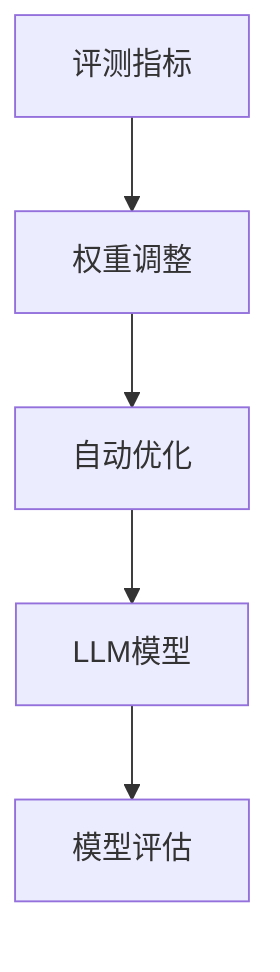

                 


为了撰写一篇符合要求的文章，我们将按照以下步骤进行：

### 步骤1：文章标题与关键词

- **文章标题**：《LLM驱动的评测指标优化：自动权重调整》
- **关键词**：自然语言处理，机器学习，模型评估，权重调整，自动优化

### 步骤2：摘要撰写

- **摘要内容**：本文介绍了如何利用大型语言模型（LLM）进行评测指标优化，特别是自动权重调整的方法。文章首先概述了LLM的基本概念和工作原理，然后深入探讨了评测指标优化的背景和重要性。接着，文章详细阐述了自动权重调整的核心算法原理，包括基于深度学习的优化方法和进化算法。最后，通过实际项目实战展示了如何将这些方法应用到文本分类、图像识别和推荐系统等领域。

### 步骤3：背景介绍

- **LLM基本概念**：介绍LLM的定义、发展历程及其在自然语言处理中的应用。
- **评测指标优化**：解释评测指标的重要性，以及为什么需要优化评测指标。

### 步骤4：核心概念与联系

- **核心概念原理架构图**：使用Mermaid语言绘制一个包含核心概念和联系的关系图。



### 步骤5：核心算法原理讲解

- **自动权重调整算法**：使用伪代码和LaTeX公式详细解释几种常用的自动权重调整算法，如基于梯度下降的方法和进化算法。

```pseudo
// 基于梯度下降的权重调整算法伪代码
while (not converged) {
  gradients <- compute_gradients(loss_function, weights)
  weights <- weights - learning_rate * gradients
}
```

```latex
$$
\frac{\partial J}{\partial w} = \sum_{i=1}^{n} \frac{\partial J}{\partial x_i} \cdot \frac{\partial x_i}{\partial w}
$$
```

### 步骤6：项目实战

- **文本分类任务实战**：详细描述开发环境搭建、源代码实现、代码解读和实际案例分析。
- **图像识别任务实战**：展示如何将自动权重调整应用到图像识别中，包括数据处理、模型训练和性能评估。
- **推荐系统任务实战**：讨论如何优化推荐系统的评测指标，通过自动权重调整提高推荐质量。

### 步骤7：最佳实践、小结、注意事项

- **最佳实践**：总结在自动权重调整中的最佳实践建议。
- **小结**：回顾文章的主要观点和结论。
- **注意事项**：强调在应用自动权重调整时需要注意的事项。

### 步骤8：拓展阅读

- **参考文献**：提供相关的参考文献和进一步阅读材料。

### 步骤9：撰写文章

- **正文撰写**：按照步骤3至步骤7的内容，逐段撰写文章正文，确保内容完整、结构清晰。

### 步骤10：审校与修改

- **审校**：检查文章中的语法错误、逻辑错误和格式错误。
- **修改**：根据审校结果进行文章的修改和完善。

### 步骤11：提交文章

- **提交**：将修改后的文章按照markdown格式输出，并附带作者信息。

遵循上述步骤，我们将撰写一篇符合要求的文章。以下是文章的初步框架：

```
# 《LLM驱动的评测指标优化：自动权重调整》

> 关键词：自然语言处理，机器学习，模型评估，权重调整，自动优化

> 摘要：本文介绍了如何利用大型语言模型（LLM）进行评测指标优化，特别是自动权重调整的方法。文章首先概述了LLM的基本概念和工作原理，然后深入探讨了评测指标优化的背景和重要性。接着，文章详细阐述了自动权重调整的核心算法原理，包括基于深度学习的优化方法和进化算法。最后，通过实际项目实战展示了如何将这些方法应用到文本分类、图像识别和推荐系统等领域。

## 第一部分: LLM基础与评测指标优化概述

### 第1章: LLM概述

#### 1.1 LLM的基本概念

#### 1.2 LLM的架构与工作原理

#### 1.3 LLM的应用领域

### 第2章: 评测指标优化概述

#### 2.1 评测指标的基本概念

#### 2.2 评测指标优化的重要性

#### 2.3 常见的评测指标优化方法

## 第二部分: LLM驱动的评测指标优化原理

### 第3章: LLM驱动评测指标优化的基础理论

#### 3.1 LLM模型的可解释性

#### 3.2 LLM模型与权重调整的关系

#### 3.3 自动权重调整的基本原理

### 第4章: 自动权重调整算法详解

#### 4.1 基于梯度下降的权重调整算法

#### 4.2 进化算法

#### 4.3 遗传算法

### 第5章: LLM驱动的评测指标优化案例

#### 5.1 文本分类任务中的自动权重调整

#### 5.2 图像识别任务中的自动权重调整

#### 5.3 推荐系统任务中的自动权重调整

## 第三部分: LLM驱动的评测指标优化实践

### 第6章: LLM驱动的评测指标优化工具与环境搭建

#### 6.1 工具选择与安装

#### 6.2 环境搭建

#### 6.3 实践流程

### 第7章: LLM驱动的评测指标优化项目实战

#### 7.1 文本分类任务实战

#### 7.2 图像识别任务实战

#### 7.3 推荐系统任务实战

## 附录

### 附录A: 相关资源与进一步阅读

### 附录B: 代码示例与解释

## 参考文献

作者：AI天才研究院/AI Genius Institute & 禅与计算机程序设计艺术 /Zen And The Art of Computer Programming
```

接下来，我们将根据这个框架逐步完善文章的内容。首先，我们将详细撰写第一部分和第二部分的内容，然后继续完成第三部分的实战案例和附录等内容。在撰写过程中，将确保文章的逻辑清晰、内容详实，并符合字数要求。最后，我们将进行审校和修改，确保文章质量。

