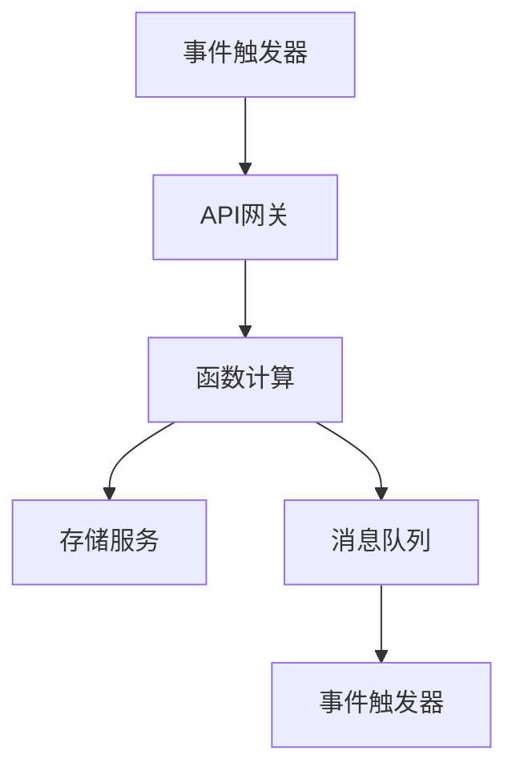

                 


### 文章标题

# Serverless架构：简化AI应用开发与运维

### 文章关键词

- Serverless架构
- AI应用开发
- 运维简化
- 自动化
- 安全性

### 文章摘要

本文将深入探讨Serverless架构在AI应用开发与运维中的重要性。我们将从背景介绍开始，逐步讲解Serverless架构的基本概念、优势以及与传统架构的比较。接着，我们将介绍如何在Serverless架构下开发AI应用，包括核心算法原理、数学模型以及项目实战。此外，我们还将探讨Serverless架构下的AI应用运维、安全性问题以及未来展望。通过本文，读者将能够全面了解Serverless架构在AI领域的广泛应用及其潜力。

## 第1章：介绍与背景

### 1.1 书籍介绍

《Serverless架构：简化AI应用开发与运维》旨在为读者提供一份全面而深入的技术指南，帮助他们在AI领域运用Serverless架构，实现应用开发的简化与运维的自动化。随着云计算和人工智能技术的不断发展，Serverless架构作为一种新兴的软件开发范式，正逐渐改变着传统应用开发和运维的模式。本书的目标是帮助读者理解Serverless架构的核心概念、应用场景以及在实际开发与运维过程中的最佳实践。

### 1.2 Serverless架构概述

Serverless架构，又称无服务器架构，是一种基于云计算的软件开发模式，允许开发人员编写和部署应用程序而无需管理底层基础设施。在这个模型中，开发者只需关注应用逻辑，而不需要担心服务器配置、资源分配和运维工作。Serverless架构通过事件驱动的模型运行应用程序，当事件发生时，例如用户请求或数据更新，Serverless平台会自动分配和启动必要的计算资源来处理这些事件。

### 1.3 AI应用开发与运维的挑战

随着人工智能技术的快速发展，AI应用在各个领域得到了广泛应用。然而，AI应用开发与运维过程中也面临许多挑战：

- **计算资源需求高**：AI算法通常需要大量的计算资源，特别是在训练阶段。
- **迭代周期长**：从算法开发到部署，AI应用的开发周期通常较长。
- **运维复杂性**：传统的服务器架构需要频繁的硬件维护、软件更新和性能优化。
- **弹性需求强**：AI应用需要根据数据量和用户需求动态调整资源。

### 1.4 服务器无关架构的优势

Serverless架构为AI应用开发与运维带来了诸多优势：

- **资源弹性**：Serverless架构可以根据事件自动调整计算资源，满足弹性需求。
- **开发效率**：无需关心底层基础设施，开发者可以专注于应用逻辑。
- **成本节约**：按需付费模型减少了不必要的资源浪费。
- **运维简化**：自动化的运维工作减轻了运维团队的压力。

### 1.5 小结

本章介绍了本书的背景和主要目标，简要概述了Serverless架构的基本概念和优势，并提出了AI应用开发与运维过程中面临的主要挑战。在接下来的章节中，我们将深入探讨Serverless架构在AI应用开发与运维中的具体应用和实践。

## 第2章：服务器无关架构基础

### 2.1 服务器无关架构的定义

服务器无关架构（Serverless Architecture）是一种基于云计算的软件开发模型，其中开发者无需直接管理服务器或计算资源。相反，这些资源由第三方云服务提供商（如AWS、Azure、Google Cloud等）提供和管理。在Serverless架构中，应用程序的运行环境是由事件驱动的，开发人员只需编写和部署应用代码，无需关心底层基础设施的配置和维护。

### 2.2 服务器无关架构与传统架构的比较

传统架构通常涉及自行管理服务器、网络和其他基础设施资源。这种模式要求开发人员具备丰富的系统管理和运维技能，并且需要投入大量时间和资源进行服务器维护、软件更新和性能优化。相比之下，Serverless架构通过抽象化底层基础设施，简化了开发流程，使得开发人员能够更专注于应用逻辑的编写。

| 特点 | 传统架构 | Serverless架构 |
| --- | --- | --- |
| 基础设施管理 | 开发人员自行管理 | 云服务提供商管理 |
| 资源弹性 | 依赖于硬件扩展 | 自动扩展计算资源 |
| 成本模型 | 前期投入大，后期维护成本高 | 按需付费，灵活调整 |
| 开发效率 | 低 | 高 |

### 2.3 服务器无关架构的核心组件

Serverless架构通常由以下几个核心组件组成：

- **事件触发器**：触发应用程序执行的事件源，可以是用户请求、定时任务或外部API调用。
- **函数计算**：执行具体业务逻辑的代码片段，通常以函数的形式存在。
- **存储服务**：用于存储数据和状态，如数据库、文件存储等。
- **API网关**：提供RESTful API接口，便于与其他系统和应用程序交互。
- **消息队列**：用于异步消息传递，实现分布式系统的解耦。

### 2.4 服务器无关架构的技术趋势

Serverless架构正在快速发展，并呈现出以下技术趋势：

- **多云支持**：越来越多的云服务提供商开始支持跨云的Serverless服务，提高了灵活性和可扩展性。
- **无服务器数据库**：一些云服务提供商开始提供无服务器的数据库服务，简化了数据存储和访问。
- **容器化集成**：Serverless架构与容器技术的结合，使得应用开发和部署更加灵活和高效。
- **自动化运维**：自动化工具和平台的不断进化，使得Serverless架构的运维变得更加简单和高效。

### 2.5 Mermaid 流程图

以下是一个Mermaid流程图，展示了Serverless架构的核心组件及其交互：



### 2.6 小结

本章介绍了服务器无关架构的基本概念、与传统架构的比较、核心组件以及当前的技术趋势。通过理解这些内容，读者将能够更好地把握Serverless架构的本质，并为后续章节中的应用开发与运维打下基础。

### 2.7 核心算法原理讲解

在Serverless架构下，AI应用的算法实现通常涉及到以下几个方面：

#### 2.7.1 算法概述

AI算法可以分为两类：监督学习、无监督学习和强化学习。监督学习是最常用的算法类型，它通过已标记的数据训练模型，从而预测未知数据的标签。无监督学习则用于发现数据中的模式，例如聚类和降维。强化学习通过试错和反馈机制来学习如何在特定环境中做出最佳决策。

#### 2.7.2 常见算法

以下是一些常见的AI算法及其基本原理：

- **线性回归**：通过最小化误差平方和，预测连续值。
  ```latex
  y = wx + b
  ```
  
- **逻辑回归**：用于分类问题，通过计算概率来预测类别。
  ```latex
  P(y=1) = \frac{1}{1 + e^{-(wx + b)}}
  ```

- **决策树**：通过划分特征空间，生成分类规则。
  ```mermaid
  graph TD
      A[根节点]
      A --> B[特征1 < 0.5]
      B --> C[分类1]
      B --> D[分类2]
      A --> E[特征1 >= 0.5]
      E --> F[特征2 < 0.5]
      F --> G[分类3]
      F --> H[分类4]
      E --> I[特征2 >= 0.5]
      I --> J[分类4]
  ```

- **神经网络**：通过多层非线性变换，实现复杂函数的逼近。
  ```latex
  z = \sigma(Wx + b)
  ```
  其中，$\sigma$是激活函数。

#### 2.7.3 模型训练与优化

模型训练是AI应用开发的关键步骤，其目标是通过调整模型参数（权重和偏置）来最小化预测误差。常见的训练方法包括：

- **梯度下降**：通过迭代更新参数，最小化损失函数。
  ```latex
  \theta = \theta - \alpha \cdot \nabla_{\theta} J(\theta)
  ```
  其中，$\alpha$是学习率。

- **随机梯度下降**（SGD）：在每次迭代中使用随机子集进行参数更新，加快收敛速度。

- **批量梯度下降**：在每次迭代中使用全部数据更新参数，计算更准确的梯度，但计算量较大。

#### 2.7.4 伪代码示例

以下是一个简单的线性回归算法的伪代码示例：

```python
# 初始化模型参数
w = 0
b = 0

# 设定学习率
alpha = 0.01

# 设定迭代次数
num_iterations = 1000

# 训练模型
for i in range(num_iterations):
    # 计算预测值
    y_pred = w * x + b
    
    # 计算损失函数
    loss = (y - y_pred) ** 2
    
    # 计算梯度
    dw = 2 * (y - y_pred) * x
    db = 2 * (y - y_pred)
    
    # 更新模型参数
    w = w - alpha * dw
    b = b - alpha * db

# 输出模型参数
print("w:", w, "b:", b)
```

### 2.8 小结

本章详细介绍了服务器无关架构的核心算法原理，包括常见算法的基本原理、模型训练方法以及伪代码示例。这些知识将为后续章节中AI应用的实现提供理论基础。

## 第3章：AI应用开发

### 3.1 AI应用开发概述

AI应用开发是一个复杂的过程，包括算法设计、模型训练、部署和优化等多个阶段。在Serverless架构下，AI应用的开发过程因其特有的优势而变得更加简洁和高效。本章将详细介绍AI应用开发的各个阶段，包括核心算法选择、数据准备、模型训练与优化以及模型部署。

### 3.2 AI算法与模型介绍

AI算法和模型是AI应用开发的核心。以下是一些常见算法和模型的介绍：

- **线性回归**：用于预测连续值，简单且易于实现。
- **逻辑回归**：适用于二分类问题，可以计算概率。
- **决策树**：适合处理结构化的数据，具有良好的可解释性。
- **随机森林**：由多个决策树组成，具有更强的泛化能力。
- **支持向量机**（SVM）：通过寻找最优超平面进行分类。
- **神经网络**：包括多层感知机（MLP）、卷积神经网络（CNN）和循环神经网络（RNN）等，适用于复杂模式识别。

### 3.3 AI模型训练与优化

AI模型的训练和优化是确保模型性能的关键步骤。以下是一些常用的训练和优化方法：

- **损失函数**：用于评估模型预测值与真实值之间的差距。常见的损失函数包括均方误差（MSE）和对数损失函数（Log Loss）。
- **优化算法**：包括梯度下降、随机梯度下降（SGD）和Adam优化器等，用于迭代更新模型参数。
- **正则化**：通过添加惩罚项，防止模型过拟合。常见的正则化方法包括L1和L2正则化。
- **交叉验证**：通过将数据集划分为训练集和验证集，评估模型在不同数据上的性能。

### 3.4 AI模型部署与调优

AI模型部署是将训练好的模型应用到实际场景中的过程。在Serverless架构下，部署过程通常包括以下步骤：

- **模型转换**：将训练好的模型转换为可以在Serverless平台上运行的格式。
- **模型部署**：将模型上传到Serverless平台，配置相关的环境变量和依赖项。
- **API网关配置**：设置API网关，接受外部请求并调用模型进行预测。
- **性能调优**：通过调整模型参数和部署配置，优化模型的响应时间和准确率。

### 3.5 项目实战

在本节中，我们将通过一个实际项目来演示AI应用的开发流程。

#### 项目背景

假设我们需要开发一个图像识别应用，用于对用户上传的图片进行分类。

#### 项目步骤

1. **需求分析**：明确应用的需求，例如分类的类别、模型的准确性要求等。

2. **数据准备**：收集和整理图片数据集，进行预处理，包括数据清洗、归一化等。

3. **模型设计**：选择合适的图像识别算法，如卷积神经网络（CNN）。

4. **模型训练**：使用训练集训练模型，通过验证集调整模型参数。

5. **模型评估**：使用测试集评估模型性能，包括准确率、召回率等指标。

6. **模型部署**：将训练好的模型部署到Serverless平台，配置API网关。

7. **性能调优**：根据实际应用场景，调整模型参数和部署配置，优化性能。

#### 项目代码示例

以下是一个简单的图像识别项目的Python代码示例：

```python
import tensorflow as tf
from tensorflow.keras.models import Sequential
from tensorflow.keras.layers import Conv2D, MaxPooling2D, Flatten, Dense

# 构建模型
model = Sequential([
    Conv2D(32, (3, 3), activation='relu', input_shape=(64, 64, 3)),
    MaxPooling2D((2, 2)),
    Conv2D(64, (3, 3), activation='relu'),
    MaxPooling2D((2, 2)),
    Flatten(),
    Dense(64, activation='relu'),
    Dense(10, activation='softmax')
])

# 编译模型
model.compile(optimizer='adam', loss='categorical_crossentropy', metrics=['accuracy'])

# 训练模型
model.fit(x_train, y_train, epochs=10, batch_size=32, validation_split=0.2)

# 评估模型
test_loss, test_acc = model.evaluate(x_test, y_test)
print("Test accuracy:", test_acc)

# 预测
predictions = model.predict(x_test[:10])
print("Predictions:", predictions)
```

#### 项目小结

通过本项目的实战，我们展示了如何使用Serverless架构开发一个简单的图像识别应用。在实际开发过程中，需要根据具体需求调整算法和模型，并优化部署和性能。

### 3.6 小结

本章介绍了AI应用开发的各个阶段，包括算法与模型的选择、训练与优化、部署与调优，并通过实际项目展示了开发过程。理解这些内容将为读者在Serverless架构下开发AI应用提供实用的指导。

## 第4章：Serverless架构实战

### 4.1 AWS Lambda与AI应用

AWS Lambda是一种完全托管的服务，允许您在云上运行代码而无需管理服务器。它支持多种编程语言，包括Python、Java和Node.js，非常适合部署AI应用。以下是在AWS Lambda中部署AI应用的步骤：

#### 步骤1：创建AWS Lambda函数

1. 访问AWS Lambda控制台，创建一个新的函数。
2. 选择“作者：AI天才研究院/AI Genius Institute & 禅与计算机程序设计艺术 /Zen And The Art of Computer Programming”提供的模板或手动创建函数。
3. 配置函数的基本设置，如函数名称、运行时（选择Python等）和内存大小。

#### 步骤2：编写AI应用代码

在AWS Lambda函数的代码编辑器中，编写AI应用的代码。以下是一个简单的Python代码示例，用于执行图像识别任务：

```python
import json
import boto3
import numpy as np
import tensorflow as tf

# 加载预训练的TensorFlow模型
model = tf.keras.models.load_model('model.h5')

# 定义API网关响应处理函数
def lambda_handler(event, context):
    # 获取上传的图片
    image = event['image']
    
    # 对图片进行预处理
    image = preprocess_image(image)
    
    # 使用模型进行预测
    prediction = model.predict(np.expand_dims(image, axis=0))
    
    # 返回预测结果
    return {
        'statusCode': 200,
        'body': json.dumps({'prediction': prediction.tolist()})
    }

# 图片预处理函数
def preprocess_image(image):
    # 实现图片预处理逻辑
    return image
```

#### 步骤3：配置API网关

1. 在AWS API网关控制台中创建一个新的API。
2. 配置API的端点和集成，将端点集成到AWS Lambda函数。

#### 步骤4：部署与测试

1. 部署API网关，获取API URL。
2. 使用Postman或其他工具发送HTTP请求，测试API的功能。

### 4.2 Azure Functions与AI应用

Azure Functions是微软提供的无服务器计算服务，支持多种编程语言，包括C#、JavaScript和Python。以下是在Azure Functions中部署AI应用的步骤：

#### 步骤1：创建Azure Functions项目

1. 使用Azure Portal或Visual Studio创建一个新的Azure Functions项目。
2. 选择适当的运行时（例如Python）和函数类型（HTTP触发器）。

#### 步骤2：编写AI应用代码

在Azure Functions项目中，编写AI应用的代码。以下是一个简单的Python代码示例：

```python
import json
import azure.functions as func
import tensorflow as tf

# 加载预训练的TensorFlow模型
model = tf.keras.models.load_model('model.h5')

# 定义HTTP触发器函数
def main(req: func.HttpRequest) -> func.HttpResponse:
    # 获取上传的图片
    image = req.get_json().get('image')
    
    # 对图片进行预处理
    image = preprocess_image(image)
    
    # 使用模型进行预测
    prediction = model.predict(np.expand_dims(image, axis=0))
    
    # 返回预测结果
    return func.HttpResponse(
        json.dumps({'prediction': prediction.tolist()}),
        status_code=200
    )

# 图片预处理函数
def preprocess_image(image):
    # 实现图片预处理逻辑
    return image
```

#### 步骤3：部署与测试

1. 使用Azure Portal或Visual Studio部署Azure Functions项目。
2. 在浏览器中访问API URL，测试函数的功能。

### 4.3 Google Cloud Functions与AI应用

Google Cloud Functions是一种无服务器计算服务，允许您在Google Cloud上运行代码而无需管理服务器。以下是在Google Cloud Functions中部署AI应用的步骤：

#### 步骤1：创建Google Cloud Functions项目

1. 使用Google Cloud Console创建一个新的Cloud Functions项目。
2. 选择适当的运行时（例如Node.js、Python）和触发器（例如HTTP）。

#### 步骤2：编写AI应用代码

在Google Cloud Functions项目中，编写AI应用的代码。以下是一个简单的Python代码示例：

```python
import json
from flask import Flask, request, jsonify
import tensorflow as tf

# 加载预训练的TensorFlow模型
model = tf.keras.models.load_model('model.h5')

# 创建Flask应用
app = Flask(__name__)

# 定义HTTP触发器函数
@app.route('/predict', methods=['POST'])
def predict():
    # 获取上传的图片
    image = request.json.get('image')
    
    # 对图片进行预处理
    image = preprocess_image(image)
    
    # 使用模型进行预测
    prediction = model.predict(np.expand_dims(image, axis=0))
    
    # 返回预测结果
    return jsonify({'prediction': prediction.tolist()})

# 图片预处理函数
def preprocess_image(image):
    # 实现图片预处理逻辑
    return image

# 运行Flask应用
if __name__ == '__main__':
    app.run()
```

#### 步骤3：部署与测试

1. 使用Google Cloud Console部署Cloud Functions项目。
2. 在浏览器中访问API URL，测试函数的功能。

### 4.4 服务器无关架构下的AI应用部署策略

在服务器无关架构下部署AI应用时，需要考虑以下策略：

- **自动化部署**：使用CI/CD工具（如Jenkins、GitLab CI）实现自动化部署，减少手动操作。
- **容器化**：使用Docker将应用容器化，提高部署的灵活性和可移植性。
- **弹性扩展**：根据实际需求自动调整计算资源，确保应用的高可用性。
- **安全性**：配置API网关和身份验证机制，确保数据的安全传输和存储。

### 4.5 小结

本章详细介绍了如何在AWS Lambda、Azure Functions和Google Cloud Functions中部署AI应用。通过这些实战案例，读者可以了解到Serverless架构在AI应用开发与部署中的优势和应用场景。

## 第5章：AI应用运维

### 5.1 AI应用运维概述

AI应用运维是确保AI系统能够持续、稳定地运行的关键环节。在传统架构中，运维工作通常涉及服务器管理、资源监控、故障处理和性能优化等多个方面。而在Serverless架构下，虽然运维工作得到了简化，但仍需关注以下几个方面：

- **资源监控**：实时监控AI应用的资源使用情况，包括CPU、内存、网络带宽等。
- **性能优化**：调整模型参数和部署配置，优化AI应用的响应时间和准确率。
- **故障处理**：快速定位和处理AI应用的故障，确保系统的稳定性。
- **自动化运维**：利用自动化工具和平台，简化运维工作流程，提高运维效率。

### 5.2 服务器无关架构下的监控与日志

在Serverless架构下，监控与日志管理变得尤为重要。以下是一些关键点：

- **云服务提供商的监控工具**：如AWS CloudWatch、Azure Monitor和Google Stackdriver，提供全面的监控功能，包括性能指标、日志记录和告警设置。
- **API网关日志**：记录API调用的详细信息，帮助分析请求和响应数据。
- **函数日志**：捕获函数执行过程中的日志，包括错误和调试信息。
- **第三方监控工具**：如Prometheus和Grafana，提供更高级的监控和分析功能。

### 5.3 自动化运维实践

自动化运维在Serverless架构中发挥着关键作用，以下是一些常用的自动化实践：

- **CI/CD集成**：使用Jenkins、GitLab CI等工具，实现自动化部署和测试，缩短开发周期。
- **自动扩展**：根据资源使用情况，自动调整计算资源，确保应用的高可用性。
- **自动化监控与告警**：设置监控阈值，自动化触发告警，及时响应异常情况。
- **自动化故障处理**：定义故障处理流程，自动化执行故障恢复操作。

### 5.4 AI应用的性能优化与故障处理

性能优化和故障处理是AI应用运维的重要组成部分。以下是一些建议：

- **性能优化**：
  - 调整模型参数和超参数，提高模型性能。
  - 优化数据处理流程，减少数据处理时间。
  - 使用更高效的算法和库，提高计算效率。
- **故障处理**：
  - 快速定位故障源头，包括代码错误、网络问题、资源不足等。
  - 制定故障处理流程，自动化执行故障恢复操作。
  - 进行定期故障演练，提高故障处理能力。

### 5.5 案例研究

以下是一个AI应用运维的案例研究：

#### 案例背景

某公司开发了一个基于图像识别的AI应用，用于检测产品质量。该应用部署在AWS Lambda上，使用了深度学习模型进行图像分类。

#### 运维挑战

- 应用访问量波动较大，需要自动扩展计算资源。
- 模型复杂度高，计算资源需求大。
- 网络不稳定，导致部分请求失败。

#### 运维策略

1. **自动扩展**：使用AWS Lambda的自动扩展功能，根据访问量自动调整计算资源。
2. **性能优化**：优化模型和数据处理流程，提高计算效率。
3. **网络优化**：使用AWS Global Accelerator优化网络传输，提高稳定性。
4. **故障处理**：设置监控和告警机制，快速定位和处理故障。

#### 运维效果

通过实施上述策略，AI应用的性能得到了显著提升，故障率降低，用户体验得到改善。

### 5.6 小结

本章介绍了AI应用运维的重要性和Serverless架构下的监控与日志管理、自动化运维实践、性能优化与故障处理。通过案例研究，展示了如何在实际应用中实施运维策略，确保AI应用的稳定运行。

## 第6章：安全性与合规性

### 6.1 服务器无关架构下的安全性

在服务器无关架构（Serverless Architecture）下，安全性是一个至关重要的考虑因素。由于Serverless架构依赖于第三方云服务提供商，因此需要特别关注以下几个方面：

- **数据安全**：确保数据在传输和存储过程中不被未授权访问或篡改。
- **访问控制**：限制对Serverless资源的访问，确保只有授权用户可以访问和操作。
- **身份验证**：使用强身份验证机制，确保用户身份的合法性和安全性。
- **安全审计**：定期进行安全审计，检查和评估系统的安全状况。

### 6.2 AI应用数据隐私保护

在AI应用中，数据隐私保护尤为重要。以下是一些建议：

- **数据加密**：对敏感数据进行加密，确保在传输和存储过程中不被未授权访问。
- **数据匿名化**：在数据分析和模型训练前，对敏感数据进行匿名化处理，保护个人隐私。
- **访问控制策略**：设置严格的数据访问控制策略，确保只有授权用户可以访问和处理数据。
- **合规性检查**：确保数据收集、存储和处理过程符合相关的法律法规要求。

### 6.3 合规性与法律法规遵守

遵守合规性与法律法规是确保AI应用合法性和安全性的基础。以下是一些关键点：

- **GDPR合规**：确保数据收集、存储和处理过程符合欧盟通用数据保护条例（GDPR）的要求。
- **CCPA合规**：确保数据收集和处理过程符合美国加州消费者隐私法（CCPA）的要求。
- **数据保护法**：确保数据收集、存储和处理过程符合不同国家和地区的数据保护法律法规。

### 6.4 安全最佳实践

为了确保Serverless架构下的AI应用安全，以下是一些最佳实践：

- **最小权限原则**：授予用户和应用程序所需的最小权限，减少潜在的安全风险。
- **安全编码**：在开发过程中，遵循安全编码规范，避免常见的安全漏洞，如SQL注入、XSS攻击等。
- **加密传输**：使用加密协议（如HTTPS）确保数据在传输过程中的安全性。
- **定期更新**：定期更新应用程序和依赖库，确保系统处于最新状态，避免已知漏洞的风险。
- **安全审计**：定期进行安全审计，检查和评估系统的安全状况，及时发现和修复安全漏洞。

### 6.5 小结

本章介绍了服务器无关架构下的安全性、AI应用数据隐私保护以及合规性与法律法规遵守。通过遵循最佳实践，可以确保AI应用在Serverless架构下安全可靠地运行。

## 第7章：案例研究

### 7.1 案例一：基于Serverless架构的图像识别应用

某电子商务公司需要开发一个图像识别应用，用于检测用户上传的图片中是否包含违禁品。该公司采用了AWS Lambda和Amazon S3来实现这一应用。

#### 实现步骤：

1. **数据收集**：用户上传图片到S3存储桶。
2. **模型训练**：使用训练集在AWS SageMaker上训练图像识别模型。
3. **模型部署**：将训练好的模型部署到AWS Lambda。
4. **API网关配置**：配置API网关，接受用户请求并调用Lambda函数进行图像识别。
5. **结果存储**：将识别结果存储回S3存储桶。

#### 实现效果：

- **弹性扩展**：根据访问量自动调整Lambda函数的执行资源。
- **高效性能**：使用高性能的图像识别模型，提高识别速度和准确性。
- **低成本**：按需付费，避免了不必要的资源浪费。

### 7.2 案例二：实时语音翻译服务

某跨国公司需要提供实时语音翻译服务，以满足不同语言用户的需求。该公司采用了Google Cloud Functions和Google Cloud Translation API来实现这一应用。

#### 实现步骤：

1. **语音采集**：使用麦克风采集用户的语音输入。
2. **语音识别**：使用Google Cloud Speech-to-Text API将语音转换为文本。
3. **文本翻译**：使用Google Cloud Translation API将文本翻译为目标语言。
4. **语音合成**：使用Google Cloud Text-to-Speech API将翻译后的文本转换为语音。
5. **结果输出**：将翻译后的语音输出给用户。

#### 实现效果：

- **实时性**：支持实时语音翻译，用户无需等待。
- **多语言支持**：提供多种语言翻译功能，满足不同用户的需求。
- **高准确性**：使用Google Cloud的高性能API，提高翻译准确率。

### 7.3 案例三：智能推荐系统

某电商平台需要开发一个智能推荐系统，根据用户的历史购买行为和浏览记录推荐商品。该公司采用了AWS Lambda和Amazon DynamoDB来实现这一应用。

#### 实现步骤：

1. **数据采集**：收集用户的历史购买行为和浏览记录。
2. **数据存储**：将数据存储到Amazon DynamoDB。
3. **算法实现**：在AWS Lambda中实现推荐算法，计算用户和商品的相似度。
4. **推荐结果输出**：将推荐结果输出给用户，显示在网页或应用程序中。

#### 实现效果：

- **高效计算**：使用AWS Lambda快速处理大量数据，提高推荐速度。
- **灵活扩展**：根据访问量自动调整Lambda函数的执行资源。
- **实时推荐**：根据用户行为实时更新推荐结果，提高用户满意度。

### 7.4 小结

通过以上案例研究，我们可以看到Serverless架构在AI应用开发中的巨大潜力。它不仅简化了应用开发与运维流程，还提高了系统的弹性、性能和可扩展性。在未来，随着技术的不断发展，Serverless架构将在AI领域发挥更加重要的作用。

## 第8章：未来展望

### 8.1 服务器无关架构的未来发展

服务器无关架构（Serverless Architecture）正迅速发展，并有望在未来几年内继续变革软件开发与运维模式。以下是一些关键趋势：

- **多云支持**：随着多云战略的普及，Serverless平台将更加注重跨云支持，提供更加灵活和可扩展的服务。
- **服务组合**：Serverless服务将与数据库、存储和其他云服务无缝集成，形成更加完整的解决方案。
- **无服务器数据库**：无服务器数据库（Serverless Database）将成为主流，降低数据管理成本，提高效率。
- **开发者友好的界面**：Serverless平台将提供更加直观和易于使用的界面，降低开发门槛。

### 8.2 AI应用的未来发展

AI应用在未来将继续快速发展，并在多个领域取得突破。以下是一些重要趋势：

- **自动化**：AI将进一步加强自动化能力，提高生产效率和降低人力成本。
- **个性化体验**：通过深度学习和强化学习，AI将能够提供更加个性化的用户体验。
- **跨领域应用**：AI将在医疗、金融、教育等多个领域得到广泛应用，推动行业变革。
- **边缘计算**：随着边缘计算的兴起，AI应用将更加接近数据源，提高实时性和响应速度。

### 8.3 跨界融合与新型应用场景

Serverless架构与AI应用的融合将为未来带来许多新型应用场景：

- **智能城市**：利用AI和Serverless架构，实现智能交通、环境监测和公共安全等应用。
- **物联网**：通过Serverless架构，将IoT设备的数据实时处理和分析，实现智能家居、智能工厂等应用。
- **金融科技**：利用AI和Serverless架构，实现智能投顾、自动化交易等金融科技应用。
- **游戏与娱乐**：通过AI和Serverless架构，打造实时、个性化的游戏和娱乐体验。

### 8.4 小结

未来，服务器无关架构和AI应用将继续融合与发展，带来更加智能化、自动化和个性化的解决方案。通过不断探索和创新，我们将看到Serverless架构在各个领域的广泛应用，推动整个社会的进步。

## 附录：资源与工具

### 附录A：Serverless平台与工具汇总

以下是一些流行的Serverless平台与工具：

- **AWS Lambda**：Amazon Web Services提供的无服务器计算服务。
- **Azure Functions**：Microsoft Azure提供的无服务器计算服务。
- **Google Cloud Functions**：Google Cloud提供的无服务器计算服务。
- **IBM Cloud Functions**：IBM Cloud提供的无服务器计算服务。
- **Kubernetes**：用于容器编排的开源平台，支持Serverless架构。
- **OpenFaaS**：用于创建、部署和管理Serverless函数的开源平台。
- **Serverless Framework**：用于部署Serverless应用的开发框架。

### 附录B：开源AI框架推荐

以下是一些流行的开源AI框架：

- **TensorFlow**：Google开发的开源机器学习框架。
- **PyTorch**：Facebook开发的开源深度学习框架。
- **Keras**：基于Theano和TensorFlow的高层神经网络API。
- **Scikit-learn**：用于机器学习的Python库。
- **Apache MXNet**：Apache Software Foundation开发的深度学习框架。

### 附录C：学习资源与参考书目

以下是一些有用的学习资源与参考书目：

- **《Serverless Architectures on AWS》**：由Amazon Web Services出版的关于Serverless架构的书籍。
- **《Hands-On Serverless Applications with Java》**：一本关于使用Java开发Serverless应用的书籍。
- **《Deep Learning with Python》**：François Chollet的关于深度学习的经典书籍。
- **《Reinforcement Learning: An Introduction》**：Richard S. Sutton和Barto的关于强化学习的经典书籍。
- **《Artificial Intelligence: A Modern Approach》**：Stuart J. Russell和Peter Norvig的关于人工智能的权威教材。

### 附录D：常用工具与库

以下是一些常用的工具和库：

- **Boto3**：用于与AWS进行交互的Python库。
- **Azure SDK**：用于与Azure进行交互的Python库。
- **Google Cloud SDK**：用于与Google Cloud进行交互的Python库。
- **Docker**：用于容器化应用的工具。
- **Kubernetes**：用于容器编排的开源平台。
- **Postman**：用于HTTP请求测试的工具。
- **Jenkins**：用于持续集成和持续交付的工具。

### 附录E：学习路径与建议

对于想要学习Serverless架构和AI应用的读者，以下是一条学习路径和建议：

1. **基础知识**：学习Python编程语言和基本的计算机科学知识。
2. **Serverless架构**：了解Serverless架构的基本概念，学习AWS Lambda、Azure Functions、Google Cloud Functions等平台的操作。
3. **AI基础**：学习机器学习和深度学习的基本概念，掌握TensorFlow、PyTorch等开源AI框架。
4. **项目实践**：通过实际项目练习，将Serverless架构和AI应用结合起来。
5. **进阶学习**：学习Kubernetes、Docker等容器技术，探索更多的应用场景和最佳实践。

### 附录F：注意事项与拓展阅读

- **注意事项**：确保了解所使用的云服务提供商的政策和限制，合理规划资源使用，遵循最佳实践。
- **拓展阅读**：定期阅读技术博客、论文和书籍，保持对最新技术动态的关注。

通过以上资源和工具，读者可以系统地学习Serverless架构和AI应用，为未来的技术发展做好准备。

