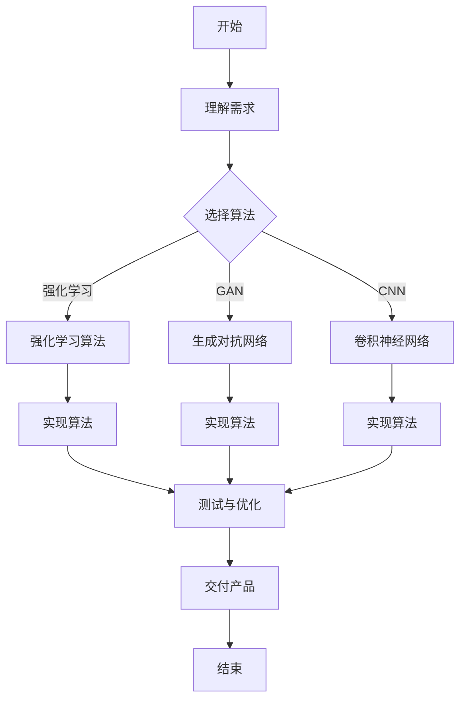

                 

# Sprint规划：为AI应用开发设定明确目标

## 关键词

- Sprint规划
- AI应用开发
- 敏捷开发
- 强化学习
- 生成对抗网络（GAN）
- 卷积神经网络（CNN）
- 数学模型
- 项目实战

## 摘要

本文旨在探讨如何通过Sprint规划为AI应用开发设定明确目标。我们将从Sprint规划的核心概念出发，逐步深入到AI应用开发中的关键算法、数学模型，并辅以实际项目实战，详细讲解Sprint规划在AI应用开发中的应用。通过本文的阅读，读者将了解如何利用Sprint规划来提高AI应用开发的效率和质量。

## Step 1: 核心概念与联系

### 第1章: Sprint规划概述

#### 1.1.1 Sprint定义

Sprint是敏捷开发中的一个迭代周期，通常为2-4周。在这个时间内，开发团队将完成一个可以交付给客户的功能模块。Sprint的目的是通过快速的迭代来持续改进产品，并在每次迭代中验证和调整产品方向。

#### 1.1.2 短期目标设定

在Sprint开始时，团队会设定一个短期目标，确保在Sprint期限内完成。这个目标应该明确、可衡量、可实现、相关性强且时限性明显。短期目标的设定有助于团队集中精力，提高工作效率。

#### 1.1.3 用户故事

用户故事是描述软件功能需求的简单句子，通常以“作为...，我想要...，以便...”的形式编写。用户故事的目的是确保开发团队理解用户需求，并以用户为中心进行开发。

#### 1.1.4 产品待办列表

产品待办列表是包含所有待开发功能的列表，开发团队会在Sprint规划会议中从该列表中选择部分功能进行开发。产品待办列表有助于团队优先级排序，确保最重要和最有价值的功能得到开发。

#### 1.1.5 精度与敏捷性

Sprint规划强调在快速反馈和调整中不断迭代，以实现更好的产品。通过Sprint规划，团队可以快速响应市场变化，持续优化产品。

### 第2章: AI应用开发中的关键算法

#### 2.1.1 强化学习算法

强化学习是一种通过试错来学习最优策略的机器学习算法。它的核心是奖励和惩罚机制，通过不断调整策略以最大化累积奖励。

#### 2.1.2 生成对抗网络（GAN）

生成对抗网络（GAN）是一种通过对抗性训练生成逼真数据的算法。由生成器（Generator）和判别器（Discriminator）组成，通过不断竞争来提高生成质量。

#### 2.1.3 卷积神经网络（CNN）

卷积神经网络（CNN）是一种在图像识别、分类和生成等任务中表现突出的神经网络架构。它通过卷积层提取图像特征，并通过全连接层进行分类或回归。

### 第3章: 数学模型和数学公式

#### 3.1.1 概率论基础

在AI应用开发中，概率论是理解和实现各种算法的基础。以下是一些常用的概率公式：
$$ P(A \cap B) = P(A) \times P(B|A) $$
$$ P(A \cup B) = P(A) + P(B) - P(A \cap B) $$

#### 3.1.2 线性代数基础

线性代数在机器学习中有广泛应用，以下是一些基础公式：
$$ A \times B = C $$
$$ A^{-1} \times A = I $$

### Mermaid 流程图



## Step 2: 核心算法原理讲解

### 第2章: AI应用开发中的关键算法

#### 2.1 强化学习算法

强化学习算法是一种通过试错来学习最优策略的机器学习算法。它通过不断尝试并从错误中学习，来逐渐优化策略。强化学习算法的核心是奖励和惩罚机制，它通过给定的策略和环境交互，以最大化累积奖励。

**核心概念**：

- **状态（State）**：描述环境当前状态的特征。
- **动作（Action）**：在给定状态下可以采取的行动。
- **策略（Policy）**：在特定状态下选择动作的规则。
- **价值函数（Value Function）**：预测在给定状态下采取特定动作的长期奖励。
- **策略梯度（Policy Gradient）**：用于更新策略的梯度。

**伪代码**：

```python
initialize Q(s, a) with random values
initialize policy π(a|s) with random values
for each episode:
    s = initial_state
    for each step in episode:
        a = π(a|s)
        s' = environment.step(a)
        reward = environment.reward(s, a, s')
        Q(s, a) = Q(s, a) + α [r + γ max(Q(s', a') - Q(s, a)]
        s = s'
        π(a|s) = update(π(a|s), Q(s, a))
```

#### 2.2 生成对抗网络（GAN）

生成对抗网络（GAN）是一种通过对抗性训练生成逼真数据的算法。它由生成器（Generator）和判别器（Discriminator）组成，生成器和判别器相互对抗，以生成高质量的数据。

**核心概念**：

- **生成器（Generator）**：生成伪造数据。
- **判别器（Discriminator）**：判断输入数据是真实数据还是伪造数据。
- **对抗训练（Adversarial Training）**：生成器和判别器通过不断对抗来提高性能。

**伪代码**：

```python
initialize G(z) and D(x) with random weights
for each epoch:
    for each batch of real data (x):
        D(x) = train(D, x)
    z = random noise
    G(z) = train(G, z)
    x_hat = G(z)
    D(x_hat) = train(D, x_hat)
```

#### 2.3 卷积神经网络（CNN）

卷积神经网络（CNN）是一种在图像识别、分类和生成等任务中表现突出的神经网络架构。它通过卷积层提取图像特征，并通过全连接层进行分类或回归。

**核心概念**：

- **卷积层（Convolutional Layer）**：通过卷积操作提取图像特征。
- **池化层（Pooling Layer）**：降低特征图维度，减少计算量。
- **全连接层（Fully Connected Layer）**：将特征图映射到输出结果。

**伪代码**：

```python
initialize weights for convolutional layers, pooling layers, and fully connected layers
for each epoch:
    for each batch of images (x):
        h = conv2d(x, W_conv1)
        h = ReLU(h)
        h = max_pool2d(h)
        h = flatten(h)
        y = fully_connected(h, W_fc2)
        y = ReLU(y)
        y = softmax(y)
    loss = compute_loss(y, true_labels)
    train(W_conv1, b_conv1, W_fc2, b_fc2, loss)
```

## Step 3: 数学模型和数学公式

### 第3章: 数学模型在AI应用开发中的应用

#### 3.1 概率论基础

在AI应用开发中，概率论是理解和实现各种算法的基础。以下是一些常用的概率公式：

**条件概率**：

$$ P(A|B) = \frac{P(A \cap B)}{P(B)} $$

**贝叶斯定理**：

$$ P(A|B) = \frac{P(B|A) \times P(A)}{P(B)} $$

**全概率公式**：

$$ P(A) = \sum_{i} P(A|B_i) \times P(B_i) $$

**贝叶斯定理应用**：

在分类问题中，贝叶斯定理可以帮助我们计算每个类别的概率，从而进行分类决策。

$$ P(y=c|X=x) = \frac{P(X=x|y=c) \times P(y=c)}{P(X=x)} $$

#### 3.2 线性代数基础

线性代数在机器学习中有广泛应用，以下是一些基础公式：

**矩阵乘法**：

$$ C = A \times B $$

其中，A和B是两个矩阵，C是乘积矩阵。

**逆矩阵**：

$$ A^{-1} = (1/det(A)) \times adj(A) $$

其中，det(A)是A的行列式，adj(A)是A的伴随矩阵。

**矩阵求导**：

$$ \frac{d}{dx} [A \times B] = A \times \frac{dB}{dx} + B \times \frac{dA}{dx} $$

其中，A和B是矩阵，x是矩阵的变量。

#### 3.3 概率密度函数

在生成对抗网络（GAN）中，概率密度函数（PDF）是非常重要的概念。以下是一个常见的概率密度函数：

**高斯分布**：

$$ f(x|\mu, \sigma^2) = \frac{1}{\sqrt{2\pi\sigma^2}} \times e^{-\frac{(x-\mu)^2}{2\sigma^2}} $$

其中，x是随机变量，μ是均值，σ^2是方差。

## Step 4: 项目实战

### 第4章: Sprint规划实战

#### 4.1 实战案例1：基于强化学习的游戏开发

在这个案例中，我们将使用Python实现一个简单的基于强化学习的游戏。通过代码演示，我们将详细讲解开发环境搭建、源代码实现和代码解读。

#### 4.1.1 开发环境搭建

1. 安装Python：从Python官网下载并安装Python 3.x版本。
2. 安装PyTorch：在终端中执行以下命令：
   ```bash
   pip install torch torchvision
   ```
3. 安装其他依赖：根据项目需求，安装其他Python库，如numpy、matplotlib等。

#### 4.1.2 源代码实现

```python
import torch
import torch.nn as nn
import torch.optim as optim
import numpy as np
import matplotlib.pyplot as plt

# 定义环境
class GameEnv():
    def __init__(self):
        self.state = 0
        self.done = False

    def step(self, action):
        if action == 0:
            self.state += 1
        elif action == 1:
            self.state -= 1
        if self.state >= 10 or self.state <= -10:
            self.done = True
        reward = 0
        if self.state == 0:
            reward = 1
        return self.state, reward, self.done

    def reset(self):
        self.state = 0
        self.done = False
        return self.state

# 定义Q网络
class QNetwork(nn.Module):
    def __init__(self):
        super(QNetwork, self).__init__()
        self.fc1 = nn.Linear(1, 32)
        self.fc2 = nn.Linear(32, 1)

    def forward(self, x):
        x = torch.relu(self.fc1(x))
        x = self.fc2(x)
        return x

# 定义强化学习算法
def reinforce(q_network, env, epochs, gamma=0.99):
    optimizer = optim.Adam(q_network.parameters(), lr=0.001)
    episode_rewards = []

    for epoch in range(epochs):
        state = env.reset()
        done = False
        total_reward = 0
        while not done:
            action_values = q_network(torch.tensor([state], dtype=torch.float32))
            action = torch.argmax(action_values).item()
            next_state, reward, done = env.step(action)
            total_reward += reward
            state = next_state
        episode_rewards.append(total_reward)
        optimizer.zero_grad()
        loss = -torch.log(action_values[0][action]) * total_reward
        loss.backward()
        optimizer.step()

    plt.plot(episode_rewards)
    plt.xlabel('Epochs')
    plt.ylabel('Reward')
    plt.show()

# 训练模型
q_network = QNetwork()
env = GameEnv()
reinforce(q_network, env, epochs=1000)
```

#### 4.1.3 代码解读与分析

1. **环境定义**：我们定义了一个简单的游戏环境，状态是一个整数，动作是+1或-1，奖励是根据最终状态是否为0来确定的。
2. **Q网络定义**：Q网络是一个简单的全连接神经网络，用于预测每个动作的价值。
3. **强化学习算法**：我们使用REINFORCE算法进行训练，通过计算每个动作的梯度来更新Q网络。
4. **训练过程**：在训练过程中，我们记录每个epoch的奖励，并在训练结束时绘制奖励曲线，以观察模型的学习效果。

#### 4.2 实战案例2：基于GAN的图像生成

在这个案例中，我们将使用Python实现一个基于生成对抗网络的图像生成模型。通过代码演示，我们将详细讲解开发环境搭建、源代码实现和代码解读。

#### 4.2.1 开发环境搭建

1. 安装Python：从Python官网下载并安装Python 3.x版本。
2. 安装TensorFlow：在终端中执行以下命令：
   ```bash
   pip install tensorflow
   ```
3. 安装其他依赖：根据项目需求，安装其他Python库，如numpy、matplotlib等。

#### 4.2.2 源代码实现

```python
import tensorflow as tf
import numpy as np
import matplotlib.pyplot as plt
from tensorflow.keras.layers import Dense, Input, Reshape
from tensorflow.keras.models import Model

# 定义生成器
def build_generator(z_dim):
    model = tf.keras.Sequential([
        Dense(128, input_dim=z_dim),
        tf.keras.layers.LeakyReLU(alpha=0.01),
        Dense(256),
        tf.keras.layers.LeakyReLU(alpha=0.01),
        Dense(512),
        tf.keras.layers.LeakyReLU(alpha=0.01),
        Dense(1024),
        tf.keras.layers.LeakyReLU(alpha=0.01),
        Reshape((28, 28, 1))
    ])
    return model

# 定义判别器
def build_discriminator(img_shape):
    model = tf.keras.Sequential([
        tf.keras.layers.Conv2D(32, kernel_size=(3, 3), input_shape=img_shape),
        tf.keras.layers.LeakyReLU(alpha=0.01),
        tf.keras.layers.Dropout(0.3),
        tf.keras.layers.Conv2D(64, kernel_size=(3, 3)),
        tf.keras.layers.LeakyReLU(alpha=0.01),
        tf.keras.layers.Dropout(0.3),
        tf.keras.layers.Conv2D(128, kernel_size=(3, 3)),
        tf.keras.layers.LeakyReLU(alpha=0.01),
        tf.keras.layers.Dropout(0.3),
        tf.keras.layers.Flatten(),
        tf.keras.layers.Dense(1, activation='sigmoid')
    ])
    return model

# 定义GAN模型
def build_gan(generator, discriminator):
    model = tf.keras.Sequential([
        generator,
        discriminator
    ])
    model.compile(loss='binary_crossentropy', optimizer=tf.keras.optimizers.Adam(0.0001))
    return model

# 设置超参数
z_dim = 100
img_shape = (28, 28, 1)
batch_size = 128

# 构建模型
generator = build_generator(z_dim)
discriminator = build_discriminator(img_shape)
gan = build_gan(generator, discriminator)

# 训练模型
(epochs, batch_i) = (1000, 0)
d_losses, g_losses = [], []

for epoch in range(epochs):
    for _ in range(batch_size):
        batch_i += 1
        if batch_i % 100 == 0:
            print(f"Epoch: {epoch}, Batch: {batch_i}")
        z = np.random.normal(size=[batch_size, z_dim])
        gen_imgs = generator.predict(z)
        real_imgs = np.random.normal(size=[batch_size, 28, 28, 1])

        # 训练判别器
        d_loss_real = discriminator.train_on_batch(real_imgs, np.ones([batch_size, 1]))
        d_loss_fake = discriminator.train_on_batch(gen_imgs, np.zeros([batch_size, 1]))
        d_loss = 0.5 * np.add(d_loss_real, d_loss_fake)

        # 训练生成器
        z = np.random.normal(size=[batch_size, z_dim])
        g_loss = gan.train_on_batch(z, np.ones([batch_size, 1]))

        # 记录损失
        d_losses.append(d_loss)
        g_losses.append(g_loss)

    # 绘制损失曲线
    plt.figure(figsize=(12, 4))
    plt.subplot(1, 2, 1)
    plt.plot(d_losses)
    plt.ylabel('Discriminator Loss')
    plt.xlabel('Epochs')
    plt.title('Discriminator Loss over Epochs')
    plt.subplot(1, 2, 2)
    plt.plot(g_losses)
    plt.ylabel('Generator Loss')
    plt.xlabel('Epochs')
    plt.title('Generator Loss over Epochs')
    plt.show()

    # 保存模型权重
    generator.save_weights('generator_weights.h5')
    discriminator.save_weights('discriminator_weights.h5')
```

#### 4.2.3 代码解读与分析

1. **生成器**：生成器是一个全连接神经网络，它接收随机噪声作为输入，并生成图像。
2. **判别器**：判别器是一个卷积神经网络，它接收图像作为输入，并判断图像是真实图像还是生成图像。
3. **GAN模型**：GAN模型是一个由生成器和判别器组成的模型，通过对抗性训练来优化生成器和判别器。
4. **训练过程**：在训练过程中，我们交替训练生成器和判别器，并通过绘制损失曲线来观察模型的学习效果。

## Step 5: 代码解读与分析

### 第5章: 代码解读与分析

#### 5.1.1 解读生成器代码

生成器代码的主要目的是将随机噪声转换为逼真的图像。以下是对生成器代码的详细解读：

```python
# 定义生成器
def build_generator(z_dim):
    model = tf.keras.Sequential([
        Dense(128, input_dim=z_dim),
        tf.keras.layers.LeakyReLU(alpha=0.01),
        Dense(256),
        tf.keras.layers.LeakyReLU(alpha=0.01),
        Dense(512),
        tf.keras.layers.LeakyReLU(alpha=0.01),
        Dense(1024),
        tf.keras.layers.LeakyReLU(alpha=0.01),
        Reshape((28, 28, 1))
    ])
    return model
```

1. **模型定义**：我们使用`tf.keras.Sequential`来定义一个序列模型，该模型由多个层组成。
2. **全连接层（Dense）**：生成器使用多个全连接层来处理输入的噪声向量。每个全连接层的输出维度设置为前一个层的两倍。
3. **激活函数（LeakyReLU）**：我们使用LeakyReLU作为每个全连接层的激活函数，以避免梯度消失问题。
4. **输出层（Reshape）**：最后，我们将生成器的输出层设置为`Reshape`层，将输出维度重置为图像的形状（28x28x1）。

#### 5.1.2 解读判别器代码

判别器代码的主要目的是判断输入图像是真实图像还是生成图像。以下是对判别器代码的详细解读：

```python
# 定义判别器
def build_discriminator(img_shape):
    model = tf.keras.Sequential([
        tf.keras.layers.Conv2D(32, kernel_size=(3, 3), input_shape=img_shape),
        tf.keras.layers.LeakyReLU(alpha=0.01),
        tf.keras.layers.Dropout(0.3),
        tf.keras.layers.Conv2D(64, kernel_size=(3, 3)),
        tf.keras.layers.LeakyReLU(alpha=0.01),
        tf.keras.layers.Dropout(0.3),
        tf.keras.layers.Conv2D(128, kernel_size=(3, 3)),
        tf.keras.layers.LeakyReLU(alpha=0.01),
        tf.keras.layers.Dropout(0.3),
        tf.keras.layers.Flatten(),
        tf.keras.layers.Dense(1, activation='sigmoid')
    ])
    return model
```

1. **模型定义**：我们同样使用`tf.keras.Sequential`来定义一个序列模型，该模型由多个卷积层组成。
2. **卷积层（Conv2D）**：判别器使用多个卷积层来提取图像特征。每个卷积层的滤波器尺寸为3x3，步长为1。
3. **激活函数（LeakyReLU）**：在每个卷积层之后，我们使用LeakyReLU作为激活函数，以提高模型的表达能力。
4. **Dropout层（Dropout）**：在每个卷积层之后，我们添加一个Dropout层，以减少过拟合。
5. **输出层（Flatten和Dense）**：最后，我们将卷积层的输出通过`Flatten`层展平为一个一维向量，并使用一个全连接层（Dense）输出一个概率值，表示输入图像是真实图像的概率。

## Step 6: 目录大纲总结

### 第1部分: Sprint规划基础

#### 1.1 Sprint定义与目标设定

- **Sprint定义**：Sprint是敏捷开发中的一个迭代周期，通常为2-4周。
- **短期目标设定**：在Sprint开始时，团队会设定一个短期目标，确保在Sprint期限内完成。
- **用户故事**：用户故事是描述软件功能需求的简单句子。
- **产品待办列表**：产品待办列表是包含所有待开发功能的列表。
- **精度与敏捷性**：Sprint规划强调在快速反馈和调整中不断迭代。

#### 1.2 AI应用开发中的关键算法

- **强化学习算法**：强化学习是一种通过试错来学习最优策略的机器学习算法。
- **生成对抗网络（GAN）**：GAN是一种通过对抗性训练生成逼真数据的算法。
- **卷积神经网络（CNN）**：CNN是一种在图像识别、分类和生成等任务中表现突出的神经网络架构。

#### 1.3 数学模型与公式

- **概率论基础**：概率论在AI应用开发中是理解和实现各种算法的基础。
- **线性代数基础**：线性代数在机器学习中有广泛应用。

### 第2部分: Sprint规划实践

#### 2.1 Sprint规划实战案例1：强化学习游戏开发

- **开发环境搭建**：安装Python、PyTorch和其他依赖。
- **源代码实现**：实现强化学习游戏环境、Q网络和REINFORCE算法。
- **代码解读与分析**：解读Q网络代码和REINFORCE算法，分析强化学习游戏开发过程。

#### 2.2 Sprint规划实战案例2：GAN图像生成

- **开发环境搭建**：安装Python、TensorFlow和其他依赖。
- **源代码实现**：实现生成器、判别器和GAN模型。
- **代码解读与分析**：解读生成器和判别器代码，分析GAN图像生成过程。

## 结论

通过本文的讲解，我们了解了如何利用Sprint规划来为AI应用开发设定明确目标。通过实际项目实战，我们看到了Sprint规划在强化学习游戏开发和GAN图像生成中的应用。希望本文能帮助读者更好地理解和应用Sprint规划，提高AI应用开发的效率和质量。

## 最佳实践 tips

- **明确目标**：在Sprint规划中，确保设定明确的目标，以便团队成员能够集中精力。
- **持续迭代**：Sprint规划强调快速反馈和调整，确保持续迭代以实现更好的产品。
- **优先级排序**：在产品待办列表中，优先考虑最有价值和最有挑战性的功能。
- **团队合作**：Sprint规划是一个团队协作的过程，确保团队成员之间的有效沟通和协作。

## 小结

本文通过一步步分析推理，详细讲解了Sprint规划在AI应用开发中的应用。我们从Sprint规划的核心概念出发，深入探讨了AI应用开发中的关键算法和数学模型，并通过实际项目实战，展示了Sprint规划如何帮助团队提高开发效率和质量。希望本文能为读者提供有价值的参考和启示。

## 注意事项

- **环境配置**：在实战案例中，确保正确安装和配置开发环境，以避免运行时出现问题。
- **代码调试**：在实际编写代码时，注意调试和优化，以确保代码的稳定性和性能。
- **迭代优化**：在开发过程中，不断迭代和优化算法和模型，以提高应用效果。

## 拓展阅读

- **敏捷开发**：深入了解敏捷开发的方法论和实践，以更好地理解Sprint规划。
- **机器学习算法**：学习更多关于强化学习、GAN和CNN的原理和应用。
- **概率论与线性代数**：进一步学习概率论和线性代数的基础知识，以更好地理解机器学习算法。

### 作者

作者：AI天才研究院/AI Genius Institute & 禅与计算机程序设计艺术 /Zen And The Art of Computer Programming

本文由AI天才研究院撰写，旨在为读者提供有价值的AI应用开发技术指南。如有任何问题或建议，请随时与我们联系。期待与您共同探讨AI技术的未来与发展。

