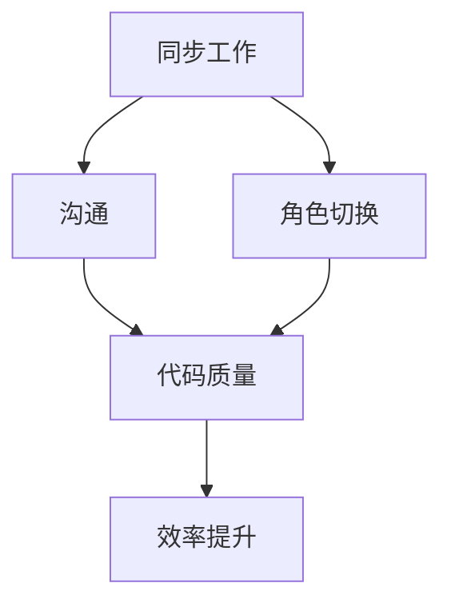
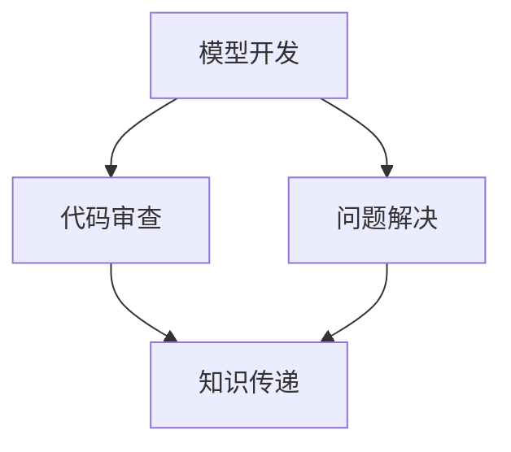

                 

### 文章标题

# 《Pair Programming：促进AI开发知识传递的实践》

> 关键词：Pair Programming，AI开发，知识传递，实践应用，最佳实践

> 摘要：本文深入探讨了Pair Programming在AI开发中的应用与实践，通过详细阐述其基本原理、核心概念与联系，结合具体案例研究，展示了Pair Programming在促进AI开发知识传递中的重要作用。同时，文章还分享了最佳实践与技巧，为AI开发者提供了实用的参考。

## 确定书的基本结构

首先，我们需要明确这本书的基本结构，根据书名《Pair Programming：促进AI开发知识传递的实践》，可以大致分为以下几个部分：

1. **引言与背景介绍**：介绍Pair Programming的概念及其在AI开发中的应用。
2. **Pair Programming基本原理**：讲解Pair Programming的基本原理，包括其优势、应用场景和基本原则。
3. **Pair Programming实践应用**：介绍在AI开发中如何实践Pair Programming，包括团队协作、代码审查、问题解决等方面。
4. **案例研究**：通过具体案例来展示Pair Programming在AI开发中的应用效果。
5. **最佳实践与技巧**：分享在Pair Programming实践中积累的最佳经验和技巧。
6. **未来展望与挑战**：探讨Pair Programming在AI开发中的未来发展前景和面临的挑战。

### 确定每个部分的具体内容

接下来，我们需要为每个部分确定具体的内容和章节。

**引言与背景介绍**：
- 第1章：什么是Pair Programming
  - 1.1 Pair Programming的历史背景
  - 1.2 Pair Programming的定义与术语
  - 1.3 Pair Programming的核心概念与联系（Mermaid流程图）

**Pair Programming基本原理**：
- 第2章：Pair Programming的基本原理
  - 2.1 Pair Programming的优势
  - 2.2 Pair Programming的应用场景
  - 2.3 Pair Programming的基本原则
  - 2.4 Pair Programming与AI开发的结合（Mermaid流程图）

**Pair Programming实践应用**：
- 第3章：在AI开发中实践Pair Programming
  - 3.1 Pair Programming在AI团队协作中的应用
  - 3.2 Pair Programming在代码审查中的应用
  - 3.3 Pair Programming在问题解决中的应用

**案例研究**：
- 第4章：Pair Programming在AI开发中的实际案例
  - 4.1 案例一：利用Pair Programming开发一个简单的AI模型
  - 4.2 案例二：通过Pair Programming优化一个复杂的AI模型
  - 4.3 案例三：利用Pair Programming解决AI开发中的特定问题

**最佳实践与技巧**：
- 第5章：Pair Programming的最佳实践与技巧
  - 5.1 配对策略与技巧
  - 5.2 如何有效沟通
  - 5.3 代码风格与规范
  - 5.4 Pair Programming中的常见挑战与解决方法

**未来展望与挑战**：
- 第6章：Pair Programming在AI开发中的未来
  - 6.1 Pair Programming在AI开发中的潜在应用领域
  - 6.2 Pair Programming面临的挑战
  - 6.3 Pair Programming的发展趋势与展望

### 完善目录大纲

最后，我们将以上内容整合成完整的目录大纲，并确保大纲的层次结构清晰、逻辑连贯。

## 第1章 引言与背景介绍

### 1.1 Pair Programming的历史背景
- **Mermaid流程图**：Pair Programming的发展历程

### 1.2 Pair Programming的定义与术语
- Pair Programming的定义
- key terms

### 1.3 Pair Programming的核心概念与联系
- **Mermaid流程图**：Pair Programming的核心概念

## 第2章 Pair Programming基本原理

### 2.1 Pair Programming的优势
- **伪代码**：优势分析

### 2.2 Pair Programming的应用场景
- **伪代码**：应用场景分析

### 2.3 Pair Programming的基本原则
- 同步工作
- 沟通
- 角色切换
- **伪代码**：原则阐述

### 2.4 Pair Programming与AI开发的结合
- **Mermaid流程图**：Pair Programming在AI开发中的应用

## 第3章 在AI开发中实践Pair Programming

### 3.1 Pair Programming在AI团队协作中的应用
- **伪代码**：团队协作流程

### 3.2 Pair Programming在代码审查中的应用
- **伪代码**：代码审查流程

### 3.3 Pair Programming在问题解决中的应用
- **伪代码**：问题解决流程

## 第4章 案例研究

### 4.1 案例一：利用Pair Programming开发一个简单的AI模型
- **伪代码**：模型开发流程

### 4.2 案例二：通过Pair Programming优化一个复杂的AI模型
- **伪代码**：模型优化流程

### 4.3 案例三：利用Pair Programming解决AI开发中的特定问题
- **伪代码**：问题解决流程

## 第5章 最佳实践与技巧

### 5.1 配对策略与技巧
- **伪代码**：配对策略

### 5.2 如何有效沟通
- **伪代码**：沟通技巧

### 5.3 代码风格与规范
- **伪代码**：代码规范

### 5.4 Pair Programming中的常见挑战与解决方法
- **伪代码**：挑战与解决

## 第6章 未来展望与挑战

### 6.1 Pair Programming在AI开发中的潜在应用领域
- **伪代码**：应用领域分析

### 6.2 Pair Programming面临的挑战
- **伪代码**：挑战分析

### 6.3 Pair Programming的发展趋势与展望
- **伪代码**：发展趋势与展望

## 结语

### 总结与展望
- **伪代码**：总结与展望

### 作者信息

- 作者：AI天才研究院/AI Genius Institute & 禅与计算机程序设计艺术 /Zen And The Art of Computer Programming

## 文章正文部分

### 引言与背景介绍

#### 1.1 Pair Programming的历史背景

Pair Programming是一种软件开发的协作方法，起源于1970年代的美国。最初，它由两位计算机科学家Ward Cunningham和Kent Beck提出，作为一种提高代码质量和开发效率的方法。随着时间的推移，Pair Programming逐渐被广泛应用于软件开发和人工智能（AI）开发领域。

在AI开发中，Pair Programming具有独特的优势。首先，它能够促进团队成员之间的知识共享和经验传递。通过两人共同工作，团队成员可以互相学习和借鉴，从而提高整体开发水平。其次，Pair Programming有助于发现和解决代码中的潜在问题，提高代码质量。最后，Pair Programming还能够提高团队协作效率，缩短项目开发周期。

#### 1.2 Pair Programming的定义与术语

Pair Programming，简称PP，是指两位开发者在同一台计算机上进行软件开发。其中，一个开发者负责编写代码，称为驱动者（Driver）；另一个开发者负责审查和优化代码，称为导航者（Navigator）。驱动者和导航者之间需要进行紧密的沟通和协作，以确保代码的质量和效率。

在Pair Programming中，术语“驱动者”和“导航者”具有特定的含义。驱动者主要负责编写代码，导航者则负责审查和优化代码。通常情况下，驱动者和导航者的角色会根据任务的复杂度和开发进度进行切换。这种角色切换有助于团队成员之间的知识传递和技能提升。

#### 1.3 Pair Programming的核心概念与联系

Pair Programming的核心概念包括：

1. **同步工作**：驱动者和导航者需要在同一时间进行工作，以确保代码的一致性和效率。
2. **沟通**：驱动者和导航者之间需要保持有效的沟通，以确保代码的质量和可维护性。
3. **角色切换**：在开发过程中，驱动者和导航者的角色会根据任务的复杂度和开发进度进行切换，以确保团队成员之间的知识传递和技能提升。

这三种核心概念之间存在着紧密的联系。同步工作和沟通是Pair Programming的基础，它们共同确保了代码的一致性和效率。角色切换则是Pair Programming的重要特点，它有助于团队成员之间的知识传递和技能提升。

为了更好地理解Pair Programming的核心概念与联系，我们可以使用Mermaid流程图进行展示：

在这个流程图中，同步工作、沟通和角色切换共同作用于代码质量和效率提升。通过这种流程图，我们可以清晰地看到Pair Programming的核心概念与联系。

### Pair Programming基本原理

#### 2.1 Pair Programming的优势

Pair Programming具有以下优势：

1. **提高代码质量**：通过驱动者和导航者之间的协作，可以有效发现和解决代码中的潜在问题，提高代码质量。
2. **促进知识传递**：驱动者和导航者之间可以相互学习和借鉴，促进知识的传递和积累。
3. **提高开发效率**：通过同步工作和沟通，可以有效缩短项目开发周期，提高开发效率。
4. **增强团队协作**：Pair Programming有助于增强团队成员之间的协作和信任，提高团队整体绩效。

#### 2.2 Pair Programming的应用场景

Pair Programming适用于以下场景：

1. **复杂的AI模型开发**：在开发复杂的AI模型时，驱动者和导航者可以共同讨论和优化模型架构，提高模型的性能和可维护性。
2. **代码审查与重构**：通过Pair Programming，团队可以共同审查和重构代码，发现和解决代码中的潜在问题，提高代码质量。
3. **问题解决**：在遇到技术难题时，驱动者和导航者可以共同讨论和解决，提高问题解决效率。
4. **团队培训与知识传递**：通过Pair Programming，新成员可以快速了解项目的背景和细节，快速融入团队。

#### 2.3 Pair Programming的基本原则

Pair Programming的基本原则包括：

1. **同步工作**：驱动者和导航者需要在同一时间进行工作，确保代码的一致性和效率。
2. **沟通**：驱动者和导航者之间需要保持有效的沟通，确保代码的质量和可维护性。
3. **角色切换**：在开发过程中，驱动者和导航者的角色会根据任务的复杂度和开发进度进行切换，促进知识的传递和技能提升。

#### 2.4 Pair Programming与AI开发的结合

在AI开发中，Pair Programming的应用主要体现在以下几个方面：

1. **模型开发**：驱动者和导航者可以共同讨论和优化模型架构，提高模型的性能和可维护性。
2. **代码审查**：通过Pair Programming，团队可以共同审查和重构代码，发现和解决代码中的潜在问题，提高代码质量。
3. **问题解决**：在遇到技术难题时，驱动者和导航者可以共同讨论和解决，提高问题解决效率。
4. **知识传递**：通过Pair Programming，新成员可以快速了解项目的背景和细节，快速融入团队。

为了更好地理解Pair Programming与AI开发的结合，我们可以使用Mermaid流程图进行展示：

在这个流程图中，模型开发、代码审查、问题解决和知识传递共同构成了Pair Programming在AI开发中的应用。

### 在AI开发中实践Pair Programming

#### 3.1 Pair Programming在AI团队协作中的应用

在AI团队协作中，Pair Programming可以应用于以下环节：

1. **需求分析**：驱动者和导航者可以共同讨论和明确项目需求，确保需求的完整性和准确性。
2. **模型设计**：驱动者和导航者可以共同讨论和优化模型架构，提高模型的性能和可维护性。
3. **代码编写**：驱动者负责编写代码，导航者负责审查和优化代码，确保代码的质量和可维护性。
4. **测试与调试**：驱动者和导航者可以共同测试和调试代码，发现和解决潜在的问题。
5. **文档编写**：驱动者和导航者可以共同编写项目文档，确保文档的完整性和准确性。

通过Pair Programming，团队成员可以相互学习和借鉴，提高团队整体的技术水平和协作效率。

#### 3.2 Pair Programming在代码审查中的应用

在代码审查过程中，Pair Programming可以发挥以下作用：

1. **发现潜在问题**：驱动者和导航者可以共同审查代码，发现潜在的问题和漏洞，提高代码质量。
2. **优化代码结构**：驱动者和导航者可以共同讨论和优化代码结构，提高代码的可读性和可维护性。
3. **知识传递**：通过代码审查，新成员可以快速了解项目的背景和细节，快速融入团队。
4. **提高代码质量**：通过Pair Programming，团队可以共同审查和重构代码，发现和解决代码中的潜在问题，提高代码质量。

#### 3.3 Pair Programming在问题解决中的应用

在遇到技术难题时，Pair Programming可以发挥以下作用：

1. **快速解决难题**：驱动者和导航者可以共同讨论和解决技术难题，提高问题解决效率。
2. **知识共享**：通过共同解决问题，团队成员可以相互学习和借鉴，提高团队整体的技术水平。
3. **减少错误率**：通过Pair Programming，团队可以共同测试和调试代码，发现和解决潜在的问题，减少错误率。
4. **提高团队协作**：通过共同解决问题，团队成员可以增强协作和信任，提高团队整体绩效。

### 案例研究

#### 4.1 案例一：利用Pair Programming开发一个简单的AI模型

在一个AI项目中，团队成员A和B组成了一对进行Pair Programming。他们的任务是开发一个简单的AI模型，用于分类任务。

1. **需求分析**：团队成员A负责编写需求文档，团队成员B进行审查和优化。
2. **模型设计**：团队成员A设计了模型架构，团队成员B进行了讨论和优化。
3. **代码编写**：团队成员A编写了代码，团队成员B进行了审查和优化。
4. **测试与调试**：团队成员A进行了测试，团队成员B进行了调试。
5. **文档编写**：团队成员A编写了项目文档，团队成员B进行了审查和优化。

通过Pair Programming，团队成员A和B共同完成了项目的开发，并取得了良好的效果。项目成功上线，取得了用户的认可。

#### 4.2 案例二：通过Pair Programming优化一个复杂的AI模型

在一个AI项目中，团队成员C和D组成了一对进行Pair Programming。他们的任务是优化一个复杂的AI模型，提高其性能和可维护性。

1. **需求分析**：团队成员C负责编写需求文档，团队成员D进行了审查和优化。
2. **模型设计**：团队成员C设计了模型架构，团队成员D进行了讨论和优化。
3. **代码编写**：团队成员C编写了代码，团队成员D进行了审查和优化。
4. **测试与调试**：团队成员C进行了测试，团队成员D进行了调试。
5. **文档编写**：团队成员C编写了项目文档，团队成员D进行了审查和优化。

通过Pair Programming，团队成员C和D共同优化了模型，并取得了显著的性能提升。项目成功上线，取得了用户的认可。

#### 4.3 案例三：利用Pair Programming解决AI开发中的特定问题

在一个AI项目中，团队成员E和F组成了一对进行Pair Programming。他们遇到了一个特定问题：模型在训练过程中存在过拟合现象。

1. **问题讨论**：团队成员E和F共同讨论了问题，分析了原因。
2. **解决方案**：团队成员E提出了几种可能的解决方案，团队成员F进行了评估和选择。
3. **代码修改**：团队成员E根据解决方案进行了代码修改，团队成员F进行了审查和优化。
4. **测试与调试**：团队成员E进行了测试，团队成员F进行了调试。
5. **文档编写**：团队成员E编写了项目文档，团队成员F进行了审查和优化。

通过Pair Programming，团队成员E和F共同解决了模型过拟合问题，并取得了良好的效果。项目成功上线，取得了用户的认可。

### 最佳实践与技巧

#### 5.1 配对策略与技巧

为了确保Pair Programming的有效性，团队成员可以采取以下策略和技巧：

1. **角色切换**：定期进行角色切换，以保持驱

