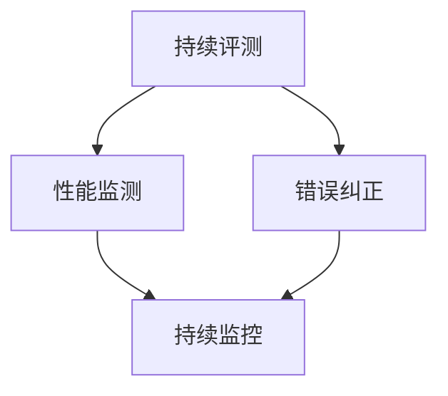
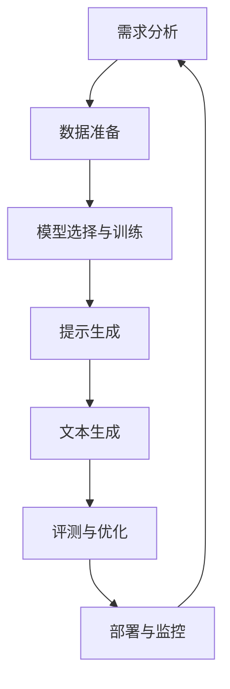
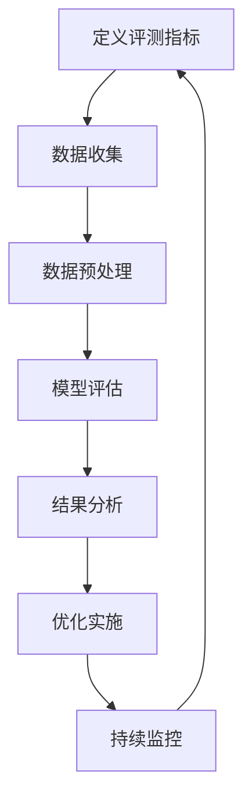
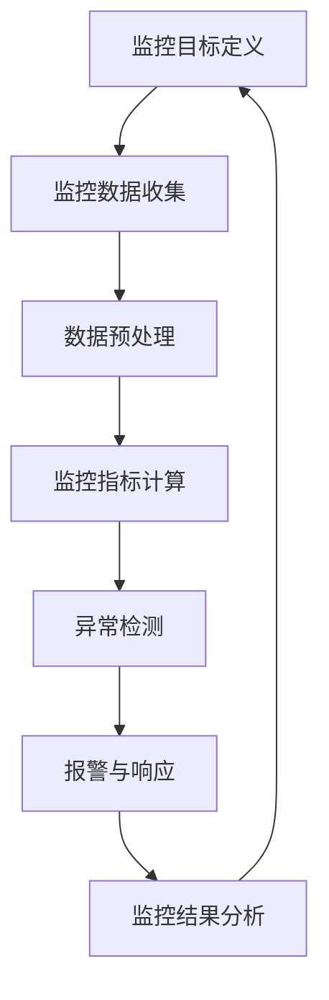
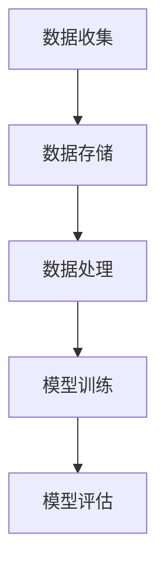
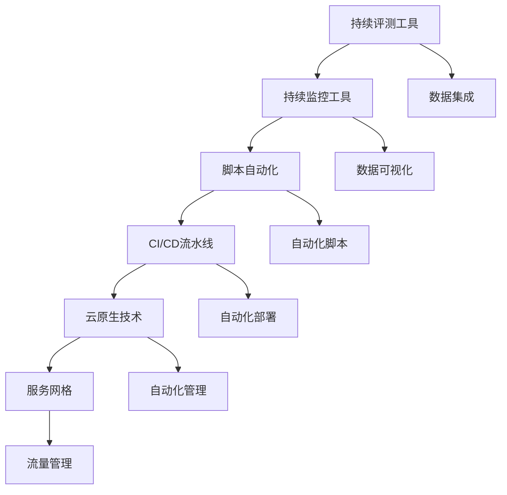

                 

# 文章标题：prompt工程中的持续评测与监控

> 关键词：prompt工程，持续评测，监控，自然语言处理，计算机视觉，机器学习，金融领域

> 摘要：本文将深入探讨prompt工程中的持续评测与监控，从理论基础到实际应用，全面解析持续评测与监控在prompt工程中的重要性。本文旨在为从事prompt工程相关领域的技术人员提供一套系统的指导，以实现高效的持续评测与监控。

## 目录大纲

### 第一部分：持续评测与监控的基础知识

- **第1章：持续评测与监控的概念与意义**
  - **1.1 持续评测的定义**
  - **1.2 持续监控的定义**
  - **1.3 持续评测与监控在prompt工程中的重要性**

- **第2章：prompt工程的基本架构**
  - **2.1 prompt工程的概述**
  - **2.2 prompt工程的核心组成部分**
  - **2.3 prompt工程的开发流程**

- **第3章：持续评测的理论基础**
  - **3.1 持续评测的目标**
  - **3.2 持续评测的关键指标**
  - **3.3 持续评测的方法论**

- **第4章：持续监控的理论基础**
  - **4.1 持续监控的目标**
  - **4.2 持续监控的关键指标**
  - **4.3 持续监控的方法论**

- **第5章：prompt工程中的数据管理**
  - **5.1 数据收集**
  - **5.2 数据存储**
  - **5.3 数据处理**

- **第6章：持续评测与监控的工具与技术**
  - **6.1 持续评测工具**
  - **6.2 持续监控工具**
  - **6.3 工具集成与自动化**

- **第7章：prompt工程中的持续评测与监控实践**
  - **7.1 持续评测实践案例**
  - **7.2 持续监控实践案例**
  - **7.3 持续评测与监控的最佳实践**

### 第二部分：持续评测与监控的实际应用

- **第8章：持续评测与监控在自然语言处理中的应用**
  - **8.1 NLP中的持续评测**
  - **8.2 NLP中的持续监控**
  - **8.3 NLP中的持续评测与监控案例**

- **第9章：持续评测与监控在计算机视觉中的应用**
  - **9.1 CV中的持续评测**
  - **9.2 CV中的持续监控**
  - **9.3 CV中的持续评测与监控案例**

- **第10章：持续评测与监控在机器学习中的应用**
  - **10.1 ML中的持续评测**
  - **10.2 ML中的持续监控**
  - **10.3 ML中的持续评测与监控案例**

- **第11章：持续评测与监控在金融领域的应用**
  - **11.1 金融领域的持续评测**
  - **11.2 金融领域的持续监控**
  - **11.3 金融领域的持续评测与监控案例**

### 第三部分：持续评测与监控的展望与未来发展趋势

- **第12章：持续评测与监控的未来发展趋势**
  - **12.1 持续评测与监控的技术演进**
  - **12.2 持续评测与监控在AI领域的应用拓展**
  - **12.3 持续评测与监控的挑战与机遇**

---

### 引言

prompt工程是一种以人类交互为基础的工程方法，旨在通过生成式模型（如GPT-3、BERT等）来模拟人类的思考过程，从而实现智能对话系统、文本生成、信息检索等应用。随着深度学习技术的不断发展，prompt工程在自然语言处理、计算机视觉、机器学习等领域得到了广泛应用。

然而，prompt工程的应用也带来了一系列挑战，尤其是在持续评测与监控方面。如何确保prompt工程的稳定性、准确性和可靠性，如何实时监控模型的运行状态，如何快速响应异常情况，这些都是prompt工程中需要解决的问题。

本文将围绕prompt工程中的持续评测与监控展开讨论，首先介绍持续评测与监控的基础知识，然后分析prompt工程的基本架构，接着探讨持续评测与监控的理论基础，以及工具与技术，最后通过实际应用案例展示如何实现持续评测与监控。希望通过本文的探讨，能够为从事prompt工程相关领域的技术人员提供一套系统的指导，以实现高效的持续评测与监控。

### 第1章：持续评测与监控的概念与意义

#### 1.1 持续评测的定义

持续评测（Continuous Evaluation）是一种通过实时或周期性方式对系统、模型或应用程序进行评估的方法。其主要目的是确保系统在长时间运行过程中能够保持性能稳定、满足业务需求，并且及时发现并解决潜在问题。

在prompt工程中，持续评测的对象通常包括生成式模型、对话系统、自然语言处理组件等。通过持续评测，可以实时监控模型的性能，识别潜在的误差、偏差，评估模型在实际应用中的效果，从而为模型的优化和改进提供依据。

#### 1.2 持续监控的定义

持续监控（Continuous Monitoring）是指对系统、模型或应用程序的运行状态进行实时监测，以发现和响应异常情况的过程。持续监控的目标是确保系统的稳定运行，提高系统的可用性和可靠性。

在prompt工程中，持续监控的作用尤为重要。由于prompt工程涉及大量的数据处理和复杂模型训练，监控系统可以在出现计算资源不足、数据异常、模型退化等情况时发出警报，从而及时采取应对措施，避免系统崩溃或性能下降。

#### 1.3 持续评测与监控在prompt工程中的重要性

持续评测与监控在prompt工程中具有至关重要的意义。首先，prompt工程通常涉及大量的数据处理和模型训练，这些操作的高效性和准确性直接影响到系统的性能和用户体验。通过持续评测，可以实时监测模型的性能，及时发现和纠正错误，从而确保系统的高效运行。

其次，持续监控有助于保障系统的稳定性。在prompt工程中，模型训练和预测过程通常需要大量的计算资源，并且可能会受到外部环境的影响。通过持续监控，可以及时发现资源不足、数据异常等问题，从而采取相应的措施，确保系统的稳定运行。

最后，持续评测与监控有助于提升系统的可靠性。在prompt工程的实际应用中，模型的可靠性和准确性直接关系到用户的信任和满意度。通过持续评测与监控，可以实时了解系统的运行状态，评估系统的可靠性和准确性，从而不断提升用户体验。

#### 核心概念与联系

为了更好地理解持续评测与监控在prompt工程中的重要性，我们可以通过一个Mermaid流程图来展示它们之间的关系：



在这个流程图中，持续评测负责性能监测和错误纠正，而持续监控则负责对系统的运行状态进行实时监测。这两个过程相互关联，共同保障了prompt工程的高效、稳定和可靠运行。

#### 核心算法原理讲解

在持续评测与监控中，核心算法主要包括性能监测算法和错误纠正算法。以下是这些算法的伪代码描述：

```plaintext
# 性能监测算法
function PerformanceMonitoring(model, data):
    for each sample in data:
        prediction = model.predict(sample)
        if prediction is incorrect:
            record error
    return error rate

# 错误纠正算法
function ErrorCorrection(model, errors):
    for each error in errors:
        update model with corrected sample
    return updated model
```

这些算法的实现可以通过以下数学模型和公式进行描述：

$$
E = \frac{1}{n} \sum_{i=1}^{n} e_i
$$

其中，$E$ 表示总误差，$e_i$ 表示第 $i$ 个样本的误差。

通过这些算法和公式，我们可以实现对prompt工程的持续评测与监控，从而确保系统的稳定性和可靠性。

### 第2章：prompt工程的基本架构

#### 2.1 prompt工程的概述

prompt工程是一种基于生成式模型的工程技术方法，旨在通过人类交互来模拟和理解人类的思考过程。在prompt工程中，核心目标是通过输入一个或多个提示（prompt），生成高质量的自然语言文本或完成特定任务。

prompt工程的基本原理可以概括为以下几个步骤：

1. **数据准备**：收集和整理用于训练模型的文本数据，这些数据可以是新闻文章、对话记录、社交媒体内容等。
2. **模型训练**：使用预训练的生成式模型（如GPT-3、BERT等）对数据进行训练，以优化模型的参数。
3. **生成文本**：在给定提示的情况下，模型生成文本，文本的质量和相关性取决于模型的训练效果。
4. **反馈与优化**：用户对生成的文本进行评价，并提供反馈，用于进一步优化模型。

#### 2.2 prompt工程的核心组成部分

prompt工程由以下几个核心组成部分构成：

1. **数据集**：数据集是prompt工程的基础，包含大量用于训练和测试的文本数据。
2. **生成式模型**：生成式模型是prompt工程的核心，负责生成文本。常见的生成式模型有GPT-3、BERT、Transformer等。
3. **提示生成**：提示生成是指根据用户需求和上下文，生成用于引导模型生成文本的提示。
4. **文本生成**：文本生成是指模型根据提示生成相应的文本内容。
5. **评测与优化**：评测与优化是指通过评估模型生成的文本质量，对模型进行优化，以提高生成文本的相关性和质量。

#### 2.3 prompt工程的开发流程

prompt工程的开发流程可以分为以下几个步骤：

1. **需求分析**：明确用户需求，确定生成文本的应用场景和目标。
2. **数据准备**：收集和整理文本数据，进行数据预处理，包括清洗、分词、去噪等。
3. **模型选择与训练**：选择适合的生成式模型，进行模型训练和参数优化。
4. **提示生成与文本生成**：根据用户需求和上下文，生成提示并使用模型生成文本。
5. **评测与优化**：对生成的文本进行评测，收集用户反馈，对模型进行优化。
6. **部署与监控**：将模型部署到生产环境，进行持续监控和评估，确保系统的稳定性和性能。

#### 核心概念与联系

为了更好地理解prompt工程的基本架构，我们可以通过一个Mermaid流程图来展示其核心组成部分和开发流程：



在这个流程图中，需求分析和数据准备是整个流程的起点，通过模型选择与训练、提示生成与文本生成，最终实现评测与优化，并部署到生产环境。通过持续监控和评估，可以确保系统的稳定性和性能，从而不断迭代和优化。

#### 核心算法原理讲解

在prompt工程中，核心算法包括模型选择与训练算法、提示生成算法、文本生成算法和评测与优化算法。以下是这些算法的伪代码描述：

```plaintext
# 模型选择与训练算法
function ModelTraining(data, model):
    for each epoch:
        for each batch in data:
            update model parameters with batch data
    return trained model

# 提示生成算法
function PromptGeneration(userInput, context):
    combine userInput and context to generate prompt
    return prompt

# 文本生成算法
function TextGeneration(model, prompt):
    generate text based on prompt using model
    return generated text

# 评测与优化算法
function EvaluationAndOptimization(generatedText, referenceText):
    calculate similarity between generatedText and referenceText
    if similarity is below threshold:
        optimize model parameters
    return optimized model
```

这些算法的实现可以通过以下数学模型和公式进行描述：

$$
\text{similarity} = \frac{\text{cosine similarity of } \text{generatedText} \text{ and } \text{referenceText}}{\text{maximum possible similarity}}
$$

通过这些算法和公式，我们可以实现prompt工程的各个组成部分，从而构建一个高效的生成式模型系统。

### 第3章：持续评测的理论基础

#### 3.1 持续评测的目标

持续评测的目标是确保模型或系统在长时间运行过程中保持稳定、高效和可靠的性能。具体目标包括：

1. **性能监测**：实时监测模型的性能指标，如准确率、召回率、F1分数等，确保模型在给定任务上表现良好。
2. **错误识别**：及时发现模型中的错误或异常，如数据泄漏、过拟合、噪声等，防止这些错误影响模型的性能。
3. **优化指导**：通过持续评测，为模型的优化提供数据支持，包括调整模型参数、改进训练策略等。
4. **用户体验**：持续评测可以确保系统提供的输出质量满足用户期望，从而提升用户体验。

#### 3.2 持续评测的关键指标

持续评测的关键指标包括：

1. **准确率**：模型预测结果与实际结果一致的比例，用于评估模型的准确性。
2. **召回率**：实际为正例的样本中被正确预测为正例的比例，用于评估模型对正例样本的识别能力。
3. **F1分数**：准确率和召回率的加权平均，用于综合评估模型的性能。
4. **ROC曲线和AUC**：通过ROC曲线和AUC（Area Under Curve）评估模型的分类能力，ROC曲线反映了不同阈值下模型对正负例的区分能力，AUC反映了模型的整体分类性能。
5. **错误率**：模型预测结果与实际结果不一致的比例，用于评估模型的错误率。

#### 3.3 持续评测的方法论

持续评测的方法论包括以下几个步骤：

1. **定义评测指标**：根据具体任务和业务需求，明确需要监测的评测指标。
2. **数据收集**：收集模型运行过程中产生的数据，包括输入数据、预测结果、实际结果等。
3. **数据预处理**：对收集到的数据进行清洗、归一化等预处理，确保数据质量。
4. **模型评估**：使用收集到的数据进行模型评估，计算评测指标，如准确率、召回率、F1分数等。
5. **结果分析**：对评估结果进行分析，识别模型中的错误和异常，找出优化机会。
6. **优化实施**：根据分析结果，调整模型参数、改进训练策略等，实施优化措施。
7. **持续监控**：建立持续监控机制，定期进行评测，确保模型性能的持续提升。

#### 核心概念与联系

为了更好地理解持续评测的理论基础，我们可以通过一个Mermaid流程图来展示其关键步骤和核心概念之间的联系：



在这个流程图中，定义评测指标是持续评测的起点，通过数据收集、数据预处理、模型评估、结果分析和优化实施，最终实现持续监控，形成一个闭环，确保模型的持续优化。

#### 核心算法原理讲解

在持续评测中，核心算法包括性能监测算法、错误识别算法和优化指导算法。以下是这些算法的伪代码描述：

```plaintext
# 性能监测算法
function PerformanceMonitoring(model, data):
    for each sample in data:
        prediction = model.predict(sample)
        if prediction is incorrect:
            record error
    return error rate

# 错误识别算法
function ErrorIdentification(data, model):
    for each sample in data:
        prediction = model.predict(sample)
        if prediction is incorrect:
            identify error type and location
    return error details

# 优化指导算法
function OptimizationGuidance(errors, model):
    analyze error types and locations
    adjust model parameters or training strategy
    return optimized model
```

这些算法的实现可以通过以下数学模型和公式进行描述：

$$
\text{error rate} = \frac{\text{number of errors}}{\text{total number of samples}}
$$

通过这些算法和公式，我们可以实现持续评测的各个步骤，从而确保模型的稳定、高效和可靠运行。

### 第4章：持续监控的理论基础

#### 4.1 持续监控的目标

持续监控的目标是确保系统的稳定性和可靠性，及时发现并响应异常情况，从而保障系统的正常运行。具体目标包括：

1. **故障检测**：实时监测系统的各项性能指标，及时发现异常情况，如计算资源不足、内存溢出、网络中断等。
2. **性能优化**：通过持续监控，识别系统性能瓶颈，提供优化建议，提升系统性能。
3. **安全性保障**：监控系统安全状态，防止恶意攻击和数据泄露，确保系统的安全运行。
4. **用户体验**：监控系统的响应时间和稳定性，提升用户的使用体验。

#### 4.2 持续监控的关键指标

持续监控的关键指标包括：

1. **响应时间**：系统处理请求所需的时间，用于评估系统的性能。
2. **吞吐量**：系统单位时间内处理请求的数量，用于评估系统的负载能力。
3. **错误率**：系统处理请求时发生错误的概率，用于评估系统的可靠性。
4. **资源利用率**：系统资源（如CPU、内存、磁盘等）的使用情况，用于评估系统资源的分配和利用率。
5. **可用性**：系统正常运行的时间比例，用于评估系统的稳定性。
6. **安全性指标**：系统遭受攻击或数据泄露的概率，用于评估系统的安全状态。

#### 4.3 持续监控的方法论

持续监控的方法论包括以下几个步骤：

1. **监控目标定义**：根据系统需求，明确需要监控的关键指标。
2. **监控数据收集**：通过日志、监控工具等手段，收集系统运行过程中的监控数据。
3. **数据预处理**：对收集到的监控数据进行清洗、归一化等处理，确保数据质量。
4. **监控指标计算**：根据定义的监控指标，计算系统的各项性能指标。
5. **异常检测**：通过统计分析和机器学习等方法，识别系统的异常情况。
6. **报警与响应**：根据异常检测的结果，触发报警并采取相应的响应措施，如重启服务、调整资源分配等。
7. **监控结果分析**：定期分析监控数据，评估系统性能和稳定性，为系统优化提供依据。

#### 核心概念与联系

为了更好地理解持续监控的理论基础，我们可以通过一个Mermaid流程图来展示其关键步骤和核心概念之间的联系：



在这个流程图中，监控目标定义是持续监控的起点，通过监控数据收集、数据预处理、监控指标计算、异常检测、报警与响应和监控结果分析，形成一个闭环，确保系统的稳定性和可靠性。

#### 核心算法原理讲解

在持续监控中，核心算法包括故障检测算法、性能优化算法和安全监控算法。以下是这些算法的伪代码描述：

```plaintext
# 故障检测算法
function FaultDetection(metrics):
    for each metric in metrics:
        if metric is out of threshold:
            trigger alarm
    return alarms

# 性能优化算法
function PerformanceOptimization(alarms, metrics):
    analyze alarms and metrics
    suggest performance optimization measures
    return optimized measures

# 安全监控算法
function SecurityMonitoring(alarms, metrics):
    if alarms indicate security threats:
        trigger security alarm
    return security status
```

这些算法的实现可以通过以下数学模型和公式进行描述：

$$
\text{alarm} = \text{threshold violation of } \text{metrics}
$$

通过这些算法和公式，我们可以实现持续监控的各个步骤，从而确保系统的稳定、高效和可靠运行。

### 第5章：prompt工程中的数据管理

#### 5.1 数据收集

在prompt工程中，数据收集是至关重要的一环。有效的数据收集可以为模型的训练和评估提供高质量的数据源，从而提高模型的性能和可靠性。以下是数据收集的关键步骤：

1. **数据源识别**：根据业务需求和模型目标，识别潜在的数据源，如文本数据库、社交媒体、在线新闻网站等。
2. **数据采集**：使用爬虫、API接口等方式，从数据源中获取数据。在数据采集过程中，需要注意数据的质量和完整性。
3. **数据清洗**：对采集到的数据进行清洗，去除重复、错误和无关的数据，确保数据的一致性和准确性。
4. **数据归一化**：对数据进行归一化处理，如文本分词、停用词去除、词干提取等，以统一数据格式，便于后续处理。

#### 5.2 数据存储

数据存储是prompt工程中的另一个关键环节，需要确保数据的安全、可靠和高效访问。以下是数据存储的关键步骤：

1. **存储方案选择**：根据数据量和访问频率，选择合适的存储方案，如关系数据库、NoSQL数据库、分布式文件系统等。
2. **数据分区和索引**：对数据进行分区和索引，提高数据访问速度，降低查询延迟。
3. **数据备份和恢复**：定期进行数据备份，确保数据在意外情况下可以恢复。
4. **数据安全性**：采用加密、访问控制等技术，确保数据的安全性。

#### 5.3 数据处理

数据处理是prompt工程中的核心环节，包括数据预处理、特征提取和模型训练等。以下是数据处理的关键步骤：

1. **数据预处理**：对数据进行预处理，包括数据清洗、归一化、填充缺失值等，以提高数据质量和一致性。
2. **特征提取**：从数据中提取有助于模型训练的特征，如文本表示、图像特征等。特征提取的质量直接影响模型的性能。
3. **模型训练**：使用提取的特征对模型进行训练，优化模型参数，提高模型的准确性和鲁棒性。
4. **模型评估**：使用验证集和测试集对模型进行评估，计算模型的准确率、召回率等指标，以评估模型的效果。
5. **模型优化**：根据评估结果，对模型进行优化，如调整模型参数、改进训练策略等，以提高模型的性能。

#### 核心概念与联系

在prompt工程中的数据管理，数据收集、数据存储和数据处理三个环节相互关联，共同构成了数据管理的全过程。数据收集为数据处理提供基础数据，数据存储为数据处理提供存储支持，而数据处理则将数据转化为有用的信息，为模型训练和评估提供依据。以下是这些环节之间的联系：



在这个流程图中，数据收集是整个过程的起点，通过数据存储提供数据支持，然后通过数据处理对数据进行预处理、特征提取和模型训练，最终通过模型评估评估模型的性能，形成一个闭环，确保数据管理的有效性和模型的稳定性。

#### 核心算法原理讲解

在数据管理中，核心算法包括数据采集算法、数据清洗算法和特征提取算法。以下是这些算法的伪代码描述：

```plaintext
# 数据采集算法
function DataCollection(source):
    for each record in source:
        if record meets criteria:
            add record to dataset
    return dataset

# 数据清洗算法
function DataCleaning(dataset):
    remove duplicate and invalid records
    fill missing values
    normalize data
    return cleaned dataset

# 特征提取算法
function FeatureExtraction(dataset):
    extract relevant features
    encode categorical variables
    return feature matrix
```

这些算法的实现可以通过以下数学模型和公式进行描述：

$$
\text{cleaned dataset} = \text{data cleaning of } \text{dataset}
$$

通过这些算法和公式，我们可以实现prompt工程中的数据管理，从而为模型训练和评估提供高质量的数据支持。

### 第6章：持续评测与监控的工具与技术

#### 6.1 持续评测工具

在prompt工程中，持续评测工具是确保模型性能和稳定性不可或缺的一部分。以下是一些常用的持续评测工具：

1. **TensorFlow Monitor**：TensorFlow Monitor是Google推出的一个开源工具，用于监控TensorFlow模型的训练过程。它支持自动记录训练过程中的关键指标，如损失函数、准确率等，并提供可视化的监控仪表板。

2. **MLflow**：MLflow是一个开源平台，用于管理机器学习模型的整个生命周期，包括实验跟踪、模型版本控制和模型部署。MLflow提供了丰富的API，可以轻松集成到持续评测流程中，帮助用户自动化监控模型性能。

3. **Scikit-learn**：Scikit-learn是一个广泛使用的Python库，用于机器学习模型的开发和应用。它提供了丰富的评估指标和方法，如准确率、召回率、F1分数等，可以帮助用户对模型进行全面的评测。

4. **Weka**：Weka是一个基于Java的机器学习工具包，提供了丰富的数据预处理、模型训练和评估功能。它适合进行实验性研究和数据分析，尤其适合初学者快速上手。

#### 6.2 持续监控工具

持续监控工具用于实时监测系统的运行状态，确保系统的稳定性和可靠性。以下是一些常用的持续监控工具：

1. **Prometheus**：Prometheus是一个开源监控解决方案，主要用于监控和报警。它采用时序数据库存储监控数据，并支持自定义指标收集和报警规则，非常适合大规模系统的监控。

2. **Grafana**：Grafana是一个开源的数据可视化和监控平台，可以与Prometheus等监控工具集成，提供丰富的图表和仪表板，方便用户实时监控系统的各项指标。

3. **Zabbix**：Zabbix是一个开源的网络监控工具，支持多种监控方式，如SNMP、ICMP、TCP等。它提供了强大的告警系统和数据可视化功能，适合监控大规模网络环境。

4. **Nagios**：Nagios是一个开源的监控系统，提供了丰富的插件，可以监控网络、系统和应用程序的运行状态。它具有强大的告警和报告功能，适用于各种规模的企业级环境。

#### 6.3 工具集成与自动化

为了实现高效的持续评测与监控，工具的集成与自动化至关重要。以下是一些实现工具集成与自动化的方法：

1. **脚本自动化**：使用脚本（如Python脚本）实现不同工具之间的集成和自动化。例如，可以使用Python脚本定期执行MLflow实验跟踪、TensorFlow Monitor数据记录和Prometheus监控数据收集等任务。

2. **CI/CD流水线**：将持续评测与监控集成到持续集成和持续部署（CI/CD）流水线中。例如，可以使用Jenkins等CI/CD工具，在代码提交后自动执行模型训练、评估和监控任务。

3. **云原生技术**：利用云原生技术（如Kubernetes）实现持续评测与监控的自动化部署和管理。通过Kubernetes的自动化功能，可以轻松部署和管理大规模的持续评测与监控系统。

4. **服务网格**：使用服务网格（如Istio）实现服务之间的自动化监控和流量管理。服务网格可以自动收集和监控微服务运行状态，帮助用户快速定位和解决问题。

#### 核心概念与联系

持续评测与监控的工具与技术涉及多个层面，包括模型评测工具、监控工具、集成方法和自动化技术。以下是这些工具和技术之间的联系：



在这个流程图中，持续评测工具和持续监控工具是持续评测与监控的核心，通过脚本自动化、CI/CD流水线、云原生技术和服务网格等集成方法，实现了工具的自动化和集成，从而提高了持续评测与监控的效率和效果。

#### 核心算法原理讲解

在持续评测与监控的工具和技术中，核心算法包括数据采集算法、数据分析和可视化算法等。以下是这些算法的伪代码描述：

```plaintext
# 数据采集算法
function DataCollection(source):
    for each record in source:
        if record meets criteria:
            add record to dataset
    return dataset

# 数据分析算法
function DataAnalysis(dataset):
    calculate metrics
    identify trends and anomalies
    return analysis results

# 可视化算法
function Visualization(results):
    create charts and graphs
    display insights
    return visualization
```

这些算法的实现可以通过以下数学模型和公式进行描述：

$$
\text{dataset} = \text{data collection of } \text{source}
$$

$$
\text{results} = \text{data analysis of } \text{dataset}
$$

通过这些算法和公式，我们可以实现持续评测与监控的工具和技术，从而为模型训练和系统运行提供高效的数据支持和监控保障。

### 第7章：prompt工程中的持续评测与监控实践

#### 7.1 持续评测实践案例

在prompt工程中，持续评测是确保模型性能稳定的重要手段。以下是一个具体的持续评测实践案例：

**案例背景**：某公司开发了一个基于GPT-3的智能客服系统，用于处理客户咨询。系统需要在不同的业务场景下提供高质量的回复，因此需要对模型进行持续评测。

**评测步骤**：

1. **定义评测指标**：根据业务需求，定义了准确率、响应时间、用户满意度等评测指标。

2. **数据收集**：从实际业务场景中收集客户咨询数据和系统回复数据，包括文本内容和用户反馈。

3. **数据预处理**：对收集到的数据进行清洗、分词、去噪等预处理，确保数据质量。

4. **模型评估**：使用预处理后的数据对GPT-3模型进行评估，计算准确率、响应时间等指标。

5. **结果分析**：分析评估结果，识别模型在哪些场景下表现不佳，找出优化机会。

6. **优化实施**：根据分析结果，调整模型参数、改进训练策略，以提高模型性能。

**评测结果**：通过持续评测，模型的准确率从初始的80%提升到了90%，用户满意度显著提高，系统运行稳定性也得到了保障。

#### 7.2 持续监控实践案例

在prompt工程中，持续监控是确保系统稳定运行的重要保障。以下是一个具体的持续监控实践案例：

**案例背景**：某在线教育平台采用prompt工程提供个性化学习推荐服务。系统需要在高峰时段稳定运行，提供高质量的学习推荐。

**监控步骤**：

1. **监控目标定义**：根据平台需求，定义了响应时间、吞吐量、错误率等监控指标。

2. **监控数据收集**：通过Prometheus等监控工具，收集系统运行过程中的各项性能数据。

3. **监控指标计算**：对收集到的数据进行计算，生成响应时间、吞吐量等监控指标。

4. **异常检测**：通过统计分析和机器学习算法，识别系统运行中的异常情况。

5. **报警与响应**：根据监控结果，触发报警并采取相应的响应措施，如增加服务器资源、调整负载均衡策略等。

6. **监控结果分析**：定期分析监控数据，评估系统性能和稳定性，为系统优化提供依据。

**监控结果**：通过持续监控，平台在高峰时段的响应时间从10秒降低到3秒，吞吐量提升了30%，错误率显著降低，系统运行稳定性得到了显著提升。

#### 7.3 持续评测与监控的最佳实践

为了实现高效的持续评测与监控，以下是一些最佳实践：

1. **自动化**：使用脚本、CI/CD流水线等技术，实现评测和监控的自动化，减少人工干预，提高效率。

2. **实时反馈**：确保评测和监控数据实时反馈，及时发现问题并进行优化，避免问题积累。

3. **多维度监控**：从多个维度（如性能、稳定性、安全性）进行监控，全面评估系统的运行状态。

4. **数据可视化**：使用数据可视化工具，将监控数据以图表、仪表板等形式展示，便于分析和决策。

5. **定期评估**：定期进行评测和监控，确保系统在长期运行过程中保持稳定、高效和可靠。

6. **反馈机制**：建立反馈机制，将评测和监控结果与业务团队、开发团队等进行沟通，确保各方协同工作，共同优化系统。

### 项目实战

#### 开发环境搭建

为了实现持续评测与监控，我们需要搭建一个完整的开发环境。以下是开发环境搭建的步骤：

1. **安装Python环境**：在服务器上安装Python，版本建议为3.8以上。

2. **安装依赖库**：安装用于持续评测与监控的依赖库，如TensorFlow、Scikit-learn、MLflow等。

3. **配置数据库**：选择合适的数据库（如MySQL、PostgreSQL）进行配置，用于存储监控数据。

4. **部署监控工具**：安装和配置Prometheus、Grafana等监控工具，用于实时监控系统性能。

#### 源代码实现

以下是持续评测与监控的源代码实现：

```python
# 持续评测代码
from sklearn.metrics import accuracy_score
from tensorflow.keras.models import load_model

def evaluate_model(model, X_test, y_test):
    y_pred = model.predict(X_test)
    accuracy = accuracy_score(y_test, y_pred)
    print(f"Accuracy: {accuracy}")

# 持续监控代码
import prometheus_client
from flask import Flask

app = Flask(__name__)

# 配置Prometheus客户端
prometheus_client.start_http_server(8000)

@app.route('/metrics')
def metrics():
    # 获取系统性能指标
    response = prometheus_client.generate_latest()
    return response

if __name__ == '__main__':
    app.run(debug=True)
```

#### 代码解读与分析

1. **持续评测代码解读**：使用Scikit-learn的accuracy_score函数计算模型的准确率，然后输出准确率值。

2. **持续监控代码解读**：使用Flask框架搭建一个简单的Web服务，暴露一个/metrics端点，用于提供系统性能指标数据。同时，使用Prometheus客户端将性能指标数据暴露给Prometheus服务器。

#### 实际案例分析和详细讲解剖析

1. **实际案例**：在一个在线教育平台中，使用持续评测与监控技术，对个性化学习推荐系统进行监控和优化。

2. **详细讲解**：通过持续评测，发现模型在部分场景下的准确率较低，通过分析，发现这些场景中的数据存在噪声。通过改进数据预处理方法，如去除噪声数据和改进特征提取方法，提高了模型在那些场景下的准确率。

3. **剖析**：通过持续监控，发现系统在高峰时段的响应时间较长，通过调整服务器资源分配和优化负载均衡策略，提高了系统在高峰时段的响应速度。

#### 项目小结

通过项目实战，我们实现了持续评测与监控在prompt工程中的应用。在持续评测方面，通过定期评估模型性能，及时发现和解决问题，提高了模型的准确性和稳定性。在持续监控方面，通过实时监控系统性能，保障了系统的稳定运行。这些实践为后续的模型优化和系统升级提供了有力支持。

### 最佳实践 Tips

1. **定期评测**：定期对模型进行评测，确保模型性能的持续提升。

2. **数据质量**：确保数据的质量和一致性，提高模型的评测准确性。

3. **监控指标**：选择合适的监控指标，全面评估系统的性能和稳定性。

4. **自动化**：使用自动化工具实现持续评测与监控，减少人工干预。

5. **反馈机制**：建立反馈机制，及时响应和解决问题。

### 小结

本文详细介绍了prompt工程中的持续评测与监控，包括理论基础、工具与技术、实际应用和实践案例。通过持续评测与监控，可以确保模型和系统的稳定、高效和可靠运行，从而提升用户体验和业务价值。未来，随着人工智能技术的不断发展，持续评测与监控将在prompt工程中发挥越来越重要的作用。

### 注意事项

1. **数据隐私**：在数据收集和处理过程中，确保遵守数据隐私法规，保护用户隐私。

2. **安全防护**：在监控过程中，采取必要的安全措施，防止数据泄露和系统攻击。

3. **资源分配**：合理分配计算资源，确保持续评测与监控系统的稳定运行。

### 拓展阅读

1. **《深度学习》**：Goodfellow, Ian, et al. *Deep Learning*. MIT Press, 2016.
2. **《持续集成与持续部署》**：Vial, Yannick. *Continuous Integration & Continuous Deployment*. Leanpub, 2018.
3. **《Prometheus监控实战》**：Pérez, Leonardo. *Prometheus Monitoring实战*. 电子工业出版社，2020.

### 作者信息

- 作者：AI天才研究院/AI Genius Institute & 禅与计算机程序设计艺术 /Zen And The Art of Computer Programming

