                 

### 文章标题：Serverless架构在LLM应用中的应用前景

#### 关键词：Serverless架构、LLM、应用前景、云计算、编程模型、技术实践

#### 摘要：
本文旨在探讨Serverless架构在大型语言模型（LLM）应用中的潜力和前景。通过对Serverless架构的基本概念、优势、挑战以及LLM的核心原理和应用场景的深入分析，本文将展示如何将Serverless与LLM结合，构建高效、灵活且可扩展的语言处理服务。文章还将通过实际案例和代码示例，详细解析Serverless在LLM开发中的具体实现和最佳实践。

---

### 引言

随着云计算的普及和人工智能技术的快速发展，Serverless架构作为一种新兴的编程模型，逐渐受到广泛关注。Serverless架构的核心思想是将传统服务器管理的工作交给云服务提供商，让开发者专注于业务逻辑的实现，从而提高开发效率和系统的可扩展性。与此同时，大型语言模型（LLM）如BERT、GPT等，在自然语言处理领域展现出了强大的性能和广泛的应用潜力。

本文将结合Serverless架构和LLM的特点，探讨两者结合的可行性和应用前景。首先，我们将介绍Serverless架构的基本概念和核心优势，接着详细讲解LLM的原理和应用场景。随后，通过实际案例和代码示例，展示Serverless在LLM开发中的具体实现过程。最后，我们将总结Serverless架构在LLM应用中的最佳实践，并探讨未来的发展趋势。

---

### 确定核心概念与联系

在深入探讨Serverless架构和LLM之前，我们需要明确这两个核心概念及其相互联系。

#### Serverless架构

Serverless架构是一种云计算模型，开发者无需关注服务器管理，而是通过函数即服务（Function as a Service, FaaS）来部署和运行应用程序。Serverless架构的核心特点包括：

1. **无服务器**：开发者无需购买、配置和管理服务器，而是根据实际使用量支付费用。
2. **事件触发**：应用程序的执行是由外部事件触发的，如HTTP请求、数据库变更等。
3. **弹性伸缩**：Serverless服务可以根据流量自动扩展，确保高性能和高可用性。

#### 大型语言模型（LLM）

大型语言模型（LLM）是指那些在自然语言处理任务中表现出卓越性能的复杂模型，如文本生成、翻译、问答等。LLM的核心原理包括：

1. **编码器与解码器**：编码器将输入文本转换为固定长度的向量，解码器则将这些向量解码为输出文本。
2. **注意力机制**：注意力机制使模型能够在处理输入时关注重要的部分，提高文本处理的精度和效率。
3. **预训练与微调**：LLM通常通过在大量数据上预训练，然后针对特定任务进行微调，以实现更好的性能。

#### 联系与架构

Serverless架构与LLM的结合，主要体现在以下几个方面：

1. **功能模块化**：Serverless架构将应用程序拆分为一系列独立的函数，每个函数负责一个特定的任务，这与LLM模块化的结构相契合。
2. **弹性计算**：Serverless架构可以根据流量自动扩展计算资源，为LLM提供高效的计算环境。
3. **分布式处理**：Serverless架构支持分布式处理，有利于LLM在大规模数据上的高效训练和推理。

为了更好地展示Serverless架构与LLM的联系，我们可以使用Mermaid流程图来描绘：

```mermaid
graph TD
    A[Serverless架构] --> B[事件触发]
    B --> C[函数执行]
    C --> D[资源管理]
    D --> E[弹性伸缩]

    F[大型语言模型] --> G[编码器]
    G --> H[注意力机制]
    H --> I[解码器]
    I --> J[预训练与微调]

    C --> K[函数调用]
    K --> L[LLM处理]
    L --> M[结果输出]
```



这个流程图清晰地展示了Serverless架构与LLM之间的交互过程，从事件触发、函数执行、资源管理，到LLM的编码、注意力和解码过程，以及最终的输出。

---

### 第一部分：Serverless架构基础

#### 第1章：Serverless架构概述

#### 1.1 Serverless架构的核心概念

Serverless架构是一种云计算模型，其核心思想是让开发者无需关心底层基础设施的管理，而是专注于应用程序的业务逻辑。Serverless架构主要包括以下核心概念：

1. **无服务器**：开发者无需购买、配置和管理服务器，而是通过函数即服务（Function as a Service, FaaS）来部署应用程序。FaaS平台由云服务提供商管理，开发者只需上传代码，即可运行在云端。
2. **事件驱动**：应用程序的执行是由外部事件触发的，如HTTP请求、定时任务、文件上传等。事件驱动使得应用程序可以根据实际需求动态扩展和收缩，提高资源利用率。
3. **按需付费**：Serverless架构采用按需付费模式，开发者只需为实际使用的计算资源付费，无需担心基础设施的闲置和浪费。

#### 1.2 Serverless架构的优势与挑战

Serverless架构在带来诸多便利的同时，也带来了一些挑战。以下是Serverless架构的主要优势与挑战：

#### 1.2.1 优势

1. **成本效益**：Serverless架构可以降低开发者的基础设施成本，因为无需购买和维护服务器。开发者只需为实际使用的计算资源付费，从而实现成本优化。
2. **弹性伸缩**：Serverless架构可以根据流量动态扩展和收缩计算资源，确保应用程序在高并发场景下依然能够保持高性能和高可用性。
3. **开发效率**：Serverless架构简化了开发流程，开发者无需关注底层基础设施的管理，可以更加专注于业务逻辑的实现。此外，Serverless框架提供了丰富的开发工具和API，方便开发者快速搭建和部署应用程序。
4. **无服务器管理**：开发者无需担心服务器配置、软件更新、系统维护等问题，降低了运维复杂度。

#### 1.2.2 挑战

1. **依赖性**：Serverless应用程序高度依赖云服务提供商，一旦云服务出现故障或调整，可能会对应用程序造成影响。因此，开发者需要选择可靠的云服务提供商，并设计容错机制。
2. **安全性**：Serverless架构的安全性问题值得关注。由于应用程序运行在云服务提供商的托管环境中，开发者需要确保代码和数据的完整性和安全性。此外，函数之间的依赖关系也可能带来安全隐患。
3. **监控与调试**：Serverless应用程序的监控和调试相对复杂，开发者需要使用云服务提供商提供的工具来跟踪和诊断问题。

#### 1.3 Serverless架构的演进与发展

Serverless架构自2014年问世以来，已经经历了快速的发展和演进。以下是一些关键的发展趋势：

1. **多云支持**：随着云服务市场的竞争加剧，越来越多的Serverless平台支持跨云部署，开发者可以更灵活地选择云服务提供商。
2. **微服务与Serverless**：微服务架构与Serverless架构的结合，使得开发者可以更加灵活地构建和部署分布式系统。微服务可以运行在Serverless平台上，实现高效、灵活和可扩展的应用程序。
3. **函数即基础设施**：函数即基础设施（Function as Infrastructure, FaaS）的概念逐渐被接受，开发者可以将Serverless架构应用于更多的场景，如物联网、边缘计算等。

---

### 第二部分：LLM应用基础

#### 第2章：LLM原理与架构

#### 2.1 LLM的基本概念

大型语言模型（LLM）是一种用于处理自然语言任务的复杂模型，如文本生成、翻译、问答等。LLM的基本概念包括：

1. **编码器（Encoder）**：编码器将输入文本转换为固定长度的向量，通常使用词嵌入（word embeddings）技术，如Word2Vec、GloVe等。
2. **解码器（Decoder）**：解码器将编码器输出的向量解码为输出文本。解码器通常使用注意力机制（Attention Mechanism）来关注输入文本中的重要部分，提高文本处理的精度和效率。
3. **转换器网络（Transformer Network）**：转换器网络是一种基于自注意力机制（Self-Attention）的深度神经网络架构，广泛应用于LLM中。自注意力机制允许模型在处理输入时动态关注不同的部分，提高模型的表示能力。

#### 2.2 LLM的主要算法

LLM的主要算法包括：

1. **BERT（Bidirectional Encoder Representations from Transformers）**：BERT是一种基于转换器网络的预训练语言模型，通过在大量文本数据上预训练，然后针对特定任务进行微调，实现高精度的自然语言处理任务。
2. **GPT（Generative Pretrained Transformer）**：GPT是一种生成型预训练转换器网络，通过在大量文本数据上预训练，生成高质量的文本序列，广泛应用于文本生成、对话系统等场景。
3. **RoBERTa（A Robustly Optimized BERT Pretraining Approach）**：RoBERTa是在BERT基础上改进的预训练算法，通过调整训练策略和模型结构，提高模型的性能和泛化能力。

#### 2.3 LLM的训练与优化

LLM的训练与优化主要包括以下几个方面：

1. **训练数据集**：选择适合的训练数据集对于LLM的性能至关重要。常用的训练数据集包括维基百科、新闻文章、对话语料等。数据集的质量和多样性将直接影响模型的性能。
2. **模型超参数**：模型超参数如学习率、批量大小、嵌入维度等对模型性能有很大影响。通过调整超参数，可以优化模型的性能和训练效率。
3. **优化算法**：常用的优化算法包括随机梯度下降（SGD）、Adam等。优化算法的选择和参数设置将影响模型的收敛速度和稳定性。

---

### 第三部分：Serverless架构在LLM应用中的实践

#### 第3章：构建LLM Serverless应用

#### 3.1 LLM在Serverless中的优势

Serverless架构在LLM应用中具有以下优势：

1. **低延迟**：Serverless架构可以根据流量动态扩展计算资源，确保应用程序在高并发场景下依然能够保持低延迟。
2. **自动扩展**：Serverless架构可以根据实际使用量自动扩展和收缩计算资源，确保应用程序的高可用性和性能。
3. **灵活性**：Serverless架构允许开发者快速部署和迭代应用程序，无需担心基础设施的管理和维护。

#### 3.2 实践案例：文本生成服务

##### 3.2.1 应用场景

文本生成服务广泛应用于聊天机器人、内容创作、信息摘要等场景。通过Serverless架构，可以快速搭建一个高效、灵活的文本生成服务。

##### 3.2.2 代码实现

以下是一个简单的文本生成服务的示例，使用AWS Lambda和API Gateway构建：

```python
import json
import boto3
from transformers import pipeline

# 初始化API Gateway和Lambda客户端
api_gateway = boto3.client('apigateway')
lambda_client = boto3.client('lambda')

# 加载预训练的文本生成模型
text_generator = pipeline('text-generation', model='gpt2')

# Lambda函数处理请求
def text_generation_lambda(event, context):
    # 获取输入文本
    input_text = event['body']['input_text']
    
    # 使用文本生成模型生成文本
    generated_text = text_generator(input_text, max_length=100)[0]['generated_text']
    
    # 返回生成的文本
    return {
        'statusCode': 200,
        'body': json.dumps({'generated_text': generated_text})
    }

# 部署Lambda函数
lambda_client.create_function(
    FunctionName='text_generation',
    Runtime='python3.8',
    Handler='text_generation_lambda.lambda_handler',
    Role='arn:aws:iam::123456789012:role/lambda_basic_execution'
)

# 更新API Gateway配置
api_gateway.update_stage(
    RestApiId='your_api_gateway_id',
    StageName='your_stage_name',
    DeploymentId='your_deployment_id',
    StageDimensions={
        'keys': ['method', 'resource'],
        'values': ['GET', '/generate-text']
    }
)

# 测试API
response = api_gateway.invoke(
    RestApiId='your_api_gateway_id',
    StageName='your_stage_name',
    Path='/generate-text',
    HttpMethod='GET',
    Body=json.dumps({'input_text': 'Hello, world!'}),
    Headers={'Content-Type': 'application/json'}
)

print(response['Body'].read().decode())
```

##### 3.2.3 应用解读与分析

该示例展示了如何使用AWS Lambda和API Gateway构建一个文本生成服务。Lambda函数接收一个包含输入文本的HTTP请求，使用预训练的文本生成模型生成文本，并将生成的文本作为响应返回。

通过Serverless架构，开发者可以快速搭建和部署文本生成服务，无需关心底层基础设施的管理和维护。此外，Serverless架构的自动扩展和低延迟特性，确保了服务的高性能和高可用性。

---

### 第4章：优化Serverless LLM应用

#### 4.1 资源管理与成本优化

在Serverless架构中，合理管理和优化资源对于降低成本和提高性能至关重要。以下是一些常见的优化策略：

##### 4.1.1 预冷启动

预冷启动是指在函数执行前提前预热函数实例，以减少首次响应时间。通过在函数配置中设置预冷启动时间，可以在请求到达时快速启动函数实例，从而降低延迟。

```yaml
# AWS Lambda函数配置示例
Runtime: python3.8
Handler: text_generation.lambda_handler
MemorySize: 128
Timeout: 60
VpcConfig:
  SecurityGroupIds: ["your_security_group_id"]
  SubnetIds: ["your_subnet_id"]
WarmStartTime: "2023-11-01T00:00:00Z"
WarmDuration: PT15M
```

##### 4.1.2 冷热负载平衡

冷热负载平衡是指根据函数实例的活跃程度，动态调整其资源分配。对于长期活跃的函数实例，可以分配更多的资源，以提高其性能；而对于短期活跃的函数实例，可以适当降低资源分配，以降低成本。

##### 4.1.3 自动扩展策略

Serverless架构支持自动扩展，可以根据流量自动增加或减少函数实例的数量。通过合理设置自动扩展策略，可以确保应用程序在高并发场景下保持高性能和高可用性。

```yaml
# AWS Lambda自动扩展策略示例
MinimumInstances: 1
MaximumInstances: 10
CPUUtilization:
  Target利用率和Time基准
MemoryUtilization:
  Target利用率和Time基准
```

#### 4.2 性能优化

为了确保Serverless LLM应用的高性能，以下是一些常见的性能优化策略：

##### 4.2.1 缓存策略

缓存策略可以显著提高应用程序的响应速度。在Serverless架构中，可以使用内存缓存、分布式缓存或数据库缓存来存储常用数据，减少重复计算。

```python
import redis

# 初始化Redis客户端
redis_client = redis.Redis(host='your_redis_host', port=6379, db=0)

# 缓存函数
def cache_function(key, value):
    redis_client.set(key, value)

# 查询缓存
def get_from_cache(key):
    return redis_client.get(key)
```

##### 4.2.2 并行处理

并行处理可以将任务分解为多个子任务，同时执行，从而提高处理速度。在Serverless架构中，可以使用并发函数或分布式计算框架来实现并行处理。

```python
import concurrent.futures

# 并行处理函数
def process_data(data):
    # 处理数据
    return result

# 执行并行处理
with concurrent.futures.ThreadPoolExecutor() as executor:
    results = list(executor.map(process_data, data_list))
```

##### 4.2.3 异步执行

异步执行可以避免阻塞函数实例，提高系统吞吐量。在Serverless架构中，可以使用消息队列或异步调用来实现异步执行。

```python
import asyncio

# 异步处理函数
async def process_request(request):
    # 处理请求
    await asyncio.sleep(1)
    return result

# 异步执行请求
async def execute_requests(requests):
    tasks = [asyncio.ensure_future(process_request(request)) for request in requests]
    return await asyncio.gather(*tasks)
```

---

### 第5章：安全性与隐私保护

#### 5.1 数据加密

数据加密是确保数据安全的重要措施。在Serverless架构中，可以使用以下方法进行数据加密：

##### 5.1.1 客户端加密

客户端加密是指在数据传输过程中对数据进行加密。可以使用HTTPS协议对HTTP请求进行加密，确保数据在传输过程中不被窃取。

```python
import ssl

# 配置HTTPS客户端
ssl_context = ssl.create_default_context(ssl.Purpose.SERVER_AUTH)
ssl_context.load_cert_chain(certfile='your_cert_file.pem', keyfile='your_key_file.pem')

# 发送HTTPS请求
requests.get('https://your_domain.com', verify=ssl_context)
```

##### 5.1.2 服务器端加密

服务器端加密是指在数据存储或处理过程中对数据进行加密。可以使用加密库（如cryptography库）对敏感数据进行加密。

```python
from cryptography.fernet import Fernet

# 生成加密密钥
key = Fernet.generate_key()
cipher_suite = Fernet(key)

# 加密数据
encrypted_data = cipher_suite.encrypt(b'data to encrypt')

# 解密数据
decrypted_data = cipher_suite.decrypt(encrypted_data)
```

#### 5.2 访问控制

访问控制是确保数据安全和防止未授权访问的重要手段。在Serverless架构中，可以使用以下方法进行访问控制：

##### 5.2.1 IAM角色

IAM（身份与访问管理）角色可以用于控制对Serverless资源的访问权限。通过创建和配置IAM角色，可以为用户或应用程序分配适当的访问权限。

```yaml
# AWS IAM角色示例
{
  "Version": "2012-10-17",
  "Statement": [
    {
      "Effect": "Allow",
      "Action": [
        "lambda:InvokeFunction"
      ],
      "Resource": [
        "arn:aws:lambda:region:account-id:function:your_function_name"
      ]
    }
  ]
}
```

##### 5.2.2 API网关策略

API网关策略可以用于控制对API的访问权限。通过配置API网关的访问策略，可以限制对API的访问，确保只有授权用户或应用程序可以访问。

```python
from flask import Flask, request, jsonify

app = Flask(__name__)

# 配置API网关策略
api_gateway_policy = {
    "version": "2012-10-17",
    "Statement": [
        {
            "Effect": "Deny",
            "Principal": "*",
            "Action": "execute-api:Invoke",
            "Resource": [
                "arn:aws:execute-api:region:account-id:rest-api-id/*"
            ],
            "Condition": {
                "StringNotEquals": {"aws:userId": "your_user_id"}
            }
        }
    ]
}

@app.route('/your_api_endpoint', methods=['GET'])
def your_api_endpoint():
    # 处理请求
    return jsonify({'result': 'success'})

if __name__ == '__main__':
    app.run()
```

#### 5.3 安全审计

安全审计是确保系统安全性和合规性的重要手段。在Serverless架构中，可以使用以下方法进行安全审计：

##### 5.3.1 日志记录

日志记录可以记录系统运行过程中的各种操作和事件，有助于发现潜在的安全问题和异常行为。在Serverless架构中，可以使用云服务提供商提供的日志服务进行日志记录。

```yaml
# AWS CloudWatch日志记录示例
LogGroupName: "your_log_group_name"
LogStreamName: "your_log_stream_name"
```

##### 5.3.2 监控与报警

监控与报警可以实时监控系统运行状态，及时发现和处理异常情况。在Serverless架构中，可以使用云服务提供商提供的监控工具进行监控和报警。

```yaml
# AWS CloudWatch监控与报警示例
MetricName: "your_metric_name"
ComparisonOperator: "GreaterThanOrEqualToThreshold"
Threshold: 100
EvaluationPeriods: 1
AlarmActions:
  - "arn:aws:sns:region:account-id:your_alarm_topic"
```

---

### 第6章：未来趋势与挑战

#### 6.1 Serverless LLM的技术趋势

随着Serverless架构和LLM技术的不断发展，未来Serverless LLM将呈现以下技术趋势：

##### 6.1.1 模型压缩

为了降低Serverless LLM的应用成本和延迟，模型压缩技术将成为关键。模型压缩技术包括模型剪枝、量化、知识蒸馏等，可以将模型大小和计算复杂度显著降低。

##### 6.1.2 边缘计算

边缘计算将Serverless架构扩展到网络边缘，实现更近端的计算和响应。在边缘部署Serverless LLM，可以降低网络延迟，提高用户体验。

##### 6.1.3 模型即服务

模型即服务（Model as a Service, MaaS）将模型作为服务提供给开发者，无需关心模型训练、部署和管理等细节。通过MaaS平台，开发者可以快速部署和使用LLM，提高开发效率。

#### 6.2 挑战与解决方案

尽管Serverless LLM具有巨大的潜力和优势，但也面临一些挑战：

##### 6.2.1 模型大小与存储

大型LLM模型对存储和带宽要求较高，如何高效地存储和传输模型成为关键问题。通过模型压缩技术，可以降低模型大小，提高存储和传输效率。

##### 6.2.2 计算资源限制

Serverless LLM的应用依赖于计算资源，如何合理分配和利用计算资源，避免资源浪费和性能瓶颈，是亟待解决的问题。

##### 6.2.3 模型更新的复杂性

在Serverless架构中，如何高效地更新和部署模型，保持模型与服务的同步，是开发者需要关注的问题。通过自动化部署和版本控制，可以简化模型更新的过程。

---

### 附录

#### 附录A：Serverless LLM开发工具与资源

以下是一些常用的Serverless LLM开发工具和资源：

##### 6.1.1 开发框架

- AWS Lambda：提供函数即服务，支持多种编程语言和丰富的API。
- Google Cloud Functions：提供无服务器函数服务，支持多种编程语言和自动扩展。
- Azure Functions：提供无服务器函数服务，支持多种编程语言和强大的集成能力。

##### 6.1.2 文本生成模型

- Hugging Face Transformers：提供预训练的文本生成模型，支持多种语言和任务。
- OpenAI GPT-2/GPT-3：提供强大的文本生成模型，支持高质量文本生成。

##### 6.1.3 学习资源

- 《深度学习》系列教材：提供深度学习基础理论和实践方法，适用于初学者和进阶者。
- 《Serverless架构实战》：《Serverless架构实战》详细介绍了Serverless架构的原理、实践和最佳实践。
- 《大型语言模型：原理、应用与未来》：《大型语言模型：原理、应用与未来》详细介绍了LLM的原理、应用和发展趋势。

---

### 结束语

Serverless架构在LLM应用中展现出巨大的潜力和前景。通过本文的探讨，我们详细介绍了Serverless架构的基本概念、优势、挑战，以及LLM的原理和应用场景。通过实际案例和代码示例，展示了如何将Serverless与LLM结合，构建高效、灵活的语言处理服务。未来，随着技术的不断发展，Serverless LLM将带来更多创新和应用场景，为人工智能领域的发展贡献力量。

---

### 作者信息

**作者：** AI天才研究院 / AI Genius Institute & 禅与计算机程序设计艺术 / Zen And The Art of Computer Programming

**联系方式：** [ai_genius_institute@domain.com](mailto:ai_genius_institute@domain.com) & [www.ai-genius-institute.com](http://www.ai-genius-institute.com) & [www.zenandcode.com](http://www.zenandcode.com)

