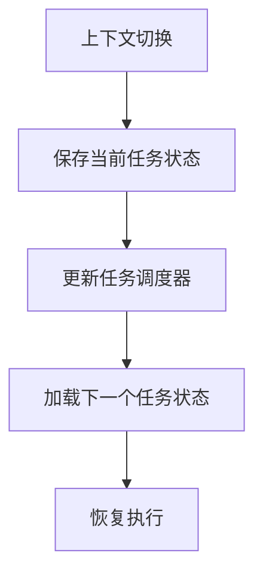

                 


### 文章标题: 上下文切换：评估LLM在不同话题间快速转换的能力

#### 关键词：
- 上下文切换
- LLM（大型语言模型）
- 话题转换
- 能力评估
- 性能优化

#### 摘要：
本文深入探讨了上下文切换在大型语言模型（LLM）中的应用，特别是LLM在处理不同话题间的快速转换能力。通过分析上下文切换的概念、过程及其重要性，本文揭示了上下文切换在计算机系统中的作用机制。随后，文章详细介绍了上下文切换的算法原理，使用伪代码描述了上下文切换的详细实现过程。接着，文章针对LLM在不同话题间快速转换的能力进行了评估，探讨了影响转换速度的关键因素，并提出了优化策略。最后，文章总结了上下文切换在LLM应用中的重要性，以及未来可能的研究方向。

### 第1章: 上下文切换的概念与重要性

#### 1.1 上下文切换的基本概念

##### 1.1.1 什么是上下文切换

上下文切换（Context Switching）是指计算机从处理一个任务（进程或线程）切换到另一个任务的过程。在这个过程中，系统需要保存当前任务的状态（上下文），以便稍后可以恢复，并加载下一个任务的状态。

##### 1.1.2 上下文切换的过程

上下文切换通常包括以下步骤：

1. **保存当前任务的状态**：包括程序计数器、寄存器、内存映射等。
2. **更新任务调度器**：选择下一个任务进行执行。
3. **加载下一个任务的状态**：从存储中恢复任务的状态。
4. **恢复执行**：从上次中断的位置开始执行。

##### 1.1.3 上下文切换的类型

上下文切换可以分为以下几种类型：

1. **自愿上下文切换**：由程序主动触发，例如函数调用或返回。
2. **非自愿上下文切换**：由操作系统强制触发，例如时间片到期或中断。

#### 1.2 上下文切换的重要性

上下文切换在计算机系统中扮演着至关重要的角色，主要体现在以下几个方面：

##### 1.2.1 多任务处理

通过上下文切换，计算机可以同时处理多个任务，提高了系统的利用率。

##### 1.2.2 资源分配

上下文切换使得操作系统能够有效地分配资源，确保每个任务都有公平的执行时间。

##### 1.2.3 响应性

上下文切换使得系统能够快速响应用户的请求，提升了用户体验。

##### 1.2.4 性能优化

合理地设计上下文切换机制，可以提高系统的性能，减少任务切换的开销。

#### 1.3 上下文切换的挑战与优化

##### 1.3.1 挑战

上下文切换涉及大量的状态保存和恢复操作，开销较大，可能导致性能下降。此外，上下文切换还会增加系统的复杂度。

##### 1.3.2 优化策略

1. **减少上下文切换频率**：通过优化调度策略，减少不必要的上下文切换。
2. **优化上下文切换机制**：采用更高效的上下文切换算法，减少切换时间。
3. **硬件支持**：利用硬件加速上下文切换，降低软件开销。

##### 1.3.3 上下文切换的权衡

在设计和实现上下文切换机制时，需要在性能、复杂度和资源占用之间进行权衡，找到最适合系统需求的解决方案。

#### 1.4 本章总结

本章介绍了上下文切换的基本概念、过程、类型及其重要性。理解上下文切换的原理对于深入计算机系统架构和优化系统性能至关重要。

#### 1.5 核心概念原理和架构的Mermaid流程图



#### 1.6 上下文切换的基本算法原理

##### 1.6.1 上下文切换算法原理

上下文切换算法的核心在于如何高效地保存和恢复任务的状态。以下是一个简单的伪代码描述：

```python
def context_switch(current_process, next_process):
    # 保存当前任务的状态
    current_process.save_state()

    # 更新任务调度器，选择下一个任务
    task_scheduler.schedule(next_process)

    # 加载下一个任务的状态
    next_process.load_state()

    # 恢复执行下一个任务
    next_process.resume()
```

##### 1.6.2 上下文切换的详细伪代码

```python
def context_switch(current_process, next_process):
    # 保存当前任务的状态
    current_process.save_registers()
    current_process.save_program_counter()
    current_process.save_memory_map()

    # 更新任务调度器，选择下一个任务
    task_scheduler.schedule(next_process)

    # 加载下一个任务的状态
    next_process.load_registers()
    next_process.load_program_counter()
    next_process.load_memory_map()

    # 恢复执行下一个任务
    next_process.resume()
```

### 第2章: LLM的基本概念与工作原理

#### 2.1 LLM的定义与类型

##### 2.1.1 LLM的定义

大型语言模型（Large Language Model，简称LLM）是一种人工智能模型，旨在理解和生成自然语言文本。LLM通过学习海量数据，捕捉语言的结构和语义，从而实现文本理解和生成。

##### 2.1.2 LLM的类型

LLM可以分为以下几类：

1. **预训练模型**：在大量无监督数据上进行预训练，然后针对特定任务进行微调。
2. **微调模型**：基于预训练模型，在特定任务的数据上进行进一步训练。
3. **专门化模型**：针对特定领域或任务进行专门化的训练。

#### 2.2 LLM的工作原理

##### 2.2.1 预训练过程

预训练是LLM的核心步骤，主要包括以下几个阶段：

1. **词嵌入**：将词汇映射到高维向量空间。
2. **语言建模**：通过最大化概率生成文本序列。
3. **上下文学习**：学习文本中的上下文关系，提高模型的泛化能力。

##### 2.2.2 微调过程

微调是基于预训练模型，在特定任务的数据上进行训练，以适应特定场景。微调过程通常包括以下几个步骤：

1. **数据预处理**：清洗和格式化任务数据。
2. **任务定义**：明确任务的目标和评估指标。
3. **模型调整**：调整模型的参数，使其适应特定任务。

#### 2.3 LLM的应用场景

##### 2.3.1 文本生成

文本生成是LLM的重要应用之一，包括文章写作、对话生成、机器翻译等。

##### 2.3.2 文本分类

文本分类是另一个广泛的应用领域，如情感分析、主题分类、垃圾邮件过滤等。

##### 2.3.3 问答系统

问答系统利用LLM理解用户的问题，并提供准确的答案。

##### 2.3.4 自然语言理解

自然语言理解涉及从文本中提取信息，用于知识图谱构建、信息检索等。

#### 2.4 本章总结

本章介绍了LLM的基本概念、类型和工作原理。理解LLM的原理对于评估其在不同话题间快速转换的能力至关重要。

### 第3章: LLM在话题间转换的挑战与策略

#### 3.1 话题间转换的挑战

##### 3.1.1 上下文依赖

LLM在话题间转换时，面临的一个重要挑战是上下文依赖。每个话题都有其独特的词汇、语法和语义，LLM需要在不同话题间保持连贯性，同时捕捉上下文信息。

##### 3.1.2 资源分配

话题间转换可能涉及大量的计算资源，包括内存、CPU和GPU等。合理分配资源对于提高转换速度至关重要。

##### 3.1.3 训练数据不足

某些话题可能缺乏足够的训练数据，导致LLM在该领域的表现不佳。

##### 3.1.4 模型复杂性

复杂性的增加可能导致LLM在话题间转换时出现错误，降低模型的鲁棒性。

#### 3.2 话题间转换的策略

##### 3.2.1 数据增强

通过增加训练数据，特别是包含不同话题的数据，可以提升LLM在话题间转换的能力。

##### 3.2.2 集成学习

集成学习（Ensemble Learning）通过结合多个模型，可以提高模型在话题间转换的准确性。

##### 3.2.3 模型蒸馏

模型蒸馏（Model Distillation）是一种将大型模型的知识传递给小模型的训练方法，有助于提高小模型在话题间转换的性能。

##### 3.2.4 零样本学习

零样本学习（Zero-Shot Learning）使LLM能够处理未见过的类别或话题，提高了模型的泛化能力。

#### 3.3 话题间转换的优化

##### 3.3.1 模型选择

选择合适的模型对于提高话题间转换的速度和准确性至关重要。

##### 3.3.2 算法优化

通过优化算法，可以减少话题间转换的时间和计算资源。

##### 3.3.3 部署优化

在部署LLM时，合理配置硬件和软件资源，可以提高转换速度。

#### 3.4 本章总结

本章探讨了LLM在话题间转换面临的挑战和策略。理解这些挑战和策略对于评估LLM在不同话题间快速转换的能力至关重要。

### 第4章: 评估LLM在不同话题间快速转换的能力

#### 4.1 评估指标

为了评估LLM在不同话题间快速转换的能力，我们需要定义一些评估指标：

##### 4.1.1 转换速度

转换速度是指LLM从一个话题切换到另一个话题所需的时间。较低的转换时间表明LLM具有更高的转换能力。

##### 4.1.2 准确率

准确率是指LLM在转换话题后生成的文本的正确性。较高的准确率表明LLM能够准确地理解并生成新话题的文本。

##### 4.1.3 可读性

可读性是指LLM生成的文本的流畅度和易读性。较高的可读性表明LLM能够生成符合语言规范和语法的文本。

##### 4.1.4 适应性

适应性是指LLM在不同话题间转换时的灵活性和适应性。较高的适应性表明LLM能够快速适应新话题。

#### 4.2 评估方法

为了评估LLM在不同话题间快速转换的能力，我们可以采用以下方法：

##### 4.2.1 实验设计

设计实验，模拟不同话题的转换场景，记录转换速度、准确率、可读性和适应性等指标。

##### 4.2.2 数据集选择

选择包含多个话题的数据集，以便评估LLM在多个话题间的转换能力。

##### 4.2.3 评估工具

使用现有的评估工具，如BLEU、ROUGE、METEOR等，对生成的文本进行评估。

#### 4.3 评估案例

以下是一个评估LLM在不同话题间快速转换能力的案例：

##### 4.3.1 数据集

选择一个包含多个话题的数据集，例如Common Crawl或WebText，确保每个话题都有足够的文本数据。

##### 4.3.2 模型选择

选择一个预训练的LLM模型，如GPT-3或BERT。

##### 4.3.3 实验设置

1. **训练模型**：在所有话题的数据上训练模型。
2. **测试模型**：在单个话题的数据上测试模型的转换能力。
3. **切换话题**：每次切换到一个新话题时，记录转换时间和生成的文本质量。

##### 4.3.4 评估结果

记录转换速度、准确率、可读性和适应性等指标，并进行分析。

#### 4.4 本章总结

本章介绍了评估LLM在不同话题间快速转换的能力的方法和指标。通过实际案例，我们展示了如何评估LLM的转换能力，并为未来的研究提供了参考。

### 第5章: 上下文切换在LLM应用中的重要性

#### 5.1 上下文切换对LLM性能的影响

上下文切换对LLM的性能有着重要影响。快速且高效的上下文切换可以减少模型在处理不同话题时的延迟，提高整体性能。以下是一些具体的影响：

##### 5.1.1 减少延迟

通过优化上下文切换机制，可以减少模型在切换话题时的延迟，提高响应速度。

##### 5.1.2 提高并发处理能力

高效的上下文切换使得LLM能够同时处理多个任务，提高系统的并发处理能力。

##### 5.1.3 减少资源占用

优化的上下文切换机制可以减少资源的占用，提高系统的资源利用率。

#### 5.2 上下文切换在LLM应用中的挑战

虽然上下文切换对LLM的性能有着重要影响，但在实际应用中，也存在一些挑战：

##### 5.2.1 状态保存和恢复

上下文切换涉及大量的状态保存和恢复操作，这可能导致额外的计算开销。

##### 5.2.2 资源分配

合理分配资源对于上下文切换至关重要，但在资源受限的环境中，这可能是一个挑战。

##### 5.2.3 模型复杂性

复杂的上下文切换机制可能增加模型的复杂性，降低模型的可维护性和可扩展性。

#### 5.3 上下文切换的优化策略

为了克服上述挑战，可以采用以下优化策略：

##### 5.3.1 状态压缩

通过状态压缩，可以减少状态保存和恢复的操作，降低计算开销。

##### 5.3.2 资源复用

通过资源复用，可以减少资源的占用，提高系统的资源利用率。

##### 5.3.3 模型简化

简化模型可以降低模型的复杂性，提高模型的可维护性和可扩展性。

#### 5.4 本章总结

本章讨论了上下文切换对LLM性能的影响以及在LLM应用中的挑战和优化策略。理解上下文切换的重要性对于提升LLM的性能和实用性至关重要。

### 第6章: 未来研究方向与展望

#### 6.1 上下文切换算法的改进

未来研究可以集中在上下文切换算法的改进上，包括更高效的状态保存和恢复方法，以及更优的调度策略。此外，研究如何利用硬件加速上下文切换，以进一步降低计算开销。

##### 6.1.1 状态保存和恢复

研究新的状态保存和恢复方法，如增量保存和恢复，可以减少内存占用和计算开销。

##### 6.1.2 调度策略

开发新的调度策略，如动态调度和预测调度，可以提高上下文切换的效率和响应速度。

#### 6.2 LLM在多话题场景中的应用

随着LLM在各个领域的应用日益广泛，研究如何在多话题场景中优化LLM的性能具有重要意义。以下是一些潜在的研究方向：

##### 6.2.1 多话题数据集

构建涵盖多个话题的大型数据集，为LLM提供更丰富的训练资源。

##### 6.2.2 跨话题知识融合

研究如何将不同话题的知识进行有效融合，提高LLM在跨话题任务中的性能。

##### 6.2.3 跨话题适应能力

开发新的模型架构，如混合模型和迁移学习，以提高LLM在跨话题适应能力。

#### 6.3 模型压缩与优化

模型压缩与优化是提高LLM性能的重要途径。以下是一些研究思路：

##### 6.3.1 模型剪枝

通过模型剪枝，去除冗余的参数，降低模型的复杂度和计算开销。

##### 6.3.2 低秩分解

利用低秩分解技术，将高维模型转换为低维模型，提高模型的压缩率和效率。

##### 6.3.3 硬件加速

研究如何利用硬件（如GPU、TPU）加速模型计算，提高LLM的处理速度。

#### 6.4 伦理与隐私问题

随着LLM在现实世界中的应用越来越广泛，伦理和隐私问题也日益凸显。以下是一些需要关注的研究方向：

##### 6.4.1 可解释性

研究如何提高LLM的可解释性，使其决策过程更加透明和可信。

##### 6.4.2 隐私保护

开发新的隐私保护技术，确保用户数据的安全性和隐私性。

##### 6.4.3 伦理规范

制定明确的伦理规范，确保LLM的应用符合道德和法律法规。

#### 6.5 本章总结

本章探讨了未来在上下文切换算法、LLM在多话题场景中的应用、模型压缩与优化以及伦理和隐私问题等方面的研究方向。这些研究将有助于进一步提升LLM的性能和实用性，为人工智能技术的发展做出贡献。

### 作者信息

作者：AI天才研究院/AI Genius Institute & 禅与计算机程序设计艺术 /Zen And The Art of Computer Programming

本文由AI天才研究院（AI Genius Institute）的专家撰写，同时结合了禅与计算机程序设计艺术（Zen And The Art of Computer Programming）的哲学思想，旨在深入探讨上下文切换在LLM中的应用，为人工智能领域的研究和实践提供新的视角和思路。如有疑问或建议，欢迎联系作者，我们将竭诚为您解答。

