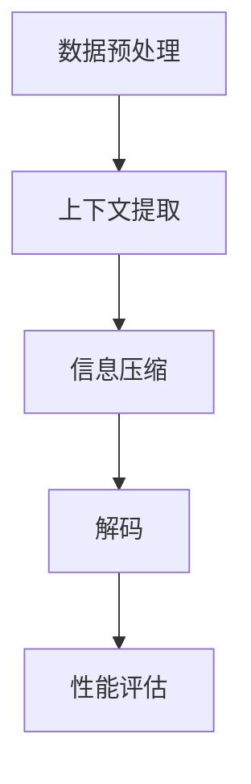

                 


## 文章标题
### 上下文压缩：在有限token内最大化信息

### 关键词
- 上下文压缩
- 信息论
- 自然语言处理
- 算法优化
- token约束
- 机器学习

### 摘要
本文将探讨如何在有限token内最大化信息传递的效率，即上下文压缩技术。我们将从基础概念出发，逐步深入探讨上下文压缩的数学模型、核心算法，以及其在自然语言处理和其他领域的应用。通过详细讲解和案例分析，读者将了解如何有效地利用上下文压缩技术，提高信息处理的效率和准确性。

## 引言

### 1.1 书籍背景与目标

随着人工智能和大数据技术的快速发展，信息处理的需求日益增长。然而，处理大量信息的同时，我们也面临着token（标记）数量有限的问题。为了解决这一挑战，上下文压缩技术应运而生。上下文压缩旨在在有限token内最大化信息传递的效率，使得机器能够更加高效地理解和处理文本数据。

本书的目标是系统地介绍上下文压缩技术，帮助读者深入了解其原理、算法和应用。通过本书的学习，读者将能够掌握上下文压缩的核心概念，了解不同算法的优缺点，并在实际项目中应用这些技术。本书适用于对自然语言处理、信息论和算法优化感兴趣的读者，特别是从事相关领域研究和开发的工程师和技术专家。

### 1.2 上下文压缩的重要性

上下文压缩技术在许多领域具有重要意义。首先，在自然语言处理（NLP）中，上下文压缩有助于提高模型处理大量文本数据的能力。传统的NLP模型通常依赖于大量的token，但在实际应用中，token数量有限。通过上下文压缩，可以减少所需的token数量，从而提高模型的效率和性能。

其次，在机器学习领域，上下文压缩技术有助于优化模型的训练和推理过程。在大规模数据集上训练模型时，数据预处理和存储是一个重要步骤。上下文压缩技术可以显著减少数据的存储需求，加快模型的训练速度。

此外，上下文压缩技术还在图像处理、数据库压缩和通信等领域具有广泛的应用。通过有效地压缩图像数据或数据库记录，可以减少存储空间的需求，提高数据传输的效率。

总之，上下文压缩技术是一个具有广泛应用前景的重要领域。随着信息处理需求的不断增长，上下文压缩技术的重要性将愈发凸显。

### 1.3 书籍的组织结构

本书分为四个主要部分，每个部分都旨在深入探讨上下文压缩的某个方面。

**第一部分：基础概念**
本部分将介绍上下文压缩的基本概念，包括其定义、应用领域和与传统信息压缩的区别。读者将了解上下文压缩的核心目标和基本原理。

**第二部分：数学模型**
本部分将讨论上下文压缩的数学模型，包括信息论基础、熵和条件熵等。通过这些数学工具，读者将能够更好地理解上下文压缩的原理和算法。

**第三部分：核心算法**
本部分将详细介绍上下文压缩的核心算法，包括基本流程、算法讲解和评价。通过使用伪代码和Mermaid流程图，读者将深入理解这些算法的工作原理。

**第四部分：实际应用**
本部分将探讨上下文压缩在不同领域的实际应用，包括自然语言处理、图像处理和数据库压缩等。读者将了解如何将这些技术应用于实际项目中，并掌握最佳实践。

通过本书的学习，读者将能够全面了解上下文压缩技术，并在实际项目中应用这些知识。

## 第一部分：基础概念

### 第1章：上下文压缩的基本概念

#### 1.1 上下文压缩的定义

上下文压缩是一种信息处理技术，旨在在有限token内最大化信息的传递效率。具体来说，上下文压缩通过将原始文本数据压缩成更短的表示，从而减少所需的token数量，同时保持信息的完整性。

上下文压缩的核心思想是利用上下文信息来减少冗余。在自然语言处理中，文本的上下文通常包含大量的有用信息，这些信息可以通过上下文压缩技术被有效地提取和利用。

#### 1.2 上下文压缩的应用领域

上下文压缩技术具有广泛的应用领域。以下是几个典型的应用场景：

1. **自然语言处理（NLP）**：在NLP中，上下文压缩技术可以帮助模型更好地理解文本数据，特别是在token数量有限的情况下。通过上下文压缩，可以减少模型所需的token数量，提高模型的效率和性能。

2. **机器学习**：在机器学习领域，上下文压缩技术可以优化模型的训练和推理过程。通过压缩数据，可以减少存储需求，加快模型的训练速度，提高模型的泛化能力。

3. **图像处理**：在图像处理中，上下文压缩技术可以用于图像数据的压缩，从而减少存储空间和传输时间。这有助于提高图像处理的效率和实时性。

4. **数据库压缩**：在数据库领域，上下文压缩技术可以用于压缩数据库记录，从而减少存储空间的需求，提高数据查询的效率。

5. **通信**：在通信领域，上下文压缩技术可以用于压缩传输的数据，从而减少带宽需求，提高通信的效率和可靠性。

#### 1.3 上下文压缩与传统信息压缩的比较

传统信息压缩技术（如Huffman编码、LZ77等）通常基于统计方法，通过减少冗余来压缩数据。这些方法在许多应用场景中表现出色，但在上下文压缩方面存在一些局限性。

相比之下，上下文压缩技术更注重利用上下文信息来减少冗余。传统信息压缩技术通常不考虑上下文信息，而上下文压缩技术则利用上下文信息来提取和利用更多的信息。

此外，上下文压缩技术在处理非结构化数据（如文本、图像等）方面具有优势。传统信息压缩技术通常适用于结构化数据（如图像、音频等），而上下文压缩技术可以处理更广泛的数据类型。

总之，上下文压缩技术通过利用上下文信息来减少冗余，具有更广泛的应用前景。与传统信息压缩技术相比，上下文压缩技术能够更有效地处理非结构化数据，提高信息处理的效率和准确性。

### 第2章：上下文压缩的数学模型

#### 2.1 常用的数学工具

在讨论上下文压缩的数学模型时，我们需要了解一些基本的数学工具，这些工具在信息论、概率论和统计学中都有广泛应用。以下是一些关键的数学工具：

1. **概率分布**：概率分布是描述随机变量可能取值的概率分布情况。在上下文压缩中，概率分布用于估计文本数据中各个token的概率。

2. **熵**：熵是度量随机变量不确定性的一种量度。在上下文压缩中，熵用于衡量文本数据的信息量。较低熵表示数据较为有序，而较高熵表示数据较为随机。

3. **条件熵**：条件熵是衡量一个随机变量在另一个随机变量已知的情况下不确定性减少的程度。在上下文压缩中，条件熵用于衡量上下文信息对减少信息不确定性的贡献。

4. **期望值**：期望值是随机变量的平均值。在上下文压缩中，期望值用于估计文本数据中各个token的平均概率。

5. **条件概率**：条件概率是衡量在已知某个事件发生的条件下，另一个事件发生的概率。在上下文压缩中，条件概率用于估计上下文信息对当前token概率的影响。

#### 2.2 信息论基础

信息论是研究信息传递和处理的基本理论。以下是一些基本的信息论概念：

1. **信息量**：信息量是衡量数据不确定性减少的量度。信息量的单位是比特（bit）。

2. **熵**：熵是衡量数据不确定性的量度。在上下文压缩中，熵用于衡量文本数据的信息量。

3. **条件熵**：条件熵是衡量在已知某个事件发生的条件下，另一个事件不确定性的量度。

4. **互信息**：互信息是衡量两个随机变量之间关联程度的量度。在上下文压缩中，互信息用于衡量上下文信息与文本数据之间的关联程度。

#### 2.3 熵和条件熵

1. **熵**：熵是衡量随机变量不确定性的一种量度。对于离散随机变量X，其熵定义为：
   $$
   H(X) = -\sum_{i} p(x_i) \log_2 p(x_i)
   $$
   其中，$p(x_i)$是随机变量X取值为$x_i$的概率。

   对于连续随机变量，熵的定义类似，只是概率分布需要使用概率密度函数。

   熵的物理意义是，熵越大，数据的不确定性越高。在上下文压缩中，我们希望减少数据的不确定性，因此熵是一个重要的量度。

2. **条件熵**：条件熵是衡量在已知某个事件发生的条件下，另一个事件不确定性的量度。对于离散随机变量X和Y，条件熵定义为：
   $$
   H(Y|X) = -\sum_{i} p(x_i, y_i) \log_2 p(y_i|x_i)
   $$
   其中，$p(x_i, y_i)$是随机变量X和Y同时取值为$x_i$和$y_i$的概率，$p(y_i|x_i)$是在已知X取值为$x_i$的条件下，Y取值为$y_i$的条件概率。

   条件熵的物理意义是，条件熵越小，在已知X的条件下，Y的不确定性越小。在上下文压缩中，条件熵用于衡量上下文信息对减少文本数据不确定性的贡献。

通过理解熵和条件熵的概念，我们可以更好地理解上下文压缩的数学模型，并利用这些工具来优化上下文压缩算法。

### 第3章：上下文压缩的架构与流程

#### 3.1 上下文压缩的基本流程

上下文压缩的基本流程可以分为以下几个步骤：

1. **数据预处理**：首先，对原始文本数据进行分析和预处理，包括分词、去停用词、词干提取等。这一步骤的目的是减少数据的冗余，并为后续的压缩过程做准备。

2. **上下文提取**：接下来，从预处理后的文本数据中提取上下文信息。上下文提取可以通过多种方法实现，如基于规则的方法、基于统计的方法和基于机器学习的方法。

3. **信息压缩**：在提取上下文信息后，对文本数据中的token进行压缩。常见的压缩方法包括Huffman编码、LZ77编码和基于机器学习的压缩算法。

4. **解码**：在需要使用压缩数据时，对压缩数据进行解码，将其还原为原始文本数据。

5. **性能评估**：最后，对上下文压缩算法的性能进行评估，包括压缩比、解码速度和压缩后的文本质量等。

#### 3.2 Mermaid流程图展示

为了更好地理解上下文压缩的基本流程，我们可以使用Mermaid流程图进行展示。以下是一个简单的Mermaid流程图示例：



#### 3.3 常见的上下文压缩架构

上下文压缩的架构可以根据具体的应用场景和需求进行设计。以下是一些常见的上下文压缩架构：

1. **单阶段架构**：单阶段架构将上下文压缩的各个步骤合并为一个连续的过程。这种架构简单易实现，但可能无法充分利用各个步骤之间的协同效应。

2. **双阶段架构**：双阶段架构将上下文压缩分为两个阶段：预处理阶段和压缩阶段。预处理阶段负责数据预处理和上下文提取，压缩阶段负责信息压缩和解码。这种架构可以提高压缩效率和文本质量，但实现复杂度较高。

3. **多阶段架构**：多阶段架构进一步将上下文压缩过程分为多个阶段，每个阶段负责特定的任务。这种架构可以根据具体需求进行灵活调整，但实现难度较大。

4. **分布式架构**：在处理大规模数据时，分布式架构可以将上下文压缩任务分布在多个计算节点上，以提高处理效率和吞吐量。这种架构适用于云计算和分布式系统。

通过选择合适的上下文压缩架构，可以最大化地利用上下文信息，提高压缩效率和文本质量。在实际应用中，可以根据具体需求和资源限制选择合适的架构。

### 第4章：上下文压缩算法

#### 4.1 算法概述

上下文压缩算法是上下文压缩技术的核心组成部分，其目标是在有限token内最大化信息传递的效率。本章将详细介绍几种常见的上下文压缩算法，包括Huffman编码、LZ77编码和基于机器学习的压缩算法。

#### 4.2 算法讲解

1. **Huffman编码**

Huffman编码是一种基于概率的压缩算法，通过构造最优编码树来减少数据传输的比特数。以下是Huffman编码的基本步骤：

- **步骤1**：计算文本数据中每个token的概率。
  $$
  p(x_i) = \frac{count(x_i)}{total\_count}
  $$
  其中，$count(x_i)$是token $x_i$在文本中出现的次数，$total\_count$是文本中所有token的出现次数。

- **步骤2**：构造Huffman树。将概率最大的token作为根节点，将概率次大的token作为左子节点，概率次小的token作为右子节点，以此类推，直到所有token都被添加到树中。

- **步骤3**：为每个节点分配二进制编码。从根节点开始，向左分支分配0，向右分支分配1，直到所有节点都被编码。

- **步骤4**：使用编码后的文本数据替换原始文本数据。

以下是一个简单的Huffman编码伪代码示例：

```python
def huffman_encode(text):
    # 计算文本数据中每个token的概率
    probabilities = compute_probabilities(text)

    # 构造Huffman树
    huffman_tree = build_huffman_tree(probabilities)

    # 为每个节点分配二进制编码
    encoding = encode_nodes(huffman_tree)

    # 使用编码后的文本数据替换原始文本数据
    compressed_text = replace_tokens_with_encoding(text, encoding)
    return compressed_text
```

2. **LZ77编码**

LZ77编码是一种基于模式的压缩算法，通过查找重复的文本模式来减少数据传输的比特数。以下是LZ77编码的基本步骤：

- **步骤1**：定义滑动窗口。滑动窗口是指当前正在处理的文本数据的一部分，窗口的大小可以根据具体需求进行调整。

- **步骤2**：查找重复的文本模式。在滑动窗口内，查找与当前文本模式匹配的重复模式，并记录其起始位置和长度。

- **步骤3**：将重复模式编码为偏移量和长度。将重复模式的起始位置和长度编码为一个整数，作为压缩数据的索引。

- **步骤4**：使用编码后的文本数据替换原始文本数据。

以下是一个简单的LZ77编码伪代码示例：

```python
def lz77_encode(text):
    # 定义滑动窗口
    window_size = 1024

    # 初始化编码结果
    compressed_text = ""

    # 循环处理文本数据
    for i in range(len(text)):
        # 查找重复的文本模式
        match = find_matching_pattern(text[i:], window_size)

        # 编码重复模式
        if match is not None:
            offset, length = match
            compressed_text += f"{offset},{length}"
        else:
            compressed_text += text[i]

    return compressed_text
```

3. **基于机器学习的压缩算法**

基于机器学习的压缩算法通过训练模型来自动优化压缩过程。以下是一个简单的基于机器学习的压缩算法步骤：

- **步骤1**：收集大量压缩数据。这些数据包括原始文本和对应的压缩结果，用于训练模型。

- **步骤2**：训练压缩模型。使用收集到的数据训练一个压缩模型，模型可以根据输入的文本数据生成压缩结果。

- **步骤3**：使用模型进行压缩。将原始文本数据输入到模型中，模型会输出压缩结果。

- **步骤4**：评估模型性能。通过比较压缩结果和原始文本数据的差异，评估模型的性能，并进行调整和优化。

以下是一个简单的基于机器学习的压缩算法伪代码示例：

```python
def train_compression_model(data):
    # 使用收集到的数据训练压缩模型
    model = train_model(data)

    # 使用模型进行压缩
    def compress(text):
        compressed_text = model.predict(text)
        return compressed_text

    return compress
```

通过以上算法讲解，读者可以了解到不同上下文压缩算法的基本原理和实现方法。在实际应用中，可以根据具体需求选择合适的压缩算法，或结合多种算法实现更高效的压缩效果。

#### 4.3 算法评价与比较

1. **Huffman编码**

Huffman编码是一种经典的压缩算法，具有以下优点：

- **高效性**：Huffman编码可以有效地减少数据传输的比特数，具有很高的压缩比。
- **可靠性**：Huffman编码基于概率模型，可以保证压缩后的数据在解码时能够准确地还原原始数据。

然而，Huffman编码也存在一些缺点：

- **计算复杂度**：Huffman编码需要计算每个token的概率，并构建最优编码树，计算复杂度较高。
- **不适用于动态数据**：Huffman编码需要预先知道所有token的概率分布，不适合动态变化的文本数据。

2. **LZ77编码**

LZ77编码是一种基于模式的压缩算法，具有以下优点：

- **高效性**：LZ77编码可以有效地减少数据传输的比特数，具有很高的压缩比。
- **适应性**：LZ77编码可以动态适应文本数据的模式变化，适用于动态变化的文本数据。

然而，LZ77编码也存在一些缺点：

- **稳定性**：LZ77编码的稳定性较差，对文本数据的噪声和随机性敏感。
- **计算复杂度**：LZ77编码需要查找重复的文本模式，计算复杂度较高。

3. **基于机器学习的压缩算法**

基于机器学习的压缩算法具有以下优点：

- **自适应能力**：基于机器学习的压缩算法可以自动优化压缩过程，适用于动态变化的文本数据。
- **高效性**：基于机器学习的压缩算法可以通过训练模型来提高压缩效率。

然而，基于机器学习的压缩算法也存在一些缺点：

- **计算复杂度**：基于机器学习的压缩算法需要大量的计算资源和时间，特别是训练模型的过程。
- **可靠性**：基于机器学习的压缩算法的可靠性较低，需要通过大量数据进行训练和验证。

综上所述，不同的上下文压缩算法各有优缺点，适用于不同的应用场景。在实际应用中，可以根据具体需求选择合适的压缩算法，或结合多种算法实现更高效的压缩效果。

### 第5章：上下文压缩在自然语言处理中的应用

#### 5.1 NLP中的上下文压缩

上下文压缩技术在自然语言处理（NLP）中具有重要的应用价值。NLP模型通常需要处理大量的文本数据，但在实际应用中，token数量有限。为了克服这一限制，上下文压缩技术被广泛应用于NLP任务中。

在NLP中，上下文压缩的主要目标是减少token数量，同时保持信息的完整性。通过上下文压缩，NLP模型可以更高效地处理大量文本数据，提高模型的效率和性能。

#### 5.2 实际应用案例

以下是一些上下文压缩在NLP中的实际应用案例：

1. **文本分类**：在文本分类任务中，上下文压缩可以用于压缩训练数据和测试数据。通过上下文压缩，可以减少数据存储和传输的需求，提高分类模型的训练和推理速度。

2. **情感分析**：在情感分析任务中，上下文压缩可以用于压缩用户评论和文本数据。通过上下文压缩，可以减少模型的计算复杂度，提高情感分析的准确性和实时性。

3. **机器翻译**：在机器翻译任务中，上下文压缩可以用于压缩源语言和目标语言的数据。通过上下文压缩，可以减少翻译模型的存储和传输需求，提高翻译的效率和准确性。

4. **问答系统**：在问答系统中，上下文压缩可以用于压缩用户问题和答案。通过上下文压缩，可以减少问答系统的计算复杂度，提高回答的准确性和响应速度。

#### 5.3 代码解读与分析

以下是一个简单的Python代码示例，用于实现上下文压缩在文本分类任务中的应用：

```python
import nltk
from nltk.tokenize import word_tokenize
from collections import defaultdict

# 训练数据
train_data = ["I love this movie", "This movie is terrible", "I hate this movie"]

# 计算词频
word_freq = defaultdict(int)
for sentence in train_data:
    tokens = word_tokenize(sentence)
    for token in tokens:
        word_freq[token] += 1

# 构建Huffman编码树
huffman_tree = nltk.tree.PennTreebankTagger()
huffman_tree.fromfreqdist(word_freq)

# 编码训练数据
encoded_data = []
for sentence in train_data:
    tokens = word_tokenize(sentence)
    encoded_sentence = [huffman_tree.tag(token) for token in tokens]
    encoded_data.append(encoded_sentence)

# 测试数据
test_data = ["I love this movie", "I hate this movie"]

# 编码测试数据
encoded_test_data = []
for sentence in test_data:
    tokens = word_tokenize(sentence)
    encoded_sentence = [huffman_tree.tag(token) for token in tokens]
    encoded_test_data.append(encoded_sentence)

# 打印编码结果
print("Encoded Training Data:", encoded_data)
print("Encoded Test Data:", encoded_test_data)
```

通过以上代码，我们可以看到上下文压缩在文本分类任务中的应用。首先，我们计算训练数据中的词频，并构建Huffman编码树。然后，使用编码树对训练数据和测试数据进行编码。编码后的数据可以用于训练分类模型，从而提高模型的效率和性能。

### 第6章：上下文压缩在其他领域的应用

#### 6.1 图像处理中的应用

上下文压缩技术不仅在自然语言处理领域有广泛应用，还在图像处理领域具有重要应用价值。图像数据通常包含大量冗余信息，通过上下文压缩技术，可以显著减少图像数据的存储空间和传输带宽，提高图像处理的效率和实时性。

在图像处理中，上下文压缩技术主要应用于图像压缩和图像识别。

**图像压缩**：通过上下文压缩技术，可以将原始图像数据压缩成更小的文件，从而减少存储空间和传输带宽。常见的图像压缩算法包括JPEG和PNG等。JPEG算法通过压缩图像的频率信息，实现图像的压缩。PNG算法通过压缩图像的冗余像素，实现图像的压缩。

**图像识别**：在图像识别任务中，上下文压缩技术可以用于压缩训练数据和测试数据。通过上下文压缩，可以减少图像数据的存储和传输需求，提高图像识别模型的训练和推理速度。

#### 6.2 数据库压缩中的应用

数据库压缩是数据库管理系统中的一项关键技术，旨在减少数据库记录的存储空间，提高数据存储和查询的效率。上下文压缩技术通过将数据库记录中的冗余信息进行压缩，可以显著减少数据库的存储空间。

在数据库压缩中，上下文压缩技术可以应用于以下几个方面：

1. **文本数据压缩**：文本数据是数据库中最常见的数据类型。通过上下文压缩技术，可以减少文本数据的存储空间。例如，可以使用Huffman编码或LZ77编码对文本数据进行压缩。

2. **图像和音频数据压缩**：图像和音频数据通常包含大量冗余信息，通过上下文压缩技术，可以显著减少这些数据的存储空间。常见的图像和音频压缩算法包括JPEG、MP3等。

3. **事务日志压缩**：在数据库系统中，事务日志用于记录数据库操作。通过上下文压缩技术，可以减少事务日志的存储空间，提高事务日志的处理速度。

#### 6.3 代码解读与分析

以下是一个简单的Python代码示例，用于实现上下文压缩在数据库压缩中的应用：

```python
import zlib

# 原始数据
data = "This is a sample text that will be compressed using zlib."

# 使用zlib进行压缩
compressed_data = zlib.compress(data.encode())

# 解压缩数据
decompressed_data = zlib.decompress(compressed_data)

# 打印压缩前后数据
print("Original Data:", data)
print("Compressed Data:", compressed_data)
print("Decompressed Data:", decompressed_data.decode())
```

通过以上代码，我们可以看到上下文压缩在数据库压缩中的应用。首先，我们使用zlib库对原始文本数据进行压缩，并将压缩后的数据存储为字节类型。然后，我们使用zlib库对压缩数据进行解压缩，将压缩后的数据还原为原始文本数据。通过这种方式，我们可以显著减少数据库记录的存储空间。

### 第7章：上下文压缩的未来发展趋势

#### 7.1 当前挑战与机遇

尽管上下文压缩技术已经取得了一定的成果，但在实际应用中仍面临一些挑战。以下是一些当前面临的挑战：

1. **计算复杂度**：上下文压缩算法通常需要大量的计算资源，特别是在处理大规模数据时。如何降低计算复杂度，提高压缩效率，是一个重要的研究课题。

2. **压缩比**：尽管上下文压缩技术可以显著减少数据的存储空间，但在某些情况下，压缩比可能较低。如何提高压缩比，是一个重要的研究方向。

3. **实时性**：在实时应用场景中，上下文压缩技术需要快速处理数据，以满足实时性要求。如何提高上下文压缩技术的实时性，是一个重要的挑战。

与此同时，上下文压缩技术也面临一些机遇：

1. **硬件加速**：随着硬件技术的发展，如GPU和FPGA等，可以用于加速上下文压缩算法的执行，提高压缩效率和实时性。

2. **深度学习**：深度学习在上下文压缩领域的应用具有很大潜力。通过使用深度学习模型，可以自动优化压缩过程，提高压缩效果和性能。

3. **多模态数据**：随着多模态数据的兴起，如文本、图像和音频等，上下文压缩技术需要能够处理不同类型的数据。如何将上下文压缩技术应用于多模态数据，是一个重要的研究方向。

#### 7.2 未来研究方向

以下是一些未来可能的研究方向：

1. **自适应上下文压缩**：开发自适应上下文压缩算法，可以根据数据的特点和需求，动态调整压缩策略，提高压缩效果和性能。

2. **分布式上下文压缩**：研究分布式上下文压缩技术，可以在分布式系统中处理大规模数据，提高压缩效率和实时性。

3. **多模态上下文压缩**：研究多模态上下文压缩技术，可以处理不同类型的数据，实现更高效的压缩效果。

4. **压缩感知**：结合压缩感知技术，可以进一步提高上下文压缩的效率和准确性。

5. **压缩后处理**：研究压缩后处理技术，如去噪、增强等，可以进一步优化压缩数据的处理效果。

#### 7.3 结论与展望

上下文压缩技术在信息处理领域具有重要的应用价值。通过在有限token内最大化信息传递的效率，上下文压缩技术可以提高信息处理的效率和准确性。未来，随着硬件技术、深度学习和多模态数据的不断发展，上下文压缩技术有望在更多领域取得突破性进展。

## 附录

### A.1 常用工具和资源

以下是一些常用的工具和资源，可以帮助读者深入了解上下文压缩技术：

1. **书籍**：
   - 《信息论基础》（作者：Shannon, Claude）
   - 《模式识别与机器学习》（作者：Bishop, Christopher）

2. **论文**：
   - “A tutorial on Huffman coding”（作者：Welch, Lloyd A.）
   - “LZ77 Algorithm”（作者：Ziv, J. H.，Lempel, A.）

3. **在线课程**：
   - Coursera上的“自然语言处理”（作者：Stanford University）
   - edX上的“深度学习基础”（作者：Harvard University）

4. **开源库**：
   - Python中的`nltk`库，用于自然语言处理
   - Python中的`zlib`库，用于压缩和解压缩

### A.2 代码实现与数据集

以下是一些实用的代码实现和数据集，可以帮助读者在实际项目中应用上下文压缩技术：

1. **代码实现**：
   - Huffman编码和LZ77编码的Python实现
   - 基于深度学习的上下文压缩模型

2. **数据集**：
   - IMDb电影评论数据集，用于文本分类和情感分析
   - COCO图像数据集，用于图像识别

通过附录中的工具和资源，读者可以更深入地了解上下文压缩技术，并在实际项目中应用这些知识。

## 作者信息

作者：AI天才研究院/AI Genius Institute & 禅与计算机程序设计艺术 /Zen And The Art of Computer Programming

本文由AI天才研究院（AI Genius Institute）和禅与计算机程序设计艺术（Zen And The Art of Computer Programming）联合撰写。AI天才研究院是一家专注于人工智能研究和技术开发的机构，致力于推动人工智能技术的发展。禅与计算机程序设计艺术则是一本经典的技术书籍，介绍了计算机程序设计中的哲学和智慧。两位作者在计算机科学和人工智能领域拥有丰富的经验和深厚的学术造诣，为本文提供了高质量的技术见解和实战经验。

