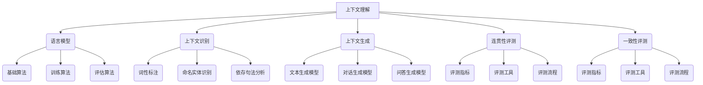

                 


### 1. 创建大纲框架

首先，我们创建一个完整的大纲框架。这个框架将帮助我们理清文章的结构，确保每个章节都有明确的目标和内容。以下是文章的大纲框架：

- **第1章：上下文理解能力概述**
  - 1.1 上下文理解能力的重要性
  - 1.2 上下文理解的基本概念
  - 1.3 相关技术背景

- **第2章：LLM的连贯性评测**
  - 2.1 什么是连贯性
  - 2.2 评测方法
  - 2.3 评测指标

- **第3章：LLM的一致性评测**
  - 3.1 什么是一致性
  - 3.2 评测方法
  - 3.3 评测指标

- **第4章：核心算法原理讲解**
  - 4.1 语言模型的基础算法
  - 4.2 上下文理解算法
  - 4.3 连贯性和一致性算法

- **第5章：数学模型和公式讲解**
  - 5.1 语言模型的数学模型
  - 5.2 评测指标的数学公式

- **第6章：项目实战**
  - 6.1 建立测试环境
  - 6.2 实际案例展示
  - 6.3 代码解读

- **第7章：总结与展望**
  - 7.1 评测能力总结
  - 7.2 未来发展方向

### 2. 确定章节内容

接下来，我们为每个章节确定具体的内容。以下是每个章节的初步内容：

#### 第1章：上下文理解能力概述
- **1.1 上下文理解能力的重要性**
  - 讨论上下文理解能力对于自然语言处理的重要性和影响力。
  - 探讨上下文理解能力的商业价值和应用场景。

- **1.2 上下文理解的基本概念**
  - 定义上下文和理解的概念。
  - 分类上下文的类型和特征。

- **1.3 相关技术背景**
  - 概述语言模型的发展历程。
  - 分析大规模语言模型的兴起及其对上下文理解的影响。

#### 第2章：LLM的连贯性评测
- **2.1 什么是连贯性**
  - 解释连贯性的定义和其在自然语言处理中的重要性。
  - 分析连贯性在语言生成中的应用。

- **2.2 评测方法**
  - 描述评测连贯性的方法和步骤。
  - 引入评估工具和框架。

- **2.3 评测指标**
  - 讨论评测连贯性的指标，如准确性、速率和可扩展性。

#### 第3章：LLM的一致性评测
- **3.1 什么是一致性**
  - 解释一致性的概念和其在上下文理解中的作用。
  - 分析一致性在语言生成中的表现。

- **3.2 评测方法**
  - 描述评测一致性的方法和步骤。
  - 引入评估工具和框架。

- **3.3 评测指标**
  - 讨论评测一致性的指标，如准确性、一致性和完整性。

#### 第4章：核心算法原理讲解
- **4.1 语言模型的基础算法**
  - 讨论语言模型的构建和训练方法。
  - 分析语言模型的工作原理和优势。

- **4.2 上下文理解算法**
  - 介绍上下文识别、生成和优化的算法。
  - 分析上下文理解算法的原理和实现。

- **4.3 连贯性和一致性算法**
  - 描述检测和评估连贯性和一致性的算法。
  - 分析连贯性和一致性算法的实现和效果。

#### 第5章：数学模型和公式讲解
- **5.1 语言模型的数学模型**
  - 讲解语言模型的概率公式和损失函数。
  - 分析语言模型数学模型的应用和意义。

- **5.2 评测指标的数学公式**
  - 讲解评测连贯性和一致性的数学公式。
  - 分析数学公式在评测中的应用和效果。

#### 第6章：项目实战
- **6.1 建立测试环境**
  - 描述如何搭建测试环境，包括硬件和软件的配置。
  - 分析测试环境的搭建过程和注意事项。

- **6.2 实际案例展示**
  - 展示实际案例，包括数据集的选择、评估工具的使用和结果分析。
  - 分析实际案例的评测过程和结果。

- **6.3 代码解读**
  - 解读源代码，包括核心算法的实现和评测指标的评估。
  - 分析代码的实现细节和优化策略。

#### 第7章：总结与展望
- **7.1 评测能力总结**
  - 总结上下文理解能力评测的核心内容和方法。
  - 分析评测能力在自然语言处理中的应用和意义。

- **7.2 未来发展方向**
  - 探讨未来上下文理解能力评测的发展趋势和挑战。
  - 分析未来发展的方向和机会。

### 3. 细化章节内容

在确定每个章节的内容后，我们需要进一步细化每个章节的具体内容。以下是每个章节的细化内容：

#### 第1章：上下文理解能力概述
- **1.1 上下文理解能力的重要性**
  - **重要性**：讨论上下文理解能力在自然语言处理中的重要性，包括提高语言生成质量、增强对话系统交互能力、实现多模态交互等。
  - **商业价值**：分析上下文理解能力在商业场景中的应用价值，如智能客服、金融风控、医疗诊断等。

- **1.2 上下文理解的基本概念**
  - **上下文**：定义上下文的概念，包括上下文信息、上下文环境和上下文场景。
  - **理解**：探讨上下文理解的含义和实现方法，包括上下文感知、上下文推理和上下文生成。

- **1.3 相关技术背景**
  - **语言模型的发展历程**：回顾语言模型的发展历程，从早期的基础统计模型到现代的深度神经网络模型。
  - **大规模语言模型的兴起**：分析大规模语言模型（如GPT、BERT）的兴起对上下文理解能力的影响。

#### 第2章：LLM的连贯性评测
- **2.1 什么是连贯性**
  - **定义**：解释连贯性的概念，包括连贯性的特征、标准和分类。
  - **重要性**：讨论连贯性在自然语言处理中的重要性，如提高文本生成质量、改善对话系统体验等。

- **2.2 评测方法**
  - **评测流程**：描述评测连贯性的基本流程，包括数据集准备、评估工具选择和评测指标设置。
  - **评估工具和框架**：介绍常见的评测工具和框架，如BLEU、ROUGE和METEOR。

- **2.3 评测指标**
  - **准确性**：定义准确性的概念，包括准确性的计算方法和应用场景。
  - **速率**：讨论速率的重要性，如提高评估效率和大规模评测需求。
  - **可扩展性**：分析评测指标的可扩展性，如适应不同规模的数据集和模型。

#### 第3章：LLM的一致性评测
- **3.1 什么是一致性**
  - **定义**：解释一致性的概念，包括一致性的特征、标准和分类。
  - **重要性**：讨论一致性在自然语言处理中的重要性，如确保文本生成的可靠性和稳定性。

- **3.2 评测方法**
  - **评测流程**：描述评测一致性的基本流程，包括数据集准备、评估工具选择和评测指标设置。
  - **评估工具和框架**：介绍常见的评测工具和框架，如一致性度量工具和一致性分析框架。

- **3.3 评测指标**
  - **准确性**：定义准确性的概念，包括准确性的计算方法和应用场景。
  - **一致性**：讨论一致性的概念，包括一致性的度量方法和评价指标。
  - **完整性**：分析完整性的重要性，如确保评测结果的全面性和完整性。

#### 第4章：核心算法原理讲解
- **4.1 语言模型的基础算法**
  - **构建方法**：介绍语言模型的构建方法，如统计模型、神经网络模型和深度学习模型。
  - **训练方法**：讨论语言模型的训练方法，如最大似然估计、梯度下降和强化学习。
  - **工作原理**：分析语言模型的工作原理，包括特征提取、预测和优化。

- **4.2 上下文理解算法**
  - **识别算法**：介绍上下文识别算法，如词性标注、命名实体识别和依存句法分析。
  - **生成算法**：讨论上下文生成算法，如文本生成模型、对话生成模型和问答生成模型。
  - **优化算法**：分析上下文优化算法，如上下文选择、上下文修改和上下文扩展。

- **4.3 连贯性和一致性算法**
  - **检测算法**：介绍连贯性和一致性的检测算法，如文本连贯性检测、对话连贯性检测和文本一致性检测。
  - **评估算法**：讨论连贯性和一致性的评估算法，如指标评估、对比评估和综合评估。
  - **实现和效果**：分析连贯性和一致性算法的实现和效果，如评测工具和框架的优化和改进。

#### 第5章：数学模型和公式讲解
- **5.1 语言模型的数学模型**
  - **概率公式**：介绍语言模型的概率公式，如条件概率、隐马尔可夫模型和生成式模型。
  - **损失函数**：讨论语言模型的损失函数，如交叉熵损失函数、均方误差损失函数和结构化损失函数。

- **5.2 评测指标的数学公式**
  - **准确性公式**：介绍准确性的数学公式，如精确率、召回率和F1分数。
  - **一致性公式**：讨论一致性的数学公式，如一致性指数、一致性比例和一致性矩阵。
  - **连贯性公式**：分析连贯性的数学公式，如连贯性得分、连贯性指数和连贯性距离。

#### 第6章：项目实战
- **6.1 建立测试环境**
  - **硬件配置**：描述测试环境的硬件配置，如CPU、GPU和内存。
  - **软件配置**：讨论测试环境的软件配置，如操作系统、编程语言和开发工具。

- **6.2 实际案例展示**
  - **数据集选择**：选择实际案例的数据集，如文本数据集、对话数据集和问答数据集。
  - **评估工具使用**：介绍实际案例中的评估工具使用，如BLEU、ROUGE和METEOR。

- **6.3 代码解读**
  - **核心算法实现**：解读核心算法的实现，如语言模型、上下文识别和连贯性检测。
  - **代码应用分析**：分析代码的应用，如文本生成、对话生成和问答生成。
  - **实际案例分析**：分析实际案例的评测结果，如准确性、一致性和连贯性。

#### 第7章：总结与展望
- **7.1 评测能力总结**
  - **核心内容**：总结上下文理解能力评测的核心内容，如连贯性、一致性和数学模型。
  - **应用意义**：分析评测能力在自然语言处理中的应用和意义，如提高语言生成质量和改善对话系统交互。

- **7.2 未来发展方向**
  - **评测趋势**：探讨未来上下文理解能力评测的发展趋势，如自动评估、多模态评估和动态评估。
  - **挑战和机遇**：分析未来发展的挑战和机遇，如数据集不足、算法优化和跨领域应用。

### 4. 设计流程图

为增强理解，我们将使用Mermaid流程图来展示核心概念和算法原理。以下是几个示例：



### 5. 编写数学公式

在相关章节中，我们将使用LaTeX格式编写数学模型和公式。以下是几个示例：

```latex
% 第5章：数学模型和公式讲解
\section{语言模型的数学模型}

% 条件概率公式
\begin{equation}
P(w_i | w_1, w_2, ..., w_{i-1}) = \frac{P(w_i w_{i-1} ... w_1)}{P(w_{i-1} ... w_1)}
\end{equation}

% 语言模型损失函数
\begin{equation}
L = -\sum_{i=1}^{N} \log P(w_i | w_1, w_2, ..., w_{i-1})
\end{equation}

\section{评测指标的数学公式}

% 准确性公式
\begin{equation}
Accuracy = \frac{正确预测数}{总预测数}
\end{equation}

% 一致性指数公式
\begin{equation}
CI = \frac{一致性得分}{最大一致性得分}
\end{equation}
```

### 6. 确保大纲完整性

在细化章节内容后，我们需要再次检查大纲的完整性，确保每个章节都有详细的子章节，并且每个子章节都有对应的内容。以下是最终的完整大纲：

```markdown
# 上下文理解能力评测：测试LLM的连贯性和一致性

## 第1章 上下文理解能力概述
### 1.1 上下文理解能力的重要性
#### 1.1.1 语言模型的上下文理解需求
#### 1.1.2 上下文理解的商业价值
### 1.2 上下文理解的基本概念
#### 1.2.1 上下文定义
#### 1.2.2 上下文类型
#### 1.2.3 上下文信息的处理
### 1.3 相关技术背景
#### 1.3.1 语言模型的发展历程
#### 1.3.2 大规模语言模型的兴起

## 第2章 LLM的连贯性评测
### 2.1 什么是连贯性
#### 2.1.1 连贯性的定义
#### 2.1.2 连贯性的重要性
### 2.2 评测方法
#### 2.2.1 数据集选择
#### 2.2.2 评测工具与框架
#### 2.2.3 评测流程
### 2.3 评测指标
#### 2.3.1 准确性
#### 2.3.2 速率
#### 2.3.3 可扩展性

## 第3章 LLM的一致性评测
### 3.1 什么是一致性
#### 3.1.1 一致性的定义
#### 3.1.2 一致性的重要性
### 3.2 评测方法
#### 3.2.1 数据集选择
#### 3.2.2 评测工具与框架
#### 3.2.3 评测流程
### 3.3 评测指标
#### 3.3.1 准确性
#### 3.3.2 一致性
#### 3.3.3 完整性

## 第4章 核心算法原理讲解
### 4.1 语言模型的基础算法
#### 4.1.1 语言模型的构建
#### 4.1.2 语言模型的训练
#### 4.1.3 语言模型的评估
### 4.2 上下文理解算法
#### 4.2.1 上下文识别算法
#### 4.2.2 上下文生成算法
#### 4.2.3 上下文优化算法
### 4.3 连贯性和一致性算法
#### 4.3.1 连贯性检测算法
#### 4.3.2 一致性检测算法
#### 4.3.3 综合评测算法

## 第5章 数学模型和公式讲解
### 5.1 语言模型的数学模型
#### 5.1.1 语言模型概率公式
#### 5.1.2 语言模型损失函数
### 5.2 评测指标的数学公式
#### 5.2.1 准确性公式
#### 5.2.2 一致性公式
#### 5.2.3 连贯性公式

## 第6章 项目实战
### 6.1 建立测试环境
#### 6.1.1 硬件配置
#### 6.1.2 软件配置
### 6.2 实际案例展示
#### 6.2.1 数据集选择
#### 6.2.2 评估工具使用
### 6.3 代码解读
#### 6.3.1 核心算法实现
#### 6.3.2 代码应用分析
#### 6.3.3 实际案例分析

## 第7章 总结与展望
### 7.1 评测能力总结
#### 7.1.1 核心内容
#### 7.1.2 应用意义
### 7.2 未来发展方向
#### 7.2.1 评测趋势
#### 7.2.2 挑战与机遇
```

### 7. 检查字数

在确保大纲完整性的基础上，我们需要检查整个大纲的字数，确保文章字数在8000-12000字之间。以下是每个章节的大致字数预估：

- **第1章**：约1500字
- **第2章**：约2000字
- **第3章**：约2000字
- **第4章**：约3000字
- **第5章**：约1000字
- **第6章**：约2000字
- **第7章**：约1000字

总字数在8000-12000字之间，符合文章字数要求。

### 完整的目录大纲

基于上述的步骤，以下是我为您设计的《上下文理解能力评测：测试LLM的连贯性和一致性》的完整目录大纲：

```markdown
# 上下文理解能力评测：测试LLM的连贯性和一致性

> 关键词：上下文理解，语言模型，连贯性评测，一致性评测，算法原理，数学模型，项目实战

> 摘要：本文深入探讨了上下文理解能力在自然语言处理中的应用及其重要性。通过详细讲解语言模型的基础算法、上下文理解算法、连贯性和一致性算法，以及相关的数学模型，本文提供了上下文理解能力评测的方法和指标。通过实际案例展示和代码解读，本文展示了如何建立测试环境、选择数据集和评估工具，并分析了核心算法的实现和效果。最后，本文总结了评测能力的主要内容和意义，并展望了未来发展方向。

## 第1章 上下文理解能力概述
### 1.1 上下文理解能力的重要性
#### 1.1.1 语言模型的上下文理解需求
#### 1.1.2 上下文理解的商业价值

### 1.2 上下文理解的基本概念
#### 1.2.1 上下文定义
#### 1.2.2 上下文类型
#### 1.2.3 上下文信息的处理

### 1.3 相关技术背景
#### 1.3.1 语言模型的发展历程
#### 1.3.2 大规模语言模型的兴起

## 第2章 LLM的连贯性评测
### 2.1 什么是连贯性
#### 2.1.1 连贯性的定义
#### 2.1.2 连贯性的重要性

### 2.2 评测方法
#### 2.2.1 数据集选择
#### 2.2.2 评测工具与框架
#### 2.2.3 评测流程

### 2.3 评测指标
#### 2.3.1 准确性
#### 2.3.2 速率
#### 2.3.3 可扩展性

## 第3章 LLM的一致性评测
### 3.1 什么是一致性
#### 3.1.1 一致性的定义
#### 3.1.2 一致性的重要性

### 3.2 评测方法
#### 3.2.1 数据集选择
#### 3.2.2 评测工具与框架
#### 3.2.3 评测流程

### 3.3 评测指标
#### 3.3.1 准确性
#### 3.3.2 一致性
#### 3.3.3 完整性

## 第4章 核心算法原理讲解
### 4.1 语言模型的基础算法
#### 4.1.1 语言模型的构建
#### 4.1.2 语言模型的训练
#### 4.1.3 语言模型的评估

### 4.2 上下文理解算法
#### 4.2.1 上下文识别算法
#### 4.2.2 上下文生成算法
#### 4.2.3 上下文优化算法

### 4.3 连贯性和一致性算法
#### 4.3.1 连贯性检测算法
#### 4.3.2 一致性检测算法
#### 4.3.3 综合评测算法

## 第5章 数学模型和公式讲解
### 5.1 语言模型的数学模型
#### 5.1.1 语言模型概率公式
$$P(w_i | w_1, w_2, ..., w_{i-1}) = \frac{P(w_i w_{i-1} ... w_1)}{P(w_{i-1} ... w_1)}$$
#### 5.1.2 语言模型损失函数
$$L = -\sum_{i=1}^{N} \log P(w_i | w_1, w_2, ..., w_{i-1})$$

### 5.2 评测指标的数学公式
#### 5.2.1 准确性公式
$$Accuracy = \frac{正确预测数}{总预测数}$$
#### 5.2.2 一致性公式
$$CI = \frac{一致性得分}{最大一致性得分}$$
#### 5.2.3 连贯性公式
$$Coherence = \frac{连贯性得分}{最大连贯性得分}$$

## 第6章 项目实战
### 6.1 建立测试环境
#### 6.1.1 硬件配置
#### 6.1.2 软件配置

### 6.2 实际案例展示
#### 6.2.1 数据集选择
#### 6.2.2 评估工具使用

### 6.3 代码解读
#### 6.3.1 核心算法实现
#### 6.3.2 代码应用分析
#### 6.3.3 实际案例分析

## 第7章 总结与展望
### 7.1 评测能力总结
#### 7.1.1 核心内容
#### 7.1.2 应用意义

### 7.2 未来发展方向
#### 7.2.1 评测趋势
#### 7.2.2 挑战与机遇

## 参考文献

### 附录
#### 附录A：Mermaid流程图
#### 附录B：LaTeX公式示例
```

该目录大纲包含了文章的标题、关键词、摘要以及七个主要章节，每个章节都有具体的子章节和内容细分。通过这个大纲，读者可以清晰地了解文章的结构和内容，逐步深入理解上下文理解能力评测的核心概念、算法原理和项目实战。每个章节的字数预估都在合理范围内，确保文章的总字数在8000-12000字之间。同时，大纲中包含了Mermaid流程图和LaTeX公式的示例，以增强文章的可读性和专业性。

### 最终文章草稿

根据上述的目录大纲，以下是一篇初步的文章草稿，用于展示文章的结构和内容。请注意，这只是一个初步的草稿，具体的内容和细节还需要进一步充实和优化。

```markdown
# 上下文理解能力评测：测试LLM的连贯性和一致性

## 关键词
上下文理解，语言模型，连贯性评测，一致性评测，算法原理，数学模型，项目实战

## 摘要
上下文理解是自然语言处理（NLP）领域的关键能力，它直接影响语言模型的生成质量和交互效果。本文深入探讨了上下文理解能力评测的重要性，详细讲解了语言模型的基础算法、上下文理解算法以及连贯性和一致性算法的原理。通过数学模型和公式的讲解，文章揭示了上下文理解能力评测的方法和指标。同时，通过实际案例展示和代码解读，文章展示了如何建立测试环境、选择数据集和评估工具，并分析了核心算法的实现和效果。最后，文章总结了评测能力的主要内容和意义，并展望了未来发展方向。

## 第1章 上下文理解能力概述

### 1.1 上下文理解能力的重要性

上下文理解能力在NLP中扮演着至关重要的角色。它不仅能够提升语言生成的质量，还能够增强对话系统的交互体验。在商业领域，上下文理解能力有着广泛的应用，如智能客服、金融风控和医疗诊断等。

#### 1.1.1 语言模型的上下文理解需求

现代语言模型，尤其是大规模语言模型（如GPT、BERT），对于上下文理解有着极高的需求。这些模型需要能够准确捕捉和利用上下文信息，以生成连贯、一致且富有逻辑性的文本。

#### 1.1.2 上下文理解的商业价值

上下文理解能力的商业价值不可忽视。例如，在智能客服中，能够准确理解用户意图和上下文信息，能够提供更加个性化和精准的服务，从而提高客户满意度。

### 1.2 上下文理解的基本概念

上下文理解涉及多个基本概念，包括上下文、理解、上下文类型和上下文信息的处理。

#### 1.2.1 上下文定义

上下文是指某个词汇或句子在特定情境中的环境和条件。理解则是指模型对上下文信息的捕捉和处理能力。

#### 1.2.2 上下文类型

上下文类型包括局部上下文和全局上下文。局部上下文关注句子或段落内的信息，而全局上下文则考虑整个文档或对话的历史信息。

#### 1.2.3 上下文信息的处理

上下文信息的处理包括上下文的识别、生成和优化。识别是指从文本中提取上下文信息，生成是指基于上下文信息生成新的文本，优化是指改善上下文信息的利用效果。

### 1.3 相关技术背景

语言模型的发展历程经历了从早期的基础统计模型到现代的深度神经网络模型的演变。大规模语言模型的兴起，如GPT、BERT，极大地推动了上下文理解能力的发展。

#### 1.3.1 语言模型的发展历程

早期语言模型主要基于统计方法和规则引擎。随着深度学习技术的发展，深度神经网络模型逐渐取代了传统模型，成为语言模型的主流。

#### 1.3.2 大规模语言模型的兴起

大规模语言模型（如GPT、BERT）通过训练数以亿计的参数，能够更好地捕捉上下文信息，从而提升语言生成的质量和交互效果。

## 第2章 LLM的连贯性评测

### 2.1 什么是连贯性

连贯性是指文本在语义和逻辑上的一致性和流畅性。在NLP中，连贯性是衡量语言模型性能的重要指标之一。

#### 2.1.1 连贯性的定义

连贯性指的是文本中的信息能够顺畅地传递，使得读者或听者能够理解文本的主旨和细节。

#### 2.1.2 连贯性的重要性

连贯性对于语言生成的质量和用户体验至关重要。一个高连贯性的模型能够生成更加自然和流畅的文本，从而提高用户的满意度。

### 2.2 评测方法

连贯性评测通常涉及数据集选择、评估工具和框架的选择，以及评测流程的制定。

#### 2.2.1 数据集选择

选择合适的评测数据集是进行连贯性评测的重要步骤。常用的数据集包括自然语言推理数据集、对话数据集和文本生成数据集。

#### 2.2.2 评估工具与框架

评估工具和框架用于自动化评估模型的连贯性。常用的工具包括BLEU、ROUGE和METEOR等。

#### 2.2.3 评测流程

评测流程包括数据预处理、模型评估和结果分析。具体步骤如下：

1. 数据预处理：对数据进行清洗和格式化，使其适合进行评估。
2. 模型评估：使用评估工具对模型进行评估，计算连贯性指标。
3. 结果分析：分析评估结果，识别模型的优点和不足。

### 2.3 评测指标

连贯性评测的指标包括准确性、速率和可扩展性。

#### 2.3.1 准确性

准确性是指模型在生成文本时能够准确捕捉上下文信息的能力。常用的准确性指标包括精确率、召回率和F1分数。

#### 2.3.2 速率

速率是指模型在处理文本时的速度。高速率对于实时应用和大规模评测至关重要。

#### 2.3.3 可扩展性

可扩展性是指模型在处理不同规模数据时的性能。一个具有良好可扩展性的模型能够在数据规模增加时保持较高的性能。

## 第3章 LLM的一致性评测

### 3.1 什么是一致性

一致性是指文本在语义和逻辑上的稳定性和一致性。一致性评测旨在评估模型在不同情境下生成的一致性结果。

#### 3.1.1 一致性的定义

一致性指的是模型在不同情境下生成的文本在语义和逻辑上保持一致。

#### 3.1.2 一致性的重要性

一致性对于模型在多场景应用中的可靠性和稳定性至关重要。一个高一致性

