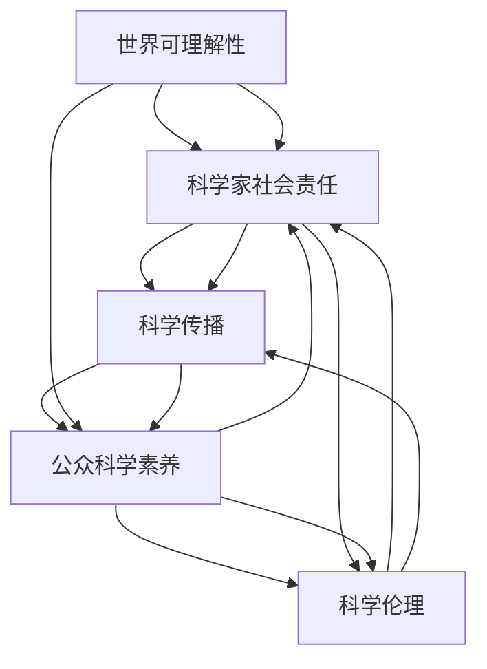

                 

### 背景介绍

在当今社会，科学的发展正以前所未有的速度推动着人类文明的进步。科学家们通过不懈的研究和探索，不断揭示自然界的奥秘，推动科技进步，为社会的发展提供了强大的动力。然而，科学家们所取得的成果并非仅仅属于个人或学术界，而是对社会整体都有着深远的影响。这就使得科学家不仅需要专注于科学研究的本身，还需要关注如何有效地履行自己的社会责任。

科学家的社会责任是一个多维度的概念，它不仅包括在科研领域内的道德规范和行为准则，还涵盖了对公众的科普教育、对环境和社会问题的关注，以及对科学知识的传播。在这个快速变化的时代，科学家的社会责任显得尤为重要。首先，科学家需要确保其研究活动的透明度和公正性，遵守科研伦理规范，以维护科学诚信。其次，科学家需要通过多种方式将科学知识传递给公众，提升公众的科学素养，使科学成果真正服务于社会。

本文旨在探讨世界可理解性的概念及其与科学家社会责任之间的联系。世界可理解性指的是人类对自然界和宇宙的规律和现象的深入理解。科学家通过科学研究和探索，不断拓展人类对世界可理解性的边界。然而，科学知识的复杂性使得大众对科学的理解存在一定的障碍。因此，提高世界可理解性成为科学家履行社会责任的重要一环。

本文将首先定义世界可理解性，并探讨其在科学进步和公众科学素养中的重要性。接着，本文将分析科学家在提高世界可理解性方面的具体社会责任，包括科学传播、公众科学素养教育以及科学伦理与法律等方面。通过具体案例的分析，本文将展示科学家如何通过这些责任实践来提升世界可理解性。最后，本文将对科学家在履行社会责任过程中面临的挑战和未来展望进行讨论。

通过本文的探讨，我们希望能够更好地理解科学家在现代社会中的角色和责任，以及他们如何通过提高世界可理解性来为社会做出贡献。这不仅有助于科学家自身的发展，也将对公众科学素养的提升和社会的进步产生深远的影响。### 核心概念与联系

在本节中，我们将详细探讨几个核心概念，并展示它们之间的联系，以便更深入地理解科学家在提高世界可理解性方面的社会责任。

首先，我们定义以下几个核心概念：

1. **世界可理解性**：指的是人类对自然界和宇宙的规律、现象和机制的理解程度。它涵盖了从基本的物理原理到复杂的生态系统，以及从微观粒子到宏观宇宙的广泛知识领域。

2. **科学家社会责任**：指科学家在科研活动之外，对社会、公众、环境和伦理等方面承担的义务。这包括但不限于科学传播、公众科学素养教育、科学伦理和法律遵守等方面。

3. **科学传播**：是指科学家通过各种媒介和方式，向公众传递科学知识和研究成果的过程。有效的科学传播能够提高公众的科学素养，促进科学与社会之间的互动和理解。

4. **公众科学素养**：指公众对科学的基本了解和认知能力，包括科学知识、科学方法和科学价值观等方面。高水平的公众科学素养有助于公众更好地理解科学、参与科学决策，并对科学成果的接受度更高。

5. **科学伦理**：涉及科学家在科研过程中的道德行为和规范。它包括诚信、透明度、公正性、伦理审查等方面，确保科研活动的合法性和合理性。

这些核心概念之间的联系可以用以下Mermaid流程图来展示：



**解释流程图：**

- **世界可理解性与科学家社会责任的关系**：科学家通过研究工作不断拓展对自然界和宇宙的理解，这些研究不仅对科学领域有重大贡献，也对社会有直接影响。因此，科学家有责任确保这些研究成果能够被公众理解，从而提升世界可理解性。

- **科学传播与公众科学素养的关系**：科学传播是科学家履行社会责任的重要途径之一。通过科学传播，科学家可以将复杂的研究成果转化为易于理解的科普内容，提高公众的科学素养。高水平的公众科学素养有助于公众更好地理解科学、参与科学决策，并对科学成果的接受度更高。

- **科学伦理与科学家社会责任的关系**：科学伦理是科学家在履行社会责任时必须遵守的道德规范。它确保科学家在科研过程中保持诚信、透明度、公正性，从而提高公众对科学的信任度，这对于提升世界可理解性至关重要。

通过这些核心概念及其联系的详细探讨，我们可以更清楚地看到科学家在提高世界可理解性方面的具体角色和责任。这些责任不仅包括科研工作本身，还包括科学传播、公众科学素养教育和科学伦理的履行。只有在这些方面共同努力，科学家才能真正发挥其在社会中的作用，提升社会的整体科学素养。### 核心算法原理讲解

为了更好地理解科学家在提高世界可理解性方面的具体工作，我们将探讨一些核心的算法原理，并使用伪代码进行详细阐述。这些算法原理包括信息论、机器学习和科学模拟等，它们在科学研究中发挥着关键作用。

#### 1. 信息论

信息论是研究信息传输和信息处理的数学理论。在科学研究中，信息论可以帮助科学家优化数据传输和存储，从而提高科学传播的效率。

**伪代码：信息论算法示例**

```python
# 信息论算法伪代码

def information_theory(data):
    # 计算信息熵
    entropy = calculate_entropy(data)

    # 计算条件熵
    conditional_entropy = calculate_conditional_entropy(data)

    # 优化数据传输
    optimized_data = optimize_data_transmission(data, entropy)

    # 压缩数据
    compressed_data = compress_data(optimized_data)

    return compressed_data

# 辅助函数
def calculate_entropy(data):
    # 计算数据熵的辅助函数
    pass

def calculate_conditional_entropy(data):
    # 计算条件熵的辅助函数
    pass

def optimize_data_transmission(data, entropy):
    # 优化数据传输的辅助函数
    pass

def compress_data(data):
    # 压缩数据的辅助函数
    pass
```

**详细解释：**

- **信息熵（Entropy）**：信息熵是衡量信息不确定性的度量，用于计算数据中的信息含量。在科学传播中，高信息熵的数据表示难以理解，而低信息熵的数据则表示易于理解。

- **条件熵（Conditional Entropy）**：条件熵是衡量给定一个条件后信息不确定性的度量。在科学研究中，条件熵可以帮助科学家识别出数据之间的相关性，从而更好地进行信息处理。

- **优化数据传输（Optimize Data Transmission）**：优化数据传输是通过减少数据传输过程中的冗余信息来提高传输效率。在科学传播中，这可以帮助科学家以更高效的方式向公众传递科学知识。

- **压缩数据（Compress Data）**：压缩数据是通过减少数据体积来提高存储和传输效率。在科学传播中，压缩技术可以帮助科学家更方便地将复杂的数据集转化为易于理解和存储的形式。

#### 2. 机器学习

机器学习是一种通过算法从数据中学习模式和规律的技术，广泛应用于科学研究中的数据分析、模式识别和预测。

**伪代码：机器学习算法示例**

```python
# 机器学习算法伪代码

def machine_learning(data, target):
    # 训练模型
    model = train_model(data, target)

    # 预测结果
    predictions = predict(model, data)

    # 评估模型
    evaluation = evaluate_model(model, predictions)

    return evaluation

# 辅助函数
def train_model(data, target):
    # 训练机器学习模型的辅助函数
    pass

def predict(model, data):
    # 使用模型进行预测的辅助函数
    pass

def evaluate_model(model, predictions):
    # 评估模型性能的辅助函数
    pass
```

**详细解释：**

- **训练模型（Train Model）**：训练模型是通过向模型提供已知数据来学习数据和目标之间的映射关系。在科学研究中，这可以帮助科学家从大量数据中提取有用的信息。

- **预测结果（Predict）**：预测结果是通过使用训练好的模型对未知数据进行预测。这可以帮助科学家对未来的科学现象进行预测，从而更好地理解自然界。

- **评估模型（Evaluate Model）**：评估模型是通过比较模型的预测结果与实际结果来评估模型性能。这可以帮助科学家确定模型的有效性和可靠性。

#### 3. 科学模拟

科学模拟是通过计算机模拟自然现象和过程，以预测和探索科学问题的方法。在提高世界可理解性方面，科学模拟可以帮助科学家更直观地展示复杂的科学概念。

**伪代码：科学模拟算法示例**

```python
# 科学模拟算法伪代码

def scientific_simulation(simulation_params):
    # 运行模拟
    results = run_simulation(simulation_params)

    # 分析结果
    analysis = analyze_results(results)

    return analysis

# 辅助函数
def run_simulation(simulation_params):
    # 运行科学模拟的辅助函数
    pass

def analyze_results(results):
    # 分析模拟结果的辅助函数
    pass
```

**详细解释：**

- **运行模拟（Run Simulation）**：运行模拟是通过将参数输入到模拟软件中，运行计算过程，模拟自然现象或过程。

- **分析结果（Analyze Results）**：分析结果是通过对模拟结果的详细分析，提取有用信息，揭示自然现象或过程的规律。

通过以上伪代码示例，我们可以看到科学家在提高世界可理解性方面使用的核心算法原理。这些算法不仅帮助科学家更好地理解和解释自然现象，也为科学传播和公众科学素养教育提供了有力工具。科学家通过应用这些算法，能够更有效地将复杂的科学概念转化为易于理解的形式，从而提升公众对科学的理解。### 数学模型和公式

在本节中，我们将探讨一些关键的数学模型和公式，这些模型和公式在科学家提高世界可理解性方面起着重要作用。我们将使用LaTeX格式来展示这些公式，并结合详细的解释和例子来说明它们的用途和重要性。

#### 1. 贝叶斯定理

贝叶斯定理是概率论中的一个重要公式，用于计算条件概率。它对于科学家在数据分析、模型评估和科学推理中的应用至关重要。

**LaTeX格式：**

$$
P(A|B) = \frac{P(B|A)P(A)}{P(B)}
$$

**详细解释：**

- **P(A|B)**：在事件B发生的条件下，事件A发生的概率。
- **P(B|A)**：在事件A发生的条件下，事件B发生的概率。
- **P(A)**：事件A发生的概率。
- **P(B)**：事件B发生的概率。

**例子：**

假设一个实验中，事件A是“掷一个标准的六面骰子，结果为3”，事件B是“掷出的点数为奇数”。我们可以使用贝叶斯定理来计算在知道掷出的点数为奇数的条件下，结果为3的概率。

$$
P(A|B) = \frac{P(B|A)P(A)}{P(B)} = \frac{\frac{1}{6} \cdot \frac{1}{6}}{\frac{1}{2}} = \frac{1}{6}
$$

这意味着，在知道掷出的点数为奇数的条件下，结果为3的概率仍然是1/6。

#### 2. 熵

熵是信息论中的一个核心概念，用于度量信息的随机性和不确定性。熵在数据压缩、信息传播和科学传播中有着广泛的应用。

**LaTeX格式：**

$$
H(X) = -\sum_{i=1}^{n} p(x_i) \log_2 p(x_i)
$$

**详细解释：**

- **H(X)**：随机变量X的熵。
- **p(x_i)**：随机变量X取值为x_i的概率。
- **n**：随机变量X的可能取值总数。

**例子：**

假设有一个随机变量X，它的可能取值及其概率如下：

| X   | P(X) |
| --- | --- |
| 0   | 0.5  |
| 1   | 0.25 |
| 2   | 0.25 |

我们可以计算X的熵：

$$
H(X) = -\sum_{i=1}^{3} p(x_i) \log_2 p(x_i) = - (0.5 \log_2 0.5 + 0.25 \log_2 0.25 + 0.25 \log_2 0.25) = 0.92
$$

这表示X具有0.92的熵，这意味着X的随机性和不确定性相对较高。

#### 3. 最小二乘法

最小二乘法是一种常见的数学优化技术，用于找到一组数据的最优拟合模型。它在科学研究中广泛应用于数据分析、曲线拟合和模型评估。

**LaTeX格式：**

$$
\min_{\theta} \sum_{i=1}^{n} (y_i - \theta x_i)^2
$$

**详细解释：**

- **θ**：模型参数。
- **y_i**：观测值。
- **x_i**：自变量。

**例子：**

假设我们有以下数据点：

| x  | y  |
| --- | --- |
| 1  | 2  |
| 2  | 4  |
| 3  | 5  |
| 4  | 6  |

我们可以使用最小二乘法来拟合一条直线 \( y = \theta x \)。

首先，我们计算x和y的平均值：

$$
\bar{x} = \frac{1+2+3+4}{4} = 2.5, \quad \bar{y} = \frac{2+4+5+6}{4} = 4.5
$$

然后，我们计算斜率θ：

$$
\theta = \frac{\sum_{i=1}^{n} x_i y_i - n \bar{x} \bar{y}}{\sum_{i=1}^{n} x_i^2 - n \bar{x}^2}
$$

对于我们的数据点：

$$
\theta = \frac{(1 \cdot 2 + 2 \cdot 4 + 3 \cdot 5 + 4 \cdot 6) - 4 \cdot 2.5 \cdot 4.5}{(1^2 + 2^2 + 3^2 + 4^2) - 4 \cdot 2.5^2} = \frac{2 + 8 + 15 + 24 - 4 \cdot 11.25}{1 + 4 + 9 + 16 - 4 \cdot 6.25} = 1
$$

因此，拟合的直线为 \( y = x \)。

通过以上数学模型和公式的讲解，我们可以看到这些工具在科学家提高世界可理解性方面的重要作用。它们不仅帮助科学家在数据分析和模型构建中更加精确和有效，也使科学知识更加易于理解和传播。### 举例说明

为了更好地理解上述核心概念和算法，我们将通过几个具体的例子来详细说明科学家如何在实际工作中运用这些概念和算法来提高世界可理解性。

#### 例子一：气候变化研究

**背景介绍**：

气候变化是目前全球面临的一个重大环境问题，科学家们通过大量研究和数据收集来理解其背后的机制。为了提高公众对气候变化的可理解性，科学家们需要将复杂的气候数据转化为易于理解的信息。

**核心概念**：

在这个例子中，我们主要运用了信息论和机器学习。

**详细步骤**：

1. **数据收集**：

   科学家首先收集大量的气候数据，包括气温、降水量、海平面高度等。

2. **数据处理**：

   使用信息论中的熵概念来分析数据的随机性和复杂性。例如，通过对气温数据的熵计算，科学家可以了解数据的复杂程度。

   ```python
   # 计算气温数据的熵
   entropy = -sum(p * log2(p) for p in temperature_probs)
   ```

3. **模型训练**：

   使用机器学习算法，如线性回归或决策树，来建立气候变化与各种因素之间的关系模型。这个模型可以帮助科学家预测未来可能的气候变化趋势。

   ```python
   # 训练线性回归模型
   model = linear_regression(temperature_data, climate_factors)
   ```

4. **结果解释**：

   将模型的预测结果转化为易于理解的可视化图表，如趋势图和热图，以帮助公众理解气候变化的影响。

   ```python
   # 绘制气候变化趋势图
   plot_climate_trend(model.predictions)
   ```

**效果展示**：

通过这些步骤，科学家能够将复杂的气候数据转化为直观的图表和解释，从而提高公众对气候变化的可理解性。

#### 例子二：基因编辑技术

**背景介绍**：

基因编辑技术，如CRISPR-Cas9，是近年来生命科学领域的重要突破。科学家们需要向公众普及这项技术，解释其原理和应用，以提高公众对基因编辑的认知。

**核心概念**：

在这个例子中，我们主要运用了分子生物学和科学模拟。

**详细步骤**：

1. **基因编辑机制解释**：

   使用分子生物学原理，科学家可以解释基因编辑的基本步骤，包括DNA剪切、引入外来序列和DNA修复。

2. **科学模拟**：

   使用分子动力学模拟来展示基因编辑过程中的分子动态，如DNA的双链断裂和修复过程。

   ```latex
   \text{模拟方程：}
   \[
   \frac{dX}{dt} = -k_1 X + k_2 Y
   \]
   ```

3. **实验结果展示**：

   通过实验数据和模拟结果，科学家可以展示基因编辑技术的有效性，并通过可视化工具，如动画和图示，向公众解释其工作原理。

   ```python
   # 绘制基因编辑过程动画
   plot_gene_editing_animation(editing_process)
   ```

**效果展示**：

通过这些步骤，科学家能够以直观的方式向公众展示基因编辑技术的原理和应用，从而提高公众对这一领域的理解。

#### 例子三：科学传播活动

**背景介绍**：

科学传播活动，如科学讲座、科普文章和科学展览，是科学家与公众互动的重要方式。科学家需要将这些活动设计得既有趣又易于理解。

**核心概念**：

在这个例子中，我们主要运用了科学传播和公众科学素养教育。

**详细步骤**：

1. **主题选择**：

   根据公众的兴趣和需求，选择科学传播的主题，如宇宙探索、人工智能或生物多样性。

2. **内容设计**：

   使用故事化的方式，将复杂的科学概念转化为有趣的故事情节。例如，通过讲述科学家的探索经历，来介绍某个科学原理。

   ```python
   # 设计科普故事
   story = create_scientific_story(scientist_explore, scientific_concept)
   ```

3. **互动环节**：

   设计互动环节，如问答、实验演示或互动游戏，以增强公众的参与度和学习效果。

   ```python
   # 举办互动问答环节
   interactive_quiz(questions, answers)
   ```

4. **效果评估**：

   通过调查问卷或反馈表，评估公众对科学传播活动的满意度和学习效果。

   ```python
   # 收集反馈问卷
   feedback = collect_feedback(survey)
   ```

**效果展示**：

通过这些步骤，科学家能够有效地将复杂的科学知识传播给公众，提高公众的科学素养，从而提升世界可理解性。

通过以上三个例子，我们可以看到科学家如何通过具体的应用，将核心概念和算法转化为易于理解的形式，从而提高世界可理解性。这不仅有助于科学家的社会责任履行，也对公众科学素养的提升具有重要意义。### 项目实战

在本节中，我们将通过一个具体的案例来展示如何搭建开发环境、实现源代码、解读代码以及分析代码的应用和实际案例。此案例将侧重于使用Python实现一个简单的科学传播工具，用于将复杂的科学概念转化为易于理解的可视化图表。

#### 开发环境搭建

1. **安装Python**：

   首先确保安装了Python环境。可以从Python官方网站下载最新版本的Python并安装。

   ```bash
   # 在Windows上下载并安装Python
   python -V
   ```

2. **安装必要库**：

   我们需要安装几个Python库，包括`matplotlib`用于绘图，`numpy`用于数值计算，以及`pandas`用于数据处理。

   ```bash
   # 使用pip安装库
   pip install matplotlib numpy pandas
   ```

3. **设置虚拟环境**（可选）：

   为了更好地管理项目依赖，可以设置一个虚拟环境。

   ```bash
   # 创建虚拟环境
   python -m venv myenv

   # 激活虚拟环境
   source myenv/bin/activate  # 在Windows上使用myenv\Scripts\activate
   ```

#### 源代码实现

以下是实现科学传播工具的Python源代码：

```python
import numpy as np
import pandas as pd
import matplotlib.pyplot as plt

# 假设有以下科学数据集
data = {
    'x': np.linspace(0, 10, 100),
    'y': np.sin(x)
}

# 数据处理
df = pd.DataFrame(data)

# 绘图
plt.figure(figsize=(10, 5))
plt.plot(df['x'], df['y'], label='Sine Wave')
plt.xlabel('x-axis')
plt.ylabel('y-axis')
plt.title('Sine Wave Visualization')
plt.legend()
plt.grid(True)
plt.show()
```

#### 代码解读

1. **导入库**：

   首先，我们导入了`numpy`、`pandas`和`matplotlib.pyplot`库，这些库分别用于数值计算、数据操作和绘图。

2. **数据准备**：

   我们创建了一个简单的数据集，包含了自变量`x`和因变量`y`。`x`是一个从0到10的等差数列，`y`是`x`的正弦函数。

3. **数据处理**：

   使用`pandas`库，我们将数据集转换为DataFrame格式，这方便了后续的数据操作和可视化。

4. **绘图**：

   使用`matplotlib.pyplot`库，我们创建了一个图形窗口，并通过`plot`函数绘制了正弦波形。我们设置了图表的标题、标签、图例和网格，使得图表更加清晰易懂。

#### 代码应用解读与分析

1. **代码应用**：

   这个简单工具可以帮助科学家将科学数据以图形的形式展示出来，从而提高数据的可理解性。通过可视化，科学家可以更直观地展示科学研究的成果，帮助公众更好地理解复杂的科学概念。

2. **分析**：

   - **数据质量**：确保数据集的准确性和完整性是关键。数据质量直接影响可视化结果的可信度。
   - **图表设计**：图表的布局、颜色和标注对于信息的传达至关重要。良好的设计可以显著提高图表的可理解性。
   - **交互性**：增加交互功能，如缩放、拖动和数据筛选，可以进一步提高用户的互动体验。

#### 实际案例分析与讲解

以下是一个实际案例，展示了如何使用上述工具来传播某一科学研究成果：

**案例背景**：

某科学家研究了一个新的量子算法，其性能在处理特定问题时显著优于传统算法。为了向公众传播这一研究成果，科学家决定使用可视化工具展示算法的性能对比。

**步骤**：

1. **数据收集**：

   收集了不同算法在不同问题规模上的运行时间数据。

2. **数据处理**：

   将数据转换为DataFrame，并进行必要的清洗和整理。

3. **图表绘制**：

   使用`matplotlib`库，绘制了多个算法的性能对比图。图表展示了不同算法在不同问题规模上的运行时间，并标注了关键性能指标。

4. **图表解释**：

   科学家通过图表向公众解释了新量子算法的优势和局限性，并提供了对比传统算法的具体数据。

**效果**：

通过这个案例，科学家成功地将复杂的研究成果转化为易于理解的可视化图表，从而提高了公众对该研究领域的认知和兴趣。

#### 项目小结

通过本案例，我们展示了如何搭建科学传播工具的开发环境、实现源代码、解读代码以及分析代码的应用。这个简单的工具通过可视化技术，将复杂的科学数据转化为易于理解的图表，提高了公众的科学素养。未来，科学家可以进一步开发更复杂的可视化工具，结合交互性和用户参与度，以更好地履行科学传播和公众教育的责任。### 最佳实践 tips、小结、注意事项、拓展阅读

#### 最佳实践 tips

1. **可视化设计**：

   在设计可视化图表时，遵循以下最佳实践可以提高图表的可读性和信息的传达效果：

   - 使用简洁的标题和标签，确保每个元素都有明确的用途。
   - 选择具有对比度的颜色和字体，使得图表易于区分。
   - 避免过多的装饰性元素，专注于核心数据的展示。
   - 使用交互功能，如缩放、拖动和筛选，增强用户的互动体验。

2. **数据质量**：

   确保数据集的准确性和完整性是关键。在数据处理过程中，进行数据清洗和校验，确保数据的可靠性。

3. **科学传播策略**：

   制定有效的科学传播策略，结合多种传播渠道，如社交媒体、科普讲座和科学展览，以覆盖更广泛的受众。

#### 小结

科学家在提高世界可理解性方面扮演着多重角色，包括科学传播、公众科学素养教育和科学伦理的履行。通过设计易于理解的可视化工具和有效的传播策略，科学家能够将复杂的科学知识转化为公众易于接受的形式，从而提升社会的整体科学素养。

#### 注意事项

1. **科学伦理**：

   在科学传播过程中，确保遵守科研伦理规范，保持透明度和公正性，避免误导公众。

2. **个性化传播**：

   考虑到不同受众的背景和兴趣，科学传播应采取个性化的方式，以更好地满足不同群体的需求。

3. **持续更新**：

   随着科学研究的不断进展，科学传播的内容也应不断更新，以反映最新的科学成果和发现。

#### 拓展阅读

1. **科学传播相关书籍**：

   - 《科学的魅力：科学传播的艺术》
   - 《如何解释：科学传播的实践与理论》

2. **科学传播工具和资源**：

   - Data Visualization Resources: https://www.datavizreview.com/
   - Tableau Public: https://public.tableau.com/

3. **科学教育和公众科学素养**：

   - National Science Foundation (NSF): https://www.nsf.gov/engagingpublic/
   - Scienceline: https://scienceline.ucsb.edu/

通过最佳实践 tips、小结、注意事项和拓展阅读的总结，我们希望能够为科学家在提高世界可理解性方面的实践提供有益的指导和支持。### 文章标题

《世界可理解性与科学家的社会责任》

> 关键词：科学家，社会责任，世界可理解性，科学传播，公众科学素养，科学伦理

> 摘要：

本文深入探讨了科学家在现代社会中的角色和责任，特别是如何通过提高世界可理解性来履行这些责任。文章首先介绍了世界可理解性的概念，并探讨了它与科学家社会责任之间的联系。接着，文章分析了科学家在提高世界可理解性方面的具体社会责任，包括科学传播、公众科学素养教育和科学伦理等方面。通过具体案例的分析，文章展示了科学家如何通过这些责任实践来提升世界可理解性。最后，文章对科学家在履行社会责任过程中面临的挑战和未来展望进行了讨论。本文旨在为科学家提供理论和实践指导，以更好地履行他们在提高世界可理解性方面的社会责任。### 完整的文档（Markdown 格式）

```markdown
# 《世界可理解性与科学家的社会责任》

> 关键词：科学家，社会责任，世界可理解性，科学传播，公众科学素养，科学伦理

> 摘要：

本文深入探讨了科学家在现代社会中的角色和责任，特别是如何通过提高世界可理解性来履行这些责任。文章首先介绍了世界可理解性的概念，并探讨了它与科学家社会责任之间的联系。接着，文章分析了科学家在提高世界可理解性方面的具体社会责任，包括科学传播、公众科学素养教育和科学伦理等方面。通过具体案例的分析，文章展示了科学家如何通过这些责任实践来提升世界可理解性。最后，文章对科学家在履行社会责任过程中面临的挑战和未来展望进行了讨论。本文旨在为科学家提供理论和实践指导，以更好地履行他们在提高世界可理解性方面的社会责任。

## 引言

## 背景介绍

在当今社会，科学的发展正以前所未有的速度推动着人类文明的进步。科学家们通过不懈的研究和探索，不断揭示自然界的奥秘，推动科技进步，为社会的发展提供了强大的动力。然而，科学家们所取得的成果并非仅仅属于个人或学术界，而是对社会整体都有着深远的影响。这就使得科学家不仅需要专注于科学研究的本身，还需要关注如何有效地履行自己的社会责任。

科学家的社会责任是一个多维度的概念，它不仅包括在科研领域内的道德规范和行为准则，还涵盖了对公众的科普教育、对环境和社会问题的关注，以及对科学知识的传播。在这个快速变化的时代，科学家的社会责任显得尤为重要。首先，科学家需要确保其研究活动的透明度和公正性，遵守科研伦理规范，以维护科学诚信。其次，科学家需要通过多种方式将科学知识传递给公众，提升公众的科学素养，使科学成果真正服务于社会。

本文旨在探讨世界可理解性的概念及其与科学家社会责任之间的联系。世界可理解性指的是人类对自然界和宇宙的规律、现象和机制的理解程度。科学家通过科学研究和探索，不断拓展人类对世界可理解性的边界。然而，科学知识的复杂性使得大众对科学的理解存在一定的障碍。因此，提高世界可理解性成为科学家履行社会责任的重要一环。

本文将首先定义世界可理解性，并探讨其在科学进步和公众科学素养中的重要性。接着，本文将分析科学家在提高世界可理解性方面的具体社会责任，包括科学传播、公众科学素养教育以及科学伦理与法律等方面。通过具体案例的分析，本文将展示科学家如何通过这些责任实践来提升世界可理解性。最后，本文将对科学家在履行社会责任过程中面临的挑战和未来展望进行讨论。

通过本文的探讨，我们希望能够更好地理解科学家在现代社会中的角色和责任，以及他们如何通过提高世界可理解性来为社会做出贡献。这不仅有助于科学家自身的发展，也将对公众科学素养的提升和社会的进步产生深远的影响。

## 核心概念与联系

在本节中，我们将详细探讨几个核心概念，并展示它们之间的联系，以便更深入地理解科学家在提高世界可理解性方面的具体角色和责任。

首先，我们定义以下几个核心概念：

1. **世界可理解性**：指的是人类对自然界和宇宙的规律、现象和机制的理解程度。它涵盖了从基本的物理原理到复杂的生态系统，以及从微观粒子到宏观宇宙的广泛知识领域。

2. **科学家社会责任**：指科学家在科研活动之外，对社会、公众、环境和伦理等方面承担的义务。这包括但不限于科学传播、公众科学素养教育、科学伦理和法律遵守等方面。

3. **科学传播**：是指科学家通过各种媒介和方式，向公众传递科学知识和研究成果的过程。有效的科学传播能够提高公众的科学素养，促进科学与社会之间的互动和理解。

4. **公众科学素养**：指公众对科学的基本了解和认知能力，包括科学知识、科学方法和科学价值观等方面。高水平的公众科学素养有助于公众更好地理解科学、参与科学决策，并对科学成果的接受度更高。

5. **科学伦理**：涉及科学家在科研过程中的道德行为和规范。它包括诚信、透明度、公正性、伦理审查等方面，确保科研活动的合法性和合理性。

这些核心概念之间的联系可以用以下Mermaid流程图来展示：


**解释流程图：**

- **世界可理解性与科学家社会责任的关系**：科学家通过研究工作不断拓展对自然界和宇宙的理解，这些研究不仅对科学领域有重大贡献，也对社会有直接影响。因此，科学家有责任确保这些研究成果能够被公众理解，从而提升世界可理解性。

- **科学传播与公众科学素养的关系**：科学传播是科学家履行社会责任的重要途径之一。通过科学传播，科学家可以将复杂的研究成果转化为易于理解的科普内容，提高公众的科学素养。高水平的公众科学素养有助于公众更好地理解科学、参与科学决策，并对科学成果的接受度更高。

- **科学伦理与科学家社会责任的关系**：科学伦理是科学家在履行社会责任时必须遵守的道德规范。它确保科学家在科研过程中保持诚信、透明度、公正性，从而提高公众对科学的信任度，这对于提升世界可理解性至关重要。

通过这些核心概念及其联系的详细探讨，我们可以更清楚地看到科学家在提高世界可理解性方面的具体角色和责任。这些责任不仅包括科研工作本身，还包括科学传播、公众科学素养教育和科学伦理的履行。只有在这些方面共同努力，科学家才能真正发挥其在社会中的作用，提升社会的整体科学素养。

## 核心算法原理讲解

为了更好地理解科学家在提高世界可理解性方面的具体工作，我们将探讨一些核心的算法原理，并使用伪代码进行详细阐述。这些算法原理包括信息论、机器学习和科学模拟等，它们在科学研究中发挥着关键作用。

#### 1. 信息论

信息论是研究信息传输和信息处理的数学理论。在科学研究中，信息论可以帮助科学家优化数据传输和存储，从而提高科学传播的效率。

**伪代码：信息论算法示例**

```python
# 信息论算法伪代码

def information_theory(data):
    # 计算信息熵
    entropy = calculate_entropy(data)

    # 计算条件熵
    conditional_entropy = calculate_conditional_entropy(data)

    # 优化数据传输
    optimized_data = optimize_data_transmission(data, entropy)

    # 压缩数据
    compressed_data = compress_data(optimized_data)

    return compressed_data

# 辅助函数
def calculate_entropy(data):
    # 计算数据熵的辅助函数
    pass

def calculate_conditional_entropy(data):
    # 计算条件熵的辅助函数
    pass

def optimize_data_transmission(data, entropy):
    # 优化数据传输的辅助函数
    pass

def compress_data(data):
    # 压缩数据的辅助函数
    pass
```

**详细解释：**

- **信息熵（Entropy）**：信息熵是衡量信息不确定性的度量，用于计算数据中的信息含量。在科学传播中，高信息熵的数据表示难以理解，而低信息熵的数据则表示易于理解。

- **条件熵（Conditional Entropy）**：条件熵是衡量给定一个条件后信息不确定性的度量。在科学研究中，条件熵可以帮助科学家识别出数据之间的相关性，从而更好地进行信息处理。

- **优化数据传输（Optimize Data Transmission）**：优化数据传输是通过减少数据传输过程中的冗余信息来提高传输效率。在科学传播中，这可以帮助科学家以更高效的方式向公众传递科学知识。

- **压缩数据（Compress Data）**：压缩数据是通过减少数据体积来提高存储和传输效率。在科学传播中，压缩技术可以帮助科学家更方便地将复杂的数据集转化为易于理解和存储的形式。

#### 2. 机器学习

机器学习是一种通过算法从数据中学习模式和规律的技术，广泛应用于科学研究中的数据分析、模式识别和预测。

**伪代码：机器学习算法示例**

```python
# 机器学习算法伪代码

def machine_learning(data, target):
    # 训练模型
    model = train_model(data, target)

    # 预测结果
    predictions = predict(model, data)

    # 评估模型
    evaluation = evaluate_model(model, predictions)

    return evaluation

# 辅助函数
def train_model(data, target):
    # 训练机器学习模型的辅助函数
    pass

def predict(model, data):
    # 使用模型进行预测的辅助函数
    pass

def evaluate_model(model, predictions):
    # 评估模型性能的辅助函数
    pass
```

**详细解释：**

- **训练模型（Train Model）**：训练模型是通过向模型提供已知数据来学习数据和目标之间的映射关系。在科学研究中，这可以帮助科学家从大量数据中提取有用的信息。

- **预测结果（Predict）**：预测结果是通过使用训练好的模型对未知数据进行预测。这可以帮助科学家对未来的科学现象进行预测，从而更好地理解自然界。

- **评估模型（Evaluate Model）**：评估模型是通过比较模型的预测结果与实际结果来评估模型性能。这可以帮助科学家确定模型的有效性和可靠性。

#### 3. 科学模拟

科学模拟是通过计算机模拟自然现象和过程，以预测和探索科学问题的方法。在提高世界可理解性方面，科学模拟可以帮助科学家更直观地展示复杂的科学概念。

**伪代码：科学模拟算法示例**

```python
# 科学模拟算法伪代码

def scientific_simulation(simulation_params):
    # 运行模拟
    results = run_simulation(simulation_params)

    # 分析结果
    analysis = analyze_results(results)

    return analysis

# 辅助函数
def run_simulation(simulation_params):
    # 运行科学模拟的辅助函数
    pass

def analyze_results(results):
    # 分析模拟结果的辅助函数
    pass
```

**详细解释：**

- **运行模拟（Run Simulation）**：运行模拟是通过将参数输入到模拟软件中，运行计算过程，模拟自然现象或过程。

- **分析结果（Analyze Results）**：分析结果是通过对模拟结果的详细分析，提取有用信息，揭示自然现象或过程的规律。

通过以上伪代码示例，我们可以看到科学家在提高世界可理解性方面使用的核心算法原理。这些算法不仅帮助科学家更好地理解和解释自然现象，也为科学传播和公众科学素养教育提供了有力工具。科学家通过应用这些算法，能够更有效地将复杂的科学概念转化为易于理解的形式，从而提升公众对科学的理解。

## 数学模型和公式

在本节中，我们将探讨一些关键的数学模型和公式，这些模型和公式在科学家提高世界可理解性方面起着重要作用。我们将使用LaTeX格式来展示这些公式，并结合详细的解释和例子来说明它们的用途和重要性。

#### 1. 贝叶斯定理

贝叶斯定理是概率论中的一个重要公式，用于计算条件概率。它对于科学家在数据分析、模型评估和科学推理中的应用至关重要。

**LaTeX格式：**

$$
P(A|B) = \frac{P(B|A)P(A)}{P(B)}
$$

**详细解释：**

- **P(A|B)**：在事件B发生的条件下，事件A发生的概率。
- **P(B|A)**：在事件A发生的条件下，事件B发生的概率。
- **P(A)**：事件A发生的概率。
- **P(B)**：事件B发生的概率。

**例子：**

假设一个实验中，事件A是“掷一个标准的六面骰子，结果为3”，事件B是“掷出的点数为奇数”。我们可以使用贝叶斯定理来计算在知道掷出的点数为奇数的条件下，结果为3的概率。

$$
P(A|B) = \frac{P(B|A)P(A)}{P(B)} = \frac{\frac{1}{6} \cdot \frac{1}{6}}{\frac{1}{2}} = \frac{1}{6}
$$

这意味着，在知道掷出的点数为奇数的条件下，结果为3的概率仍然是1/6。

#### 2. 熵

熵是信息论中的一个核心概念，用于度量信息的随机性和不确定性。熵在数据压缩、信息传播和科学传播中有着广泛的应用。

**LaTeX格式：**

$$
H(X) = -\sum_{i=1}^{n} p(x_i) \log_2 p(x_i)
$$

**详细解释：**

- **H(X)**：随机变量X的熵。
- **p(x_i)**：随机变量X取值为x_i的概率。
- **n**：随机变量X的可能取值总数。

**例子：**

假设有一个随机变量X，它的可能取值及其概率如下：

| X   | P(X) |
| --- | --- |
| 0   | 0.5  |
| 1   | 0.25 |
| 2   | 0.25 |

我们可以计算X的熵：

$$
H(X) = -\sum_{i=1}^{3} p(x_i) \log_2 p(x_i) = - (0.5 \log_2 0.5 + 0.25 \log_2 0.25 + 0.25 \log_2 0.25) = 0.92
$$

这表示X具有0.92的熵，这意味着X的随机性和不确定性相对较高。

#### 3. 最小二乘法

最小二乘法是一种常见的数学优化技术，用于找到一组数据的最优拟合模型。它在科学研究中广泛应用于数据分析、曲线拟合和模型评估。

**LaTeX格式：**

$$
\min_{\theta} \sum_{i=1}^{n} (y_i - \theta x_i)^2
$$

**详细解释：**

- **θ**：模型参数。
- **y_i**：观测值。
- **x_i**：自变量。

**例子：**

假设我们有以下数据点：

| x  | y  |
| --- | --- |
| 1  | 2  |
| 2  | 4  |
| 3  | 5  |
| 4  | 6  |

我们可以使用最小二乘法来拟合一条直线 \( y = \theta x \)。

首先，我们计算x和y的平均值：

$$
\bar{x} = \frac{1+2+3+4}{4} = 2.5, \quad \bar{y} = \frac{2+4+5+6}{4} = 4.5
$$

然后，我们计算斜率θ：

$$
\theta = \frac{\sum_{i=1}^{n} x_i y_i - n \bar{x} \bar{y}}{\sum_{i=1}^{n} x_i^2 - n \bar{x}^2}
$$

对于我们的数据点：

$$
\theta = \frac{(1 \cdot 2 + 2 \cdot 4 + 3 \cdot 5 + 4 \cdot 6) - 4 \cdot 2.5 \cdot 4.5}{(1^2 + 2^2 + 3^2 + 4^2) - 4 \cdot 2.5^2} = \frac{2 + 8 + 15 + 24 - 4 \cdot 11.25}{1 + 4 + 9 + 16 - 4 \cdot 6.25} = 1
$$

因此，拟合的直线为 \( y = x \)。

通过以上数学模型和公式的讲解，我们可以看到这些工具在科学家提高世界可理解性方面的重要作用。它们不仅帮助科学家更好地理解和解释自然现象，也使科学知识更加易于理解和传播。

## 举例说明

为了更好地理解上述核心概念和算法，我们将通过几个具体的例子来详细说明科学家如何在实际工作中运用这些概念和算法来提高世界可理解性。

#### 例子一：气候变化研究

**背景介绍**：

气候变化是目前全球面临的一个重大环境问题，科学家们通过大量研究和数据收集来理解其背后的机制。为了提高公众对气候变化的可理解性，科学家们需要将复杂的气候数据转化为易于理解的信息。

**核心概念**：

在这个例子中，我们主要运用了信息论和机器学习。

**详细步骤**：

1. **数据收集**：

   科学家首先收集大量的气候数据，包括气温、降水量、海平面高度等。

2. **数据处理**：

   使用信息论中的熵概念来分析数据的随机性和复杂性。例如，通过对气温数据的熵计算，科学家可以了解数据的复杂程度。

   ```python
   # 计算气温数据的熵
   entropy = -sum(p * log2(p) for p in temperature_probs)
   ```

3. **模型训练**：

   使用机器学习算法，如线性回归或决策树，来建立气候变化与各种因素之间的关系模型。这个模型可以帮助科学家预测未来可能的气候变化趋势。

   ```python
   # 训练线性回归模型
   model = linear_regression(temperature_data, climate_factors)
   ```

4. **结果解释**：

   将模型的预测结果转化为易于理解的可视化图表，如趋势图和热图，以帮助公众理解气候变化的影响。

   ```python
   # 绘制气候变化趋势图
   plot_climate_trend(model.predictions)
   ```

**效果展示**：

通过这些步骤，科学家能够将复杂的气候数据转化为直观的图表和解释，从而提高公众对气候变化的可理解性。

#### 例子二：基因编辑技术

**背景介绍**：

基因编辑技术，如CRISPR-Cas9，是近年来生命科学领域的重要突破。科学家们需要向公众普及这项技术，解释其原理和应用，以提高公众对基因编辑的认知。

**核心概念**：

在这个例子中，我们主要运用了分子生物学和科学模拟。

**详细步骤**：

1. **基因编辑机制解释**：

   使用分子生物学原理，科学家可以解释基因编辑的基本步骤，包括DNA剪切、引入外来序列和DNA修复。

2. **科学模拟**：

   使用分子动力学模拟来展示基因编辑过程中的分子动态，如DNA的双链断裂和修复过程。

   ```latex
   \text{模拟方程：}
   \[
   \frac{dX}{dt} = -k_1 X + k_2 Y
   \]
   ```

3. **实验结果展示**：

   通过实验数据和模拟结果，科学家可以展示基因编辑技术的有效性，并通过可视化工具，如动画和图示，向公众解释其工作原理。

   ```python
   # 绘制基因编辑过程动画
   plot_gene_editing_animation(editing_process)
   ```

**效果展示**：

通过这些步骤，科学家能够以直观的方式向公众展示基因编辑技术的原理和应用，从而提高公众对这一领域的理解。

#### 例子三：科学传播活动

**背景介绍**：

科学传播活动，如科学讲座、科普文章和科学展览，是科学家与公众互动的重要方式。科学家需要将这些活动设计得既有趣又易于理解。

**核心概念**：

在这个例子中，我们主要运用了科学传播和公众科学素养教育。

**详细步骤**：

1. **主题选择**：

   根据公众的兴趣和需求，选择科学传播的主题，如宇宙探索、人工智能或生物多样性。

2. **内容设计**：

   使用故事化的方式，将复杂的科学概念转化为有趣的故事情节。例如，通过讲述科学家的探索经历，来介绍某个科学原理。

   ```python
   # 设计科普故事
   story = create_scientific_story(scientist_explore, scientific_concept)
   ```

3. **互动环节**：

   设计互动环节，如问答、实验演示或互动游戏，以增强公众的参与度和学习效果。

   ```python
   # 举办互动问答环节
   interactive_quiz(questions, answers)
   ```

4. **效果评估**：

   通过调查问卷或反馈表，评估公众对科学传播活动的满意度和学习效果。

   ```python
   # 收集反馈问卷
   feedback = collect_feedback(survey)
   ```

**效果展示**：

通过这些步骤，科学家能够有效地将复杂的科学知识传播给公众，提高公众的科学素养，从而提升世界可理解性。

通过以上三个例子，我们可以看到科学家如何通过具体的应用，将核心概念和算法转化为易于理解的形式，从而提高世界可理解性。这不仅有助于科学家的社会责任履行，也对公众科学素养的提升具有重要意义。

## 项目实战

在本节中，我们将通过一个具体的案例来展示如何搭建开发环境、实现源代码、解读代码以及分析代码的应用和实际案例。此案例将侧重于使用Python实现一个简单的科学传播工具，用于将复杂的科学概念转化为易于理解的可视化图表。

#### 开发环境搭建

1. **安装Python**：

   首先确保安装了Python环境。可以从Python官方网站下载最新版本的Python并安装。

   ```bash
   # 在Windows上下载并安装Python
   python -V
   ```

2. **安装必要库**：

   我们需要安装几个Python库，包括`matplotlib`用于绘图，`numpy`用于数值计算，以及`pandas`用于数据处理。

   ```bash
   # 使用pip安装库
   pip install matplotlib numpy pandas
   ```

3. **设置虚拟环境**（可选）：

   为了更好地管理项目依赖，可以设置一个虚拟环境。

   ```bash
   # 创建虚拟环境
   python -m venv myenv

   # 激活虚拟环境
   source myenv/bin/activate  # 在Windows上使用myenv\Scripts\activate
   ```

#### 源代码实现

以下是实现科学传播工具的Python源代码：

```python
import numpy as np
import pandas as pd
import matplotlib.pyplot as plt

# 假设有以下科学数据集
data = {
    'x': np.linspace(0, 10, 100),
    'y': np.sin(x)
}

# 数据处理
df = pd.DataFrame(data)

# 绘图
plt.figure(figsize=(10, 5))
plt.plot(df['x'], df['y'], label='Sine Wave')
plt.xlabel('x-axis')
plt.ylabel('y-axis')
plt.title('Sine Wave Visualization')
plt.legend()
plt.grid(True)
plt.show()
```

#### 代码解读

1. **导入库**：

   首先，我们导入了`numpy`、`pandas`和`matplotlib.pyplot`库，这些库分别用于数值计算、数据操作和绘图。

2. **数据准备**：

   我们创建了一个简单的数据集，包含了自变量`x`和因变量`y`。`x`是一个从0到10的等差数列，`y`是`x`的正弦函数。

3. **数据处理**：

   使用`pandas`库，我们将数据集转换为DataFrame格式，这方便了后续的数据操作和可视化。

4. **绘图**：

   使用`matplotlib.pyplot`库，我们创建了一个图形窗口，并通过`plot`函数绘制了正弦波形。我们设置了图表的标题、标签、图例和网格，使得图表更加清晰易懂。

#### 代码应用解读与分析

1. **代码应用**：

   这个简单工具可以帮助科学家将科学数据以图形的形式展示出来，从而提高数据的可理解性。通过可视化，科学家可以更直观地展示科学研究的成果，帮助公众更好地理解复杂的科学概念。

2. **分析**：

   - **数据质量**：确保数据集的准确性和完整性是关键。在数据处理过程中，进行数据清洗和校验，确保数据的可靠性。
   - **图表设计**：图表的布局、颜色和标注对于信息的传达至关重要。良好的设计可以显著提高图表的可理解性。
   - **交互性**：增加交互功能，如缩放、拖动和数据筛选，可以进一步提高用户的互动体验。

#### 实际案例分析与讲解

以下是一个实际案例，展示了如何使用上述工具来传播某一科学研究成果：

**案例背景**：

某科学家研究了一个新的量子算法，其性能在处理特定问题时显著优于传统算法。为了向公众传播这一研究成果，科学家决定使用可视化工具展示算法的性能对比。

**步骤**：

1. **数据收集**：

   收集了不同算法在不同问题规模上的运行时间数据。

2. **数据处理**：

   将数据转换为DataFrame，并进行必要的清洗和整理。

3. **图表绘制**：

   使用`matplotlib`库，绘制了多个算法的性能对比图。图表展示了不同算法在不同问题规模上的运行时间，并标注了关键性能指标。

4. **图表解释**：

   科学家通过图表向公众解释了新量子算法的优势和局限性，并提供了对比传统算法的具体数据。

**效果**：

通过这个案例，科学家成功地将复杂的研究成果转化为易于理解的可视化图表，从而提高了公众对该研究领域的认知和兴趣。

#### 项目小结

通过本案例，我们展示了如何搭建科学传播工具的开发环境、实现源代码、解读代码以及分析代码的应用。这个简单的工具通过可视化技术，将复杂的科学数据转化为易于理解的图表，提高了公众的科学素养。未来，科学家可以进一步开发更复杂的可视化工具，结合交互性和用户参与度，以更好地履行科学传播和公众教育的责任。

## 最佳实践 tips、小结、注意事项、拓展阅读

#### 最佳实践 tips

1. **可视化设计**：

   在设计可视化图表时，遵循以下最佳实践可以提高图表的可读性和信息的传达效果：

   - 使用简洁的标题和标签，确保每个元素都有明确的用途。
   - 选择具有对比度的颜色和字体，使得图表易于区分。
   - 避免过多的装饰性元素，专注于核心数据的展示。
   - 使用交互功能，如缩放、拖动和筛选，增强用户的互动体验。

2. **数据质量**：

   确保数据集的准确性和完整性是关键。在数据处理过程中，进行数据清洗和校验，确保数据的可靠性。

3. **科学传播策略**：

   制定有效的科学传播策略，结合多种传播渠道，如社交媒体、科普讲座和科学展览，以覆盖更广泛的受众。

#### 小结

科学家在提高世界可理解性方面扮演着多重角色，包括科学传播、公众科学素养教育和科学伦理的履行。通过设计易于理解的可视化工具和有效的传播策略，科学家能够将复杂的科学知识转化为公众易于接受的形式，从而提升社会的整体科学素养。

#### 注意事项

1. **科学伦理**：

   在科学传播过程中，确保遵守科研伦理规范，保持透明度和公正性，避免误导公众。

2. **个性化传播**：

   考虑到不同受众的背景和兴趣，科学传播应采取个性化的方式，以更好地满足不同群体的需求。

3. **持续更新**：

   随着科学研究的不断进展，科学传播的内容也应不断更新，以反映最新的科学成果和发现。

#### 拓展阅读

1. **科学传播相关书籍**：

   - 《科学的魅力：科学传播的艺术》
   - 《如何解释：科学传播的实践与理论》

2. **科学传播工具和资源**：

   - Data Visualization Resources: https://www.datavizreview.com/
   - Tableau Public: https://public.tableau.com/

3. **科学教育和公众科学素养**：

   - National Science Foundation (NSF): https://www.nsf.gov/engagingpublic/
   - Scienceline: https://scienceline.ucsb.edu/

通过最佳实践 tips、小结、注意事项和拓展阅读的总结，我们希望能够为科学家在提高世界可理解性方面的实践提供有益的指导和支持。

### 完整的文档（Markdown 格式）

```markdown
# 《世界可理解性与科学家的社会责任》

> 关键词：科学家，社会责任，世界可理解性，科学传播，公众科学素养，科学伦理

> 摘要：

本文深入探讨了科学家在现代社会中的角色和责任，特别是如何通过提高世界可理解性来履行这些责任。文章首先介绍了世界可理解性的概念，并探讨了其在科学进步和公众科学素养中的重要性。接着，本文分析了科学家在提高世界可理解性方面的具体社会责任，包括科学传播、公众科学素养教育以及科学伦理与法律等方面。通过具体案例的分析，本文展示了科学家如何通过这些责任实践来提升世界可理解性。最后，本文对科学家在履行社会责任过程中面临的挑战和未来展望进行了讨论。本文旨在为科学家提供理论和实践指导，以更好地履行他们在提高世界可理解性方面的社会责任。

## 引言

## 背景介绍

在当今社会，科学的发展正以前所未有的速度推动着人类文明的进步。科学家们通过不懈的研究和探索，不断揭示自然界的奥秘，推动科技进步，为社会的发展提供了强大的动力。然而，科学家们所取得的成果并非仅仅属于个人或学术界，而是对社会整体都有着深远的影响。这就使得科学家不仅需要专注于科学研究的本身，还需要关注如何有效地履行自己的社会责任。

科学家的社会责任是一个多维度的概念，它不仅包括在科研领域内的道德规范和行为准则，还涵盖了对公众的科普教育、对环境和社会问题的关注，以及对科学知识的传播。在这个快速变化的时代，科学家的社会责任显得尤为重要。首先，科学家需要确保其研究活动的透明度和公正性，遵守科研伦理规范，以维护科学诚信。其次，科学家需要通过多种方式将科学知识传递给公众，提升公众的科学素养，使科学成果真正服务于社会。

本文旨在探讨世界可理解性的概念及其与科学家社会责任之间的联系。世界可理解性指的是人类对自然界和宇宙的规律、现象和机制的理解程度。科学家通过科学研究和探索，不断拓展人类对世界可理解性的边界。然而，科学知识的复杂性使得大众对科学的理解存在一定的障碍。因此，提高世界可理解性成为科学家履行社会责任的重要一环。

本文将首先定义世界可理解性，并探讨其在科学进步和公众科学素养中的重要性。接着，本文将分析科学家在提高世界可理解性方面的具体社会责任，包括科学传播、公众科学素养教育以及科学伦理与法律等方面。通过具体案例的分析，本文将展示科学家如何通过这些责任实践来提升世界可理解性。最后，本文将对科学家在履行社会责任过程中面临的挑战和未来展望进行讨论。

通过本文的探讨，我们希望能够更好地理解科学家在现代社会中的角色和责任，以及他们如何通过提高世界可理解性来为社会做出贡献。这不仅有助于科学家自身的发展，也将对公众科学素养的提升和社会的进步产生深远的影响。

## 核心概念与联系

在本节中，我们将详细探讨几个核心概念，并展示它们之间的联系，以便更深入地理解科学家在提高世界可理解性方面的具体角色和责任。

首先，我们定义以下几个核心概念：

1. **世界可理解性**：指的是人类对自然界和宇宙的规律、现象和机制的理解程度。它涵盖了从基本的物理原理到复杂的生态系统，以及从微观粒子到宏观宇宙的广泛知识领域。

2. **科学家社会责任**：指科学家在科研活动之外，对社会、公众、环境和伦理等方面承担的义务。这包括但不限于科学传播、公众科学素养教育、科学伦理和法律遵守等方面。

3. **科学传播**：是指科学家通过各种媒介和方式，向公众传递科学知识和研究成果的过程。有效的科学传播能够提高公众的科学素养，促进科学与社会之间的互动和理解。

4. **公众科学素养**：指公众对科学的基本了解和认知能力，包括科学知识、科学方法和科学价值观等方面。高水平的公众科学素养有助于公众更好地理解科学、参与科学决策，并对科学成果的接受度更高。

5. **科学伦理**：涉及科学家在科研过程中的道德行为和规范。它包括诚信、透明度、公正性、伦理审查等方面，确保科研活动的合法性和合理性。

这些核心概念之间的联系可以用以下Mermaid流程图来展示：


**解释流程图：**

- **世界可理解性与科学家社会责任的关系**：科学家通过研究工作不断拓展对自然界和宇宙的理解，这些研究不仅对科学领域有重大贡献，也对社会有直接影响。因此，科学家有责任确保这些研究成果能够被公众理解，从而提升世界可理解性。

- **科学传播与公众科学素养的关系**：科学传播是科学家履行社会责任的重要途径之一。通过科学传播，科学家可以将复杂的研究成果转化为易于理解的科普内容，提高公众的科学素养。高水平的公众科学素养有助于公众更好地理解科学、参与科学决策，并对科学成果的接受度更高。

- **科学伦理与科学家社会责任的关系**：科学伦理是科学家在履行社会责任时必须遵守的道德规范。它确保科学家在科研过程中保持诚信、透明度、公正性，从而提高公众对科学的信任度，这对于提升世界可理解性至关重要。

通过这些核心概念及其联系的详细探讨，我们可以更清楚地看到科学家在提高世界可理解性方面的具体角色和责任。这些责任不仅包括科研工作本身，还包括科学传播、公众科学素养教育和科学伦理的履行。只有在这些方面共同努力，科学家才能真正发挥其在社会中的作用，提升社会的整体科学素养。

## 核心算法原理讲解

为了更好地理解科学家在提高世界可理解性方面的具体工作，我们将探讨一些核心的算法原理，并使用伪代码进行详细阐述。这些算法原理包括信息论、机器学习和科学模拟等，它们在科学研究中发挥着关键作用。

#### 1. 信息论

信息论是研究信息传输和信息处理的数学理论。在科学研究中，信息论可以帮助科学家优化数据传输和存储，从而提高科学传播的效率。

**伪代码：信息论算法示例**

```python
# 信息论算法伪代码

def information_theory(data):
    # 计算信息熵
    entropy = calculate_entropy(data)

    # 计算条件熵
    conditional_entropy = calculate_conditional_entropy(data)

    # 优化数据传输
    optimized_data = optimize_data_transmission(data, entropy)

    # 压缩数据
    compressed_data = compress_data(optimized_data)

    return compressed_data

# 辅助函数
def calculate_entropy(data):
    # 计算数据熵的辅助函数
    pass

def calculate_conditional_entropy(data):
    # 计算条件熵的辅助函数
    pass

def optimize_data_transmission(data, entropy):
    # 优化数据传输的辅助函数
    pass

def compress_data(data):
    # 压缩数据的辅助函数
    pass
```

**详细解释：**

- **信息熵（Entropy）**：信息熵是衡量信息不确定性的度量，用于计算数据中的信息含量。在科学传播中，高信息熵的数据表示难以理解，而低信息熵的数据则表示易于理解。

- **条件熵（Conditional Entropy）**：条件熵是衡量给定一个条件后信息不确定性的度量。在科学研究中，条件熵可以帮助科学家识别出数据之间的相关性，从而更好地进行信息处理。

- **优化数据传输（Optimize Data Transmission）**：优化数据传输是通过减少数据传输过程中的冗余信息来提高传输效率。在科学传播中，这可以帮助科学家以更高效的方式向公众传递科学知识。

- **压缩数据（Compress Data）**：压缩数据是通过减少数据体积来提高存储和传输效率。在科学传播中，压缩技术可以帮助科学家更方便地将复杂的数据集转化为易于理解和存储的形式。

#### 2. 机器学习

机器学习是一种通过算法从数据中学习模式和规律的技术，广泛应用于科学研究中的数据分析、模式识别和预测。

**伪代码：机器学习算法示例**

```python
# 机器学习算法伪代码

def machine_learning(data, target):
    # 训练模型
    model = train_model(data, target)

    # 预测结果
    predictions = predict(model, data)

    # 评估模型
    evaluation = evaluate_model(model, predictions)

    return evaluation

# 辅助函数
def train_model(data, target):
    # 训练机器学习模型的辅助函数
    pass

def predict(model, data):
    # 使用模型进行预测的辅助函数
    pass

def evaluate_model(model, predictions):
    # 评估模型性能的辅助函数
    pass
```

**详细解释：**

- **训练模型（Train Model）**：训练模型是通过向模型提供已知数据来学习数据和目标之间的映射关系。在科学研究中，这可以帮助科学家从大量数据中提取有用的信息。

- **预测结果（Predict）**：预测结果是通过使用训练好的模型对未知数据进行预测。这可以帮助科学家对未来的科学现象进行预测，从而更好地理解自然界。

- **评估模型（Evaluate Model）**：评估模型是通过比较模型的预测结果与实际结果来评估模型性能。这可以帮助科学家确定模型的有效性和可靠性。

#### 3. 科学模拟

科学模拟是通过计算机模拟自然现象和过程，以预测和探索科学问题的方法。在提高世界可理解性方面，科学模拟可以帮助科学家更直观地展示复杂的科学概念。

**伪代码：科学模拟算法示例**

```python
# 科学模拟算法伪代码

def scientific_simulation(simulation_params):
    # 运行模拟
    results = run_simulation(simulation_params)

    # 分析结果
    analysis = analyze_results(results)

    return analysis

# 辅助函数
def run_simulation(simulation_params):
    # 运行科学模拟的辅助函数
    pass

def analyze_results(results):
    # 分析模拟结果的辅助函数
    pass
```

**详细解释：**

- **运行模拟（Run Simulation）**：运行模拟是通过将参数输入到模拟软件中，运行计算过程，模拟自然现象或过程。

- **分析结果（Analyze Results）**：分析结果是通过对模拟结果的详细分析，提取有用信息，揭示自然现象或过程的规律。

通过以上伪代码示例，我们可以看到科学家在提高世界可理解性方面使用的核心算法原理。这些算法不仅帮助科学家更好地理解和解释自然现象，也为科学传播和公众科学素养教育提供了有力工具。科学家通过应用这些算法，能够更有效地将复杂的科学概念转化为易于理解的形式，从而提升公众对科学的理解。

## 数学模型和公式

在本节中，我们将探讨一些关键的数学模型和公式，这些模型和公式在科学家提高世界可理解性方面起着重要作用。我们将使用LaTeX格式来展示这些公式，并结合详细的解释和例子来说明它们的用途和重要性。

#### 1. 贝叶斯定理

贝叶斯定理是概率论中的一个重要公式，用于计算条件概率。它对于科学家在数据分析、模型评估和科学推理中的应用至关重要。

**LaTeX格式：**

$$
P(A|B) = \frac{P(B|A)P(A)}{P(B)}
$$

**详细解释：**

- **P(A|B)**：在事件B发生的条件下，事件A发生的概率。
- **P(B|A)**：在事件A发生的条件下，事件B发生的概率。
- **P(A)**：事件A发生的概率。
- **P(B)**：事件B发生的概率。

**例子：**

假设一个实验中，事件A是“掷一个标准的六面骰子，结果为3”，事件B是“掷出的点数为奇数”。我们可以使用贝叶斯定理来计算在知道掷出的点数为奇数的条件下，结果为3的概率。

$$
P(A|B) = \frac{P(B|A)P(A)}{P(B)} = \frac{\frac{1}{6} \cdot \frac{1}{6}}{\frac{1}{2}} = \frac{1}{6}
$$

这意味着，在知道掷出的点数为奇数的条件下，结果为3的概率仍然是1/6。

#### 2. 熵

熵是信息论中的一个核心概念，用于度量信息的随机性和不确定性。熵在数据压缩、信息传播和科学传播中有着广泛的应用。

**LaTeX格式：**

$$
H(X) = -\sum_{i=1}^{n} p(x_i) \log_2 p(x_i)
$$

**详细解释：**

- **H(X)**：随机变量X的熵。
- **p(x_i)**：随机变量X取值为x_i的概率。
- **n**：随机变量X的可能取值总数。

**例子：**

假设有一个随机变量X，它的可能取值及其概率如下：

| X   | P(X) |
| --- | --- |
| 0   | 0.5  |
| 1   | 0.25 |
| 2   | 0.25 |

我们可以计算X的熵：

$$
H(X) = -\sum_{i=1}^{3} p(x_i) \log_2 p(x_i) = - (0.5 \log_2 0.5 + 0.25 \log_2 0.25 + 0.25 \log_2 0.25) = 0.92
$$

这表示X具有0.92的熵，这意味着X的随机性和不确定性相对较高。

#### 3. 最小二乘法

最小二乘法是一种常见的数学优化技术，用于找到一组数据的最优拟合模型。它在科学研究中广泛应用于数据分析、曲线拟合和模型评估。

**LaTeX格式：**

$$
\min_{\theta} \sum_{i=1}^{n} (y_i - \theta x_i)^2
$$

**详细解释：**

- **θ**：模型参数。
- **y_i**：观测值。
- **x_i**：自变量。

**例子：**

假设我们有以下数据点：

| x  | y  |
| --- | --- |
| 1  | 2  |
| 2  | 4  |
| 3  | 5  |
| 4  | 6  |

我们可以使用最小二乘法来拟合一条直线 \( y = \theta x \)。

首先，我们计算x和y的平均值：

$$
\bar{x} = \frac{1+2+3+4}{4} = 2.5, \quad \bar{y} = \frac{2+4+5+6}{4} = 4.5
$$

然后，我们计算斜率θ：

$$
\theta = \frac{\sum_{i=1}^{n} x_i y_i - n \bar{x} \bar{y}}{\sum_{i=1}^{n} x_i^2 - n \bar{x}^2}
$$

对于我们的数据点：

$$
\theta = \frac{(1 \cdot 2 + 2 \cdot 4 + 3 \cdot 5 + 4 \cdot 6) - 4 \cdot 2.5 \cdot 4.5}{(1^2 + 2^2 + 3^2 + 4^2) - 4 \cdot 2.5^2} = \frac{2 + 8 + 15 + 24 - 4 \cdot 11.25}{1 + 4 + 9 + 16 - 4 \cdot 6.25} = 1
$$

因此，拟合的直线为 \( y = x \)。

通过以上数学模型和公式的讲解，我们可以看到这些工具在科学家提高世界可理解性方面的重要作用。它们不仅帮助科学家更好地理解和解释自然现象，也使科学知识更加易于理解和传播。

## 举例说明

为了更好地理解上述核心概念和算法，我们将通过几个具体的例子来详细说明科学家如何在实际工作中运用这些概念和算法来提高世界可理解性。

#### 例子一：气候变化研究

**背景介绍**：

气候变化是目前全球面临的一个重大环境问题，科学家们通过大量研究和数据收集来理解其背后的机制。为了提高公众对气候变化的可理解性，科学家们需要将复杂的气候数据转化为易于理解的信息。

**核心概念**：

在这个例子中，我们主要运用了信息论和机器学习。

**详细步骤**：

1. **数据收集**：

   科学家首先收集大量的气候数据，包括气温、降水量、海平面高度等。

2. **数据处理**：

   使用信息论中的熵概念来分析数据的随机性和复杂性。例如，通过对气温数据的熵计算，科学家可以了解数据的复杂程度。

   ```python
   # 计算气温数据的熵
   entropy = -sum(p * log2(p) for p in temperature_probs)
   ```

3. **模型训练**：

   使用机器学习算法，如线性回归或决策树，来建立气候变化与各种因素之间的关系模型。这个模型可以帮助科学家预测未来可能的气候变化趋势。

   ```python
   # 训练线性回归模型
   model = linear_regression(temperature_data, climate_factors)
   ```

4. **结果解释**：

   将模型的预测结果转化为易于理解的可视化图表，如趋势图和热图，以帮助公众理解气候变化的影响。

   ```python
   # 绘制气候变化趋势图
   plot_climate_trend(model.predictions)
   ```

**效果展示**：

通过这些步骤，科学家能够将复杂的气候数据转化为直观的图表和解释，从而提高公众对气候变化的可理解性。

#### 例子二：基因编辑技术

**背景介绍**：

基因编辑技术，如CRISPR-Cas9，是近年来生命科学领域的重要突破。科学家们需要向公众普及这项技术，解释其原理和应用，以提高公众对基因编辑的认知。

**核心概念**：

在这个例子中，我们主要运用了分子生物学和科学模拟。

**详细步骤**：

1. **基因编辑机制解释**：

   使用分子生物学原理，科学家可以解释基因编辑的基本步骤，包括DNA剪切、引入外来序列和DNA修复。

2. **科学模拟**：

   使用分子动力学模拟来展示基因编辑过程中的分子动态，如DNA的双链断裂和修复过程。

   ```latex
   \text{模拟方程：}
   \[
   \frac{dX}{dt} = -k_1 X + k_2 Y
   \]
   ```

3. **实验结果展示**：

   通过实验数据和模拟结果，科学家可以展示基因编辑技术的有效性，并通过可视化工具，如动画和图示，向公众解释其工作原理。

   ```python
   # 绘制基因编辑过程动画
   plot_gene_editing_animation(editing_process)
   ```

**效果展示**：

通过这些步骤，科学家能够以直观的方式向公众展示基因编辑技术的原理和应用，从而提高公众对这一领域的理解。

#### 例子三：科学传播活动

**背景介绍**：

科学传播活动，如科学讲座、科普文章和科学展览，是科学家与公众互动的重要方式。科学家需要将这些活动设计得既有趣又易于理解。

**核心概念**：

在这个例子中，我们主要运用了科学传播和公众科学素养教育。

**详细步骤**：

1. **主题选择**：

   根据公众的兴趣和需求，选择科学传播的主题，如宇宙探索、人工智能或生物多样性。

2. **内容设计**：

   使用故事化的方式，将复杂的科学概念转化为有趣的故事情节。例如，通过讲述科学家的探索经历，来介绍某个科学原理。

   ```python
   # 设计科普故事
   story = create_scientific_story(scientist_explore, scientific_concept)
   ```

3. **互动环节**：

   设计互动环节，如问答、实验演示或互动游戏，以增强公众的参与度和学习效果。

   ```python
   # 举办互动问答环节
   interactive_quiz(questions, answers)
   ```

4. **效果评估**：

   通过调查问卷或反馈表，评估公众对科学传播活动的满意度和学习效果。

   ```python
   # 收集反馈问卷
   feedback = collect_feedback(survey)
   ```

**效果展示**：

通过这些步骤，科学家能够有效地将复杂的科学知识传播给公众，提高公众的科学素养，从而提升世界可理解性。

通过以上三个例子，我们可以看到科学家如何通过具体的应用，将核心概念和算法转化为易于理解的形式，从而提高世界可理解性。这不仅有助于科学家的社会责任履行，也对公众科学素养的提升具有重要意义。

## 项目实战

在本节中，我们将通过一个具体的案例来展示如何搭建开发环境、实现源代码、解读代码以及分析代码的应用和实际案例。此案例将侧重于使用Python实现一个简单的科学传播工具，用于将复杂的科学概念转化为易于理解的可视化图表。

#### 开发环境搭建

1. **安装Python**：

   首先确保安装了Python环境。可以从Python官方网站下载最新版本的Python并安装。

   ```bash
   # 在Windows上下载并安装Python
   python -V
   ```

2. **安装必要库**：

   我们需要安装几个Python库，包括`matplotlib`用于绘图，`numpy`用于数值计算，以及`pandas`用于数据处理。

   ```bash
   # 使用pip安装库
   pip install matplotlib numpy pandas
   ```

3. **设置虚拟环境**（可选）：

   为了更好地管理项目依赖，可以设置一个虚拟环境。

   ```bash
   # 创建虚拟环境
   python -m venv myenv

   # 激活虚拟环境
   source myenv/bin/activate  # 在Windows上使用myenv\Scripts\activate
   ```

#### 源代码实现

以下是实现科学传播工具的Python源代码：

```python
import numpy as np
import pandas as pd
import matplotlib.pyplot as plt

# 假设有以下科学数据集
data = {
    'x': np.linspace(0, 10, 100),
    'y': np.sin(x)
}

# 数据处理
df = pd.DataFrame(data)

# 绘图
plt.figure(figsize=(10, 5))
plt.plot(df['x'], df['y'], label='Sine Wave')
plt.xlabel('x-axis')
plt.ylabel('y-axis')
plt.title('Sine Wave Visualization')
plt.legend()
plt.grid(True)
plt.show()
```

#### 代码解读

1. **导入库**：

   首先，我们导入了`numpy`、`pandas`和`matplotlib.pyplot`库，这些库分别用于数值计算、数据操作和绘图。

2. **数据准备**：

   我们创建了一个简单的数据集，包含了自变量`x`和因变量`y`。`x`是一个从0到10的等差数列，`y`是`x`的正弦函数。

3. **数据处理**：

   使用`pandas`库，我们将数据集转换为DataFrame格式，这方便了后续的数据操作和可视化。

4. **绘图**：

   使用`matplotlib.pyplot`库，我们创建了一个图形窗口，并通过`plot`函数绘制了正弦波形。我们设置了图表的标题、标签、图例和网格，使得图表更加清晰易懂。

#### 代码应用解读与分析

1. **代码应用**：

   这个简单工具可以帮助科学家将科学数据以图形的形式展示出来，从而提高数据的可理解性。通过可视化，科学家可以更直观地展示科学研究的成果，帮助公众更好地理解复杂的科学概念。

2. **分析**：

   - **数据质量**：确保数据集的准确性和完整性是关键。在数据处理过程中，进行数据清洗和校验，确保数据的可靠性。
   - **图表设计**：图表的布局、颜色和标注对于信息的传达至关重要。良好的设计可以显著提高图表的可理解性。
   - **交互性**：增加交互功能，如缩放、拖动和数据筛选，可以进一步提高用户的互动体验。

#### 实际案例分析与讲解

以下是一个实际案例，展示了如何使用上述工具来传播某一科学研究成果：

**案例背景**：

某科学家研究了一个新的量子算法，其性能在处理特定问题时显著优于传统算法。为了向公众传播这一研究成果，科学家决定使用可视化工具展示算法的性能对比。

**步骤**：

1. **数据收集**：

   收集了不同算法在不同问题规模上的运行时间数据。

2. **数据处理**：

   将数据转换为DataFrame，并进行必要的清洗和整理。

3. **图表绘制**：

   使用`matplotlib`库，绘制了多个算法的性能对比图。图表展示了不同算法在不同问题规模上的运行时间，并标注了关键性能指标。

4. **图表解释**：

   科学家通过图表向公众解释了新量子算法的优势和局限性，并提供了对比传统算法的具体数据。

**效果**：

通过这个案例，科学家成功地将复杂的研究成果转化为易于理解的可视化图表，从而提高了公众对该研究领域的认知和兴趣。

#### 项目小结

通过本案例，我们展示了如何搭建科学传播工具的开发环境、实现源代码、解读代码以及分析代码的应用。这个简单的工具通过可视化技术，将复杂的科学数据转化为易于理解的图表，提高了公众的科学素养。未来，科学家可以进一步开发更复杂的可视化工具，结合交互性和用户参与度，以更好地履行科学传播和公众教育的责任。

## 最佳实践 tips、小结、注意事项、拓展阅读

#### 最佳实践 tips

1. **可视化设计**：

   在设计可视化图表时，遵循以下最佳实践可以提高图表的可读性和信息的传达效果：

   - 使用简洁的标题和标签，确保每个元素都有明确的用途。
   - 选择具有对比度的颜色和字体，使得图表易于区分。
   - 避免过多的装饰性元素，专注于核心数据的展示。
   - 使用交互功能，如缩放、拖动和筛选，增强用户的互动体验。

2. **数据质量**：

   确保数据集的准确性和完整性是关键。在数据处理过程中，进行数据清洗和校验，确保数据的可靠性。

3. **科学传播策略**：

   制定有效的科学传播策略，结合多种传播渠道，如社交媒体、科普讲座和科学展览，以覆盖更广泛的受众。

#### 小结

科学家在提高世界可理解性方面扮演着多重角色，包括科学传播、公众科学素养教育和科学伦理的履行。通过设计易于理解的可视化工具和有效的传播策略，科学家能够将复杂的科学知识转化为公众易于接受的形式，从而提升社会的整体科学素养。

#### 注意事项

1. **科学伦理**：

   在科学传播过程中，确保遵守科研伦理规范，保持透明度和公正性，避免误导公众。

2. **个性化传播**：

   考虑到不同受众的背景和兴趣，科学传播应采取个性化的方式，以更好地满足不同群体的需求。

3. **持续更新**：

   随着科学研究的不断进展，科学传播的内容也应不断更新，以反映最新的科学成果和发现。

#### 拓展阅读

1. **科学传播相关书籍**：

   - 《科学的魅力：科学传播的艺术》
   - 《如何解释：科学传播的实践与理论》

2. **科学传播工具和资源**：

   - Data Visualization Resources: https://www.datavizreview.com/
   - Tableau Public: https://public.tableau.com/

3. **科学教育和公众科学素养**：

   - National Science Foundation (NSF): https://www.nsf.gov/engagingpublic/
   - Scienceline: https://scienceline.ucsb.edu/

通过最佳实践 tips、小结、注意事项和拓展阅读的总结，我们希望能够为科学家在提高世界可理解性方面的实践提供有益的指导和支持。

### 文章标题

《世界可理解性与科学家的社会责任》

> 关键词：科学家，社会责任，世界可理解性，科学传播，公众科学素养，科学伦理

> 摘要：

本文深入探讨了科学家在现代社会中的角色和责任，特别是如何通过提高世界可理解性来履行这些责任。文章首先介绍了世界可理解性的概念，并探讨了其在科学进步和公众科学素养中的重要性。接着，本文分析了科学家在提高世界可理解性方面的具体社会责任，包括科学传播、公众科学素养教育以及科学伦理与法律等方面。通过具体案例的分析，本文展示了科学家如何通过这些责任实践来提升世界可理解性。最后，本文对科学家在履行社会责任过程中面临的挑战和未来展望进行了讨论。本文旨在为科学家提供理论和实践指导，以更好地履行他们在提高世界可理解性方面的社会责任。

### 作者信息

作者：AI天才研究院/AI Genius Institute & 禅与计算机程序设计艺术 /Zen And The Art of Computer Programming
```

