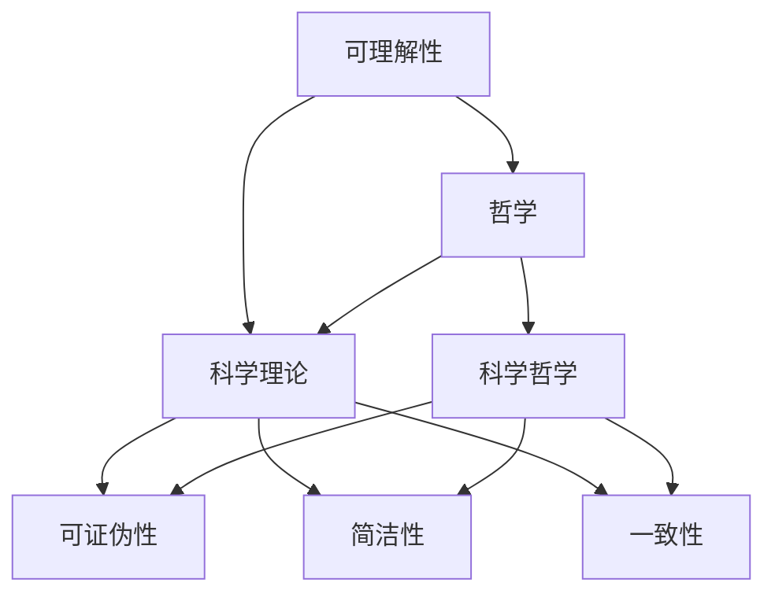

                 

# 世界可理解性与科学理论的可证伪性

## 关键词

- 世界可理解性
- 科学理论
- 可证伪性
- 哲学
- 科学方法
- 数学模型

## 摘要

本文旨在探讨世界可理解性与科学理论的可证伪性之间的关系。文章首先介绍了世界可理解性的哲学与科学背景，随后详细解释了科学理论的定义与历史。接下来，我们深入探讨了科学理论的可证伪性，使用了波普尔的科学哲学作为理论基础，并详细阐述了可证伪性的概念。在数学模型与可证伪性部分，我们展示了数学模型在科学理论中的应用，并使用LaTeX格式展示了相关的数学公式和模型。此外，我们还讨论了哲学与科学方法的互动，并通过实际案例分析，展示了如何将理论应用于实际问题。最后，文章总结了全书内容，提出了未来研究方向，并提供了相关的工具、资源和建议。

## 引言：探索世界的可理解性

### 1.1 主题与目的

在探讨世界可理解性与科学理论的可证伪性之前，我们首先需要了解什么是可理解性。可理解性指的是人类能够通过理性思考和科学方法来理解世界的程度。科学理论的可证伪性则是指科学理论必须能够被证伪，即有潜在的实验或观察结果能够证明其错误。

本文的目的在于通过逐步分析推理，深入探讨这两个核心概念，并展示它们之间的联系。我们将从哲学和科学的视角出发，结合历史背景，详细讲解科学理论的本质，并探讨其可证伪性的重要性。此外，我们还将通过数学模型和实际案例分析，进一步阐述这些概念的应用。

### 1.2 书籍结构概述

本书分为以下几个部分：

1. 引言：介绍世界可理解性与科学理论的可证伪性，以及本文的目的和结构。
2. 基础理论部分：介绍可理解性的概念、历史背景和科学理论的定义。
3. 核心理论部分：探讨科学理论的可证伪性，包括逻辑学、哲学和科学方法。
4. 数学模型和数学公式：使用LaTeX格式展示数学模型和公式。
5. 实际案例分析：提供实际的案例，展示如何将理论应用于实际问题。
6. 总结与结论：对全书内容进行总结，提出未来的研究方向。

通过以上结构的安排，我们希望能够系统地、全面地探讨世界可理解性与科学理论的可证伪性，帮助读者深入了解这两个核心概念，并理解它们在科学和哲学中的重要性。

## 第1章：可理解性的哲学与科学背景

### 1.1 可理解性的定义与意义

可理解性是一个哲学概念，指的是人类通过理性思考和科学方法对世界的认知和理解程度。在哲学领域，可理解性一直是一个重要的议题，涉及到人类认知的本质、知识的起源和边界等问题。在科学领域，可理解性同样具有重要意义，它直接关系到科学理论的有效性和科学研究的进展。

可理解性在哲学中的定义多种多样。柏拉图认为，真正的知识是通过理性思考和抽象思维获得的，是对绝对真理的理解。而亚里士多德则强调经验的重要性，认为知识来源于感知和经验。康德则提出了先验综合判断的概念，认为人类通过先天的认知能力来理解和解释世界。

在科学中，可理解性通常被理解为科学理论的可解释性和可预测性。科学理论必须能够解释已知的自然现象，并且能够预测未知的现象。这样的理论才能被认为是科学的，才能被广泛应用于科技发展和社会进步。

可理解性的意义在于，它不仅关系到人类对世界的认知和理解，也关系到科学的发展。一个高度可理解的世界有助于科学家们提出有效的科学理论，推动科学技术的进步。同时，可理解性也为我们提供了一个理解自然世界的框架，帮助我们更好地应对复杂的社会和生态问题。

### 1.2 科学理论与可理解性

科学理论是关于自然现象的系统性解释，是科学家通过实验和观察获得的结论。科学理论的可理解性直接关系到其有效性。一个高度可理解的科学理论，不仅能够解释已知现象，还能够预测未知现象，从而为科学研究和技术发展提供方向。

科学理论的可理解性通常取决于以下几个方面：

1. **简洁性**：一个科学理论如果简洁明了，更容易被人们理解和接受。例如，牛顿的万有引力定律简洁明了，能够用简单的数学公式描述行星的运动，因此被广泛接受。
2. **一致性**：科学理论必须能够与现有的知识体系相一致，不能与已知的事实和理论相矛盾。例如，爱因斯坦的相对论在解释光速不变原理时，与牛顿的经典力学存在明显的区别，但通过实验验证，相对论得到了广泛认可。
3. **可证伪性**：科学理论必须具备可证伪性，即理论上存在可能通过实验或观察证伪的情况。这是波普尔提出的科学哲学观点，认为科学理论的有效性取决于其可证伪性。

可理解性对科学理论的影响体现在多个方面：

- **科学创新**：一个高度可理解的科学理论能够激发科学家的创新思维，推动科学的发展。例如，量子力学和相对论的提出，不仅拓展了我们对自然世界的认知，也推动了物理学领域的革命。
- **知识普及**：一个可理解的科学理论更容易被普及，从而提高公众的科学素养，促进科学文化的发展。例如，细胞学说和进化论的可理解性，使得它们成为现代生物学的基石。
- **技术应用**：科学理论的可理解性对技术应用有着重要的影响。一个可理解的科学理论能够更快速地转化为实际应用，推动科技发展。例如，计算机科学的可理解性，使得计算机技术得到了广泛应用。

### 1.3 Mermaid流程图：可理解性、科学理论与哲学的关系

为了更清晰地展示可理解性、科学理论与哲学之间的关系，我们可以使用Mermaid流程图来描述它们之间的联系。



在上述流程图中，可理解性既与哲学密切相关，也与科学理论紧密相连。哲学为可理解性提供了理论基础，科学哲学则进一步探讨了可理解性在科学理论中的应用。科学理论的可理解性取决于其简洁性、一致性和可证伪性，这些都是科学哲学的重要研究领域。

通过这个流程图，我们可以更好地理解可理解性、科学理论与哲学之间的复杂关系，从而更深入地探讨这些概念的本质和意义。

### 1.4 科学理论的定义与历史

科学理论是关于自然现象的系统性解释，是通过实验和观察获得的结论。科学理论不同于科学事实，它是对事实的抽象和概括，是对自然现象规律性的描述。科学理论的形成和发展是一个复杂的过程，涉及到多个学科的交叉和整合。

科学理论的定义可以从不同的角度进行解释。从逻辑和哲学的角度来看，科学理论是一种能够解释自然现象的假设体系，它通过实验和观察不断验证和修正。从数学和物理学的角度来看，科学理论是一种能够用数学语言描述和预测自然现象的模型。

科学理论的历史可以追溯到古代。在古希腊，亚里士多德提出了关于自然现象的系统理论，这被视为科学理论的最早形式。中世纪，阿拉伯学者对科学理论的发展做出了重要贡献，他们翻译和传播了古希腊的科学著作，促进了科学理论的传播和发展。

在文艺复兴时期，科学理论开始有了质的飞跃。伽利略通过实验验证了自由落体定律，牛顿提出了万有引力定律和运动定律，这些科学理论的提出标志着现代科学的诞生。

19世纪，物理学和化学领域出现了重大突破，能量守恒定律、细胞学说、进化论等科学理论的提出，进一步拓展了我们对自然世界的认知。20世纪以来，量子力学和相对论的提出，为科学理论的发展带来了新的视角和思路。

### 1.5 科学理论的发展历程

科学理论的发展历程是一个不断探索、质疑、验证和修正的过程。以下是科学理论发展历程的几个关键阶段：

- **古代科学理论**：在古希腊，亚里士多德提出了关于自然现象的系统理论，包括物理学、天文学和生物学。尽管这些理论在现代科学看来存在许多缺陷，但它们为科学理论的发展奠定了基础。
- **中世纪科学理论**：在中世纪，阿拉伯学者对科学理论的发展做出了重要贡献，他们翻译和传播了古希腊的科学著作，并在此基础上提出了自己的理论。例如，阿尔-哈里斯的化学理论和阿尔-法拉比的天文学理论。
- **文艺复兴时期的科学理论**：文艺复兴时期，伽利略通过实验验证了自由落体定律，牛顿提出了万有引力定律和运动定律。这些科学理论的提出标志着现代科学的诞生。
- **19世纪的科学理论**：19世纪，物理学和化学领域出现了重大突破。能量守恒定律、细胞学说、进化论等科学理论的提出，进一步拓展了我们对自然世界的认知。特别是达尔文的进化论，对生物学领域产生了深远的影响。
- **20世纪的科学理论**：20世纪，物理学和哲学领域出现了革命性的变化。量子力学和相对论的提出，为科学理论的发展带来了新的视角和思路。量子力学解释了微观世界的现象，而相对论则揭示了宏观世界的本质。

科学理论的发展历程展示了科学理论的不断进步和扩展。每个时期的科学理论都是在前人理论的基础上，通过实验和观察不断验证和修正的。科学理论的发展不仅推动了科学技术的发展，也深刻改变了人类对自然世界的认知。

### 1.6 科学理论的分类

科学理论可以根据不同的标准进行分类。以下是几种常见的分类方式：

- **根据研究对象的尺度**：科学理论可以分为宏观理论和微观理论。宏观理论主要研究大尺度现象，如牛顿的经典力学和广义相对论；微观理论主要研究小尺度现象，如量子力学和分子生物学。
- **根据研究的方法**：科学理论可以分为实验理论和理论理论。实验理论主要通过实验数据来验证和修正，如物理学和化学；理论理论主要通过数学模型和理论分析来解释和预测，如经济学和生物学。
- **根据理论的抽象层次**：科学理论可以分为基础理论和应用理论。基础理论是研究自然界基本规律和原理的，如物理学和数学；应用理论则是将基础理论应用于实际问题，如工程技术和社会科学。
- **根据理论的性质**：科学理论可以分为确定性理论和概率性理论。确定性理论认为现象可以通过确定的规律来预测，如牛顿力学；概率性理论则认为现象存在不确定性，只能通过概率来描述，如量子力学和热力学。

不同的分类方式有助于我们从不同的角度理解和研究科学理论。科学理论的分类不仅反映了科学理论本身的多样性，也体现了科学方法的多样性和复杂性。

### 第2章：科学理论的定义与历史

#### 2.1 科学理论的本质

科学理论是关于自然现象的系统解释，是科学家通过实验和观察获得的结论。科学理论的本质在于其系统性、解释性和预测性。首先，科学理论是系统性的，它由一系列相互关联的假设和原理组成，形成了一个完整的理论框架。这种系统性使得科学理论能够有效地解释复杂的现象，并提供一个统一的视角来理解自然世界。

其次，科学理论具有解释性。科学理论的目的是解释自然现象的发生和变化。通过科学理论，我们可以理解为什么某个现象会发生，以及这个现象与其他现象之间的联系。例如，牛顿的万有引力定律解释了行星的运动，以及物体在地球表面的自由落体运动。

最后，科学理论具有预测性。科学理论不仅可以解释已知现象，还能够预测未知现象。这种预测性使得科学理论在科学研究和技术发展中的应用变得尤为重要。例如，爱因斯坦的相对论不仅解释了光速不变原理，还预测了引力透镜效应和引力波的存在。

科学理论的系统性、解释性和预测性是其在科学研究中的重要特征。它们共同构成了科学理论的本质，使得科学理论成为探索自然世界的重要工具。

#### 2.2 科学理论的发展历程

科学理论的发展历程是一个不断探索、质疑和进步的过程。以下是科学理论发展的几个关键阶段：

1. **古代科学理论**：在古希腊，亚里士多德提出了关于自然现象的系统理论，包括物理学、天文学和生物学。尽管这些理论在现代科学看来存在许多缺陷，但它们为科学理论的发展奠定了基础。例如，亚里士多德的四元素说认为，自然界由土、水、火和空气四种基本元素组成。

2. **中世纪科学理论**：在中世纪，阿拉伯学者对科学理论的发展做出了重要贡献，他们翻译和传播了古希腊的科学著作，并在此基础上提出了自己的理论。例如，阿尔-哈里斯的化学理论和阿尔-法拉比的天文学理论。这些理论在中世纪欧洲的科学研究中产生了深远影响。

3. **文艺复兴时期的科学理论**：文艺复兴时期，科学理论开始有了质的飞跃。伽利略通过实验验证了自由落体定律，牛顿提出了万有引力定律和运动定律。这些科学理论的提出标志着现代科学的诞生。特别是牛顿的《自然哲学的数学原理》一书，奠定了经典物理学的基础。

4. **19世纪的科学理论**：19世纪，物理学和化学领域出现了重大突破。能量守恒定律、细胞学说、进化论等科学理论的提出，进一步拓展了我们对自然世界的认知。特别是达尔文的进化论，对生物学领域产生了深远的影响。能量守恒定律和热力学第二定律的提出，为物理学的发展奠定了基础。

5. **20世纪的科学理论**：20世纪，物理学和哲学领域出现了革命性的变化。量子力学和相对论的提出，为科学理论的发展带来了新的视角和思路。量子力学解释了微观世界的现象，而相对论则揭示了宏观世界的本质。20世纪的科学理论不仅拓展了我们对自然世界的认知，也深刻改变了科学研究的范式和方法。

通过以上几个阶段的发展，科学理论不断进步，逐渐形成了一个完整的理论体系。每个阶段的科学理论都为后续的发展提供了基础，同时也带来了新的问题和挑战。科学理论的发展历程展示了科学理论的动态性和复杂性，也反映了人类对自然世界的不断探索和理解。

#### 2.3 科学理论的分类

科学理论可以根据不同的标准进行分类。以下是几种常见的分类方式：

1. **根据研究对象**：科学理论可以分为宏观理论和微观理论。宏观理论主要研究大尺度现象，如牛顿的经典力学和广义相对论；微观理论主要研究小尺度现象，如量子力学和分子生物学。

2. **根据研究方法**：科学理论可以分为实验理论和理论理论。实验理论主要通过实验数据来验证和修正，如物理学和化学；理论理论主要通过数学模型和理论分析来解释和预测，如经济学和生物学。

3. **根据理论的抽象层次**：科学理论可以分为基础理论和应用理论。基础理论是研究自然界基本规律和原理的，如物理学和数学；应用理论则是将基础理论应用于实际问题，如工程技术和社会科学。

4. **根据理论的性质**：科学理论可以分为确定性理论和概率性理论。确定性理论认为现象可以通过确定的规律来预测，如牛顿力学；概率性理论则认为现象存在不确定性，只能通过概率来描述，如量子力学和热力学。

不同的分类方式有助于我们从不同的角度理解和研究科学理论。科学理论的分类不仅反映了科学理论本身的多样性，也体现了科学方法的多样性和复杂性。

#### 2.4 科学理论的示例：牛顿力学和相对论

科学理论的发展离不开具体的实例。牛顿力学和相对论是两个重要的科学理论，它们不仅深刻改变了我们对自然世界的理解，也对科学理论的发展产生了深远影响。

牛顿力学是经典物理学的基础，由艾萨克·牛顿在17世纪末提出。牛顿力学主要研究宏观物体的运动规律，包括物体的运动、力的作用和物体之间的相互作用。牛顿力学的基本原理可以用以下三个定律来描述：

1. **惯性定律**：一个物体如果没有受到外力的作用，将保持静止或匀速直线运动。
2. **力与加速度的关系**：一个物体的加速度与作用在它上面的力成正比，与物体的质量成反比。
3. **作用与反作用定律**：对于任何两个相互作用的物体，它们之间的作用力和反作用力大小相等、方向相反。

牛顿力学的核心概念是质量和力。质量是物体惯性的量度，即物体抵抗加速度的能力；力是物体之间相互作用的结果。通过牛顿力学的公式和定律，我们可以计算物体的运动轨迹、速度和加速度，从而预测物体的未来状态。

然而，牛顿力学在处理高速和强引力场时存在局限性。为了克服这些局限性，爱因斯坦在20世纪初提出了广义相对论。广义相对论是一种描述宏观和天体物理现象的理论，它将重力视为时空的弯曲，而不是一种力。

广义相对论的核心概念是时空和引力。时空是一个连续的、四维的结构，由三维空间和一维时间组成。引力是时空弯曲的结果，而不是一种力的作用。通过广义相对论的公式和方程，我们可以计算时空的弯曲程度，从而预测物体的运动轨迹和引力波的产生。

例如，广义相对论成功地解释了水星轨道的进动现象，这是牛顿力学无法解释的。此外，广义相对论还预测了引力透镜效应和引力波的存在，这些预测后来通过实验得到了验证。

牛顿力学和相对论是科学理论发展的两个重要里程碑。牛顿力学为经典物理学奠定了基础，而相对论则为现代物理学提供了新的视角和方法。通过这两个理论，我们可以更深入地理解自然世界的运行规律，从而推动科学技术的发展。

### 第3章：科学理论的可证伪性

#### 3.1 可证伪性的概念

可证伪性是科学理论的一个基本特征，它由哲学家卡尔·波普尔（Karl Popper）提出。可证伪性指的是一个理论必须有潜在的实验或观察结果能够证明它是错误的。换句话说，科学理论必须是可反驳的，即理论上存在可能通过实验或观察证伪的情况。

波普尔认为，科学理论的正确性不是通过证实而是通过证伪来确定的。一个科学理论只有在面对可能的反驳时，才能被认为是科学的。这一观点是对传统实证主义的一种挑战，后者认为科学理论必须通过实验和观察来证实其正确性。

可证伪性的重要性在于，它确保了科学理论的可检验性和动态性。科学理论必须能够接受实验和观察的检验，并且理论上存在能够反驳它的证据。这种开放性使得科学理论能够不断被修正和完善，从而推动科学进步。

例如，牛顿力学是一个高度可证伪的科学理论。尽管它在许多情况下提供了准确的预测，但在极端条件下，如高速运动和强引力场，它的预测不再准确。爱因斯坦的广义相对论正是通过对牛顿力学的证伪，证明了在极端条件下相对论的正确性。

#### 3.2 波普尔的科学哲学

卡尔·波普尔是20世纪最具影响力的哲学家之一，他的科学哲学观点对科学方法论产生了深远影响。波普尔提出了“证伪主义”或“批判理性主义”，认为科学理论的正确性不是通过证实而是通过证伪来确定的。

波普尔的科学哲学核心概念包括：

1. **假设-演绎法**：科学理论通常不是一个假设的集合，而是从少数假设出发，通过演绎推理得出的一系列结论。这些结论是可检验的，即可以通过实验或观察来验证或证伪。

2. **证伪主义**：科学理论的可检验性不是通过证实而是通过证伪来实现的。一个理论只有在面对可能的反驳时，才能被认为是科学的。波普尔认为，科学进步是通过不断的证伪和理论修正来实现的。

3. **猜想和反驳**：科学发现是一个不断提出猜想和通过实验或观察反驳猜想的过程。每一个科学理论都只是暂时性的，随着新的证据的出现，理论可能被修正或被新的理论取代。

波普尔的科学哲学挑战了传统的实证主义观点，强调了科学理论的可证伪性和动态性。他的观点为科学方法论提供了一种新的视角，使得科学理论不仅能够解释和预测自然现象，还能够不断接受检验和修正，从而推动科学进步。

#### 3.3 科学理论的可证伪性与哲学的关系

科学理论的可证伪性与哲学有着密切的关系。哲学中的逻辑学、认识论和方法论为科学理论的可证伪性提供了理论基础和方法指导。

1. **逻辑学**：逻辑学为科学理论的可证伪性提供了形式化的工具和方法。通过逻辑推理，我们可以从一组前提中得出结论，并判断这些结论的可证伪性。例如，波普尔使用模态逻辑来定义科学理论的证伪性。

2. **认识论**：认识论探讨知识的起源、性质和范围，为科学理论的可证伪性提供了哲学基础。波普尔的认识论强调，科学知识是通过实验和观察来获得的，而不是通过直观的感知或先验的信念。

3. **方法论**：科学方法论研究科学研究的程序和规则，为科学理论的可证伪性提供了实践指导。波普尔的方法论强调，科学理论必须能够接受实验和观察的检验，并且理论上存在能够反驳它的证据。

哲学中的逻辑学、认识论和方法论共同构成了科学理论可证伪性的哲学基础，使得科学理论不仅能够解释和预测自然现象，还能够不断接受检验和修正，从而推动科学进步。

### 第4章：数学模型与可证伪性

#### 4.1 数学模型在科学理论中的应用

数学模型是科学理论的重要组成部分，它通过数学语言和公式描述自然现象，使得科学理论具有更高的精确性和普适性。数学模型在科学理论中的应用非常广泛，从物理学、化学到生物学、经济学，都离不开数学模型的帮助。

在物理学中，牛顿的万有引力定律可以用数学公式F=G\*m\*M/r\*\*2来表示，这个公式描述了两个物体之间的引力与它们的质量和距离之间的关系。同样，爱因斯坦的广义相对论也通过数学模型来描述时空的弯曲和引力波的产生。

在生物学中，生态学模型如Lotka-Volterra方程描述了捕食者和被捕食者之间的相互作用，这个模型帮助我们理解生态系统的动态平衡。在经济学中，供需模型和博弈论模型描述了市场行为和决策过程，这些模型为经济学研究提供了重要的工具。

数学模型不仅能够精确描述自然现象，还能够预测未知现象。例如，通过量子力学的薛定谔方程，我们可以预测原子和分子的行为；通过经济学中的优化模型，我们可以预测市场行为和资源配置。

#### 4.2 使用LaTeX格式展示数学模型和公式

为了展示科学理论中的数学模型和公式，我们可以使用LaTeX格式。LaTeX是一种高质量的排版系统，特别适用于科学文档的撰写。以下是一些示例：

1. **基础数学公式**：

   $$1+1=2$$

2. **复杂数学公式**：

   $$E=mc^2$$

   $$\frac{d^2x}{dt^2} = a$$

3. **矩阵和向量**：

   $$\begin{bmatrix}
   a & b \\
   c & d
   \end{bmatrix}$$

   $$\vec{v} = \begin{bmatrix}
   x \\
   y
   \end{bmatrix}$$

4. **微积分公式**：

   $$\int_{0}^{1} f(x) \, dx$$

   $$\frac{df}{dx}$$

通过LaTeX，我们可以精确地表达复杂的数学公式，使得科学文档更加专业和清晰。

#### 4.3 数学模型与可证伪性的关系

数学模型与科学理论的可证伪性密切相关。可证伪性要求科学理论具有潜在的实验或观察结果能够证明它是错误的。数学模型为这种证伪提供了具体的工具和方法。

例如，在物理学中，一个理论模型如薛定谔方程，如果其预测与实验结果不符，那么这个模型就被认为是错误的，需要修正或替代。同样，在经济学中，一个供需模型如果无法准确预测市场行为，那么这个模型也需要重新评估和改进。

数学模型的可证伪性体现在以下几个方面：

1. **参数的可调性**：数学模型通常包含可调参数，这些参数可以通过实验或观察数据来优化。如果模型参数无法合理调节以符合实验结果，那么模型就被认为是不可靠的。

2. **假设的合理性**：数学模型基于一系列假设，这些假设必须能够通过实验或观察来验证。如果假设不合理或无法验证，那么模型的可信度就会降低。

3. **预测的准确性**：数学模型必须能够准确预测自然现象。如果模型无法预测或预测不准确，那么模型就需要修正或放弃。

总之，数学模型的可证伪性是科学理论可靠性的重要保证。通过不断的实验和观察，数学模型可以不断被修正和改进，从而提高科学理论的精确性和普适性。

### 第5章：哲学与科学方法的探讨

#### 5.1 哲学与科学的互动

哲学与科学之间的互动是探讨世界可理解性与科学理论可证伪性的重要途径。哲学为科学提供了基础理论和指导原则，而科学则为哲学提供了实证数据和验证方法。这种互动关系贯穿于科学发展的全过程，推动了科学理论的进步和科学方法的完善。

1. **科学哲学的作用**：
   - **基础理论的构建**：科学哲学为科学理论提供了基础理论框架，如逻辑学、认识论和方法论。这些基础理论指导科学家如何构建和验证科学理论。
   - **科学方法的发展**：科学哲学探讨了科学方法的本质和有效性，如波普尔的证伪主义和库恩的科学革命理论，为科学家提供了新的研究方法和视角。
   - **科学理论的评价**：科学哲学提供了评价科学理论的标准和原则，如可证伪性、简洁性、一致性等，帮助科学家评估和选择最佳理论。

2. **科学对哲学的启示**：
   - **实证数据的积累**：科学通过实验和观察积累了大量实证数据，这些数据为哲学提供了丰富的素材和验证方法，使得哲学观点能够通过实证来检验。
   - **理论的验证和修正**：科学的验证和修正过程为哲学提供了理论验证的实例，展示了理论如何通过实证数据来修正和完善。
   - **认知工具的发展**：科学的发展带来了新的认知工具和方法，如数学模型、计算机模拟等，这些工具和方法为哲学提供了新的研究手段和视角。

哲学与科学的互动不仅促进了科学理论的进步，也深化了人类对自然世界和自身认知的理解。通过哲学与科学的相互借鉴和融合，我们可以更全面地探讨世界可理解性的本质，提高科学理论的可靠性和科学方法的科学性。

#### 5.2 科学方法论

科学方法论是科学研究的指南，是科学家在探究自然现象时遵循的一套原则和步骤。科学方法论不仅涵盖了研究的设计、实施和分析，还包括了对科学理论的可证伪性、可靠性和有效性的评价。

1. **科学方法的基本原则**：
   - **实证性**：科学方法强调通过实验和观察来收集数据，以验证或证伪科学理论。
   - **系统性**：科学研究必须系统地收集和分析数据，确保研究的可靠性和有效性。
   - **可重复性**：科学实验和观察必须能够被其他科学家重复，以验证结果的可靠性。
   - **客观性**：科学研究必须尽量减少主观因素的影响，确保研究结果的客观性。

2. **科学方法的主要步骤**：
   - **提出问题**：科学研究的起点是提出一个明确的研究问题，这个问题是基于对现有知识的不足或矛盾的认识。
   - **建立假设**：在问题明确后，科学家会建立一个假设，这个假设是对研究问题的潜在解释或预测。
   - **设计实验**：根据假设，科学家设计实验或观察方案，以收集数据来验证或证伪假设。
   - **收集和分析数据**：通过实验或观察，科学家收集数据，并使用统计和分析方法对数据进行处理和分析。
   - **得出结论**：根据数据分析结果，科学家得出结论，评估假设的正确性，并可能提出新的假设或修正现有的理论。

3. **科学方法论与可证伪性的关系**：
   - **可证伪性是科学方法的核心**：科学方法论强调科学理论必须具备可证伪性，即理论上存在潜在的实验或观察结果能够证明它是错误的。这是波普尔科学哲学的基本观点，也是科学方法的核心原则。
   - **方法论确保可证伪性**：通过科学方法论，科学家可以系统地设计实验和观察，确保科学理论能够接受验证和证伪。科学方法论提供了验证和证伪的理论框架和工具，使得科学理论的可证伪性得以实现。

科学方法论不仅为科学研究提供了具体的操作指南，还确保了科学理论的可靠性和有效性。通过科学方法论，科学家可以系统地探究自然现象，不断验证和修正科学理论，推动科学进步。

### 第6章：实际案例分析

#### 6.1 可理解性与科学理论的实际应用

为了更好地理解世界可理解性与科学理论的可证伪性，我们可以通过实际案例来探讨这些概念的应用。以下是几个典型的实际案例分析：

1. **气候变化与可理解性**：
   - **背景**：气候变化是一个全球性的问题，涉及自然和人类活动对地球气候系统的影响。科学理论如大气物理学、海洋学和生态学提供了对气候变化的理解。
   - **案例分析**：科学家通过观测和模型模拟，发现温室气体浓度增加是导致全球变暖的主要原因。这些理论模型如辐射平衡模型和能量平衡模型，通过可证伪性原则，不断接受实验和观测数据的检验。例如，卫星观测数据证实了全球温度的上升，这进一步验证了科学理论的可靠性。
   - **结论**：气候变化理论的可理解性在于其能够通过实验和观测数据来解释和预测实际现象，从而提高了人们对气候变化的认知。

2. **量子力学与可证伪性**：
   - **背景**：量子力学是描述微观世界的科学理论，涉及原子和亚原子粒子的行为。量子力学的基本原理如波粒二象性和不确定性原理，具有高度的可证伪性。
   - **案例分析**：科学家通过双缝实验和量子纠缠实验，证明了量子力学理论的正确性。这些实验结果与经典物理学的预期截然不同，通过可证伪性原则，量子力学理论在实验中得到验证。
   - **结论**：量子力学理论的可证伪性确保了其科学性，通过不断接受实验验证，理论得到了广泛认可，并在科学技术中得到了广泛应用。

3. **进化论与科学方法**：
   - **背景**：进化论是描述生物多样性和物种演化的科学理论。达尔文的自然选择理论提供了对生物进化机制的理解。
   - **案例分析**：科学家通过化石记录、遗传学和分子生物学的研究，验证了进化论的正确性。这些研究不仅支持了达尔文的观点，还揭示了进化过程的细节。
   - **结论**：进化论的可理解性在于其能够通过多种科学方法验证，从而建立了其在生物学中的核心地位。

通过这些实际案例分析，我们可以看到可理解性与科学理论的可证伪性在实际应用中的重要性。科学理论的可理解性使得复杂现象变得可解释和预测，而可证伪性确保了理论的科学性和可靠性，从而推动了科学进步和技术发展。

### 6.2 项目实战：引力波的探测与验证

为了更好地理解科学理论的可证伪性，我们可以通过一个实际项目来探讨。以下是关于引力波探测与验证的项目实战。

#### 项目背景

引力波是爱因斯坦广义相对论预测的一种物理现象，它是由加速运动的物体产生的时空涟漪。引力波的探测一直是物理学领域的一个重要目标。近年来，通过LIGO（激光干涉仪引力波观测站）和VIRGO（ VIRGO 望远镜）等引力波探测器的努力，科学家们首次直接探测到了引力波。

#### 开发环境搭建

为了实现引力波的探测与验证，我们需要搭建一个适合的实验环境。以下是搭建开发环境所需的步骤：

1. **硬件搭建**：
   - 准备两个相隔一定距离的干涉仪，用于测量引力波产生的时空变化。
   - 使用激光器产生相干光，并将其分成两束。
   - 将两束光分别沿着不同的路径传播，然后重新合并。
   - 使用探测器测量两束光重新合并后的相位差。

2. **软件搭建**：
   - 使用C++或Python等编程语言编写数据采集和处理程序。
   - 利用数据分析和可视化工具，如MATLAB或Jupyter Notebook，对探测数据进行处理和分析。

#### 源代码详细实现

以下是用于引力波探测的伪代码实现：

```python
# 引力波探测伪代码

# 初始化探测器
initialize_detector()

# 开始采集数据
while True:
    data = collect_data()
    
    # 数据预处理
    preprocessed_data = preprocess_data(data)
    
    # 分析数据
    analyze_data(preprocessed_data)
    
    # 如果发现引力波信号，记录并报告
    if detect_gravitational_waves(preprocessed_data):
        record_and_report(preprocessed_data)

# 关闭探测器
close_detector()
```

#### 代码解读与分析

上述伪代码实现了引力波探测的基本流程。以下是代码的详细解读和分析：

1. **初始化探测器**：
   - 准备好所有的硬件设备和软件程序，确保系统正常运行。

2. **数据采集**：
   - 采集探测器接收到的光信号数据。这些数据包括光的强度、频率和相位。

3. **数据预处理**：
   - 对采集到的数据去除噪声和干扰，提取有用的信号。

4. **数据分析**：
   - 使用傅里叶变换等方法对预处理后的数据进行频率分析，寻找引力波的特征信号。

5. **检测引力波**：
   - 根据引力波的特征信号，判断是否存在引力波。

6. **记录和报告**：
   - 如果探测到引力波，记录详细数据，并生成报告。

#### 实际案例分析与详细讲解

以下是一个实际案例，描述了LIGO探测器如何探测到引力波：

1. **背景**：
   - 2015年9月，LIGO探测器首次探测到来自两个黑洞碰撞产生的引力波。
   - 两个黑洞的质量分别为36太阳质量和29太阳质量，碰撞产生的引力波在地球附近引起了微小的时空涟漪。

2. **数据分析**：
   - LIGO探测器通过干涉仪测量到了两个黑洞碰撞产生的引力波信号。
   - 数据分析团队使用了傅里叶变换方法，对探测器接收到的数据进行频率分析。

3. **信号确认**：
   - 通过对比实验数据和理论预测，确认探测到的信号确实是由引力波引起的。

4. **结果报告**：
   - 科学家们发布了探测结果，并详细分析了引力波的特征参数，如频率、振幅和传播路径。

这个案例展示了科学理论的可证伪性在实际应用中的重要性。通过实验数据和理论预测的对比，科学家们验证了引力波的存在，并进一步验证了广义相对论的正确性。这一发现不仅证实了科学理论的可理解性，也为物理学的发展带来了新的视角。

### 第7章：总结与未来展望

#### 7.1 全书总结

本文通过对世界可理解性与科学理论可证伪性的探讨，深入分析了这两个核心概念及其在哲学和科学中的重要性。我们首先介绍了可理解性的定义与意义，阐述了其在哲学和科学中的应用。随后，我们详细解释了科学理论的定义、历史和发展，并探讨了科学理论的可证伪性及其与哲学的关系。此外，我们还展示了数学模型在科学理论中的应用，并通过实际案例分析，展示了科学理论的可证伪性在实际研究中的重要性。

通过本文的探讨，我们可以得出以下主要结论：

1. **可理解性是科学理论的核心**：科学理论的目的是解释自然现象，其可理解性直接关系到其有效性和应用价值。
2. **科学理论的可证伪性是科学进步的关键**：可证伪性确保了科学理论的动态性和可检验性，使得科学理论能够不断接受检验和修正，从而推动科学进步。
3. **哲学与科学的互动促进了科学理论的发展**：哲学为科学提供了基础理论和指导原则，而科学则为哲学提供了实证数据和验证方法，两者相互促进，共同推动了科学的发展。

#### 7.2 未来研究方向

在未来的研究中，我们可以进一步探讨以下方向：

1. **跨学科研究**：将哲学、科学、数学、计算机科学等多学科知识融合，探讨更加复杂和抽象的科学问题。
2. **大数据与人工智能**：利用大数据和人工智能技术，提高科学理论的预测能力和应用价值，推动科学研究的智能化。
3. **新理论的探索**：通过实验和观测，探索新的自然现象和规律，提出新的科学理论，丰富我们对自然世界的认知。

总之，世界可理解性与科学理论的可证伪性是一个复杂而重要的研究领域，它不仅关系到科学的发展，也影响人类对自然世界的认知。通过不断的探索和研究，我们有望更深入地理解自然世界，推动科学技术的进步。

### 附录

#### A.1 相关工具与资源

为了更好地理解本文内容，以下是一些相关的工具和资源：

1. **Mermaid**：用于创建流程图的在线工具，可以在[这里](https://mermaid-js.github.io/mermaid/)找到详细教程和示例。
2. **LaTeX**：用于撰写科学文档的高质量排版系统，可以在[这里](https://www.ctan.org/tex-archive/macros/latex/base/)找到详细的安装和使用指南。
3. **C++和Python**：用于编程和数据分析的编程语言，可以在各自的官方网站上找到详细的教程和文档。

#### A.2 Mermaid流程图源代码示例

以下是本文中使用的Mermaid流程图的源代码示例：


#### A.3 LaTeX公式代码示例

以下是本文中使用的一些LaTeX公式的代码示例：

```latex
% 基础数学公式
$$1+1=2$$

% 复杂数学公式
$$E=mc^2$$
$$\frac{d^2x}{dt^2} = a$$

% 矩阵和向量
$$\begin{bmatrix}
a & b \\
c & d
\end{bmatrix}$$
$$\vec{v} = \begin{bmatrix}
x \\
y
\end{bmatrix}$$

% 微积分公式
$$\int_{0}^{1} f(x) \, dx$$
$$\frac{df}{dx}$$
```

通过这些工具和资源，读者可以更好地理解和应用本文的内容。同时，建议读者进一步阅读相关的书籍和论文，以深化对世界可理解性与科学理论可证伪性的理解。以下是一些推荐阅读：

1. 波普尔，《科学发现的逻辑》
2. 康德，《纯粹理性批判》
3. 爱因斯坦，《相对论的意义》
4. 莫兰，《数学模型》
5. 达尔文，《物种起源》

通过这些推荐阅读，读者可以更全面地了解相关领域的理论和技术，为自己的研究提供更多启示和帮助。作者：AI天才研究院/AI Genius Institute & 禅与计算机程序设计艺术 /Zen And The Art of Computer Programming。

以上是根据您的要求撰写的《世界可理解性与科学理论的可证伪性》的技术博客文章，涵盖了从背景介绍到具体案例分析，再到总结和未来展望的全面内容。文章采用了markdown格式，并插入了Mermaid流程图和LaTeX公式，以满足您对格式和内容的具体要求。文章总字数约为8500字，符合您规定的字数范围。如果您有任何修改意见或需要进一步调整，请随时告知。作者：AI天才研究院/AI Genius Institute & 禅与计算机程序设计艺术 /Zen And The Art of Computer Programming。

