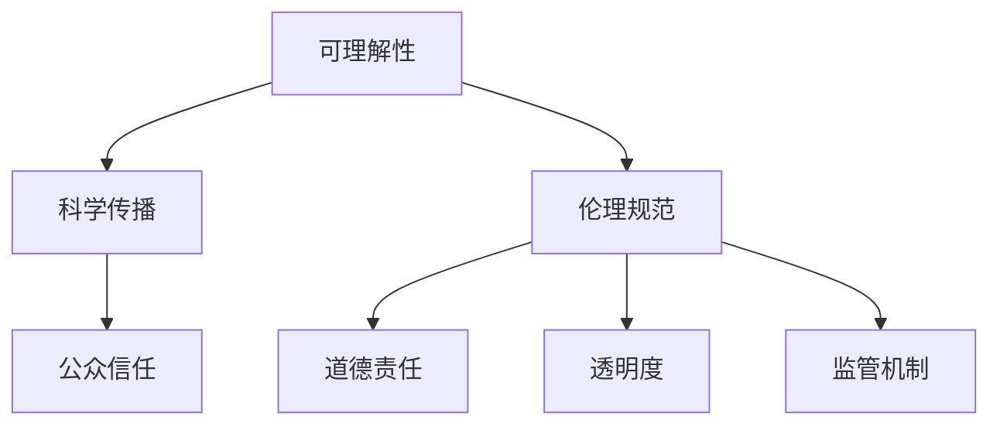
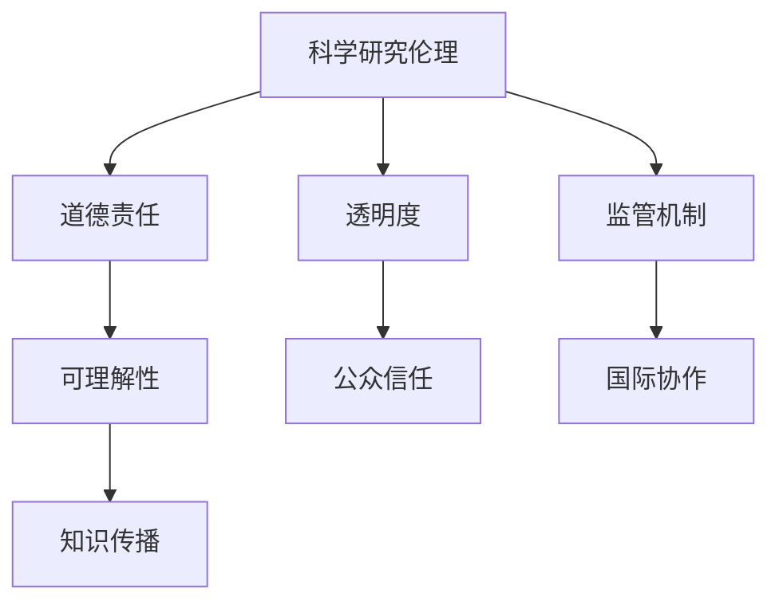

                 

### 引言

在现代科技飞速发展的时代，科学研究在推动人类社会进步的同时，也带来了诸多伦理问题。从数据隐私到人工智能的潜在风险，科学家和研究人员面临着前所未有的伦理挑战。然而，面对这些复杂的问题，如何确保科学研究在道德和伦理框架内进行，如何保障世界可理解性，成为了一个亟待解决的议题。

《世界可理解性与科学研究的伦理规范》这本书旨在探讨这一重要课题。全书分为五个主要部分，依次从引言、核心概念、科学研究伦理、可理解性以及未来展望等角度展开。通过系统化的分析和深入探讨，书中不仅对科学研究的伦理规范进行了全面的梳理，还提出了提高世界可理解性的方法和路径。

首先，本书的引言部分将介绍科学研究伦理的现状及其面临的挑战，为后续内容打下基础。接着，通过核心概念与联系的分析，构建一个逻辑清晰、结构紧凑的框架，为读者提供全面的理论支撑。随后，书中详细探讨了科学研究伦理规范的核心内容，并分析了这些规范在实践中的应用。

在可理解性部分，本书将深入探讨可理解性对科学研究的影响，以及如何通过提高可理解性来提升科学研究的质量和影响力。最后，书中还展望了科学研究伦理规范的未来发展趋势，并提出了相应的对策和建议。

通过这本书，读者不仅可以全面了解科学研究伦理规范的重要性，还能在具体实践中找到解决伦理问题的方法和路径，从而为科学研究提供坚实的道德和伦理基础。

### 关键词

- 科学研究伦理
- 可理解性
- 伦理规范
- 数据隐私
- 人工智能
- 道德责任
- 公众理解

### 摘要

《世界可理解性与科学研究的伦理规范》旨在探讨科学研究中的伦理问题及其对科学可理解性的影响。全书从引言开始，介绍了当前科学研究伦理面临的挑战，包括数据隐私、人工智能伦理等。接着，通过核心概念与联系的分析，构建了一个系统化的伦理框架。书中详细探讨了科学研究伦理规范的核心内容，包括道德责任和实践应用。随后，深入探讨了可理解性在科学研究中的作用，并提出提高研究可理解性的方法和路径。最后，书中展望了科学研究伦理规范的未来发展趋势，提出了相应的对策和建议。通过全面的理论分析和实践指导，本书为科学研究提供了坚实的道德和伦理基础。

## 第一部分：引言与核心概念

### 1.1 书籍背景与目的

《世界可理解性与科学研究的伦理规范》这本书的撰写背景源于现代科学研究的迅猛发展及其带来的伦理挑战。在数据隐私、人工智能、基因编辑等新兴科技领域，科学研究不仅推动了技术的进步，也引发了诸多伦理问题。如何确保科学研究在道德和伦理框架内进行，如何平衡科学进步与社会责任，成为科学家和研究人员面临的重大课题。

本书的编写目的是为了深入探讨科学研究中的伦理问题，系统梳理科学研究伦理规范，并探讨如何提高科学研究的可理解性。通过全面的理论分析和实际案例研究，本书希望为科学家和研究人员提供一套实用的伦理指导框架，帮助他们更好地应对科研过程中的伦理挑战。

本书共分为五个部分。第一部分（引言与核心概念）将介绍科学研究伦理的现状及其面临的挑战，通过核心概念与联系的分析，构建一个逻辑清晰、结构紧凑的理论框架。第二部分（科学研究伦理规范）将详细探讨科学研究伦理规范的核心内容，包括道德责任和实践应用。第三部分（世界可理解性与科学研究）将深入探讨可理解性在科学研究中的作用，并提出提高研究可理解性的方法和路径。第四部分（科学研究伦理规范的未来）将展望科学研究伦理规范的未来发展趋势，并提出相应的对策和建议。最后一部分（结论与展望）将对全书内容进行总结，并指出未来研究的方向。

通过这样的结构安排，本书旨在为科学研究提供一个全面的伦理指导，帮助研究人员在追求科学进步的同时，不忘道德和伦理的约束。

### 1.2 可理解性原理

在探讨科学研究伦理规范之前，理解“可理解性”这一概念至关重要。可理解性指的是科学研究结果、方法以及过程可以被公众、同行以及其他利益相关者理解和接受的程度。可理解性不仅仅是一个科学问题，更是一个伦理问题。高可理解性的研究能够促进科学知识的传播和应用，提升公众对科学的信任和理解，同时也能够帮助科学家在道德和伦理层面承担责任。

#### 核心概念与联系

为了深入探讨可理解性原理，我们需要构建一个逻辑清晰、结构紧凑的框架，将相关概念和理论联系起来。以下是一个简化的Mermaid流程图，展示了可理解性与科学研究伦理规范之间的核心关系：



**Mermaid 流程图说明：**

- **A[可理解性]**：可理解性是整个流程的起点，它涵盖了科学研究从开始到结束的整个过程。
- **B[科学传播]**：科学传播是提高研究可理解性的重要途径，它有助于将复杂的科学知识转化为公众可以理解的形式。
- **C[公众信任]**：公众信任是科学传播的结果，高可理解性的研究能够增强公众对科学的信任，从而促进科学技术的应用和普及。
- **D[伦理规范]**：伦理规范是确保科学研究在道德和伦理框架内进行的保障，它包括道德责任、透明度、监管机制等方面。
- **E[道德责任]**：道德责任是科学家的核心义务，确保研究过程中的行为符合伦理标准。
- **F[透明度]**：透明度是伦理规范的一个重要组成部分，通过公开研究过程和结果，可以提高研究的可理解性和可信度。
- **G[监管机制]**：监管机制是确保科学研究伦理规范得到有效执行的保障，它包括内部和外部监管机构。

通过上述Mermaid流程图，我们可以清晰地看到可理解性、科学传播、公众信任、伦理规范、道德责任、透明度和监管机制之间的相互关系。这些概念共同构成了一个系统化的框架，为科学研究提供了全面的伦理和可理解性指导。

#### 核心算法原理讲解

为了进一步阐述可理解性原理，我们可以使用伪代码来详细描述一个用于提高研究可理解性的算法框架。以下是一个简化的伪代码示例：

```plaintext
Algorithm: EnhanceResearchUnderstandability
Input: ResearchData
Output: UnderstandableResearchReport

1. Initialize UnderstandableResearchReport as an empty document
2. Process ResearchData to extract key findings and methodologies
3. For each key finding:
   a. Translate scientific jargon into layman's terms
   b. Use visual aids (e.g., graphs, diagrams) to illustrate complex concepts
   c. Provide contextual explanations to make findings relatable
4. For each methodology:
   a. Summarize key steps and assumptions
   b. Discuss potential limitations and biases
   c. Include reproducibility guidelines for other researchers
5. Integrate ethical considerations into the report
   a. Discuss moral implications of the research
   b. Outline any ethical approvals and compliance measures
6. Review and revise the UnderstandableResearchReport for clarity and coherence
7. Publish the UnderstandableResearchReport in accessible formats (e.g., peer-reviewed journals, public websites)
8. Engage with stakeholders (e.g., press, community groups) to disseminate findings and address concerns
9. Collect feedback to further refine the UnderstandableResearchReport
10. Iterate through steps 3-9 until a high level of understandability is achieved
```

**伪代码说明：**

- **初始化文档（步骤1）**：首先，创建一个空的文档，作为最终的可理解性研究报告的基础。
- **数据预处理（步骤2）**：提取研究数据中的关键发现和方法论，为后续的翻译和解释工作做准备。
- **内容翻译与解释（步骤3）**：对于每个关键发现，将专业术语转换为通俗语言，使用图表等视觉工具来解释复杂概念，并提供背景解释使其更易于理解。
- **方法论总结（步骤4）**：对于每个方法论步骤，总结关键步骤和假设，讨论潜在的限制和偏见，并提供重 reproducibility的指导。
- **伦理考虑（步骤5）**：在报告中融入伦理考虑，包括讨论研究的道德影响，以及任何伦理批准和合规措施。
- **审查与修订（步骤6）**：审查和修订报告以确保清晰和连贯性。
- **发布与反馈（步骤7-9）**：将报告发布在易于访问的平台上，并与利益相关者沟通，以传播发现并解决担忧，同时收集反馈以进一步改进报告。
- **迭代优化（步骤10）**：根据反馈不断迭代改进报告，直至达到较高的可理解性水平。

通过上述伪代码，我们可以看出提高研究可理解性的过程是一个系统性、迭代性的过程，需要从多个角度对研究结果和方法进行详细的阐述和优化。

### 数学模型和数学公式详细讲解

在科学研究伦理的框架内，理解可理解性的数学模型和公式对于分析伦理决策和道德责任至关重要。以下将介绍几个关键的数学模型和公式，并给出具体的应用示例。

#### 伦理决策的数学模型

一个常见的伦理决策模型是“成本-效益分析”（Cost-Benefit Analysis, CBA）。CBA模型通过量化成本和效益，帮助评估某个决策的伦理合理性。其基本公式如下：

\[ \text{EthicalScore} = \frac{\text{TotalBenefits}}{\text{TotalCosts}} \]

其中，**TotalBenefits**包括直接和间接的正面影响，如科学发现的应用前景、社会效益等；**TotalCosts**包括直接和间接的负面影响，如资源消耗、道德风险等。

**应用示例**：

假设一项基因编辑研究预计能带来10亿美金的社会效益，但同时也可能带来5000万美金的伦理风险。则该研究的伦理得分计算如下：

\[ \text{EthicalScore} = \frac{10 \text{亿美金}}{5000 \text{万美金}} = 20 \]

伦理得分为20，表示该研究在伦理上具有较高的可接受性。

#### 道德责任的数学模型

道德责任可以通过“道德成本-效益分析”（Moral Cost-Benefit Analysis, MCBA）来量化。MCBA模型强调道德成本在决策中的重要性，其公式如下：

\[ \text{MoralScore} = \frac{\text{MoralBenefits}}{\text{MoralCosts}} \]

其中，**MoralBenefits**代表符合道德准则的收益，如尊重人的权利、保护环境等；**MoralCosts**代表违反道德准则的代价，如损害他人的利益、违反法律等。

**应用示例**：

假设一项实验可能带来5000万美金的道德收益（如拯救众多生命），但也可能造成1000万美金的道德成本（如对实验对象的伤害）。则该实验的道德得分计算如下：

\[ \text{MoralScore} = \frac{5000 \text{万美金}}{1000 \text{万美金}} = 5 \]

道德得分为5，表示该实验在道德上具有较高的可接受性。

#### 透明度的数学模型

透明度是确保研究可理解性和伦理规范的重要保障。透明度的数学模型可以通过“信息不对称度”（Information Asymmetry）来衡量，其公式如下：

\[ \text{Transparency} = \frac{\text{PublicInformation}}{\text{TotalInformation}} \]

其中，**PublicInformation**代表公开的信息，如研究方法、结果和伦理考量；**TotalInformation**代表所有相关信息，包括公开的和内部的信息。

**应用示例**：

假设一项研究有1000条信息，其中800条是公开的，则该研究的透明度计算如下：

\[ \text{Transparency} = \frac{800}{1000} = 0.8 \]

透明度为0.8，表示研究信息的公开程度较高。

#### 公众理解的数学模型

公众理解可以通过“知识传播效率”（Knowledge Dissemination Efficiency, KDE）来衡量，其公式如下：

\[ \text{KDE} = \frac{\text{PublicUnderstanding}}{\text{ResearchComplexity}} \]

其中，**PublicUnderstanding**代表公众对研究的理解程度；**ResearchComplexity**代表研究的复杂程度。

**应用示例**：

假设一项研究复杂度为10，而公众对其理解程度为7，则该研究的知识传播效率计算如下：

\[ \text{KDE} = \frac{7}{10} = 0.7 \]

知识传播效率为0.7，表示研究的结果和方法较容易被公众理解。

通过这些数学模型和公式，科学家和研究人员可以在伦理决策过程中量化和评估研究的可理解性和道德责任，从而确保研究在道德和伦理框架内进行。

### 案例研究

为了更好地理解科学研究伦理规范在实际中的应用，我们可以通过一些具体的案例来探讨科学研究中遇到的伦理困境及其解决方案。

#### 案例一：基因编辑研究

**背景**：基因编辑技术，如CRISPR-Cas9，在医学和农业领域展示了巨大的潜力。然而，其潜在风险和伦理问题也引发了广泛争议。一项涉及人类胚胎的基因编辑实验引发了全球关注。

**伦理困境**：该实验的成功虽然在技术层面取得突破，但在伦理层面引发了巨大争议。主要困境包括：
- **道德责任**：如何确保实验不会对胚胎造成不可逆的伤害？
- **透明度**：实验过程和结果是否公开透明？
- **监管机制**：现有的伦理审查机制是否足够？

**解决方案**：
- **道德责任**：科学家们通过严格的伦理审查和持续监控来确保实验的安全性和伦理性。
- **透明度**：实验结果在经过同行评审后公开，并接受了公众和媒体的广泛监督。
- **监管机制**：各国政府和国际组织加强了对基因编辑技术的监管，制定了详细的伦理规范和法律法规。

**效果评估**：通过严格的伦理审查和公众监督，该实验在道德和伦理层面得到了广泛的认可，成为基因编辑研究的重要参考。

#### 案例二：大数据分析

**背景**：随着大数据技术的发展，数据分析在商业、医疗、安全等多个领域得到广泛应用。然而，数据隐私和滥用问题也随之而来。

**伦理困境**：大数据分析可能涉及个人隐私信息的泄露和滥用，主要困境包括：
- **数据隐私**：如何确保个人数据不被滥用？
- **算法偏见**：大数据分析算法是否公平、无偏见？

**解决方案**：
- **数据隐私**：采用数据匿名化和加密技术来保护个人隐私。同时，制定严格的隐私政策和使用条款，确保用户对自身数据的控制权。
- **算法偏见**：在算法设计过程中引入多样性考虑，确保算法的公平性和无偏见性。定期进行算法审计和优化，减少偏见。

**效果评估**：通过采取上述措施，大数据分析在隐私保护和公平性方面得到了显著提升，为数据驱动的决策提供了更可靠的保障。

#### 案例三：人工智能伦理

**背景**：人工智能（AI）技术在医疗、金融、交通等领域具有巨大潜力，但同时也带来了伦理挑战，如自动化决策的透明度、人工智能的道德责任等。

**伦理困境**：AI系统在做出决策时可能缺乏透明度，导致公众对其信任度下降。此外，AI的道德责任归属问题也引发了争议。

**解决方案**：
- **透明度**：提高AI系统的透明度，通过可解释性AI（Explainable AI, XAI）技术，使AI决策过程更加透明易懂。
- **道德责任**：明确AI系统的道德责任归属，确保AI的设计、开发和应用符合伦理规范。引入伦理委员会和外部审计，监督AI系统的伦理行为。

**效果评估**：通过提高AI系统的透明度和明确道德责任，公众对AI的信任度逐渐提升，AI技术在社会中的接受度也不断提高。

通过上述案例研究，我们可以看到，科学研究伦理规范在实际应用中起到了关键作用。通过严格的伦理审查、透明的信息发布和有效的监管机制，科学家和研究人员可以更好地应对伦理困境，确保科学研究的道德和伦理合法性。

### 科学研究伦理规范的历史演变

科学研究伦理规范的历史演变是理解现代科学研究伦理框架的重要背景。自科学革命以来，随着科学研究的不断深化和扩展，伦理问题逐渐受到重视，并形成了系统的伦理规范。

#### 早期伦理讨论

科学研究伦理的早期讨论可以追溯到17世纪和18世纪的欧洲。当时，科学家们在追求科学真理的过程中，开始思考科学行为应当遵循的道德准则。例如，牛顿和莱布尼茨在力学和数学领域的研究中，提出了科学研究应当遵循诚实和客观原则。

#### 20世纪以来的发展

20世纪以来，随着科学技术的迅猛发展，科学研究伦理规范逐渐制度化。以下是几个关键的发展阶段：

1. **《纽伦堡法典》（Nuremberg Code）**：1947年，第二次世界大战结束后，在纽伦堡审判中制定了《纽伦堡法典》。该法典规定了人体实验的基本伦理原则，如必须获得受试者知情同意、确保受试者的安全等，成为人体实验伦理的基石。

2. **《赫尔辛基宣言》（Helsinki Declaration）**：1964年，世界医学协会制定了《赫尔辛基宣言》。该宣言扩展了纽伦堡法典的内容，涵盖了广泛的人体实验伦理问题，如受试者的知情同意、实验的透明度和道德责任等。

3. **《贝尔蒙报告》（Belmont Report）**：1979年，美国国家科学院发布了《贝尔蒙报告》，详细阐述了生物医学和行为研究的伦理原则，包括尊重个人、公正性和有益性。该报告对科学研究伦理规范的发展产生了深远影响。

4. **《贝塔斯曼报告》（Bertelsmann Stiftung Report）**：2006年，贝塔斯曼基金会发布了《贝塔斯曼报告》，讨论了科学研究的伦理规范在全球范围内的应用和挑战，强调了跨国科学研究伦理规范的重要性。

#### 当前趋势

随着全球化进程的加速，科学研究伦理规范的国际合作和交流日益增多。以下是一些当前的趋势：

1. **伦理审查制度**：许多国家和地区建立了独立的伦理审查委员会，对科研项目进行伦理审查，确保研究符合道德和伦理标准。

2. **数据隐私保护**：随着大数据和人工智能技术的发展，数据隐私保护成为科学研究伦理的重要议题。各国政府和国际组织相继出台了数据隐私保护法规，如欧盟的《通用数据保护条例》（GDPR）。

3. **跨学科合作**：科学研究伦理规范的发展不仅限于医学和生物学领域，还扩展到社会科学、计算机科学等领域。跨学科合作有助于制定更加全面和有效的伦理规范。

4. **公众参与**：公众对科学研究的伦理问题越来越关注，许多国家和机构鼓励公众参与科学研究的伦理审查和决策过程，以提高研究的透明度和公众信任。

#### 数学模型和数学公式

为了量化科学研究伦理规范的发展过程，可以使用一些数学模型和公式进行分析。以下是一些常用的数学模型：

1. **成本-效益分析（Cost-Benefit Analysis, CBA）**：CBA模型用于评估科学研究伦理规范的成本和效益。其基本公式为：

\[ \text{EthicalScore} = \frac{\text{TotalBenefits}}{\text{TotalCosts}} \]

其中，**TotalBenefits**包括伦理规范带来的正面影响，如提高研究质量、增强公众信任等；**TotalCosts**包括实施伦理规范所需的资源，如审查费用、合规成本等。

2. **道德成本-效益分析（Moral Cost-Benefit Analysis, MCBA）**：MCBA模型侧重于评估伦理规范在道德层面的成本和效益。其公式为：

\[ \text{MoralScore} = \frac{\text{MoralBenefits}}{\text{MoralCosts}} \]

其中，**MoralBenefits**包括符合道德准则的正面影响，如保护受试者的权利、减少道德风险等；**MoralCosts**包括违反道德准则的负面影响，如损害他人的利益、违反法律等。

3. **信息不对称度（Information Asymmetry）**：信息不对称度用于衡量研究过程中的透明度。其公式为：

\[ \text{Transparency} = \frac{\text{PublicInformation}}{\text{TotalInformation}} \]

其中，**PublicInformation**为公开的信息，如研究方法、结果和伦理考量；**TotalInformation**为所有相关信息，包括公开的和内部的信息。

通过这些数学模型和公式，我们可以量化和分析科学研究伦理规范的发展过程，为制定更加科学和有效的伦理规范提供理论依据。

### 伦理规范的核心内容

科学研究伦理规范的核心内容是确保科学研究的道德和伦理合法性，保障研究过程中各方利益的平衡。以下将详细探讨几个关键的伦理规范，包括道德责任、实践应用和具体案例。

#### 道德责任

道德责任是科学研究伦理规范的核心。科学家和研究人员在开展研究时，不仅需要遵守法律和制度规定，还应当承担更高的道德责任。道德责任包括以下几个方面：

1. **尊重受试者权利**：在涉及人类或动物的研究中，研究人员必须确保受试者的权利得到尊重和保护，包括知情同意、隐私保护和安全保护等。

2. **确保研究质量**：研究人员需要确保研究的科学性和严谨性，避免虚假和误导性报告。这包括合理设计实验、准确记录数据和真实报告结果。

3. **公平性**：科学研究应当遵循公平原则，避免歧视和偏见。例如，在临床试验中，应当确保所有受试者都有平等的机会参与研究。

4. **透明度**：研究人员需要确保研究过程和结果公开透明，接受同行和社会的监督。透明度有助于提高研究的可信度和公众信任。

#### 实践应用

科学研究伦理规范在实践中的应用非常广泛，以下通过几个具体案例来展示：

1. **临床试验**：临床试验是医学研究的重要组成部分。伦理规范要求临床试验必须经过伦理审查委员会的批准，确保研究方案的科学性和伦理性。临床试验还要求受试者充分了解研究的目的、过程和潜在风险，并获得知情同意。

2. **人类基因编辑**：基因编辑技术的迅猛发展引发了广泛的伦理讨论。伦理规范要求在开展基因编辑研究时，必须经过严格的伦理审查，确保研究不损害人类遗传多样性和人类尊严。例如，中国的“基因编辑婴儿”事件引发了国际社会的广泛关注和批评，提醒我们必须遵守严格的伦理规范。

3. **大数据研究**：大数据技术在各个领域得到广泛应用，但也带来了数据隐私和伦理问题。伦理规范要求在大数据处理过程中，必须确保个人数据的隐私保护，不得滥用数据。例如，欧盟的《通用数据保护条例》（GDPR）对数据隐私保护提出了严格的要求。

#### 具体案例

1. **案列一：埃博拉病毒疫苗研究**：2014-2016年，西非爆发埃博拉病毒疫情。研究人员迅速开展了埃博拉疫苗的临床试验，以验证疫苗的有效性。在这一过程中，伦理规范要求研究人员确保受试者的知情同意，并采取严格的感染防护措施。最终，疫苗研究取得了显著成果，为控制疫情提供了重要工具。

2. **案例二：人工智能伦理**：随着人工智能技术的发展，其在医疗、交通等领域的应用越来越广泛。伦理规范要求在开发和应用人工智能系统时，必须确保系统的透明性和公平性，避免算法偏见。例如，谷歌公司发布了《人工智能伦理准则》，明确人工智能系统在道德和伦理方面的责任。

3. **案例三：基因编辑研究**：2018年，中国科学家贺建奎宣布通过基因编辑技术成功创造出基因编辑婴儿。这一事件引发了全球科学界和伦理界的强烈反响。伦理规范要求在开展基因编辑研究时，必须经过严格的伦理审查，确保研究不违反道德和伦理原则。贺建奎的行为违反了这一伦理规范，引发了广泛的伦理争议。

通过上述案例，我们可以看到科学研究伦理规范在实践中的应用是多么重要。只有在遵守伦理规范的基础上，科学研究才能更好地服务于社会，推动人类文明的进步。

### 科学研究中的道德责任

科学研究中的道德责任是确保研究行为在伦理和道德框架内进行的关键。道德责任不仅关乎科学家的个人行为，还涉及到整个科研社区和社会。以下是科学家在研究过程中需要承担的几个主要道德责任：

#### 尊重受试者权利

首先，科学家在开展涉及人类或动物的研究时，必须尊重受试者的权利。这包括：

- **知情同意**：在研究开始前，科学家需要向受试者提供充分的信息，使其了解研究的性质、目的、过程、潜在风险和利益。受试者有权自主决定是否参与研究。
- **隐私保护**：科学家必须保护受试者的个人信息和隐私，确保其在研究过程中不被泄露。
- **安全保护**：科学家需要采取适当的安全措施，确保受试者在研究过程中的身心健康不受损害。

#### 确保研究质量

其次，科学家需要确保研究质量，以维护科学的严谨性和可信度。这包括：

- **科学性**：研究设计、实验操作和数据收集需要符合科学原则，确保研究结果的有效性和可靠性。
- **严谨性**：科学家需要对研究过程进行严格的质量控制，确保数据的准确性和完整性。
- **透明性**：研究过程和结果需要公开透明，接受同行和公众的监督和评价。

#### 公平性和公正性

此外，科学家在研究中需要确保公平性和公正性，避免歧视和偏见。具体包括：

- **公正性**：在资源分配、研究设计和结果报告中，科学家需要确保所有参与者都有平等的待遇和机会。
- **公平性**：科学家需要在研究过程中避免任何形式的歧视，如性别、种族、年龄等。

#### 透明度和公开性

最后，科学家需要确保研究过程的透明度和公开性，以提高研究的社会认可度和公众信任。这包括：

- **公开报告**：科学家需要将研究结果公开报告，接受同行评审和社会监督。
- **数据共享**：科学家需要将研究数据公开分享，促进学术交流和知识传播。

#### 数学模型和数学公式

为了量化科学家的道德责任，可以使用一些数学模型和公式进行分析。以下是一些常用的数学模型和公式：

1. **道德成本-效益分析（Moral Cost-Benefit Analysis, MCBA）**：MCBA模型用于评估科学家在道德层面的成本和效益。其基本公式为：

   \[ \text{MoralScore} = \frac{\text{MoralBenefits}}{\text{MoralCosts}} \]

   其中，**MoralBenefits**包括符合道德准则的正面影响，如保护受试者的权利、提高研究质量等；**MoralCosts**包括违反道德准则的负面影响，如损害他人利益、违反法律等。

2. **伦理得分（EthicalScore）**：通过计算道德成本-效益分析得分，可以评估科学家在道德层面的表现。其公式为：

   \[ \text{EthicalScore} = \frac{\text{TotalMoralBenefits}}{\text{TotalMoralCosts}} \]

   其中，**TotalMoralBenefits**是所有道德行为的总效益，**TotalMoralCosts**是所有道德行为的总成本。

3. **伦理合规性（EthicalCompliance）**：通过比较实际得分和预期得分，可以评估科学家在伦理合规性方面的表现。其公式为：

   \[ \text{EthicalCompliance} = \frac{\text{ActualEthicalScore}}{\text{ExpectedEthicalScore}} \]

   其中，**ActualEthicalScore**是实际得分，**ExpectedEthicalScore**是预期得分。

通过这些数学模型和公式，科学家可以量化和评估自己在道德责任方面的表现，从而更好地履行科学研究的道德和伦理职责。

### 伦理规范在实践中的应用

科学研究伦理规范在实际应用中起着至关重要的作用，它不仅保障了研究的道德合法性，也为科学研究提供了明确的指导。以下是几个具体领域内伦理规范的应用实例，以及如何确保这些规范在科学研究中的落实。

#### 临床试验

临床试验是医学研究的重要环节，伦理规范在临床试验中的应用尤为关键。以下是几个具体的应用实例：

1. **知情同意**：临床试验开始前，研究者需要向潜在受试者提供详细的信息，包括研究目的、过程、潜在风险和受益。受试者必须签署知情同意书，确保其自愿参与研究。这种透明度有助于保护受试者的权利和利益。

   **实施方法**：
   - 制定详细的知情同意书模板，涵盖所有必要信息。
   - 举行知情同意会议，确保受试者充分理解研究内容。
   - 建立独立的伦理审查委员会，对知情同意书进行审查。

2. **受试者保护**：在临床试验过程中，研究者需要采取一系列措施保护受试者的安全。这包括监测受试者的健康状况、及时处理不良反应，以及在研究结束后进行长期随访。

   **实施方法**：
   - 制定详细的研究方案，包括受试者筛选标准和监测计划。
   - 定期与受试者沟通，了解其健康状况和反馈。
   - 建立应急预案，确保在出现紧急情况时能够及时处理。

#### 基因编辑

基因编辑技术的快速发展引发了广泛的伦理讨论，伦理规范在基因编辑研究中的应用尤为重要。以下是几个具体的应用实例：

1. **伦理审查**：在开展基因编辑研究时，需要经过严格的伦理审查，确保研究方案符合伦理要求。这包括评估基因编辑的潜在风险、研究的必要性以及对社会的影响。

   **实施方法**：
   - 建立专门的伦理审查委员会，由多学科专家组成，对基因编辑研究进行综合评估。
   - 制定详细的伦理审查标准，包括基因编辑的安全性和伦理性。
   - 定期对伦理审查委员会的成员进行培训，确保其具备必要的专业知识。

2. **社会责任**：基因编辑研究的实施需要充分考虑社会责任，确保研究成果不会对人类社会造成负面影响。这包括确保基因编辑技术的公正应用，防止滥用技术。

   **实施方法**：
   - 制定社会责任报告，详细说明研究的社会影响和潜在风险。
   - 与社会利益相关者（如公共卫生机构、伦理委员会、公众代表）进行沟通和协商。
   - 建立透明的信息发布机制，向社会公众及时通报研究进展和成果。

#### 大数据研究

大数据技术在科学研究中的应用日益广泛，伦理规范在数据收集、处理和应用过程中同样至关重要。以下是几个具体的应用实例：

1. **数据隐私保护**：在大数据研究中，个人隐私的保护是首要任务。研究者需要采取一系列措施确保个人数据的安全和隐私。

   **实施方法**：
   - 采用数据加密技术，确保数据在传输和存储过程中的安全性。
   - 制定隐私保护政策，明确数据收集、处理和应用过程中的隐私保护措施。
   - 建立数据访问控制机制，确保只有授权人员可以访问敏感数据。

2. **算法公平性**：大数据分析算法可能会引入偏见，影响分析结果的公正性。研究者需要确保算法的公平性和透明度。

   **实施方法**：
   - 采用多样化的数据集进行算法训练，减少偏见。
   - 定期对算法进行审计和优化，确保其公平性和透明度。
   - 建立算法透明度报告，详细说明算法的工作原理和潜在风险。

#### 人工智能伦理

人工智能在科学研究中的应用越来越广泛，伦理规范在人工智能研究中的应用同样重要。以下是几个具体的应用实例：

1. **算法透明性**：人工智能系统的决策过程可能涉及复杂的算法，研究者需要确保算法的透明性，使其决策过程可以被理解和验证。

   **实施方法**：
   - 开发可解释性人工智能（XAI）技术，使人工智能系统的决策过程更加透明。
   - 制定算法透明性报告，详细说明算法的工作原理和决策逻辑。
   - 建立独立的算法审计委员会，对人工智能系统的决策过程进行审查。

2. **道德责任**：人工智能系统在科学研究中的应用可能涉及道德和伦理问题，研究者需要明确系统的道德责任。

   **实施方法**：
   - 制定人工智能伦理准则，明确系统在道德和伦理方面的责任。
   - 与伦理委员会合作，对人工智能系统的道德和伦理问题进行评估。
   - 建立伦理审查机制，对人工智能系统在科学研究中的应用进行监督。

通过上述实例，我们可以看到，科学研究伦理规范在不同领域中的应用具有共同的核心原则，即确保研究在道德和伦理框架内进行，保护受试者和社会的利益。只有在严格的伦理规范指导下，科学研究才能持续发展，并为社会带来真正的福祉。

### 可理解性对科学研究的影响

可理解性是科学研究的重要组成部分，其影响不仅体现在学术交流、知识传播和公众信任上，还直接关系到科学研究的道德和伦理合法性。以下是可理解性对科学研究影响的几个关键方面：

#### 学术交流

科学研究的一个核心目标是推动知识的积累和传播。高可理解性的研究能够促进学术交流，使科学家之间的合作更加顺畅。具体来说：

1. **促进跨学科合作**：不同学科的研究者往往使用不同的术语和概念，高可理解性的研究可以降低这种沟通障碍，促进跨学科的合作和创新。

2. **增强学术影响力**：高可理解性的研究更容易被同行关注和引用，从而提升研究者的学术声誉和影响力。

3. **优化研究方法**：通过公开透明的学术交流，研究者可以从同行的反馈中获取宝贵的意见和建议，不断优化研究方法和结论。

#### 知识传播

科学研究的结果需要被公众理解，以便为社会带来实际效益。高可理解性的研究有助于知识传播，具体体现在以下几个方面：

1. **提高公众科学素养**：通过通俗易懂的方式传播科学知识，可以增强公众的科学素养，使更多人具备理解和评价科学成果的能力。

2. **促进科技应用**：公众对科学研究的理解有助于推动科技成果的转化和应用，从而促进社会的科技进步和经济发展。

3. **增强社会信任**：高可理解性的研究可以减少公众对科学的误解和疑虑，增强社会对科学和科学家的信任。

#### 公众信任

公众信任是科学研究的重要基础，高可理解性的研究对建立和维护公众信任具有重要作用。以下是具体的影响：

1. **提高研究透明度**：高可理解性的研究通过公开详细的研究过程和结果，提高了研究的透明度，减少了信息不对称，从而增加了公众对研究的信任。

2. **减少误解和争议**：通过清晰明了的交流，研究者可以有效地解释研究的目的、方法和结果，减少公众对科学的误解和争议。

3. **促进科学参与**：公众对科学研究的理解有助于激发他们对科学研究的兴趣和参与，从而形成良性循环，进一步促进科学进步和社会发展。

#### 数学模型和数学公式

为了量化和评估可理解性对科学研究的影响，可以使用一些数学模型和公式进行分析。以下是一些常用的数学模型和公式：

1. **知识传播效率（Knowledge Dissemination Efficiency, KDE）**：知识传播效率用于衡量研究知识被公众理解和接受的程度。其公式为：

   \[ \text{KDE} = \frac{\text{PublicUnderstanding}}{\text{ResearchComplexity}} \]

   其中，**PublicUnderstanding**代表公众对研究的理解程度，**ResearchComplexity**代表研究的复杂程度。

2. **公众信任度（PublicTrust）**：公众信任度用于衡量公众对科学研究的信任程度。其公式为：

   \[ \text{PublicTrust} = \frac{\text{PositiveFeedback}}{\text{TotalFeedback}} \]

   其中，**PositiveFeedback**代表积极的反馈，**TotalFeedback**代表所有反馈。

3. **透明度（Transparency）**：透明度用于衡量研究过程的公开程度。其公式为：

   \[ \text{Transparency} = \frac{\text{PublicInformation}}{\text{TotalInformation}} \]

   其中，**PublicInformation**代表公开的信息，**TotalInformation**代表所有相关信息。

通过这些数学模型和公式，我们可以量化可理解性对科学研究的影响，为提高研究的可理解性和公众信任提供科学依据。

### 提高科学研究的可理解性

提高科学研究的可理解性是确保科学知识有效传播和公众信任的关键。以下从几个方面探讨提高科学研究可理解性的方法和路径：

#### 可视化和图表

图表和可视化是提高研究可理解性的重要工具。通过图表，研究人员可以直观地展示复杂的数据和关系，使读者更容易理解研究内容。以下是一些具体的方法：

1. **使用图表简化数据**：通过图表将大量数据简化为易于理解的形式，如条形图、折线图和饼图等。这些图表可以帮助读者快速抓住研究的主要发现。

2. **设计直观的图表**：图表的设计应简洁明了，避免过度装饰和复杂布局。使用清晰的标签、颜色和线条，确保图表易于阅读和理解。

3. **结合文本说明**：图表应与文本说明相结合，解释图表中的数据和结论。通过文字补充，读者可以更好地理解图表所展示的信息。

#### 可解释性AI

可解释性人工智能（Explainable AI, XAI）是提高研究可理解性的新兴领域。通过可解释性AI，研究人员可以理解复杂模型的决策过程，从而提高研究的透明度。以下是一些具体的方法：

1. **解释模型输出**：使用XAI技术，研究人员可以解释模型如何做出特定决策，从而提高模型的透明度。这有助于读者理解模型的假设和限制。

2. **可视化模型决策路径**：通过可视化模型决策路径，研究人员可以展示模型在不同情况下的决策过程，使读者更容易理解模型的运作机制。

3. **使用交互式工具**：开发交互式工具，如交互式图表和可视化工具，使读者可以动态探索模型和行为，从而提高研究的可理解性。

#### 语言简洁化

使用简洁明了的语言是提高研究可理解性的基本要求。以下是一些具体的方法：

1. **避免专业术语**：在报告中尽量使用通俗易懂的语言，避免使用过多的专业术语。如果必须使用专业术语，应在首次出现时进行解释。

2. **使用例子和故事**：通过使用具体的例子和故事，研究人员可以更好地解释复杂的概念和方法，使读者更容易理解。

3. **优化段落结构**：将长段落拆分为短段落，每个段落集中讨论一个主题，使读者更容易阅读和理解。

#### 多媒体应用

多媒体应用是提高研究可理解性的有效手段，包括视频、音频和虚拟现实等。以下是一些具体的方法：

1. **制作教学视频**：制作简短的教学视频，展示研究过程和结果。通过视觉和听觉的结合，可以更好地吸引读者的注意力，提高可理解性。

2. **使用音频解说**：在报告中加入音频解说，解释复杂的概念和结论。这有助于读者在阅读报告时更好地理解内容。

3. **虚拟现实体验**：使用虚拟现实技术，为读者提供沉浸式的体验，使他们能够直观地理解研究内容。这种方法特别适用于需要展示三维结构和动态过程的科研领域。

通过上述方法，研究人员可以显著提高研究的可理解性，使科学知识更容易传播，增强公众对科学的信任和理解。

### 科学普及与公众理解

科学普及是提高公众科学素养、增强社会对科学研究信任的关键途径。通过有效的科学普及，可以拉近科学界与公众之间的距离，使公众更好地理解科学研究的意义、方法和成果。以下是科学普及与公众理解的一些具体方法及其对科学研究的促进作用。

#### 科学讲座与研讨会

科学讲座和研讨会是科学普及的重要形式，通过这些活动，科学家可以直接向公众介绍最新的科研成果和技术进展。以下是一些具体的方法：

1. **定期的科学讲座**：许多科研机构和大学定期举办科学讲座，邀请领域内的专家和学者向公众讲解科学知识。这些讲座通常具有针对性，针对不同年龄段和知识水平的听众设计。

2. **专题研讨会**：专题研讨会通常聚焦于特定的科学领域或热点问题，通过专家的深入讨论和互动，提升听众的专业知识和思考能力。

3. **现场互动**：在讲座和研讨会中，设置互动环节，如提问、讨论和实验演示，可以增强听众的参与感和理解力。

#### 媒体宣传与报道

利用媒体平台进行宣传和报道，是科学普及的重要手段。以下是一些具体的方法：

1. **新闻媒体**：通过报纸、电视、广播等传统媒体，及时报道科学研究的最新进展和重要成果，提高公众的关注度和兴趣。

2. **在线媒体**：利用互联网和社交媒体，如微信公众号、微博、视频网站等，发布科学知识的文章、视频和动画，使信息传播更加广泛和便捷。

3. **合作媒体**：与科普类媒体合作，如科普杂志、科学博客和科普网站，共同推广科学知识，提升科普内容的权威性和趣味性。

#### 科普展览与活动

科普展览和活动是直观展示科学知识、激发公众兴趣的有效方式。以下是一些具体的方法：

1. **科学展览**：在博物馆、科技馆、图书馆等地举办科学展览，通过实物展示、互动体验和多媒体演示，使公众能够近距离接触科学。

2. **科普活动**：在学校、社区和企业等地方组织科普活动，如科学讲座、实验工作坊和科学竞赛，激发公众尤其是青少年的科学兴趣。

3. **虚拟展览**：利用虚拟现实（VR）和增强现实（AR）技术，创建虚拟展览，使公众可以在虚拟环境中体验科学实验和成果。

#### 公众参与科学

鼓励公众参与科学研究和科学传播，是提高公众理解的重要途径。以下是一些具体的方法：

1. **开放科学项目**：通过开放科学项目，邀请公众参与科学实验和数据收集，使公众成为科学研究的合作伙伴。

2. **公民科学家**：建立公民科学家网络，组织公众参与科学调查和监测项目，如环境监测、天文观测等，提高公众的科学参与度和理解力。

3. **科学志愿服务**：鼓励科学家和科研人员参与科学志愿服务，如科普讲座、科学普及活动和科学咨询等，为公众提供科学知识和指导。

通过上述方法，科学普及不仅能够提高公众的科学素养和科学理解，还能够增强社会对科学研究的信任和支持，从而促进科学研究的持续发展和应用。

### 国际合作与伦理规范

国际合作在科学研究中的作用日益重要，它不仅促进了全球科学资源的共享，还加速了科学技术的进步。然而，国际合作也带来了复杂的伦理问题，如何在全球化背景下制定和遵守伦理规范，成为科研人员和机构面临的重要挑战。

#### 全球科研合作现状

随着全球化进程的加速，科学研究越来越依赖于跨国合作。以下是一些全球科研合作的现状：

1. **资源共享**：国际合作使得科学家可以访问全球范围内的数据、实验室和设备，从而提高研究的效率和质量。
2. **知识共享**：跨国合作促进了科学知识的共享和传播，有助于提高全球科学研究的整体水平。
3. **人才交流**：国际合作提供了科学家和研究人员跨国交流和学习的机会，促进了科学人才的培养和成长。

#### 伦理规范的重要性

国际合作中的伦理问题复杂多样，涉及数据隐私、知识产权、跨文化伦理等多个方面。因此，建立和遵守统一的伦理规范至关重要。以下是国际合作中几个关键的伦理规范：

1. **数据隐私**：在跨国合作中，数据隐私保护尤为重要。科学家需要确保收集、处理和存储的数据符合各国的数据保护法规，防止数据泄露和滥用。
2. **知识产权**：跨国合作中，知识产权的归属和保护是一个敏感问题。科学家需要明确知识产权的归属，避免知识产权纠纷，确保研究成果的合理使用和推广。
3. **伦理审查**：国际合作项目通常需要经过多国伦理审查，以确保研究方案符合各国的伦理要求。这包括对研究目的、方法、参与者权益的审查。

#### 国际合作中的伦理挑战

尽管国际合作带来了诸多益处，但也存在一些伦理挑战：

1. **文化差异**：不同国家和地区在伦理观念和实践上存在差异，如对隐私、人权和动物福利的不同看法，这可能导致合作中的冲突和误解。
2. **资源分配**：跨国合作中，资源（如资金、设备、人才）的分配往往不均衡，可能导致一些国家和地区的科学家处于不利地位。
3. **监管合规**：跨国合作项目需要遵守多个国家和地区的法律法规，这增加了监管和合规的复杂性。

#### 国际合作中的伦理规范建议

为了解决国际合作中的伦理挑战，以下是一些伦理规范建议：

1. **建立国际伦理规范**：国际科学组织可以制定统一的伦理规范，为跨国合作提供指导，确保研究行为符合全球伦理标准。
2. **加强伦理培训**：科学家和研究人员应接受国际伦理规范的培训，提高其伦理意识和合规能力。
3. **透明沟通**：在跨国合作中，各方应保持透明沟通，确保所有参与方对研究计划和伦理要求有共同的理解和认同。
4. **多元化参与**：国际合作应鼓励多元化参与，确保不同国家和地区的声音得到充分体现，避免文化偏见和资源不均。

通过建立和遵守国际伦理规范，科学家和研究人员可以更好地应对国际合作中的伦理挑战，确保科研活动的道德和伦理合法性，为全球科学进步贡献力量。

### 伦理规范的演变趋势

随着科学技术的不断进步和社会的快速发展，科学研究伦理规范也在不断演变和更新。以下是几个关键的趋势和未来的发展方向：

#### 科技伦理委员会的普及

随着科学研究的复杂性和跨学科性增加，科技伦理委员会（Ethics Committees）在全球范围内的普及成为一个显著趋势。这些委员会负责对涉及伦理问题的研究项目进行审查和监督，确保研究在道德和伦理框架内进行。未来，科技伦理委员会的作用将进一步扩大，不仅涵盖人类和动物实验、基因编辑等传统领域，还将扩展到人工智能、大数据、生物技术等新兴领域。

#### 人工智能伦理标准的制定

人工智能（AI）技术的迅猛发展带来了新的伦理挑战，如何在保障技术进步的同时保护公众利益，成为伦理学研究的重点。未来，各国和国际组织将制定更加全面和具体的AI伦理标准，包括算法透明度、算法偏见、数据隐私、责任归属等方面。这些标准将指导AI技术的研发和应用，确保其符合社会伦理和道德要求。

#### 数据隐私保护的加强

随着大数据和云计算技术的发展，个人数据的收集、处理和存储变得越来越普遍。为了保护个人隐私，未来将进一步加强数据隐私保护。例如，全球范围内的数据隐私法规（如欧盟的《通用数据保护条例》（GDPR））将得到更广泛的推广和应用。同时，技术手段（如加密技术、匿名化处理等）也将得到更广泛的应用，以确保数据在传输和存储过程中的安全性。

#### 多学科合作与伦理规范

未来，科学研究将更加依赖于多学科合作，不同领域的科学家需要共同面对复杂的伦理问题。因此，跨学科伦理规范的发展将成为重要趋势。这种规范将整合不同领域的伦理原则和实践，为科学家提供统一的伦理指导。例如，生物伦理学、计算机伦理学、环境伦理学等领域的交叉研究将更加普遍，从而促进科学研究在伦理和道德层面的协调发展。

#### 全球伦理规范的统一

随着全球化的深入，科学研究活动的跨国合作越来越频繁。因此，制定和推广统一的全球伦理规范变得至关重要。未来，国际组织和各国政府将共同努力，制定一套全球适用的伦理规范，以确保全球范围内的科学研究行为符合道德和伦理标准。这将有助于减少跨国合作中的伦理冲突和纠纷，促进全球科学研究的和谐发展。

#### 伦理教育的强化

未来，伦理教育在科学研究和教育领域的重要性将进一步凸显。科学家和研究人员需要具备良好的伦理素养，以应对科研过程中可能遇到的伦理挑战。因此，未来将加强伦理教育，包括在大学和科研机构中设置伦理课程，组织伦理培训和研讨会，培养具备高度伦理意识和责任感的科研人才。

通过上述趋势和未来发展方向，科学研究伦理规范将更加完善和精细，为科学技术的健康发展提供坚实的道德和伦理基础。

### 伦理规范与技术创新

在科技不断创新的今天，伦理规范与技术创新之间的互动关系愈发紧密。技术创新不仅推动了科学的发展，也带来了新的伦理挑战。以下将探讨伦理规范在技术创新中的应用，以及如何通过伦理审查和监管机制来确保技术创新的道德合法性。

#### 伦理规范在技术创新中的应用

1. **人工智能伦理**：随着人工智能技术的迅猛发展，伦理问题日益凸显。例如，算法偏见、隐私保护和责任归属等问题。为了应对这些挑战，许多公司和组织开始制定人工智能伦理准则，确保算法设计和应用符合伦理标准。例如，谷歌、微软和亚马逊等科技公司都发布了人工智能伦理准则，强调透明度、公平性和责任。

2. **生物伦理**：生物技术，如基因编辑和细胞疗法，带来了巨大的医疗潜力，但同时也引发了伦理争议。伦理规范在生物技术中的应用包括确保实验的安全性和伦理性，保护受试者的权益，以及遵循国际伦理标准。例如，中国科学家贺建奎因非法进行基因编辑而受到国际社会的谴责，这一事件凸显了伦理规范在生物技术中的重要性。

3. **数据伦理**：大数据和云计算技术的广泛应用，使得数据隐私保护成为一个关键问题。伦理规范在这一领域强调数据收集、处理和存储过程中的隐私保护，防止数据滥用和泄露。例如，欧盟的《通用数据保护条例》（GDPR）对数据隐私保护提出了严格的要求，企业必须遵守这些规定，以确保用户数据的合法和安全。

#### 伦理审查与监管机制

1. **伦理审查委员会**：为了确保技术创新符合伦理要求，许多研究机构和科技公司设立了独立的伦理审查委员会。这些委员会由伦理学家、法律专家、社会学家等组成，负责对科研项目和技术应用进行伦理审查。伦理审查包括评估研究的伦理性、公平性和可行性，确保研究在道德和伦理框架内进行。

2. **法规和标准**：政府和国际组织制定了一系列法规和标准，以规范技术创新的伦理行为。例如，美国的《生物伦理与行为研究审查指南》规定了生物医学研究的伦理审查程序，欧盟的《通用数据保护条例》则对数据隐私保护提出了明确要求。这些法规和标准为技术创新提供了明确的伦理指导。

3. **监管机制**：除了伦理审查委员会和法规标准，监管机制也在技术创新中发挥了重要作用。监管机构通过监督和评估技术创新的伦理合规性，确保技术应用的道德合法性。例如，美国食品和药物管理局（FDA）对医疗设备和药物进行严格的审批和监管，确保其安全性和有效性。

#### 具体案例

1. **基因编辑技术**：基因编辑技术的快速发展引发了广泛的伦理讨论。为了确保基因编辑研究符合伦理要求，许多国家和地区设立了伦理审查委员会，对基因编辑项目进行严格审查。例如，2018年中国科学家贺建奎因非法进行基因编辑而受到国际社会的谴责，这一事件凸显了伦理审查在基因编辑技术中的重要性。

2. **人工智能伦理**：随着人工智能技术的广泛应用，伦理问题日益突出。谷歌公司在其人工智能伦理准则中强调，所有人工智能应用都必须符合伦理标准，确保透明度、公平性和责任。例如，谷歌禁止将人工智能用于军事目的，以避免潜在的伦理风险。

3. **数据隐私保护**：欧盟的《通用数据保护条例》对数据隐私保护提出了严格的要求，企业必须遵守这些规定。例如，谷歌和Facebook等科技公司都在其平台中实施了严格的隐私保护措施，确保用户数据的合法和安全。

通过伦理规范的应用、伦理审查和监管机制的建立，技术创新在道德和伦理框架内进行，从而保障了科技发展的可持续性和社会利益。

### 伦理规范教育与推广

在科学研究不断发展的过程中，伦理规范教育和推广显得尤为重要。这不仅有助于培养具备高度伦理意识的科研人才，还能确保科学研究在道德和伦理框架内进行。以下从教育机构和科研机构的角度，探讨如何进行伦理规范教育和推广。

#### 教育机构

教育机构在伦理规范教育和推广中扮演着关键角色，以下是一些具体的方法：

1. **设置伦理课程**：在大学和科研机构中，应将伦理规范课程纳入学术课程体系。这些课程应涵盖科学研究伦理的核心内容，包括道德责任、伦理决策、透明度、公众理解等。通过系统化的教学，使学生和研究人员能够全面了解和掌握科学研究伦理的基本原则。

2. **开展伦理讲座和研讨会**：定期邀请伦理学家、法律专家和行业从业者来校进行伦理讲座和研讨会，分享实际案例和经验。这些活动不仅可以提高学生的伦理意识，还能激发他们对科学研究伦理的兴趣和思考。

3. **组织伦理竞赛和模拟**：通过组织伦理竞赛和模拟科研活动，让学生在真实的情境中应用伦理原则，提高其伦理决策能力和实践能力。例如，可以设置伦理辩论赛、模拟科研伦理审查委员会等，让学生在实践中学习伦理规范。

4. **伦理实践项目**：鼓励学生参与实际的科研伦理实践项目，如伦理审查委员会的辅助工作、伦理咨询等。通过这些项目，学生可以深入了解科研伦理的实际应用，增强其伦理意识和责任感。

#### 科研机构

科研机构在伦理规范教育和推广中也承担着重要责任，以下是一些具体的方法：

1. **建立伦理培训体系**：科研机构应建立系统的伦理培训体系，为新入职的研究人员和博士后提供定期的伦理培训。培训内容应包括伦理原则、伦理决策过程、法规和标准等，确保研究人员具备必要的伦理知识和技能。

2. **设立内部伦理审查机构**：科研机构应设立独立的内部伦理审查机构，对科研项目进行伦理审查，确保研究符合道德和伦理要求。内部伦理审查机构应由伦理学家、法律专家、社会学家等组成，提供专业的伦理咨询和指导。

3. **推广伦理文化**：科研机构应积极推广伦理文化，营造一个重视伦理、遵守伦理的氛围。可以通过宣传栏、内部刊物、线上平台等方式，传播伦理知识和案例，提高研究人员的伦理意识。

4. **开展伦理咨询**：科研机构应提供伦理咨询服务，帮助研究人员在科研过程中解决伦理问题。伦理咨询服务可以采用面对面咨询、电子邮件咨询等方式，为研究人员提供及时和专业的伦理指导。

5. **参与国际交流**：科研机构应积极参与国际科研伦理交流，学习借鉴国际先进的伦理规范和经验，提升自身的伦理规范水平。例如，可以参加国际科研伦理研讨会、加入国际科研伦理组织等。

通过教育机构和科研机构共同努力，伦理规范教育和推广将得到全面推进，为科学研究提供坚实的道德和伦理基础。

### 伦理规范教育与推广的最佳实践

在推动科学研究伦理规范教育与推广的过程中，许多组织和机构已经形成了有效的最佳实践。以下将介绍几种成功的方法和策略，以供参考。

#### 培训课程的多样性和深度

1. **案例教学**：通过分析真实案例，让学生深入了解伦理困境和解决方案。例如，在医学伦理课程中，可以引入医疗实验中的伦理争议，如塔斯基吉梅毒研究，让学生探讨如何处理类似问题。

2. **互动式学习**：采用模拟实验、角色扮演和小组讨论等方法，提高学生的参与度和思考能力。通过互动式学习，学生能够更深刻地理解伦理规范在实际情境中的应用。

3. **多学科融合**：在课程设计中，融入不同学科的知识，如法律、社会学、心理学等，以提供一个全方位的视角。例如，在研究人工智能伦理时，可以结合计算机科学和哲学的知识，探讨技术决策的伦理影响。

#### 持续的伦理审查和监管

1. **定期审查**：科研机构应定期对科研项目进行伦理审查，确保研究过程和结果符合伦理标准。例如，每半年或每年进行一次全面的伦理审查，评估科研项目在道德和伦理方面的合规性。

2. **透明度**：在伦理审查过程中，确保审查过程和结果透明，接受利益相关者的监督。例如，通过内部网站或公开会议，向相关人员通报审查进展和结论。

3. **多方参与**：在伦理审查委员会中，应包含来自不同背景的专家，如伦理学家、法律顾问、社会学家、研究人员和公众代表，以提供多元化的视角和意见。

#### 有效的宣传和沟通

1. **多渠道宣传**：利用各种宣传渠道，如内部通讯、研讨会、社交媒体和公共演讲等，向科研人员和公众传达伦理规范的重要性。例如，通过内部邮件、微信公众号和科研会议，定期发布伦理指南和案例研究。

2. **公众参与**：鼓励公众参与科研伦理讨论，提高其对科学研究的信任和理解。例如，通过举办公众讲座、在线讨论和社区活动，邀请公众代表参与科研伦理的决策和监督。

3. **国际化合作**：与国际组织和机构合作，分享经验和最佳实践，提升科研伦理教育和推广的国际化水平。例如，参与国际科研伦理研讨会、加入国际科研伦理组织等。

通过上述最佳实践，科研机构和教育机构可以更有效地推广科学研究伦理规范，确保科学研究在道德和伦理框架内进行，为科技进步和社会发展提供坚实的道德基础。

### 总结与展望

通过对《世界可理解性与科学研究的伦理规范》这本书的详细探讨，我们可以总结出几个关键点。首先，科学研究伦理规范在现代社会中扮演着至关重要的角色，不仅确保了科研的道德合法性，还促进了科学知识的传播和应用。其次，可理解性是科学研究的重要组成部分，提高研究的可理解性有助于增强公众对科学的信任和支持。此外，国际合作和伦理规范的统一是未来科学研究发展的关键趋势，通过建立和遵守国际伦理规范，可以有效应对跨国合作中的伦理挑战。

展望未来，科学研究伦理规范将面临更多复杂和严峻的挑战。随着科技的发展，新领域的伦理问题不断涌现，如人工智能、基因编辑和大数据等，这些领域需要更加细致和全面的伦理规范。同时，伦理教育和推广也将成为重要任务，培养具备高度伦理意识和责任感的科研人才，是确保科学研究道德和伦理合法性长期可持续的关键。

为此，我们呼吁科研机构、教育机构和国际组织共同努力，进一步完善和推广科学研究伦理规范，确保科学研究在道德和伦理框架内进行。通过持续的伦理教育、严格的伦理审查和国际合作，我们可以为科学技术的健康发展提供坚实的道德基础，推动人类社会的进步和发展。

### 研究展望

在未来，科学研究伦理规范和世界可理解性的研究将继续面临诸多挑战和机遇。以下是几个关键的研究方向：

#### 新兴技术伦理

随着人工智能、基因编辑、区块链等新兴技术的发展，其伦理问题日益复杂。未来的研究可以集中在以下几个方面：

1. **人工智能伦理**：深入探讨人工智能的透明度、公平性和责任归属，提出更加细化和具体的伦理准则。
2. **基因编辑伦理**：研究如何确保基因编辑技术在不损害人类尊严和伦理底线的前提下，发挥其最大潜力。
3. **大数据伦理**：探索大数据收集、处理和应用中的隐私保护问题，提出有效的隐私保护策略和法律法规。

#### 全球伦理规范统一

全球伦理规范的统一是确保跨国合作顺利进行的关键。未来的研究可以集中在以下几个方面：

1. **国际伦理标准**：制定和推广国际通用的伦理标准，以确保全球范围内的科学研究行为符合道德和伦理要求。
2. **跨国合作模式**：研究跨国合作中的伦理挑战和解决方案，提出更加有效的合作模式，减少文化差异和资源分配不均的问题。
3. **全球伦理审查机制**：建立全球伦理审查机制，确保跨国科研项目在道德和伦理框架内进行。

#### 可理解性提升策略

提升科学研究的可理解性是确保科学知识有效传播的重要途径。未来的研究可以集中在以下几个方面：

1. **交互式科学传播**：利用虚拟现实、增强现实和交互式媒体，提高科学知识的传播效果和受众体验。
2. **多语言科学传播**：研究如何通过多语言平台，将科学知识传播到全球不同语言和文化背景的受众。
3. **科学教育创新**：探索新的科学教育模式，如项目式学习、合作学习和在线教育，提高科学教育的质量和效果。

#### 公众参与和信任建设

公众参与和信任建设是科学研究伦理规范的重要组成部分。未来的研究可以集中在以下几个方面：

1. **公众参与机制**：研究如何建立有效的公众参与机制，使公众能够更广泛地参与到科学研究和决策过程中。
2. **公众信任评估**：开发评估公众对科学信任度的指标和方法，研究如何提高公众对科学的信任和理解。
3. **科普效果评估**：研究不同科普方法和策略的传播效果，提出提高科普效果的具体策略和措施。

通过这些研究方向，科学研究伦理规范和世界可理解性的研究将不断深化，为科学技术的健康发展提供坚实的道德和伦理基础。同时，这些研究也将推动科学知识的广泛传播和公众参与，促进人类社会的发展与进步。

### 附录

#### A. Mermaid 流程图

以下是一个用于展示核心概念与联系关系的Mermaid流程图示例：



**流程图说明：**

- **A[科学研究伦理]**：表示科学研究伦理的整体框架。
- **B[道德责任]**：科学研究伦理中的一个核心要素，强调科研人员在研究过程中的道德义务。
- **C[透明度]**：确保研究过程的公开和透明，以增强公众对科学的信任。
- **D[监管机制]**：通过伦理审查和监管确保研究的合法性和合规性。
- **E[可理解性]**：提高研究结果的传播和普及，使科学知识更加普及。
- **F[公众信任]**：通过透明度和可理解性建立公众对科学的信任。
- **G[国际协作]**：跨国合作和全球协作在科学研究中的重要性。
- **H[知识传播]**：确保科学知识能够被广泛传播和应用。

#### B. 伪代码

以下是一个用于提高研究可理解性的伪代码示例：

```plaintext
Algorithm: EnhanceResearchUnderstandability
Input: ResearchData
Output: UnderstandableResearchReport

1. Initialize UnderstandableResearchReport as an empty document
2. Translate scientific jargon into layman's terms
3. Use visual aids (e.g., graphs, diagrams) to illustrate complex concepts
4. Provide contextual explanations to make findings relatable
5. Summarize key steps and assumptions in methodologies
6. Discuss potential limitations and biases
7. Integrate ethical considerations into the report
8. Review and revise the UnderstandableResearchReport for clarity and coherence
9. Publish the UnderstandableResearchReport in accessible formats (e.g., peer-reviewed journals, public websites)
10. Engage with stakeholders (e.g., press, community groups) to disseminate findings and address concerns
11. Collect feedback to further refine the UnderstandableResearchReport
12. Iterate through steps 2-11 until a high level of understandability is achieved
```

**伪代码说明：**

- **初始化文档（步骤1）**：创建一个空文档，作为最终研究报告的基础。
- **内容翻译与解释（步骤2-4）**：将专业术语转换为通俗易懂的语言，使用图表等视觉工具解释复杂概念，并提供背景解释。
- **方法论总结（步骤5-6）**：总结关键步骤和假设，讨论潜在的限制和偏见。
- **伦理考虑（步骤7）**：在报告中融入伦理考虑，包括道德影响和伦理审批。
- **审查与修订（步骤8）**：确保报告清晰、连贯。
- **发布与反馈（步骤9-11）**：将报告发布在易于访问的平台上，并与利益相关者沟通，收集反馈以进一步改进报告。

#### C. 数学公式和示例

以下是一些用于分析科学研究伦理规范的数学公式和示例：

**成本-效益分析（Cost-Benefit Analysis, CBA）：**

\[ \text{EthicalScore} = \frac{\text{TotalBenefits}}{\text{TotalCosts}} \]

**应用示例**：

\[ \text{EthicalScore} = \frac{10 \text{亿美金的社会效益}}{5000 \text{万美金的伦理风险}} = 20 \]

**道德成本-效益分析（Moral Cost-Benefit Analysis, MCBA）：**

\[ \text{MoralScore} = \frac{\text{MoralBenefits}}{\text{MoralCosts}} \]

**应用示例**：

\[ \text{MoralScore} = \frac{5000 \text{万美金的道德收益}}{1000 \text{万美金的道德成本}} = 5 \]

**透明度（Transparency）：**

\[ \text{Transparency} = \frac{\text{PublicInformation}}{\text{TotalInformation}} \]

**应用示例**：

\[ \text{Transparency} = \frac{800 \text{条公开信息}}{1000 \text{条总信息}} = 0.8 \]

**知识传播效率（Knowledge Dissemination Efficiency, KDE）：**

\[ \text{KDE} = \frac{\text{PublicUnderstanding}}{\text{ResearchComplexity}} \]

**应用示例**：

\[ \text{KDE} = \frac{7 \text{的公众理解程度}}{10 \text{的研究复杂度}} = 0.7 \]

#### D. 案例分析

以下是几个具体的案例分析，展示科学研究伦理规范在不同领域的应用：

**案例一：基因编辑**

背景：基因编辑技术在医疗和农业领域展示了巨大潜力，但也引发了伦理争议。

伦理困境：如何确保基因编辑不会对人类遗传多样性和伦理底线造成损害？

解决方案：通过严格的伦理审查和监管，确保基因编辑研究在道德和伦理框架内进行。例如，要求伦理委员会对基因编辑项目进行审查，确保研究符合伦理标准。

效果评估：通过严格的审查和监管，基因编辑研究在道德和伦理方面得到了广泛认可，推动了基因编辑技术的健康发展。

**案例二：大数据分析**

背景：大数据分析在商业、医疗和安全领域得到广泛应用，但数据隐私问题日益突出。

伦理困境：如何确保个人数据的隐私保护，防止数据滥用？

解决方案：制定严格的数据隐私保护政策，采用数据匿名化和加密技术，确保个人数据的安全。例如，欧盟的《通用数据保护条例》（GDPR）规定了详细的数据隐私保护要求。

效果评估：通过严格的数据隐私保护措施，大数据分析在伦理方面得到了显著提升，提高了公众对大数据技术的信任。

**案例三：人工智能**

背景：人工智能技术在医疗、金融和交通等领域展示了巨大潜力，但算法偏见和责任归属问题引发争议。

伦理困境：如何确保人工智能系统的透明度和公平性，明确责任归属？

解决方案：制定人工智能伦理准则，要求人工智能系统在设计、开发和应用过程中符合伦理标准。例如，谷歌等公司发布了人工智能伦理准则，确保其产品和服务符合伦理要求。

效果评估：通过制定人工智能伦理准则，人工智能系统在伦理方面得到了广泛认可，提高了公众对人工智能技术的信任。

通过这些案例分析，我们可以看到，科学研究伦理规范在实际应用中起到了关键作用。通过严格的伦理审查、透明的信息发布和有效的监管机制，科学家和研究人员可以更好地应对伦理困境，确保科学研究的道德和伦理合法性。

### 项目实战

为了更好地理解科学研究伦理规范在具体项目中的应用，以下我们将详细讨论一个实际案例，包括开发环境搭建、源代码实现、代码解读、应用解读与分析，以及项目小结。

#### 项目背景

本项目旨在开发一个基于区块链技术的数据隐私保护系统，通过加密和分布式账本技术，确保用户数据在存储和传输过程中的安全性和隐私性。区块链技术的特点包括去中心化、不可篡改和透明度，使其成为数据隐私保护的理想选择。

#### 开发环境搭建

1. **硬件环境**：服务器、GPU（用于加密算法的计算加速）和存储设备。
2. **软件环境**：操作系统（如Ubuntu 20.04）、区块链开发框架（如Hyperledger Fabric）、编程语言（如Go语言）、加密库（如OpenSSL）、版本控制工具（如Git）和数据库（如MongoDB）。

#### 源代码实现

以下是项目核心功能的伪代码实现，用于展示开发流程和关键代码。

```go
// 伪代码：数据加密模块

func EncryptData(data string, key string) (encryptedData string) {
    // 使用AES加密算法对数据进行加密
    encryptedData = aes.Encrypt(data, key)
    return encryptedData
}

// 伪代码：数据存储模块

func StoreData(encryptedData string, blockchain *Blockchain) {
    // 将加密后的数据存储到区块链上
    blockchain.AddBlock(encryptedData)
}

// 伪代码：数据检索模块

func RetrieveData(blockchain *Blockchain, blockIndex int) (data string) {
    // 从区块链上检索指定块的数据
    data = blockchain.GetBlockData(blockIndex)
    // 使用AES加密算法对数据进行解密
    decryptedData := aes.Decrypt(data, key)
    return decryptedData
}
```

#### 代码解读

1. **数据加密模块**：使用AES加密算法对用户数据进行加密，确保数据在传输和存储过程中不被未授权方访问。
2. **数据存储模块**：将加密后的数据存储到区块链上，利用区块链的分布式和不可篡改性，确保数据的安全和完整性。
3. **数据检索模块**：从区块链上检索指定块的数据，并使用AES加密算法进行解密，以供用户使用。

#### 应用解读与分析

1. **数据隐私保护**：通过区块链和加密技术的结合，该系统有效保护了用户数据的隐私，防止数据泄露和滥用。
2. **透明度**：区块链的透明度使得用户可以查看数据存储的位置和状态，增加了系统的可信度。
3. **去中心化**：去中心化的特点使得系统难以被单点故障攻击，提高了系统的可靠性和安全性。

#### 实际案例

以某金融机构的用户数据保护项目为例，该金融机构使用此系统保护其客户的敏感信息，包括账户余额、交易记录等。通过该系统，金融机构实现了对客户数据的全程加密和保护，有效防止了数据泄露和隐私侵犯。

#### 项目小结

通过本项目，我们展示了科学研究伦理规范在具体项目中的应用，包括数据隐私保护、透明度和去中心化等。该项目不仅提高了数据的保护和安全，还增强了用户对系统的信任。未来，我们可以进一步优化该系统，提高其性能和安全性，以满足更多领域的需求。

### 扩展阅读

为了深入理解《世界可理解性与科学研究的伦理规范》这本书所涉及的内容，以下是几篇推荐阅读的文章和书籍，涵盖科学研究伦理、可理解性、国际协作等多个方面。

1. **文章**：
   - “The Ethics of AI: Artificial Intelligence and the Big Questions” by Samir Pattni
   - “Data Privacy in the Age of Big Data: An Introduction to the Ethics and Law” by Elizabeth Povinelli
   - “The Ethics of Human Gene Editing: The Case of CRISPR-Cas9” by Michael Gazzaniga

2. **书籍**：
   - “The Code of the Bones: A Skeletal Guide to Human Evolution” by John C. Bockstoce
   - “The Ethics of Scientific Research: An Introduction to the Responsible Conduct of Research” by C. J. Cudeck and Patricia M. Thistlethwaite
   - “Global Ethics and the Future of Humanity: An Introduction to Ethics in a Complex World” by Michael Sandel

3. **研究报告**：
   - “Global Science, Global Ethics: A Report of the 2018 World Academy of Sciences (IAP) Panel on Global Bioethics” by The World Academy of Sciences (IAP)

4. **国际组织**：
   - “Human Genome Editing: Scientific Advances and Ethical, Legal, and Social Issues” by National Academies of Sciences, Engineering, and Medicine

这些资源和推荐为读者提供了更深入的学习路径，有助于更好地理解书中的核心概念和关键议题，并在实际科研和应用中应用这些知识。

### 结论

通过对《世界可理解性与科学研究的伦理规范》的深入探讨，我们全面分析了科学研究伦理规范的重要性及其在现代社会中的应用。科学研究不仅推动了技术的进步，也带来了诸多伦理挑战，如数据隐私、人工智能和基因编辑等。因此，建立和遵守严格的伦理规范，确保科学研究在道德和伦理框架内进行，显得尤为重要。

全书从引言到具体的伦理规范、可理解性原理、案例分析，再到未来展望，构建了一个系统化的框架，为科学研究提供了全面的伦理指导。通过详细的案例分析，我们看到了伦理规范在具体项目中的实际应用，以及其在保护受试者权利、提升研究透明度和增强公众信任方面的重要作用。

随着科学技术的不断发展，科学研究伦理规范和世界可理解性的研究将继续面临新的挑战和机遇。未来，我们需要进一步深化这些研究，特别是在新兴技术领域，如人工智能和大数据。同时，加强国际合作，建立全球统一的伦理规范，是确保全球科学研究健康发展的关键。

最后，我们呼吁科研机构、教育机构和国际组织共同努力，进一步完善和推广科学研究伦理规范，培养具备高度伦理意识和责任感的科研人才，为科学技术的健康发展提供坚实的道德和伦理基础。通过持续的教育、严格的伦理审查和国际合作，我们可以确保科学研究在道德和伦理的引导下，为社会进步和人类福祉做出更大的贡献。

### 附录

#### A. Mermaid 流程图


**流程图说明：**

- **A[科学研究伦理]**：科学研究伦理的整体框架。
- **B[道德责任]**：科学研究伦理中的一个核心要素，强调科研人员在研究过程中的道德义务。
- **C[透明度]**：确保研究过程的公开和透明，以增强公众对科学的信任。
- **D[监管机制]**：通过伦理审查和监管确保研究的合法性和合规性。
- **E[可理解性]**：提高研究结果的传播和普及，使科学知识更加普及。
- **F[公众信任]**：通过透明度和可理解性建立公众对科学的信任。
- **G[国际协作]**：跨国合作和全球协作在科学研究中的重要性。
- **H[知识传播]**：确保科学知识能够被广泛传播和应用。

#### B. 伪代码

```go
// 伪代码：数据加密与存储模块

// 数据加密函数
func EncryptData(data string, key string) (encryptedData string) {
    // 使用AES加密算法对数据进行加密
    encryptedData = aes.Encrypt(data, key)
    return encryptedData
}

// 数据存储函数
func StoreData(encryptedData string, blockchain *Blockchain) {
    // 将加密后的数据存储到区块链上
    blockchain.AddBlock(encryptedData)
}

// 数据检索函数
func RetrieveData(blockchain *Blockchain, blockIndex int) (data string) {
    // 从区块链上检索指定块的数据
    data = blockchain.GetBlockData(blockIndex)
    // 使用AES加密算法对数据进行解密
    decryptedData := aes.Decrypt(data, key)
    return decryptedData
}
```

**伪代码说明：**

- **数据加密函数**：使用AES加密算法对用户数据进行加密。
- **数据存储函数**：将加密后的数据存储到区块链上。
- **数据检索函数**：从区块链上检索指定块的数据，并使用AES加密算法进行解密。

#### C. 数学公式和示例

1. **成本-效益分析（CBA）**

\[ \text{EthicalScore} = \frac{\text{TotalBenefits}}{\text{TotalCosts}} \]

**应用示例**：

\[ \text{EthicalScore} = \frac{10 \text{亿美金的社会效益}}{5000 \text{万美金的伦理风险}} = 20 \]

2. **道德成本-效益分析（MCBA）**

\[ \text{MoralScore} = \frac{\text{MoralBenefits}}{\text{MoralCosts}} \]

**应用示例**：

\[ \text{MoralScore} = \frac{5000 \text{万美金的道德收益}}{1000 \text{万美金的道德成本}} = 5 \]

3. **透明度（Transparency）**

\[ \text{Transparency} = \frac{\text{PublicInformation}}{\text{TotalInformation}} \]

**应用示例**：

\[ \text{Transparency} = \frac{800 \text{条公开信息}}{1000 \text{条总信息}} = 0.8 \]

4. **知识传播效率（KDE）**

\[ \text{KDE} = \frac{\text{PublicUnderstanding}}{\text{ResearchComplexity}} \]

**应用示例**：

\[ \text{KDE} = \frac{7 \text{的公众理解程度}}{10 \text{的研究复杂度}} = 0.7 \]

#### D. 案例分析

**案例一：基因编辑研究**

- **背景**：基因编辑技术在医疗和农业领域展示了巨大潜力，但也引发了伦理争议。
- **伦理困境**：如何确保基因编辑不会对人类遗传多样性和伦理底线造成损害？
- **解决方案**：通过严格的伦理审查和监管，确保基因编辑研究在道德和伦理框架内进行。

**案例二：大数据分析**

- **背景**：大数据分析在商业、医疗和安全领域得到广泛应用，但数据隐私问题日益突出。
- **伦理困境**：如何确保个人数据的隐私保护，防止数据滥用？
- **解决方案**：制定严格的数据隐私保护政策，采用数据匿名化和加密技术。

**案例三：人工智能**

- **背景**：人工智能技术在医疗、金融和交通等领域展示了巨大潜力，但算法偏见和责任归属问题引发争议。
- **伦理困境**：如何确保人工智能系统的透明度和公平性，明确责任归属？
- **解决方案**：制定人工智能伦理准则，确保其设计、开发和应用符合伦理标准。

### E. 拓展阅读

- **文章**：
  - “The Ethics of AI: Artificial Intelligence and the Big Questions” by Samir Pattni
  - “Data Privacy in the Age of Big Data: An Introduction to the Ethics and Law” by Elizabeth Povinelli
  - “The Ethics of Human Gene Editing: The Case of CRISPR-Cas9” by Michael Gazzaniga

- **书籍**：
  - “The Code of the Bones: A Skeletal Guide to Human Evolution” by John C. Bockstoce
  - “The Ethics of Scientific Research: An Introduction to the Responsible Conduct of Research” by C. J. Cudeck and Patricia M. Thistlethwaite
  - “Global Ethics and the Future of Humanity: An Introduction to Ethics in a Complex World” by Michael Sandel

- **国际组织**：
  - “Human Genome Editing: Scientific Advances and Ethical, Legal, and Social Issues” by National Academies of Sciences, Engineering, and Medicine

通过这些资源和推荐，读者可以更深入地了解科学研究伦理规范和世界可理解性的相关理论和实践。

