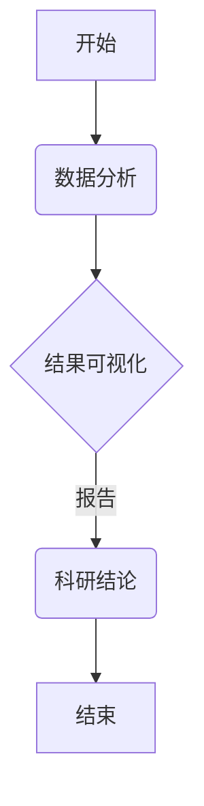

                 

# 《世界可理解性与科学研究的创新生态系统》

> 关键词：世界可理解性、科学研究、创新生态系统、跨学科研究、数学模型、机器学习、深度学习

> 摘要：本文从世界可理解性的概念入手，探讨其在科学研究中的重要性，并分析创新生态系统的构建原则和作用。通过对核心概念、算法原理、数学模型的深入讲解，以及实际项目案例的分析，本文旨在为科学研究提供一种新的创新路径，推动科技发展。

## 第1章 引言

### 1.1 科学研究的现状与挑战

在全球范围内，科学研究正以前所未有的速度发展。据联合国教科文组织统计，全球科研投入已达到数万亿美元，科研成果层出不穷。然而，随着科学领域的不断扩大和交叉，科学研究面临着前所未有的挑战。

首先，数据复杂性成为一大难题。科学研究中产生的数据量急剧增加，如何高效地存储、管理和分析这些数据成为研究人员亟待解决的问题。其次，学科交叉成为科学研究的重要趋势。单一学科的研究方法和技术已无法满足复杂科学问题的解决需求，跨学科研究成为科学研究的主流。此外，科研方法的革新也成为科学研究的重要方向。传统的研究方法已逐渐无法满足现代科学的发展需求，新的研究方法和技术不断创新，推动科学研究不断前进。

### 1.2 世界可理解性的概念与意义

世界可理解性是指人类对于自然界、社会现象和自身存在的理解能力。在科学研究过程中，世界可理解性具有重要意义。首先，可理解性有助于科学家更好地理解和解释科学现象。通过对自然界和人类社会现象的理解，科学家能够提出更有针对性的研究假设和实验设计。其次，可理解性有助于科学知识的传播和普及。科学家通过将复杂科学知识转化为通俗易懂的形式，使得公众能够更好地理解和接受科学成果，从而推动科学技术的普及应用。

### 1.3 创新生态系统的概念与作用

创新生态系统是指围绕科学研究、技术开发、产业应用等环节，形成的相互关联、相互促进的生态系统。创新生态系统在科学研究中的作用主要体现在以下几个方面：

首先，创新生态系统为科学研究提供了丰富的资源和平台。科研机构、企业、高校等各方在创新生态系统中相互合作，共同推动科学研究的发展。其次，创新生态系统有助于促进科研资源的共享和优化配置。通过创新生态系统，科研人员能够更方便地获取所需的数据、设备和技术，提高科研效率。此外，创新生态系统还推动了科研方法的革新。在创新生态系统中，科研人员不断探索新的研究方法和技术，推动科学研究向更深层次发展。

## 第2章 世界可理解性的理论基础

### 2.1 可理解性原理

可理解性原理是探讨人类理解和解释世界的基本规律。从演化生物学的角度来看，人类的大脑在漫长的进化过程中，逐渐形成了对自然界和人类社会现象的理解能力。认知心理学研究表明，人类通过感知、记忆、思维等认知过程，不断构建对世界的理解。哲学领域则从本体论、认识论等方面探讨可理解性的本质和意义。

### 2.2 科学哲学与可理解性

科学哲学是研究科学活动及其本质的哲学分支。在科学哲学中，波普尔、库恩、拉卡托斯等学者对可理解性进行了深入探讨。波普尔提出“可证伪性”原则，认为科学理论必须具备可证伪性，即可以被实验或观察所证伪。库恩则强调“范式转换”的重要性，认为科学发展的关键在于范式的转变。拉卡托斯则提出了“科学研究程序”的概念，认为科学研究是一个不断试错、逐步完善的过程。

### 2.3 可理解性的数学模型

数学模型是描述世界可理解性的重要工具。信息论中的熵、信息熵、联合熵等概念，为研究可理解性提供了理论基础。复杂性和自组织理论则从系统角度探讨可理解性。多尺度理论则从不同尺度对可理解性进行描述，揭示不同尺度之间的联系和相互作用。

## 第3章 科学研究的创新生态系统构建

### 3.1 创新生态系统的要素

创新生态系统由多个要素构成，包括科研机构与团队、资源与资金、数据与信息、合作与网络。科研机构与团队是创新生态系统的基础，为科学研究提供人才和资源支持。资源与资金是创新生态系统的动力，为科学研究提供必要的经济保障。数据与信息是创新生态系统的核心，为科学研究提供数据支持和信息交流平台。合作与网络则促进各方在创新生态系统中相互协作，实现资源共享和优势互补。

### 3.2 创新生态系统的构建原则

创新生态系统的构建原则主要包括开放性、适应性、互操作性和协同效应。开放性是指创新生态系统要对外部环境保持开放，积极吸纳外部资源和技术。适应性是指创新生态系统要具备快速响应和调整的能力，以适应科技发展和市场需求。互操作性是指创新生态系统中各方要具备良好的互操作能力，实现资源共享和信息交换。协同效应是指创新生态系统中各方要协同合作，实现整体效益最大化。

### 3.3 创新生态系统的发展阶段

创新生态系统的发展阶段可分为成熟期、发展期和起步期。在成熟期，创新生态系统已经形成较为完善的组织结构和运行机制，科研产出和成果转化效果显著。在发展期，创新生态系统在原有基础上不断拓展和深化，推动科技和产业的快速发展。在起步期，创新生态系统刚刚建立，需要逐步完善组织结构和运行机制，为后续发展奠定基础。

## 第4章 核心概念与联系

### 4.1 可理解性与科研方法

科研方法是指科学研究过程中采用的各种技术和手段。可理解性与科研方法密切相关，影响科研方法的选取和应用。定量与定性研究方法、实验设计与数据分析、模拟与建模等科研方法，都需要充分考虑世界可理解性的原则，以提高科研的可理解性和科学性。

### 4.2 可理解性与学科交叉

学科交叉是现代科学研究的重要趋势。可理解性在学科交叉中发挥着重要作用，有助于消除学科壁垒，促进知识共享和创新发展。跨学科研究既具有优势，也存在挑战。优势在于能够整合不同学科的理论和方法，提高科研问题的解决能力。挑战在于学科交叉过程中，如何平衡各学科之间的差异和冲突，实现有效的知识融合。

### 4.3 可理解性与社会影响

科学研究成果对社会产生深远影响。可理解性在科技传播与公众理解、科研伦理与社会责任、可持续发展等方面具有重要意义。通过提高科学研究成果的可理解性，有助于加强科技传播效果，提高公众对科学的认知和理解。同时，科研伦理和社会责任也是科学研究的重要方向，旨在确保科学研究的可持续发展和社会效益。

## 第5章 核心算法原理讲解

### 5.1 算法基础

算法是科学研究的重要工具。算法基础包括算法设计与分析、算法复杂性和算法优化。算法设计与分析是指设计高效、可靠的算法，并分析其性能。算法复杂性是指算法在时间、空间等方面的性能表现。算法优化是指通过改进算法，提高其性能和效率。

### 5.2 机器学习算法

机器学习算法是近年来人工智能领域的重要突破。机器学习算法包括监督学习、无监督学习和强化学习。监督学习是指通过已知的输入和输出数据，训练模型并预测未知数据。无监督学习是指通过未标记的数据，发现数据中的规律和结构。强化学习是指通过试错和反馈，优化决策过程。

### 5.3 深度学习算法

深度学习算法是机器学习的一个重要分支。深度学习算法包括神经网络、卷积神经网络和循环神经网络。神经网络是指由多个神经元组成的网络，用于模拟人脑的思考过程。卷积神经网络是指具有卷积层的人工神经网络，用于处理图像和视频数据。循环神经网络是指具有循环结构的人工神经网络，用于处理序列数据。

## 第6章 数学模型与公式详解

### 6.1 概率论与统计学

概率论与统计学是科学研究的重要工具。概率分布用于描述随机变量的取值可能性。最大似然估计是一种参数估计方法，通过最大似然准则估计模型参数。贝叶斯推理是一种概率推理方法，通过贝叶斯公式计算后验概率。

### 6.2 信息论与熵

信息论与熵是研究信息传输和处理的理论。信息熵是衡量信息量的指标，用于描述随机变量的不确定性。Kullback-Leibler散度是衡量两个概率分布差异的指标。联合熵是多个随机变量的联合分布所对应的信息熵。

### 6.3 随机过程与时间序列

随机过程与时间序列是研究随机现象和时间序列数据的理论。马尔可夫链是一种离散随机过程，描述系统的状态转移规律。自回归模型是一种时间序列模型，用于分析时间序列数据的自相关性。广义线性模型是一种非线性回归模型，用于分析非线性关系。

## 第7章 项目实战

### 7.1 实战一：基于深度学习的图像分类

#### 项目背景

图像分类是计算机视觉领域的一个经典问题。随着深度学习技术的发展，基于深度学习的图像分类方法取得了显著的成果。本项目旨在利用深度学习算法，实现图像分类任务。

#### 数据集介绍

本项目使用常用的图像分类数据集——CIFAR-10。CIFAR-10数据集包含60000张32x32的彩色图像，分为10个类别，分别为飞机、汽车、鸟、猫、鹿、狗、青蛙、马、船和卡车。

#### 模型设计与实现

本项目采用卷积神经网络（CNN）进行图像分类。模型包括卷积层、池化层和全连接层。通过逐层提取图像特征，最后输出分类结果。

#### 模型训练与评估

使用CIFAR-10数据集对模型进行训练。通过调整超参数，优化模型性能。训练过程中，使用交叉熵损失函数和反向传播算法进行优化。训练完成后，对模型进行评估，计算准确率、召回率等指标。

### 7.2 实战二：基因数据分析

#### 项目背景

基因数据分析是生物信息学领域的重要研究方向。随着基因测序技术的不断发展，产生了大量的基因数据。本项目旨在利用机器学习算法，对基因数据进行分析，识别基因与疾病之间的关系。

#### 数据集介绍

本项目使用GTEX基因表达数据集。GTEX数据集包含1000多个人类组织样本的基因表达数据，每个样本包含数万条基因的表达水平。

#### 模型设计与实现

本项目采用机器学习算法中的支持向量机（SVM）进行基因数据分析。通过训练SVM模型，将基因表达数据分为正常和异常两类，识别异常基因。

#### 模型训练与评估

使用GTEX数据集对SVM模型进行训练。通过调整超参数，优化模型性能。训练完成后，对模型进行评估，计算准确率、召回率等指标。此外，还采用交叉验证方法，验证模型的泛化能力。

## 第8章 创新生态系统案例分析

### 8.1 案例一：量子计算在科学研究中的应用

#### 案例介绍

量子计算是近年来备受关注的前沿领域。量子计算具有并行处理、超高速等特性，有望在科学研究、加密技术、量子模拟等领域发挥重要作用。本项目旨在探讨量子计算在科学研究中的应用。

#### 技术原理

量子计算利用量子位（qubit）进行信息处理，具有叠加态和纠缠态等特性。量子算法利用量子计算的优势，实现高效计算。例如，量子计算在求解线性方程组、因数分解等问题上，具有显著优势。

#### 影响与挑战

量子计算在科学研究中的应用前景广阔，但同时也面临诸多挑战。首先，量子计算机的硬件构建和稳定性问题尚未解决。其次，量子算法的设计和优化需要深入探讨。此外，量子计算的安全性和量子纠错技术也是亟待解决的问题。

### 8.2 案例二：区块链技术在科研数据管理中的应用

#### 案例介绍

区块链技术是一种分布式数据库技术，具有去中心化、安全性高、透明度高等特点。区块链技术在科研数据管理中具有广泛应用前景。本项目旨在探讨区块链技术在科研数据管理中的应用。

#### 技术原理

区块链技术通过分布式账本，实现数据的去中心化存储和管理。区块链技术中的加密算法和共识机制，确保数据的真实性和安全性。此外，区块链技术还支持智能合约，实现自动化管理和执行。

#### 影响与挑战

区块链技术在科研数据管理中的应用，有助于提高数据的可信度和可追溯性，推动科研数据的共享和开放。然而，区块链技术的性能和扩展性仍需优化，以适应大规模科研数据管理需求。此外，区块链技术的隐私保护和数据安全也是亟待解决的问题。

### 8.3 案例三：人工智能在医疗领域的创新应用

#### 案例介绍

人工智能在医疗领域的应用日益广泛，包括疾病诊断、治疗方案推荐、药物研发等方面。本项目旨在探讨人工智能在医疗领域的创新应用。

#### 技术原理

人工智能通过深度学习、强化学习等算法，对医疗数据进行处理和分析，实现疾病诊断、治疗方案推荐等功能。例如，基于深度学习算法的图像识别技术，可用于辅助医生进行疾病诊断。基于强化学习算法的决策支持系统，可用于优化治疗方案。

#### 影响与挑战

人工智能在医疗领域的应用，有助于提高医疗服务的质量和效率，减轻医生的工作负担。然而，人工智能在医疗领域的应用也面临诸多挑战，如数据质量、算法透明度、隐私保护等问题。此外，如何确保人工智能系统的可靠性和安全性，也是亟待解决的问题。

## 第9章 总结与展望

### 9.1 研究总结

本文从世界可理解性的概念入手，探讨了其在科学研究中的重要性，并分析了创新生态系统的构建原则和作用。通过对核心概念、算法原理、数学模型的深入讲解，以及实际项目案例的分析，本文为科学研究提供了一种新的创新路径，推动科技发展。

### 9.2 未来发展趋势

未来，科学研究将继续朝着跨学科、数据驱动、智能化等方向发展。随着人工智能、量子计算、区块链等技术的不断突破，科学研究的方法和技术将更加多样化和高效化。同时，科研数据的开放共享和安全性也将成为研究的重要方向。

### 9.3 建议与展望

针对科学研究的发展趋势，本文提出以下建议：

1. 加强跨学科合作，推动科学研究向更深层次发展。
2. 提高科研数据的质量和安全性，推动数据开放共享。
3. 加强科研伦理和社会责任，确保科学研究的可持续发展。
4. 积极探索新技术在科学研究中的应用，提高科研效率和质量。

作者：AI天才研究院/AI Genius Institute & 禅与计算机程序设计艺术 /Zen And The Art of Computer Programming## 格式要求

为了确保文章的结构清晰、内容丰富且易于阅读，本文将采用Markdown格式进行撰写。Markdown是一种轻量级标记语言，它使得文本内容的排版和格式化变得简单直观。以下是一些关键的Markdown格式要求：

### 标题格式

- 一级标题使用 `#` 标记，例如：
  ```markdown
  # 标题
  ```

- 二级标题使用 `##` 标记，例如：
  ```markdown
  ## 子标题
  ```

- 三级标题使用 `###` 标记，以此类推：
  ```markdown
  ### 三级标题
  ```

### 段落格式

- 段落之间应保持一个空行，Markdown会自动将连续的空行视为新段落。

### 引用格式

- 引用文本使用 `>` 标记，例如：
  ```markdown
  > 这是一段引用文本。
  ```

### 列表格式

- 无序列表使用 `*`、`+` 或 `-` 标记，例如：
  ```markdown
  - 第一项
  + 第二项
  * 第三项
  ```

- 有序列表使用数字和英文句点，例如：
  ```markdown
  1. 第一项
  2. 第二项
  3. 第三项
  ```

### 代码块格式

- 单行代码使用反引号 ``` ` 标记，例如：
  ```markdown
  `代码示例`
  ```

- 多行代码使用三个反引号 ````` 标记，并保持代码块内的缩进，例如：
  ```markdown
  ```python
  def hello_world():
      print("Hello, World!")
  ```

### 公式格式

- 单个公式使用 `$` 标记，例如：
  ```markdown
  $ E = mc^2 $
  ```

- 独立的公式段落使用 `$$` 标记，例如：
  ```markdown
  $$
  E = mc^2
  $$

### 链接和图片

- 链接使用 `[链接文本](URL)` 格式，例如：
  ```markdown
  [点击这里](https://www.example.com)
  ```

- 插入图片使用 `` 格式，例如：
  ```markdown
  
  ```

### 表格格式

- 表格使用竖线 `|` 和空格分隔列，行与行之间使用换行符分隔，例如：
  ```markdown
  | 标题1 | 标题2 | 标题3 |
  |-------|------|------|
  | 单元格1 | 单元格2 | 单元格3 |
  | 单元格4 | 单元格5 | 单元格6 |
  ```

### 段落格式化

- 加粗使用两个 `*` 标记，例如：
  ```markdown
  **加粗文本**
  ```

- 斜体使用一个 `*` 标记，例如：
  ```markdown
  *斜体文本*
  ```

- 下划线使用两个下划线 `__` 标记，例如：
  ```markdown
  __下划线文本__
  ```

### 样式和格式

- 对于文章中特定的样式和格式，如提示、警告、重要说明等，可以使用 `!!`、`!!` 或 `??` 标记，例如：
  ```markdown
  !! 注意事项
  ?? 提示信息
  ?? 警告信息
  ```

通过上述Markdown格式的应用，本文将呈现出清晰、专业且易于阅读的内容结构，有助于读者更好地理解和吸收文章的核心信息。

## 附录 A：科研创新生态系统建设工具与资源

为了推动科研创新生态系统的发展，提供一系列有效的工具与资源至关重要。以下列出了若干开源软件、研究资源库和科研管理与协作工具，这些工具将有助于科研人员提升工作效率，促进合作和创新。

### A.1 开源软件与平台

#### **A.1.1 GitHub**

GitHub 是全球最大的代码托管平台，提供了版本控制、项目管理、代码协作等功能，适合科研人员共享代码和资源。通过GitHub，用户可以轻松访问全球的科研项目，借鉴他人经验，促进知识共享。

#### **A.1.2 arXiv**

arXiv 是一个开放获取的预印本服务器，专注于物理学、数学、计算机科学、定量生物学、统计学等领域的论文预发布。科研人员可以通过arXiv获取最新的科研进展，与全球科研社区保持同步。

#### **A.1.3 Kaggle**

Kaggle 是一个数据科学竞赛平台，提供了大量的数据集和竞赛项目。科研人员可以在Kaggle上参与竞赛，锻炼数据分析和建模能力，同时与其他数据科学家进行交流和合作。

### A.2 研究资源库

#### **A.2.1 Web of Science**

Web of Science 是一个综合性科学引文数据库，覆盖了自然科学、社会科学、工程技术等众多领域。通过Web of Science，用户可以检索全球科学文献，追踪研究热点和趋势。

#### **A.2.2 Scopus**

Scopus 是 Elsevier 公司开发的一个大型的文摘和引文数据库，包含了超过 21,000 种期刊、390 万篇会议论文、22,000 种图书和专利等文献资源。Scopus 提供了强大的检索和分析工具，有助于科研人员了解领域内的研究动态和影响力。

#### **A.2.3 Google Scholar**

Google Scholar 是一个基于Google的学术搜索引擎，可搜索学术文章、学位论文、学术出版物等。Google Scholar 的优势在于其广泛的覆盖范围和便捷的搜索功能，是科研人员获取学术文献的重要工具。

### A.3 科研管理与协作工具

#### **A.3.1 Trello**

Trello 是一个基于看板的项目管理工具，适合团队协作和任务管理。科研人员可以使用Trello创建任务卡、设定截止日期、分配责任，提高团队的工作效率和协同性。

#### **A.3.2 Slack**

Slack 是一个即时通讯和协作平台，支持多种集成服务，如GitHub、Google Drive等。科研团队可以通过Slack进行实时交流、文件共享和任务分配，提高协作效率和沟通效果。

#### **A.3.3 Confluence**

Confluence 是一个团队协作平台，提供了文档编辑、存储、共享和版本控制功能。科研团队可以使用Confluence记录项目进展、共享科研笔记、编写报告等，确保团队信息的一致性和可追溯性。

通过这些工具与资源的合理应用，科研人员能够更好地管理科研过程、提升研究效率、促进知识共享和合作创新，为科研创新生态系统的发展提供强有力的支持。

## 附录 B：Mermaid 流程图示例

Mermaid 是一种基于文本的绘图语言，通过简单的Markdown语法，可以轻松绘制各种图表，如流程图、序列图、甘特图等。以下是一个简单的Mermaid流程图示例：



在这个示例中，`graph TB` 表示绘制一个流程图，`A[开始]`、`B(数据分析)`、`C{结果可视化}`、`D[科研结论]` 和 `E[结束]` 分别表示流程图中的节点，箭头表示节点之间的连接关系。`-->` 用于连接节点，`{}` 用于标注条件分支，`|` 用于标注流程线。

### Mermaid流程图的语法说明

以下是Mermaid流程图的主要语法说明：

- **节点定义**：使用 `[节点名称](节点标签)` 格式定义节点，如 `A[开始]`。
- **箭头连接**：使用 `-->` 表示从当前节点指向下一个节点的箭头。
- **条件分支**：在箭头上方使用 `{条件}` 表示条件分支，如 `C -->|结果可视化| D`。
- **流程线**：使用 `|` 表示流程线，如 `D --> E`。

通过掌握这些基本的语法，可以灵活地绘制各种复杂流程图，为科研工作提供直观的表示和分析工具。

## 附录 C：伪代码示例

伪代码是一种用于描述算法思路的文本表示方法，它不依赖于任何特定的编程语言，因此具有更高的可读性和可移植性。以下是一个简单的伪代码示例，用于描述一个基础的机器学习模型训练过程。

```python
# 伪代码：机器学习模型训练过程

def train_model(data):
    # 初始化模型参数
    model_params = initialize_params()

    # 设置训练参数
    num_epochs = 100
    learning_rate = 0.01

    # 开始训练模型
    for epoch in range(num_epochs):
        # 前向传播
        predictions = forward_pass(data, model_params)

        # 计算损失函数
        loss = calculate_loss(predictions, data)

        # 反向传播
        gradients = backward_pass(data, predictions, model_params)

        # 更新模型参数
        model_params = update_params(model_params, gradients, learning_rate)

    # 返回训练完成的模型
    return model_params
```

### 伪代码的语法说明

以下是伪代码的主要语法说明：

- **函数定义**：使用 `def 函数名称(参数)` 定义函数，如 `def train_model(data)`。
- **变量定义**：使用 `变量名 = 值` 定义变量，如 `model_params = initialize_params()`。
- **循环**：使用 `for 变量 in 范围` 定义循环，如 `for epoch in range(num_epochs)`。
- **条件判断**：使用 `if 条件` 定义条件判断，如 `if condition:`。
- **函数调用**：使用 `函数名称(参数)` 调用函数，如 `predictions = forward_pass(data, model_params)`。
- **输出**：使用 `print(内容)` 输出内容，如 `print(loss)`。

通过伪代码，我们可以清晰地描述算法的步骤和逻辑，为实际编程提供参考。在科研过程中，伪代码有助于团队成员理解和讨论算法设计，确保算法的正确性和可维护性。

