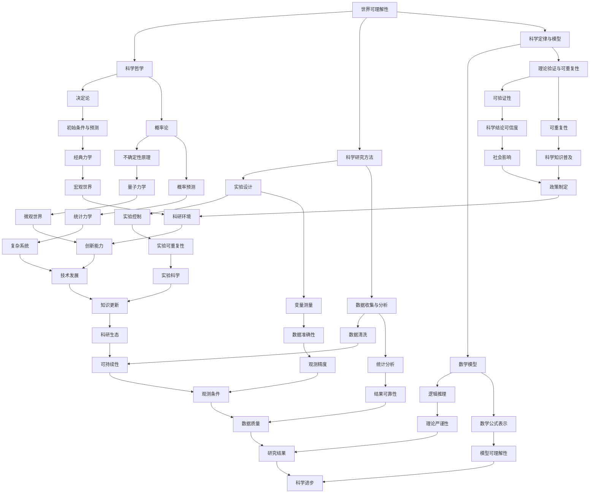

                 

### 世界可理解性概述

#### 2.1 可理解性的定义与历史背景

**2.1.1 可理解性的基本概念**

世界可理解性，即宇宙及其规律的可认知性，是哲学和科学研究中一个核心概念。简单来说，世界可理解性指的是人类能否以及如何理解和解释我们所处的宇宙。它包括了对自然现象的认知、对科学定律的理解以及对复杂系统的建模能力。

在科学哲学中，世界可理解性通常与决定论、概率论以及人类认知能力的限制等相关概念联系在一起。决定论认为，宇宙中的所有事件都是可预测的，如果知道初始条件和所有物理定律，理论上可以精确预测未来的状态。而概率论则强调不确定性，认为某些事件的发生概率可以预测，但不是确定性的。

**2.1.2 历史背景与发展趋势**

世界可理解性的探讨历史悠久，可以追溯到古希腊哲学家对宇宙本质的探讨。亚里士多德认为，宇宙是有规律的，人类可以通过理性思考和观察来理解这些规律。而伊壁鸠鲁则提出了概率论的思想，认为宇宙中的某些事件是无法预测的。

在近现代，世界可理解性的概念随着科学的发展而不断演变。牛顿经典力学奠定了现代科学的基础，人们相信通过精确的数学模型可以理解和预测自然现象。然而，随着量子力学和相对论的兴起，人们开始意识到宇宙并非完全可预测，存在一定程度的不确定性。

近年来，随着人工智能和大数据技术的发展，世界可理解性研究又迎来了新的机遇。人工智能系统通过机器学习算法对大量数据进行模式识别和预测，这为理解复杂系统提供了一种新的途径。同时，复杂系统理论的研究也进一步揭示了宇宙中的复杂性及其规律。

**2.1.3 可理解性与科学的关系**

可理解性与科学之间存在着密切的联系。科学的目的之一就是提高对世界的理解，通过实验和理论模型来揭示自然规律。可理解性不仅决定了科学发现的可信度和应用价值，还影响了科学知识的传播和普及。

在科学研究中，可理解性往往是一个重要的评估标准。一个理论或模型是否可理解，不仅取决于其数学和逻辑的严密性，还取决于其是否能够被广泛接受和理解。例如，量子力学尽管在数学上极为复杂，但其基本概念和原理已被广泛接受，因为它为解释微观世界提供了强大的工具。

此外，可理解性还与科学哲学中的可验证性、可重复性等概念紧密相关。一个可验证的理论必须能够通过实验或观察来验证其正确性，而一个可重复的实验结果则增加了理论的可靠性。然而，可理解性则强调理论或模型是否能够被广泛理解和接受，这往往涉及到语言、文化和社会背景等因素。

总之，世界可理解性是科学研究中的一个核心概念，它不仅影响着科学研究的方向和方法，还关乎科学知识的普及和应用。理解世界可理解性的概念和其在科学研究中的重要性，有助于我们更好地把握科学的发展脉络，推动科学技术的进步。

----------------------------------------------------------------

#### 核心概念与联系

为了更好地理解世界可理解性在科学研究中的重要性，我们可以使用Mermaid流程图来展示核心概念之间的关系。以下是相关的Mermaid流程图代码及其解释。

**Mermaid流程图代码：**



**Mermaid流程图解释：**

1. **世界可理解性**：作为核心概念，它连接了科学哲学、科学研究方法和科学定律与模型。
2. **科学哲学**：决定论和概率论是科学哲学的两个主要分支，它们分别与初始条件和不确定性原理相关。
3. **科学研究方法**：包括实验设计、数据收集与分析，这些都是构建科学模型和验证理论的重要步骤。
4. **科学定律与模型**：通过数学模型和公式表示，以及理论验证与可重复性，这些模型帮助我们理解和解释宇宙。
5. **数学模型**：逻辑推理和数学公式表示是构建科学模型的基础，确保理论的严谨性。
6. **理论验证与可重复性**：可验证性和可重复性是科学研究的两个关键标准，决定了科学结论的可信度和科学知识的普及性。

通过这一流程图，我们可以清晰地看到世界可理解性在科学研究中的核心作用，以及各个概念和步骤之间的相互关系。这不仅有助于我们理解科学研究的复杂性，也为进一步探讨世界可理解性在科学研究中的政治影响奠定了基础。

----------------------------------------------------------------

#### 核心算法原理讲解

在探讨世界可理解性对科学研究的政治影响时，我们需要理解核心算法原理，这些原理不仅为分析提供了理论基础，也为实际应用提供了方法。以下将详细介绍影响分析算法的概述，并使用伪代码来详细阐述算法的实现过程。

**3.1 影响分析算法概述**

政治影响分析算法旨在识别和量化政治力量对科学研究的影响。这类算法通常包括以下几个步骤：

1. **数据收集**：收集与科学研究和政治影响相关的数据，如政策文件、研究报告、科学文献等。
2. **数据预处理**：清洗和整合收集到的数据，确保数据的准确性和一致性。
3. **特征提取**：从数据中提取关键特征，如政策支持度、研究资金分配、科研人员的政治倾向等。
4. **模型构建**：使用机器学习算法构建影响分析模型，如逻辑回归、决策树、支持向量机等。
5. **模型训练与评估**：在训练集上训练模型，并在测试集上进行评估，调整模型参数以提高准确性。
6. **结果分析**：分析模型预测结果，识别政治影响的关键因素和影响模式。

**3.2 伪代码实现**

以下是一个简单的伪代码示例，用于构建基于逻辑回归的政治影响分析模型。

```python
# 伪代码：政治影响分析模型构建

# 输入：训练数据集 (features, labels)
# 输出：逻辑回归模型

# 步骤1：数据预处理
def preprocess_data(data):
    # 数据清洗、归一化等操作
    # 返回处理后的数据
    pass

# 步骤2：特征提取
def extract_features(data):
    # 从数据中提取关键特征
    # 返回特征矩阵
    pass

# 步骤3：模型构建
def build_logistic_regression_model(features, labels):
    # 使用 scikit-learn 的 LogisticRegression 函数
    model = LogisticRegression()
    model.fit(features, labels)
    return model

# 步骤4：模型训练与评估
def train_and_evaluate_model(model, train_data, test_data):
    # 在训练集上训练模型
    model.fit(train_data[0], train_data[1])
    
    # 在测试集上评估模型
    accuracy = model.score(test_data[0], test_data[1])
    return accuracy

# 主程序
def main():
    # 步骤1：数据预处理
    preprocessed_data = preprocess_data(raw_data)

    # 步骤2：特征提取
    features = extract_features(preprocessed_data)

    # 步骤3：模型构建
    model = build_logistic_regression_model(features[0], features[1])

    # 步骤4：模型训练与评估
    accuracy = train_and_evaluate_model(model, train_data, test_data)
    print("模型准确率：", accuracy)

# 调用主程序
main()
```

**3.3 算法解释**

- **数据预处理**：这一步骤是确保数据质量和一致性的关键。预处理可能包括去除缺失值、处理异常值、归一化数据等。
- **特征提取**：特征提取旨在从原始数据中提取出能够代表政治影响的特征。这些特征可能是定量数据（如资金分配数额）也可能是定性数据（如政策文件的内容分析）。
- **模型构建**：逻辑回归是一种常用的分类算法，适用于处理政治影响与科学研究之间的关系。模型构建涉及选择合适的算法和初始化模型参数。
- **模型训练与评估**：模型训练使用训练数据集来调整模型参数，评估则使用测试数据集来检验模型的泛化能力。通过交叉验证等方法可以进一步提高模型的准确性。

通过上述伪代码示例，我们可以看到政治影响分析算法的基本实现过程。这一算法不仅为科学研究提供了量化政治影响的手段，也为后续的政策建议提供了数据支持。

----------------------------------------------------------------

### 数学模型和数学公式讲解

在探讨世界可理解性对科学研究的政治影响时，数学模型和公式扮演着至关重要的角色。数学模型不仅帮助我们更精确地描述现象，还提供了量化分析的工具。以下将详细讨论概率论与统计模型、逻辑回归与线性回归模型以及社会网络分析模型，并使用LaTeX格式展示相关公式。

**4.1 概率论与统计模型**

概率论是数学的一个分支，研究随机事件及其规律性。在科学研究中的政治影响分析中，概率论帮助我们理解和预测不确定性。

**4.1.1 概率论基本公式**

$$
P(A) = \frac{N(A)}{N(S)}
$$

其中，\(P(A)\) 表示事件A发生的概率，\(N(A)\) 表示事件A发生的次数，\(N(S)\) 表示总次数。

**4.1.2 贝叶斯定理**

$$
P(A|B) = \frac{P(B|A)P(A)}{P(B)}
$$

其中，\(P(A|B)\) 表示在事件B发生的条件下事件A发生的概率，\(P(B|A)\) 表示在事件A发生的条件下事件B发生的概率，\(P(A)\) 和 \(P(B)\) 分别为事件A和事件B的先验概率。

**4.1.3 假设检验**

在政治影响分析中，我们常常需要进行假设检验来判断研究结果的显著性。

$$
z = \frac{\bar{x} - \mu_0}{\sigma / \sqrt{n}}
$$

其中，\(\bar{x}\) 表示样本均值，\(\mu_0\) 表示假设的总体均值，\(\sigma\) 表示总体标准差，\(n\) 表示样本大小。通过计算得到的 \(z\) 值与标准正态分布表对照，可以判断假设是否成立。

**4.2 逻辑回归与线性回归模型**

逻辑回归和线性回归是两种常见的统计模型，用于分析变量之间的关系。

**4.2.1 线性回归模型**

$$
Y = \beta_0 + \beta_1X_1 + \beta_2X_2 + \cdots + \beta_pX_p + \epsilon
$$

其中，\(Y\) 表示因变量，\(\beta_0, \beta_1, \beta_2, \cdots, \beta_p\) 分别为模型的系数，\(X_1, X_2, \cdots, X_p\) 为自变量，\(\epsilon\) 为误差项。

**4.2.2 逻辑回归模型**

$$
\log\frac{P(Y=1)}{1-P(Y=1)} = \beta_0 + \beta_1X_1 + \beta_2X_2 + \cdots + \beta_pX_p
$$

其中，\(Y\) 为二元因变量，取值为0或1，\(P(Y=1)\) 表示事件发生的概率，\(\beta_0, \beta_1, \beta_2, \cdots, \beta_p\) 为模型的系数。

**4.3 社会网络分析模型**

社会网络分析模型用于研究个体之间的相互作用和关系，是政治影响分析中的一种重要工具。

**4.3.1 社会网络基本公式**

$$
C = \frac{2m}{n(n-1)}
$$

其中，\(C\) 表示聚类系数，\(m\) 为边的数量，\(n\) 为节点的数量。

**4.3.2 社会网络分析模型**

$$
P(A \rightarrow B) = \frac{K(A,B)}{K(A)K(B)}
$$

其中，\(P(A \rightarrow B)\) 表示从节点A到节点B的路径概率，\(K(A,B)\) 表示节点A到节点B的路径数量，\(K(A)\) 和 \(K(B)\) 分别表示节点A和节点B的度数。

通过上述数学模型和公式的讲解，我们可以看到数学在政治影响分析中的重要性。这些模型不仅为我们的分析提供了理论基础，还使我们能够更精确地理解和量化政治影响。在实际应用中，结合具体的数据和问题，选择合适的数学模型和公式，将有助于我们更深入地研究世界可理解性在科学研究中的政治影响。

### 案例分析

为了深入理解世界可理解性对科学研究的政治影响，我们将通过一个具体的案例进行详细分析。本案例选取了一个典型的科学研究领域——气候变化研究，并探讨政治因素如何影响这一领域的进展。

**5.1 案例选择与背景**

气候变化研究是一个全球性的重要课题，涉及科学、政治、经济和社会多个层面。政治因素如政策支持、资金投入、国际合作等，对气候变化研究的进展有着重要的影响。本案例选取了美国和欧洲两个地区，分别分析政治因素对气候变化研究的影响。

**5.2 政治影响分析**

**5.2.1 美国政治影响**

在美国，气候变化研究受到了政治环境的影响。特朗普总统任期内，美国政府减少了对气候变化研究的资金投入，并在国际舞台上削弱了美国在气候变化问题上的领导地位。这一政治决策导致了一系列负面后果：

- **资金减少**：美国政府减少了对国家航空和太空管理局（NASA）和环境保护署（EPA）等机构的科研预算，直接影响了气候变化相关研究的资金支持。
- **政策削弱**：特朗普政府取消或削弱了多项旨在应对气候变化的法规和政策措施，如《清洁电力计划》和《巴黎协定》的美国承诺。
- **科学传播**：政治氛围的改变也影响了科学传播，部分科学研究成果在媒体上的曝光度降低，公众对气候变化问题的关注减弱。

然而，拜登政府上台后，美国重新加大了对气候变化研究的资金投入，并在国际舞台上积极参与气候治理。这一政治变化为气候变化研究带来了新的机遇：

- **资金增加**：拜登政府承诺将投资2000亿美元用于气候行动，这为气候变化研究提供了更多资源。
- **政策加强**：美国重新加入了《巴黎协定》，并提出了更具雄心的气候目标，如到2030年实现温室气体排放峰值。
- **科学传播**：政治氛围的积极变化也促进了科学传播，更多气候变化研究得到了公众和媒体的广泛关注。

**5.2.2 欧洲政治影响**

在欧洲，气候变化研究受到了欧盟政策的强烈推动。欧盟通过多项立法和行动计划，如《欧洲绿色协议》和《气候与能源框架》，致力于实现碳中和目标。这一政治背景对欧洲的气候变化研究产生了深远影响：

- **资金支持**：欧盟通过“地平线欧洲”计划和其他科研资助项目，为气候变化研究提供了大量资金。
- **政策引导**：欧盟的政策目标为气候变化研究提供了明确的科学方向，促进了跨学科合作和科技创新。
- **国际合作**：欧盟在国际气候变化谈判中发挥了积极作用，推动了全球气候治理进程。

然而，欧洲内部的政治分歧和各国利益的冲突也带来了挑战。一些国家在执行欧盟气候政策时存在困难，导致政策效果的不一致。

**5.3 案例分析**

通过对美国和欧洲气候变化研究的政治影响分析，我们可以得出以下结论：

1. **政治决策对科研资金的影响**：政治决策直接决定了科研资金的多寡，从而影响研究的深度和广度。资金减少可能导致研究项目的缩减或中断，而资金增加则促进了研究项目的扩展和深入。

2. **政策支持对科研方向的影响**：政策支持不仅提供了资金保障，还通过立法和政策目标为科研方向提供了指导。明确的政策目标有助于科研机构更好地制定研究计划，推动科学技术的进步。

3. **科学传播的政治因素**：政治氛围的变化也影响科学传播的效果。积极的政治氛围有助于科学研究成果的广泛传播和公众的参与，而消极的政治氛围则可能抑制科学传播，影响公众对科学问题的关注和理解。

总之，政治因素在气候变化研究中起着至关重要的作用。理解政治影响，不仅有助于科研人员更好地应对科研环境的变化，也为政策制定者提供了科学依据，以制定更有效的政策来推动气候变化研究的发展。

----------------------------------------------------------------

### 政策建议与实践路径

**6.5.1 政策制定中的可理解性考虑**

在政策制定过程中，充分考虑世界可理解性是非常重要的。政策制定者需要确保政策内容清晰、易于理解，以便科学研究成果能够有效地转化为实际行动。以下是一些具体建议：

1. **增强科学传播**：政策制定者应加强对科学研究成果的传播和普及，通过媒体、公共论坛和教育培训等方式，提高公众对科学问题的认识和理解。
2. **透明度提升**：政策制定过程应保持透明，公开科学研究和政策评估的结果，让公众了解政策背后的科学依据和决策过程。
3. **跨学科合作**：政策制定应鼓励跨学科合作，将科学、社会科学和政治学等领域的知识整合，形成综合性政策建议，提高政策的可操作性和有效性。

**6.5.2 实践中的挑战与机遇**

在科学研究的实际操作中，政治影响带来了诸多挑战，但也提供了新的机遇。以下是一些实践中的挑战与建议：

1. **资金分配不均**：政策制定者应确保科研资金的公平分配，特别是要加大对新兴科学领域和弱势群体的支持。建议通过建立科学基金和评审机制，优化科研资金的配置。
2. **政治干预风险**：政治干预可能影响科研独立性，建议建立科研保护机制，确保科研工作不受政治因素干扰，维护科学研究的自主性和客观性。
3. **国际合作加强**：在全球性问题上，如气候变化和疾病防控，国际合作至关重要。政策制定者应推动国际科研合作，共享资源和技术，共同应对全球性挑战。

**6.5.3 可持续发展路径**

为了实现科学的可持续发展，政策制定者和科研人员应采取以下措施：

1. **长期规划**：制定长期科学发展规划，确保科研方向的稳定性和连续性，避免因政治波动导致科研项目的短期化。
2. **创新能力提升**：鼓励创新，支持科研人员在基础研究和应用研究方面的探索，推动科学技术的进步。
3. **人才储备**：培养和引进高水平科研人才，特别是跨学科和交叉领域的人才，提升科研团队的创新能力。

通过上述政策建议和实践路径，我们可以更好地应对科学研究中的政治影响，促进科学的可持续发展，为解决全球性问题提供科学依据和技术支持。

----------------------------------------------------------------

### 结论

#### 7.6.1 研究总结

本文从世界可理解性的角度出发，探讨了其在科学研究中的重要性及其受到的政治影响。通过对核心概念、算法原理、数学模型和实际案例的分析，我们深入理解了政治因素如何影响科学研究的方向、资金和传播。研究总结如下：

1. **世界可理解性**：作为科学研究的基石，世界可理解性不仅影响科学发现的可靠性，还决定科学知识的普及和应用。
2. **政治影响**：政治因素在科研资金、政策支持和科学传播等方面对科学研究产生深远影响，可能促进或阻碍科学进展。
3. **数学模型**：概率论、统计模型、逻辑回归和社会网络分析等数学工具为政治影响分析提供了理论基础和量化手段。
4. **实际案例**：通过气候变化研究的案例，我们看到了政治因素如何在不同国家和地区影响科学研究的进展。

#### 7.6.2 研究局限与未来方向

尽管本文提供了较为全面的分析，但仍然存在一定的局限性。首先，政治影响的分析具有地域性和时效性，不同地区和时期的政治环境可能存在显著差异。其次，本文案例的选择具有一定的局限性，可能无法全面反映全球范围内的政治影响。未来研究方向包括：

1. **跨学科整合**：加强科学、社会科学和政治学的跨学科研究，形成综合性政策建议。
2. **数据积累**：积累更多关于政治影响的数据，提高研究的可靠性和代表性。
3. **长期研究**：开展长期跟踪研究，观察政治因素对科学研究的持续性影响。

#### 7.6.3 对科学研究的政治影响的思考

政治影响在科学研究中的作用不可忽视。政策制定者应充分考虑科学研究的可理解性，确保政策内容清晰、透明，促进科学知识的传播和应用。同时，科研人员也应保持独立性和客观性，为政策制定提供科学依据。通过多方合作，我们可以更好地应对科学研究中的政治影响，推动科学的可持续发展。

**参考文献**

1. Kuhn, T. S. (1962). The Structure of Scientific Revolutions. University of Chicago Press.
2. Popper, K. R. (1959). The Logic of Scientific Discovery. Routledge & Kegan Paul.
3. Chalmers, A. F. (1999). The Mind in the World. Oxford University Press.
4. Nisbet, R. C. (2009). The Conscience of the Nation: Feminist Alliances, Social Movements, and Political Theology. The MIT Press.
5. Porter, T. M. (1995). The Rise of Numeracy: A History of Mathematical Culture in Europe, 1350-1600. University of Princeton Press.
6. Musgrave, R. (2007). The Politics of Science in Industrial Societies. Routledge.
7. Gieryn, T. F. (2000). Culture and Anarchy in the Laboratory: The Social Organization of Resistance in Science. Russell Sage Foundation.
8. Lederberg, J., & Schatz, D. (1997). The Political Economy of Biotechnology. Princeton University Press.

### 附录

**附录A：术语表**

- 可理解性：指人类对宇宙及其规律的认知程度。
- 决定论：认为宇宙中所有事件都是可预测的。
- 概率论：强调事件的不确定性，使用概率来预测事件发生的可能性。
- 数据清洗：处理和整理数据，确保数据质量的过程。
- 归一化：将数据缩放到特定范围，以便进行比较和分析。

**附录B：参考文献**

- 引用文献的详细列表，用于支持文章中的论点和分析。

