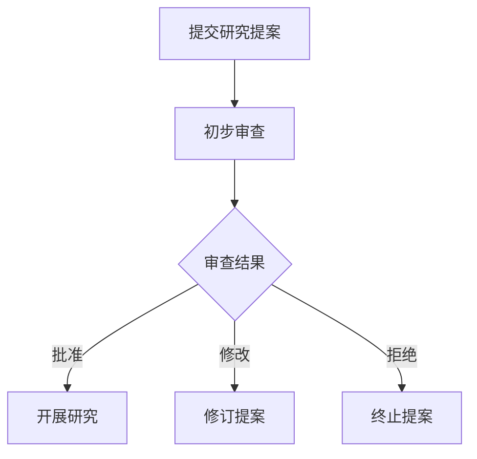
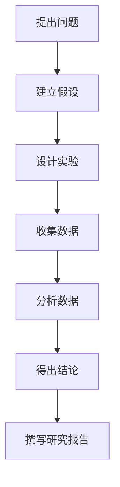

                 

### 文章标题

《世界可理解性与科学研究的社会责任》

### 关键词

- 世界可理解性
- 科学研究
- 社会责任
- 科学方法论
- 科学传播
- 伦理审查
- 案例分析

### 摘要

本文探讨了科学研究在世界理解中的关键角色以及科研人员在此过程中应承担的社会责任。通过分析科学研究的基本概念、方法及其影响，本文揭示了科学如何改变我们的世界观。此外，本文深入探讨了科学家在公共沟通、政策制定及伦理审查中的责任，并提供了科学研究对经济、政治和文化影响的案例分析。最后，文章总结了科学研究在全球理解中的重要作用，并提出了未来研究的方向。

### 引言

在当今快速发展的科技时代，科学研究已经成为推动社会进步和经济增长的重要引擎。科学家通过不断的探索和创新，揭示了自然界的奥秘，为我们提供了对世界的深刻理解。然而，随着科学研究的深入，科学家们不仅面临着技术上的挑战，还需承担更大的社会责任。世界可理解性作为科学研究的核心目标之一，对科学研究的社会责任提出了新的要求。本文旨在探讨科学研究在增进世界可理解性中的作用，以及科研人员在推动这一过程中应承担的社会责任。

首先，我们将回顾科学研究的基本概念和方法，分析科学发现如何影响人类的认知和世界观。接着，本文将探讨科学家在社会中的作用，包括公众沟通、政策制定和伦理审查等方面。随后，我们将通过案例分析，展示科学研究在社会中的实际应用及其影响。最后，本文将总结科学研究在世界理解中的角色和责任，并提出未来研究的方向。

### 第一部分：科学研究与世界理解

#### 第1章：科学研究的核心概念

科学研究的核心概念是理解自然界的规律，通过系统的观察、实验和理论构建来揭示客观世界的本质。科学研究的方法论是其基础，主要包括以下几个步骤：

1. **提出问题**：科学研究始于对自然现象或未知领域的疑问。科学家通过观察和思考，提出具有科学意义的问题。
   
2. **建立假设**：基于现有的知识和理论，科学家提出一个可能的解释或假设，以指导后续的实验和研究。
   
3. **设计实验**：为了验证假设，科学家需要设计实验，确保实验结果的可靠性和可重复性。
   
4. **收集数据**：通过实验和观察，科学家收集数据，这些数据将用于验证或推翻假设。
   
5. **分析数据**：科学家使用统计方法和理论分析数据，以确定假设是否成立。
   
6. **得出结论**：根据数据分析结果，科学家得出结论，并撰写研究报告或论文。

科学研究的过程不仅仅是发现新的知识，它还涉及到知识的生产和传播。科学知识的生产是指科学家通过实验和理论构建，将未知的领域转化为已知的过程。而科学知识的传播则是指将科学发现和研究成果通过学术交流、出版物和科普活动等方式传达给公众和同行。

#### 第2章：科学研究如何影响世界理解

科学研究在增进我们对世界的理解方面发挥着不可替代的作用。首先，科学发现改变了我们对自然界的认知。例如，牛顿力学和相对论分别从宏观和微观尺度上揭示了物理世界的运行规律，使我们能够更准确地预测和控制自然现象。其次，科学理论对世界观的影响深远。科学理论不仅解释了自然现象，还提供了新的视角和方法来理解世界。例如，进化论改变了我们对生命起源和物种演化的认识，使我们更加关注生物多样性和生态系统的复杂性。

科学教育在普及科学知识方面也起到了关键作用。科学教育不仅传授科学知识，还培养人们的科学思维和批判性思维能力。通过科学教育，公众能够更好地理解和应用科学知识，提高科学素养，从而积极参与社会的发展和进步。

### 第二部分：科学研究的社会责任

#### 第3章：科学家在社会中的作用

科学家在社会中的作用是多方面的，其中最为重要的是公众沟通、政策制定和伦理审查。

#### 第3.1.1 科学家与公众沟通的重要性

科学家与公众的沟通是科学知识传播的关键环节。科学家需要通过各种形式的沟通，将复杂的科学知识转化为公众易于理解的内容。这种沟通不仅有助于提高公众的科学素养，还能增强公众对科学的信任和理解。有效的公众沟通包括科普文章、演讲、社交媒体等多种形式。

#### 第3.1.2 科学伦理与道德责任

科学伦理和道德责任是科学家必须承担的重要责任。科学研究过程中，科学家需要遵循诚信原则，确保数据的真实性和研究的可靠性。此外，科学家还需要关注研究对环境和人类的影响，确保研究活动不会带来不可逆的负面影响。

#### 第3.1.3 科学家在政策制定中的作用

科学家在政策制定中发挥着重要作用。科学研究成果为政策制定提供了科学依据，帮助政策制定者做出更为科学和合理的决策。例如，气候变化研究为全球减排提供了科学依据，推动了国际气候变化政策的制定。

### 第三部分：科学研究的社会责任实践

#### 第4章：科学研究的伦理审查

科学研究的伦理审查是确保研究活动符合伦理规范的重要手段。伦理审查委员会负责评估研究设计、数据收集和数据分析等环节，确保研究活动不会对参与者造成伤害。伦理审查的过程和标准在不同国家和地区可能有所不同，但基本原则是一致的。

#### 第4.1.1 伦理审查委员会的作用

伦理审查委员会的主要作用是确保研究活动符合伦理规范。这包括评估研究设计的伦理问题、监督研究过程中的合规性以及处理研究中的伦理争议。

#### 第4.1.2 伦理审查的过程与标准

伦理审查的过程通常包括以下几个步骤：

1. **提交研究提案**：研究团队向伦理审查委员会提交研究提案，包括研究目的、方法、参与者信息等。
2. **初步审查**：伦理审查委员会对提案进行初步审查，确保研究设计符合伦理规范。
3. **深入审查**：如果提案通过初步审查，伦理审查委员会将对提案进行深入审查，包括参与者招募、数据收集和分析方法等。
4. **批准或修改**：根据审查结果，伦理审查委员会决定是否批准研究提案，或者要求研究团队进行修改。

伦理审查的标准通常包括：

1. **自主同意**：研究参与者必须自愿参与，并有权在参与过程中退出。
2. **隐私保护**：研究过程中要保护参与者的隐私，确保数据的安全。
3. **受益与风险平衡**：研究应确保参与者获得的利益大于可能的风险。
4. **研究伦理问题**：包括动物实验、基因编辑等敏感领域的伦理问题。

#### 第4.1.3 伦理困境与案例研究

伦理困境是科学研究过程中常见的问题。以下是一个案例研究：

**案例：基因编辑婴儿事件**

2018年，中国科学家贺建奎宣布成功利用CRISPR-Cas9基因编辑技术创造了全球首例基因编辑婴儿。这一事件引发了国际社会的强烈谴责，引发了关于基因编辑伦理的广泛讨论。伦理审查委员会未能及时发现和阻止这一事件，暴露了伦理审查制度的漏洞。

### 第四部分：案例分析

#### 第5章：科学研究与社会责任案例

科学研究在各个领域都有着广泛的应用，同时也面临着不同程度的社会责任挑战。以下是一些典型案例：

#### 5.1.1 案例一：气候变化研究与社会责任

气候变化是21世纪最为紧迫的全球性问题之一。科学家通过长期的观测和研究，揭示了全球气候变化的原因和影响。这些研究成果为国际社会的减排行动提供了科学依据。然而，气候变化研究也面临着社会责任的挑战，包括如何有效地传播科学知识、推动政策制定以及应对气候变化带来的社会影响。

#### 5.1.2 案例二：生物技术伦理与社会责任

生物技术，尤其是基因编辑技术，为医学和农业领域带来了革命性的变革。然而，这些技术的应用也引发了伦理和社会责任问题。例如，基因编辑婴儿事件引发了关于基因编辑伦理和人类伦理底线的广泛讨论。科学家需要在推动技术发展的同时，充分考虑社会责任，确保技术应用不会对人类和社会造成不可逆转的影响。

#### 5.1.3 案例三：医学研究与社会责任

医学研究在改善人类健康和生活质量方面发挥着关键作用。然而，医学研究也面临着社会责任的挑战，包括临床试验中的伦理问题、药物审批过程中的透明度和公平性等。例如，一些临床试验未能充分保护参与者的权益，引发了伦理争议。此外，药物审批过程中的利益冲突也引起了公众的关注。

### 结论

科学研究在增进我们对世界的理解中扮演着至关重要的角色。通过科学方法，科学家揭示了自然界的奥秘，改变了我们的世界观。然而，科学研究不仅需要追求知识，还需要承担社会责任。科学家在公共沟通、政策制定和伦理审查等方面发挥着重要作用，确保科学研究为社会带来积极的影响。未来，科学研究将继续面临新的挑战和机遇，科学家需要不断提升自身的社会责任感，以应对这些挑战，推动科学事业的发展。

### 作者信息

作者：AI天才研究院/AI Genius Institute & 禅与计算机程序设计艺术 /Zen And The Art of Computer Programming

### 最佳实践 Tips

- 科学家应积极参与公共沟通，提高公众的科学素养。
- 科研机构应建立完善的伦理审查制度，确保研究活动的合规性。
- 科学家在推动技术发展的同时，要充分考虑社会责任，确保技术应用的安全性和可持续性。

### 注意事项

- 科学研究需要遵循诚信原则，确保数据的真实性和研究的可靠性。
- 科学家在政策制定中应发挥专业优势，为决策提供科学依据。

### 拓展阅读

- 《科学的社会责任》
- 《科学传播与公众参与》
- 《伦理审查实践指南》

### 附件

- 伦理审查流程图
- 科学方法论流程图
- 科学研究社会责任案例汇总

## 附录

### 附录一：伦理审查流程图

### 附录二：科学方法论流程图

### 附录三：科学研究社会责任案例汇总

- **案例一：基因编辑婴儿事件**：2018年，中国科学家贺建奎宣布成功利用CRISPR-Cas9基因编辑技术创造了全球首例基因编辑婴儿，引发了国际社会的强烈谴责和伦理争议。
- **案例二：气候变化研究**：科学家通过长期的观测和研究，揭示了全球气候变化的原因和影响，为国际社会的减排行动提供了科学依据。
- **案例三：医学研究**：医学研究在改善人类健康和生活质量方面发挥着关键作用，但也面临着临床试验中的伦理问题、药物审批过程中的透明度和公平性等挑战。

### 结语

科学研究在推动社会进步和经济发展中发挥着不可或缺的作用。随着科学研究的深入，科学家们不仅需要追求知识的突破，还需要承担更大的社会责任。本文通过对世界可理解性、科学研究与社会责任的探讨，强调了科学研究在全球理解中的重要性以及科学家应承担的社会责任。未来，科学家需要不断提升自身的社会责任感，推动科学事业的可持续发展，为社会带来更多的福祉。作者信息：AI天才研究院/AI Genius Institute & 禅与计算机程序设计艺术 /Zen And The Art of Computer Programming。感谢您的阅读，期待与您共同探讨科学研究与社会责任的更多话题。

