                 

# 世界的可理解性：科学探索的基础

## 关键词

- 可理解性
- 科学探索
- 科学方法
- 物理定律
- 数学模型
- 天文学
- 地球科学
- 生物医学
- 未来趋势

## 摘要

本文探讨了世界的可理解性在科学探索中的重要性。首先，我们介绍了可理解性的概念及其在科学中的意义。接着，我们通过科学方法的框架，展示了如何进行科学探索。随后，我们详细阐述了物理定律与数学模型在科学中的基础作用，以及宇宙与生命的起源、生命的多样性等核心概念。最后，我们探讨了科学探索在各个领域中的应用，并展望了科学的未来趋势。通过本文，我们希望读者能够更好地理解世界的可理解性，从而激发对科学探索的兴趣。

### 第一部分：引论

#### 1.1 可理解性的概念与意义

可理解性是指事物或概念能够被理性地解释和把握的能力。在科学探索中，可理解性具有至关重要的意义。科学的目标之一就是揭示自然界的规律，使世界变得可理解。通过科学方法，我们可以系统地研究自然现象，揭示其内在的规律性，从而提升我们对世界的认识。

**核心概念与联系**

为了更好地理解可理解性，我们可以使用Mermaid流程图来展示其定义及其在科学探索中的重要性。

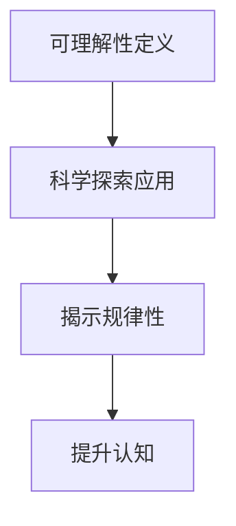

#### 1.2 科学探索的框架

科学探索是一个系统的过程，通常包括以下几个步骤：提出问题、建立假设、实验验证、数据分析、得出结论。这一框架为我们提供了科学研究的指南，帮助我们更好地理解世界。

**核心概念与联系**

以下是科学探索的基本步骤及其关系的Mermaid流程图：

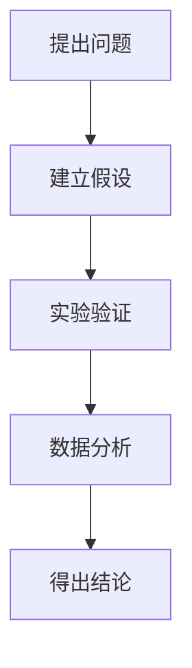

#### 1.3 可理解性与哲学探讨

哲学和科学在探讨世界的可理解性方面有着密切的联系。哲学提供了对世界的基本问题进行反思和探讨的平台，而科学则通过实验和观察来验证哲学上的假设。可理解性作为二者共同的关注点，促使我们在科学和哲学之间架起了一座桥梁。

**核心概念与联系**

以下是可理解性在哲学和科学中的关系的Mermaid流程图：

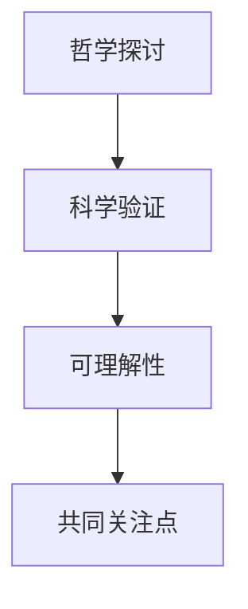

### 第二部分：基础概念

#### 2.1 科学方法与假设

科学方法是一种系统的研究方法，包括观察、假设、实验、验证等步骤。假设是科学探索的起点，它是对问题的可能解释。科学方法通过实验和观察来验证假设，从而得出结论。

**核心概念与联系**

以下是科学方法与假设关系的Mermaid流程图：

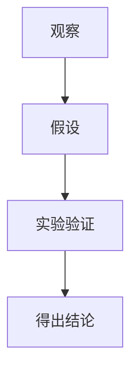

**伪代码**

下面是科学假设的提出和验证过程的伪代码：

```python
# 提出假设
hypothesis = "某个现象可以用某种理论解释"

# 进行实验
experiment_results = perform_experiment()

# 验证假设
if experiment_results.support_hypothesis():
    print("假设得到验证")
else:
    print("假设未得到验证")
```

#### 2.2 物理定律与数学模型

物理定律是描述自然界规律的基本原理，如牛顿定律、热力学定律等。数学模型则是用数学语言描述物理现象的工具，如微分方程、概率分布等。物理定律和数学模型共同构成了科学探索的基础。

**核心概念与联系**

以下是物理定律与数学模型关系的Mermaid流程图：

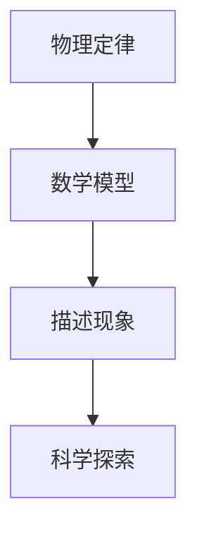

**数学模型与公式**

物理定律和数学模型经常使用公式来表示。以下是几个常见的物理公式：

$$ F = ma $$
$$ E = mc^2 $$
$$ P(E) = \frac{1}{N}\sum_{i=1}^{N}p_i $$

其中，$F$ 表示力，$m$ 表示质量，$a$ 表示加速度，$E$ 表示能量，$c$ 表示光速，$P(E)$ 表示事件$E$ 的概率，$N$ 表示样本数量，$p_i$ 表示第$i$ 个样本的概率。

#### 2.3 宇宙与生命的起源

宇宙的起源和生命的起源是科学探索的两个重要领域。宇宙大爆炸理论描述了宇宙的起源，而生命的起源则涉及到化学进化、生物进化等多个方面。

**核心概念与联系**

以下是宇宙与生命的起源关系的Mermaid流程图：

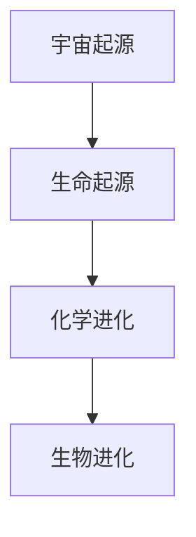

#### 2.4 生命的多样性

生命的多样性是指生物在形态、结构、功能等方面的多样性。生命的多样性是地球生态系统的重要组成部分，也是科学研究的重点之一。

**核心概念与联系**

以下是生命多样性的Mermaid流程图：

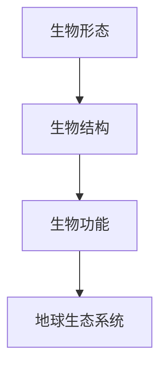

### 第三部分：科学探索的应用

#### 3.1 天文学探索

天文学是研究宇宙中天体的科学。通过观测和理论分析，天文学家揭示了宇宙的结构和演化过程。天文学的进步极大地提高了我们对宇宙的可理解性。

**核心概念与联系**

以下是天文学探索的Mermaid流程图：

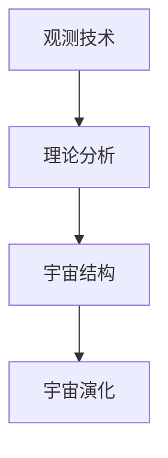

**项目实战**

**开发环境搭建**：搭建一个用于天文学数据处理的开发环境，包括Python、NumPy、SciPy、Matplotlib等工具。

**源代码实现**：编写Python代码，用于读取天文图像数据、进行图像处理和分析。

```python
# 读取图像数据
import matplotlib.pyplot as plt
from astropy.io import fits

# 读取fits文件
hdu = fits.open('image.fits')
data = hdu[0].data

# 显示图像
plt.imshow(data, cmap='gray')
plt.show()
```

**代码解读与分析**：对源代码进行解读，分析其功能和应用。

**实际案例分析和详细讲解剖析**：分析实际天文学研究案例，如星系演化、黑洞研究等，并对其进行详细讲解。

**项目小结**：总结项目中的收获和不足，提出改进建议。

#### 3.2 地球科学探索

地球科学是研究地球及其环境的科学。通过地质、气象、海洋等领域的探索，地球科学家揭示了地球的演化历史和环境变化规律。

**核心概念与联系**

以下是地球科学探索的Mermaid流程图：

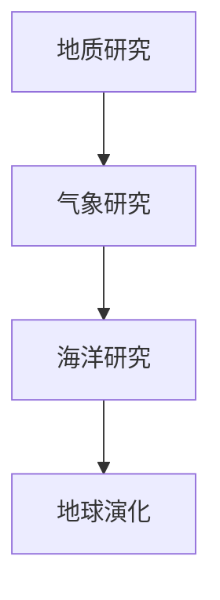

**项目实战**

**开发环境搭建**：搭建一个用于地球科学数据处理的开发环境，包括Python、NumPy、SciPy、Pandas等工具。

**源代码实现**：编写Python代码，用于读取地球科学数据、进行数据分析和可视化。

```python
# 读取数据文件
import pandas as pd

# 读取CSV文件
data = pd.read_csv('earthscience_data.csv')

# 显示数据
print(data.head())
```

**代码解读与分析**：对源代码进行解读，分析其功能和应用。

**实际案例分析和详细讲解剖析**：分析实际地球科学研究案例，如地震预测、气候变化等，并对其进行详细讲解。

**项目小结**：总结项目中的收获和不足，提出改进建议。

#### 3.3 生物医学探索

生物医学是研究生命现象和疾病机制的学科。通过分子生物学、遗传学、细胞生物学等领域的探索，生物医学科学家揭示了生命的基本规律和疾病的根源。

**核心概念与联系**

以下是生物医学探索的Mermaid流程图：

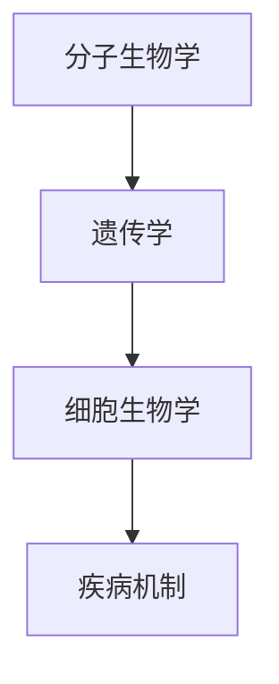

**项目实战**

**开发环境搭建**：搭建一个用于生物医学数据处理的开发环境，包括Python、BioPython、SciPy、Pandas等工具。

**源代码实现**：编写Python代码，用于读取生物医学数据、进行数据分析和可视化。

```python
# 读取数据文件
import pandas as pd

# 读取CSV文件
data = pd.read_csv('biomedicine_data.csv')

# 显示数据
print(data.head())
```

**代码解读与分析**：对源代码进行解读，分析其功能和应用。

**实际案例分析和详细讲解剖析**：分析实际生物医学研究案例，如基因测序、药物开发等，并对其进行详细讲解。

**项目小结**：总结项目中的收获和不足，提出改进建议。

### 第四部分：科学的未来与挑战

#### 4.1 科学前沿与未来趋势

随着科学技术的不断发展，我们面临着越来越多的挑战和机遇。量子计算、人工智能、太空探索等领域正引领科学的前沿，为我们揭示了新的可能性和应用场景。

**核心概念与联系**

以下是科学前沿与未来趋势的Mermaid流程图：

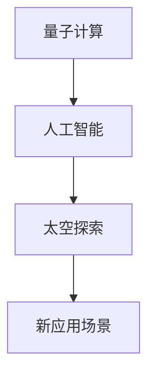

#### 4.2 可持续发展与科学责任

科学在推动社会发展的同时，也面临着可持续发展的挑战。科学家们有责任通过科学研究和技术创新，解决全球性问题，如气候变化、能源危机等。

**核心概念与联系**

以下是可持续发展与科学责任的Mermaid流程图：

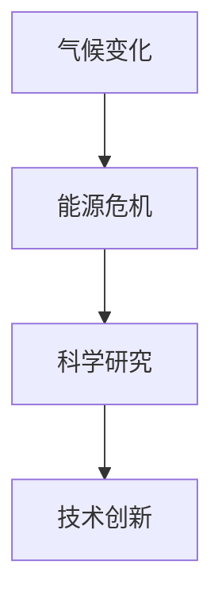

#### 4.3 科学与社会的互动

科学与社会之间的互动是一个复杂的过程。科学成果的普及和应用，以及科学对社会的影响，都需要我们进行深入的研究和探讨。

**核心概念与联系**

以下是科学与社会互动的Mermaid流程图：

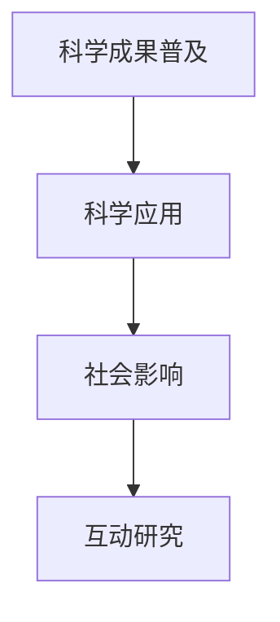

### 附录

#### 5.1 科学探索工具与资源

为了更好地进行科学探索，我们需要掌握各种科学工具和资源。以下是一些常用的工具和资源：

- **Python**：一种广泛使用的编程语言，适用于数据分析和科学计算。
- **NumPy**：用于数值计算的Python库。
- **SciPy**：基于NumPy的科学计算库。
- **Pandas**：用于数据分析和操作的Python库。
- **Matplotlib**：用于数据可视化的Python库。
- **BioPython**：用于生物信息学的Python库。
- **开源数据集**：如UCI机器学习库、Kaggle数据集等。

#### 5.2 科学探索案例分析

为了更好地理解科学探索的实际应用，我们可以分析一些实际案例。以下是一些科学探索的案例：

- **天文学案例**：利用望远镜观测星系，分析其演化过程。
- **地球科学案例**：通过地震数据的分析，预测地震的发生。
- **生物医学案例**：通过基因测序，研究疾病的发生机制。

这些案例为我们提供了实际的科学探索经验，帮助我们更好地理解科学的方法和应用。

### 作者信息

作者：AI天才研究院/AI Genius Institute & 禅与计算机程序设计艺术 /Zen And The Art of Computer Programming

### 总结与展望

通过本文，我们探讨了世界的可理解性在科学探索中的重要性，介绍了科学方法、物理定律、数学模型等基础概念，以及天文学、地球科学、生物医学等领域的应用。我们还展望了科学的未来趋势，并强调了科学与社会之间的互动。通过这篇文章，我们希望能够激发读者对科学探索的兴趣，共同推动科学的发展。

### 最佳实践 tips

1. **培养逻辑思维**：在进行科学探索时，逻辑思维至关重要。通过逐步分析和推理，我们可以更好地理解复杂的科学问题。

2. **多学科交叉**：科学探索往往需要多学科的知识。通过跨学科研究，我们可以更好地解决复杂问题。

3. **持续学习**：科学是不断发展的。为了跟上科学的步伐，我们需要持续学习新的知识和技能。

4. **积极参与**：参与科学项目和研究，可以加深我们对科学的理解，并锻炼我们的实践能力。

5. **关注前沿动态**：关注科学前沿的动态，可以让我们及时了解最新的科学成果和技术应用。

### 注意事项

1. **数据安全**：在进行科学探索时，要注意数据的安全性和隐私保护。

2. **实验伦理**：在进行实验时，要遵循实验伦理，确保实验的可靠性和科学性。

3. **持续更新**：随着科学的发展，我们的认知也在不断更新。要保持开放的心态，及时更新知识体系。

4. **团队协作**：科学探索往往需要团队协作。通过团队合作，我们可以更好地解决复杂问题。

### 拓展阅读

1. **《科学探索的方法》**：介绍了科学探索的基本方法和步骤。
2. **《量子计算与科学》**：探讨了量子计算在科学研究中的应用。
3. **《生物医学前沿》**：介绍了生物医学领域的前沿研究和技术。
4. **《地球科学探索》**：介绍了地球科学领域的研究方法和成果。

通过这些拓展阅读，我们可以进一步了解科学探索的各个方面，提升我们的科学素养。让我们一起探索世界的奥秘，提升世界的可理解性。

