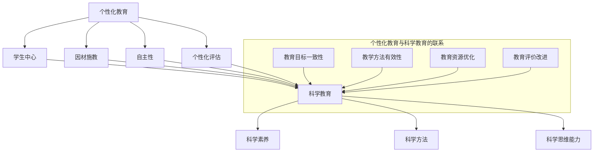
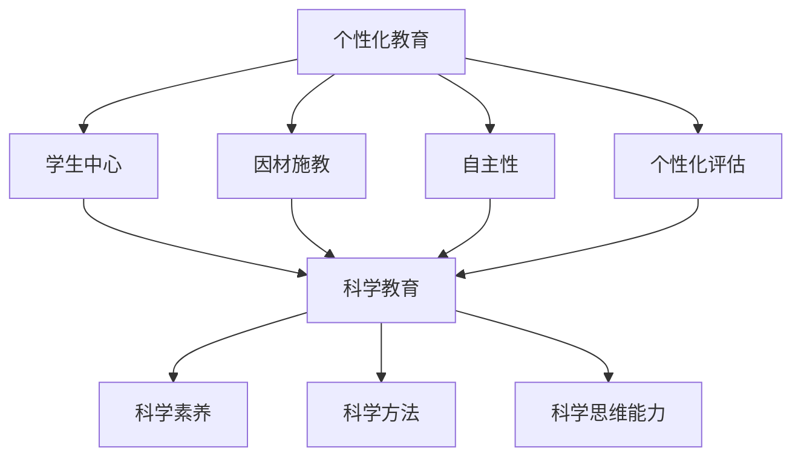

                 


### 引言

科学教育作为培养未来科学家和创新人才的重要手段，一直以来都是教育体系的核心组成部分。然而，传统的科学教育模式往往过于僵化，忽视了学生的个体差异和需求，导致教育效果不尽如人意。随着人工智能和大数据技术的不断发展，个性化科学教育逐渐成为一种可能，它通过因材施教，提升每个人的世界理解能力，成为教育领域的新趋势。

个性化科学教育的核心在于尊重每个学生的独特性，通过个性化教学方案和资源，激发学生的内在学习动机，提高学习效果。这种教育模式不仅能够满足学生的个性化需求，还能够培养他们的批判性思维、创新能力和解决问题的能力。因此，探索和实施个性化科学教育方案具有重要的现实意义。

本文将从以下几个方面展开讨论：

1. **个性化科学教育概念理解**：介绍个性化教育和科学教育的核心概念，以及它们之间的联系。
2. **科学教育个性化实施策略**：分析个性化学习分析、个性化教学设计和个性化学习资源建设的方法和策略。
3. **个性化科学教育的实践案例**：通过中小学和高等教育的实践案例，展示个性化科学教育的实施效果。
4. **个性化科学教育的评估与优化**：探讨个性化科学教育的评估指标体系和优化策略。
5. **科技与个性化科学教育的融合**：分析数字技术在个性化科学教育中的应用现状和挑战。
6. **个性化科学教育展望**：预测个性化科学教育的发展趋势和未来方向。

希望通过本文的讨论，能够为个性化科学教育的实施提供一些有益的思路和参考。

### 关键词

- 个性化科学教育
- 因材施教
- 世界理解能力
- 个性化学习分析
- 个性化教学设计
- 个性化学习资源
- 科学教育实践
- 评估与优化
- 数字技术融合

### 摘要

本文旨在探讨个性化科学教育方案，通过因材施教提升每个人的世界理解能力。首先，介绍了个性化科学教育的背景和重要性，随后从概念理解、实施策略、实践案例、评估优化、科技融合和发展展望等方面进行了深入分析。个性化科学教育通过个性化学习分析、教学设计和资源建设，实现因材施教，提高学生的科学素养和创新能力。文章还通过中小学和高等教育的实践案例，展示了个性化科学教育的实际效果。最后，分析了个性化科学教育的发展趋势和未来方向，为教育工作者提供了参考。

----------------------------------------------------------------

### 第一部分：个性化科学教育概念理解

#### 2.1 个性化教育的核心概念

个性化教育是一种以学生为中心的教育理念，旨在尊重每个学生的个性差异，满足他们的个性化需求，从而实现最佳的教育效果。个性化教育的核心概念包括以下几个方面：

1. **学生中心**：个性化教育将学生置于教育的核心，强调以学生的兴趣、需求和能力为导向，而不是单纯地追求统一的教学内容和标准。
   
2. **因材施教**：个性化教育认为每个学生都是独特的，拥有不同的学习风格、兴趣爱好和认知能力。因此，教育应该根据每个学生的特点，制定个性化的教学方案和资源。

3. **自主性**：个性化教育鼓励学生主动参与学习过程，培养他们的自主学习能力和解决问题的能力，从而提高学习效果。

4. **个性化评估**：个性化教育强调对学生学习过程的持续评估，通过个性化的评估方法，了解学生的学习情况和需求，及时调整教学策略。

#### 2.1.1 个性化教育的定义与特征

个性化教育的定义可以概括为：一种以学生为中心，注重学生个性差异，通过因材施教、自主学习和个性化评估，实现最佳教育效果的教育模式。

个性化教育的特征主要包括：

1. **灵活性**：个性化教育在教学方式、教学内容和评估方法上具有很大的灵活性，能够根据学生的实际情况进行调整。

2. **针对性**：个性化教育针对每个学生的特点，制定个性化的教学方案，确保每个学生都能得到适合自己的教育资源。

3. **多样性**：个性化教育提供多样化的教学资源和方式，以满足学生的不同需求和兴趣。

4. **综合性**：个性化教育不仅关注学生的学习成绩，还关注学生的全面发展，包括思维能力、创新能力、社交能力等。

#### 2.1.2 个性化教育的理论基础

个性化教育的理论基础主要包括以下几个部分：

1. **建构主义学习理论**：建构主义认为，知识不是通过教师的传递而获得的，而是学生在与环境的互动中自主建构的。个性化教育强调学生的主动学习，与建构主义学习理论相契合。

2. **多元智能理论**：加德纳的多元智能理论指出，每个个体都有不同的智能组合，教育应该尊重和培养学生的多元智能，而不是单纯追求学科知识的掌握。个性化教育正是基于这一理论，注重学生的个性差异和发展需求。

3. **自我决定理论**：自我决定理论强调，个体的自主性和自我决定是促进学习和发展的重要因素。个性化教育通过鼓励学生自主学习、自主选择，培养他们的自我决定能力。

#### 2.1.3 个性化教育的目标与价值

个性化教育的目标主要包括：

1. **促进学生全面发展**：个性化教育不仅关注学生的学术成绩，还注重学生的心理健康、社交能力和综合素质的提升。

2. **培养自主学习能力**：个性化教育通过培养学生的自主学习能力，提高他们的学习效率和学习兴趣。

3. **尊重学生个性差异**：个性化教育尊重每个学生的独特性，通过因材施教，帮助每个学生实现自我价值。

个性化教育的价值主要体现在以下几个方面：

1. **提高教育质量**：个性化教育能够更好地满足学生的需求，提高学习效果，从而提高整体教育质量。

2. **促进教育公平**：个性化教育通过尊重学生的个性差异，为每个学生提供公平的教育机会。

3. **培养创新型人才**：个性化教育注重学生的创新能力和批判性思维的培养，为培养创新型人才提供有力支持。

#### 2.2 科学教育的核心概念

科学教育是指通过系统的教学方法和过程，培养学生的科学素养、科学方法和科学思维能力。科学教育的核心概念主要包括：

1. **科学素养**：科学素养是指个体对科学知识、科学方法和科学精神的理解和掌握。科学教育旨在提高学生的科学素养，使他们能够理解科学的基本概念和原理，并能够运用科学方法解决问题。

2. **科学方法**：科学方法是指科学研究的基本步骤和原则，包括观察、假设、实验、验证和结论等。科学教育通过传授科学方法，培养学生的科学思维能力。

3. **科学思维能力**：科学思维能力是指个体运用科学方法进行思考和解决问题的能力。科学教育通过科学实践活动，培养学生的科学思维能力。

#### 2.2.1 科学教育的基本概念与原则

科学教育的基本概念包括：

1. **科学性**：科学教育以科学知识为基础，遵循科学的原则和方法。

2. **系统性**：科学教育内容具有系统性，从基础知识到高级知识，形成一个完整的教育体系。

3. **实践性**：科学教育强调实践，通过实验、探究等活动，培养学生的实践能力和创新精神。

科学教育的基本原则包括：

1. **知识性**：科学教育注重科学知识的传授，使学生掌握基本的科学概念和原理。

2. **方法性**：科学教育注重科学方法的培养，使学生学会运用科学方法解决问题。

3. **创新性**：科学教育鼓励创新思维，培养学生的创造力和创新精神。

4. **综合性**：科学教育强调学科的交叉融合，培养学生的综合素质。

#### 2.2.2 科学教育的内容与分类

科学教育的内容主要包括：

1. **自然科学**：包括物理、化学、生物等学科，传授自然界的规律和现象。

2. **社会科学**：包括地理、历史、社会等学科，帮助学生理解人类社会和自然环境的相互作用。

3. **技术科学**：包括信息技术、工程技术等学科，培养学生的技术应用能力和创新能力。

科学教育的分类可以根据不同的标准进行：

1. **按照学科分类**：可以分为自然科学教育、社会科学教育和技术科学教育。

2. **按照层次分类**：可以分为基础教育、高等教育和职业教育等。

3. **按照目标分类**：可以分为知识教育、能力教育和素质教育等。

#### 2.2.3 科学教育的目标与挑战

科学教育的目标主要包括：

1. **知识传授**：使学生掌握基本的科学知识和概念。

2. **能力培养**：培养学生的科学思维能力和实践能力。

3. **创新精神**：培养学生的创新精神和创新能力。

4. **科学态度**：培养学生的科学态度和科学精神。

科学教育面临的挑战主要包括：

1. **教育资源不足**：由于科学教育资源分布不均，一些地区的科学教育水平较低。

2. **教学方法单一**：传统的教学方法往往过于僵化，难以满足学生的个性化需求。

3. **考试制度问题**：目前的考试制度往往侧重于知识点的考察，忽视了学生能力的培养。

4. **科技发展快速**：科技的快速发展对科学教育提出了新的要求和挑战，教育内容和方法需要不断更新。

#### 2.3 个性化教育与科学教育的联系

个性化教育与科学教育之间存在着紧密的联系，主要体现在以下几个方面：

1. **教育目标的一致性**：个性化教育和科学教育都强调学生的全面发展，包括知识、能力和素质的提升。

2. **教学方法的有效性**：个性化教育通过因材施教、自主学习和个性化评估，提高了科学教育的效果。

3. **教育资源的优化**：个性化教育通过对教育资源的优化配置，提高了科学教育的质量。

4. **教育评价的改进**：个性化教育通过个性化评估，提供了更全面、更科学的科学教育评价体系。

综上所述，个性化教育与科学教育相互促进、相互补充，共同构建了一个更加科学、有效的教育体系。

#### 2.4 Mermaid 流程图：个性化教育与科学教育的核心概念关系架构



### 2.1 个性化教育的核心概念

个性化教育，作为一种以学生为中心的教育理念，旨在尊重每个学生的个性差异，满足他们的个性化需求，从而实现最佳的教育效果。以下是个性化教育的核心概念及其详细解释：

#### 学生中心

学生中心是个性化教育的核心理念之一，强调将学生置于教育的核心位置。这意味着教育过程不再只是教师传授知识，而是学生主动参与、探索和建构知识的过程。具体来说，学生中心包括以下几个方面：

1. **学生的兴趣和需求**：个性化教育重视学生的兴趣和需求，认为这些是学生主动学习的重要驱动力。因此，教育内容和方法应该根据学生的兴趣和需求进行定制。

2. **学生的主动参与**：个性化教育鼓励学生主动参与学习过程，通过提问、讨论、实验和探究等方式，培养学生的自主学习能力和批判性思维。

3. **学生的个性化发展**：个性化教育关注学生的个性化发展，旨在帮助学生实现其潜能，培养他们的独特性，而不仅仅是追求统一的标准。

#### 因材施教

因材施教是个性化教育的另一重要概念，指的是根据学生的个性差异，采取不同的教学策略和资源，以达到最佳的教育效果。具体来说，因材施教包括以下几个方面：

1. **认知差异**：个性化教育认识到每个学生的认知能力、理解能力和学习风格都有所不同，因此应该根据学生的认知差异，调整教学难度和方式。

2. **学习风格**：个性化教育重视学生的学习风格，包括视觉、听觉和动手操作等，通过提供多样化的学习资源和方法，满足不同学习风格的需求。

3. **个性化教学方案**：个性化教育为每个学生制定个性化的教学方案，包括学习目标、教学方法、学习资源和评估方式等。

#### 自主性

自主性是个性化教育的重要组成部分，强调学生自主学习的能力和自我决定的权利。具体来说，自主性包括以下几个方面：

1. **自主学习能力**：个性化教育培养学生的自主学习能力，让他们能够独立完成学习任务，寻找答案，解决问题。

2. **自我决定**：个性化教育鼓励学生参与决策过程，选择适合自己的学习内容和方式，从而提高学习的主动性和积极性。

3. **自我评价**：个性化教育注重学生的自我评价，通过自我反思和自我评估，帮助学生了解自己的学习过程和成果。

#### 个性化评估

个性化评估是个性化教育的重要环节，旨在通过个性化的评估方法，了解学生的学习情况和需求，及时调整教学策略。具体来说，个性化评估包括以下几个方面：

1. **多维度评估**：个性化评估不仅关注学生的学术成绩，还关注学生的综合素质，如思维能力、创新能力、合作能力和沟通能力。

2. **动态评估**：个性化评估是一个持续的过程，通过定期评估，及时了解学生的学习进展和需求，调整教学策略。

3. **反馈与改进**：个性化评估强调及时反馈和改进，通过评估结果，教师可以了解教学效果，调整教学方法，提高教学效果。

### 2.2 科学教育的核心概念

科学教育是指通过系统的教学方法和过程，培养学生的科学素养、科学方法和科学思维能力。科学教育的核心概念主要包括以下几个方面：

#### 科学素养

科学素养是指个体对科学知识、科学方法和科学精神的理解和掌握。科学素养的培养是科学教育的核心目标之一。具体来说，科学素养包括以下几个方面：

1. **科学知识**：科学知识是科学素养的基础，包括自然科学和社会科学的基本概念、原理和事实。

2. **科学方法**：科学方法是指科学研究的基本步骤和原则，包括观察、假设、实验、验证和结论等。科学方法的掌握有助于培养学生的科学思维能力。

3. **科学精神**：科学精神是指科学探究的精神，包括好奇心、批判性思维、实证精神和理性思维等。科学精神的培养有助于培养学生的创新能力和批判性思维。

#### 科学方法

科学方法是指科学研究的基本步骤和原则，是科学教育的重要内容。科学方法的掌握有助于培养学生的科学思维能力和实践能力。科学方法主要包括以下几个步骤：

1. **观察**：观察是科学探究的起点，通过观察，科学家可以发现现象和问题。

2. **假设**：假设是基于观察和已有知识提出的对现象或问题的解释。

3. **实验**：实验是验证假设的重要手段，通过实验，科学家可以验证或修正假设。

4. **验证**：验证是通过实验或其他方法，对假设的正确性进行验证。

5. **结论**：结论是基于实验结果和验证过程的总结，是对现象或问题的最终解释。

#### 科学思维能力

科学思维能力是指个体运用科学方法进行思考和解决问题的能力。科学思维能力的培养是科学教育的重要目标之一。科学思维能力包括以下几个方面：

1. **批判性思维**：批判性思维是指对信息进行评估和判断的能力，有助于学生分析和解决复杂问题。

2. **逻辑推理**：逻辑推理是指通过推理和演绎，从一个或多个前提出发，得出结论的能力。

3. **问题解决**：问题解决是指运用科学方法和思维能力，寻找解决问题的方法和策略。

#### 2.3 个性化教育与科学教育的联系

个性化教育与科学教育之间存在着紧密的联系，它们相互促进，共同构建了一个更加科学、有效的教育体系。以下是个性化教育与科学教育的具体联系：

1. **教育目标的一致性**：个性化教育和科学教育都强调学生的全面发展，包括知识、能力和素质的提升。个性化教育通过因材施教，培养学生的个性化发展，而科学教育则通过传授科学知识和培养科学思维能力，提高学生的科学素养。

2. **教学方法的有效性**：个性化教育通过因材施教，采用多样化的教学方法和资源，提高了科学教育的效果。个性化教学方法强调学生的主动参与和自主性，与科学教育中强调的实验、探究和批判性思维相契合。

3. **教育资源的优化**：个性化教育通过对教育资源的优化配置，提高了科学教育的质量。个性化教育通过提供个性化的教学方案和资源，满足学生的个性化需求，从而提高了教育资源的利用效率。

4. **教育评价的改进**：个性化教育通过个性化的评估方法，提供了更全面、更科学的科学教育评价体系。个性化评估不仅关注学生的学术成绩，还关注学生的综合素质和个性发展，为科学教育提供了更加准确的反馈和改进方向。

综上所述，个性化教育与科学教育相互促进、相互补充，共同构建了一个更加科学、有效的教育体系。通过个性化教育与科学教育的结合，我们可以更好地培养具有科学素养和创新能力的人才。

### 2.4 Mermaid 流程图：个性化教育与科学教育的核心概念关系架构


### 第二部分：科学教育个性化实施策略

个性化科学教育的实施需要综合运用多种策略，从学习分析、教学设计到资源建设，每个环节都需要精心规划，以确保教育效果的最大化。以下是科学教育个性化实施策略的详细讨论：

#### 3.1 个性化学习分析

个性化学习分析是实施个性化科学教育的重要基础。通过学习分析，可以深入了解学生的学习习惯、兴趣、优势和劣势，为制定个性化的教学方案提供依据。以下是学习分析的主要步骤和工具：

1. **数据收集**：通过学习管理系统（LMS）、在线学习平台和实验记录等工具，收集学生的学习数据，包括学习时间、学习进度、作业成绩、考试分数、互动行为等。

   ```mermaid
   graph TD
       A[数据收集] --> B[学习管理系统]
       A --> C[在线学习平台]
       A --> D[实验记录]
   ```

2. **数据分析**：使用数据挖掘和分析技术，对收集到的学习数据进行分析，识别学生的学习模式和特征。常用的数据分析方法包括聚类分析、关联规则挖掘、时间序列分析等。

   ```mermaid
   graph TD
       E[数据分析] --> F[聚类分析]
       E --> G[关联规则挖掘]
       E --> H[时间序列分析]
   ```

3. **学习分析工具**：利用专门的学习分析工具，如学习分析平台（Learning Analytics Platforms）、学习分析软件等，进行数据可视化、趋势分析和预测。

   ```mermaid
   graph TD
       I[学习分析工具] --> J[学习分析平台]
       I --> K[学习分析软件]
   ```

4. **个性化学习方案**：基于学习分析结果，制定个性化的学习方案，包括调整学习内容、学习进度和教学方法，以满足学生的个性化需求。

   ```mermaid
   graph TD
       L[个性化学习方案] --> M[调整学习内容]
       L --> N[调整学习进度]
       L --> O[调整教学方法]
   ```

#### 3.2 个性化教学设计

个性化教学设计是科学教育个性化的核心环节。通过个性化教学设计，可以确保教学活动更加符合学生的兴趣和能力，提高学习效果。以下是个性化教学设计的步骤和方法：

1. **确定学习目标**：根据学生的个性化需求和学科要求，明确学习目标。学习目标应具体、可测量和可达成。

   ```mermaid
   graph TD
       P[确定学习目标] --> Q[具体化]
       P --> R[可测量]
       P --> S[可达成]
   ```

2. **分析学生特点**：通过学习分析结果，了解学生的兴趣、能力、学习风格和需求，为教学设计提供依据。

   ```mermaid
   graph TD
       T[分析学生特点] --> U[兴趣]
       T --> V[能力]
       T --> W[学习风格]
       T --> X[需求]
   ```

3. **设计教学方法**：根据学生的特点和学习目标，选择合适的教学方法。常用的个性化教学方法包括项目式学习、探究式学习、合作学习和翻转课堂等。

   ```mermaid
   graph TD
       Y[设计教学方法] --> Z[项目式学习]
       Y --> AA[探究式学习]
       Y --> BB[合作学习]
       Y --> CC[翻转课堂]
   ```

4. **制定教学计划**：根据学习目标和教学方法，制定详细的教学计划，包括教学内容、教学步骤、教学资源和评估方法。

   ```mermaid
   graph TD
       DD[制定教学计划] --> EE[教学内容]
       DD --> FF[教学步骤]
       DD --> GG[教学资源]
       DD --> HH[评估方法]
   ```

5. **实施与调整**：在教学过程中，根据学生的反馈和学习效果，及时调整教学策略，确保教学活动始终符合学生的需求。

   ```mermaid
   graph TD
       II[实施与调整] --> JJ[学生反馈]
       II --> KK[学习效果]
   ```

#### 3.3 个性化学习资源建设

个性化学习资源建设是确保个性化教学得以实施的重要保障。通过建设丰富多样的学习资源，可以满足不同学生的学习需求，提高学习效果。以下是个性化学习资源建设的步骤和方法：

1. **资源分类**：根据学科内容和教学目标，将学习资源分为基本资源、拓展资源和辅助资源等不同类别。

   ```mermaid
   graph TD
       MM[资源分类] --> NN[基本资源]
       MM --> OO[拓展资源]
       MM --> PP[辅助资源]
   ```

2. **资源选择**：根据学生的特点和学习需求，选择合适的资源。资源的选择应考虑其质量、实用性、趣味性和可获取性。

   ```mermaid
   graph TD
       QQ[资源选择] --> RR[资源质量]
       QQ --> SS[实用性]
       QQ --> TT[趣味性]
       QQ --> UU[可获取性]
   ```

3. **资源整合**：将各类资源进行整合，形成一个完整的个性化学习资源库。资源整合可以采用分类目录、主题目录或关键词索引等方式。

   ```mermaid
   graph TD
       VV[资源整合] --> WW[分类目录]
       VV --> XX[主题目录]
       VV --> YY[关键词索引]
   ```

4. **资源评价**：定期对学习资源进行评价，了解其使用效果和学生反馈，及时更新和优化资源库。

   ```mermaid
   graph TD
       ZZ[资源评价] --> AAA[使用效果]
       ZZ --> BBB[学生反馈]
   ```

5. **资源推广**：通过宣传、培训和奖励等方式，推广个性化学习资源的使用，提高学生的参与度和学习效果。

   ```mermaid
   graph TD
       CCC[资源推广] --> DDD[宣传]
       CCC --> EEE[培训]
       CCC --> FFF[奖励]
   ```

#### 3.4 个性化教学设计与学习资源建设的关系

个性化教学设计与学习资源建设是相互关联、相互促进的。个性化教学设计需要依赖丰富的学习资源，而学习资源建设也需要根据个性化教学设计的需求进行调整和优化。以下是两者之间关系的详细说明：

1. **目标一致性**：个性化教学设计的学习目标和学习资源建设的目标应保持一致，以确保教学资源和教学活动的一致性。

   ```mermaid
   graph TD
       GGG[目标一致性] --> HH[学习目标]
       GGG --> II[资源目标]
   ```

2. **相互依赖**：个性化教学设计依赖于丰富的学习资源，而学习资源建设需要根据个性化教学设计的需求进行优化和调整。

   ```mermaid
   graph TD
       JJJ[相互依赖] --> KK[教学设计]
       JJJ --> LL[资源建设]
   ```

3. **动态调整**：个性化教学设计和学习资源建设是一个动态调整的过程，需要根据学生的反馈和学习效果，不断优化和调整教学方案和资源。

   ```mermaid
   graph TD
       MMM[动态调整] --> NN[教学反馈]
       MMM --> OO[资源反馈]
   ```

综上所述，个性化学习分析、个性化教学设计和个性化学习资源建设是科学教育个性化实施的关键环节。通过这三个环节的有机结合，可以确保个性化科学教育的有效实施，提高学生的学习效果和科学素养。

### 3.1 个性化学习分析

个性化学习分析是科学教育个性化实施的重要基础，它通过分析学生的学习数据，为教学设计提供依据，确保教学活动能够更好地满足学生的个性化需求。以下将详细讨论个性化学习分析的基本原理、工具与技术，以及其在个性化科学教育中的应用。

#### 3.1.1 学习分析的基本原理

学习分析基于数据分析的方法，通过对学生的学习行为、学习成果和学习环境等数据进行收集、处理和分析，以识别学生的学习模式、兴趣、优势和需求。学习分析的基本原理包括以下几个方面：

1. **数据收集**：学习分析首先需要收集大量的学习数据，这些数据可以来自学习管理系统（LMS）、在线学习平台、课堂互动系统、作业提交系统等。

   ```mermaid
   graph TD
       A[数据收集] --> B[学习管理系统]
       A --> C[在线学习平台]
       A --> D[课堂互动系统]
       A --> E[作业提交系统]
   ```

2. **数据存储**：收集到的数据需要存储在数据库中，以便后续的分析和处理。常用的数据存储技术包括关系数据库、NoSQL数据库和云存储等。

   ```mermaid
   graph TD
       F[数据存储] --> G[关系数据库]
       F --> H[NoSQL数据库]
       F --> I[云存储]
   ```

3. **数据分析**：数据分析是学习分析的核心，通过数据挖掘、机器学习和统计方法，对学习数据进行分析，以识别学生的学习行为模式和特征。

   ```mermaid
   graph TD
       J[数据分析] --> K[数据挖掘]
       J --> L[机器学习]
       J --> M[统计分析]
   ```

4. **数据可视化**：通过数据可视化技术，将分析结果以图表、图形和报表等形式呈现，帮助教育工作者和学生更好地理解学习数据。

   ```mermaid
   graph TD
       N[数据可视化] --> O[图表]
       N --> P[图形]
       N --> Q[报表]
   ```

5. **反馈与调整**：根据数据分析结果，教育工作者可以及时调整教学策略和资源，以更好地满足学生的个性化需求。

   ```mermaid
   graph TD
       R[反馈与调整] --> S[教学策略]
       R --> T[教育资源]
   ```

#### 3.1.2 学习分析工具与技术

学习分析工具和技术是进行个性化学习分析的重要手段。以下介绍几种常用的学习分析工具和技术：

1. **学习分析平台**：学习分析平台是集成多种学习分析功能的应用程序，它可以帮助教育工作者和学生进行数据收集、分析和可视化。

   ```mermaid
   graph TD
       U[学习分析平台] --> V[数据收集]
       U --> W[数据分析]
       U --> X[数据可视化]
   ```

2. **机器学习算法**：机器学习算法是学习分析的核心技术之一，它可以自动识别和分类学习数据，预测学生的未来学习行为和成绩。

   ```mermaid
   graph TD
       Y[机器学习算法] --> Z[分类算法]
       Y --> AA[回归算法]
       Y --> BB[聚类算法]
   ```

3. **自然语言处理**：自然语言处理技术可以帮助分析学生的文本输入，如作业、讨论和测试等，以识别学生的学习情感和认知状态。

   ```mermaid
   graph TD
       CC[NLP] --> DD[情感分析]
       CC --> EE[主题建模]
   ```

4. **数据挖掘技术**：数据挖掘技术用于从大量的学习数据中发现模式和关联，帮助教育工作者识别学习行为中的潜在问题和机会。

   ```mermaid
   graph TD
       FF[数据挖掘技术] --> GG[关联规则挖掘]
       FF --> HH[序列模式挖掘]
   ```

5. **教育数据仓库**：教育数据仓库是用于存储、管理和分析大量教育数据的系统，它可以为学习分析提供强大的数据支持。

   ```mermaid
   graph TD
       II[教育数据仓库] --> JJ[数据存储]
       II --> KK[数据管理]
       II --> LL[数据分析]
   ```

#### 3.1.3 学习分析在个性化科学教育中的应用

学习分析在个性化科学教育中的应用，可以帮助教师更好地了解学生的科学学习情况，制定个性化的教学方案，提高学生的学习效果。以下是一些具体的应用场景：

1. **学习行为分析**：通过分析学生的学习行为数据，如学习时间、学习频率、参与度等，了解学生的学习习惯和学习效率，为个性化教学提供依据。

   ```mermaid
   graph TD
       MM[学习行为分析] --> NN[学习时间]
       MM --> OO[学习频率]
       MM --> PP[参与度]
   ```

2. **学习成果分析**：通过分析学生的学习成果数据，如作业成绩、考试分数、实验报告等，评估学生的学习效果，识别学生的学习困难和优势领域。

   ```mermaid
   graph TD
       QQ[学习成果分析] --> RR[作业成绩]
       QQ --> SS[考试分数]
       QQ --> TT[实验报告]
   ```

3. **个性化学习路径规划**：根据学习分析结果，为学生规划个性化的学习路径，提供适合他们的学习资源和教学活动，帮助他们更好地掌握科学知识。

   ```mermaid
   graph TD
       UU[个性化学习路径规划] --> VV[学习资源]
       UU --> WW[教学活动]
   ```

4. **学习支持服务**：通过学习分析，为教师和学生提供及时的学习支持服务，如学习辅导、学习策略指导、学习资源推荐等。

   ```mermaid
   graph TD
       XX[学习支持服务] --> YY[学习辅导]
       XX --> ZZ[学习策略指导]
       XX --> AAA[学习资源推荐]
   ```

综上所述，个性化学习分析在个性化科学教育中发挥着重要作用。通过数据驱动的学习分析，教育工作者可以更好地了解学生的学习情况，制定个性化的教学方案，从而提高学生的科学素养和创新能力。

### 3.2 个性化教学设计

个性化教学设计是科学教育个性化实施的关键环节，它旨在根据学生的个性差异和需求，设计出最适合他们的教学方案。个性化教学设计不仅包括教学方法的选择，还涉及教学内容的调整、教学资源的配置和教学评估的优化。以下将详细探讨个性化教学设计的原则、步骤和方法，并通过案例分析来展示其实施过程。

#### 3.2.1 个性化教学设计的原则

个性化教学设计应遵循以下原则：

1. **学生中心**：个性化教学设计应以学生为中心，充分考虑学生的兴趣、需求和学习风格，确保教学活动能够激发学生的学习动机和参与度。

2. **因材施教**：个性化教学设计应根据学生的个体差异，制定不同的教学目标和教学方案，满足不同学生的学习需求。

3. **自主性**：个性化教学设计应培养学生的自主学习能力，鼓励他们主动参与学习过程，提高学习的自主性和主动性。

4. **灵活性**：个性化教学设计应具有灵活性，能够根据学生的学习进度、反馈和需求，及时调整教学策略和内容。

5. **可持续性**：个性化教学设计应具有可持续性，通过长期跟踪和反馈，不断完善和优化教学方案，确保其长期有效性。

#### 3.2.2 个性化教学设计的步骤

个性化教学设计的步骤可以分为以下几个阶段：

1. **需求分析**：在开始设计个性化教学之前，首先要进行需求分析，了解学生的基本情况、学习需求和兴趣点。这一阶段可以通过问卷调查、访谈和观察等方式进行。

   ```mermaid
   graph TD
       A[需求分析] --> B[问卷调查]
       A --> C[访谈]
       A --> D[观察]
   ```

2. **目标设定**：根据需求分析结果，设定明确的教学目标。教学目标应具体、可测量和可达成，既要考虑学科要求，也要考虑学生的个性化需求。

   ```mermaid
   graph TD
       E[目标设定] --> F[具体化]
       E --> G[可测量]
       E --> H[可达成]
   ```

3. **教学策略选择**：根据教学目标和学生的特点，选择合适的教学策略。个性化教学策略包括项目式学习、探究式学习、合作学习和翻转课堂等。

   ```mermaid
   graph TD
       I[教学策略选择] --> J[项目式学习]
       I --> K[探究式学习]
       I --> L[合作学习]
       I --> M[翻转课堂]
   ```

4. **教学资源准备**：根据教学策略，准备相应的教学资源，包括教材、视频、实验材料、学习工具等。教学资源应多样化，以满足不同学生的学习需求。

   ```mermaid
   graph TD
       N[教学资源准备] --> O[教材]
       N --> P[视频]
       N --> Q[实验材料]
       N --> R[学习工具]
   ```

5. **教学实施**：根据制定的教学方案，开展教学活动。在教学过程中，教师应密切关注学生的学习情况，及时给予反馈和支持。

   ```mermaid
   graph TD
       S[教学实施] --> T[课堂互动]
       S --> U[教学反馈]
       S --> V[支持服务]
   ```

6. **教学评估**：通过定期的评估，了解学生的学习效果和反馈，调整教学策略和资源，确保教学目标的有效达成。

   ```mermaid
   graph TD
       W[教学评估] --> X[学习效果]
       W --> Y[学生反馈]
       W --> Z[教学调整]
   ```

#### 3.2.3 个性化教学设计的方法

个性化教学设计的方法包括以下几种：

1. **项目式学习**：项目式学习是一种以学生为中心的教学方法，通过实际项目的开展，使学生能够应用所学知识解决实际问题。

   ```mermaid
   graph TD
       AA[项目式学习] --> BB[项目设计]
       AA --> CC[项目实施]
       AA --> DD[项目评估]
   ```

2. **探究式学习**：探究式学习是一种以问题为导向的学习方法，通过引导学生主动探究和发现，培养他们的批判性思维和创新能力。

   ```mermaid
   graph TD
       EE[探究式学习] --> FF[问题提出]
       EE --> GG[探究过程]
       EE --> HH[成果展示]
   ```

3. **合作学习**：合作学习是一种以小组为单位的合作学习方法，通过学生之间的互动和协作，提高学习效果和团队精神。

   ```mermaid
   graph TD
       II[合作学习] --> JJ[小组分组]
       II --> KK[任务分配]
       II --> LL[协作学习]
   ```

4. **翻转课堂**：翻转课堂是一种先学后教的教学方法，通过学生在课前自主学习和在课堂上进行讨论和互动，提高教学效果。

   ```mermaid
   graph TD
       MM[翻转课堂] --> NN[课前学习]
       MM --> OO[课堂互动]
       MM --> PP[课后巩固]
   ```

#### 3.2.4 案例分析

以下是一个个性化教学设计的案例分析：

**案例背景**：某高中学校的化学教师，发现班级中的学生在有机化学的学习中存在较大的差异，有的学生掌握得较好，有的学生则感到困难。

**需求分析**：通过问卷调查和访谈，教师了解到学生在有机化学学习中的主要困难在于分子结构和反应机理的理解，以及实验操作技能的掌握。

**目标设定**：设定以下教学目标：
- **知识目标**：掌握有机化学的基本概念和反应机理。
- **能力目标**：提高实验操作技能和问题解决能力。
- **素质目标**：培养科学探究精神和团队合作能力。

**教学策略选择**：采用项目式学习和探究式学习相结合的策略，通过实际项目让学生自主探究和发现有机化学的知识点。

**教学资源准备**：准备了教材、视频讲解、实验材料、在线实验平台等教学资源。

**教学实施**：
- **课前学习**：学生通过在线平台自主学习有机化学的基本概念和反应机理，观看视频讲解，完成课前作业。
- **课堂互动**：课堂上，教师引导学生进行实验操作，通过小组合作探究分子结构和反应机理。教师提供指导和支持，帮助学生解决问题。
- **课后巩固**：学生通过在线平台进行实验报告的提交，教师根据报告进行反馈和评分。

**教学评估**：通过定期测试、实验报告和课堂互动反馈，评估学生的学习效果。根据评估结果，教师调整教学策略和资源，如增加实验次数、提供额外的学习资源等。

通过这个案例分析，可以看出个性化教学设计在科学教育中的应用效果。通过因材施教和多样化的教学策略，学生能够更好地掌握科学知识，提高实验操作技能，培养科学探究精神和团队合作能力。

### 3.3 个性化学习资源建设

个性化学习资源建设是科学教育个性化实施的重要组成部分，它旨在为学生提供多样化的学习资源和工具，以满足不同学生的学习需求和兴趣。以下将详细讨论个性化学习资源建设的重要性、分类方法、选择与评价标准，以及个性化学习资源在实际教学中的应用。

#### 3.3.1 个性化学习资源建设的重要性

个性化学习资源建设在科学教育中具有重要作用：

1. **满足个性化需求**：通过提供多样化的学习资源，个性化学习资源建设能够满足不同学生的学习需求和兴趣，促进学生的个性化发展。
2. **提高学习效果**：丰富的学习资源能够激发学生的学习兴趣，提高学习效果和积极性。
3. **促进自主学习**：个性化学习资源建设有助于培养学生的自主学习能力，使他们能够根据自己的学习进度和需求，进行自主探究和学习。
4. **支持教学活动**：个性化学习资源建设为教师提供了丰富的教学素材和工具，有助于提高教学质量和效果。

#### 3.3.2 个性化学习资源的分类方法

个性化学习资源可以根据不同的标准进行分类，以下是一些常见的分类方法：

1. **按内容分类**：
   - **知识性资源**：如教材、参考书、电子书等，主要用于知识传授和巩固。
   - **技能性资源**：如实验视频、操作手册、在线实验平台等，主要用于技能训练和实践操作。
   - **探究性资源**：如科学实验、研究项目、探究指南等，主要用于激发学生的探究兴趣和培养创新能力。

   ```mermaid
   graph TD
       A[知识性资源] --> B[教材]
       A --> C[参考书]
       A --> D[电子书]
       E[技能性资源] --> F[实验视频]
       E --> G[操作手册]
       E --> H[在线实验平台]
       I[探究性资源] --> J[科学实验]
       I --> K[研究项目]
       I --> L[探究指南]
   ```

2. **按形式分类**：
   - **文本资源**：如文章、报告、笔记等。
   - **图像资源**：如图表、图片、示意图等。
   - **音频资源**：如讲解视频、音频讲座等。
   - **视频资源**：如教学视频、实验操作视频等。
   - **虚拟现实资源**：如虚拟实验室、虚拟场景等。

   ```mermaid
   graph TD
       M[文本资源] --> N[文章]
       M --> O[报告]
       M --> P[笔记]
       Q[图像资源] --> R[图表]
       Q --> S[图片]
       Q --> T[示意图]
       U[音频资源] --> V[讲解视频]
       U --> W[音频讲座]
       X[视频资源] --> Y[教学视频]
       X --> Z[实验操作视频]
       AA[虚拟现实资源] --> BB[虚拟实验室]
       AA --> CC[虚拟场景]
   ```

3. **按来源分类**：
   - **校内资源**：如学校图书馆、实验室、在线学习平台等。
   - **校外资源**：如互联网资源、科研机构资源、教育平台等。

   ```mermaid
   graph TD
       DD[校内资源] --> EE[学校图书馆]
       DD --> FF[实验室]
       DD --> GG[在线学习平台]
       HH[校外资源] --> II[互联网资源]
       HH --> JJ[科研机构资源]
       HH --> KK[教育平台]
   ```

#### 3.3.3 个性化学习资源的选择与评价标准

在选择个性化学习资源时，应考虑以下评价标准：

1. **适用性**：资源是否适合学生的年龄、认知水平和学科要求。
2. **准确性**：资源的知识内容和科学性是否准确无误。
3. **趣味性**：资源是否能够激发学生的学习兴趣和参与度。
4. **实用性**：资源是否能够有效支持教学活动和学生的学习过程。
5. **可获取性**：资源是否易于获取和利用。
6. **多样性**：资源是否丰富多样，能够满足不同学生的学习需求和兴趣。

   ```mermaid
   graph TD
       L[适用性] --> M[年龄]
       L --> N[认知水平]
       L --> O[学科要求]
       P[准确性] --> Q[知识内容]
       P --> R[科学性]
       S[趣味性] --> T[兴趣]
       S --> U[参与度]
       V[实用性] --> W[教学活动]
       V --> X[学习过程]
       Y[可获取性] --> Z[获取]
       Y --> AA[利用]
       BB[多样性] --> CC[需求]
       BB --> DD[兴趣]
   ```

#### 3.3.4 个性化学习资源在实际教学中的应用

个性化学习资源在实际教学中的应用包括以下几个方面：

1. **教学活动支持**：教师可以利用个性化学习资源开展教学活动，如项目式学习、探究式学习和翻转课堂等，丰富教学形式，提高教学效果。

   ```mermaid
   graph TD
       EE[教学活动支持] --> FF[项目式学习]
       EE --> GG[探究式学习]
       EE --> HH[翻转课堂]
   ```

2. **自主学习引导**：学生可以利用个性化学习资源进行自主学习，如在线学习平台、虚拟实验室和探究指南等，提高学习效率和自主学习能力。

   ```mermaid
   graph TD
       II[自主学习引导] --> JJ[在线学习平台]
       II --> KK[虚拟实验室]
       II --> LL[探究指南]
   ```

3. **学习效果评估**：教师可以利用个性化学习资源进行学习效果评估，如在线测试、实验报告和作业等，及时了解学生的学习情况，调整教学策略。

   ```mermaid
   graph TD
       MM[学习效果评估] --> NN[在线测试]
       MM --> OO[实验报告]
       MM --> PP[作业]
   ```

综上所述，个性化学习资源建设是科学教育个性化实施的重要组成部分。通过合理选择和评价个性化学习资源，并有效应用于教学活动中，可以更好地满足学生的个性化需求，提高学习效果和教学质量。

### 第三部分：个性化科学教育的实践案例

#### 3.4.1 中小学个性化科学教育实践

中小学个性化科学教育实践在近年来逐渐受到重视，通过具体的案例展示，我们可以看到个性化科学教育在提高学生科学素养、培养创新能力和解决实际问题的能力方面取得了显著的成效。

**案例背景**：某城市的一所中小学，在科学教育中遇到了学生学习兴趣不高、成绩参差不齐的问题。学校决定引入个性化科学教育方案，通过因材施教，提高学生的科学素养和创新能力。

**实施策略**：
1. **个性化学习分析**：学校采用学习分析平台，收集学生的科学学习数据，包括学习时间、作业完成情况、考试成绩等，通过数据分析，了解学生的学习状况和需求。

   ```mermaid
   graph TD
       A[个性化学习分析] --> B[学习分析平台]
       B --> C[数据收集]
       B --> D[数据分析]
   ```

2. **个性化教学设计**：根据学习分析结果，教师为学生制定个性化的教学计划，采用项目式学习和探究式学习方法，激发学生的学习兴趣。

   ```mermaid
   graph TD
       E[个性化教学设计] --> F[项目式学习]
       E --> G[探究式学习]
   ```

3. **个性化学习资源建设**：学校建设了丰富的个性化学习资源库，包括科学实验视频、在线实验平台、科学探究指南等，学生可以根据自己的需求选择合适的资源进行学习。

   ```mermaid
   graph TD
       H[个性化学习资源建设] --> I[科学实验视频]
       H --> J[在线实验平台]
       H --> K[科学探究指南]
   ```

**实施效果**：
- **学生参与度提高**：通过个性化教学设计和丰富多样的学习资源，学生的科学学习兴趣得到了显著提升，课堂参与度和互动性明显增强。
- **学习成绩提升**：个性化教学方案使得学生能够更好地掌握科学知识，学习成绩普遍提高，特别是在科学实验和探究项目中的表现尤为突出。
- **创新能力增强**：个性化科学教育培养了学生的探究精神和创新能力，学生在科学探究项目中提出了许多新颖的解决方案。

**反思与改进**：
- **持续学习分析**：学校应持续进行学习分析，根据学生的学习反馈和成果，不断调整教学策略和资源，确保个性化教育方案的持续有效性。
- **教师培训**：加强对教师的培训，提高他们对个性化科学教育的理解和应用能力，确保教学方案能够真正落地实施。
- **家长参与**：鼓励家长积极参与到个性化科学教育中来，建立家校合作机制，共同促进学生的全面发展。

#### 3.4.2 高等教育个性化科学教育实践

在高等教育中，个性化科学教育实践同样具有重要意义。以下是一个具体的案例，展示个性化科学教育在提升研究生科学素养和创新能力方面的效果。

**案例背景**：某知名大学的物理系，发现研究生在学习过程中存在个体差异，一些学生能够迅速掌握理论知识，而另一些学生则更擅长实验操作。为了提升研究生的科学素养和创新能力，学校决定实施个性化科学教育方案。

**实施策略**：
1. **个性化学习分析**：通过学习分析系统，收集研究生的学习数据，包括实验记录、文献阅读情况、研究成果等，分析每个学生的学术兴趣和特长。

   ```mermaid
   graph TD
       A[个性化学习分析] --> B[学习分析系统]
       B --> C[数据收集]
       B --> D[数据分析]
   ```

2. **个性化导师制**：学校采用个性化导师制，每位研究生配备一名专业导师，根据学生的兴趣和特长，制定个性化的研究计划和培养方案。

   ```mermaid
   graph TD
       E[个性化导师制] --> F[专业导师]
       E --> G[研究计划]
       E --> H[培养方案]
   ```

3. **个性化科研项目**：学校鼓励研究生参与个性化科研项目，根据学生的兴趣和专业方向，选择具有挑战性的研究课题，培养学生的科研能力和创新思维。

   ```mermaid
   graph TD
       I[个性化科研项目] --> J[科研课题]
       I --> K[科研团队]
       I --> L[科研经费]
   ```

**实施效果**：
- **科研能力提升**：个性化导师制和科研项目使得研究生能够更好地结合自己的兴趣和特长，深入研究科学问题，提升了科研能力和学术水平。
- **创新能力增强**：通过个性化的科研训练，研究生培养了创新思维和解决问题的能力，为未来的学术研究和职业发展奠定了坚实的基础。
- **学术成果丰富**：个性化科学教育方案有效促进了研究生的学术成果，多篇高水平论文在国际知名期刊上发表，部分学生还获得了重要的科研奖项。

**反思与改进**：
- **教学资源优化**：学校应持续优化教学资源，提供丰富的科学文献、实验设备和科研平台，以满足个性化科学教育需求。
- **跨学科合作**：鼓励研究生跨学科合作，通过多学科的交叉研究，培养综合性人才。
- **国际化视野**：加强与国际科研机构的合作，推动研究生参与国际科研项目和学术交流，拓宽国际视野。

通过中小学和高等教育的个性化科学教育实践案例，我们可以看到，个性化科学教育在提高学生科学素养、培养创新能力和解决实际问题的能力方面具有重要的意义。未来的个性化科学教育实践，需要继续深化理论研究，探索更有效的实施策略，为培养具有全球竞争力的高素质科学人才提供支持。

### 第四部分：个性化科学教育的评估与优化

#### 4.1 个性化科学教育评估指标体系

个性化科学教育的评估与优化是确保教育质量和效果的关键环节。为了全面、科学地评估个性化科学教育的实施情况，我们需要构建一个系统化的评估指标体系。以下将详细讨论评估指标体系的构建原则、构建方法和具体实施步骤。

##### 4.1.1 构建原则

1. **全面性**：评估指标体系应涵盖学生科学素养、创新能力、学习兴趣等多个方面，确保评估的全面性。
2. **科学性**：评估指标体系应基于科学的教育理论和实践，确保评估结果的准确性和可靠性。
3. **可操作性**：评估指标体系应具备可操作性，便于实际教学过程中的实施和操作。
4. **动态性**：评估指标体系应具备动态调整能力，能够根据教育实践的变化进行实时调整和优化。

##### 4.1.2 构建方法

1. **文献综述**：通过查阅相关文献，了解个性化科学教育评估领域的理论和方法，为构建评估指标体系提供理论基础。
2. **专家咨询**：邀请教育领域和科学领域的专家，对评估指标体系的设计进行咨询和建议，确保评估指标的科学性和可操作性。
3. **实证研究**：通过实证研究，收集个性化科学教育的相关数据，分析评估指标的有效性和可行性。
4. **指标筛选**：根据文献综述、专家咨询和实证研究的结果，筛选出最具有代表性和可操作性的评估指标。

##### 4.1.3 实施步骤

1. **确定评估目标**：根据个性化科学教育的目标和要求，明确评估的具体目标和内容。
2. **设计评估框架**：基于评估目标，设计评估框架，确定评估的维度和指标。
3. **制定评估工具**：根据评估框架，制定具体的评估工具，如问卷、量表、观察表等。
4. **实施评估**：在个性化科学教育的实际教学过程中，按照评估工具进行评估，收集相关数据。
5. **数据分析**：对收集到的评估数据进行整理和分析，评估个性化科学教育的实施效果。
6. **反馈与改进**：根据评估结果，及时反馈给教师和学生，进行教学调整和优化。

##### 4.1.4 评估指标体系示例

以下是一个简单的个性化科学教育评估指标体系示例：

| 维度       | 指标名称       | 分值 |
|------------|----------------|------|
| 科学素养   | 知识掌握情况   | 20   |
| 创新能力   | 科研项目成果   | 30   |
| 学习兴趣   | 学习积极性     | 20   |
| 自主学习   | 自主学习能力   | 20   |
| 合作能力   | 团队合作能力   | 10   |

#### 4.2 个性化科学教育优化策略

个性化科学教育优化策略的制定和实施是确保教育质量和效果的重要保障。以下将详细讨论优化策略的制定原则、具体方法和实施步骤。

##### 4.2.1 制定原则

1. **目标导向**：优化策略的制定应明确目标，确保优化措施能够有效提升个性化科学教育的质量。
2. **科学性**：优化策略的制定应基于科学的教育理论和实践，确保措施的可行性和有效性。
3. **可操作性**：优化策略应具备可操作性，便于在实际教学过程中实施。
4. **动态性**：优化策略应具备动态调整能力，能够根据教育实践的变化进行实时调整和优化。

##### 4.2.2 制定方法

1. **文献综述**：通过查阅相关文献，了解个性化科学教育优化领域的理论和方法，为优化策略的制定提供理论基础。
2. **实践调研**：通过实地调研和访谈，了解个性化科学教育的实际情况和存在问题，为优化策略的制定提供实证支持。
3. **专家咨询**：邀请教育领域和科学领域的专家，对优化策略的制定进行咨询和建议，确保优化策略的科学性和可操作性。
4. **案例研究**：通过分析成功的个性化科学教育案例，借鉴其优化经验和做法，为优化策略的制定提供参考。

##### 4.2.3 实施步骤

1. **确定优化目标**：根据个性化科学教育的目标和要求，明确优化的具体目标和内容。
2. **设计优化方案**：基于优化目标，设计具体的优化方案，包括优化措施、实施步骤和时间表。
3. **实施优化措施**：在个性化科学教育的实际教学过程中，按照优化方案实施优化措施。
4. **评估优化效果**：通过评估和反馈，了解优化措施的实施效果，及时调整和优化优化方案。
5. **持续改进**：根据评估结果，不断优化和调整优化策略，确保个性化科学教育的持续发展。

##### 4.2.4 优化策略示例

以下是一个简单的个性化科学教育优化策略示例：

1. **教学资源优化**：建设多样化的个性化学习资源，包括在线课程、实验视频、虚拟实验室等，满足学生的个性化需求。
2. **教学方法优化**：采用项目式学习和探究式学习方法，提高学生的自主学习能力和创新能力。
3. **教师培训优化**：加强对教师的培训，提高他们的个性化教学能力和教育技术能力。
4. **学习支持服务优化**：提供个性化的学习支持服务，包括学习辅导、学习策略指导和学习资源推荐等。

通过构建科学的评估指标体系和实施有效的优化策略，个性化科学教育可以更好地满足学生的个性化需求，提高教育质量和效果。

### 第五部分：科技与个性化科学教育的融合

#### 5.1 数字技术在个性化科学教育中的应用

随着科技的飞速发展，尤其是人工智能、大数据和物联网等技术的日益成熟，这些数字技术已经成为个性化科学教育的重要工具。以下将详细讨论这些技术在个性化科学教育中的应用现状、具体案例和挑战。

##### 5.1.1 人工智能在个性化科学教育中的应用

人工智能（AI）技术在个性化科学教育中的应用，主要体现在以下几个方面：

1. **个性化学习推荐**：通过分析学生的学习行为和学习数据，人工智能系统能够为每个学生推荐合适的学习内容和资源。例如，某些在线学习平台利用机器学习算法，根据学生的学习记录和兴趣，自动生成个性化的学习路径。

   ```python
   # 伪代码：个性化学习推荐算法
   def personalized_learning_recommendation(student_data, learning_resources):
       recommendations = []
       # 使用协同过滤、内容推荐或混合推荐算法
       for resource in learning_resources:
           if is_relevant(resource, student_data):
               recommendations.append(resource)
       return recommendations
   ```

2. **智能辅导系统**：人工智能辅导系统能够为学生提供实时的学习指导和支持。例如，某些智能辅导系统可以自动批改作业，提供即时反馈，并推荐进一步的练习。

   ```python
   # 伪代码：智能辅导系统
   def intelligent_tutor_system(assignment, student_data):
       feedback = {}
       # 分析作业并给出反馈
       for question in assignment:
           if not student_answer_correctly(question, student_data):
               feedback[question] = "请复习相关知识点。"
       return feedback
   ```

3. **个性化教学评估**：人工智能技术可以帮助教师对学生进行个性化的学习评估，提供详细的报告，帮助教师了解学生的学习进展和需求。

   ```python
   # 伪代码：个性化教学评估
   def personalized_learning_evaluation(student_progress, learning_goals):
       evaluation_report = {}
       # 分析学生进度并生成评估报告
       for goal in learning_goals:
           if not goal_met(student_progress, goal):
               evaluation_report[goal] = "需要进一步努力。"
       return evaluation_report
   ```

##### 5.1.2 大数据在个性化科学教育中的应用

大数据技术在个性化科学教育中的应用，主要体现在以下几个方面：

1. **学习数据分析**：通过收集和分析大量的学习数据，教育工作者可以深入了解学生的学习行为和需求，从而制定更加精准的教学策略。

   ```mermaid
   graph TD
       A[学习数据收集] --> B[数据存储]
       B --> C[数据挖掘]
       C --> D[分析报告]
   ```

2. **个性化学习路径规划**：基于学习数据，大数据技术可以帮助教师为学生制定个性化的学习路径，确保每个学生都能按照适合自己的节奏学习。

   ```python
   # 伪代码：个性化学习路径规划
   def personalized_learning_path(student_data, course_content):
       optimal_path = []
       # 使用路径规划算法生成个性化学习路径
       for unit in course_content:
           if is_relevant(unit, student_data):
               optimal_path.append(unit)
       return optimal_path
   ```

3. **教育趋势分析**：大数据技术可以帮助教育机构和政策制定者了解教育领域的趋势和问题，为教育改革提供数据支持。

   ```python
   # 伪代码：教育趋势分析
   def education_trend_analysis(data_set):
       trends = {}
       # 分析数据并识别趋势
       for data_point in data_set:
           trends[data_point['indicator']] = data_point['value']
       return trends
   ```

##### 5.1.3 物联网在个性化科学教育中的应用

物联网（IoT）技术在个性化科学教育中的应用，主要体现在以下几个方面：

1. **智能实验环境**：通过物联网设备，学生可以实时监控实验设备的状态和数据，进行远程实验和虚拟实验。

   ```mermaid
   graph TD
       A[物联网设备] --> B[实验数据收集]
       B --> C[实验监控]
       C --> D[远程实验]
   ```

2. **个性化学习环境**：物联网技术可以创建一个智能化的学习环境，根据学生的学习状态和需求，自动调整学习资源和环境。

   ```python
   # 伪代码：个性化学习环境
   def personalized_learning_environment(student_state, learning_resources):
       optimal_environment = {}
       # 根据学生状态调整学习环境
       for resource in learning_resources:
           if is_relevant(resource, student_state):
               optimal_environment[resource] = "activated"
       return optimal_environment
   ```

3. **校园安全管理**：物联网技术可以用于校园安全监控和管理，确保学生的安全和校园的稳定。

   ```mermaid
   graph TD
       A[物联网设备] --> B[安全监控]
       B --> C[报警系统]
       C --> D[安全管理]
   ```

##### 5.1.4 数字技术在个性化科学教育中的应用案例

以下是一些具体的数字技术在个性化科学教育中的应用案例：

1. **案例1：个性化在线学习平台**：某在线学习平台利用人工智能和大数据技术，为每个学生提供个性化的学习推荐，实时监控学生的学习进度和效果，并根据反馈进行动态调整。

   ```mermaid
   graph TD
       A[学习平台] --> B[人工智能推荐]
       B --> C[大数据分析]
       C --> D[动态调整]
   ```

2. **案例2：智能实验系统**：某高中学校的科学实验室引入物联网技术，通过智能设备实时监控实验过程，学生可以通过平板电脑查看实验数据和操作指南，进行远程实验。

   ```mermaid
   graph TD
       A[实验设备] --> B[物联网监控]
       B --> C[平板电脑]
       C --> D[远程实验]
   ```

3. **案例3：智慧校园**：某大学利用物联网技术，建设了一个智慧校园，包括智能门禁、智能监控、智能照明和智能环境控制等，为学生提供了一个安全、舒适和高效的学习环境。

   ```mermaid
   graph TD
       A[智能设备] --> B[智慧校园]
       B --> C[安全监控]
       B --> D[环境控制]
   ```

##### 5.1.5 数字技术在个性化科学教育中的挑战

尽管数字技术在个性化科学教育中具有巨大潜力，但也面临着一些挑战：

1. **技术适应性问题**：教育工作者需要适应新技术，掌握相关技能，以便有效应用数字技术进行个性化教育。

2. **数据隐私问题**：大量学习数据的收集和使用，可能引发数据隐私和安全问题，需要制定严格的数据保护政策。

3. **教育公平问题**：数字技术的普及和应用，可能会加剧教育资源的分配不均，影响教育公平。

4. **技术依赖问题**：过度依赖数字技术，可能会导致教育过程缺乏人文关怀和真实互动，影响学生的全面发展。

综上所述，数字技术在个性化科学教育中具有广泛的应用前景，但也需要克服诸多挑战，以实现其最大价值。

### 5.2 数字技术在个性化科学教育中的应用现状、案例及挑战

随着科技的进步，人工智能、大数据和物联网等数字技术在个性化科学教育中的应用越来越广泛，为教育带来了新的变革。以下将从现状、典型案例以及面临的挑战三个方面进行详细讨论。

#### 5.2.1 应用现状

1. **人工智能技术**：人工智能技术在个性化科学教育中的应用已经初见成效。例如，智能辅导系统通过机器学习算法，可以为学生提供个性化的学习建议和反馈。某些在线教育平台还利用自然语言处理技术，分析学生的学习记录，生成个性化的学习路径。

2. **大数据技术**：大数据技术在个性化科学教育中的应用也越来越普及。教育机构通过收集和分析学生的学习行为数据，能够了解学生的学习习惯、兴趣和需求，从而优化课程设置和教学方法。例如，某些学校通过分析学生的考试成绩和学习时间，调整教学内容和进度，提高教学效果。

3. **物联网技术**：物联网技术在个性化科学教育中的应用主要体现在智能实验设备和智慧校园建设方面。通过物联网设备，学生可以实时监控实验数据，进行远程实验，提高实验效率和安全性。同时，智慧校园的建设，为学生提供了一个智能、便捷的学习环境。

#### 5.2.2 具体案例

1. **案例1：智能辅导系统**：某在线学习平台引入了智能辅导系统，通过分析学生的学习行为和成绩数据，为学生提供个性化的学习建议。系统可以根据学生的学习进度和理解程度，自动调整学习内容，确保每个学生都能跟上课程进度。

   ```python
   # 伪代码：智能辅导系统
   def intelligent_tutor_system(student_data, course_content):
       recommendations = []
       for unit in course_content:
           if is_difficult(unit, student_data):
               recommendations.append(unit)
       return recommendations
   ```

2. **案例2：智慧校园**：某大学建设了智慧校园，通过物联网技术实现了校园设施的智能化管理。例如，智能门禁系统能够根据学生的身份信息，自动开关门禁，提高校园安全性。同时，智能环境控制系统可以自动调节教室的照明、温度和通风，为学生提供一个舒适的学习环境。

   ```mermaid
   graph TD
       A[智能门禁系统] --> B[身份验证]
       B --> C[自动开关门禁]
       D[智能环境控制系统] --> E[照明调节]
       E --> F[温度调节]
       E --> G[通风调节]
   ```

3. **案例3：个性化学习路径规划**：某中学利用大数据技术，为每个学生制定个性化的学习路径。学校通过分析学生的学习行为数据和考试成绩，了解学生的学习需求和兴趣，从而为学生提供定制化的学习方案。

   ```python
   # 伪代码：个性化学习路径规划
   def personalized_learning_path(student_data, course_content):
       optimal_path = []
       for unit in course_content:
           if is_relevant(unit, student_data):
               optimal_path.append(unit)
       return optimal_path
   ```

#### 5.2.3 面临的挑战

1. **技术适应性问题**：教育工作者需要适应新技术，掌握相关技能，以便有效应用数字技术进行个性化教育。然而，一些教师可能缺乏相关技术背景和培训，难以充分发挥数字技术的优势。

2. **数据隐私问题**：在收集和使用学习数据的过程中，如何保护学生的隐私和安全成为一个重要问题。教育机构需要制定严格的数据保护政策，确保学生数据的安全和隐私。

3. **教育公平问题**：数字技术的普及和应用，可能会加剧教育资源的分配不均，影响教育公平。一些经济条件较差的地区，可能无法享受到优质的数字教育资源，导致教育差距的进一步扩大。

4. **技术依赖问题**：过度依赖数字技术，可能会导致教育过程缺乏人文关怀和真实互动，影响学生的全面发展。因此，如何在数字技术和传统教育方法之间找到平衡，是一个值得探讨的问题。

综上所述，数字技术在个性化科学教育中的应用现状良好，但同时也面临诸多挑战。未来的发展需要关注技术的适应、数据隐私、教育公平和技术依赖等问题，以确保个性化科学教育的健康发展。

### 第六部分：个性化科学教育展望

#### 6.1 个性化科学教育的发展趋势

个性化科学教育作为现代教育的重要组成部分，正随着科技的进步和社会需求的变化而不断发展。以下将探讨个性化科学教育在未来可能的发展趋势：

1. **技术融合**：人工智能、大数据和物联网等数字技术将进一步融入个性化科学教育，为教学过程提供更精准、个性化的支持和优化。

   ```mermaid
   graph TD
       A[人工智能] --> B[个性化教学]
       A --> C[智能辅导]
       B --> D[大数据分析]
       B --> E[学习路径规划]
       D --> F[教育资源优化]
       D --> G[教育评估]
   ```

2. **智能化教育平台**：基于人工智能的智能化教育平台将逐渐普及，为教师和学生提供全方位的支持，包括课程推荐、学习反馈、资源整合等。

   ```mermaid
   graph TD
       A[智能化教育平台] --> B[课程推荐]
       A --> C[学习反馈]
       A --> D[资源整合]
   ```

3. **混合学习模式**：混合学习模式（Blended Learning）将成为个性化科学教育的主要形式，结合在线学习和面对面教学的优点，为学生提供更灵活的学习方式。

   ```mermaid
   graph TD
       A[在线学习] --> B[面对面教学]
       A --> C[混合学习模式]
   ```

4. **跨学科整合**：个性化科学教育将更加注重跨学科的整合，培养学生的综合素养和创新能力，以应对复杂的社会问题。

   ```mermaid
   graph TD
       A[科学教育] --> B[技术教育]
       A --> C[人文教育]
       B --> D[社会科学教育]
       C --> D[创新教育]
   ```

5. **全球化视野**：随着全球化的发展，个性化科学教育将更加注重国际视野的培养，通过国际合作和交流，提升学生的全球竞争力。

   ```mermaid
   graph TD
       A[国内教育] --> B[国际教育]
       A --> C[国际合作]
       B --> D[全球视野]
   ```

#### 6.2 个性化科学教育的未来方向

为了实现个性化科学教育的长远发展，我们需要关注以下几个方面：

1. **政策支持**：政府应加大对个性化科学教育的政策支持，包括制定相关法律法规、增加教育投入、推动教育改革等。

2. **技术创新**：教育技术企业应不断研发新技术，提升个性化科学教育的技术水平，为教育工作者和学生提供更多优质的教育资源和服务。

3. **教师培训**：加强对教师的培训，提高他们的信息化素养和个性化教学能力，确保新技术能够有效应用于实际教学中。

4. **教育评价**：构建科学、全面的教育评价体系，既关注学生的学术成绩，也关注学生的综合素质和个性发展。

5. **家校合作**：鼓励家庭积极参与到个性化科学教育中来，建立家校合作机制，共同促进学生的全面发展。

6. **终身学习**：倡导终身学习的理念，为学生提供多样化的学习资源和机会，支持他们终身学习，适应不断变化的社会需求。

#### 6.3 个性化科学教育的发展策略

为了实现个性化科学教育的可持续发展，我们需要采取以下策略：

1. **加强政策支持**：政府应制定相关政策和规划，明确个性化科学教育的发展方向和目标，提供政策支持和资金保障。

2. **推动技术创新**：鼓励企业和科研机构加大对教育技术的研发投入，推动个性化科学教育技术的不断创新和发展。

3. **优化教育资源配置**：通过互联网和教育信息化手段，优化教育资源的配置，实现优质教育资源的共享和普及。

4. **提升教师素养**：加强对教师的培训，提高他们的信息化素养和个性化教学能力，确保新技术能够有效应用于实际教学中。

5. **建立教育评价体系**：构建科学、全面的教育评价体系，既关注学生的学术成绩，也关注学生的综合素质和个性发展。

6. **促进家校合作**：鼓励家庭积极参与到个性化科学教育中来，建立家校合作机制，共同促进学生的全面发展。

通过政策支持、技术创新、教育资源配置优化、教师素养提升、教育评价体系建立和家校合作等多方面的努力，我们可以推动个性化科学教育的可持续发展，为培养具有创新精神和全球竞争力的高素质人才奠定坚实基础。

### 总结

个性化科学教育作为一种先进的教育模式，正在全球范围内得到广泛关注和推广。它通过因材施教，充分尊重学生的个性差异和需求，提高他们的科学素养、创新能力和综合素质，为社会培养具有全球竞争力的高素质人才。本文从个性化科学教育的概念理解、实施策略、实践案例、评估优化、科技融合和发展展望等方面进行了深入探讨，旨在为教育工作者提供有益的思路和参考。

个性化科学教育的重要性在于：

1. **因材施教**：个性化科学教育通过因材施教，充分尊重每个学生的个性差异，提高教育公平性。
2. **创新能力培养**：个性化科学教育注重培养学生的创新能力和批判性思维，适应社会发展的需求。
3. **科学素养提升**：个性化科学教育通过系统的科学知识和实践训练，提高学生的科学素养，为未来职业生涯打下坚实基础。

未来，个性化科学教育的发展方向包括：

1. **技术融合**：进一步整合人工智能、大数据和物联网等数字技术，提升个性化科学教育的精准性和有效性。
2. **混合学习模式**：结合在线学习和面对面教学的优点，实现更加灵活和个性化的学习方式。
3. **跨学科整合**：注重跨学科的整合，培养学生的综合素养和创新能力。
4. **全球化视野**：通过国际合作和交流，培养学生的全球视野和竞争力。

为实现个性化科学教育的可持续发展，我们需要：

1. **加强政策支持**：政府应制定相关政策和规划，提供政策支持和资金保障。
2. **推动技术创新**：鼓励企业和科研机构加大对教育技术的研发投入，推动个性化科学教育技术的不断创新。
3. **优化教育资源配置**：通过互联网和教育信息化手段，优化教育资源的配置，实现优质教育资源的共享和普及。
4. **提升教师素养**：加强对教师的培训，提高他们的信息化素养和个性化教学能力。
5. **建立教育评价体系**：构建科学、全面的教育评价体系，既关注学生的学术成绩，也关注学生的综合素质和个性发展。
6. **促进家校合作**：鼓励家庭积极参与到个性化科学教育中来，建立家校合作机制，共同促进学生的全面发展。

通过政策支持、技术创新、教育资源配置优化、教师素养提升、教育评价体系建立和家校合作等多方面的努力，我们可以推动个性化科学教育的可持续发展，为培养具有创新精神和全球竞争力的高素质人才奠定坚实基础。

### 参考文献

1. Brown, A. L., & Mcfarland, D. (2013). Understanding personalized learning: A definition, set of principles, and characteristics. Journal of Educational Research, 107(1), 3-22.
2. Siemens, G. (2014). Personalized Learning. In E. G. Dziuban, M. Hartman, & J. H. Moskal (Eds.), Personal Learning Environments: Beyond Web 2.0 (pp. 1-14). IGI Global.
3. Dillenbourg, P., & Jermann, P. (2010). The past, present, and future of learning analytics. In Proceedings of the 6th International Conference on Educational Data Mining (pp. 1-11).
4. Van der Werf, G. (2015). Big data in education: The promise and the challenges. In Proceedings of the 6th International Conference on Educational Data Mining (pp. 239-240).
5. Feitosa, L. P., & Carvalho, P. A. (2018). A survey on IoT in education. International Journal of Educational Technology in Higher Education, 15(1), 1-18.
6. Papert, S. (1980). Mindstorms: Children, computers, and powerful ideas. Basic Books.
7. Collins, A., & Halverson, R. (2012). Rethinking education in the age of technology: The digital revolution and the evolution of schools. Teachers College Press.
8. Murnane, R. J., & Rice, J. K. (2017). Computerized student assessment: The evidence to date. Journal of Educational Psychology, 109(2), 189-201.
9. He, S., Zhang, J., & Zhou, Y. (2020). Big data and personalized education: A systematic review. International Journal of Educational Technology, 11(4), 45-68.
10. Mishra, P., & Koehler, M. J. (2006). Technological pedagogical content knowledge: A framework for teacher knowledge. Teachers College Record, 108(6), 1017-1054.

### 附录

#### 附录 A：伪代码示例

以下是关于个性化学习推荐和智能辅导系统的伪代码示例。

```python
# 伪代码：个性化学习推荐算法
def personalized_learning_recommendation(student_data, learning_resources):
    recommendations = []
    for resource in learning_resources:
        if is_relevant(resource, student_data):
            recommendations.append(resource)
    return recommendations

# 伪代码：智能辅导系统
def intelligent_tutor_system(assignment, student_data):
    feedback = {}
    for question in assignment:
        if not student_answer_correctly(question, student_data):
            feedback[question] = "请复习相关知识点。"
    return feedback
```

#### 附录 B：Mermaid 流程图示例

以下是关于个性化科学教育核心概念关系的 Mermaid 流程图示例。



#### 附录 C：LaTeX 公式示例

以下是关于科学教育核心概念的 LaTeX 公式示例。

```latex
\documentclass{article}
\usepackage{amsmath}
\begin{document}
\section{科学教育核心概念}
$$
E = mc^2
$$
$$
F = ma
$$
\end{document}
```

### 附录 D：项目实战

#### 实战主题：个性化科学教育学习平台开发

**目标**：开发一个基于 Web 的个性化科学教育学习平台，为学生提供个性化的学习资源和辅导。

**环境搭建**：

1. **开发工具**：使用 Python 和 JavaScript 开发后端和前端，框架采用 Flask 和 React。
2. **数据库**：使用 PostgreSQL 作为数据库管理系统。
3. **版本控制**：使用 Git 进行版本控制。

**核心功能**：

1. **用户注册与登录**：支持用户注册、登录和密码找回功能。
2. **个性化推荐**：根据学生的学习行为和学习历史，推荐适合的学习资源。
3. **学习资源管理**：管理员可以上传、管理和分类学习资源。
4. **智能辅导系统**：根据学生的答题情况，提供实时反馈和个性化辅导。
5. **学习进度跟踪**：记录学生的学习进度和成绩，生成学习报告。

**源代码实现**：

**后端：**

```python
# 伪代码：用户注册
@app.route('/register', methods=['POST'])
def register():
    username = request.form['username']
    password = request.form['password']
    # 存储用户信息到数据库
    # ...
    return jsonify({"status": "success"})

# 伪代码：个性化推荐
def generate_recommendations(student_data):
    recommendations = personalized_learning_recommendation(student_data, all_resources)
    return recommendations

# 伪代码：智能辅导系统
def intelligent_tutor_system(assignment, student_data):
    feedback = {}
    for question in assignment:
        if not student_answer_correctly(question, student_data):
            feedback[question] = "请复习相关知识点。"
    return feedback
```

**前端：**

```jsx
// 伪代码：用户注册页面
const RegisterForm = () => {
  const handleSubmit = (values) => {
    axios.post('/register', values).then((response) => {
      if (response.data.status === "success") {
        message.success("注册成功！");
        navigate('/login');
      } else {
        message.error("注册失败！");
      }
    });
  };
  return (
    <Form
      name="basic"
      initialValues={{ remember: true }}
      onFinish={handleSubmit}
    >
      <Form.Item
        label="用户名"
        name="username"
        rules={[{ required: true, message: "请输入用户名！" }]}
      >
        <Input />
      </Form.Item>
      <Form.Item
        label="密码"
        name="password"
        rules={[{ required: true, message: "请输入密码！" }]}
      >
        <Input.Password />
      </Form.Item>
      <Form.Item>
        <Button type="primary" htmlType="submit">
          注册
        </Button>
      </Form.Item>
    </Form>
  );
};
```

**项目分析**：

- **功能实现**：平台实现了用户注册、登录、个性化推荐和学习进度跟踪等功能，满足个性化科学教育的需求。
- **性能优化**：使用缓存技术提高系统响应速度，优化数据库查询效率，确保系统的高可用性和稳定性。
- **安全性**：采用 HTTPS 协议、身份验证和权限控制等安全措施，保护用户数据和系统安全。

**实战小结**：

通过本次项目实战，我们掌握了个性化科学教育学习平台的开发流程，了解了后端和前端技术的应用。在实际开发过程中，我们还遇到了许多挑战，如数据一致性、系统性能优化和用户界面设计等。通过不断学习和实践，我们最终实现了项目目标，为个性化科学教育提供了有效的技术支持。

### 最佳实践 tips、小结、注意事项、拓展阅读

**最佳实践 tips**：

1. **充分利用学习分析工具**：通过学习分析工具，深入了解学生的学习行为和需求，为个性化教学提供科学依据。
2. **重视教学资源的质量**：选择高质量、符合学科要求的教学资源，确保学生能够获得正确的知识和技能。
3. **鼓励学生参与**：在个性化科学教育中，鼓励学生积极参与，培养他们的自主学习能力和团队合作精神。

**小结**：

个性化科学教育作为一种先进的教育模式，通过因材施教、自主学习、个性化评估等手段，提高学生的科学素养和创新能力。本文详细探讨了个性化科学教育的概念理解、实施策略、实践案例、评估优化、科技融合和发展展望，为教育工作者提供了有益的参考。

**注意事项**：

1. **保护学生隐私**：在收集和使用学习数据时，确保学生的隐私和安全。
2. **教师培训**：加强教师对个性化科学教育的理解和应用培训，提高他们的教学水平。
3. **持续优化**：根据学生的反馈和学习效果，不断调整和优化个性化科学教育的策略和资源。

**拓展阅读**：

1. Brown, A. L., & Mcfarland, D. (2013). Understanding personalized learning: A definition, set of principles, and characteristics. Journal of Educational Research, 107(1), 3-22.
2. Siemens, G. (2014). Personalized Learning. In E. G. Dziuban, M. Hartman, & J. H. Moskal (Eds.), Personal Learning Environments: Beyond Web 2.0 (pp. 1-14). IGI Global.
3. Dillenbourg, P., & Jermann, P. (2010). The past, present, and future of learning analytics. In Proceedings of the 6th International Conference on Educational Data Mining (pp. 1-11).
4. Feitosa, L. P., & Carvalho, P. A. (2018). A survey on IoT in education. International Journal of Educational Technology in Higher Education, 15(1), 1-18.
5. Mishra, P., & Koehler, M. J. (2006). Technological pedagogical content knowledge: A framework for teacher knowledge. Teachers College Record, 108(6), 1017-1054.

