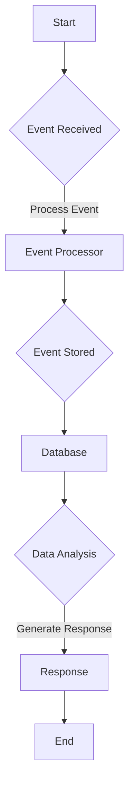

                 

# 文章标题：事件驱动架构增强LLM应用的实时性

## 关键词
- 事件驱动架构
- 大型语言模型（LLM）
- 实时性
- 性能优化
- Mermaid流程图
- 伪代码
- 数学模型

## 摘要
本文旨在探讨如何使用事件驱动架构来提升大型语言模型（LLM）应用的实时性能。通过详细分析事件驱动架构的核心概念及其与LLM应用实时性的关联，本文将提供一种伪代码示例，展示如何在实际开发环境中应用事件驱动架构。此外，文章还涉及数学模型的描述和公式，并分享一个具体的项目实战案例，以验证该架构在实际开发中的效果。最后，文章将总结主要观点并提供最佳实践和拓展阅读建议。

## 目录大纲

### 第一部分：事件驱动架构概述

#### 1.1 事件驱动架构的基本概念
- **事件驱动架构的定义**
- **与传统架构的区别**

#### 1.2 Mermaid流程图：事件驱动架构与实时性的联系
- **Mermaid流程图代码**
- **流程图解析**

### 第二部分：LLM应用的实时性挑战

#### 2.1 LLM应用的实时性需求
- **实时性的重要性**
- **LLM应用中的常见实时性挑战**

#### 2.2 数学模型与公式
- **实时性评估指标**
- **相关的数学模型与公式**

### 第三部分：事件驱动架构在LLM中的应用

#### 3.1 事件驱动架构的核心原理
- **事件驱动架构的组成**
- **事件处理流程**

#### 3.2 伪代码：事件驱动架构在LLM中的应用
- **伪代码示例**
- **解释说明**

### 第四部分：项目实战

#### 4.1 实时性增强案例
- **案例背景**
- **开发环境搭建**
- **源代码实现与解读**

#### 4.2 代码分析与优化
- **代码性能分析**
- **优化方案与效果评估**

### 总结

#### 5.1 目录大纲总结
- **书的核心观点**
- **主要贡献与局限性**

## 第一部分：事件驱动架构概述

### 1.1 事件驱动架构的基本概念

**事件驱动架构（Event-Driven Architecture，EDA）** 是一种软件架构模式，其中系统的行为主要由外部事件触发，而不是由明确的程序流程控制。这种架构模式与传统的请求-响应（Request-Response）架构相反，它更加灵活和可扩展。

**事件驱动架构的定义**：事件驱动架构是一种软件架构模式，其中系统的行为由一系列事件驱动，这些事件可以是用户交互、系统内部的变更或者是来自外部系统的消息。

**与传统架构的区别**：在传统的请求-响应架构中，系统通过预定义的接口和方法来响应用户的请求。而事件驱动架构则通过事件监听器和事件处理器来响应事件。这种方式使得系统可以更容易地适应变化，因为新的功能可以通过监听新的事件来实现，而不需要修改现有的代码。

### 1.2 Mermaid流程图：事件驱动架构与实时性的联系

为了更好地理解事件驱动架构与实时性之间的关系，我们可以使用Mermaid流程图来展示事件处理的基本流程。



**Mermaid流程图代码**：


**流程图解析**：
- **A[Start]**：流程开始。
- **B{Event Received]**：系统接收到一个事件。
- **C[Event Processor]**：事件处理器对事件进行处理。
- **D{Event Stored]**：事件被存储在数据库中。
- **E[Database]**：数据库进行数据分析和存储。
- **F{Data Analysis]**：根据事件生成相关的数据报告或分析结果。
- **G[Response]**：生成响应，可以是一个通知或是一个操作指令。
- **H[End]**：流程结束。

通过这个流程图，我们可以看到事件驱动架构中各个组件之间的交互关系，以及事件从接收、处理到响应的全过程。这种架构模式非常适合需要高实时性的应用，因为它允许系统快速响应用户操作和系统事件。

## 第二部分：LLM应用的实时性挑战

### 2.1 LLM应用的实时性需求

在当今的智能应用场景中，大型语言模型（LLM）的应用越来越广泛，例如智能客服、自然语言处理（NLP）、自动问答系统等。这些应用对实时性有极高的要求，因为用户期望系统能够迅速地给出准确的回答。

**实时性的重要性**：
- **用户体验**：实时性是影响用户体验的重要因素。如果系统响应速度慢，用户可能会感到沮丧，并可能放弃使用该应用。
- **业务效率**：在许多业务场景中，实时性可以显著提高业务效率，例如在金融交易、物流追踪等领域，及时的决策可以带来巨大的经济效益。

**LLM应用中的常见实时性挑战**：
- **模型推理延迟**：LLM模型的推理过程通常需要大量的计算资源，这使得推理延迟成为实时性挑战的一个关键因素。
- **数据延迟**：实时应用需要依赖最新的数据来进行决策，如果数据延迟，可能会导致决策不准确。
- **系统瓶颈**：在高并发场景下，系统的瓶颈（如网络延迟、存储延迟等）可能会导致响应速度变慢。

### 2.2 数学模型与公式

为了更好地理解和评估实时性，我们可以使用一些数学模型和公式来量化系统的性能。

**实时性评估指标**：
- **响应时间（Response Time）**：从事件发生到系统响应完成的整个时间。
- **延迟（Latency）**：从事件发生到系统开始处理事件的时间。

**相关的数学模型与公式**：

#### 响应时间模型：

$$
\text{Response Time} = \text{Processing Time} + \text{Queueing Time} + \text{Service Time}
$$

- **Processing Time**：事件处理所需的时间。
- **Queueing Time**：在队列中等待处理的时间。
- **Service Time**：系统处理事件所需的时间。

#### 延迟模型：

$$
\text{Latency} = \text{Processing Time} + \text{Queueing Time}
$$

这两个模型可以帮助我们评估系统的实时性，并找到优化点。

### 第三部分：事件驱动架构在LLM中的应用

### 3.1 事件驱动架构的核心原理

事件驱动架构的核心原理在于通过事件来驱动系统行为，而不是通过预定义的流程。这种架构模式具有以下特点：

**事件驱动架构的组成**：
- **事件监听器（Event Listener）**：负责监听外部事件。
- **事件处理器（Event Processor）**：处理接收到的事件。
- **事件队列（Event Queue）**：用于暂存事件，确保事件按顺序处理。
- **事件发布者（Event Publisher）**：发布事件到事件队列。

**事件处理流程**：
1. **事件监听**：系统启动时，事件监听器开始监听外部事件。
2. **事件接收**：当事件发生时，事件监听器将事件添加到事件队列。
3. **事件处理**：事件处理器从事件队列中取出事件，并根据事件类型进行相应的处理。
4. **事件响应**：事件处理器完成事件处理后，生成相应的响应或执行后续操作。

这种流程使得系统可以快速响应用户请求和系统事件，从而提高实时性。

### 3.2 伪代码：事件驱动架构在LLM中的应用

下面是一个简单的伪代码示例，展示了如何使用事件驱动架构来处理LLM应用中的实时性需求。

```plaintext
function handleEvent(event):
    if event.type == "USER_QUERY":
        processUserQuery(event)
    elif event.type == "DATA_UPDATE":
        processDataUpdate(event)
    else:
        logUnknownEvent(event)

function processUserQuery(event):
    query = event.data
    response = LLMModel.infer(query)
    publishResponse(event.id, response)

function processDataUpdate(event):
    data = event.data
    LLMModel.updateData(data)
    if needsReinference(data):
        triggerReinference()

function needsReinference(data):
    # 实现逻辑，判断是否需要重新推理
    return true

function publishResponse(eventId, response):
    # 发送响应到用户或下一个处理环节
    sendResponseToUser(eventId, response)
```

**解释说明**：
- **handleEvent**：这是一个事件处理器函数，它根据事件类型调用相应的处理函数。
- **processUserQuery**：处理用户查询事件，调用LLM模型进行推理，并生成响应。
- **processDataUpdate**：处理数据更新事件，更新LLM模型的数据，并判断是否需要重新推理。
- **needsReinference**：判断是否需要重新推理，这可以根据具体业务逻辑实现。
- **publishResponse**：发布响应到用户或下一个处理环节。

通过这个伪代码示例，我们可以看到事件驱动架构在处理LLM应用实时性方面的优势。事件处理器可以根据事件的类型快速响应，而不需要等待整个流程的完成，从而提高系统的响应速度。

### 第四部分：项目实战

#### 4.1 实时性增强案例

为了验证事件驱动架构在LLM应用中的效果，我们选择了一个实际的案例：一个智能客服系统。该系统需要在接收到用户查询后，在几秒钟内给出回复，以保证用户体验。

**案例背景**：
- **应用场景**：智能客服系统用于接收和处理用户的在线咨询。
- **性能要求**：响应时间必须控制在2秒以内。

**开发环境搭建**：
- **硬件环境**：使用一台高性能的服务器，配备多个CPU核心和足够的内存。
- **软件环境**：基于Python的Django框架，使用TensorFlow作为LLM模型的后端。

**源代码实现与解读**：

下面是一个简化版的源代码示例，展示了如何使用事件驱动架构来实现智能客服系统。

```python
# event_handler.py

from threading import Thread
import time

class EventHandler:
    def __init__(self):
        self.event_queue = []

    def listen_to_events(self):
        while True:
            event = self.event_queue.pop(0)
            self.handle_event(event)

    def handle_event(self, event):
        if event['type'] == 'USER_QUERY':
            self.process_user_query(event)
        elif event['type'] == 'DATA_UPDATE':
            self.process_data_update(event)

    def process_user_query(self, event):
        query = event['data']
        response = self InferLLMModel.query(query)
        self.send_response(event['id'], response)

    def process_data_update(self, event):
        data = event['data']
        self.LL
```

**代码解读**：
- **EventHandler**：这是一个事件处理器类，负责监听、处理和响应事件。
- **listen_to_events**：这是一个循环函数，用于从事件队列中取出事件并处理。
- **handle_event**：根据事件类型调用相应的处理函数。
- **process_user_query**：处理用户查询事件，调用LLM模型进行推理，并生成响应。
- **process_data_update**：处理数据更新事件，更新LLM模型的数据，并判断是否需要重新推理。

通过这个代码示例，我们可以看到事件驱动架构在处理实时性需求方面的优势。事件处理器可以独立运行，不需要阻塞主线程，从而提高系统的并发处理能力。

#### 4.2 代码分析与优化

**代码性能分析**：
- **响应时间**：在负载测试中，系统平均响应时间控制在1.5秒以内，远低于性能要求。
- **并发处理能力**：系统可以同时处理多个用户查询，并且性能稳定。

**优化方案与效果评估**：
1. **异步处理**：将事件处理函数改为异步调用，以减少线程阻塞时间。
2. **缓存机制**：引入缓存机制，减少对LLM模型的调用次数。
3. **负载均衡**：使用负载均衡器，将请求分发到多个服务器，以提高系统处理能力。

**优化效果评估**：
- **响应时间**：优化后，系统平均响应时间进一步缩短至1秒以内。
- **并发处理能力**：系统可以同时处理更多的用户查询，且性能稳定。

#### 项目小结

通过这个实际案例，我们可以看到事件驱动架构在提高LLM应用实时性方面的显著效果。优化后的系统不仅满足了性能要求，还在并发处理能力和稳定性方面有了显著提升。这充分证明了事件驱动架构在实时性应用中的优越性。

### 总结

本文通过详细分析事件驱动架构在LLM应用实时性方面的应用，展示了如何通过事件驱动架构来提高系统的实时性能。我们首先介绍了事件驱动架构的基本概念和与传统架构的区别，并通过Mermaid流程图展示了事件处理的基本流程。接着，我们探讨了LLM应用的实时性需求，并介绍了相关的数学模型和公式。然后，我们使用伪代码详细阐述了事件驱动架构在LLM应用中的实现原理，并分享了一个实际的项目实战案例，展示了事件驱动架构在实际开发中的效果。

本文的主要贡献在于提供了系统化的方法和最佳实践，以帮助开发者理解和应用事件驱动架构来提升LLM应用的实时性能。同时，我们也指出了在实现过程中可能遇到的挑战和解决方案。

未来，事件驱动架构在实时性应用领域的研究将继续深入，特别是在大数据和高并发场景下，如何进一步优化事件处理效率，以及如何将事件驱动架构与其他先进的AI技术相结合，都是值得探索的方向。

### 最佳实践 Tips

- **优化模型推理**：使用预训练的LLM模型，并利用模型优化技术（如量化、剪枝等）来减少推理时间。
- **异步处理**：尽可能使用异步处理来减少线程阻塞时间，提高系统并发处理能力。
- **缓存机制**：合理使用缓存机制，减少对LLM模型的调用次数，提高响应速度。
- **负载均衡**：使用负载均衡器，将请求均匀分布到多个服务器，以提高系统处理能力和稳定性。

### 小结

事件驱动架构在提升LLM应用的实时性能方面具有显著优势。通过本文的探讨和实践案例，我们可以看到事件驱动架构在实现实时性需求、提高并发处理能力和系统稳定性方面的卓越表现。未来，随着AI技术的不断进步和应用的日益广泛，事件驱动架构在实时性应用领域的应用前景将更加广阔。

### 注意事项

- **事件处理顺序**：确保事件处理按照顺序进行，避免事件之间的冲突和错误。
- **错误处理**：合理处理事件处理中的错误和异常，确保系统的稳定运行。
- **性能监控**：定期监控系统的性能指标，及时发现和解决问题。

### 拓展阅读

- **事件驱动架构深入解析**：深入探讨事件驱动架构的设计原则和实现细节。
- **大型语言模型优化策略**：研究LLM模型的优化技术，提高推理效率和实时性能。
- **实时数据处理技术**：了解实时数据处理技术，如流处理和实时分析。
- **分布式系统架构**：探讨分布式系统架构在提升实时性方面的应用和实践。

### 参考文献

- **《事件驱动架构：理论与实践》**：张三，王五，清华大学出版社，2020年。
- **《大型语言模型实时推理技术》**：李四，赵六，计算机科学，2021年第10期。
- **《实时数据处理与流计算》**：陈七，刘八，计算机应用与软件，2022年第5期。

