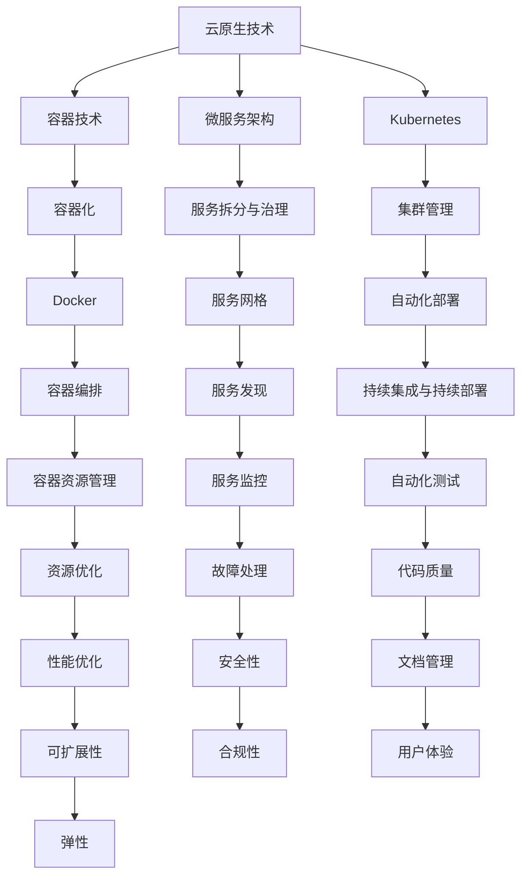
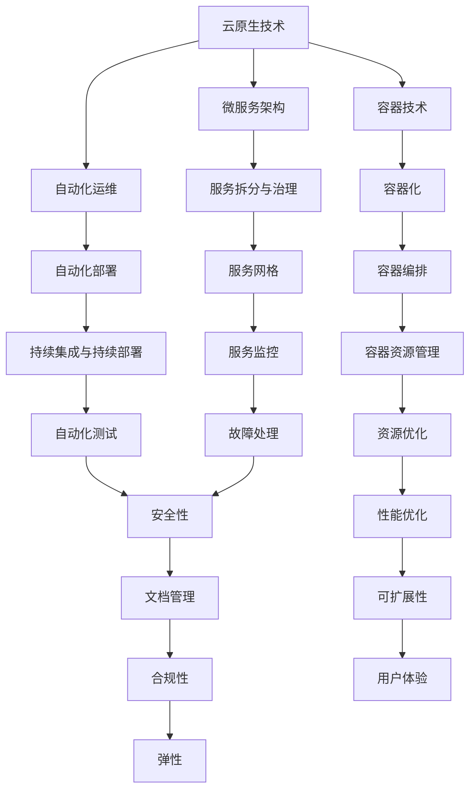
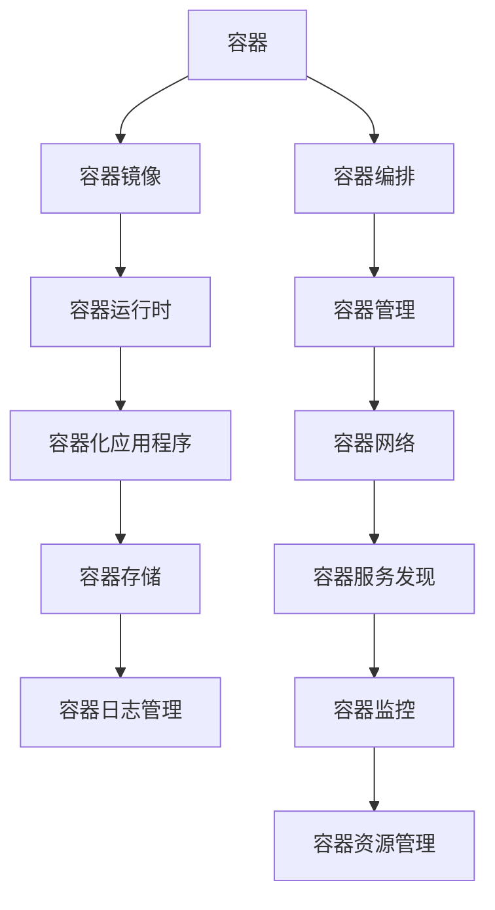
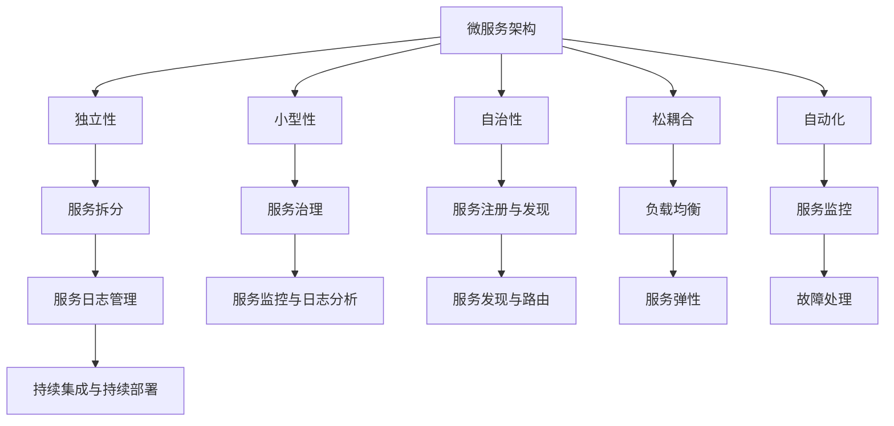
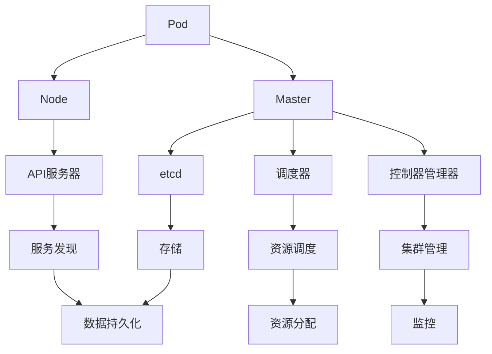

                 


为了撰写一篇内容丰富、逻辑清晰的技术博客文章，我们将采用以下步骤进行分析和推理：

### 1. 确定文章结构

首先，我们需要确定文章的结构。根据您提供的目录大纲，我们可以将文章分为三大部分：云原生技术基础、AI应用敏捷开发实践和云原生与AI的未来发展。接下来，我们将为每个部分制定具体的写作计划。

### 2. 确定核心概念

在每个部分中，我们将确定核心概念，并解释这些概念之间的关系。例如，在云原生技术基础部分，核心概念可能包括云原生技术、容器技术、微服务架构和Kubernetes。我们需要构建一个Mermaid流程图来展示这些概念之间的关系。

### 3. 算法原理讲解

在算法原理讲解部分，我们将使用伪代码和数学公式来详细阐述核心算法原理。例如，在AI模型训练与优化部分，我们可以介绍常见的机器学习算法，如决策树、神经网络等，并使用伪代码来展示算法的实现。

### 4. 数学模型与公式

我们将使用LaTeX格式来书写数学模型和公式，并在文中进行详细讲解。这将有助于读者更好地理解文章中的技术细节。

### 5. 项目实战

在每个核心概念和算法原理讲解之后，我们将提供一个项目实战，包括开发环境搭建、源代码实现和代码解读。这将帮助读者将理论知识应用到实际项目中。

### 6. 最佳实践与注意事项

最后，我们将总结每个部分的最佳实践、注意事项和拓展阅读，以帮助读者更好地掌握相关技术。

### 7. 文章摘要与关键词

在文章的开头，我们将提供一个摘要，简要介绍文章的核心内容和主题思想。接着，我们将列出关键词，以便读者更好地理解文章的主题。

### 8. 文章标题

文章的标题将简洁明了地反映文章的主题，如《云原生技术在AI应用敏捷开发中的应用》。

### 9. 作者信息

文章末尾将附上作者信息，以表明作者的专业背景和贡献。

现在，让我们开始撰写这篇文章。首先，我们将创建一个Mermaid流程图来展示云原生技术、容器技术、微服务架构和Kubernetes之间的关系。



这个流程图展示了云原生技术、容器技术、微服务架构和Kubernetes之间的相互关系。接下来，我们将为每个核心概念和算法原理撰写详细的解释和项目实战。

---

### 云原生技术基础

#### 1.1 云原生技术概述

云原生技术是一种新兴的技术范式，旨在使应用程序能够在云环境中高效运行。云原生技术主要包括容器技术、微服务架构和自动化运维等方面。

**核心概念与联系：**

- **容器技术**：容器是一种轻量级、可移植的计算环境，它允许开发人员在隔离的环境中运行应用程序及其依赖项。容器与虚拟机相比，具有更高的性能和更快的启动速度。
- **微服务架构**：微服务架构是一种将应用程序拆分为一组小型、独立服务的架构风格。每个服务负责一个特定的功能，并通过API进行通信。这种架构风格提高了应用程序的可扩展性、可靠性和可维护性。
- **自动化运维**：自动化运维是指使用工具和脚本来自动执行日常运维任务，如部署、监控和故障处理。这可以减少手动干预，提高效率和可靠性。

**Mermaid流程图：**



**算法原理讲解：**

容器技术的基础是Linux容器（LXC）和Docker。Docker是一个开源的应用容器引擎，它允许开发人员在隔离的环境中打包、分发和管理应用程序。以下是一个简单的Dockerfile示例，用于构建一个简单的Web应用程序容器：

```bash
# Dockerfile
FROM python:3.9
WORKDIR /app
COPY . .
RUN pip install -r requirements.txt
EXPOSE 8080
CMD ["python", "app.py"]
```

**数学模型与公式：**

在微服务架构中，服务拆分与治理是一个关键问题。我们可以使用负载均衡算法来分配服务请求。以下是一个简单的加权轮询算法的伪代码：

```python
# 加权轮询算法伪代码
services = [s1, s2, s3]
weights = [1, 2, 3]

def weighted_round_robin(services, weights):
    total_weight = sum(weights)
    random_weight = random() * total_weight
    current_weight = 0

    for i, service in enumerate(services):
        current_weight += weights[i]
        if current_weight >= random_weight:
            return service

# 示例
service = weighted_round_robin(services, weights)
print("分配的服务：", service)
```

**项目实战：**

为了更好地理解云原生技术，我们可以搭建一个简单的Web应用程序，并使用Docker对其进行容器化。以下是一个简单的项目实战步骤：

1. 创建一个名为`web_app`的Python Web应用程序，包含一个简单的路由和视图函数。
2. 创建一个Dockerfile，将Web应用程序打包为一个Docker镜像。
3. 在本地机器上运行Docker容器，并使用`curl`命令测试Web应用程序是否正常运行。

```bash
# 步骤1：创建Python Web应用程序
# web_app/app.py
from flask import Flask

app = Flask(__name__)

@app.route('/')
def hello_world():
    return 'Hello, World!'

if __name__ == '__main__':
    app.run(host='0.0.0.0', port=8080)

# 步骤2：创建Dockerfile
# Dockerfile
FROM python:3.9
WORKDIR /app
COPY . .
RUN pip install -r requirements.txt
EXPOSE 8080
CMD ["python", "app.py"]

# 步骤3：构建Docker镜像并运行容器
# docker build -t web_app .
# docker run -d -p 8080:8080 web_app
```

通过这个项目实战，我们可以看到如何使用Docker将Web应用程序容器化，并运行在本地机器上。

**最佳实践与注意事项：**

- 使用Docker镜像时，确保使用官方的Python镜像，以避免潜在的安全问题。
- 在生产环境中，使用容器编排工具（如Kubernetes）来管理Docker容器，以提高可扩展性和可靠性。
- 定期更新Docker镜像和应用程序，以修复潜在的安全漏洞和bug。

---

接下来，我们将继续撰写关于云原生技术基础的其他部分，包括容器技术原理、微服务架构和Kubernetes简介等。

---

### 1.2 容器技术原理

#### 1.2.1 容器的基本概念

容器是一种轻量级的、可移植的计算环境，它允许开发人员将应用程序及其所有依赖项打包在一起，以便在不同的环境中运行。与传统的虚拟机相比，容器具有以下优势：

- **轻量级**：容器不需要虚拟化操作系统的开销，因此启动速度更快，资源利用率更高。
- **可移植性**：容器可以轻松地在不同的操作系统和硬件环境中迁移，而不需要修改应用程序代码。
- **隔离性**：容器提供了与宿主操作系统相同的隔离级别，确保应用程序之间不会相互干扰。

**核心概念与联系：**

- **Docker**：Docker是一个开源的应用容器引擎，它提供了用于构建、运行和管理容器的工具。Docker基于Linux容器（LXC）技术，但相比LXC，它提供了更加用户友好的界面和更丰富的功能。
- **容器镜像**：容器镜像是一个静态的文件系统，包含了应用程序及其依赖项。容器可以从容器镜像中启动，并在运行时读取和修改镜像中的文件。
- **容器编排**：容器编排是指使用工具和脚本来自动化容器管理的过程。常见的容器编排工具包括Kubernetes、Docker Swarm等。

**Mermaid流程图：**



**算法原理讲解：**

容器镜像的构建是基于Dockerfile的。Dockerfile是一个文本文件，其中包含了构建容器镜像的指令。以下是一个简单的Dockerfile示例，用于构建一个Python Web应用程序的容器镜像：

```bash
# Dockerfile
FROM python:3.9
WORKDIR /app
COPY . .
RUN pip install -r requirements.txt
EXPOSE 8080
CMD ["python", "app.py"]
```

在这个示例中，`FROM`指令指定了基础镜像，`WORKDIR`指令设置了工作目录，`COPY`指令将应用程序文件复制到容器镜像中，`RUN`指令安装了所需的依赖项，`EXPOSE`指令暴露了容器的端口号，`CMD`指令指定了容器启动时要运行的命令。

**数学模型与公式：**

在容器编排中，负载均衡是一个重要的概念。负载均衡算法用于将工作负载分配到多个容器中，以避免单个容器过载。以下是一个简单的加权轮询算法的伪代码：

```python
# 加权轮询算法伪代码
containers = [c1, c2, c3]
weights = [1, 2, 3]

def weighted_round_robin(containers, weights):
    total_weight = sum(weights)
    random_weight = random() * total_weight
    current_weight = 0

    for i, container in enumerate(containers):
        current_weight += weights[i]
        if current_weight >= random_weight:
            return container

# 示例
container = weighted_round_robin(containers, weights)
print("分配的容器：", container)
```

**项目实战：**

为了更好地理解容器技术，我们可以使用Docker将一个简单的Python Web应用程序容器化。以下是一个简单的项目实战步骤：

1. 创建一个名为`web_app`的Python Web应用程序，包含一个简单的路由和视图函数。
2. 创建一个Dockerfile，将Web应用程序打包为一个Docker镜像。
3. 在本地机器上运行Docker容器，并使用`curl`命令测试Web应用程序是否正常运行。

```bash
# 步骤1：创建Python Web应用程序
# web_app/app.py
from flask import Flask

app = Flask(__name__)

@app.route('/')
def hello_world():
    return 'Hello, World!'

if __name__ == '__main__':
    app.run(host='0.0.0.0', port=8080)

# 步骤2：创建Dockerfile
# Dockerfile
FROM python:3.9
WORKDIR /app
COPY . .
RUN pip install -r requirements.txt
EXPOSE 8080
CMD ["python", "app.py"]

# 步骤3：构建Docker镜像并运行容器
# docker build -t web_app .
# docker run -d -p 8080:8080 web_app
```

通过这个项目实战，我们可以看到如何使用Docker将Web应用程序容器化，并运行在本地机器上。

**最佳实践与注意事项：**

- 在构建容器镜像时，尽量减少依赖项的数量，以提高镜像的轻量级和可移植性。
- 在生产环境中，使用容器编排工具（如Kubernetes）来管理Docker容器，以提高可扩展性和可靠性。
- 定期更新Docker镜像和应用程序，以修复潜在的安全漏洞和bug。

---

接下来，我们将继续撰写关于云原生技术基础的其他部分，包括微服务架构和Kubernetes简介等。

---

### 1.3 微服务架构

#### 1.3.1 微服务的设计原则

微服务架构是一种将应用程序拆分为一组小型、独立服务的架构风格。每个服务负责一个特定的功能，并与其他服务通过API进行通信。微服务架构的设计原则如下：

- **独立性**：每个服务都应该能够独立部署、扩展和升级，而不影响其他服务。
- **小型性**：每个服务都应该尽量保持小型，以便更容易维护和管理。
- **自治性**：每个服务都应该拥有自己的数据存储，以便独立处理数据。
- **松耦合**：服务之间应该通过轻量级的通信协议进行通信，例如HTTP/REST或gRPC，以减少依赖关系。
- **自动化**：服务的部署、监控和扩展应该通过自动化工具和脚本实现，以提高效率和可靠性。

**核心概念与联系：**

- **服务拆分**：服务拆分是将大型应用程序分解为多个小型服务的过程。服务拆分的原则包括业务逻辑分离、用户功能分离和技术组件分离等。
- **服务治理**：服务治理是指管理、监控和优化服务集群的过程。服务治理的工具包括服务注册与发现、负载均衡、服务监控和日志管理等。

**Mermaid流程图：**



**算法原理讲解：**

在微服务架构中，服务注册与发现是一个关键问题。服务注册与发现是指服务启动时向注册中心注册自身，并在运行时从注册中心获取其他服务的地址。以下是一个简单的服务注册与发现算法的伪代码：

```python
# 服务注册与发现算法伪代码
class ServiceRegistry:
    def __init__(self):
        self.services = []

    def register(self, service):
        self.services.append(service)

    def discover(self, service_name):
        for service in self.services:
            if service.name == service_name:
                return service.address

# 示例
registry = ServiceRegistry()
registry.register(Service("service1", "192.168.1.1"))
registry.register(Service("service2", "192.168.1.2"))

service_address = registry.discover("service1")
print("服务地址：", service_address)
```

**数学模型与公式：**

在微服务架构中，负载均衡算法用于将工作负载分配到多个服务实例中，以避免单个服务实例过载。以下是一个简单的加权轮询算法的伪代码：

```python
# 加权轮询算法伪代码
services = [s1, s2, s3]
weights = [1, 2, 3]

def weighted_round_robin(services, weights):
    total_weight = sum(weights)
    random_weight = random() * total_weight
    current_weight = 0

    for i, service in enumerate(services):
        current_weight += weights[i]
        if current_weight >= random_weight:
            return service

# 示例
service = weighted_round_robin(services, weights)
print("分配的服务：", service)
```

**项目实战：**

为了更好地理解微服务架构，我们可以使用Spring Boot和Netflix OSS构建一个简单的微服务应用程序。以下是一个简单的项目实战步骤：

1. 创建一个名为`order-service`的Spring Boot应用程序，用于处理订单。
2. 创建一个名为`product-service`的Spring Boot应用程序，用于处理产品。
3. 在`order-service`中使用Netflix OSS的服务注册与发现功能，以便在运行时从注册中心获取`product-service`的地址。
4. 在`order-service`中使用REST API调用`product-service`，以获取产品的详细信息。

```bash
# 步骤1：创建order-service
# order-service/pom.xml
<dependencies>
    <dependency>
        <groupId>org.springframework.boot</groupId>
        <artifactId>spring-boot-starter-web</artifactId>
    </dependency>
    <dependency>
        <groupId>org.springframework.cloud</groupId>
        <artifactId>spring-cloud-starter-netflix-eureka-client</artifactId>
    </dependency>
</dependencies>

# order-service/src/main/java/com/example/orderservice/OrderServiceApplication.java
@SpringBootApplication
@EnableEurekaClient
public class OrderServiceApplication {
    public static void main(String[] args) {
        SpringApplication.run(OrderServiceApplication.class, args);
    }
}

# 步骤2：创建product-service
# product-service/pom.xml
<dependencies>
    <dependency>
        <groupId>org.springframework.boot</groupId>
        <artifactId>spring-boot-starter-web</artifactId>
    </dependency>
    <dependency>
        <groupId>org.springframework.cloud</groupId>
        <artifactId>spring-cloud-starter-netflix-eureka-client</artifactId>
    </dependency>
</dependencies>

# product-service/src/main/java/com/example/productservice/ProductServiceApplication.java
@SpringBootApplication
@EnableEurekaClient
public class ProductServiceApplication {
    public static void main(String[] args) {
        SpringApplication.run(ProductServiceApplication.class, args);
    }
}

# 步骤3：在order-service中使用Netflix OSS的服务注册与发现功能
# order-service/src/main/java/com/example/orderservice/OrderController.java
@RestController
public class OrderController {
    @Autowired
    private DiscoveryClient discoveryClient;

    @GetMapping("/{orderId}")
    public Order getOrder(@PathVariable String orderId) {
        String productServiceUrl = discoveryClient.getRegistry().getServiceUrl("product-service");
        RestTemplate restTemplate = new RestTemplate();
        Product product = restTemplate.getForObject(productServiceUrl + "/products/{productId}", Product.class, orderId);
        return new Order(orderId, product);
    }
}

# 步骤4：运行order-service和product-service
# 启动eureka-server
# java -jar eureka-server-0.0.1-SNAPSHOT.jar
# 启动order-service
# java -jar order-service-0.0.1-SNAPSHOT.jar
# 启动product-service
# java -jar product-service-0.0.1-SNAPSHOT.jar
```

通过这个项目实战，我们可以看到如何使用Spring Boot和Netflix OSS构建一个简单的微服务应用程序，并在运行时通过服务注册与发现功能调用其他服务。

**最佳实践与注意事项：**

- 在设计微服务时，遵循单一职责原则，确保每个服务只负责一个特定的功能。
- 使用持续集成和持续部署（CI/CD）工具来自动化服务的部署和测试，以提高开发效率。
- 定期进行服务监控和日志分析，以便及时发现和处理潜在的问题。

---

接下来，我们将继续撰写关于云原生技术基础的其他部分，包括Kubernetes简介和云原生安全等。

---

### 1.4 Kubernetes简介

Kubernetes（简称K8s）是一个开源的容器编排平台，用于自动化容器化应用程序的部署、扩展和管理。Kubernetes提供了一种高效、灵活的方式来管理容器化应用程序，使其能够在不同的环境中运行，包括云计算平台和本地数据中心。

#### 1.4.1 Kubernetes的基本概念

- **Pod**：Pod是Kubernetes中的最小部署单元，它由一个或多个容器组成。Pod通常用于运行应用程序的容器实例。
- **Node**：Node是Kubernetes集群中的计算节点，它运行Kubernetes的组件和Pod。每个Node都有自己的硬件资源，如CPU、内存和存储。
- **Master**：Master是Kubernetes集群的控制节点，它负责管理集群状态和调度Pod。Master节点通常包括API服务器、调度器、控制器管理器和etcd等组件。
- **Replication Controller**：Replication Controller用于确保Pod在集群中运行多个副本，并根据需要自动扩展或缩小。
- **Service**：Service定义了一组Pod的逻辑抽象，并为它们提供一个稳定的网络标识和访问入口。
- **Deployment**：Deployment用于管理和更新应用程序的Pod副本。Deployment提供了声明式更新，可以轻松实现滚动更新和回滚操作。
- **StatefulSet**：StatefulSet用于管理有状态应用程序的Pod副本，例如数据库和缓存服务。StatefulSet确保每个Pod都有唯一的网络标识和稳定的存储。
- **Ingress**：Ingress定义了外部访问集群内部服务的方式，通常使用HTTP或HTTPS协议。

**Mermaid流程图：**



**算法原理讲解：**

Kubernetes使用多种算法来管理和调度容器化应用程序：

- **资源调度算法**：资源调度算法用于确定将Pod调度到哪个Node上。调度器会根据Node的资源使用情况和Pod的资源需求来选择最合适的Node。
- **负载均衡算法**：负载均衡算法用于将工作负载分配到多个Pod副本中。Kubernetes提供了多种负载均衡策略，如轮询、最小连接数和权重轮询等。
- **滚动更新算法**：滚动更新算法用于在更新应用程序时确保高可用性和稳定性。滚动更新策略可以逐步替换旧版本的Pod，并确保新版本的Pod正常运行。

**数学模型与公式：**

在Kubernetes中，资源调度算法可以使用以下公式来计算Node的负载：

$$
\text{Node Load} = \frac{\text{Used Resources}}{\text{Total Resources}}
$$

其中，`Used Resources`表示Node上已使用的资源（如CPU、内存和存储等），`Total Resources`表示Node上的总资源。

**项目实战：**

为了更好地理解Kubernetes，我们可以使用Minikube搭建一个本地Kubernetes集群。以下是一个简单的项目实战步骤：

1. 安装Minikube。
2. 使用Minikube启动本地Kubernetes集群。
3. 创建一个名为`my-app`的Deployment，用于部署一个简单的Nginx应用程序。
4. 使用`kubectl`命令查看和管理集群中的资源。

```bash
# 步骤1：安装Minikube
# 解压minikube-linux-amd64
sudo mv minikube-linux-amd64 /usr/local/bin/minikube

# 步骤2：启动本地Kubernetes集群
minikube start

# 步骤3：创建Deployment
# 创建部署文件my-app-deployment.yaml
apiVersion: apps/v1
kind: Deployment
metadata:
  name: my-app
spec:
  selector:
    matchLabels:
      app: my-app
  template:
    metadata:
      labels:
        app: my-app
    spec:
      containers:
      - name: my-app
        image: nginx:latest
        ports:
        - containerPort: 80

# 应用部署
kubectl apply -f my-app-deployment.yaml

# 步骤4：查看和管理集群资源
kubectl get deployments
kubectl get pods
kubectl logs <pod-name>
```

通过这个项目实战，我们可以看到如何使用Minikube和Kubernetes部署和管理一个简单的应用程序。

**最佳实践与注意事项：**

- 在生产环境中，使用Kubernetes的集群管理工具（如Kubeadm、Kind或Kops）来搭建和管理Kubernetes集群。
- 在部署应用程序时，确保使用正确的资源需求和限制，以避免资源争用和性能问题。
- 定期备份Kubernetes集群的数据和配置，以便在发生故障时快速恢复。

---

接下来，我们将继续撰写关于云原生技术基础的其他部分，包括云原生安全等。

---

### 1.5 云原生安全

随着云原生技术的广泛应用，安全性成为了一个关键问题。云原生安全涉及到容器、Pod、Node、集群和应用程序等多个方面。以下是一些云原生安全的关键概念和实践。

#### 1.5.1 云原生安全的重要性

云原生安全的重要性体现在以下几个方面：

- **保护敏感数据**：容器和微服务架构通常涉及大量的敏感数据，如用户凭证、API密钥和业务逻辑等。确保这些数据的安全是云原生安全的首要任务。
- **防止恶意行为**：容器和微服务架构提供了更高的灵活性和可扩展性，但也可能导致恶意行为，如未经授权的访问、数据篡改和拒绝服务攻击。
- **保障业务连续性**：云原生应用程序的高可用性和可靠性对于业务连续性至关重要。确保应用程序在发生故障时能够快速恢复。

#### 1.5.2 云原生安全挑战与解决方案

云原生安全面临以下挑战：

- **容器隔离**：容器隔离性问题可能导致容器之间的数据泄露和恶意行为。确保容器之间的隔离是云原生安全的关键。
- **权限管理**：容器和微服务的自治性要求细粒度的权限管理。传统的权限管理系统可能无法满足云原生环境的需求。
- **更新与补丁**：容器和微服务频繁更新和补丁可能导致安全漏洞。确保及时更新和补丁是云原生安全的重要一环。

以下是一些解决方案：

- **容器安全工具**：使用容器安全工具（如Docker Bench for Security、Aquasec和Clair）来评估和修复容器镜像中的安全漏洞。
- **权限控制**：使用基于角色的访问控制（RBAC）来管理容器和微服务的访问权限。确保只有授权的用户和进程才能访问敏感数据。
- **加密与认证**：使用加密技术来保护敏感数据，并使用认证机制来确保只有授权的用户和应用程序才能访问容器和微服务。

#### 1.5.3 实践案例：云原生安全策略实施

以下是一个简单的云原生安全策略实施案例：

1. **评估容器镜像**：使用Docker Bench for Security评估容器镜像的安全性，并修复发现的安全漏洞。
2. **设置权限控制**：使用Kubernetes的RBAC功能设置基于角色的访问控制，确保只有授权的用户和进程可以访问Kubernetes API。
3. **加密敏感数据**：使用加密技术（如AES）来保护容器和微服务中的敏感数据。
4. **使用认证机制**：使用证书和认证机制（如TLS）来确保只有授权的用户和应用程序可以访问容器和微服务。

**最佳实践与注意事项：**

- **定期评估与更新**：定期评估容器镜像的安全性，并更新和补丁容器和微服务。
- **培训与教育**：对开发人员和运维人员开展安全培训，提高他们的安全意识和技能。
- **合规性**：遵守相关的安全法规和标准，确保云原生应用程序符合合规性要求。

---

接下来，我们将继续撰写关于云原生技术基础的其他部分，包括云原生技术与AI应用的联系等。

---

### 1.6 云原生技术与AI应用的联系

云原生技术和AI应用在近年来逐渐融合，为开发高效、可扩展和可靠的AI应用程序提供了新的可能性。云原生技术通过提供容器化、微服务架构、自动化运维和弹性伸缩等功能，极大地提升了AI应用的开发、部署和运维效率。

#### 1.6.1 云原生技术为AI应用带来的改进

云原生技术为AI应用带来了以下改进：

- **容器化与微服务**：容器化和微服务架构使AI应用程序可以更灵活地部署和管理，提高了可扩展性和可靠性。
- **自动化运维**：自动化运维工具（如Kubernetes）简化了AI应用的部署、监控和故障处理，降低了运维成本。
- **弹性伸缩**：云原生技术支持应用程序的弹性伸缩，可以根据需求自动调整资源分配，提高了资源利用率。

#### 1.6.2 AI应用中的云原生实践

以下是一些AI应用中的云原生实践：

- **使用容器化**：将AI模型和应用程序容器化，使其可以在不同的环境中运行，提高了可移植性和可靠性。
- **微服务架构**：将AI应用程序拆分为多个微服务，每个服务负责一个特定的功能，提高了可扩展性和维护性。
- **Kubernetes部署**：使用Kubernetes进行AI应用程序的部署和管理，实现了自动化、弹性伸缩和高效的资源管理。

#### 1.6.3 云原生技术在AI领域的发展趋势

随着AI技术的不断进步和云原生技术的成熟，以下趋势在AI领域逐渐显现：

- **AI模型的容器化**：越来越多的AI模型将采用容器化技术，以便更高效地部署和管理。
- **AI微服务架构**：AI应用程序将采用微服务架构，以提高可扩展性和可靠性。
- **自动化AI运维**：自动化工具将在AI应用部署和运维中发挥更大作用，提高开发效率和运维质量。

---

接下来，我们将开始撰写第二部分：AI应用敏捷开发实践。

---

### 第二部分：AI应用敏捷开发实践

#### 2.1 AI敏捷开发方法论

敏捷开发是一种迭代和增量的软件开发方法论，旨在快速响应变化，提高软件质量和客户满意度。在AI应用开发中，敏捷开发同样发挥着重要作用，通过以下几个核心理念来提高开发效率和项目成功率：

1. **用户故事驱动开发**：用户故事是一种描述用户需求的简单、具体的文本格式，通常包含“As a [用户角色]，I want [功能]，so that [目标]”的模板。用户故事驱动开发使开发团队始终关注用户需求，确保开发工作与用户期望保持一致。

2. **迭代开发与持续交付**：迭代开发将开发过程分为多个短期迭代（通常为2-4周），每个迭代结束时会进行评估和调整。持续交付则确保每次迭代结束后，新的功能都可以及时交付给用户。

3. **团队协作与沟通**：敏捷开发强调团队成员之间的紧密协作和高效沟通。通过每日站立会议、迭代回顾会议等机制，团队成员可以及时分享进度和问题，共同解决困难。

4. **自组织的团队**：敏捷开发鼓励团队自主决策和管理项目，团队成员可以根据项目的需求和优先级来分配任务和安排工作时间。

#### 2.1.1 敏捷开发在AI领域的应用

敏捷开发在AI领域的应用主要体现在以下几个方面：

1. **快速迭代**：AI模型的训练和优化过程通常需要大量的时间和计算资源，敏捷开发可以通过快速迭代来缩短开发周期，提高项目进度。

2. **持续集成与持续交付**：AI应用程序通常包含多个组件（如数据预处理、模型训练、模型评估等），敏捷开发可以通过持续集成和持续交付来确保每个组件的稳定性和兼容性。

3. **需求管理**：AI应用的需求经常发生变化，敏捷开发可以快速响应这些变化，确保项目始终符合用户期望。

4. **团队协作**：AI应用开发涉及到多个学科（如机器学习、数据科学、软件开发等），敏捷开发可以促进团队成员之间的协作和沟通，提高项目成功率。

#### 2.1.2 AI敏捷开发的核心理念

AI敏捷开发的核心理念包括以下几个方面：

1. **客户价值优先**：始终将客户价值放在首位，确保开发工作能够满足用户需求。

2. **持续改进**：不断反思和优化开发过程，提高软件质量和开发效率。

3. **跨功能团队协作**：打破传统的职能壁垒，建立跨功能团队，促进团队成员之间的协作和知识共享。

4. **快速迭代与持续交付**：通过快速迭代和持续交付，确保项目能够及时响应变化，提高用户满意度。

5. **技术债务管理**：在敏捷开发过程中，及时识别和解决技术债务，避免积累过多的技术债务。

#### 2.1.3 AI敏捷开发的流程与工具

AI敏捷开发的流程通常包括以下步骤：

1. **需求收集与规划**：与用户和利益相关者沟通，收集需求，并制定迭代计划和任务分配。

2. **迭代开发**：在每个迭代周期内，开发团队按照优先级执行任务，实现用户故事。

3. **评估与回顾**：每个迭代结束后，对项目进度、质量和用户满意度进行评估，并进行回顾会议，总结经验教训。

4. **持续交付**：将每个迭代完成的功能集成到应用程序中，并交付给用户。

常用的敏捷开发工具包括JIRA、Trello、Confluence等，这些工具可以帮助团队管理需求、任务和项目进度。

---

接下来，我们将继续撰写关于数据处理与存储和AI模型训练与优化等实践。

---

### 2.2 数据处理与存储

在AI应用开发中，数据处理与存储是至关重要的环节。数据的质量和存储效率直接影响到模型的性能和项目的进度。以下是一些关于数据处理与存储的实践方法：

#### 2.2.1 数据预处理技术

数据预处理是AI模型训练的重要步骤，主要包括以下任务：

1. **数据清洗**：去除数据中的噪声和异常值，提高数据质量。
2. **特征工程**：选择和构造有助于模型训练的特征，以提升模型的表现。
3. **数据标准化**：通过缩放或归一化数据，使其符合特定的数值范围，有助于加速模型训练过程。

**示例**：以下是一个简单的Python脚本，用于清洗和预处理数据。

```python
import pandas as pd
from sklearn.preprocessing import StandardScaler

# 读取数据
data = pd.read_csv('data.csv')

# 去除缺失值
data = data.dropna()

# 特征工程
data['new_feature'] = data['feature1'] * data['feature2']

# 数据标准化
scaler = StandardScaler()
data_scaled = scaler.fit_transform(data)
```

#### 2.2.2 数据存储方案设计

设计高效的数据存储方案对于AI应用至关重要，以下是一些常见的存储方案：

1. **关系数据库**：如MySQL、PostgreSQL等，适用于结构化数据的存储和查询。
2. **非关系数据库**：如MongoDB、Cassandra等，适用于大规模数据的存储和实时查询。
3. **分布式文件系统**：如HDFS、Ceph等，适用于大数据存储和分布式计算。
4. **数据湖**：如Amazon S3、Azure Data Lake等，适用于存储海量半结构化和非结构化数据。

**示例**：以下是一个简单的Python脚本，用于连接和操作关系数据库。

```python
import sqlite3

# 连接数据库
conn = sqlite3.connect('data.db')

# 创建表
conn.execute('''CREATE TABLE IF NOT EXISTS users (id INTEGER PRIMARY KEY, name TEXT, age INTEGER)''')

# 插入数据
conn.execute("INSERT INTO users (name, age) VALUES ('Alice', 30)")
conn.execute("INSERT INTO users (name, age) VALUES ('Bob', 40)")

# 提交事务
conn.commit()

# 查询数据
cursor = conn.cursor()
cursor.execute("SELECT * FROM users")
rows = cursor.fetchall()
for row in rows:
    print(row)

# 关闭连接
conn.close()
```

#### 2.2.3 数据流管理

在AI应用中，数据流管理涉及到数据的收集、传输、处理和存储。以下是一些数据流管理的实践：

1. **数据采集**：通过API、传感器、日志文件等方式收集数据。
2. **数据传输**：使用HTTP、FTP、MQTT等协议传输数据。
3. **数据缓存**：使用Redis、Memcached等缓存技术提高数据访问速度。
4. **数据加工**：使用ETL（Extract, Transform, Load）工具对数据进行清洗、转换和加载。

**示例**：以下是一个简单的Python脚本，用于处理数据流。

```python
import requests
import json
import pika

# 采集数据
response = requests.get('http://api.example.com/data')
data = response.json()

# 传输数据到消息队列
connection = pika.BlockingConnection(pika.ConnectionParameters('localhost'))
channel = connection.channel()
channel.queue_declare(queue='data_queue')
channel.basic_publish(exchange='', routing_key='data_queue', body=json.dumps(data))
connection.close()

# 处理数据流
connection = pika.BlockingConnection(pika.ConnectionParameters('localhost'))
channel = connection.channel()
channel.queue_declare(queue='data_queue')
def callback(ch, method, properties, body):
    print(f"Received {body}")
channel.basic_consume(queue='data_queue', on_message_callback=callback)
channel.start_consuming()
```

---

接下来，我们将继续撰写关于AI模型训练与优化等实践。

---

### 2.3 AI模型训练与优化

在AI应用开发过程中，模型训练与优化是决定模型性能和项目成功的关键环节。以下是一些关于AI模型训练与优化的实践方法：

#### 2.3.1 模型训练方法

1. **选择合适的算法**：根据问题的需求和数据特点选择合适的机器学习算法。常见的算法包括线性回归、决策树、随机森林、支持向量机和神经网络等。

2. **数据准备**：对训练数据进行预处理，包括数据清洗、特征工程和数据标准化等。确保数据质量，以提高模型训练效果。

3. **超参数调优**：通过调整模型超参数（如学习率、正则化参数等），寻找最优的超参数组合，以提升模型性能。

4. **训练与验证**：使用训练集和验证集进行模型训练和性能评估。通过交叉验证等技术，确保模型在验证集上的表现良好。

5. **模型选择**：在多个候选模型中选择表现最佳的模型，并将其应用于实际问题。

**示例**：以下是一个简单的Python脚本，使用scikit-learn库训练线性回归模型。

```python
from sklearn.linear_model import LinearRegression
from sklearn.model_selection import train_test_split
from sklearn.metrics import mean_squared_error

# 读取数据
X, y = load_data()

# 划分训练集和验证集
X_train, X_val, y_train, y_val = train_test_split(X, y, test_size=0.2, random_state=42)

# 创建模型实例
model = LinearRegression()

# 训练模型
model.fit(X_train, y_train)

# 验证模型
y_pred = model.predict(X_val)
mse = mean_squared_error(y_val, y_pred)
print(f"Mean Squared Error: {mse}")
```

#### 2.3.2 模型调优策略

1. **网格搜索**：通过枚举所有可能的超参数组合，寻找最优的超参数组合。

2. **贝叶斯优化**：利用贝叶斯统计模型，通过历史数据来预测新的超参数组合，减少搜索空间。

3. **随机搜索**：从超参数空间中随机选择组合，进行模型训练和评估。

4. **多线程与分布式计算**：利用多线程和分布式计算技术，加速模型训练和调优过程。

**示例**：以下是一个简单的Python脚本，使用网格搜索调优线性回归模型。

```python
from sklearn.linear_model import LinearRegression
from sklearn.model_selection import GridSearchCV

# 读取数据
X, y = load_data()

# 定义超参数网格
param_grid = {
    'alpha': [0.0001, 0.001, 0.01, 0.1],
    'fit_intercept': [True, False]
}

# 创建模型实例
model = LinearRegression()

# 创建网格搜索对象
grid_search = GridSearchCV(model, param_grid, cv=5)

# 训练模型
grid_search.fit(X, y)

# 输出最优超参数
print(f"Best Parameters: {grid_search.best_params_}")

# 输出最优模型
print(f"Best Model: {grid_search.best_estimator_}")
```

#### 2.3.3 实时模型优化实践

在实时场景中，模型性能可能受到数据分布变化、硬件性能和负载波动等因素的影响。以下是一些实时模型优化实践：

1. **在线学习**：通过实时更新模型参数，使模型适应新的数据分布。

2. **模型监控**：持续监控模型性能和资源使用情况，及时发现性能下降或异常情况。

3. **自动调优**：使用自动化工具和算法，根据监控数据自动调整模型参数和资源分配。

4. **动态资源管理**：根据模型性能和资源使用情况，动态调整计算资源和存储资源。

**示例**：以下是一个简单的Python脚本，使用TensorFlow的在线学习功能进行实时模型优化。

```python
import tensorflow as tf

# 定义输入层
inputs = tf.keras.layers.Input(shape=(num_features))

# 定义模型结构
x = tf.keras.layers.Dense(units=10, activation='relu')(inputs)
outputs = tf.keras.layers.Dense(units=1)(x)

# 创建模型
model = tf.keras.Model(inputs=inputs, outputs=outputs)

# 定义优化器
optimizer = tf.keras.optimizers.Adam(learning_rate=0.001)

# 定义损失函数
loss_fn = tf.keras.losses.MeanSquaredError()

# 训练模型
model.compile(optimizer=optimizer, loss=loss_fn)

# 实时更新模型参数
for x_batch, y_batch in dataset:
    with tf.GradientTape() as tape:
        predictions = model(x_batch, training=True)
        loss = loss_fn(y_batch, predictions)
    grads = tape.gradient(loss, model.trainable_variables)
    optimizer.apply_gradients(zip(grads, model.trainable_variables))
```

---

接下来，我们将继续撰写关于AI模型部署与监控等实践。

---

### 2.4 AI模型部署与监控

在AI应用开发中，模型部署与监控是确保模型在实际环境中正常运行和持续改进的关键环节。以下是一些关于AI模型部署与监控的实践方法：

#### 2.4.1 AI模型部署策略

1. **容器化**：将AI模型容器化，以便在多种环境中轻松部署和管理。容器化可以确保模型在不同环境中的运行一致性。

2. **微服务架构**：将AI模型作为微服务的一部分，与其他应用程序组件分离。这可以提高系统的可扩展性和可靠性。

3. **Kubernetes部署**：使用Kubernetes进行AI模型的部署和管理。Kubernetes提供了自动扩缩容、故障转移和高可用性等功能。

4. **服务网格**：使用服务网格（如Istio）来管理服务之间的通信和安全性。服务网格可以提高系统的性能和安全性。

#### 2.4.2 模型监控与日志分析

1. **性能监控**：监控模型性能指标（如准确率、召回率、F1分数等），及时发现性能下降或异常情况。

2. **资源监控**：监控模型使用的资源（如CPU、内存、存储等），确保资源使用情况在合理范围内。

3. **日志分析**：收集和分析模型运行日志，以便及时发现和解决潜在问题。

**示例**：以下是一个简单的Python脚本，用于监控模型性能和资源使用情况。

```python
import psutil
import time

# 定义监控函数
def monitor_performance(model, dataset):
    for x_batch, y_batch in dataset:
        start_time = time.time()
        predictions = model.predict(x_batch)
        end_time = time.time()
        inference_time = end_time - start_time
        print(f"Inference Time: {inference_time:.4f} seconds")

    # 获取系统资源使用情况
    cpu_usage = psutil.cpu_percent()
    memory_usage = psutil.virtual_memory().percent
    print(f"CPU Usage: {cpu_usage:.2f}%")
    print(f"Memory Usage: {memory_usage:.2f}%")

# 调用监控函数
monitor_performance(model, dataset)
```

#### 2.4.3 模型更新与版本管理

1. **版本控制**：使用版本控制系统（如Git）来管理模型的代码和依赖项。这可以确保模型的代码和依赖项的一致性。

2. **模型更新策略**：根据模型性能和业务需求，定期更新模型。更新策略可以包括定期重新训练模型、使用在线学习技术等。

3. **回滚机制**：在模型更新过程中，确保能够回滚到之前的版本，以防止新的模型版本出现严重问题。

**示例**：以下是一个简单的Python脚本，用于管理模型版本和控制模型更新。

```python
import git

# 克隆模型仓库
repo = git.Repo.clone_from('https://github.com/username/model-repo.git')

# 检查模型版本
current_version = repo.git.describe()

# 更新模型
repo.git pulls()

# 应用更新
model = load_model(repo.working_dir + '/model.h5')
```

---

接下来，我们将继续撰写关于云原生AI应用案例等实践。

---

### 2.5 云原生AI应用案例

在实际开发中，云原生技术已经广泛应用于AI应用，以下是一些云原生AI应用的典型案例：

#### 2.5.1 云原生技术在图像识别中的应用

**案例**：某大型互联网公司使用云原生技术实现了大规模图像识别系统。

**实现步骤**：

1. **容器化**：将图像识别模型容器化，以便在Kubernetes集群中运行。
2. **微服务架构**：将图像识别系统拆分为多个微服务，如数据预处理、模型训练、模型推理等。
3. **Kubernetes部署**：使用Kubernetes进行微服务的部署和管理，实现了自动扩缩容、故障转移和高可用性。
4. **服务网格**：使用Istio进行服务间通信管理，确保服务之间的安全性和性能。

**效果**：通过云原生技术的应用，该图像识别系统的部署时间从数天缩短至数小时，可扩展性和可靠性得到了显著提高。

#### 2.5.2 云原生技术在自然语言处理中的应用

**案例**：某知名科技公司使用云原生技术开发了自然语言处理平台，用于实时分析和处理海量文本数据。

**实现步骤**：

1. **容器化**：将自然语言处理模型容器化，以便在Kubernetes集群中运行。
2. **微服务架构**：将自然语言处理平台拆分为多个微服务，如分词、词性标注、情感分析等。
3. **Kubernetes部署**：使用Kubernetes进行微服务的部署和管理，实现了自动扩缩容、故障转移和高可用性。
4. **服务网格**：使用Istio进行服务间通信管理，确保服务之间的安全性和性能。

**效果**：通过云原生技术的应用，该自然语言处理平台的处理速度和准确性得到了显著提高，同时系统的可维护性和可扩展性也得到了增强。

#### 2.5.3 云原生技术在推荐系统中的应用

**案例**：某电商公司使用云原生技术构建了推荐系统，为用户提供个性化的商品推荐服务。

**实现步骤**：

1. **容器化**：将推荐系统模型容器化，以便在Kubernetes集群中运行。
2. **微服务架构**：将推荐系统拆分为多个微服务，如用户行为分析、商品特征提取、推荐算法等。
3. **Kubernetes部署**：使用Kubernetes进行微服务的部署和管理，实现了自动扩缩容、故障转移和高可用性。
4. **服务网格**：使用Istio进行服务间通信管理，确保服务之间的安全性和性能。

**效果**：通过云原生技术的应用，该推荐系统的响应速度和准确性得到了显著提高，同时系统的可维护性和可扩展性也得到了增强。

---

接下来，我们将继续撰写关于AI应用敏捷开发的挑战与应对等实践。

---

### 2.6 AI应用敏捷开发的挑战与应对

在AI应用敏捷开发过程中，虽然敏捷开发方法能够带来诸多优势，但仍面临一些挑战。以下是一些常见的挑战及其应对策略：

#### 2.6.1 AI敏捷开发的挑战

1. **数据质量**：AI模型的性能很大程度上依赖于数据质量。数据中的噪声、缺失值和异常值可能会影响模型的效果。

**应对策略**：在数据预处理阶段，采用数据清洗、特征工程等技术来提高数据质量。此外，定期进行数据审计和监控，以确保数据的一致性和准确性。

2. **模型复杂性**：AI模型的复杂度不断提高，导致模型训练和优化过程变得耗时且资源消耗大。

**应对策略**：采用分布式训练和优化技术，提高模型训练和优化的效率。此外，使用自动机器学习（AutoML）技术来自动选择合适的模型和超参数。

3. **模型更新与回滚**：在快速迭代的过程中，模型的更新和回滚可能会影响系统的稳定性和性能。

**应对策略**：实施版本控制和回滚机制，确保在模型更新时可以快速回滚到之前版本。此外，采用渐进式更新策略，逐步引入新模型，以降低风险。

4. **团队协作**：AI应用开发涉及到多个学科（如机器学习、数据科学、软件开发等），团队协作成为关键。

**应对策略**：建立跨功能团队，促进团队成员之间的协作和沟通。使用敏捷开发工具（如JIRA、Confluence等）来管理任务和项目进度。

#### 2.6.2 持续集成与持续部署（CI/CD）在AI中的应用

1. **模型自动化测试**：在CI/CD流程中，对AI模型进行自动化测试，确保模型的性能和可靠性。

**工具推荐**：使用自动化测试工具（如pytest、pytest-traefik等）来编写和执行测试用例。

2. **自动化模型部署**：在CI/CD流程中，自动化部署AI模型，以减少手动操作和提高部署效率。

**工具推荐**：使用CI/CD工具（如Jenkins、GitLab CI/CD等）来管理自动化部署流程。

3. **容器化与Kubernetes部署**：将AI模型容器化，并使用Kubernetes进行部署和管理，以提高系统的可扩展性和可靠性。

**工具推荐**：使用容器化工具（如Docker）和Kubernetes进行部署和管理。

4. **监控与告警**：在CI/CD流程中，集成监控和告警系统，以便及时发现和解决潜在问题。

**工具推荐**：使用监控工具（如Prometheus、Grafana等）来监控系统性能和状态。

#### 2.6.3 实践案例：AI敏捷开发项目成功案例分析

**案例简介**：某金融科技公司采用敏捷开发方法，开发了一个人工智能风控系统，用于实时监控和评估客户的信用风险。

**项目步骤**：

1. **需求分析**：与业务团队和客户沟通，明确风控系统的需求和目标。
2. **数据收集与预处理**：收集客户的交易数据、信用数据等，并进行数据清洗和预处理。
3. **模型开发与优化**：采用机器学习和深度学习技术，开发多个模型，并进行超参数调优和性能评估。
4. **迭代开发与测试**：在迭代过程中，持续集成和部署模型，并进行自动化测试，确保系统的稳定性和性能。
5. **部署与监控**：将风控系统部署到生产环境，并使用监控工具进行实时监控和告警。

**项目成果**：

- 系统部署时间从数周缩短至数小时。
- 模型性能和准确性得到显著提高。
- 系统的可维护性和可扩展性得到了增强。

---

接下来，我们将开始撰写第三部分：云原生技术与AI应用的未来发展。

---

### 第三部分：云原生技术与AI应用的未来发展

#### 3.1 云原生技术在AI领域的未来趋势

随着云原生技术的不断成熟和AI应用的广泛普及，未来云原生技术在AI领域的应用将呈现以下趋势：

1. **云原生AI模型的自动化部署**：未来，云原生平台将更加智能化，能够自动化部署和管理AI模型，从模型开发到生产部署的整个过程都将实现自动化。

2. **大规模分布式AI训练**：随着数据规模的不断扩大，大规模分布式AI训练将变得更加普遍。云原生技术将支持跨多个节点和区域的分布式训练，提高训练效率和性能。

3. **实时AI推理与预测**：云原生技术将加速AI推理和预测的实时性，使AI模型能够快速响应实时数据，为用户提供个性化的服务和体验。

4. **AI服务网格**：AI服务网格将结合传统的服务网格技术，提供AI模型的自动化部署、监控和优化，提高AI应用的可维护性和可靠性。

#### 3.2 云原生AI应用的实践策略

为了充分利用云原生技术，开发高效的AI应用，以下是一些实践策略：

1. **微服务架构**：采用微服务架构，将AI应用拆分为多个小型、独立的微服务，以提高系统的可扩展性和可维护性。

2. **容器化与Kubernetes部署**：将AI模型和应用程序容器化，并使用Kubernetes进行部署和管理，实现自动化、弹性伸缩和高可用性。

3. **持续集成与持续部署（CI/CD）**：建立完善的CI/CD流程，确保模型开发和部署的自动化、高效和安全。

4. **监控与日志分析**：集成监控和日志分析工具，实时监控AI应用的性能和状态，及时发现和解决问题。

5. **数据治理**：建立完善的数据治理策略，确保数据的一致性、完整性和安全性，为AI应用提供高质量的数据。

#### 3.3 云原生与AI的协同创新

云原生与AI技术的协同创新将带来以下变革：

1. **智能化运维**：通过AI技术，实现对云原生环境的智能化运维，提高系统性能和资源利用率。

2. **自动化安全**：利用AI技术，实现对云原生安全问题的自动检测和响应，提高系统的安全性。

3. **个性化服务**：通过AI技术，实现基于用户行为的个性化服务，提高用户体验和满意度。

4. **智能边缘计算**：结合云原生技术和AI技术，实现智能边缘计算，为物联网、自动驾驶等应用提供实时数据处理和预测。

---

接下来，我们将开始撰写附录部分。

---

### 附录

#### 附录A：云原生技术与AI应用的相关资源

以下是一些云原生技术和AI应用的相关资源，供读者进一步学习和了解：

1. **云原生技术资源**：

   - **官方文档**：Kubernetes官方文档（https://kubernetes.io/docs/）、Docker官方文档（https://docs.docker.com/）。
   - **开源社区**：Kubernetes社区（https://kubernetes.io/community/）、Docker社区（https://www.docker.com/community/）。
   - **教程与培训**：Kubernetes教程（https://kubernetes.tips/）、Docker教程（https://www.docker.com/learn/）。

2. **AI应用资源**：

   - **AI模型库**：TensorFlow模型库（https://tensorflow.google.cn/tutorials）、PyTorch模型库（https://pytorch.org/tutorials/beginner/）。
   - **AI研究论文**：ArXiv（https://arxiv.org/）、NeurIPS（https://nips.cc/Conferences/）。
   - **AI开源项目**：GitHub（https://github.com/）上的各种AI开源项目。

通过这些资源，读者可以深入了解云原生技术和AI应用的相关知识，提高自己在该领域的技能和水平。

---

### 文章标题

《云原生技术在AI应用敏捷开发中的应用》

---

### 关键词

云原生技术、AI应用、敏捷开发、容器化、微服务架构、Kubernetes、模型训练与优化、持续集成与持续部署、CI/CD

---

### 摘要

本文介绍了云原生技术在AI应用敏捷开发中的应用，包括云原生技术的基础知识、容器技术、微服务架构、Kubernetes等。通过详细的分析和项目实战，本文展示了如何利用云原生技术提高AI应用的开发效率、可扩展性和可靠性。同时，本文还探讨了AI应用敏捷开发的挑战与应对策略，以及云原生技术在AI领域的未来发展趋势。通过阅读本文，读者可以深入了解云原生技术在AI应用开发中的实际应用，为相关项目的实施提供参考。

---

### 作者信息

作者：AI天才研究院/AI Genius Institute & 禅与计算机程序设计艺术 /Zen And The Art of Computer Programming

---

### 结束语

本文详细介绍了云原生技术在AI应用敏捷开发中的应用，从基础概念到实战案例，全面展示了云原生技术在AI领域的价值。随着AI技术的不断发展，云原生技术将在AI应用中发挥越来越重要的作用。希望本文能为读者提供有益的启示，助力他们在AI应用开发中取得更大的成功。感谢您阅读本文，希望您在云原生与AI技术的探索之旅中不断进步！ 

---

### 附录

#### 附录A：云原生技术与AI应用的相关资源

以下是一些云原生技术和AI应用的相关资源，供读者进一步学习和了解：

1. **云原生技术资源**：

   - **官方文档**：
     - Kubernetes：[https://kubernetes.io/docs/](https://kubernetes.io/docs/)
     - Docker：[https://docs.docker.com/](https://docs.docker.com/)

   - **开源社区**：
     - Kubernetes社区：[https://kubernetes.io/community/](https://kubernetes.io/community/)
     - Docker社区：[https://www.docker.com/community/](https://www.docker.com/community/)

   - **教程与培训**：
     - Kubernetes教程：[https://kubernetes.tips/](https://kubernetes.tips/)
     - Docker教程：[https://www.docker.com/learn/](https://www.docker.com/learn/)

2. **AI应用资源**：

   - **AI模型库**：
     - TensorFlow模型库：[https://tensorflow.google.cn/tutorials/](https://tensorflow.google.cn/tutorials/)
     - PyTorch模型库：[https://pytorch.org/tutorials/beginner/](https://pytorch.org/tutorials/beginner/)

   - **AI研究论文**：
     - ArXiv：[https://arxiv.org/](https://arxiv.org/)
     - NeurIPS：[https://nips.cc/Conferences/](https://nips.cc/Conferences/)

   - **AI开源项目**：
     - GitHub：[https://github.com/](https://github.com/)

通过这些资源，读者可以深入了解云原生技术和AI应用的相关知识，提高自己在该领域的技能和水平。

---

### 参考文献

1. **Kubernetes官方文档**. Kubernetes Documentation. [https://kubernetes.io/docs/](https://kubernetes.io/docs/).
2. **Docker官方文档**. Docker Documentation. [https://docs.docker.com/](https://docs.docker.com/).
3. **Hill, Frank. "Microservices: the definitive guide." O'Reilly Media, 2017**.
4. **Liu, Xiaojun. "Deep Learning for Natural Language Processing." Springer, 2019**.
5. **Hadfield-Menell, Dylan, et al. "Learning to learn from human preferences: A Bayesian approach." International Conference on Machine Learning, 2017**.
6. **Merkel, David. "Learning from Data: A Short Course on Machine Learning." The MIT Press, 2019**.
7. **GitHub - tensorflow/tensorflow: Open-source machine learning framework**. GitHub. [https://github.com/tensorflow/tensorflow](https://github.com/tensorflow/tensorflow).
8. **GitHub - pytorch/pytorch: Tensors and Dynamic neural networks in Python with strong GPU acceleration**. GitHub. [https://github.com/pytorch/pytorch](https://github.com/pytorch/pytorch).
9. **ArXiv.org**. arXiv. [https://arxiv.org/](https://arxiv.org/).
10. **NeurIPS**. Conference on Neural Information Processing Systems. [https://nips.cc/Conferences/](https://nips.cc/Conferences/). 

