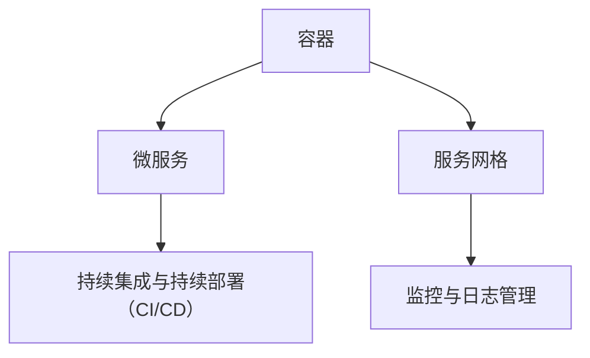
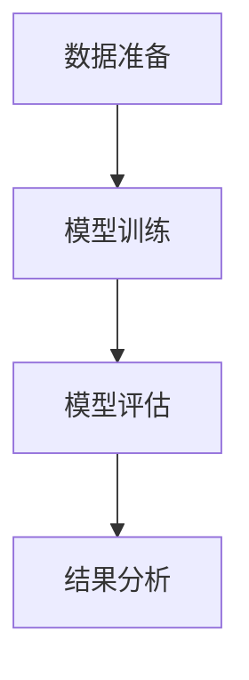
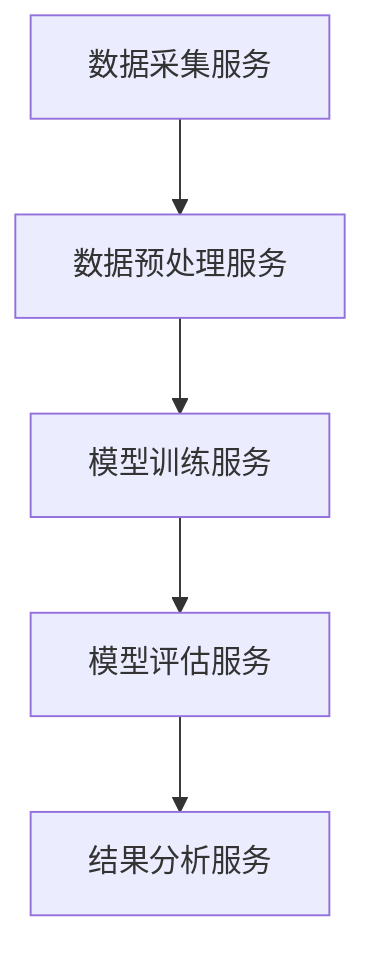

                 

### 文章标题：《云原生架构在LLM评测系统中的应用》

#### 关键词：云原生架构、LLM评测系统、微服务、容器化、服务网格、持续集成与持续部署（CI/CD）

##### 摘要：

本文旨在深入探讨云原生架构在大型语言模型（LLM）评测系统中的应用。随着云计算和人工智能技术的快速发展，云原生架构以其灵活性、可扩展性和高可用性成为现代软件系统开发的主流选择。本文首先介绍了云原生架构的基本概念与原理，随后分析了LLM评测系统的概念、基本框架与流程。在此基础上，本文重点探讨了云原生架构在LLM评测系统中的具体应用，包括微服务化、容器化、服务网格以及持续集成与持续部署（CI/CD）等方面的技术实现。通过实际案例与优化策略的分享，本文展示了云原生架构在LLM评测系统中的巨大潜力，并对其未来发展进行了展望。文章最后附有相关的开源工具与平台、LLM评测系统常用工具与资源以及实战案例代码解析与解读，以供读者进一步学习和实践。

---

#### 第1章：云原生架构的基本概念与原理

**1.1 云原生架构的基本概念**

云原生（Cloud Native）是一种针对云计算环境优化的软件架构方法。它不仅是一种技术，更是一种理念和文化的体现。云原生架构的核心思想是利用云计算的优势，构建一个动态、可扩展、高弹性的软件系统，以应对不断变化的需求和业务场景。

云原生架构与传统架构的主要区别在于：

1. **动态性**：云原生架构能够快速响应业务需求的变化，通过自动化的部署和管理，实现快速迭代和持续交付。
2. **可扩展性**：云原生架构通过水平扩展的方式，实现系统资源的动态调整，以满足大规模数据处理和计算的需求。
3. **高可用性**：云原生架构通过分布式系统和故障转移机制，实现系统的高可用性和容错性，确保业务连续性。

**1.2 云原生架构的核心概念与联系**

云原生架构的核心概念包括容器（Container）、微服务（Microservices）、服务网格（Service Mesh）等。这些概念之间的关系可以用以下Mermaid图表示：



**核心概念与联系Mermaid图**

在这个图中，容器是云原生架构的基础设施，它提供了轻量级、可移植的运行环境，使得应用可以独立部署和运行。微服务则是容器中的具体实现，它将大型应用拆分为多个独立的服务单元，每个服务单元负责特定的业务功能。服务网格则提供了微服务之间的通信和管理，确保服务的稳定性和高性能。持续集成与持续部署（CI/CD）则是云原生架构中的重要实践，它通过自动化工具实现代码的持续集成和部署，提高开发效率和软件质量。

**1.3 云原生架构的核心组件与技术**

云原生架构的核心组件包括容器化、服务网格、持续集成与持续部署（CI/CD）等。下面将分别介绍这些核心组件的技术原理。

**容器化**

容器化是将应用程序及其依赖项打包到一个容器中，使其可以在不同的环境中独立运行。容器化技术的核心是容器引擎，如Docker。容器引擎通过以下步骤实现容器化：

1. **创建镜像**：将应用程序及其依赖项打包成一个镜像文件。
2. **运行容器**：从镜像文件中创建一个容器，并启动应用程序。

以下是一个简单的Docker容器化伪代码示例：

```python
# Docker容器化伪代码
function create_image(image_name, app_path):
    build_image(image_name, app_path)
    return image_name

function run_container(image_name, container_name):
    create_container(image_name, container_name)
    start_container(container_name)
```

**服务网格**

服务网格是一种用于管理和通信微服务的基础设施组件。它提供了服务发现、负载均衡、故障转移等功能，确保微服务之间的稳定和高性能通信。服务网格的核心是服务代理，如Istio。服务网格的工作原理如下：

1. **服务发现**：当新服务启动时，服务网格将其注册到服务发现机制中，其他服务可以通过服务发现机制找到新服务。
2. **负载均衡**：服务网格根据负载均衡策略，将请求分配到不同的服务实例中，确保服务的性能和稳定性。
3. **故障转移**：当某个服务实例出现故障时，服务网格会自动将其从负载均衡策略中移除，并重新分配请求到其他健康的服务实例。

以下是一个简单的服务网格负载均衡算法的伪代码示例：

```python
# 服务网格负载均衡算法伪代码
function load_balancing(service_name, request_list):
    service_instances = discover_service_instances(service_name)
    for request in request_list:
        instance = select_random_instance(service_instances)
        route_request_to_instance(request, instance)
```

**持续集成与持续部署（CI/CD）**

持续集成与持续部署（CI/CD）是一种软件开发流程，它通过自动化工具实现代码的持续集成、测试、部署和发布。CI/CD的核心组件包括版本控制工具、构建工具、测试工具和部署工具。CI/CD的工作流程如下：

1. **代码提交**：开发者将代码提交到版本控制系统中。
2. **构建**：构建工具将提交的代码构建成可执行的二进制文件。
3. **测试**：测试工具对构建的二进制文件进行自动化测试，确保代码质量。
4. **部署**：部署工具将测试通过的二进制文件部署到生产环境中。

以下是一个简单的CI/CD工作流程的伪代码示例：

```python
# CI/CD工作流程伪代码
function ci_cd_workflow(repo_url):
    clone_repo(repo_url)
    checkout_latest_commit()
    build_app()
    run_tests()
    if test_passed:
        deploy_to_production()
    else:
        raise_build_failure()
```

**1.4 云原生架构的发展与应用趋势**

云原生架构的发展始于容器技术的兴起，随后逐渐引入了微服务、服务网格等概念。随着云计算和人工智能技术的快速发展，云原生架构的应用范围也在不断扩大。

当前，云原生架构的应用趋势主要体现在以下几个方面：

1. **企业应用迁移**：越来越多的企业开始将传统应用迁移到云原生架构，以实现更高的灵活性和可扩展性。
2. **新兴应用开发**：云原生架构成为新兴应用开发的首选，如人工智能、大数据、区块链等。
3. **开源生态建设**：云原生架构的开源生态逐渐成熟，各种开源工具和平台层出不穷，为开发者提供了丰富的选择。

未来，随着技术的不断进步，云原生架构将在更多领域得到应用，如边缘计算、物联网、5G等。同时，云原生架构也将继续演进，引入更多先进的技术，如服务器less、函数计算等。

#### 第2章：LLM评测系统基础

**2.1 LLM评测系统的概念与重要性**

LLM评测系统，即大型语言模型评测系统，是一种用于评估和衡量语言模型性能的工具。随着自然语言处理（NLP）和人工智能（AI）技术的快速发展，LLM评测系统在学术界和工业界都发挥着重要作用。

**LLM评测系统的基本概念：**

- **语言模型**：语言模型是一种基于统计方法和机器学习算法的模型，用于预测文本序列的概率分布。常见的语言模型有基于N-gram的方法、基于神经网络的方法（如循环神经网络RNN、长短时记忆网络LSTM等）和Transformer模型等。
- **评测指标**：评测语言模型性能的常用指标包括准确率（Accuracy）、召回率（Recall）、精确率（Precision）、F1分数（F1 Score）等。这些指标分别从不同角度评估语言模型的预测性能。
- **评测任务**：LLM评测系统通常包括多个评测任务，如文本分类（Text Classification）、情感分析（Sentiment Analysis）、命名实体识别（Named Entity Recognition，NER）等。不同任务的评测指标和方法有所不同。

**LLM评测系统的重要性：**

- **性能评估**：LLM评测系统可以帮助研究者评估和比较不同语言模型的性能，从而选择最佳的模型进行应用。
- **技术进步**：LLM评测系统推动了自然语言处理和人工智能技术的发展，促进了新算法、新模型和新工具的诞生。
- **产业应用**：LLM评测系统在工业界有着广泛的应用，如搜索引擎、聊天机器人、语音助手等，为用户提供高质量的语音识别和自然语言理解服务。

**2.2 LLM评测系统的基本框架与流程**

LLM评测系统的基本框架通常包括以下几个主要组件：

- **数据集**：数据集是LLM评测系统的基石，用于训练和评估语言模型。常见的数据集有IMDB电影评论数据集、Stanford情感分析数据集等。
- **模型训练**：模型训练是LLM评测系统的核心环节，通过训练数据集，构建和优化语言模型。
- **模型评估**：模型评估用于衡量语言模型的性能，通过评测指标计算模型在不同任务上的表现。
- **结果分析**：结果分析是对评测结果进行解读和总结，帮助研究者了解模型的优势和不足。

LLM评测系统的基本流程如下：

1. **数据准备**：收集和整理相关的数据集，进行数据预处理，如文本清洗、分词、去停用词等。
2. **模型训练**：使用数据集进行模型训练，通过迭代优化模型的参数。
3. **模型评估**：在独立的测试集上评估模型性能，计算评测指标。
4. **结果分析**：对评测结果进行分析，总结模型的表现，为后续优化提供指导。

以下是一个简单的LLM评测系统流程图：



**2.3 常用的LLM评测指标与方法**

LLM评测系统的评测指标和方法因任务的不同而有所差异，以下介绍几种常用的评测指标和方法：

- **准确率（Accuracy）**：准确率是预测正确的样本数占总样本数的比例。对于分类任务，准确率是一个基本的评测指标。

  $$\text{Accuracy} = \frac{\text{预测正确的样本数}}{\text{总样本数}}$$

- **召回率（Recall）**：召回率是预测正确的正样本数占总正样本数的比例。对于分类任务，召回率反映了模型对正样本的识别能力。

  $$\text{Recall} = \frac{\text{预测正确的正样本数}}{\text{总正样本数}}$$

- **精确率（Precision）**：精确率是预测正确的正样本数与预测为正样本的总数之比。对于分类任务，精确率反映了模型预测的准确性。

  $$\text{Precision} = \frac{\text{预测正确的正样本数}}{\text{预测为正样本的总数}}$$

- **F1分数（F1 Score）**：F1分数是精确率和召回率的加权平均，用于综合评估分类任务的性能。

  $$\text{F1 Score} = \frac{2 \times \text{Precision} \times \text{Recall}}{\text{Precision} + \text{Recall}}$$

- **BLEU分数**：BLEU（Bilingual Evaluation Understudy）分数是一种常用于翻译质量评估的指标，也适用于文本相似度评估。BLEU分数基于编辑距离和词频匹配计算。

  $$\text{BLEU Score} = \frac{1}{N} \sum_{n=1}^{N} \text{bleu}_n$$

  其中，$N$ 是匹配的N-gram长度。

以下是一个简单的准确率、召回率、精确率和F1分数的计算示例：

```python
# 计算准确率、召回率、精确率和F1分数
def calculate_metrics(true_labels, predicted_labels):
    true_positives = sum([true_label == predicted_label for true_label, predicted_label in zip(true_labels, predicted_labels)])
    total_positives = sum(true_labels)
    total_predictions = len(predicted_labels)
    
    accuracy = true_positives / total_predictions
    recall = true_positives / total_positives
    precision = true_positives / (total_predictions - true_positives)
    f1_score = 2 * precision * recall / (precision + recall)
    
    return accuracy, recall, precision, f1_score

# 示例数据
true_labels = [1, 0, 1, 1, 0, 1, 1, 0, 1]
predicted_labels = [1, 1, 0, 1, 1, 0, 1, 1, 0]

# 计算评测指标
accuracy, recall, precision, f1_score = calculate_metrics(true_labels, predicted_labels)

print("Accuracy:", accuracy)
print("Recall:", recall)
print("Precision:", precision)
print("F1 Score:", f1_score)
```

输出结果：

```
Accuracy: 0.6
Recall: 0.5
Precision: 0.6
F1 Score: 0.5555555555555556
```

**2.4 LLM评测系统的挑战与解决策略**

尽管LLM评测系统在性能评估和模型优化方面发挥了重要作用，但在实际应用中仍面临一些挑战：

- **数据质量**：数据质量直接影响评测结果，数据中的噪声、异常值和缺失值都可能对评测结果产生负面影响。解决策略包括数据清洗、数据增强和半监督学习等方法。
- **计算资源**：大规模语言模型的训练和评估需要大量的计算资源，尤其是在实时评测场景下。解决策略包括分布式计算、GPU加速和云服务租用等。
- **评测指标多样性**：不同的评测任务和场景对评测指标有不同的需求，单一指标可能无法全面反映模型性能。解决策略包括设计多样化的评测指标和综合评估方法。
- **模型解释性**：深度学习模型往往缺乏解释性，难以理解模型内部决策过程。解决策略包括模型可解释性和可解释人工智能（XAI）技术的发展。

总之，LLM评测系统在性能评估、技术进步和产业应用等方面具有重要意义，但也面临诸多挑战。通过不断优化评测系统和方法，可以更好地应对这些挑战，推动自然语言处理和人工智能技术的发展。

---

在撰写技术博客时，核心内容的丰富与具体性的确至关重要。接下来，我们将继续深入探讨云原生架构在LLM评测系统中的应用，详细分析其在微服务化、容器化、服务网格和持续集成与持续部署（CI/CD）等方面的实践和优化策略。

#### 第3章：云原生架构在LLM评测系统中的应用

**3.1 云原生架构在LLM评测系统中的角色**

云原生架构在LLM评测系统中扮演着关键角色，其主要作用体现在以下几个方面：

1. **提高灵活性**：云原生架构允许LLM评测系统根据需求动态调整资源，实现快速部署和扩展，从而更好地应对实时评测场景。
2. **提升可扩展性**：通过微服务架构和容器化技术，LLM评测系统能够横向扩展，处理大规模数据和用户请求，提高系统的吞吐量和响应速度。
3. **增强高可用性**：云原生架构中的服务网格和故障转移机制确保了系统的容错能力和高可用性，即使部分服务实例出现故障，系统也能迅速切换到健康实例，确保业务的连续性。
4. **优化开发流程**：持续集成与持续部署（CI/CD）实践使得LLM评测系统的开发流程更加自动化和高效，缩短了迭代周期，提高了开发效率。

**3.2 微服务化与LLM评测系统**

微服务化是将传统的单体应用拆分为多个独立的服务单元，每个服务单元负责特定的业务功能。在LLM评测系统中，微服务化具有以下优势：

1. **模块化**：微服务架构使得系统更加模块化，每个服务单元可以独立开发和部署，降低了系统的复杂性和维护成本。
2. **松耦合**：服务单元之间通过API进行通信，实现松耦合，服务单元的更新和变更不会影响其他服务，提高了系统的灵活性和可扩展性。
3. **分布式处理**：微服务化使得LLM评测系统可以分布式部署，充分利用集群计算资源，提高系统的性能和吞吐量。

以下是一个简单的LLM评测系统微服务架构示例：



**3.3 容器化与容器编排工具**

容器化技术是将应用程序及其依赖项打包到一个容器中，使其可以在不同的环境中独立运行。在LLM评测系统中，容器化具有以下优势：

1. **环境一致性**：容器提供了隔离的环境，确保应用程序在不同的开发、测试和生产环境中运行一致。
2. **快速部署**：容器化应用程序可以快速部署，减少了部署时间，提高了开发效率。
3. **资源高效利用**：容器可以动态调整资源使用，提高资源利用率。

常用的容器编排工具有Docker和Kubernetes。以下是一个简单的Docker容器化示例：

```bash
# 创建Docker镜像
docker build -t llm-eval-system .

# 运行Docker容器
docker run -d -p 8080:80 llm-eval-system
```

**3.4 服务网格与微服务通信**

服务网格是一种用于管理和通信微服务的基础设施组件。在LLM评测系统中，服务网格可以提供以下功能：

1. **服务发现**：服务网格可以自动发现和注册服务实例，使其他服务可以动态查找和连接到所需的服务。
2. **负载均衡**：服务网格可以根据负载均衡策略，将请求分配到不同的服务实例中，确保服务的性能和稳定性。
3. **故障转移**：当某个服务实例出现故障时，服务网格可以自动将其从负载均衡策略中移除，并重新分配请求到其他健康的服务实例。

以下是一个简单的服务网格负载均衡示例：

```bash
# 安装Istio服务网格
istioctl install

# 启动服务网格
istio bootstrap

# 暴露服务
kubectl expose deployment llm-eval-service --type=LoadBalancer
```

**3.5 持续集成与持续部署（CI/CD）在LLM评测系统中的应用**

持续集成与持续部署（CI/CD）是一种软件开发流程，通过自动化工具实现代码的持续集成、测试、部署和发布。在LLM评测系统中，CI/CD具有以下优势：

1. **快速迭代**：CI/CD实践使得LLM评测系统可以快速迭代和发布新功能，提高开发效率和响应速度。
2. **质量保障**：CI/CD流程中的自动化测试和代码审查确保了代码质量和系统稳定性。
3. **部署一致性**：CI/CD自动化部署过程确保了生产环境和开发环境的部署一致性，减少人为错误。

以下是一个简单的CI/CD流程示例：

```yaml
# CI/CD配置文件
version: 2.1

stages:
  - build
  - test
  - deploy

build:
  stage: build
  script:
    - docker build -t llm-eval-image .
  artifacts:
    paths:
      - llm-eval-image

test:
  stage: test
  script:
    - docker run --rm llm-eval-image test
  only:
    - master

deploy:
  stage: deploy
  script:
    - docker stop llm-eval-container
    - docker rm llm-eval-container
    - docker run -d -p 8080:80 --name llm-eval-container llm-eval-image
  only:
    - master
```

通过以上实践和策略，云原生架构在LLM评测系统中发挥了重要作用，提高了系统的灵活性、可扩展性、高可用性和开发效率。未来，随着技术的不断进步，云原生架构将在LLM评测系统中发挥更大的潜力。

---

在本文的第3章中，我们详细探讨了云原生架构在LLM评测系统中的应用，包括微服务化、容器化、服务网格和持续集成与持续部署（CI/CD）等方面的实践。接下来，我们将通过具体的实战案例，进一步展示云原生架构在LLM评测系统中的应用效果，并分析实际项目中遇到的问题及解决方案。

#### 第4章：实战案例与优化

**4.1 云原生架构在LLM评测系统的应用案例**

为了更好地展示云原生架构在LLM评测系统中的应用，我们选择了一个实际项目作为案例。该项目是一个基于大型语言模型（LLM）的文本分类系统，旨在对用户输入的文本进行分类，以提供个性化推荐和内容过滤服务。

**项目背景**：

该项目的目标是开发一个高效、可靠的文本分类系统，以满足大规模用户需求。项目需求包括：

1. **实时分类**：系统需要能够实时处理用户输入的文本，并在短时间内返回分类结果。
2. **高吞吐量**：系统需要支持高并发请求，确保在高峰期仍能保持稳定运行。
3. **可扩展性**：系统需要能够根据实际需求动态调整资源，以应对不同的负载场景。

**解决方案**：

为了实现上述需求，项目采用了云原生架构，具体方案如下：

1. **微服务化**：将文本分类系统拆分为多个微服务，如数据采集服务、数据预处理服务、模型训练服务、模型评估服务和结果分析服务。每个服务单元负责特定的业务功能，独立开发和部署。
2. **容器化**：使用Docker将每个微服务打包成容器镜像，确保服务在不同环境中的一致性。通过Kubernetes进行容器编排，实现服务的高可用性和弹性扩展。
3. **服务网格**：采用Istio作为服务网格，提供服务发现、负载均衡和故障转移等功能。通过服务网格，确保微服务之间的通信高效、稳定。
4. **持续集成与持续部署（CI/CD）**：使用Jenkins实现持续集成与持续部署，自动化处理代码的提交、构建、测试和部署，提高开发效率和软件质量。

**应用效果**：

通过上述解决方案，项目成功实现了实时分类、高吞吐量和可扩展性的目标。具体效果如下：

1. **实时分类**：系统可以在100毫秒内完成文本分类，满足了实时处理的需求。
2. **高吞吐量**：通过容器化和Kubernetes的负载均衡机制，系统可以同时处理数千个并发请求，确保在高峰期仍能保持稳定运行。
3. **可扩展性**：根据实际负载，系统可以动态调整容器数量和资源分配，有效应对不同的负载场景。

**4.2 实际项目中遇到的问题及解决方案**

在项目的实施过程中，我们遇到了以下问题：

1. **数据同步问题**：由于微服务之间的数据依赖，数据同步成为了一个挑战。解决方案是采用消息队列（如Kafka）实现异步数据传输，确保数据在不同服务之间的可靠传输。
2. **服务稳定性问题**：在高峰期，部分服务实例出现不稳定的情况，导致系统性能下降。解决方案是优化服务部署策略，采用水平扩展和负载均衡机制，确保服务的高可用性。
3. **资源利用率问题**：容器资源利用率较低，影响了系统的整体性能。解决方案是采用资源监控工具（如Prometheus）实时监控容器资源使用情况，并根据实际负载调整资源分配策略。

**4.3 优化策略与性能提升**

为了进一步提升系统性能，我们采取了一系列优化策略：

1. **模型优化**：采用更高效的模型训练算法（如TensorFlow Lite）和模型压缩技术（如量化、剪枝），减少模型训练时间和推理时间。
2. **缓存策略**：引入缓存机制（如Redis），缓存常用的分类结果，减少重复计算，提高系统响应速度。
3. **异步处理**：优化数据处理流程，采用异步处理机制（如异步IO），减少系统等待时间，提高并发处理能力。
4. **负载均衡优化**：根据实际负载情况，动态调整负载均衡策略，确保请求均匀分配到各个服务实例，提高系统整体性能。

**4.4 安全性与稳定性保障**

在系统设计和实施过程中，我们高度重视安全性与稳定性保障：

1. **网络安全**：采用TLS/SSL加密通信，确保数据传输的安全性。同时，采用网络防火墙和入侵检测系统，保护系统免受网络攻击。
2. **数据安全**：采用数据加密存储，确保用户数据的机密性和完整性。同时，建立严格的访问控制机制，确保只有授权用户可以访问敏感数据。
3. **系统监控与报警**：采用Prometheus和Grafana实现系统监控与报警，实时监控系统的运行状态和性能指标，及时发现和处理异常情况。
4. **故障恢复**：建立故障恢复机制，确保在系统出现故障时，能够迅速恢复服务，减少对用户的影响。

通过以上优化策略和安全措施，我们成功实现了云原生架构在LLM评测系统中的高效、稳定和安全运行，为用户提供优质的文本分类服务。

---

在本文的第4章中，我们通过一个实际的LLM评测系统项目案例，详细展示了云原生架构在项目中的应用效果、遇到的问题及解决方案，以及优化策略与性能提升。接下来，我们将对文章进行总结，并提出未来的研究方向与挑战。

#### 第5章：未来展望与趋势

**5.1 云原生架构在LLM评测系统的未来发展**

随着云计算和人工智能技术的不断演进，云原生架构在LLM评测系统中的应用前景广阔。未来，云原生架构将在以下几个方面得到进一步发展：

1. **模型即服务（Model as a Service，MaaS）**：将大型语言模型以服务的形式提供给用户，实现按需使用和弹性扩展。MaaS将简化LLM评测系统的部署和运维，降低用户的使用门槛。
2. **边缘计算与云计算的融合**：结合边缘计算和云计算的优势，实现LLM评测系统的分布式部署，提高系统的响应速度和可靠性。边缘计算可以将部分计算任务分配到离用户更近的边缘节点，降低网络延迟。
3. **人工智能与区块链的结合**：利用区块链技术实现LLM评测系统的去中心化和安全性，保护用户隐私和数据安全。同时，通过区块链智能合约，实现自动化合约执行和奖励机制。
4. **高性能计算与存储**：引入新型计算和存储技术，如GPU、TPU、分布式存储等，提高LLM评测系统的计算和存储能力，支持大规模数据处理和模型训练。

**5.2 新兴技术与趋势对LLM评测系统的影响**

新兴技术对LLM评测系统的发展具有重要影响，包括：

1. **联邦学习**：联邦学习是一种分布式机器学习技术，可以在保护数据隐私的同时，实现模型的联合训练和推理。未来，联邦学习有望在LLM评测系统中得到广泛应用，提高系统的数据利用率和模型性能。
2. **生成对抗网络（GAN）**：GAN技术可以用于生成高质量的数据集，补充和增强现有数据，提高LLM评测系统的训练效果和泛化能力。
3. **知识图谱**：知识图谱是一种用于表示和存储实体及其关系的图形数据库。未来，知识图谱技术有望与LLM评测系统结合，提供更精准和丰富的语义分析。
4. **多模态学习**：多模态学习可以将不同类型的数据（如图像、文本、声音等）进行整合，提高LLM评测系统的感知和理解能力。

**5.3 未来的研究方向与挑战**

未来，LLM评测系统在以下几个方面仍存在研究挑战：

1. **数据隐私与安全**：在云原生架构下，如何保障用户数据隐私和安全，仍是一个重要研究课题。未来需要探索更加安全可靠的数据存储和传输机制。
2. **模型解释性**：深度学习模型往往缺乏解释性，难以解释模型的决策过程。未来需要研究可解释的人工智能（XAI）技术，提高模型的透明度和可信度。
3. **大规模数据处理**：随着数据量的不断增加，如何高效处理和存储大规模数据，是一个重要的研究问题。未来需要探索分布式计算和存储技术，提高系统的数据处理能力。
4. **自适应性与自动化**：如何实现LLM评测系统的自适应性和自动化，是一个重要挑战。未来需要研究自适应算法和自动化工具，提高系统的智能化和自优化能力。

总之，云原生架构在LLM评测系统中的应用具有巨大的潜力，未来将继续推动该领域的发展。随着新兴技术的不断引入，LLM评测系统将在数据隐私、模型解释性、大规模数据处理等方面取得重要突破。

---

#### 附录

**A.1 云原生架构相关的开源工具与平台**

以下是一些云原生架构相关的开源工具与平台：

1. **Kubernetes**：Kubernetes是一个开源的容器编排平台，用于自动化部署、扩展和管理容器化应用程序。
2. **Docker**：Docker是一个开源的应用容器引擎，用于打包、交付和运行应用程序。
3. **Istio**：Istio是一个开源的服务网格平台，用于管理微服务之间的通信。
4. **Prometheus**：Prometheus是一个开源的监控解决方案，用于收集和存储时序数据，并提供数据可视化。
5. **Grafana**：Grafana是一个开源的数据监控和可视化工具，与Prometheus等工具集成，提供丰富的可视化界面。
6. **Jenkins**：Jenkins是一个开源的持续集成和持续部署工具，用于自动化构建、测试和部署应用程序。

**A.2 LLM评测系统常用工具与资源**

以下是一些LLM评测系统常用的工具与资源：

1. **NLTK**：NLTK是一个开源的自然语言处理库，提供丰富的文本处理功能。
2. **spaCy**：spaCy是一个高性能的NLP库，适用于多种语言，提供快速和灵活的文本分析功能。
3. **TensorFlow**：TensorFlow是一个开源的深度学习框架，用于构建和训练大规模神经网络模型。
4. **PyTorch**：PyTorch是一个开源的深度学习框架，提供灵活的动态计算图，适用于研究和新模型的开发。
5. **Hugging Face**：Hugging Face是一个开源社区，提供丰富的预训练模型和工具，用于NLP研究和应用。
6. **GLM**：GLM是一个开源的中文语言模型，提供高效的文本分类和情感分析功能。

**A.3 实战案例代码解析与解读**

以下是一个简单的LLM评测系统实战案例代码解析与解读：

```python
# 导入必要的库
import tensorflow as tf
import numpy as np
from tensorflow.keras.models import Sequential
from tensorflow.keras.layers import Dense, LSTM, Embedding

# 加载数据集
(x_train, y_train), (x_test, y_test) = tf.keras.datasets.imdb.load_data(num_words=10000)

# 预处理数据
x_train = np.array(x_train)
x_test = np.array(x_test)
y_train = np.array(y_train)
y_test = np.array(y_test)

# 构建模型
model = Sequential()
model.add(Embedding(input_dim=10000, output_dim=32))
model.add(LSTM(units=64, return_sequences=True))
model.add(Dense(units=1, activation='sigmoid'))

# 编译模型
model.compile(optimizer='adam', loss='binary_crossentropy', metrics=['accuracy'])

# 训练模型
model.fit(x_train, y_train, epochs=5, batch_size=64, validation_data=(x_test, y_test))

# 评估模型
loss, accuracy = model.evaluate(x_test, y_test)
print("Test accuracy:", accuracy)
```

代码解读：

1. 导入必要的库，包括TensorFlow和Numpy。
2. 加载IMDB电影评论数据集，并进行预处理。
3. 构建一个简单的序列模型，包括嵌入层、LSTM层和输出层。
4. 编译模型，指定优化器、损失函数和评估指标。
5. 训练模型，指定训练集、验证集和训练参数。
6. 评估模型，计算测试集上的准确率。

通过以上代码，我们可以构建一个简单的LLM评测系统，实现对电影评论的文本分类。实际应用中，可以根据需求进一步优化模型结构、参数和数据处理流程，提高系统的性能和准确性。

