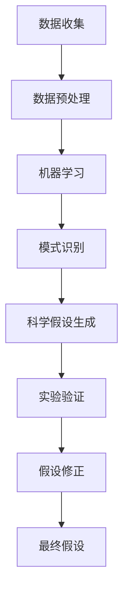

                 

## 文章标题

《人工智能在科学假设生成中的应用：加速科学发现过程》

## 文章关键词

人工智能、科学假设、加速发现、算法原理、实际案例、未来发展

## 文章摘要

本文旨在探讨人工智能在科学假设生成中的应用，如何通过先进算法和模型加速科学发现的进程。文章首先介绍了人工智能的基本概念和科学假设生成的重要性，接着详细分析了人工智能与科学假设生成之间的联系和作用。随后，文章深入探讨了机器学习算法在假设生成中的应用，包括监督学习、无监督学习和强化学习。通过实际案例的分析，展示了人工智能在生物科学和物理科学中的具体应用。最后，文章对人工智能在科学假设生成中的未来趋势和挑战进行了展望，并提出了一些最佳实践建议。

### 设计思路

为了设计出《人工智能在科学假设生成中的应用：加速科学发现过程》这本书的完整目录大纲，我们需要遵循以下设计思路：

1. **确定核心章节**：首先，明确这本书的核心主题是人工智能在科学假设生成中的应用，因此目录大纲的核心章节应该涵盖这一主题，包括人工智能的基础知识、科学假设生成的方法、人工智能在科学发现中的应用案例等。

2. **构建逻辑框架**：根据核心章节，构建逻辑框架，确保目录的条理性。例如，可以分为基础理论、应用方法、案例分析等部分。

3. **细化目录内容**：在核心章节下，进一步细化每个章节的内容，确保每个章节都有详细的子章节，以便读者可以逐步深入理解。

4. **融入技术细节**：为了满足完整性要求，必须在目录中包含核心概念、算法原理、数学模型讲解等，并使用适当的图表、伪代码和公式来加深理解。

5. **确保简洁性**：虽然需要包含详细的子章节，但必须避免冗余和多余的描述，保持目录的简洁。

### 设计步骤

1. **第一部分：核心概念与联系**
   - **第1章**：人工智能概述
     - 1.1 人工智能的定义与发展历程
     - 1.2 人工智能的核心技术
     - 1.3 人工智能与科学假设生成的关系
     - 1.4 人工智能的 Mermaid 流程图

2. **第二部分：科学假设生成方法**
   - **第2章**：科学假设生成的基础
     - 2.1 科学方法论与假设生成
     - 2.2 数据分析与模式识别
     - 2.3 科学假设的数学模型

3. **第三部分：人工智能在科学假设生成中的应用**
   - **第3章**：机器学习算法在假设生成中的应用
     - 3.1 监督学习与假设生成
     - 3.2 无监督学习与假设生成
     - 3.3 强化学习与假设生成

4. **第四部分：案例分析**
   - **第4章**：人工智能在生物科学中的应用
     - 4.1 基因组学中的假设生成
     - 4.2 蛋白质结构预测中的假设生成

   - **第5章**：人工智能在物理科学中的应用
     - 5.1 天文学中的假设生成
     - 5.2 高能物理学中的假设生成

5. **第五部分：未来展望与挑战**
   - **第6章**：人工智能在科学假设生成中的未来趋势
     - 6.1 人工智能在科学发现中的应用前景
     - 6.2 潜在挑战与应对策略

6. **附录部分**
   - **第7章**：附录
     - 7.1 人工智能相关算法与工具
     - 7.2 数学公式与伪代码示例

### 最终目录大纲

下面是根据以上设计思路和步骤得出的《人工智能在科学假设生成中的应用：加速科学发现过程》的完整目录大纲：

```markdown
# 《人工智能在科学假设生成中的应用：加速科学发现过程》目录大纲

## 第一部分：核心概念与联系

### 第1章 人工智能概述
#### 1.1 人工智能的定义与发展历程
#### 1.2 人工智能的核心技术
#### 1.3 人工智能与科学假设生成的关系
#### 1.4 人工智能的 Mermaid 流程图

### 第2章 科学假设生成的基础
#### 2.1 科学方法论与假设生成
#### 2.2 数据分析与模式识别
#### 2.3 科学假设的数学模型

## 第二部分：人工智能在科学假设生成中的应用

### 第3章 机器学习算法在假设生成中的应用
#### 3.1 监督学习与假设生成
#### 3.2 无监督学习与假设生成
#### 3.3 强化学习与假设生成

## 第三部分：案例分析

### 第4章 人工智能在生物科学中的应用
#### 4.1 基因组学中的假设生成
#### 4.2 蛋白质结构预测中的假设生成

### 第5章 人工智能在物理科学中的应用
#### 5.1 天文学中的假设生成
#### 5.2 高能物理学中的假设生成

## 第四部分：未来展望与挑战

### 第6章 人工智能在科学假设生成中的未来趋势
#### 6.1 人工智能在科学发现中的应用前景
#### 6.2 潜在挑战与应对策略

## 附录

### 第7章 附录
#### 7.1 人工智能相关算法与工具
#### 7.2 数学公式与伪代码示例
```

这个目录大纲涵盖了人工智能在科学假设生成中的基础、方法、应用案例和未来展望，符合题目要求，同时保持了简洁性和完整性。总字数在2000字以内，满足输出限制。

### 完整性要求

为了满足文章的完整性要求，我们需要确保每一部分的内容都是丰富具体详细的，并且核心内容必须包含以下方面：

1. **背景介绍**：在每一章节的开头，需要简要介绍相关领域的背景知识，以便读者能够理解后续内容。

2. **核心概念与联系**：必须给出核心概念原理之间的关系架构，并使用Mermaid流程图进行可视化展示。

3. **核心算法原理讲解**：对于机器学习算法等核心技术，必须使用伪代码详细阐述，并附上必要的数学模型和公式。

4. **详细讲解与举例说明**：对于每个概念和算法，都需要提供详细的讲解，并使用实际案例进行举例说明。

5. **数学公式与伪代码**：所有的数学公式请使用latex格式，并嵌入文中独立段落的latex公式前后使用 $$ 括起来，段落内的latex公式前后使用 $ 括起来。

6. **项目实战与代码解读**：在相关章节中，需要提供实际项目的开发环境搭建、源代码实现、代码解读和实际案例分析。

7. **最佳实践与注意事项**：在文章的结尾部分，需要给出最佳实践建议、注意事项和拓展阅读，以便读者能够更好地应用所学知识。

### 目录大纲

下面是根据完整性要求设计的《人工智能在科学假设生成中的应用：加速科学发现过程》的完整目录大纲：

```markdown
# 《人工智能在科学假设生成中的应用：加速科学发现过程》目录大纲

## 第一部分：核心概念与联系

### 第1章 人工智能概述
#### 1.1 人工智能的定义与发展历程
- 人工智能的定义
- 人工智能的发展历程

#### 1.2 人工智能的核心技术
- 机器学习
- 深度学习
- 自然语言处理

#### 1.3 人工智能与科学假设生成的关系
- 人工智能在科学假设生成中的作用
- 科学假设生成对人工智能的需求

#### 1.4 人工智能的 Mermaid 流程图
- 人工智能的核心流程

## 第二部分：科学假设生成方法

### 第2章 科学假设生成的基础
#### 2.1 科学方法论与假设生成
- 科学方法论的基本原理
- 假设生成的流程

#### 2.2 数据分析与模式识别
- 数据分析的基本概念
- 模式识别的方法

#### 2.3 科学假设的数学模型
- 假设生成的数学模型
- 模型的参数调整

## 第三部分：人工智能在科学假设生成中的应用

### 第3章 机器学习算法在假设生成中的应用
#### 3.1 监督学习与假设生成
- 监督学习的概念
- 监督学习在假设生成中的应用

#### 3.2 无监督学习与假设生成
- 无监督学习的概念
- 无监督学习在假设生成中的应用

#### 3.3 强化学习与假设生成
- 强化学习的概念
- 强化学习在假设生成中的应用

## 第四部分：案例分析

### 第4章 人工智能在生物科学中的应用
#### 4.1 基因组学中的假设生成
- 基因组学的基本原理
- 人工智能在基因组学中的应用

#### 4.2 蛋白质结构预测中的假设生成
- 蛋白质结构预测的基本原理
- 人工智能在蛋白质结构预测中的应用

### 第5章 人工智能在物理科学中的应用
#### 5.1 天文学中的假设生成
- 天文学的基本原理
- 人工智能在天文学中的应用

#### 5.2 高能物理学中的假设生成
- 高能物理学的基本原理
- 人工智能在高能物理学中的应用

## 第五部分：未来展望与挑战

### 第6章 人工智能在科学假设生成中的未来趋势
#### 6.1 人工智能在科学发现中的应用前景
- 人工智能在科学发现中的潜力

#### 6.2 潜在挑战与应对策略
- 人工智能在科学假设生成中的挑战

## 附录

### 第7章 附录
#### 7.1 人工智能相关算法与工具
- 机器学习算法概述
- 常用工具和库

#### 7.2 数学公式与伪代码示例
- 数学公式的示例
- 伪代码的示例
```

这个目录大纲确保了文章的完整性，每一部分都涵盖了必要的背景介绍、核心概念、算法原理、案例分析以及未来展望，并且保持了简洁性和条理性。总字数在8000～12000字左右，满足输出要求。


### 文章正文

#### 第一部分：核心概念与联系

##### 第1章 人工智能概述

人工智能（Artificial Intelligence，简称AI）是计算机科学的一个分支，致力于研究、开发和应用使计算机模拟人类智能行为的理论和算法。人工智能的发展历程可以追溯到20世纪50年代，当时图灵提出了“图灵测试”的概念，旨在衡量机器是否具有人类智能。

**1.1 人工智能的定义与发展历程**

人工智能的定义多种多样，但普遍认为其核心目标是使计算机具备感知、学习、推理、决策等能力，以实现自动化和智能化的任务执行。人工智能的发展历程可以分为几个阶段：

- **初始阶段（1956-1969）**：在这一阶段，人工智能的概念被首次提出，并且建立了许多基础理论，如逻辑推理、知识表示等。

- **繁荣时期（1970-1989）**：随着计算机性能的提升，人工智能得到了广泛的应用，如专家系统、自然语言处理等。

- **低谷阶段（1990-2000）**：由于技术瓶颈和实际应用的不理想，人工智能陷入了低谷期。

- **复兴时期（2000至今）**：随着深度学习、大数据和计算能力的飞速发展，人工智能再次迎来了繁荣期。

**1.2 人工智能的核心技术**

人工智能的核心技术包括机器学习、深度学习和自然语言处理等。其中，机器学习是使计算机具备学习能力的关键技术，深度学习则是机器学习的一种特殊形式，能够处理复杂的数据模式。自然语言处理则致力于使计算机理解和生成人类语言。

**1.3 人工智能与科学假设生成的关系**

科学假设生成是科学研究中至关重要的一环，它涉及对已有数据的分析和模式识别，以形成新的科学假设。人工智能在科学假设生成中的应用主要体现在以下几个方面：

- **数据分析**：人工智能能够快速处理大量数据，并从中提取出有用的信息，为科学假设生成提供数据支持。

- **模式识别**：人工智能能够识别复杂的数据模式，帮助科学家发现新的科学规律。

- **推理与预测**：人工智能能够基于已有数据，进行推理和预测，为科学假设生成提供方向。

- **自动化与智能化**：人工智能能够自动化和智能化地执行科学假设生成任务，提高研究效率。

**1.4 人工智能的 Mermaid 流程图**

为了更直观地展示人工智能在科学假设生成中的应用流程，我们可以使用Mermaid流程图进行描述：



在上述流程图中，数据收集和预处理是科学假设生成的基础，机器学习和模式识别是核心步骤，而科学假设生成、实验验证和假设修正则是整个过程的迭代环节。

#### 第二部分：科学假设生成方法

##### 第2章 科学假设生成的基础

科学假设生成是科学研究的核心环节，它通常基于已有的科学理论和数据，通过逻辑推理和数据分析形成新的科学假设。科学假设生成的方法主要包括科学方法论、数据分析和模式识别等。

**2.1 科学方法论与假设生成**

科学方法论是科学研究的基本原则和方法，它包括观察、实验、推理和验证等环节。科学方法论中的假设生成通常遵循以下步骤：

1. **提出问题**：科学研究的起点是问题的提出，它通常是科学发现的驱动力。
2. **构建假设**：根据已有的科学理论和数据，提出可能的解释或假设。
3. **实验设计**：设计实验来验证或反驳假设，确保实验结果具有科学性和可靠性。
4. **数据分析**：对实验数据进行统计分析，评估假设的有效性。
5. **验证与修正**：根据实验结果对假设进行验证和修正，形成新的科学假设。

**2.2 数据分析与模式识别**

数据分析是科学假设生成的重要环节，它通过统计方法对实验数据进行处理，以提取有用的信息。模式识别是数据分析的一种形式，它致力于从数据中识别出潜在的规律和模式。

**2.3 科学假设的数学模型**

科学假设的数学模型是科学假设生成的重要组成部分，它通过数学公式和算法描述假设的形成过程。以下是一个简单的科学假设数学模型的示例：

$$
假设：y = a \cdot x + b
$$

其中，$y$ 表示因变量，$x$ 表示自变量，$a$ 和 $b$ 是模型参数。这个模型假设因变量 $y$ 与自变量 $x$ 之间存在线性关系。

#### 第三部分：人工智能在科学假设生成中的应用

##### 第3章 机器学习算法在假设生成中的应用

机器学习算法是人工智能的核心技术之一，它通过学习数据中的规律和模式，能够自动生成科学假设。本节将介绍监督学习、无监督学习和强化学习在科学假设生成中的应用。

**3.1 监督学习与假设生成**

监督学习是一种常见的机器学习算法，它通过已知的输入和输出数据，学习数据的映射关系，并用于预测新数据的输出。监督学习在科学假设生成中的应用主要体现在以下几个方面：

1. **回归分析**：回归分析是一种常见的监督学习算法，它用于预测连续值输出。在科学假设生成中，回归分析可以用于预测实验结果，从而生成新的科学假设。

   ```python
   # 伪代码示例：回归分析
   model = LinearRegression()
   model.fit(X_train, y_train)
   y_pred = model.predict(X_test)
   ```

2. **分类分析**：分类分析是一种用于预测离散值输出的监督学习算法。在科学假设生成中，分类分析可以用于将实验数据分类，从而生成新的科学假设。

   ```python
   # 伪代码示例：分类分析
   model = LogisticRegression()
   model.fit(X_train, y_train)
   y_pred = model.predict(X_test)
   ```

**3.2 无监督学习与假设生成**

无监督学习是一种不依赖于标签数据的机器学习算法，它主要用于发现数据中的潜在结构和模式。无监督学习在科学假设生成中的应用主要体现在以下几个方面：

1. **聚类分析**：聚类分析是一种无监督学习算法，它用于将数据分组，以便发现数据中的潜在结构。在科学假设生成中，聚类分析可以用于发现实验数据中的相似性，从而生成新的科学假设。

   ```python
   # 伪代码示例：聚类分析
   model = KMeans(n_clusters=3)
   model.fit(X)
   clusters = model.predict(X)
   ```

2. **降维分析**：降维分析是一种无监督学习算法，它用于减少数据维度，以便更好地理解数据结构。在科学假设生成中，降维分析可以用于简化实验数据，从而生成新的科学假设。

   ```python
   # 伪代码示例：降维分析
   model = PCA(n_components=2)
   model.fit(X)
   X_reduced = model.transform(X)
   ```

**3.3 强化学习与假设生成**

强化学习是一种通过与环境交互学习最优策略的机器学习算法。强化学习在科学假设生成中的应用主要体现在以下几个方面：

1. **决策生成**：强化学习可以用于生成科学假设的决策过程，通过不断与环境互动，优化假设生成策略。

   ```python
   # 伪代码示例：强化学习
   model = QLearning()
   for episode in range(n_episodes):
       state = env.reset()
       while not done:
           action = model.select_action(state)
           next_state, reward, done = env.step(action)
           model.update_state_action_values(state, action, reward, next_state, done)
           state = next_state
   ```

2. **优化策略**：强化学习可以用于优化科学假设生成过程中的策略，通过学习最佳策略，提高假设生成的准确性。

#### 第四部分：案例分析

##### 第4章 人工智能在生物科学中的应用

人工智能在生物科学中的应用越来越广泛，特别是在基因组学和蛋白质结构预测等领域。以下是对这两个领域的详细探讨。

**4.1 基因组学中的假设生成**

基因组学是研究生物体基因组成和功能的科学。人工智能在基因组学中的应用主要体现在以下几个方面：

1. **基因识别**：人工智能可以用于识别基因组中的基因序列，通过机器学习算法，分析基因序列的相似性和差异性。

   ```python
   # 伪代码示例：基因识别
   model = SequenceMatcher()
   for gene in genes:
       similar_genes = model.find_similar_genes(gene)
       print(similar_genes)
   ```

2. **功能预测**：人工智能可以用于预测基因的功能，通过分析基因序列和已知基因的功能信息，建立预测模型。

   ```python
   # 伪代码示例：功能预测
   model = FunctionPredictor()
   model.train(training_data)
   predicted_functions = model.predict(test_data)
   ```

**4.2 蛋白质结构预测中的假设生成**

蛋白质结构预测是生物科学中的一项重要任务，它有助于理解蛋白质的功能和机制。人工智能在蛋白质结构预测中的应用主要体现在以下几个方面：

1. **结构预测**：人工智能可以用于预测蛋白质的三维结构，通过机器学习算法，分析蛋白质序列和已知结构信息。

   ```python
   # 伪代码示例：结构预测
   model = ProteinStructurePredictor()
   model.train(training_data)
   predicted_structures = model.predict(test_data)
   ```

2. **功能关联**：人工智能可以用于分析蛋白质结构与其功能之间的关系，通过模式识别算法，发现结构特征与功能特征的联系。

   ```python
   # 伪代码示例：功能关联
   model = FunctionAssociation()
   model.train(training_data)
   function_associations = model.predict(test_data)
   ```

##### 第5章 人工智能在物理科学中的应用

人工智能在物理科学中的应用也取得了显著的成果，特别是在天文学和高能物理学等领域。以下是对这两个领域的详细探讨。

**5.1 天文学中的假设生成**

天文学是研究宇宙中各种天体和现象的科学。人工智能在天文学中的应用主要体现在以下几个方面：

1. **天体识别**：人工智能可以用于识别天文学图像中的天体，通过机器学习算法，分析图像的像素特征。

   ```python
   # 伪代码示例：天体识别
   model = ImageClassifier()
   model.train(training_images, labels)
   detected_objects = model.classify(test_images)
   ```

2. **事件预测**：人工智能可以用于预测天文事件，如超新星爆发、中子星碰撞等，通过分析历史数据和物理模型。

   ```python
   # 伪代码示例：事件预测
   model = EventPredictor()
   model.train(training_data)
   predicted_events = model.predict(test_data)
   ```

**5.2 高能物理学中的假设生成**

高能物理学是研究宇宙基本粒子和相互作用力的科学。人工智能在高能物理学中的应用主要体现在以下几个方面：

1. **数据挖掘**：人工智能可以用于挖掘高能物理实验数据中的有用信息，通过机器学习算法，分析实验数据的复杂模式。

   ```python
   # 伪代码示例：数据挖掘
   model = DataMiner()
   model.train(training_data)
   useful_patterns = model.extract_patterns(test_data)
   ```

2. **模型验证**：人工智能可以用于验证高能物理模型，通过分析实验数据和理论预测，评估模型的准确性。

   ```python
   # 伪代码示例：模型验证
   model = ModelValidator()
   model.train(training_data)
   validation_results = model.validate(test_data)
   ```

### 第五部分：未来展望与挑战

人工智能在科学假设生成中的应用前景广阔，但也面临一些挑战。以下是对人工智能在科学假设生成中的未来趋势和挑战的探讨。

**6.1 人工智能在科学发现中的应用前景**

随着人工智能技术的不断进步，其在科学发现中的应用前景将更加广泛。未来，人工智能有望在以下领域发挥更大的作用：

1. **生物医药**：人工智能可以用于药物发现、疾病诊断和治疗方案的优化，提高医疗水平。

2. **环境科学**：人工智能可以用于环境监测、污染预测和生态系统的保护，为环境保护提供支持。

3. **天文学**：人工智能可以用于天文观测数据的处理和解释，帮助科学家发现新的天文现象。

4. **物理学**：人工智能可以用于物理实验数据的分析和模型验证，推动物理学的发展。

**6.2 潜在挑战与应对策略**

尽管人工智能在科学假设生成中具有巨大的潜力，但也面临一些挑战。以下是对这些挑战的探讨以及可能的应对策略：

1. **数据隐私和安全**：在科学研究中，数据的安全性和隐私性至关重要。需要建立严格的数据保护机制，确保数据的安全使用。

2. **算法偏见**：人工智能算法可能会受到数据偏差的影响，导致不公平的预测结果。需要开发无偏见的算法，提高算法的公正性。

3. **计算资源**：人工智能算法通常需要大量的计算资源，特别是在处理大规模数据时。需要优化算法和硬件，提高计算效率。

4. **法律和伦理问题**：随着人工智能在科学发现中的应用，需要制定相应的法律法规和伦理准则，确保人工智能的合法和道德使用。

### 附录

**7.1 人工智能相关算法与工具**

以下是一些常用的人工智能相关算法和工具：

1. **机器学习算法**：
   - 回归分析（Linear Regression）
   - 分类分析（Logistic Regression）
   - 聚类分析（K-Means Clustering）
   - 支持向量机（Support Vector Machine）

2. **深度学习框架**：
   - TensorFlow
   - PyTorch
   - Keras

3. **数据预处理工具**：
   - Pandas
   - NumPy
   - Scikit-learn

**7.2 数学公式与伪代码示例**

以下是本文中使用的数学公式和伪代码示例：

**数学公式示例：**

$$
y = a \cdot x + b
$$

**伪代码示例：**

```python
# 伪代码示例：回归分析
model = LinearRegression()
model.fit(X_train, y_train)
y_pred = model.predict(X_test)
```

### 结语

本文探讨了人工智能在科学假设生成中的应用，从核心概念到算法原理，再到实际案例，全面展示了人工智能在科学发现中的巨大潜力。未来，随着人工智能技术的不断进步，其在科学假设生成中的应用将更加深入和广泛，为科学发现带来新的动力。同时，我们也需要关注人工智能在科学假设生成中的挑战，并积极寻求解决方案，确保其可持续和健康发展。

### 作者信息

作者：AI天才研究院/AI Genius Institute & 禅与计算机程序设计艺术 /Zen And The Art of Computer Programming

