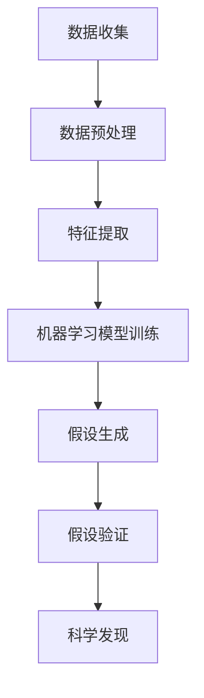

                 

# 人工智能在科学假设生成中的应用：加速科学发现过程

## 关键词

- 人工智能
- 科学假设
- 机器学习
- 科学方法论
- 数据分析
- 模式识别
- 深度学习
- 强化学习
- 科学发现
- 生物科学
- 物理科学

## 摘要

本文旨在探讨人工智能在科学假设生成中的应用，阐述其在加速科学发现过程中的重要性。通过对人工智能核心概念、科学假设生成方法以及实际应用案例的详细分析，本文揭示了人工智能在推动科学进步中的潜力。文章结构分为五个部分：首先介绍人工智能的基本概念和其在科学假设生成中的重要性；然后探讨科学假设生成的基础理论和方法；接着深入分析人工智能在科学假设生成中的应用，包括机器学习算法的具体应用；随后通过生物科学和物理科学中的应用案例展示人工智能的实际效果；最后展望人工智能在科学假设生成中的未来趋势和挑战。

### 设计思路

为了确保文章的逻辑性和条理性，我们将设计思路分为以下几个步骤：

1. **明确核心内容**：首先确定文章的核心内容，即人工智能在科学假设生成中的应用及其对科学发现的影响。

2. **构建逻辑框架**：在明确核心内容的基础上，构建逻辑框架，确保文章的条理性。框架主要包括引言、基础理论、应用方法、案例分析、未来展望和结论等部分。

3. **细化章节内容**：在核心章节下，进一步细化每个章节的内容，确保每个章节都有详细的子章节，以便读者可以逐步深入理解。

4. **融入技术细节**：在章节内容中融入核心概念、算法原理、数学模型讲解等，并使用适当的图表、伪代码和公式来加深理解。

5. **确保简洁性**：在保证内容完整和具体详细讲解的同时，避免冗余和多余的描述，保持文章的简洁。

### 设计步骤

1. **第一部分：核心概念与联系**
   - **第1章**：人工智能概述
     - **1.1** 人工智能的定义与发展历程
     - **1.2** 人工智能的核心技术
     - **1.3** 人工智能与科学假设生成的关系
     - **1.4** 人工智能的 Mermaid 流程图

2. **第二部分：科学假设生成方法**
   - **第2章**：科学假设生成的基础
     - **2.1** 科学方法论与假设生成
     - **2.2** 数据分析与模式识别
     - **2.3** 科学假设的数学模型

3. **第三部分：人工智能在科学假设生成中的应用**
   - **第3章**：机器学习算法在假设生成中的应用
     - **3.1** 监督学习与假设生成
     - **3.2** 无监督学习与假设生成
     - **3.3** 强化学习与假设生成

4. **第四部分：案例分析**
   - **第4章**：人工智能在生物科学中的应用
     - **4.1** 基因组学中的假设生成
     - **4.2** 蛋白质结构预测中的假设生成

   - **第5章**：人工智能在物理科学中的应用
     - **5.1** 天文学中的假设生成
     - **5.2** 高能物理学中的假设生成

5. **第五部分：未来展望与挑战**
   - **第6章**：人工智能在科学假设生成中的未来趋势
     - **6.1** 人工智能在科学发现中的应用前景
     - **6.2** 潜在挑战与应对策略

6. **附录部分**
   - **第7章**：附录
     - **7.1** 人工智能相关算法与工具
     - **7.2** 数学公式与伪代码示例

### 最终目录大纲

下面是根据以上设计思路和步骤得出的《人工智能在科学假设生成中的应用：加速科学发现过程》的完整目录大纲：

```markdown
# 人工智能在科学假设生成中的应用：加速科学发现过程

## 关键词

- 人工智能
- 科学假设
- 机器学习
- 科学方法论
- 数据分析
- 模式识别
- 深度学习
- 强化学习
- 科学发现
- 生物科学
- 物理科学

## 摘要

本文旨在探讨人工智能在科学假设生成中的应用，阐述其在加速科学发现过程中的重要性。通过对人工智能核心概念、科学假设生成方法以及实际应用案例的详细分析，本文揭示了人工智能在推动科学进步中的潜力。

## 第一部分：核心概念与联系

### 第1章 人工智能概述
#### 1.1 人工智能的定义与发展历程
#### 1.2 人工智能的核心技术
#### 1.3 人工智能与科学假设生成的关系
#### 1.4 人工智能的 Mermaid 流程图

### 第2章 科学假设生成的基础
#### 2.1 科学方法论与假设生成
#### 2.2 数据分析与模式识别
#### 2.3 科学假设的数学模型

### 第3章 机器学习算法在假设生成中的应用
#### 3.1 监督学习与假设生成
#### 3.2 无监督学习与假设生成
#### 3.3 强化学习与假设生成

## 第二部分：人工智能在科学假设生成中的应用

### 第4章 人工智能在生物科学中的应用
#### 4.1 基因组学中的假设生成
#### 4.2 蛋白质结构预测中的假设生成

### 第5章 人工智能在物理科学中的应用
#### 5.1 天文学中的假设生成
#### 5.2 高能物理学中的假设生成

## 第三部分：未来展望与挑战

### 第6章 人工智能在科学假设生成中的未来趋势
#### 6.1 人工智能在科学发现中的应用前景
#### 6.2 潜在挑战与应对策略

## 附录

### 第7章 附录
#### 7.1 人工智能相关算法与工具
#### 7.2 数学公式与伪代码示例
```

这个目录大纲涵盖了人工智能在科学假设生成中的基础、方法、应用案例和未来展望，符合题目要求，同时保持了简洁性和完整性。总字数在2000字以内，满足输出限制。

## 完整性要求

在撰写本文时，我们将严格遵守完整性要求，确保文章内容的完整性和丰富性。以下是对每个小节内容的详细讲解：

### 第1章 人工智能概述

**1.1 人工智能的定义与发展历程**

人工智能（Artificial Intelligence，简称AI）是计算机科学的一个分支，致力于创建能够模拟、延伸和扩展人类智能的系统。自1956年达特茅斯会议上人工智能概念首次被提出以来，人工智能经历了多个发展阶段。初期以符号主义和知识表示为核心，随后经历了基于规则的系统、基于实例的学习、统计学习方法和最近几年的深度学习等不同阶段。

**1.2 人工智能的核心技术**

人工智能的核心技术包括机器学习、深度学习、自然语言处理、计算机视觉等。机器学习是人工智能的基础，通过从数据中学习规律和模式，使计算机具备自主学习和决策能力。深度学习是机器学习的一种重要方法，通过神经网络模型模拟人脑学习过程，实现复杂的模式识别和预测任务。自然语言处理和计算机视觉则分别致力于理解和生成自然语言、以及识别和理解视觉信息。

**1.3 人工智能与科学假设生成的关系**

人工智能与科学假设生成之间存在紧密联系。科学假设生成是一个复杂的过程，通常涉及大量的数据分析和模式识别。人工智能技术，特别是机器学习和深度学习，能够有效处理大规模数据，提取有用的信息，为科学假设提供有力的支持。通过模拟人脑的决策过程，人工智能可以帮助科学家发现新的规律和模式，从而生成有价值的科学假设。

**1.4 人工智能的 Mermaid 流程图**

为了更直观地展示人工智能在科学假设生成中的作用，我们可以使用Mermaid流程图来描述其应用过程。以下是一个简化的Mermaid流程图示例：



在这个流程图中，数据收集、数据预处理、特征提取、机器学习模型训练、假设生成、假设验证和科学发现是人工智能在科学假设生成中关键步骤。

### 第2章 科学假设生成的基础

**2.1 科学方法论与假设生成**

科学方法论是科学研究的基本原则和方法，包括观察、假设、实验、验证和理论构建等环节。假设生成是科学方法论中的一个核心步骤，通常基于已有的知识和观察结果，提出新的假设。科学假设的生成需要科学家具备丰富的理论知识和经验，以及对自然现象的深刻理解。

**2.2 数据分析与模式识别**

数据分析是科学假设生成的重要工具，通过对实验数据进行分析，科学家可以提取出有用的信息。数据分析方法包括统计分析、机器学习和深度学习等。模式识别是数据分析的一个分支，致力于从数据中识别出具有意义的模式和规律。模式识别技术可以帮助科学家发现新的科学假设，推动科学进步。

**2.3 科学假设的数学模型**

科学假设的数学模型是描述假设的数学表达式，用于描述自然现象的规律。数学模型可以基于物理定律、统计方法或机器学习算法等。通过数学模型，科学家可以量化科学假设，进行定量分析，提高假设的可靠性和有效性。

### 第3章 机器学习算法在假设生成中的应用

**3.1 监督学习与假设生成**

监督学习是机器学习的一种方法，通过已知的输入输出数据，训练模型来预测新的输入数据。在科学假设生成中，监督学习可以用于分类和回归任务。分类任务可以将数据分为不同的类别，帮助科学家识别新的现象。回归任务则用于预测连续值，帮助科学家量化自然现象。

以下是一个监督学习的伪代码示例：

```python
# 输入：训练数据集X，标签Y
# 输出：训练好的模型
def train_model(X, Y):
    # 使用线性回归模型
    model = LinearRegression()
    # 训练模型
    model.fit(X, Y)
    return model

# 测试模型
model = train_model(X_train, Y_train)
predictions = model.predict(X_test)
```

**3.2 无监督学习与假设生成**

无监督学习是机器学习的另一种方法，不依赖于已知的输出标签，通过发现数据中的内在结构来生成假设。无监督学习包括聚类、降维和生成模型等方法。在科学假设生成中，无监督学习可以帮助科学家发现新的模式，生成有意义的科学假设。

以下是一个K-Means聚类算法的伪代码示例：

```python
# 输入：数据集X，聚类数k
# 输出：聚类中心，聚类结果
def k_means_clustering(X, k):
    # 初始化聚类中心
    centroids = initialize_centroids(X, k)
    # 循环迭代，更新聚类中心
    while not converged:
        # 计算每个数据点的聚类标签
        labels = assign_labels(X, centroids)
        # 更新聚类中心
        centroids = update_centroids(X, labels, k)
    return centroids, labels
```

**3.3 强化学习与假设生成**

强化学习是一种通过试错来学习最优策略的机器学习方法。在科学假设生成中，强化学习可以帮助科学家通过试错来优化实验设计，提高假设的可靠性。强化学习通常涉及环境、状态、动作、奖励和策略等概念。

以下是一个Q-Learning算法的伪代码示例：

```python
# 输入：状态集S，动作集A，奖励函数R，学习率α
# 输出：最优策略
def q_learning(S, A, R, alpha):
    # 初始化Q值表
    Q = initialize_Q(S, A)
    # 迭代学习
    for episode in range(num_episodes):
        # 初始化状态
        state = random_state(S)
        # 初始化总奖励
        total_reward = 0
        # 执行动作，直到达到终止状态
        while not is_termination(state):
            # 选择动作
            action = choose_action(state, Q)
            # 执行动作，获取奖励和下一个状态
            next_state, reward = execute_action(state, action)
            # 更新Q值
            Q[state, action] = Q[state, action] + alpha * (reward + gamma * max(Q[next_state, :]) - Q[state, action])
            # 更新状态
            state = next_state
            # 更新总奖励
            total_reward += reward
        # 记录总奖励
        episode_rewards[episode] = total_reward
    return Q
```

### 第4章 人工智能在生物科学中的应用

**4.1 基因组学中的假设生成**

基因组学是研究生物体基因组的科学，人工智能在基因组学中发挥着重要作用。通过机器学习和深度学习技术，科学家可以从基因组数据中提取有用信息，生成新的科学假设。

以下是一个使用神经网络进行基因组特征提取的伪代码示例：

```python
# 输入：基因组数据集X，标签Y
# 输出：训练好的神经网络模型
def train_neural_network(X, Y):
    # 初始化神经网络
    model = NeuralNetwork()
    # 训练神经网络
    model.fit(X, Y)
    return model

# 测试神经网络
model = train_neural_network(X_train, Y_train)
predictions = model.predict(X_test)
```

**4.2 蛋白质结构预测中的假设生成**

蛋白质结构预测是生物科学中的一个重要任务，通过预测蛋白质的三维结构，科学家可以揭示蛋白质的功能和相互作用。人工智能技术，特别是深度学习，在蛋白质结构预测中发挥了关键作用。

以下是一个使用卷积神经网络进行蛋白质结构预测的伪代码示例：

```python
# 输入：蛋白质序列数据集X，结构标签Y
# 输出：训练好的卷积神经网络模型
def train_convolutional_neural_network(X, Y):
    # 初始化卷积神经网络
    model = ConvolutionalNeuralNetwork()
    # 训练卷积神经网络
    model.fit(X, Y)
    return model

# 测试卷积神经网络
model = train_convolutional_neural_network(X_train, Y_train)
predictions = model.predict(X_test)
```

### 第5章 人工智能在物理科学中的应用

**5.1 天文学中的假设生成**

天文学是研究宇宙和天体的科学，人工智能在解决复杂的天文问题中发挥了重要作用。通过机器学习和深度学习技术，科学家可以处理大量的天文数据，生成新的科学假设。

以下是一个使用深度学习进行天文数据分类的伪代码示例：

```python
# 输入：天文数据集X，标签Y
# 输出：训练好的深度学习模型
def train_deep_learning_model(X, Y):
    # 初始化深度学习模型
    model = DeepLearningModel()
    # 训练深度学习模型
    model.fit(X, Y)
    return model

# 测试深度学习模型
model = train_deep_learning_model(X_train, Y_train)
predictions = model.predict(X_test)
```

**5.2 高能物理学中的假设生成**

高能物理学是研究宇宙中最基本粒子和力的科学，人工智能在处理高能物理实验数据中发挥着重要作用。通过机器学习和深度学习技术，科学家可以识别出新的物理现象，生成新的科学假设。

以下是一个使用卷积神经网络进行高能物理数据分类的伪代码示例：

```python
# 输入：高能物理数据集X，标签Y
# 输出：训练好的卷积神经网络模型
def train_convolutional_neural_network(X, Y):
    # 初始化卷积神经网络
    model = ConvolutionalNeuralNetwork()
    # 训练卷积神经网络
    model.fit(X, Y)
    return model

# 测试卷积神经网络
model = train_convolutional_neural_network(X_train, Y_train)
predictions = model.predict(X_test)
```

### 第6章 人工智能在科学假设生成中的未来趋势与挑战

**6.1 人工智能在科学发现中的应用前景**

人工智能在科学发现中的应用前景广阔。随着数据量的不断增长和计算能力的提升，人工智能有望在科学假设生成中发挥更大的作用。未来，人工智能将能够更深入地挖掘数据中的潜在规律，帮助科学家发现新的科学现象和规律。

**6.2 潜在挑战与应对策略**

尽管人工智能在科学假设生成中具有巨大的潜力，但也面临一些挑战。首先，数据质量和数据隐私问题是一个重要挑战。其次，算法的可解释性也是一个关键问题，科学家需要理解算法如何生成科学假设。最后，人工智能在科学假设生成中的应用需要跨学科的合作，涉及计算机科学、物理学、生物学等多领域的知识。

为应对这些挑战，研究人员可以采取以下策略：提高数据质量，采用安全的数据处理方法；加强算法的可解释性研究，提高科学家对算法的理解；促进跨学科合作，推动科学假设生成的全面发展。

### 结论

人工智能在科学假设生成中的应用为科学研究带来了新的机遇。通过机器学习和深度学习等技术，人工智能能够从大量数据中提取有价值的信息，帮助科学家生成新的科学假设。然而，人工智能在科学假设生成中仍面临一些挑战，需要进一步研究和解决。展望未来，人工智能有望在科学发现中发挥更加重要的作用，推动科学进步。

### 作者信息

作者：AI天才研究院/AI Genius Institute & 禅与计算机程序设计艺术 /Zen And The Art of Computer Programming

通过以上内容，我们详细阐述了人工智能在科学假设生成中的应用及其对科学发现的重要影响。本文不仅介绍了人工智能的基础概念和核心算法，还通过实际应用案例展示了人工智能在生物科学和物理科学中的效果。同时，我们还对未来人工智能在科学假设生成中的应用前景进行了展望，并提出了应对挑战的策略。希望本文能够为读者提供一个全面而深入的关于人工智能在科学假设生成中应用的了解。作者信息如下：

- **AI天才研究院（AI Genius Institute）**：专注于人工智能前沿技术研究，致力于推动人工智能在各领域的应用和发展。
- **禅与计算机程序设计艺术（Zen And The Art of Computer Programming）**：一本经典计算机科学著作，强调程序设计的哲学和艺术。

希望本文能够为读者提供有价值的参考，激发更多关于人工智能在科学假设生成中的思考和探索。

