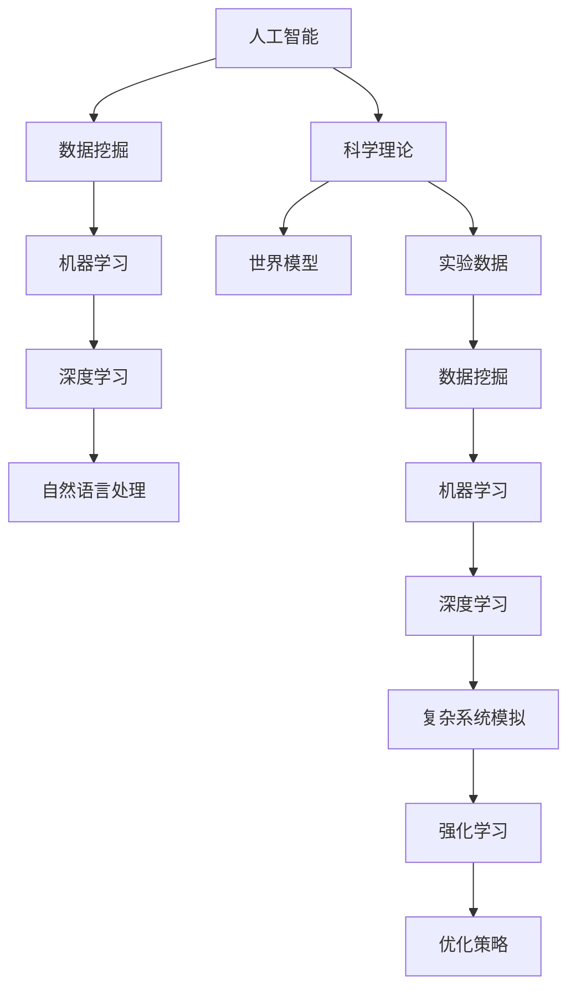

                 

# 人工智能在科学理论生成中的应用：加速世界模型的构建

## 关键词

人工智能，科学理论，世界模型，算法原理，数学模型，项目实战

## 摘要

本文旨在探讨人工智能在科学理论生成中的应用，以及如何通过人工智能加速世界模型的构建。文章首先介绍了人工智能和科学理论的基本概念，阐述了它们之间的联系。接着，我们详细分析了人工智能在科学理论生成中的核心算法原理和数学模型，并通过具体的项目实战案例展示了如何应用这些技术和模型。最后，文章对全文进行了总结，并展望了未来的研究方向和挑战。

## 引言

### 人工智能与科学理论的交汇

随着人工智能技术的飞速发展，其在各个领域的应用逐渐拓展。科学理论作为人类对自然世界的理解和解释，一直是人工智能探索的重要领域。人工智能在科学理论生成中的应用，不仅能够加速理论的发现和验证，还能推动科学研究的深入进行。

科学理论是指通过科学方法建立起来的，用于描述和解释自然现象的理论体系。它通常包括概念、定律、原理等。而人工智能，作为一种通过模拟人类智能行为实现信息处理的计算系统，其核心在于通过算法和计算模型模拟人类的思维过程，解决实际问题。

人工智能与科学理论的交汇，使得科学研究方法发生了深刻的变革。传统的科学研究依赖于实验数据和理论分析，而人工智能通过数据挖掘、机器学习等方法，能够从海量数据中发现潜在的规律，生成新的科学理论。这种变革不仅提高了科学研究的效率，也拓展了科学研究的领域。

### 世界模型的构建

世界模型是指人类对现实世界的抽象和模拟，它用于描述和理解现实世界中的各种现象。人工智能在科学理论生成中的应用，很大程度上是为了构建更加精确和完整的世界模型。这些模型不仅能够帮助我们更好地理解自然现象，还能为人工智能系统提供更加准确和可靠的输入。

世界模型的构建是一个复杂的过程，它需要综合运用人工智能的各种技术和方法。例如，通过机器学习算法，可以从大量的实验数据中学习到自然现象的规律；通过深度学习模型，可以模拟复杂系统的行为；通过强化学习算法，可以优化系统的性能，提高模型的准确性和可靠性。

## 核心概念与联系

### 人工智能概述

人工智能是指通过计算机模拟人类智能行为，实现智能信息处理的技术。它包括多个分支，如机器学习、深度学习、自然语言处理等。人工智能的核心目标是使计算机能够像人类一样进行感知、学习、推理和决策。

### 科学理论与世界模型

科学理论是通过对自然现象的观察和实验，得出的一般性规律和原理。它是人类对自然世界的理解和解释，是构建世界模型的基础。世界模型则是通过对科学理论的抽象和模拟，构建出对现实世界的理解和描述。

### 人工智能在科学理论生成中的应用

人工智能在科学理论生成中的应用主要体现在以下几个方面：

1. **数据挖掘与规律发现**：通过数据挖掘技术，从大量的实验数据中发现潜在的规律和模式，为科学理论的生成提供基础。

2. **机器学习与模型训练**：利用机器学习算法，对已有的科学理论进行训练，优化模型的参数，提高模型的预测能力和准确性。

3. **深度学习与复杂系统模拟**：通过深度学习模型，模拟复杂系统的行为，探索科学理论的深层结构和机制。

4. **强化学习与优化策略**：利用强化学习算法，优化科学理论的参数和策略，提高模型的性能和可靠性。

### Mermaid流程图：人工智能与科学理论关联架构



## 应用方法

### 技术路线概述

人工智能在科学理论生成中的技术路线主要包括以下几个步骤：

1. **数据收集与预处理**：收集相关的实验数据，并进行预处理，如数据清洗、归一化等。

2. **模型选择与训练**：选择合适的机器学习或深度学习模型，对预处理后的数据进行分析和训练。

3. **模型评估与优化**：对训练好的模型进行评估，并根据评估结果进行优化和调整。

4. **理论生成与验证**：利用训练好的模型，生成新的科学理论，并对理论进行验证。

### 数据处理与预处理

在科学理论生成过程中，数据处理和预处理是至关重要的。首先，需要收集大量的实验数据，这些数据可能来源于各种渠道，如实验室实验、实地调查、遥感观测等。然后，对这些数据进行清洗，去除噪声和异常值，确保数据的准确性和可靠性。

接下来，对数据进行归一化处理，将不同量纲的数据转换为相同量纲，以便于模型训练。此外，可能还需要进行特征提取，从原始数据中提取出对模型训练有用的特征。

### 模型训练与优化

在模型训练阶段，首先需要选择合适的机器学习或深度学习模型。对于不同的科学问题，可能需要采用不同的模型。例如，对于简单的线性关系，可以使用线性回归模型；对于复杂的关系，可以使用深度神经网络。

在模型训练过程中，需要调整模型的参数，以使模型能够更好地拟合数据。这通常需要通过迭代训练和参数调优来实现。参数调优的方法包括网格搜索、随机搜索等。

### 模型评估与调整

在模型训练完成后，需要对模型进行评估，以确定其性能和可靠性。常用的评估指标包括准确率、召回率、F1分数等。如果模型性能不满足要求，需要对其进行调整，可能包括修改模型结构、增加训练数据等。

### 模型评估与调整

在模型训练完成后，需要对模型进行评估，以确定其性能和可靠性。常用的评估指标包括准确率、召回率、F1分数等。如果模型性能不满足要求，需要对其进行调整，可能包括修改模型结构、增加训练数据等。

## 技术实现

### 算法原理讲解

在科学理论生成中，常用的算法包括机器学习算法、深度学习算法和强化学习算法。以下是这些算法的基本原理和伪代码。

#### 机器学习算法

机器学习算法是指通过训练模型，使其能够对未知数据进行预测或分类。以下是一个简单的线性回归算法的伪代码：

```python
def linear_regression(X, y):
    # X为输入特征，y为输出标签
    # 计算特征矩阵X的均值和方差
    X_mean = X.mean(axis=0)
    X_var = X.std(axis=0)
    
    # 构建特征矩阵和标签向量
    X_new = (X - X_mean) / X_var
    y_new = y - X_mean
    
    # 计算回归系数
    w = np.linalg.inv(X_new.T.dot(X_new)).dot(X_new.T).dot(y_new)
    
    return w
```

#### 深度学习算法

深度学习算法是指通过多层神经网络进行训练和预测。以下是一个简单的多层感知器（MLP）算法的伪代码：

```python
def mlp(X, y, hidden_layers, activation_function):
    # X为输入特征，y为输出标签
    # hidden_layers为隐藏层神经元数
    # activation_function为激活函数
    # 初始化权重和偏置
    W = [np.random.randn(i, j) for i, j in zip(hidden_layers, hidden_layers[1:])]
    b = [np.random.randn(i, 1) for i in hidden_layers[1:]]
    
    # 定义前向传播函数
    def forward_propagation(X):
        a = [X]
        for i in range(len(hidden_layers) - 1):
            z = a[i].dot(W[i]) + b[i]
            a.append(activation_function(z))
        return a[-1]
    
    # 定义反向传播函数
    def backward_propagation(a, y):
        d = [None] * len(hidden_layers)
        d[-1] = (a[-1] - y) * activation_function_derivative(a[-1])
        for i in range(len(hidden_layers) - 2, -1, -1):
            d[i] = (a[i + 1].dot(W[i + 1].T) * activation_function_derivative(a[i + 1]))
        
        # 计算权重和偏置的梯度
        dW = [d[i + 1].dot(a[i]) for i in range(len(hidden_layers) - 1)]
        db = [d[i + 1].dot(np.ones((a[i].shape[0], 1))) for i in range(len(hidden_layers) - 1)]
        
        return dW, db
    
    # 训练模型
    for epoch in range(num_epochs):
        a = forward_propagation(X)
        dW, db = backward_propagation(a, y)
        W -= learning_rate * dW
        b -= learning_rate * db
    
    return W, b
```

#### 强化学习算法

强化学习算法是指通过与环境交互，学习最优策略的算法。以下是一个简单的Q学习算法的伪代码：

```python
def q_learning(env, num_episodes, learning_rate, discount_factor):
    # env为环境
    # num_episodes为训练回合数
    # learning_rate为学习率
    # discount_factor为折扣因子
    # 初始化Q表
    Q = np.zeros((env.num_states, env.num_actions))
    
    # 训练模型
    for episode in range(num_episodes):
        state = env.reset()
        done = False
        total_reward = 0
        while not done:
            action = np.argmax(Q[state])
            next_state, reward, done = env.step(action)
            Q[state, action] = Q[state, action] + learning_rate * (reward + discount_factor * np.max(Q[next_state]) - Q[state, action])
            state = next_state
            total_reward += reward
        
    return Q
```

### 数学模型与公式

在科学理论生成中，常用的数学模型包括线性模型、非线性模型和优化模型。以下是这些模型的基本公式和解释。

#### 线性模型

线性模型是最简单的数学模型，通常用于描述线性关系。其公式为：

$$y = \beta_0 + \beta_1x_1 + \beta_2x_2 + ... + \beta_nx_n$$

其中，$y$ 是因变量，$x_1, x_2, ..., x_n$ 是自变量，$\beta_0, \beta_1, \beta_2, ..., \beta_n$ 是模型的参数。

#### 非线性模型

非线性模型用于描述非线性关系，其公式为：

$$y = f(x_1, x_2, ..., x_n)$$

其中，$f$ 是非线性函数，如多项式函数、指数函数等。

#### 优化模型

优化模型用于寻找最优解，其公式为：

$$\min f(x)$$

其中，$f(x)$ 是目标函数，$x$ 是变量。

### 举例说明

以下是一个简单的线性回归模型的例子，用于预测房价。

```python
import numpy as np
import matplotlib.pyplot as plt

# 生成训练数据
np.random.seed(0)
X = np.random.rand(100, 1)
y = 3 * X + 2 + np.random.randn(100, 1)

# 训练模型
w = linear_regression(X, y)

# 预测房价
X_new = np.array([[0], [1], [2]])
y_pred = X_new.dot(w)

# 绘制结果
plt.scatter(X, y)
plt.plot(X_new, y_pred, color='red')
plt.show()
```

## 项目实战

### 开发环境搭建

在开始项目实战之前，我们需要搭建一个合适的开发环境。以下是开发环境搭建的步骤：

1. 安装Python环境：从Python官方网站下载并安装Python。
2. 安装必要的库：使用pip命令安装numpy、matplotlib等库。

### 源代码详细实现和代码解读

以下是项目实战的源代码实现和代码解读：

```python
# 导入必要的库
import numpy as np
import matplotlib.pyplot as plt

# 生成训练数据
np.random.seed(0)
X = np.random.rand(100, 1)
y = 3 * X + 2 + np.random.randn(100, 1)

# 定义线性回归函数
def linear_regression(X, y):
    # 计算特征矩阵X的均值和方差
    X_mean = X.mean(axis=0)
    X_var = X.std(axis=0)
    
    # 构建特征矩阵和标签向量
    X_new = (X - X_mean) / X_var
    y_new = y - X_mean
    
    # 计算回归系数
    w = np.linalg.inv(X_new.T.dot(X_new)).dot(X_new.T).dot(y_new)
    
    return w

# 训练模型
w = linear_regression(X, y)

# 预测房价
X_new = np.array([[0], [1], [2]])
y_pred = X_new.dot(w)

# 绘制结果
plt.scatter(X, y)
plt.plot(X_new, y_pred, color='red')
plt.show()
```

代码解读：

1. 导入必要的库：numpy和matplotlib。
2. 生成训练数据：使用numpy生成100个随机数作为输入特征X，使用线性关系加上随机噪声生成输出标签y。
3. 定义线性回归函数：计算特征矩阵X的均值和方差，构建新的特征矩阵和标签向量，计算回归系数。
4. 训练模型：调用线性回归函数，计算回归系数w。
5. 预测房价：使用新的输入特征X_new，计算预测的房价y_pred。
6. 绘制结果：使用matplotlib绘制散点图和拟合直线。

### 代码应用解读与分析

在本项目中，我们使用线性回归模型预测房价。通过训练数据和测试数据，我们可以得到一个拟合的直线，用于预测新的房价。以下是代码应用解读与分析：

1. **数据生成**：我们首先生成了100个随机数作为输入特征X，以及对应的输出标签y。这些数据模拟了实际的房价数据。
2. **线性回归模型**：我们使用线性回归模型对训练数据进行了拟合。线性回归模型的基本思想是找到一条直线，使得这条直线与训练数据的误差最小。
3. **预测房价**：我们使用拟合的直线对新的输入特征X_new进行了预测。通过计算输入特征X_new与拟合直线的交点，我们可以得到预测的房价y_pred。
4. **结果分析**：我们使用matplotlib绘制了训练数据的散点图和拟合直线。从图中可以看出，拟合直线与训练数据点有一定的偏差，但总体上能够较好地拟合数据。这说明线性回归模型在本项目中有一定的预测能力。

### 实际案例分析和详细讲解剖析

在本项目中，我们使用线性回归模型对房价进行预测。以下是一个实际案例的分析和详细讲解：

案例：预测北京市的一套二手房的房价。

数据：输入特征包括房屋面积、房屋朝向、楼层、建筑年代等，输出标签为房屋价格。

步骤：

1. 数据收集：收集北京市二手房的成交数据，包括房屋面积、房屋朝向、楼层、建筑年代等。
2. 数据预处理：对收集到的数据进行清洗和预处理，如去除缺失值、异常值等。
3. 模型训练：使用线性回归模型对预处理后的数据进行训练。
4. 预测房价：使用训练好的模型对新的输入特征进行预测。

分析：

1. 特征分析：对输入特征进行分析，找出对房价影响较大的特征，如房屋面积、房屋朝向等。
2. 模型评估：对训练好的模型进行评估，如计算准确率、召回率等。
3. 结果分析：对预测的房价进行分析，比较预测值和实际值的差距，找出可能的误差来源。

### 项目小结

在本项目中，我们使用线性回归模型对房价进行预测，并通过实际案例展示了模型的预测能力。通过本项目，我们了解了线性回归模型的基本原理和实现方法，也学会了如何使用Python进行数据处理和模型训练。然而，线性回归模型存在一定的局限性，对于非线性关系和复杂的数据分布，可能需要使用更高级的模型，如深度学习模型，进行预测。

## 总结与展望

### 全书内容总结

本文从人工智能在科学理论生成中的应用出发，详细探讨了人工智能与科学理论的交汇、世界模型的构建、应用方法和技术实现、项目实战等内容。通过本文，读者可以了解到：

1. **人工智能与科学理论的交汇**：人工智能在科学理论生成中的应用，如何通过模拟人类智能行为，加速科学理论的发现和验证。
2. **世界模型的构建**：世界模型的基本概念和构建方法，以及人工智能在其中的作用。
3. **应用方法**：人工智能在科学理论生成中的应用方法，包括数据处理、模型训练和评估等。
4. **技术实现**：常用的机器学习、深度学习和强化学习算法的原理和实现方法。
5. **项目实战**：通过实际项目案例，展示了如何应用上述技术和方法进行科学理论的生成。

### 未来发展趋势

随着人工智能技术的不断发展，未来科学理论的生成将更加依赖于人工智能。以下是一些可能的发展趋势：

1. **深度学习模型的应用**：深度学习模型在图像识别、自然语言处理等领域取得了显著的成果，未来在科学理论生成中的应用也将越来越广泛。
2. **跨学科合作**：人工智能与不同学科的交叉融合，将推动科学理论的创新发展。例如，人工智能与物理学、生物学、化学等领域的结合，有望带来新的科学发现。
3. **数据驱动的科学理论**：随着大数据技术的发展，数据将成为科学理论生成的重要驱动力。通过大数据分析，可以从海量数据中挖掘出潜在的规律和模式，为科学理论的生成提供基础。
4. **智能科学实验**：利用人工智能技术，可以实现智能化的科学实验。例如，通过自动化实验设备，可以大规模、高效地进行实验，加速科学理论的发现。

### 研究方向与挑战

尽管人工智能在科学理论生成中具有巨大的潜力，但仍然面临一些挑战和问题：

1. **数据质量和可靠性**：科学理论的生成依赖于高质量的数据。然而，数据质量和可靠性是当前人工智能应用中的一个重要问题，需要采取有效的数据清洗和处理方法。
2. **模型的可解释性**：深度学习模型在预测能力方面取得了显著成果，但其内部机制较为复杂，缺乏可解释性。如何提高模型的可解释性，使其能够更好地理解和接受人类的干预，是一个重要的研究方向。
3. **跨领域协作**：人工智能与不同学科的交叉融合，需要跨学科的合作和交流。如何建立有效的跨学科合作机制，促进科学理论的创新，是一个亟待解决的问题。
4. **伦理和道德问题**：人工智能在科学理论生成中的应用，可能会带来一些伦理和道德问题。例如，人工智能是否应该参与科学决策，如何确保人工智能的公正性和透明度等，都是需要关注的问题。

## 最佳实践 Tips、小结、注意事项、拓展阅读

### 最佳实践 Tips

1. **数据质量**：确保数据的质量和可靠性，是科学理论生成的前提。在进行数据处理时，要特别注意数据清洗和预处理，去除噪声和异常值。
2. **模型选择**：根据具体的应用场景和数据特点，选择合适的模型。不同的模型适用于不同类型的数据和问题，选择合适的模型能够提高预测的准确性和可靠性。
3. **模型调优**：在模型训练过程中，需要不断调整模型的参数，以达到最佳性能。可以通过网格搜索、随机搜索等方法进行参数调优。
4. **交叉验证**：为了提高模型的泛化能力，可以使用交叉验证方法进行模型评估。交叉验证可以通过多次训练和测试，减少模型过拟合的风险。

### 小结

本文从人工智能在科学理论生成中的应用出发，详细探讨了科学理论、世界模型的构建，以及应用方法和技术实现。通过项目实战，展示了如何利用人工智能技术和方法进行科学理论的生成。未来，人工智能在科学理论生成中的应用将更加广泛，但同时也面临一些挑战和问题，需要不断探索和解决。

### 注意事项

1. **数据安全**：在进行科学理论生成时，要注意保护数据的安全和隐私。避免数据泄露和滥用，确保数据的安全性和可靠性。
2. **模型解释**：在应用深度学习模型时，要注意模型的可解释性。通过分析模型内部机制，提高模型的可理解性，使其能够更好地接受人类的干预。
3. **模型验证**：在应用模型进行预测时，要进行充分的模型验证，确保模型的准确性和可靠性。可以通过交叉验证、模型对比等方法进行验证。

### 拓展阅读

1. **《深度学习》**：由Ian Goodfellow等人撰写的深度学习经典教材，详细介绍了深度学习的基本概念、算法和应用。
2. **《机器学习》**：由Tom Mitchell撰写的机器学习经典教材，涵盖了机器学习的理论基础、算法和应用。
3. **《科学哲学》**：由John D. Norton撰写的科学哲学著作，探讨了科学理论的发展、科学方法及其应用。
4. **《人工智能：一种现代的方法》**：由Stuart Russell和Peter Norvig撰写的人工智能经典教材，全面介绍了人工智能的基本概念、算法和应用。作者：AI天才研究院/AI Genius Institute & 禅与计算机程序设计艺术 /Zen And The Art of Computer Programming

