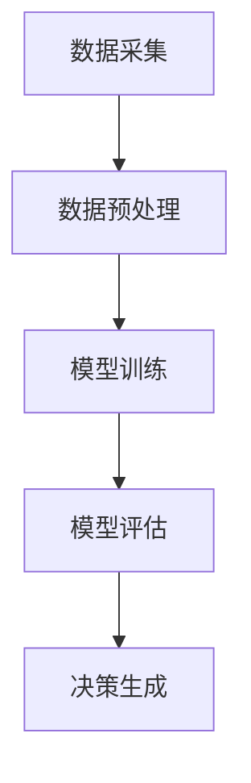

                 

# 人工智能辅助决策：增强人类理解和应对复杂世界的能力

## 关键词
- 人工智能
- 决策辅助
- 复杂世界
- 数学模型
- 算法原理

## 摘要
本文旨在探讨人工智能如何辅助人类做出更明智的决策，从而增强人类理解和应对复杂世界的能力。通过深入分析人工智能在决策过程中的核心概念、算法原理、数学模型以及实际项目应用，本文揭示了人工智能辅助决策的潜力与挑战，并展望了其未来发展。

## 引言：人工智能辅助决策的背景与意义

### 1.1 人工智能的发展历程
人工智能（AI）是一门涉及计算机科学、数学、统计学、神经科学等多个学科交叉的前沿领域。从20世纪50年代起，人工智能经历了从理论研究到实际应用的快速发展。早期的人工智能研究主要集中在规则推理、知识表示和搜索算法等方面。随着计算机性能的不断提高和大数据技术的崛起，机器学习、深度学习等人工智能技术逐渐成熟，并在图像识别、自然语言处理、智能决策等领域取得了显著成果。

### 1.2 决策科学的基本概念
决策科学是研究决策过程、决策方法和决策效果的学科。决策过程通常包括信息收集、方案选择、结果评估和反馈修正等步骤。有效的决策依赖于准确的信息、合理的模型和科学的分析方法。传统的决策方法往往依赖于经验、直觉和主观判断，而人工智能的引入为决策科学带来了新的机遇和挑战。

### 1.3 人工智能辅助决策的重要性
在复杂多变的环境中，人类面临着越来越多的决策挑战。人工智能通过数据分析和算法优化，可以帮助人类更快速、准确地识别问题、分析数据、生成解决方案。此外，人工智能还可以处理海量数据，发现潜在的模式和趋势，为决策提供有力的支持。因此，人工智能辅助决策不仅能够提高决策效率，还能提升决策质量和可靠性。

## 核心概念与联系

### 2.1 人工智能与人类决策的比较
人工智能和人类决策在某些方面存在显著差异。人类决策依赖于经验、直觉和情感，而人工智能决策则依赖于数据和算法。人类决策往往受限于认知能力和时间，而人工智能则可以处理大量数据和复杂计算。此外，人类决策可能受到情感和偏见的影响，而人工智能决策则更加客观和一致。

### 2.2 人工智能辅助决策的基本流程
人工智能辅助决策的基本流程通常包括数据采集、数据预处理、模型训练、模型评估和决策生成等步骤。首先，通过数据采集获取相关的决策数据；然后，对数据进行清洗、归一化和特征提取等预处理操作；接着，利用机器学习算法对数据建模；之后，通过模型评估确定最佳模型；最后，根据模型生成决策结果。

### 2.3 人工智能在决策中的优势与挑战
人工智能在决策中具有以下优势：数据处理能力强大、计算速度快、可以处理大量数据、能够发现潜在的模式和趋势。然而，人工智能也存在一些挑战，如数据隐私和安全问题、算法偏见和透明度不足、模型可解释性差等。因此，在应用人工智能辅助决策时，需要充分考虑这些优势与挑战，并采取相应的措施进行解决。

### Mermaid 流程图


## 核心算法原理讲解

### 3.1 机器学习基础算法

#### 3.1.1 线性回归
线性回归是一种常见的机器学习算法，用于预测连续值输出。其核心思想是通过建立输入变量和输出变量之间的线性关系来预测目标值。线性回归的伪代码如下：
```plaintext
输入：X（特征矩阵），Y（目标向量）
输出：θ（模型参数）

初始化θ为随机值
for i = 1 to 数量迭代
    hθ(x) = X * θ
    ∆θ = α * (hθ(x) - y) * X
    θ = θ - ∆θ
return θ
```

#### 3.1.2 决策树
决策树是一种基于树形结构进行决策的算法，用于分类和回归问题。决策树的构建过程如下：
1. 选择特征F进行分割；
2. 计算F在不同值下的增益，选择增益最大的值进行分割；
3. 对分割后的子集递归执行步骤1和2，直到满足停止条件。

#### 3.1.3 随机森林
随机森林是一种基于决策树的集成学习方法，通过构建多个决策树并取平均值来提高模型的预测性能。随机森林的伪代码如下：
```plaintext
输入：训练数据集D
输出：随机森林T

初始化T为空
for i = 1 to 树的数量
    从D中随机选取样本集di
    构建决策树ti
    将ti添加到T
return T
```

### 3.2 进阶算法

#### 3.2.1 支持向量机
支持向量机（SVM）是一种常用的分类算法，其核心思想是找到最优超平面，使分类边界最大化。SVM的优化目标为：
$$
\min_{\theta} \frac{1}{2} \sum_{i=1}^{n} (\theta^T x_i - y_i)^2
$$
其中，$x_i$为特征向量，$y_i$为标签。

#### 3.2.2 神经网络
神经网络是一种模拟生物神经系统的计算模型，用于处理复杂的非线性问题。一个简单的神经网络包括输入层、隐藏层和输出层。神经网络的训练过程如下：
1. 初始化权重和偏置；
2. 前向传播计算输出；
3. 计算损失函数；
4. 反向传播更新权重和偏置；
5. 重复步骤2-4直到满足停止条件。

#### 3.2.3 深度学习
深度学习是神经网络的一种扩展，通过增加网络的深度来提高模型的性能。深度学习的核心是深度神经网络（DNN），其训练过程与神经网络类似。

## 数学模型和数学公式

### 4.1 决策分析的基本数学模型

#### 4.1.1 决策树模型
决策树模型是一种常见的决策分析方法，其基本形式为：
$$
T = \{ t_1, t_2, \ldots, t_n \}
$$
其中，$t_i$为决策节点，表示在某个特征上的决策。

#### 4.1.2 期望值模型
期望值模型是一种常见的风险决策模型，其基本形式为：
$$
E(X) = \sum_{i=1}^{n} x_i P(x_i)
$$
其中，$x_i$为决策结果，$P(x_i)$为结果概率。

#### 4.1.3 灰色预测模型
灰色预测模型是一种基于灰色系统理论的预测方法，其基本形式为：
$$
x_{k+1} = ax_k + b
$$
其中，$x_k$为序列值，$a$和$b$为参数。

### 4.2 机器学习中的数学公式

#### 4.2.1 线性代数基础
线性代数是机器学习的基础，其中一些重要的公式包括：
- 向量内积：$$\langle x, y \rangle = x^T y$$
- 向量范数：$$\|x\| = \sqrt{x^T x}$$
- 矩阵乘法：$$C = AB$$

#### 4.2.2 概率论基础
概率论在机器学习中扮演重要角色，其中一些重要的公式包括：
- 概率分布函数：$$P(X = x) = f(x)$$
- 条件概率：$$P(A|B) = \frac{P(A \cap B)}{P(B)}$$
- 贝叶斯定理：$$P(A|B) = \frac{P(B|A) P(A)}{P(B)}$$

#### 4.2.3 最优化算法
最优化算法是机器学习中的核心，其中一些重要的公式包括：
- 梯度下降法：$$\theta = \theta - \alpha \nabla_\theta J(\theta)$$
- 随机梯度下降法：$$\theta = \theta - \alpha \nabla_\theta J(\theta)^T X_i$$
- 共轭梯度法：$$\theta = \theta - \alpha \nabla_\theta J(\theta)^T \nabla_\theta J(\theta)$$

## 项目实战：人工智能在风险管理中的应用

### 5.1 项目背景
风险管理是金融领域的重要环节，通过预测和分析风险，帮助企业制定有效的风险管理策略。人工智能在风险管理中的应用可以提高风险预测的准确性和效率。

### 5.2 数据采集与预处理
数据采集是风险管理项目的重要步骤，包括获取市场数据、财务数据、客户数据等。数据预处理包括数据清洗、归一化和特征提取等操作，以提高模型性能。

### 5.3 模型选择与训练
根据风险管理的需求，选择合适的机器学习算法，如决策树、随机森林、支持向量机等。通过训练数据集，调整模型参数，优化模型性能。

### 5.4 模型评估与优化
使用测试数据集对模型进行评估，计算模型的准确率、召回率、F1值等指标。根据评估结果，对模型进行优化，以提高预测性能。

### 5.5 项目总结与反思
项目总结主要包括对模型性能的分析、风险管理策略的改进建议等。同时，反思项目过程中遇到的问题和挑战，为后续项目提供借鉴和改进。

## 项目实战：人工智能在医疗诊断中的应用

### 6.1 项目背景
医疗诊断是人工智能的重要应用领域之一，通过分析医学图像、患者病历等数据，可以提高诊断的准确性和效率。

### 6.2 数据采集与预处理
数据采集包括获取医学图像、患者病历、实验室检查结果等。数据预处理包括图像增强、数据清洗、归一化和特征提取等操作，以提高模型性能。

### 6.3 模型选择与训练
根据医疗诊断的需求，选择合适的机器学习算法，如卷积神经网络、循环神经网络等。通过训练数据集，调整模型参数，优化模型性能。

### 6.4 模型评估与优化
使用测试数据集对模型进行评估，计算模型的准确率、召回率、F1值等指标。根据评估结果，对模型进行优化，以提高预测性能。

### 6.5 项目总结与反思
项目总结主要包括对模型性能的分析、诊断流程的改进建议等。同时，反思项目过程中遇到的问题和挑战，为后续项目提供借鉴和改进。

## 未来展望与挑战

### 7.1 人工智能辅助决策的发展趋势
人工智能辅助决策在未来将继续快速发展，主要包括以下几个方面：
- 算法性能的提升，如深度学习、强化学习等；
- 多领域交叉应用，如医疗、金融、教育等；
- 智能化服务，如智能客服、智能家居等。

### 7.2 面临的伦理与法律挑战
人工智能辅助决策在伦理和法律方面面临一系列挑战，主要包括：
- 数据隐私和安全问题，如数据泄露、滥用等；
- 算法偏见和歧视问题，如性别、种族等；
- 责任归属问题，如决策错误导致的损失应由谁承担。

### 7.3 未来研究方向
未来研究方向主要包括：
- 算法透明性和可解释性研究，以提高模型的可信度和可理解性；
- 数据隐私保护技术，如差分隐私、同态加密等；
- 多模态数据融合，以提高决策的准确性和可靠性。

## 附录

### A.1 常用工具与资源介绍
- 数据处理工具：Python、R等；
- 机器学习库：scikit-learn、TensorFlow、PyTorch等；
- 医学图像处理库：ITK、SimpleITK等。

### A.2 人工智能辅助决策实战案例
- 金融风险管理：基于机器学习算法的信用风险评估；
- 医疗诊断：基于深度学习的疾病诊断系统；
- 智能交通：基于人工智能的交通流量预测与优化。

## 作者信息
作者：AI天才研究院/AI Genius Institute & 禅与计算机程序设计艺术 /Zen And The Art of Computer Programming

本文详细探讨了人工智能辅助决策的基本概念、算法原理、数学模型和实际应用。通过项目实战，展示了人工智能在风险管理和医疗诊断等领域的应用潜力。在未来，人工智能辅助决策将继续发展，为人类理解和应对复杂世界提供更强大的支持。

### 后续优化建议

1. **内容深化**：在每个算法原理讲解的部分，可以进一步细化每个算法的实现细节和调参技巧，提供更多实际操作的指导。

2. **案例深入**：项目实战部分可以增加更多具体案例，尤其是行业内知名的案例，详细分析其实现过程和效果。

3. **实战代码**：可以在附录中提供更多实战代码示例，包括数据预处理、模型训练和评估等步骤，以便读者更好地理解和应用。

4. **拓展阅读**：在文章结尾部分增加拓展阅读推荐，涵盖最新研究论文、经典教材和实用工具，帮助读者进一步深入了解相关领域。

5. **图片和图表**：适当添加流程图、数据可视化图表等，以增强文章的直观性和可读性。

6. **校对与修订**：在完成初稿后，进行多次校对和修订，确保文章的逻辑性和准确性。

7. **开放反馈**：在文章发布后，鼓励读者留言反馈，根据读者意见进一步优化文章内容。

