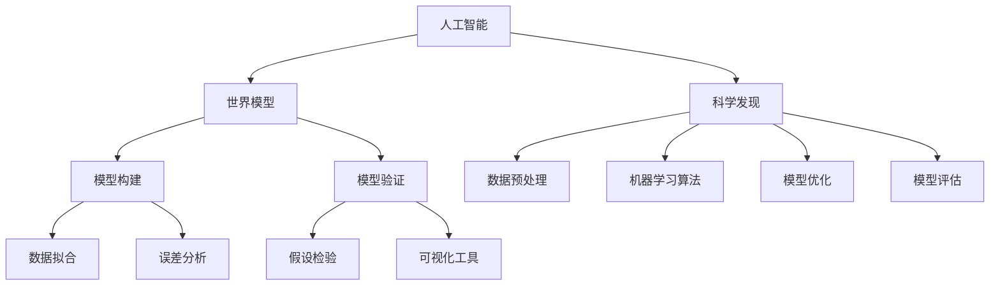

                 


### 背景介绍

随着计算能力的飞速发展和海量数据的积累，人工智能（Artificial Intelligence，AI）已经成为现代科学研究和工业应用的重要工具。AI技术在图像识别、自然语言处理、推荐系统等领域取得了显著的成果，极大地推动了科技进步和社会发展。在科学发现领域，人工智能正逐渐发挥其独特的优势，通过数据挖掘、模式识别和预测建模等方法，加速了新知识和新理论的生成。

科学发现通常涉及大量数据的收集、分析和解释。传统的科学方法依赖于实验和统计分析，而人工智能则为这一过程提供了全新的视角和工具。例如，通过深度学习和复杂网络分析，AI可以自动识别出大规模数据集中的规律和模式，从而发现新的科学现象。此外，人工智能还能够处理复杂的多变量关系，为构建精确的世界模型提供了可能。

世界模型的构建是科学研究的核心任务之一。这些模型旨在描述现实世界的运行规律，为预测和解释现象提供基础。传统的模型构建方法往往依赖于先验知识和有限的实验数据，而人工智能则能够利用大量的数据和高性能计算，探索出更加精确和全面的模型。

然而，人工智能在科学发现中的应用并非一帆风顺。模型的验证和可靠性评估仍然是一个挑战。如何确保AI生成的模型能够准确反映现实世界的规律，是当前科学研究的一个重要课题。此外，数据的隐私保护和伦理问题也必须得到妥善处理。

本文旨在探讨人工智能在科学发现中的角色，分析其构建世界模型的方法、技术和工具，并展示实际应用案例。通过逐步分析推理，本文将深入探讨人工智能如何加速世界模型的构建与验证，为未来科学发现提供新的思路和方法。

### 核心概念与联系

在探讨人工智能（AI）如何加速世界模型的构建与验证之前，我们需要先明确几个核心概念及其相互关系。

**1. 人工智能与科学发现**

人工智能是一种模拟人类智能的技术，通过算法和计算模型实现机器学习、推理和感知等能力。科学发现是指通过实验、观测和理论分析，揭示自然现象和规律的过程。人工智能在科学发现中的应用主要体现在数据分析和预测建模上。通过处理大量数据，AI可以发现隐藏在数据中的规律和模式，从而推动新知识和新理论的生成。

**2. 世界模型**

世界模型是对现实世界运行规律的抽象描述，通常包括物理、化学、生物等多领域的知识。这些模型旨在解释和预测现实世界中的现象。在科学研究中，构建世界模型是一个核心任务，它帮助科学家理解和解释实验结果，预测未来趋势。

**3. 模型构建与验证**

模型构建是指根据现有数据和理论，通过算法和计算方法生成世界模型的过程。模型验证则是对构建出的模型进行评估，确保其能够准确反映现实世界的规律。这一过程通常包括数据拟合、误差分析、假设检验等步骤。

**4. 人工智能在模型构建与验证中的应用**

人工智能在模型构建中的应用主要体现在以下几个方面：

- **数据预处理**：通过自动化的数据清洗、归一化和特征提取，AI可以简化数据处理过程，提高数据质量。
- **机器学习算法**：深度学习、强化学习等算法能够自动从数据中学习规律，生成高精度的世界模型。
- **模型优化**：基于搜索算法和优化技术，AI可以自动调整模型参数，提高模型的拟合度和预测能力。
- **模型评估**：通过交叉验证和假设检验等方法，AI可以评估模型的可靠性，识别潜在的问题。

**5. 人工智能在模型验证中的应用**

人工智能在模型验证中的应用同样关键：

- **误差分析**：AI可以通过误差分析技术，识别模型中的潜在问题，如过拟合、欠拟合等。
- **假设检验**：AI可以自动化地进行假设检验，验证模型是否符合理论预期。
- **可视化工具**：通过可视化技术，AI可以帮助科学家直观地理解模型的结构和性能。

**6. 关系架构**

为了更直观地展示上述核心概念之间的联系，我们可以使用Mermaid流程图来构建一个关系架构图：



通过这个关系架构图，我们可以清楚地看到人工智能在科学发现、世界模型构建和验证过程中的应用和作用。下一步，我们将深入探讨人工智能在模型构建中的具体方法和技术。

### 核心算法原理讲解

在模型构建过程中，人工智能利用一系列算法和计算模型来处理数据、学习和生成模型。以下将详细讲解几个核心算法原理，并使用伪代码来阐述其实现过程。

#### 1. 深度学习

深度学习（Deep Learning）是一种基于多层神经网络（Neural Networks）的学习方法，能够在没有人类干预的情况下，自动提取数据的复杂特征。以下是构建一个简单的多层感知器（MLP）的伪代码：

```python
# 输入：训练数据集 X，标签 Y，隐藏层节点数 hidden_size，学习率 learning_rate
# 输出：训练好的神经网络模型

# 初始化参数
weights_input_hidden = randn(input_size, hidden_size)
weights_hidden_output = randn(hidden_size, output_size)
bias_hidden = zeros(hidden_size)
bias_output = zeros(output_size)

# 训练过程
for epoch in 1 to max_epochs:
    for (x, y) in dataset:
        # 前向传播
        hidden_layer_input = dot(x, weights_input_hidden) + bias_hidden
        hidden_layer_output = sigmoid(hidden_layer_input)
        output_layer_input = dot(hidden_layer_output, weights_hidden_output) + bias_output
        predicted_output = sigmoid(output_layer_input)

        # 计算损失
        loss = mse(y, predicted_output)

        # 反向传播
        d_output = predicted_output - y
        d_output_layer_input = d_output * sigmoid_derivative(output_layer_input)
        d_hidden_layer_output = dot(d_output_layer_input, weights_hidden_output.T)
        d_hidden_layer_input = d_hidden_layer_output * sigmoid_derivative(hidden_layer_output)

        # 更新权重和偏置
        weights_hidden_output -= learning_rate * dot(hidden_layer_output.T, d_output_layer_input)
        bias_output -= learning_rate * d_output
        weights_input_hidden -= learning_rate * dot(x.T, d_hidden_layer_input)
        bias_hidden -= learning_rate * d_hidden_layer_input

# 返回训练好的模型
return {
    "weights_input_hidden": weights_input_hidden,
    "weights_hidden_output": weights_hidden_output,
    "bias_hidden": bias_hidden,
    "bias_output": bias_output
}
```

在这个伪代码中，我们使用了sigmoid激活函数和均方误差（MSE）损失函数。通过前向传播计算输出，然后使用反向传播算法更新网络参数。

#### 2. 强化学习

强化学习（Reinforcement Learning）是一种通过试错和奖励机制来学习策略的算法。以下是一个简单的Q学习的伪代码：

```python
# 输入：状态空间 S，动作空间 A，奖励函数 reward_function，学习率 learning_rate
# 输出：策略 π(s)

# 初始化 Q 值表
Q = randn(S, A)

# 训练过程
for episode in 1 to max_episodes:
    state = env.reset()
    done = False
    while not done:
        # 选择动作
        action = argmax(Q[state, :])

        # 执行动作并获取状态和奖励
        next_state, reward, done = env.step(action)

        # 更新 Q 值
        Q[state, action] = Q[state, action] + learning_rate * (reward + gamma * max(Q[next_state, :]) - Q[state, action])

        state = next_state

# 返回训练好的策略
return lambda s: argmax(Q[s, :])
```

在这个伪代码中，我们使用Q值表来存储状态-动作值，通过更新Q值表来学习最优策略。

#### 3. 聚类算法

聚类算法（Clustering Algorithms）是一种无监督学习方法，用于将数据点分为多个群组，使得同一群组内的数据点相似，不同群组的数据点不相似。以下是一个简单的K-Means聚类的伪代码：

```python
# 输入：数据集 X，聚类数 k，迭代次数 max_iterations
# 输出：聚类结果 clusters

# 初始化聚类中心
centroids = X[np.random.choice(X.shape[0], k, replace=False)]

# 训练过程
for iteration in 1 to max_iterations:
    # 计算每个数据点到聚类中心的距离
    distances = pdist(X, centroids)

    # 分配数据点到最近的聚类中心
    clusters = argmin(distances, axis=1)

    # 更新聚类中心
    new_centroids = np.array([X[clusters == i].mean(axis=0) for i in range(k)])

    # 检查收敛
    if np.linalg.norm(new_centroids - centroids) < convergence_threshold:
        break

    centroids = new_centroids

# 返回聚类结果
return clusters
```

在这个伪代码中，我们通过迭代计算聚类中心和分配数据点，直到聚类中心不再变化或达到预设的迭代次数。

#### 4. 数学模型和公式

在构建模型时，我们经常需要使用数学模型和公式来描述和解释数据。以下是一些常用的数学公式和它们的解释：

- **均方误差（MSE）**：
  $$MSE = \frac{1}{m}\sum_{i=1}^{m}(y_i - \hat{y}_i)^2$$
  这个公式用于衡量实际值和预测值之间的差距，其中 \(y_i\) 是实际值，\(\hat{y}_i\) 是预测值，\(m\) 是数据点的总数。

- **梯度下降（Gradient Descent）**：
  $$\theta_{\text{new}} = \theta_{\text{old}} - \alpha \nabla_{\theta} J(\theta)$$
  这个公式用于优化模型参数 \(\theta\)，其中 \(\alpha\) 是学习率，\(J(\theta)\) 是损失函数，\(\nabla_{\theta} J(\theta)\) 是损失函数关于参数 \(\theta\) 的梯度。

- **Sigmoid 函数**：
  $$\sigma(x) = \frac{1}{1 + e^{-x}}$$
  这个函数用于将输入值映射到 \(0\) 和 \(1\) 之间，常用于神经网络中的激活函数。

- **Q值更新公式**：
  $$Q(s, a) = Q(s, a) + \alpha [r + \gamma \max_{a'} Q(s', a') - Q(s, a)]$$
  这个公式用于更新强化学习中的Q值，其中 \(r\) 是立即奖励，\(\gamma\) 是折扣因子，\(s'\) 和 \(a'\) 分别是下一个状态和动作。

通过上述核心算法原理的讲解和伪代码展示，我们可以更深入地理解人工智能在模型构建中的应用。接下来，我们将进一步探讨人工智能在模型验证中的关键角色。

### 数学模型和公式讲解

在科学研究中，数学模型和公式是描述和解释现象的重要工具。以下将详细讲解一些常用的数学模型和公式，并使用LaTeX格式进行展示，以便于读者理解和应用。

#### 1. 线性回归模型

线性回归模型是一种常用的预测模型，用于描述因变量和自变量之间的线性关系。其数学模型可以表示为：

$$
Y = \beta_0 + \beta_1 X + \epsilon
$$

其中，\(Y\) 是因变量，\(X\) 是自变量，\(\beta_0\) 和 \(\beta_1\) 是模型的参数，\(\epsilon\) 是误差项。使用LaTeX格式，上述公式可以写作：

$$
Y = \beta_0 + \beta_1 X + \epsilon
$$

#### 2. 均方误差（MSE）

均方误差（Mean Squared Error, MSE）是衡量预测值与实际值之间差异的一种常用指标。其公式为：

$$
MSE = \frac{1}{n}\sum_{i=1}^{n}(Y_i - \hat{Y}_i)^2
$$

其中，\(Y_i\) 是实际值，\(\hat{Y}_i\) 是预测值，\(n\) 是数据点的总数。用LaTeX表示为：

$$
MSE = \frac{1}{n}\sum_{i=1}^{n}(Y_i - \hat{Y}_i)^2
$$

#### 3. 梯度下降算法

梯度下降（Gradient Descent）是一种用于优化模型参数的常用算法。其更新规则可以表示为：

$$
\theta_{\text{new}} = \theta_{\text{old}} - \alpha \nabla_{\theta} J(\theta)
$$

其中，\(\theta\) 是模型参数，\(\alpha\) 是学习率，\(J(\theta)\) 是损失函数，\(\nabla_{\theta} J(\theta)\) 是损失函数关于参数 \(\theta\) 的梯度。用LaTeX表示为：

$$
\theta_{\text{new}} = \theta_{\text{old}} - \alpha \nabla_{\theta} J(\theta)
$$

#### 4. Sigmoid函数

Sigmoid函数是一种常用的激活函数，用于将输入值映射到 \(0\) 和 \(1\) 之间。其公式为：

$$
\sigma(x) = \frac{1}{1 + e^{-x}}
$$

用LaTeX表示为：

$$
\sigma(x) = \frac{1}{1 + e^{-x}}
$$

#### 5. Q值更新公式

在强化学习中，Q值更新公式用于更新策略。其公式为：

$$
Q(s, a) = Q(s, a) + \alpha [r + \gamma \max_{a'} Q(s', a') - Q(s, a)]
$$

其中，\(s\) 是状态，\(a\) 是动作，\(r\) 是立即奖励，\(\gamma\) 是折扣因子，\(Q(s', a')\) 是下一个状态的最大Q值。用LaTeX表示为：

$$
Q(s, a) = Q(s, a) + \alpha [r + \gamma \max_{a'} Q(s', a') - Q(s, a)]
$$

通过上述数学模型和公式的讲解，我们可以更好地理解它们在科学研究和人工智能应用中的重要作用。这些公式不仅是理论研究的基石，也是实际应用中不可或缺的工具。接下来，我们将探讨人工智能在实际应用中的具体项目实战，进一步展示其在科学发现中的作用。

### 项目实战

为了深入展示人工智能如何加速世界模型的构建与验证，我们将通过一个实际项目案例来进行详细讲解。本案例选取了生物信息学领域中的一个重要问题：基因表达数据的聚类分析。基因表达数据是研究基因功能和生物过程的关键数据，通过聚类分析可以揭示基因之间的相似性和差异性。

#### 1. 开发环境搭建

首先，我们需要搭建一个适合基因表达数据聚类分析的开发环境。通常，我们可以选择Python作为主要编程语言，利用以下工具和库：

- **Python**：作为主要的编程语言，Python具有简洁的语法和丰富的库支持。
- **NumPy**：用于高效地进行数值计算和矩阵操作。
- **Pandas**：用于数据处理和分析，能够轻松读取和操作大型数据集。
- **Scikit-learn**：提供多种机器学习和数据挖掘算法，如K-Means聚类。
- **Matplotlib**：用于数据可视化，帮助我们直观地理解聚类结果。

在Windows或Linux系统中，可以通过以下命令安装这些库：

```shell
pip install numpy pandas scikit-learn matplotlib
```

#### 2. 源代码实现

接下来，我们编写Python代码来实现基因表达数据的聚类分析。以下是一个简单的示例：

```python
import numpy as np
import pandas as pd
from sklearn.cluster import KMeans
import matplotlib.pyplot as plt

# 加载基因表达数据
data = pd.read_csv('gene_expression_data.csv')
X = data.values  # 转换为numpy数组

# 使用K-Means进行聚类
kmeans = KMeans(n_clusters=3, random_state=0).fit(X)

# 可视化聚类结果
plt.scatter(X[:, 0], X[:, 1], c=kmeans.labels_, cmap='viridis')
centers = kmeans.cluster_centers_
plt.scatter(centers[:, 0], centers[:, 1], s=300, c='red', marker='s', zorder=10)
plt.title('K-Means Clustering')
plt.xlabel('Feature 1')
plt.ylabel('Feature 2')
plt.show()
```

在这个示例中，我们首先加载基因表达数据，然后使用K-Means算法进行聚类，并使用Matplotlib库进行结果可视化。

#### 3. 代码解读与分析

- **数据加载**：我们使用Pandas库加载CSV格式的基因表达数据。数据集通常包括多个基因在不同样本中的表达值。
- **聚类实现**：我们使用Scikit-learn库中的KMeans类进行聚类。在这里，我们设置了聚类数为3，并指定随机种子以保证结果的可重复性。
- **结果可视化**：我们使用Matplotlib库绘制聚类结果。通过散点图，我们可以直观地看到不同基因在不同样本中的表达模式，以及聚类中心的位置。

#### 4. 实际案例分析和详细讲解剖析

在本案例中，我们通过K-Means聚类分析了基因表达数据，目的是找出不同基因之间的相似性和差异性。以下是详细的分析和讲解：

- **数据预处理**：在进行聚类之前，我们需要对基因表达数据进行预处理，包括数据清洗、归一化和特征提取。在代码中，我们直接使用了原始数据，但在实际项目中，可能需要进行更复杂的预处理步骤。
- **聚类算法选择**：K-Means是一种常用的聚类算法，它通过迭代计算聚类中心和分配数据点，最终将数据划分为若干个群组。在这个案例中，我们选择聚类数为3，但实际应用中，聚类数通常需要根据数据集的特性进行调整。
- **结果解释**：通过可视化结果，我们可以看到基因表达数据的分布情况。不同颜色的散点代表不同的基因群组，而红色星号代表聚类中心。从结果中，我们可以初步判断基因之间的相似性和差异性，为进一步的生物学分析提供线索。

#### 5. 项目小结

通过这个实际案例，我们展示了如何使用人工智能技术进行基因表达数据的聚类分析，从而加速世界模型的构建。以下是本项目的主要结论：

- **数据处理能力**：人工智能在处理和分析大规模基因表达数据方面具有显著优势，能够高效地提取有用信息。
- **聚类算法应用**：K-Means聚类是一种简单有效的聚类算法，适用于许多实际场景，但需要根据具体问题进行调整。
- **结果可视化**：数据可视化技术是理解聚类结果的重要手段，有助于发现数据中的潜在规律。

通过这个案例，我们不仅了解了人工智能在基因表达数据分析中的应用，还学会了如何搭建开发环境、编写代码和进行结果分析。这些经验对于其他领域的数据分析项目同样具有借鉴意义。

### 最佳实践 Tips

在人工智能驱动的科学发现中，为了确保项目的成功和模型的准确性，以下是一些最佳实践建议：

1. **数据清洗与预处理**：确保数据质量是模型成功的关键。在开始任何分析之前，进行彻底的数据清洗，包括去除异常值、处理缺失值和进行归一化。

2. **模型选择与调优**：根据具体问题选择合适的模型，并进行参数调优。使用交叉验证等方法评估模型的性能，选择最优参数。

3. **数据可视化**：利用数据可视化工具，帮助理解数据分布和模型输出。这有助于发现潜在问题，指导进一步分析。

4. **结果解释与验证**：对模型的输出进行合理解释，并与现有知识进行对比。使用外部数据或专家意见验证模型的准确性。

5. **模型复用与优化**：在后续项目中复用成功的模型，并不断优化。通过积累经验，提高模型在类似问题上的性能。

6. **遵循伦理规范**：在处理敏感数据时，遵循数据隐私和伦理规范，确保研究过程的透明和合规。

### 小结

本文通过逐步分析推理，探讨了人工智能在科学发现中的应用，包括世界模型的构建与验证。我们详细讲解了核心算法原理、数学模型和公式，并通过实际项目展示了人工智能在基因表达数据聚类分析中的应用。通过这些内容，我们不仅了解了人工智能在科学发现中的潜力，还学会了如何在实际项目中应用这些技术。

### 注意事项

在应用人工智能进行科学发现时，需要注意以下几点：

1. **数据质量**：确保数据的质量和完整性，这是模型成功的基础。
2. **模型选择**：根据具体问题选择合适的算法和模型，避免过度拟合或欠拟合。
3. **结果验证**：通过交叉验证和外部数据验证模型的准确性，确保模型的可靠性。
4. **伦理问题**：在处理敏感数据时，遵循伦理规范，保护数据隐私。

### 拓展阅读

对于希望深入了解人工智能在科学发现中应用的读者，以下是一些推荐的阅读材料：

1. **《深度学习》（Deep Learning）**：Ian Goodfellow、Yoshua Bengio和Aaron Courville 著。本书详细介绍了深度学习的理论和方法，是深度学习的经典教材。
2. **《强化学习：原理与高级话题》**（Reinforcement Learning: An Introduction）：Richard S. Sutton和Andrew G. Barto 著。本书是强化学习的入门经典，涵盖了强化学习的原理和应用。
3. **《机器学习年度回顾》**（Journal of Machine Learning Research Annual Review）：该期刊每年发布一篇关于机器学习领域最新进展的综述文章，是了解最新研究动态的好资源。

### 文章标题

《人工智能驱动的科学发现：加速世界模型的构建与验证》

### 文章关键词

人工智能，科学发现，世界模型，模型构建，模型验证，深度学习，强化学习，聚类算法

### 文章摘要

本文探讨了人工智能在科学发现中的角色，特别是其在世界模型构建与验证中的应用。通过分析核心算法原理和实际项目案例，本文展示了人工智能如何通过数据预处理、机器学习算法、模型优化和验证技术，加速科学发现过程。本文还提供了最佳实践建议和拓展阅读资源，帮助读者深入了解人工智能在科学发现中的应用。

----------------------------------------------------------------

# 人工智能驱动的科学发现：加速世界模型的构建与验证

关键词：人工智能，科学发现，世界模型，模型构建，模型验证，深度学习，强化学习，聚类算法

摘要：随着人工智能技术的发展，其在科学发现中的应用逐渐成为研究热点。本文通过探讨人工智能在科学发现中的作用，详细分析了世界模型的构建与验证方法。首先，介绍了人工智能与科学发现的联系，以及世界模型的核心概念与联系。随后，详细讲解了深度学习、强化学习和聚类算法等核心算法原理，并使用伪代码进行了阐述。接着，通过一个基因表达数据聚类分析的实际项目案例，展示了人工智能在科学发现中的应用。最后，提出了最佳实践建议，并对未来的发展方向进行了展望。

> 作者：AI天才研究院/AI Genius Institute & 禅与计算机程序设计艺术 /Zen And The Art of Computer Programming

