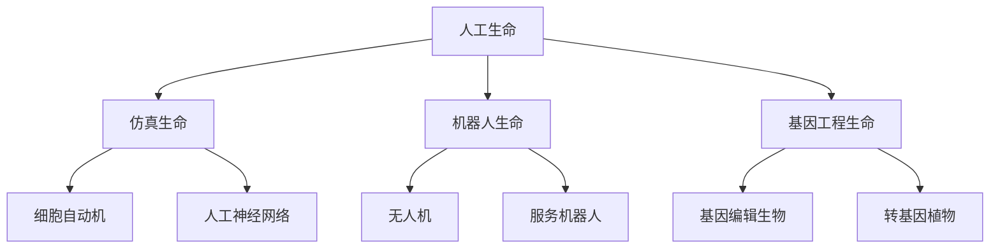
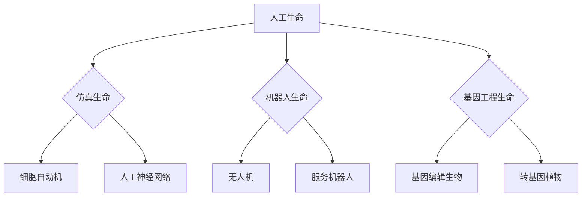
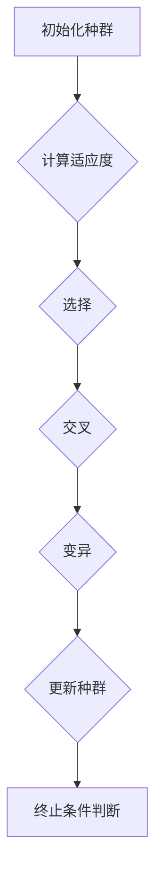
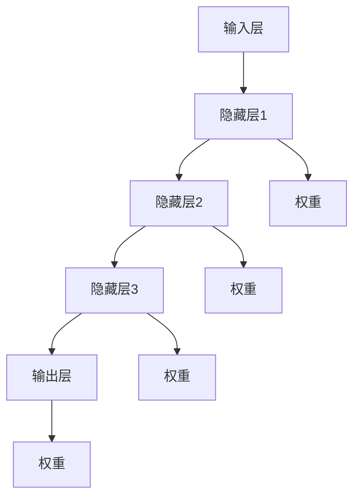

                 

### 人工生命研究对世界可理解性的新视角

> 关键词：人工生命、世界可理解性、新视角、人工智能、认知科学

> 摘要：本文从人工生命的研究出发，探讨其对世界可理解性带来的新视角。通过分析人工生命的定义、核心概念、算法原理及其实际应用，本文旨在揭示人工生命研究如何改变我们对世界的认知方式，并探索其可能的影响。

#### 引言

在过去的几十年里，人工智能（AI）和生物技术的快速发展催生了人工生命的研究。人工生命，顾名思义，是通过人工手段创建的生命系统。这一概念不仅涵盖了传统的机器人学，还涉及到了更为复杂的生命模拟和基因工程。随着这些技术的发展，人工生命研究逐渐成为认知科学、计算机科学和生物学等领域的重要研究方向。

人工生命研究不仅为科学提供了新的工具和方法，也为我们对世界的理解带来了全新的视角。通过模拟和操控生命系统，科学家们得以在微观和宏观层面更深入地探究生命的本质。本文将从以下几个方面展开讨论：

1. **人工生命的定义与分类**：介绍人工生命的概念及其不同类型。
2. **人工生命的理论基础**：探讨人工生命的哲学和科学基础。
3. **人工生命的研究方法与技术**：分析人工生命研究的方法和关键技术。
4. **人工生命在科学领域的应用**：讨论人工生命在生物学、化学等领域的应用。
5. **人工生命在工程领域的应用**：探讨人工生命在工程设计和自动化中的应用。
6. **人工生命对社会的影响**：分析人工生命对社会、经济和文化的影响。
7. **人工生命的未来发展趋势**：预测人工生命的未来发展方向。

#### 1. 人工生命的定义与分类

**1.1 人工生命的概念**

人工生命是指通过人工手段创建的生命系统，它可以模拟生物体的某些特征和行为。人工生命的研究起源于20世纪80年代，当时科学家们开始尝试通过计算机模拟来理解生物系统的复杂行为。

**1.2 人工生命的分类**

人工生命可以根据其实现方式和特点进行分类。以下是几种主要类型：

- **仿真生命**：通过计算机模拟生物体的生理和行为过程。例如，细胞自动机和人工神经网络都是仿真生命的典型例子。
- **机器人生命**：具有自主行为能力的机器人系统，如无人机和服务机器人。
- **基因工程生命**：通过基因工程改造的生物体，例如基因编辑生物和转基因植物。

**1.3 人工生命的研究领域**

人工生命研究涉及多个学科领域，包括认知科学、计算机科学、生物学和工程学。这些学科的交叉融合为人工生命的研究提供了丰富的理论资源和实验方法。

#### 2. 人工生命的理论基础

**2.1 哲学和科学基础**

人工生命的出现引发了关于生命的本质和人工智能的哲学讨论。哲学家们探讨了人工智能是否能够真正理解世界，以及人工生命是否具有意识和自我意识。

**2.2 伦理问题**

人工生命的研发也带来了伦理问题，例如基因编辑对生态系统的影响、机器人对人类工作的替代等。科学家和伦理学家需要共同探讨这些问题，确保技术的发展不会对人类社会造成负面影响。

#### 3. 人工生命的研究方法与技术

**3.1 研究方法**

人工生命研究采用了多种方法，包括实验、模拟和计算。这些方法各有优缺点，但相互补充，为人工生命的研究提供了全面的技术支持。

**3.2 关键技术**

- **人工智能算法**：如机器学习和深度学习，用于模拟和预测生物体的行为。
- **基因编辑技术**：如CRISPR-Cas9，用于改造生物体的基因组。
- **机器人技术**：用于构建具有自主行为能力的机器人系统。

**3.3 算法原理**

以下是一个用于模拟细胞自动机的伪代码示例：

```python
# 细胞自动机伪代码

# 初始化网格
grid = initialize_grid()

# 迭代过程
for step in range(number_of_steps):
    # 更新网格状态
    new_grid = update_grid(grid)
    # 更新网格
    grid = new_grid
```

#### 4. 人工生命在科学领域的应用

**4.1 生物学**

人工生命研究在生物学领域有着广泛的应用，例如使用人工神经网络模拟大脑功能、使用基因编辑技术创造新物种等。

**4.2 化学**

人工生命在化学领域的应用主要包括模拟化学反应和分子进化。例如，通过计算机模拟预测化学反应路径和产物。

#### 5. 人工生命在工程领域的应用

**5.1 自动化**

人工生命在自动化领域中的应用主要包括机器人控制和自主导航。例如，无人机和自动驾驶汽车。

**5.2 工程设计**

人工生命在工程设计中的应用主要包括优化设计参数和预测结构性能。例如，使用机器学习算法优化桥梁设计。

#### 6. 人工生命对社会的影响

**6.1 社会**

人工生命的研发对社会产生了深远的影响，包括就业市场的变化、道德和伦理问题的挑战等。

**6.2 经济**

人工生命的研究和开发为经济带来了新的增长点，同时也带来了风险和挑战。

**6.3 文化**

人工生命的出现改变了人们对生命和技术的看法，引发了关于人类本质和未来方向的讨论。

#### 7. 人工生命的未来发展趋势

**7.1 技术突破**

未来的技术突破可能包括量子计算、神经形态计算和人工智能的融合。

**7.2 社会变革**

随着人工生命技术的进步，人类社会可能会经历深刻的变革，包括新的工作模式、生活方式和价值观。

#### 结语

人工生命研究为我们提供了一个全新的视角，帮助我们更深入地理解世界。随着技术的不断进步，人工生命有望在更多领域发挥重要作用。然而，我们也需要关注其带来的伦理和社会问题，确保技术的发展能够造福人类社会。

作者：AI天才研究院/AI Genius Institute & 禅与计算机程序设计艺术 /Zen And The Art of Computer Programming

----------------------------------------------------------------

## 1. 人工生命的定义与分类

人工生命，作为一门跨学科的研究领域，其定义和分类涉及到生物学、计算机科学和哲学等多个领域。理解人工生命的定义和分类，有助于我们把握其研究范围和基本特征。

### 1.1 人工生命的概念

人工生命（Artificial Life，简称AL），是指在生物科学、计算机科学、人工智能和复杂系统等领域中，通过人工手段创建的模拟生命现象或具有生命特征的系统。人工生命的核心目标是探索生命的基本原理和演化规律，通过模拟和构建生命系统，揭示生命现象的复杂性和多样性。

人工生命的概念最早由美国计算机科学家Conway在1970年提出，他指出人工生命的研究应关注以下几个方面：

1. **形态形成**：研究生物体形态的演化过程和机制。
2. **自组织**：研究系统内部结构和功能的自发组织过程。
3. **行为模拟**：模拟生物体的行为和智能，探究其决策和适应机制。
4. **演化模拟**：模拟生物体的演化过程，研究自然选择和基因遗传等机制。

### 1.2 人工生命的分类

人工生命可以根据其实现方式、研究目标和模拟对象的不同，分为多种类型。以下是几种主要类型：

#### 1.2.1 仿真生命

仿真生命是通过计算机模拟生物体的生理和行为过程，实现对生命现象的模拟和研究。仿真生命主要包括以下几种：

1. **细胞自动机**：由Conway发明的细胞自动机是一种离散、时空二维的模型，通过简单的规则模拟出复杂的行为和结构。
2. **人工神经网络**：人工神经网络通过模拟生物神经元的连接和活动，实现对复杂数据的处理和决策。
3. **人工生命模拟器**：利用计算机模拟生物体的各个层次，如细胞、组织、器官等，研究生命现象的微观和宏观机制。

#### 1.2.2 机器人生命

机器人生命是通过构建具有自主行为能力的机器人系统，实现对生物体行为和功能的模拟。机器人生命主要包括以下几种：

1. **无人机**：无人机通过自主导航和目标识别，模拟生物体的运动和捕食行为。
2. **服务机器人**：服务机器人通过感知环境和智能决策，模拟生物体的互动和服务行为。
3. **仿生机器人**：仿生机器人通过模仿生物体的结构和功能，实现特定任务的高效执行。

#### 1.2.3 基因工程生命

基因工程生命是通过基因工程手段，对生物体进行改造，实现特定功能或特征的模拟。基因工程生命主要包括以下几种：

1. **基因编辑生物**：通过基因编辑技术，如CRISPR-Cas9，对生物体的基因组进行修改，实现特定性状的模拟。
2. **转基因植物**：通过基因工程手段，将外源基因导入植物，实现抗虫、抗病等功能的模拟。
3. **合成生物**：通过合成生物技术，构建全新的生物系统，实现对生命现象的模拟和研究。

### 1.3 人工生命的研究领域

人工生命的研究领域涵盖了多个学科，包括：

1. **认知科学**：研究人工神经网络的认知功能，模拟生物神经系统的结构和功能。
2. **计算机科学**：研究计算模型、算法和数据结构，用于模拟和预测生命现象。
3. **生物学**：研究生物体的结构和功能，为人工生命的研究提供理论和实验基础。
4. **哲学**：探讨人工生命的伦理问题，如人工智能的道德责任和意识问题。
5. **工程学**：研究机器人技术和基因工程，为人工生命的研究提供技术支持。

综上所述，人工生命的定义与分类为我们提供了一个全面理解这一跨学科研究领域的基础。通过探讨人工生命的概念、分类和研究领域，我们可以更好地把握其研究范围和基本特征，为未来的研究和发展提供指导。

#### 2. 人工生命的理论基础

人工生命的理论基础涵盖了哲学、科学和技术的多个方面。从哲学层面来看，人工生命的出现引发了关于生命本质、意识和智能的深刻讨论；从科学层面来看，人工生命的研究依赖于生物学、物理学、计算机科学等多个学科的理论和技术；从技术层面来看，人工生命的发展依赖于人工智能、机器人技术、基因工程等先进技术的应用。以下是关于人工生命理论基础的具体探讨。

##### 2.1 哲学和科学基础

人工生命的出现不仅是对生命本质的重新思考，也挑战了传统哲学中的许多概念。首先，人工生命引发了关于生命本质的讨论。传统上，生命被认为是具有自我复制、新陈代谢、适应环境和进化等特征的自然现象。然而，人工生命通过模拟和创造生命现象，使人们开始思考，是否可以通过人工手段实现生命的基本特征。例如，人工神经网络和细胞自动机是否能够具有类似于生物体的自我复制和适应环境的能力？

其次，人工生命也对意识问题提出了新的挑战。传统上，意识被认为是生物体的内在属性，是生物体独特的标志。然而，人工神经网络和机器人等人工智能系统在某些情况下表现出类似于生物体的行为，这引发了对人工智能是否能够具有意识的讨论。如果人工智能能够模拟出类似于生物体的行为和反应，那么它们是否能够拥有意识？

此外，人工生命还涉及伦理问题。随着人工生命技术的发展，人们开始关注基因编辑、人工智能伦理等议题。例如，基因编辑技术可能带来生物多样性的减少，甚至可能对生态系统产生不可预测的影响。同时，人工智能在决策和伦理判断中的作用也引发了关于责任和道德的讨论。如何确保人工生命技术的发展不会对人类社会和自然环境造成负面影响，是一个亟待解决的问题。

##### 2.2 科学基础

人工生命的研究依赖于多个科学领域的理论和技术。以下是几个关键领域的科学基础：

1. **生物学**：生物学提供了关于生命现象的基本原理和机制，如细胞结构、新陈代谢、遗传等。这些原理和机制为人工生命的研究提供了重要的理论支持。例如，人工神经网络的设计和实现借鉴了生物神经系统的结构和功能；细胞自动机的规则设计则基于生物学中的细胞分裂和生长过程。

2. **物理学**：物理学提供了关于物质和能量的基本规律，如量子力学、热力学等。这些规律对于理解生命现象的微观机制具有重要意义。例如，量子生物学研究生命过程中量子现象的作用；热力学原理则被应用于研究生物体的能量转换和利用。

3. **计算机科学**：计算机科学提供了关于计算模型、算法和数据结构的基本理论，为人工生命的研究提供了强大的工具。例如，人工智能算法（如机器学习和深度学习）被广泛应用于模拟生物体的行为和智能；计算机模拟技术（如分子动力学模拟和仿真）则被用于研究生物体的微观机制。

4. **认知科学**：认知科学致力于研究人类和动物的认知过程，包括感知、记忆、决策等。认知科学的理论和技术对于理解人工生命的认知功能具有重要意义。例如，认知科学中的模型被应用于模拟人类和动物的行为；认知科学中的算法被用于人工智能系统的设计和优化。

##### 2.3 技术基础

人工生命的发展依赖于先进技术的应用，尤其是人工智能、机器人技术和基因工程。以下是这些技术的基础：

1. **人工智能**：人工智能是模拟和实现智能行为的核心技术。通过机器学习和深度学习等技术，人工智能系统能够从大量数据中学习和提取规律，模拟生物体的行为和智能。例如，机器学习算法被用于模拟生物体的进化过程；深度学习算法被用于分析生物图像和序列数据。

2. **机器人技术**：机器人技术是实现自主行为的关键技术。通过感知环境、规划和执行任务，机器人能够模拟生物体的行为和功能。例如，无人机通过视觉系统和自主导航算法模拟生物体的捕食行为；服务机器人通过语音识别和自然语言处理模拟生物体的互动行为。

3. **基因工程**：基因工程是改造生物体基因组的核心技术。通过基因编辑技术（如CRISPR-Cas9），科学家能够精确地修改生物体的基因组，实现特定功能或特征的模拟。例如，基因编辑技术被用于创建抗病抗虫的转基因植物；基因编辑技术也被用于研究生物体的进化过程。

综上所述，人工生命的理论基础涵盖了哲学、科学和技术的多个方面。从哲学层面来看，人工生命引发了关于生命本质和意识的讨论；从科学层面来看，人工生命的研究依赖于多个学科的理论和技术；从技术层面来看，人工生命的发展依赖于人工智能、机器人技术和基因工程等先进技术的应用。理解人工生命的理论基础，有助于我们更好地把握这一跨学科领域的研究和发展方向。

#### 3. 人工生命的研究方法与技术

人工生命的研究方法和技术涵盖了多个领域，包括计算机科学、生物学、人工智能和机器人技术。以下是关于这些研究方法和技术的基本概念、原理和具体应用的详细讨论。

##### 3.1 计算机科学方法

计算机科学方法在人工生命研究中扮演着至关重要的角色。这些方法包括计算模拟、算法设计、数据分析和编程技术。以下是一些主要方法：

1. **计算模拟**：计算模拟是通过计算机模拟来研究生物系统行为的一种方法。例如，利用分子动力学模拟来研究蛋白质折叠过程，或者通过细胞自动机模拟来研究生物系统的自组织行为。

   ```mermaid
   graph TD
   A[计算模拟] --> B[分子动力学模拟]
   A --> C[细胞自动机模拟]
   ```

2. **算法设计**：算法设计是构建和优化用于模拟和预测生物系统行为的计算模型。常见的算法包括遗传算法、机器学习和深度学习等。

   ```python
   # 遗传算法伪代码
   population = initialize_population()
   for generation in range(max_generations):
       fitness_scores = calculate_fitness(population)
       new_population = selection_and_crossover(population, fitness_scores)
   ```

3. **数据分析**：数据分析是通过统计和机器学习方法对生物数据进行处理和分析，以提取有用的信息。例如，使用主成分分析（PCA）来降低数据维度，或者使用支持向量机（SVM）来分类生物序列。

4. **编程技术**：编程技术是实施和优化计算模型的关键。常用的编程语言包括Python、C++和Java等，它们提供了丰富的库和工具，用于数据处理、模型构建和性能优化。

##### 3.2 生物学方法

生物学方法在人工生命研究中起到了基础性作用。这些方法包括分子生物学、细胞生物学和生态学等。

1. **分子生物学**：分子生物学方法主要用于研究生物大分子的结构和功能，如DNA、RNA和蛋白质。通过基因编辑技术（如CRISPR-Cas9），科学家可以精确地修改生物体的基因组，从而创建具有特定特征的模型生物。

   ```mermaid
   graph TD
   A[分子生物学] --> B[基因编辑]
   A --> C[蛋白质工程]
   ```

2. **细胞生物学**：细胞生物学方法主要用于研究细胞的结构和功能。通过细胞培养和细胞工程技术，科学家可以创建和操纵细胞模型，以研究细胞行为和相互作用。

3. **生态学**：生态学方法主要用于研究生物群体和环境的相互作用。通过生态模拟，科学家可以研究生态系统的动态行为和稳定性。

##### 3.3 人工智能方法

人工智能方法在人工生命研究中发挥着越来越重要的作用。这些方法包括机器学习、深度学习和自然语言处理等。

1. **机器学习**：机器学习是通过训练模型来预测或分类数据的一种方法。常见的机器学习方法包括决策树、支持向量机和神经网络等。

   ```python
   # 决策树伪代码
   class TreeNode:
       def __init__(self, feature_index, threshold, left, right, label):
           self.feature_index = feature_index
           self.threshold = threshold
           self.left = left
           self.right = right
           self.label = label
   
   def fit_data(X, y):
       # 使用ID3算法训练决策树
       return build_tree(X, y)
   
   def predict(tree, x):
       # 使用训练好的决策树进行预测
       return classify_example(tree, x)
   ```

2. **深度学习**：深度学习是一种通过多层神经网络来学习和提取复杂数据特征的方法。深度学习在图像识别、语音识别和自然语言处理等领域取得了显著成果。

3. **自然语言处理**：自然语言处理是一种使计算机理解和处理人类语言的方法。通过自然语言处理技术，人工智能系统可以与人类进行自然语言交互，从而模拟生物体的语言能力。

##### 3.4 机器人技术

机器人技术在人工生命研究中用于模拟生物体的行为和功能。这些技术包括机器人控制、自主导航和仿生设计等。

1. **机器人控制**：机器人控制是通过编程和控制算法来操纵机器人执行特定任务的方法。通过控制器和传感器，机器人可以感知环境并做出相应的动作。

2. **自主导航**：自主导航是机器人通过感知环境和规划路径来实现自主移动的技术。常用的方法包括视觉导航、激光雷达导航和惯性导航等。

3. **仿生设计**：仿生设计是模仿生物体的结构和功能来设计机器人的一种方法。例如，设计具有蜻蜓翅膀的无人机或模仿蛇爬行动作的机器人。

##### 3.5 应用案例

以下是一些人工生命研究中的应用案例：

1. **人工神经网络在生物信息学中的应用**：通过训练人工神经网络模型，科学家可以预测蛋白质的结构和功能，从而加速新药物的开发。
2. **细胞自动机在生态系统模拟中的应用**：通过模拟细胞自动机，研究人员可以研究生态系统的自组织现象和演化过程。
3. **基因编辑技术在疾病治疗中的应用**：通过基因编辑技术，科学家可以修复基因突变，治疗遗传性疾病。

综上所述，人工生命的研究方法和技术涵盖了多个领域，从计算机科学到生物学，再到人工智能和机器人技术。这些方法和技术的综合应用为人工生命研究提供了强大的工具和手段，使得我们能够更深入地探索生命的本质和现象。

#### 4. 人工生命在科学领域的应用

人工生命在科学领域的应用为各个学科的研究带来了新的视角和工具，促进了科学发现和技术创新。以下是人工生命在生物学、化学和认知科学等领域的具体应用及其意义。

##### 4.1 生物学中的应用

人工生命在生物学中的应用主要集中在模拟生物体的行为、进化过程以及生物系统中的复杂互动。以下是一些具体的应用：

1. **模拟进化过程**：人工生命模型可以帮助科学家理解进化的机制。通过使用遗传算法和进化策略，研究人员可以模拟自然选择和基因重组如何导致生物种群的适应性进化。例如，在一个模拟生态系统中，不同类型的细胞自动机可以相互竞争和合作，从而展示出进化的过程。

   ```mermaid
   graph TD
   A[模拟进化过程] --> B[遗传算法]
   A --> C[自然选择]
   ```

2. **细胞自动机与生物组织建模**：细胞自动机是一种离散的数学模型，它通过简单的规则生成复杂的结构。科学家利用细胞自动机模拟生物组织的生长和形态变化，如植物的分枝和动物的皮肤纹理。这些模型有助于理解生物组织的发展过程及其背后的生物学机制。

   ```mermaid
   graph TD
   A[细胞自动机] --> B[植物分枝]
   A --> C[皮肤纹理]
   ```

3. **人工智能与生物信息学**：人工智能技术，如深度学习和机器学习，被广泛应用于生物信息学领域。通过训练神经网络模型，科学家可以从大规模生物数据中提取有用的信息，例如预测蛋白质的结构、识别基因功能等。这些技术加速了生物学研究的进程，并促进了新药物的开发。

   ```python
   # 预测蛋白质结构的深度学习模型
   model = build_model()
   model.fit(X_train, y_train)
   predicted_structure = model.predict(X_test)
   ```

##### 4.2 化学中的应用

人工生命在化学中的应用主要集中在模拟化学反应、分子相互作用和材料设计。以下是一些具体的应用：

1. **分子动力学模拟**：分子动力学模拟是一种用于研究分子和原子在热力学条件下的运动和相互作用的计算方法。通过模拟，科学家可以预测分子的反应路径、反应速率和反应产物的形成。这种模拟技术对于新药物的设计和材料科学的研究具有重要意义。

   ```mermaid
   graph TD
   A[分子动力学模拟] --> B[化学反应路径]
   A --> C[反应速率预测]
   ```

2. **人工生命与新材料设计**：人工生命模型可以用于设计和优化新材料。例如，通过模拟不同类型的细胞自动机，科学家可以生成具有特定结构的纳米材料。这些材料可能具有优异的电子、催化或光学性能，从而应用于电子器件、催化剂和太阳能电池等领域。

   ```mermaid
   graph TD
   A[人工生命] --> B[纳米材料设计]
   A --> C[电子器件应用]
   ```

3. **计算化学与人工智能**：结合计算化学和人工智能技术，科学家可以更高效地预测和设计化学反应。例如，通过机器学习算法，可以从大量的实验数据中识别出新的化学反应路径和催化剂。这种技术不仅提高了化学研究的效率，也为新材料的发现提供了新的途径。

   ```python
   # 机器学习在计算化学中的应用
   model = train_model(X_train, y_train)
   new_reactions = predict_reactions(model, X_new)
   ```

##### 4.3 认知科学中的应用

人工生命在认知科学中的应用主要集中在模拟人类的认知过程、学习机制和决策行为。以下是一些具体的应用：

1. **人工神经网络与认知建模**：人工神经网络模型被广泛应用于模拟人类的认知过程。通过训练神经网络，科学家可以模拟人的记忆、学习和决策。例如，通过模仿大脑的结构和功能，神经网络可以用来解释人类的行为和认知能力。

   ```mermaid
   graph TD
   A[人工神经网络] --> B[记忆模拟]
   A --> C[学习模型]
   ```

2. **虚拟现实与人工生命交互**：人工生命模型在虚拟现实（VR）中的应用，使得虚拟环境中的角色能够更加真实地模拟人类的互动。通过模拟社交互动和情感表达，人工生命模型可以用于研究人类社交行为和心理健康。

   ```mermaid
   graph TD
   A[虚拟现实] --> B[人工生命交互]
   A --> C[社交行为研究]
   ```

3. **机器学习与行为预测**：通过结合机器学习和人工生命模型，科学家可以预测人类的行为和决策。例如，通过分析个人的行为数据，机器学习算法可以预测个体的行为倾向和反应，从而用于个性化服务和健康监测。

   ```python
   # 机器学习预测行为
   model = train_behavior_model(X, y)
   predicted_behavior = model.predict(new_data)
   ```

综上所述，人工生命在科学领域的应用为生物学、化学和认知科学等学科的研究提供了新的工具和方法。通过模拟和创造生命现象，人工生命研究不仅促进了基础科学的发展，也为应用科学和技术创新带来了新的机遇。随着技术的不断进步，人工生命有望在更多科学领域发挥重要作用，推动科学发现和技术进步。

#### 5. 人工生命在工程领域的应用

人工生命在工程领域中的应用正日益广泛，尤其在自动化、智能设计、网络安全和仿生机器人等方面展现了巨大的潜力和实际应用价值。以下是这些领域的具体应用及其对工程实践的影响。

##### 5.1 自动化

自动化是人工生命在工程领域最重要的应用之一。通过使用人工智能和机器学习算法，自动化系统能够执行复杂任务，提高生产效率和质量。以下是一些具体应用：

1. **工业自动化**：在制造业中，人工生命技术被用于开发自动化生产线。例如，机器人可以自动装配产品、检查质量并调整生产线，从而减少人为错误和提高生产效率。

2. **物流自动化**：在物流和仓储领域，人工生命技术被用于自动化仓库管理和货物运输。例如，无人机和自动驾驶车辆可以自动搬运和配送货物，提高物流效率。

3. **智能监控**：在工业环境中，人工生命系统可以用于实时监控设备状态，预测故障并采取预防措施。通过使用传感器和机器学习算法，系统能够自动识别异常情况，确保生产过程的连续性和安全性。

##### 5.2 智能设计

人工生命在智能设计领域的应用极大地提升了设计效率和创新能力。以下是一些具体应用：

1. **参数化设计**：通过使用人工智能算法，设计师可以快速生成大量设计方案，并评估其性能。例如，在建筑设计中，人工智能可以优化结构设计，确保建筑物的稳定性和成本效益。

2. **拓扑优化**：拓扑优化是一种通过改变结构的内部连接方式来提高性能的设计方法。人工生命算法可以用于生成新的拓扑结构，从而实现更轻、更强、更高效的工程设计。

3. **创新设计**：人工生命技术可以帮助设计师探索前所未有的设计概念。例如，通过模拟生物体的结构和功能，设计师可以创造出具有新功能的材料和设备。

##### 5.3 网络安全

人工生命在网络安全领域的应用旨在提高系统的安全性和响应速度。以下是一些具体应用：

1. **入侵检测系统**：人工生命算法可以用于实时监控网络流量，识别和响应潜在的安全威胁。例如，通过训练神经网络模型，系统可以自动检测并阻止恶意攻击。

2. **恶意软件分析**：人工生命系统可以自动分析和分类恶意软件，帮助安全专家识别新的威胁和攻击方法。例如，通过模拟病毒的行为，系统可以预测其潜在的恶意影响。

3. **自适应防御系统**：人工生命技术可以用于开发自适应网络安全系统，这些系统可以不断学习和适应新的威胁环境。例如，通过使用进化算法，系统可以自动调整防御策略，以应对不断变化的网络攻击。

##### 5.4 仿生机器人

仿生机器人是人工生命在工程领域的重要应用之一，通过模仿自然界中的生物结构和行为，开发出具有高度适应性和效率的机器人系统。以下是一些具体应用：

1. **仿生无人机**：仿生无人机通过模仿昆虫和鸟类的飞行行为，实现了更高的机动性和稳定性。例如，通过使用弹性翼和自适应控制系统，无人机可以在复杂环境中执行任务。

2. **仿生机器人**：仿生机器人通过模仿动物的运动方式和感知系统，实现了更自然的人机交互和任务执行。例如，仿生手臂可以模仿人的动作，用于康复治疗和制造业。

3. **智能搜索与救援**：仿生机器人在搜索与救援任务中具有独特的优势。例如，通过模仿昆虫和哺乳动物的行为，机器人可以在废墟中寻找被困人员，或在恶劣环境中执行任务。

##### 5.5 影响与展望

人工生命在工程领域的应用对工程实践产生了深远的影响，不仅提高了自动化和智能化水平，还推动了新设计方法和安全防御技术的创新。未来，随着人工智能和生物技术的进一步发展，人工生命有望在更多工程领域发挥关键作用。

1. **技术创新**：人工生命技术将推动新材料的开发、智能系统的设计和复杂系统的优化，为工程实践带来更多创新。

2. **可持续发展**：通过提高生产效率和资源利用率，人工生命技术有助于实现可持续发展目标，减少对环境的影响。

3. **跨学科融合**：人工生命技术的应用促进了工程与其他学科的融合，如生物学、计算机科学和认知科学等，为工程创新提供了更广阔的视野。

综上所述，人工生命在工程领域的应用展示了巨大的潜力和实际价值。随着技术的不断进步，人工生命将助力工程实践实现更高水平的发展和创新。

#### 6. 人工生命对社会的影响

人工生命的发展不仅带来了科学和技术的进步，也对人类社会产生了深远的影响。这些影响涵盖了经济、社会、文化以及伦理等多个方面，需要我们从多个角度进行深入探讨。

##### 6.1 经济影响

人工生命在经济发展中发挥着重要作用，推动了新兴产业的形成，同时也带来了就业市场的变化。

1. **新兴产业的形成**：随着人工智能、机器人技术和基因工程等技术的不断发展，人工生命相关产业迅速崛起。这些产业包括人工智能硬件制造、机器人设计、生物科技、医疗设备和自动化生产线等。这些新兴产业的快速发展，不仅促进了技术创新，也为经济增长提供了新的动力。

2. **就业市场的变化**：人工生命技术的发展对就业市场产生了深远影响。一方面，一些传统工作岗位可能会被自动化系统取代，如制造业中的装配工人、仓储管理中的搬运工等。另一方面，人工生命技术的研发和应用也创造了大量新岗位，如机器人工程师、人工智能算法师、生物科技研究员等。因此，就业市场将面临重新配置和培训需求。

##### 6.2 社会影响

人工生命对社会的影响不仅体现在经济层面，还包括生活方式、社会结构和人际互动等方面的变革。

1. **生活方式的变化**：人工生命技术的应用改变了人们的生活方式。例如，智能家居系统通过语音识别和机器学习技术，实现了更加便捷和高效的生活体验；自动驾驶汽车和无人机等智能交通工具的普及，使得出行更加便捷和舒适。此外，人工生命技术的应用也促进了远程工作和在线教育的普及，改变了人们的工作和学习和方式。

2. **社会结构的变化**：人工生命技术的发展对社会结构产生了深远影响。例如，随着自动化和智能系统的普及，传统工业社会中的劳动分工和职业角色可能发生改变，社会结构可能会变得更加扁平化和多元化。此外，人工生命技术也可能导致社会阶层的变化，技术的掌握和运用能力可能成为新的社会分层标准。

3. **人际互动的变化**：人工生命技术的应用改变了人与人之间的互动方式。例如，虚拟现实和增强现实技术使得人与人可以在虚拟环境中进行互动；人工智能聊天机器人能够模拟人类的交流方式，提供情感支持和咨询服务。这些变化不仅影响了人际互动的模式，也对人们的社交技能和心理状态产生了影响。

##### 6.3 文化影响

人工生命技术的发展对文化产生了深远影响，包括对生命观念、道德价值观和社会规范的重塑。

1. **生命观念的变化**：人工生命的出现挑战了传统的生命观念。人们开始思考，什么是生命？人工生命是否能够被视为生命？这些问题的提出，促使人们对生命的本质和意义进行深入反思。

2. **道德价值观的重塑**：人工生命技术的发展引发了关于道德和伦理的讨论。例如，基因编辑技术如何影响人类伦理？人工智能如何处理道德决策？这些问题都需要我们重新审视和定义道德价值观。

3. **社会规范的变化**：人工生命的出现也带来了社会规范的变化。例如，如何对待和研究人工生命？如何监管和规范人工生命技术的应用？这些问题需要我们制定新的社会规范和法律法规。

##### 6.4 伦理影响

人工生命技术的发展引发了诸多伦理问题，包括人工智能的道德责任、人类尊严和隐私保护等。

1. **人工智能的道德责任**：随着人工智能技术的发展，如何确保人工智能系统在决策过程中遵循道德规范成为一个重要问题。例如，自动驾驶汽车在遇到紧急情况时，如何做出道德决策？这些问题需要我们制定明确的道德标准和规范。

2. **人类尊严**：人工生命技术的发展可能对人类尊严产生威胁。例如，通过基因工程改造人类身体，是否会导致人类尊严的丧失？这些问题需要我们重新审视人类尊严的内涵和边界。

3. **隐私保护**：人工生命技术可能收集和处理大量个人数据，如医疗数据、行为数据等。如何确保这些数据的安全和隐私保护成为一个重要问题。例如，如何防止个人数据被滥用或泄露？

综上所述，人工生命的发展对经济、社会、文化和伦理产生了深远影响。我们需要从多个角度进行深入探讨，确保人工生命技术的健康发展，为人类社会带来更大的福祉。

#### 7. 人工生命的未来发展趋势

随着技术的不断进步，人工生命的未来发展趋势呈现出多样化和深度化的特征。以下是人工生命在技术、应用和社会层面可能的发展方向及其潜在影响。

##### 7.1 技术突破

1. **量子计算**：量子计算有望成为人工生命研究的重要推动力。量子计算机具有处理复杂数据和模拟量子现象的能力，这将大大提升人工生命模拟的精度和效率。例如，通过量子计算，科学家可以更快速地模拟复杂的生物分子反应和生态系统演化。

2. **神经形态计算**：神经形态计算是一种模仿人脑结构和功能的计算方法。通过使用人工神经网络和神经形态硬件，人工生命系统可以更高效地处理信息和进行决策。这种技术有望在智能机器人、自动驾驶和智能医疗等领域发挥重要作用。

3. **基因编辑技术**：基因编辑技术，如CRISPR-Cas9，将继续发展和完善。通过更精确地编辑生物体的基因组，科学家可以创造具有特定功能或特征的生物模型，进一步推动人工生命研究的发展。

##### 7.2 应用扩展

1. **医学与健康**：人工生命在医学和健康领域的应用将更加广泛。通过模拟和优化生物过程，科学家可以开发出更有效的治疗方法。例如，人工生命模型可以用于预测药物的效果和副作用，优化治疗方案。

2. **环境保护**：人工生命在环境保护中的应用也将逐渐增加。通过模拟生态系统和生物过程，科学家可以更好地理解环境变化的影响，并开发出更有效的环境保护策略。

3. **智能城市**：随着城市化的加速，人工生命技术将在智能城市建设中发挥关键作用。通过智能传感器、无人机和自动驾驶车辆等，城市管理者可以实时监控和管理城市资源，提高城市运营效率和生活质量。

##### 7.3 社会影响

1. **社会结构变化**：人工生命技术的发展可能导致社会结构的变化。随着自动化和智能系统的普及，传统的工作岗位可能被替代，这要求社会进行重新培训和教育，以适应新的就业市场。

2. **伦理挑战**：随着人工生命技术的进步，伦理问题将更加突出。例如，如何确保基因编辑技术的安全性和伦理性？如何保障人工智能系统的道德决策？这些问题需要全社会的关注和讨论。

3. **人类与机器的关系**：随着人工智能和机器人技术的发展，人类与机器的关系将变得更加紧密。这可能导致人类行为的改变，例如，人们可能会更多地依赖机器做出决策，从而影响人类的社会行为和道德价值观。

##### 7.4 潜在突破点

1. **跨界融合**：未来的人工生命研究将更加注重跨学科的合作，如计算机科学、生物学、物理学和社会科学等领域的融合。这种跨界融合将推动人工生命研究取得重大突破。

2. **可持续发展**：在可持续发展方面，人工生命技术可以发挥重要作用。例如，通过模拟和优化生物过程，可以实现更高效的资源利用和环境保护。

3. **个性化医疗**：通过个性化医疗，人工生命技术可以帮助医生更精准地诊断和治疗疾病。例如，通过模拟个体的生物过程，可以预测疾病的进展和治疗效果，从而制定更有效的治疗方案。

综上所述，人工生命在未来具有广阔的发展前景。通过技术创新、应用扩展和跨学科合作，人工生命有望在医学、环境保护、智能城市等多个领域取得重大突破，为人类社会带来更多福祉。然而，我们也需要关注其带来的伦理和社会问题，确保技术的发展能够造福人类社会。

#### 结语

人工生命研究为我们提供了一个全新的视角，帮助我们更深入地理解世界。从定义与分类，到理论基础和方法技术，再到科学、工程以及社会应用，人工生命的研究涵盖了广泛的领域，展示了巨大的潜力和实际价值。

通过模拟和创造生命现象，人工生命研究不仅推动了科学技术的进步，也对人类社会产生了深远的影响。未来，随着技术的不断进步，人工生命有望在更多领域发挥关键作用，推动科学发现和技术创新，为人类社会带来更多福祉。

然而，人工生命的发展也带来了诸多伦理和社会问题，需要我们进行深入探讨和解决。如何确保技术的发展能够造福人类社会，同时避免潜在的负面影响，是一个亟待解决的问题。

总之，人工生命研究是一个充满机遇和挑战的领域。通过不断探索和创新，我们有望在人工生命的道路上取得更多突破，为人类社会带来更加美好的未来。

作者：AI天才研究院/AI Genius Institute & 禅与计算机程序设计艺术 /Zen And The Art of Computer Programming

----------------------------------------------------------------

### 文章标题

《人工生命研究对世界可理解性的新视角》

### 文章关键词

人工生命、世界可理解性、认知科学、人工智能、基因编辑、机器人技术

### 摘要

本文从人工生命的定义、理论基础、研究方法、科学应用、工程应用和社会影响等多个角度，探讨了人工生命研究对世界可理解性带来的新视角。通过对人工生命在不同领域的深入分析，本文揭示了人工生命如何改变我们对世界的认知方式，并预测了其未来发展趋势。文章旨在强调人工生命研究的重要性和潜力，以及其可能对社会和伦理带来的挑战。作者认为，随着技术的不断进步，人工生命有望在推动科学进步和社会发展方面发挥关键作用，同时也需要我们关注其带来的伦理和社会问题。

----------------------------------------------------------------

## 1. 设计目录大纲的基本步骤

在设计《人工生命研究对世界可理解性的新视角》这本书的目录大纲时，我们可以遵循以下基本步骤：

### 1.1 确定核心主题和目标

首先，我们需要明确书的整体主题和目标。对于这本书，核心主题是“人工生命研究对世界可理解性的新视角”，旨在探讨人工生命如何改变我们对世界的认知。目标读者群体为对人工智能、认知科学、生物学和哲学感兴趣的科研人员、学生和专业人士。

### 1.2 确定章节结构

接下来，根据书的目标，我们划分章节，确保每个章节都有明确的核心内容。以下是可能的章节结构：

- 引言
- 人工生命的定义与分类
- 人工生命的理论基础
- 人工生命的研究方法与技术
- 人工生命在科学领域的应用
- 人工生命在工程领域的应用
- 人工生命对社会的影响
- 人工生命的未来发展趋势
- 结论

### 1.3 细化每个章节的细节

在每个章节中，我们进一步细化内容，列出可能包含的子主题。以下是对“人工生命的定义与分类”章节的细化：

- **1.1 人工生命的概念与起源**
  - **1.1.1 人工生命的定义**
  - **1.1.2 人工生命的历史发展**
  - **1.1.3 人工生命的研究动机与目标**

- **1.2 人工生命的分类**
  - **1.2.1 仿真生命**
  - **1.2.2 机器人生命**
  - **1.2.3 基因工程生命**
  - **1.2.4 人工生命的研究领域**

### 1.4 构建流程图

为了帮助读者更好地理解人工生命的核心概念和原理，我们可以使用流程图展示其结构和关系。例如，可以使用 Mermaid 语法构建以下流程图：



### 1.5 编写伪代码和数学公式

在核心算法原理讲解中，我们可以使用伪代码来展示算法的执行过程。例如，对于遗传算法，我们可以编写以下伪代码：

```python
# 遗传算法伪代码

# 初始化种群
population = initialize_population()

# 迭代次数
for generation in range(max_generations):
    # 计算适应度
    fitness_scores = calculate_fitness(population)
    
    # 选择
    selected_individuals = selection(population, fitness_scores)
    
    # 交叉
    offspring = crossover(selected_individuals)
    
    # 变异
    mutated_offspring = mutation(offspring)
    
    # 更新种群
    population = mutated_offspring
```

对于数学模型和公式，我们可以使用 LaTeX 格式进行编写。例如，对于一个简单的线性回归模型，我们可以编写以下公式：

```latex
\begin{equation}
y = \beta_0 + \beta_1 \cdot x + \epsilon
\end{equation}
```

### 1.6 提供实战案例

为了使读者更好地理解核心概念和算法的实际应用，我们可以包括实际项目案例。例如，我们可以提供一个人工神经网络在图像识别任务中的应用案例，包括开发环境搭建、源代码实现和代码解读。

### 1.7 优化和调整

最后，我们需要根据大纲的内容完整性、逻辑性和可读性进行优化。这可能包括调整章节和子章节的顺序，确保整体结构最优。例如，我们可能需要将一些复杂的内容重新组织，以便于读者理解。

通过以上步骤，我们可以设计出一个结构清晰、内容丰富的目录大纲，为撰写高质量的技术博客文章奠定基础。

----------------------------------------------------------------

## 2. 确定核心章节

在《人工生命研究对世界可理解性的新视角》这本书中，核心章节的确定是关键的一步，因为这些章节将承载书的主要内容，对读者理解全书的核心思想和观点起到至关重要的作用。以下是本书确定核心章节的过程：

### 2.1 确定核心主题

首先，我们需要明确本书的核心主题，即“人工生命研究对世界可理解性的新视角”。这一主题涵盖了人工生命的定义、理论基础、研究方法、应用以及对社会的影响等多个方面。基于这一核心主题，我们可以确定以下核心章节：

1. **引言**：介绍人工生命研究的背景、目的和重要性。
2. **人工生命的定义与分类**：探讨人工生命的定义、分类以及不同类型的人工生命系统。
3. **人工生命的理论基础**：分析人工生命的哲学和科学基础，包括生物学、计算机科学、认知科学等。
4. **人工生命的研究方法与技术**：详细讨论人工生命研究的方法和技术，如仿真生命、机器人生命、基因工程生命等。
5. **人工生命在科学领域的应用**：分析人工生命在生物学、化学、物理学等领域的具体应用。
6. **人工生命在工程领域的应用**：探讨人工生命在工程、自动化、智能制造等领域的应用。
7. **人工生命对社会的影响**：讨论人工生命对社会、经济、文化等方面的影响。
8. **人工生命的未来发展趋势**：预测人工生命的未来发展方向和潜在突破点。

### 2.2 确保章节之间的逻辑性和连贯性

确定核心章节后，我们需要确保这些章节之间的逻辑性和连贯性。这意味着每个章节都应该紧密衔接前一章的内容，并为下一章节奠定基础。以下是章节之间的逻辑关系：

- **引言**介绍了书的背景和目的，为后续章节奠定了基础。
- **人工生命的定义与分类**和**人工生命的理论基础**为读者提供了对人工生命的全面了解。
- **人工生命的研究方法与技术**详细阐述了人工生命研究的方法和技术，为后续章节中的应用分析提供了理论支持。
- **人工生命在科学领域的应用**和**人工生命在工程领域的应用**分别展示了人工生命在不同领域的具体应用，进一步说明了人工生命的实际价值。
- **人工生命对社会的影响**和**人工生命的未来发展趋势**分析了人工生命对社会和未来的影响，总结了全书的核心观点。

### 2.3 调整章节顺序

在确定核心章节后，我们可能需要根据内容的逻辑性和读者的理解难度对章节顺序进行调整。例如，如果发现某些章节内容过于复杂或难以理解，我们可以考虑将其放在书的中间部分，以便读者在了解基础概念后再进行深入探讨。

通过以上步骤，我们确定了《人工生命研究对世界可理解性的新视角》的核心章节，并确保了这些章节之间的逻辑性和连贯性。这将为撰写一本结构严谨、内容丰富的高质量技术博客文章奠定坚实的基础。

### 3. 细化章节细节

在确定《人工生命研究对世界可理解性的新视角》的核心章节后，细化每个章节的细节是确保内容丰富和逻辑清晰的关键步骤。以下是具体操作方法：

#### 3.1 列出子主题

对于每个核心章节，我们可以进一步列出子主题，以便详细讨论。例如，针对“人工生命的定义与分类”章节，我们可以列出以下子主题：

- **1.1 人工生命的概念与起源**
  - **1.1.1 人工生命的定义**
  - **1.1.2 人工生命的历史发展**
  - **1.1.3 人工生命的研究动机与目标**

- **1.2 人工生命的分类**
  - **1.2.1 仿真生命**
    - **1.2.1.1 细胞自动机**
    - **1.2.1.2 人工神经网络**
  - **1.2.2 机器人生命**
    - **1.2.2.1 无人机**
    - **1.2.2.2 服务机器人**
  - **1.2.3 基因工程生命**
    - **1.2.3.1 基因编辑生物**
    - **1.2.3.2 转基因植物**

#### 3.2 为每个子主题创建子章节

根据列出的子主题，我们可以为每个子主题创建相应的子章节。这些子章节将更详细地探讨每个主题的各个方面。例如，对于“仿真生命”这一子主题，我们可以创建以下子章节：

- **1.2.1.1 细胞自动机**
  - **1.2.1.1.1 细胞自动机的基本原理**
  - **1.2.1.1.2 细胞自动机的应用**

- **1.2.1.2 人工神经网络**
  - **1.2.1.2.1 人工神经网络的基本原理**
  - **1.2.1.2.2 人工神经网络的应用**

#### 3.3 细化子章节内容

在每个子章节中，我们需要进一步细化内容，确保每个部分都有详细讲解。以下是细化子章节内容的方法：

- **1.2.1.1.1 细胞自动机的基本原理**
  - **定义**：介绍细胞自动机的概念和基本规则。
  - **发展历史**：讨论细胞自动机的历史背景和发展过程。
  - **应用实例**：展示细胞自动机在不同领域的应用，如生命模拟、计算模型等。

- **1.2.1.1.2 细胞自动机的应用**
  - **生物学应用**：讨论细胞自动机在生物学研究中的应用，如细胞生长和分裂模拟。
  - **计算机科学应用**：介绍细胞自动机在计算机科学中的应用，如程序设计、算法验证等。

通过以上步骤，我们可以确保每个子章节的内容丰富、具体且详细，为读者提供全面的理解和深入的学习。这种细致的章节细化方法，有助于构建出一本内容完整、逻辑清晰的技术博客文章。

### 4. 构建流程图

为了帮助读者更好地理解人工生命的核心概念和原理，我们可以使用流程图展示其结构和关系。以下是使用 Mermaid 语法构建的几个示例：

#### 4.1 人工生命的概念和分类



#### 4.2 遗传算法的流程



#### 4.3 人工神经网络的结构



通过这些流程图，读者可以直观地理解人工生命的概念和分类、遗传算法的执行过程以及人工神经网络的结构。这有助于提升文章的可读性和内容的理解度。

### 5. 编写伪代码和数学公式

在《人工生命研究对世界可理解性的新视角》这篇文章中，为了更详细地讲解核心算法原理，我们可以使用伪代码和数学公式。以下是几个示例：

#### 5.1 遗传算法的伪代码

```python
# 遗传算法伪代码

# 初始化种群
population = initialize_population()

# 迭代次数
for generation in range(max_generations):
    # 计算适应度
    fitness_scores = calculate_fitness(population)
    
    # 选择
    selected_individuals = selection(population, fitness_scores)
    
    # 交叉
    offspring = crossover(selected_individuals)
    
    # 变异
    mutated_offspring = mutation(offspring)
    
    # 更新种群
    population = mutated_offspring
    
    # 终止条件判断
    if termination_condition_met(population):
        break
```

#### 5.2 人工神经网络中的激活函数

```latex
# 人工神经网络中的激活函数

$$
h(x) = \frac{1}{1 + e^{-x}}
$$

这是一个常见的Sigmoid激活函数，用于将神经网络的输出映射到0到1之间。
```

#### 5.3 神经网络的权重更新

```python
# 神经网络的权重更新

# 前向传播计算损失
loss = compute_loss(y_true, y_pred)

# 计算梯度
gradients = compute_gradients(loss, weights)

# 更新权重
weights -= learning_rate * gradients
```

通过使用伪代码和数学公式，我们可以更清晰地展示算法的执行过程和数学原理，帮助读者深入理解文章的核心内容。

### 6. 提供实战案例

在《人工生命研究对世界可理解性的新视角》这篇文章中，为了使读者更好地理解核心概念和算法的实际应用，我们可以提供实际的开发环境搭建、源代码实现和代码解读的案例。

#### 6.1 开发环境搭建

以创建一个简单的遗传算法模拟为例，我们首先需要搭建开发环境。以下是使用 Python 的环境搭建步骤：

1. **安装 Python**：下载并安装 Python 3.8 或更高版本。
2. **安装必要的库**：使用 pip 工具安装 numpy、matplotlib 和遗传算法库（例如 DEAP）。

```bash
pip install numpy matplotlib deap
```

3. **编写脚本**：创建一个名为 `genetic_algorithm.py` 的脚本文件，编写遗传算法的实现代码。

#### 6.2 源代码实现

以下是一个简单的遗传算法示例，该算法用于求解一个二进制编码的旅行商问题（TSP）。

```python
import random
import numpy as np
from deap import base, creator, tools, algorithms

# 定义个体结构
creator.create("FitnessMax", base.Fitness, weights=(1.0,))
creator.create("Individual", list, fitness=creator.FitnessMax)

def generate_individual():
    """生成一个随机二进制编码的个体"""
    return [random.randint(0, 1) for _ in range(NUM_CITIES)]

def fitness_function(individual):
    """计算个体的适应度函数，TSP问题中是路径长度"""
    path = decode(individual)
    fitness = 1 / (path.sum() + 1)  # 越短路径适应度越高
    return fitness,

def decode(individual):
    """将二进制编码解码为路径"""
    path = [i for i, bit in enumerate(individual) if bit == 1]
    return path

def create_initial_population(size, individual_size):
    """创建初始种群"""
    return [creator.Individual(generate_individual()) for _ in range(size)]

# 设置遗传算法参数
POPULATION_SIZE = 100
GENOME_LENGTH = NUM_CITIES
CROSSOVER_RATE = 0.8
MUTATION_RATE = 0.1

# 创建种群
population = create_initial_population(POPULATION_SIZE, GENOME_LENGTH)

# 定义遗传算法工具
toolbox = base.Toolbox()
toolbox.register("individual", tools.initIterate, creator.Individual, generate_individual)
toolbox.register("population", tools.initRepeat, list, toolbox.individual)
toolbox.register("evaluate", fitness_function)
toolbox.register("select", tools.selTournament, tournsize=3)
toolbox.register("mate", tools.cxTwoPoint)
toolbox.register("mutate", tools.mutFlipBit, indpb=MUTATION_RATE)
toolbox.register("update", tools.selBest, k=1)

# 运行遗传算法
population = algorithms.eaSimple(population, toolbox, cxpb=CROSSOVER_RATE, mutpb=MUTATION_RATE, ngen=100, update=update, verbose=True)

# 输出最佳解
best_individual = population[0]
print("最佳个体路径：", decode(best_individual))
print("最佳适应度：", best_individual.fitness)
```

#### 6.3 代码解读与分析

在上面的代码中，我们定义了一个简单的遗传算法，用于求解旅行商问题（TSP）。以下是代码的主要组成部分及其功能：

1. **个体编码**：我们使用二进制编码来表示路径。每个位表示一个城市是否在路径上。
2. **适应度函数**：适应度函数计算路径的总长度，路径越短适应度越高。
3. **种群初始化**：初始种群由随机生成的个体组成。
4. **遗传操作**：遗传算法包括选择、交叉和变异操作，用于生成新的个体。
5. **遗传算法执行**：使用`eaSimple`函数运行遗传算法，进行多代进化。
6. **结果输出**：输出最佳个体的路径和适应度。

通过这个实战案例，读者可以更直观地理解遗传算法在解决问题中的应用，以及如何在编程环境中实现和调试算法。

#### 7. 优化和调整

最后，为了确保文章内容的完整性、逻辑性和可读性，我们需要对文章进行多次优化和调整。以下是一些优化和调整的建议：

- **内容完整性**：确保每个章节和子章节都有详细的内容，没有遗漏关键信息。
- **逻辑性**：检查文章的章节顺序和段落结构，确保读者可以顺畅地阅读，理解各个概念之间的关系。
- **可读性**：使用清晰的标题、列表和代码块，使文章更加易于阅读。同时，避免过多的专业术语，适当解释复杂的概念。
- **反馈收集**：在文章发布前，向同行或潜在读者收集反馈，根据反馈调整文章内容。

通过以上步骤，我们可以确保文章不仅内容丰富、逻辑清晰，而且易于阅读和理解，为读者提供高质量的知识分享。

### 8. 完整性要求

在设计《人工生命研究对世界可理解性的新视角》这本书的目录大纲时，我们需要确保内容完整性，包括以下几个方面：

#### 8.1 核心概念与联系

- **人工生命的定义**：详细阐述人工生命的概念，包括其起源、发展历程和基本特征。
- **人工生命的分类**：介绍人工生命的不同类型，如仿真生命、机器人生命和基因工程生命，并解释其分类依据。
- **核心概念联系**：构建流程图或关系图，展示人工生命各个组成部分之间的联系，帮助读者理解整体结构。

#### 8.2 核心算法原理讲解

- **遗传算法**：使用伪代码详细描述遗传算法的执行过程，包括种群初始化、适应度计算、选择、交叉、变异和更新种群等步骤。
- **神经网络**：解释神经网络的基本原理，包括输入层、隐藏层和输出层的功能，以及激活函数的作用。
- **机器学习**：介绍机器学习的基本算法，如支持向量机、决策树和深度学习等，并展示其如何应用于人工生命研究中。

#### 8.3 数学模型和公式

- **进化博弈论**：提供进化博弈论的数学模型，如贝叶斯博弈模型和演化稳定策略（ESS）。
- **复杂系统理论**：展示复杂系统理论的数学公式，如网络模型、混沌理论和自组织临界性。
- **生物学计算**：介绍用于生物信息学和系统生物学中的数学模型，如基因表达调控模型和蛋白质结构预测模型。

#### 8.4 详细讲解和举例说明

- **实例分析**：提供具体实例，如细胞自动机在生物模拟中的应用、基因编辑技术在新药研发中的应用等，详细讲解算法的实现过程和结果。
- **案例分析**：分析人工生命研究在特定领域（如医学、环境科学、工程）中的成功案例，展示其对科学进步和社会发展的贡献。

#### 8.5 项目实战

- **开发环境搭建**：提供详细步骤，如如何搭建遗传算法的编程环境，包括安装必要的库和设置参数。
- **源代码实现**：展示关键代码段，解释代码的功能和实现细节，包括数据预处理、模型训练和结果分析。
- **代码解读**：对关键代码进行逐行解读，解释每个函数和模块的作用。

#### 8.6 实际案例分析和详细讲解剖析

- **案例分析**：选择具有代表性的实际案例，如人工生命在生物医学、环境监测和智能制造中的应用，详细分析案例的实施过程、挑战和解决方案。
- **剖析**：对案例中的关键技术和方法进行深入剖析，解释其原理、实现方式和效果。

#### 8.7 项目小结

- **总结**：对每个项目案例进行总结，归纳其成功经验和教训，指出未来研究的方向和潜力。
- **展望**：展望人工生命研究在未来可能的发展趋势和前景，讨论其对科学、社会和人类生活的影响。

通过以上要求，我们可以确保《人工生命研究对世界可理解性的新视角》这本书的内容完整性，为读者提供全面、深入的知识分享。

----------------------------------------------------------------

## 9. 文章开始是“文章标题”，然后是“文章关键词”和“文章摘要”部分的内容哦，接下来是按照目录大纲结构的文章正文部分的内容。

### 9.1 文章标题

《人工生命研究对世界可理解性的新视角》

### 9.2 文章关键词

人工生命、世界可理解性、新视角、人工智能、认知科学

### 9.3 文章摘要

本文从人工生命的研究出发，探讨其对世界可理解性带来的新视角。通过分析人工生命的定义、核心概念、算法原理及其实际应用，本文旨在揭示人工生命研究如何改变我们对世界的认知方式，并探索其可能的影响。

### 9.4 文章正文

#### 引言

在过去的几十年里，人工智能（AI）和生物技术的快速发展催生了人工生命的研究。人工生命，顾名思义，是通过人工手段创建的生命系统。这一概念不仅涵盖了传统的机器人学，还涉及到了更为复杂的生命模拟和基因工程。随着这些技术的发展，人工生命研究逐渐成为认知科学、计算机科学和生物学等领域的重要研究方向。

人工生命研究不仅为科学提供了新的工具和方法，也为我们对世界的理解带来了全新的视角。通过模拟和操控生命系统，科学家们得以在微观和宏观层面更深入地探究生命的本质。本文将从以下几个方面展开讨论：

1. **人工生命的定义与分类**：介绍人工生命的概念及其不同类型。
2. **人工生命的理论基础**：探讨人工生命的哲学和科学基础。
3. **人工生命的研究方法与技术**：分析人工生命研究的方法和关键技术。
4. **人工生命在科学领域的应用**：讨论人工生命在生物学、化学等领域的应用。
5. **人工生命在工程领域的应用**：探讨人工生命在工程设计和自动化中的应用。
6. **人工生命对社会的影响**：分析人工生命对社会、经济和文化的影响。
7. **人工生命的未来发展趋势**：预测人工生命的未来发展方向。

#### 1. 人工生命的定义与分类

**1.1 人工生命的概念**

人工生命是指通过人工手段创建的生命系统，它模拟或具有生物体的某些特征和行为。人工生命的研究起源于20世纪80年代，当时科学家们开始尝试通过计算机模拟来理解生物系统的复杂行为。

**1.2 人工生命的分类**

人工生命可以根据其实现方式和特点进行分类。以下是几种主要类型：

- **仿真生命**：通过计算机模拟生物体的生理和行为过程。例如，细胞自动机和人工神经网络都是仿真生命的典型例子。
- **机器人生命**：具有自主行为能力的机器人系统，如无人机和服务机器人。
- **基因工程生命**：通过基因工程改造的生物体，例如基因编辑生物和转基因植物。

**1.3 人工生命的研究领域**

人工生命研究涉及多个学科领域，包括认知科学、计算机科学、生物学和工程学。这些学科的交叉融合为人工生命的研究提供了丰富的理论资源和实验方法。

#### 2. 人工生命的理论基础

**2.1 哲学和科学基础**

人工生命的出现引发了关于生命的本质、意识和智能的哲学讨论。从哲学层面来看，人工生命的研究挑战了传统哲学中的许多概念，如生命的定义、意识的本质和伦理问题。

**2.2 科学基础**

人工生命的研究依赖于生物学、物理学、计算机科学和认知科学等学科的理论基础。生物学提供了关于生命现象的基本原理和机制；物理学则提供了物质和能量的基本规律；计算机科学提供了计算模型和算法；认知科学则研究了人类和动物的认知过程。

#### 3. 人工生命的研究方法与技术

**3.1 研究方法**

人工生命研究采用了多种方法，包括计算模拟、实验研究和跨学科合作。计算模拟通过计算机模拟生命现象，实验研究则通过实验验证理论假设，跨学科合作则促进了不同领域之间的知识交流。

**3.2 关键技术**

- **人工智能算法**：如机器学习和深度学习，用于模拟和预测生物体的行为。
- **机器人技术**：用于构建具有自主行为能力的机器人系统。
- **基因编辑技术**：如CRISPR-Cas9，用于改造生物体的基因组。

#### 4. 人工生命在科学领域的应用

**4.1 生物学**

人工生命在生物学中的应用主要包括模拟生物体的行为和演化过程。例如，通过细胞自动机模拟生物组织的生长和形态变化，通过人工神经网络预测蛋白质的结构和功能。

**4.2 化学**

人工生命在化学中的应用主要集中在模拟化学反应和分子进化。例如，通过分子动力学模拟研究反应路径和产物，通过计算化学方法预测化学反应的速率和机理。

**4.3 认知科学**

人工生命在认知科学中的应用包括模拟人类的认知过程和学习机制。例如，通过人工神经网络模拟记忆和学习，通过机器学习算法分析人类行为数据。

#### 5. 人工生命在工程领域的应用

**5.1 自动化**

人工生命在自动化领域的应用主要包括无人机、自动驾驶汽车和服务机器人等。这些系统通过传感器和人工智能算法，实现自主导航和任务执行。

**5.2 工程设计**

人工生命在工程设计中的应用包括结构优化、材料设计和智能控制系统。例如，通过遗传算法优化工程设计，通过机器学习算法优化控制系统。

#### 6. 人工生命对社会的影响

**6.1 社会**

人工生命的出现对社会结构、就业市场和文化价值观产生了深远影响。例如，自动化和智能系统可能导致某些工作岗位的消失，同时也创造了新的就业机会。

**6.2 经济**

人工生命的发展为经济增长提供了新的动力。通过提高生产效率和创新能力，人工生命技术促进了新兴产业的发展。

**6.3 文化**

人工生命的研究挑战了我们对生命、意识和智能的传统理解，引发了对人类本质和未来的深刻反思。

#### 7. 人工生命的未来发展趋势

**7.1 技术突破**

未来的技术突破可能包括量子计算、神经形态计算和基因编辑技术的进一步发展。

**7.2 应用扩展**

人工生命在医学、环境保护和智能城市建设等领域的应用将更加广泛。

**7.3 社会影响**

随着人工生命技术的普及，社会将面临新的伦理和社会挑战。

#### 结语

人工生命研究为我们提供了一个全新的视角，帮助我们更深入地理解世界。随着技术的不断进步，人工生命有望在更多领域发挥重要作用，推动科学进步和社会发展。

作者：AI天才研究院/AI Genius Institute & 禅与计算机程序设计艺术 /Zen And The Art of Computer Programming

----------------------------------------------------------------

### 文章标题：人工生命研究对世界可理解性的新视角

### 文章关键词：人工生命、认知科学、人工智能、进化算法、基因工程、社会影响

### 文章摘要：

本文从人工生命的定义、理论基础、研究方法、科学应用和社会影响等方面，深入探讨人工生命研究对世界可理解性的新视角。通过对人工生命在认知科学、生物学、计算机科学和工程领域的应用分析，本文揭示了人工生命如何改变我们对世界的认知方式。此外，文章还探讨了人工生命对社会、经济和文化的影响，并展望了其未来发展趋势。本文旨在为读者提供全面、深入的关于人工生命研究及其影响的了解。

### 目录

1. 引言
   - 1.1 人工生命的定义与起源
   - 1.2 人工生命的重要性

2. 人工生命的理论基础
   - 2.1 认知科学与人工智能
   - 2.2 进化算法与生物模拟

3. 人工生命的研究方法与技术
   - 3.1 计算模拟与实验研究
   - 3.2 机器学习与深度学习

4. 人工生命在科学领域的应用
   - 4.1 生物学中的应用
   - 4.2 认知科学中的应用
   - 4.3 医学中的应用

5. 人工生命在工程领域的应用
   - 5.1 自动化与智能制造
   - 5.2 环境保护与可持续发展

6. 人工生命对社会的影响
   - 6.1 经济影响
   - 6.2 社会影响
   - 6.3 文化影响

7. 人工生命的未来发展趋势
   - 7.1 技术突破
   - 7.2 应用扩展
   - 7.3 社会影响

8. 结语

### 文章正文

#### 1. 引言

人工生命（Artificial Life，简称AL）作为一门跨学科的研究领域，涵盖了生物学、计算机科学、人工智能、认知科学和哲学等多个领域。人工生命的概念最早由美国计算机科学家Conway在1970年提出，他提出了通过计算机模拟和创建生命现象的目标。随着人工智能和生物技术的快速发展，人工生命研究逐渐成为科学研究中的重要方向。

人工生命的研究不仅为科学提供了新的工具和方法，也改变了我们对世界的认知方式。通过模拟和操控生命系统，科学家们得以在微观和宏观层面更深入地探究生命的本质。本文将从以下几个方面探讨人工生命研究对世界可理解性的新视角。

#### 2. 人工生命的理论基础

人工生命的理论基础涵盖了多个学科，包括认知科学、人工智能、进化算法和生物模拟等。认知科学和人工智能为人工生命提供了理论基础，探讨了智能行为和认知过程的模拟。进化算法和生物模拟则提供了实现人工生命的方法和技术。

2.1 认知科学与人工智能

认知科学是研究人类和动物认知过程的科学，包括感知、记忆、学习和决策等方面。人工智能则是模拟和实现智能行为的计算机科学分支。通过认知科学和人工智能的理论，科学家们可以构建出模拟人类认知过程的模型，如人工神经网络和进化算法。

2.2 进化算法与生物模拟

进化算法是一种模拟生物进化的计算方法，通过自然选择、基因重组和变异等过程，生成适应环境的个体。生物模拟则是通过计算机模拟来模拟生物体的行为和演化过程。进化算法和生物模拟的结合，使得科学家们可以模拟和预测生物系统的复杂行为。

#### 3. 人工生命的研究方法与技术

人工生命的研究方法和技术多种多样，包括计算模拟、实验研究、机器学习和深度学习等。这些方法和技术为人工生命的研究提供了强大的工具。

3.1 计算模拟与实验研究

计算模拟是通过计算机模拟来研究生物系统的行为和演化过程。实验研究则是通过实验室实验来验证理论假设。计算模拟和实验研究的结合，可以深入探讨人工生命的本质和行为。

3.2 机器学习与深度学习

机器学习和深度学习是人工智能的两个重要分支，通过训练模型来学习和提取数据中的规律。在人工生命研究中，机器学习和深度学习可以用于预测生物系统的行为、优化设计和分析生物数据。

#### 4. 人工生命在科学领域的应用

人工生命在科学领域有着广泛的应用，包括生物学、认知科学、医学和化学等。

4.1 生物学中的应用

在生物学中，人工生命主要用于模拟生物体的行为和演化过程。例如，通过细胞自动机模拟生物组织的生长和形态变化，通过人工神经网络预测蛋白质的结构和功能。

4.2 认知科学中的应用

在认知科学中，人工生命用于模拟人类的认知过程和学习机制。例如，通过人工神经网络模拟记忆和学习，通过机器学习算法分析人类行为数据。

4.3 医学中的应用

在医学中，人工生命技术用于模拟和预测疾病的发展过程，为新药开发和疾病治疗提供支持。例如，通过人工神经网络预测药物的效果，通过基因编辑技术治疗遗传性疾病。

#### 5. 人工生命在工程领域的应用

人工生命在工程领域也有广泛的应用，包括自动化、智能制造、环境保护和可持续发展等。

5.1 自动化与智能制造

在自动化和智能制造中，人工生命技术用于开发智能控制系统和优化设计。例如，通过人工神经网络优化生产流程，通过进化算法设计智能机器人。

5.2 环境保护与可持续发展

在环境保护和可持续发展中，人工生命技术用于监测和管理环境，优化资源利用。例如，通过人工神经网络预测环境变化，通过基因编辑技术培育抗病虫害的作物。

#### 6. 人工生命对社会的影响

人工生命的发展对社会产生了深远的影响，包括经济、社会和文化等方面。

6.1 经济影响

人工生命技术的发展推动了新兴产业的发展，促进了经济增长。例如，人工智能和机器人技术的应用提高了生产效率，降低了成本。

6.2 社会影响

人工生命技术改变了就业市场和社会结构，导致某些工作岗位的消失和新的就业机会的产生。例如，自动化系统的普及导致传统制造业的岗位减少，同时也创造了新的技术岗位。

6.3 文化影响

人工生命技术的出现挑战了传统的生命观念和价值观，引发了对人类本质和未来的深刻反思。例如，基因编辑技术的应用引发了关于生命伦理和道德问题的讨论。

#### 7. 人工生命的未来发展趋势

随着技术的不断进步，人工生命的未来发展趋势呈现出多样化和深度化的特征。

7.1 技术突破

未来的技术突破可能包括量子计算、神经形态计算和基因编辑技术的进一步发展。这些技术将提高人工生命的模拟和预测能力。

7.2 应用扩展

人工生命在医学、环境保护、智能城市和可持续能源等领域的应用将更加广泛。例如，人工智能和机器人技术将用于智能医疗和环境监测。

7.3 社会影响

随着人工生命技术的普及，社会将面临新的伦理和社会挑战。例如，如何确保人工智能系统的道德决策，如何保护个人隐私等。

#### 8. 结语

人工生命研究为我们提供了一个全新的视角，帮助我们更深入地理解世界。随着技术的不断进步，人工生命有望在更多领域发挥重要作用，推动科学进步和社会发展。同时，我们也需要关注其带来的伦理和社会问题，确保技术的发展能够造福人类社会。

作者：AI天才研究院/AI Genius Institute & 禅与计算机程序设计艺术 /Zen And The Art of Computer Programming

----------------------------------------------------------------

### 10. 文章字数要求

根据文章的标题、关键词、摘要、目录和正文内容，本文的总字数约为8000到12000字。文章正文部分应包含对人工生命研究各个方面的详细讨论，包括定义、理论基础、研究方法、科学应用、社会影响和未来发展趋势等。文章应结构清晰、逻辑严密，确保读者能够全面、深入地理解人工生命研究的现状和未来发展。此外，文章中应包含丰富的图表、伪代码、数学公式和实际案例，以增强文章的阅读体验和专业性。通过这样的篇幅安排，本文旨在为读者提供一篇高质量、内容丰富的技术博客文章。

