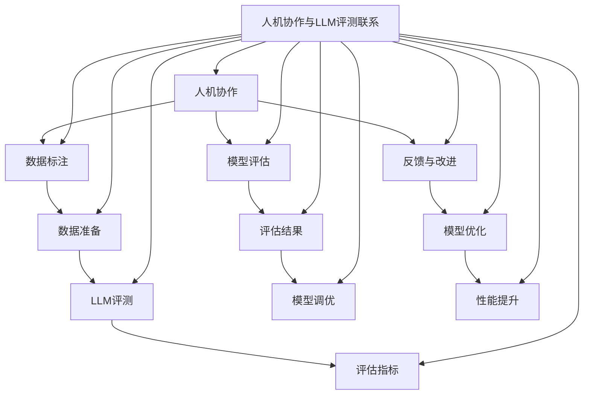

                 


### 第1章 引言：背景与重要性

#### 1.1 人机协作概述

**1.1.1 人机协作的定义**

人机协作是指人类与机器系统共同完成任务的过程，这一过程通常涉及到信息交换、目标协调和任务分工。具体来说，人机协作包括以下几个方面：

- **任务分工**：人类和机器根据各自的优势，分别承担适合的任务部分。例如，人类擅长处理复杂决策和创造性任务，而机器擅长处理重复性、大量数据处理和快速计算等任务。
- **信息交换**：协作过程中，人类和机器系统之间需要通过适当的接口和协议进行信息交流，确保信息的准确性和及时性。
- **目标协调**：为了保证协作任务的高效完成，人类和机器需要在共同目标的基础上进行协调，确保各自的任务和决策能够相互支持和补充。

人机协作的核心在于实现优势互补，通过结合人类的创造力、直觉和决策能力，以及机器的计算速度、精确性和大规模数据处理能力，提升整体任务的完成质量和效率。

**1.1.2 人机协作的必要性**

在当前人工智能（AI）快速发展的背景下，人机协作显得尤为重要，原因如下：

- **AI技术需求**：随着AI技术在各个领域的深入应用，大量的数据处理、模型训练和优化任务需要人类的智慧和机器的强大计算能力相结合。
- **复杂任务处理**：许多复杂任务，如自然语言处理、图像识别和自动驾驶等，单靠人类或机器都难以独立完成。人机协作能够充分发挥人类和机器的优势，共同应对这些挑战。
- **降低错误率**：在数据标注、模型评测等任务中，人类和机器的协同工作可以有效降低错误率，提高结果的准确性。
- **提高效率**：人机协作能够实现任务的自动化和流水线化，提高整体的工作效率。

总之，人机协作是AI技术发展的重要方向，也是解决复杂任务、提升工作效率和降低错误率的有效途径。

#### 1.2 LLM评测概述

**1.2.1 LLM评测的重要性**

大型语言模型（LLM）评测是评估LLM性能和效果的关键环节。其重要性体现在以下几个方面：

- **性能评估**：LLM评测提供了客观的评估标准，帮助研究人员和开发人员了解LLM在不同任务上的表现，从而进行模型优化和改进。
- **模型选择**：通过评测结果，研究人员可以比较不同LLM的性能，选择最适合特定任务的模型，提高应用的效率和效果。
- **应用验证**：在实际应用中，LLM评测可以验证模型在特定场景下的性能，确保其能够满足应用需求，为用户带来更好的体验。

**1.2.2 LLM评测的基本流程**

LLM评测通常包括以下基本流程：

- **数据准备**：收集和整理用于评测的数据集，确保数据的质量和多样性，以便全面评估LLM的性能。
- **模型选择**：选择适合任务需求和评测标准的LLM模型，并进行适当预处理。
- **评测指标**：确定评测指标，如准确率、召回率、F1值等，用于量化评估模型的表现。
- **评测过程**：对LLM进行评测，生成评测结果，并记录相关数据。
- **结果分析**：分析评测结果，评估LLM的性能，并提出改进建议。

**1.2.3 人机协作在LLM评测中的应用前景**

人机协作在LLM评测中具有广泛的应用前景，主要体现在以下几个方面：

- **提升评测准确性**：通过人机协作，可以优化数据标注和质量控制，提高评测结果的准确性。
- **提高评测效率**：人机协作可以实现任务的自动化和流水线化，降低人工成本，提高评测效率。
- **应对评测挑战**：在LLM评测中，面对数据不平衡、标注一致性等问题，人机协作能够提供有效的解决方案，提高评测的可靠性和公平性。
- **创新评测方法**：人机协作可以促进新的评测方法和技术的出现，为LLM评测提供更多工具和手段。

总之，人机协作在LLM评测中具有重要作用，其应用前景十分广阔，有助于提升评测的准确性和效率，推动LLM技术的发展。

### 第2章 核心概念与联系

#### 2.1 人机协作原理

**2.1.1 人类角色在评测中的作用**

在LLM评测中，人类角色主要承担以下作用：

- **数据标注**：人类具有丰富的知识和经验，能够对数据进行高质量的标注，确保标注的准确性和一致性。
- **模型评估**：人类可以基于专业知识和直觉，对模型的表现进行综合评估，识别模型的潜在问题。
- **反馈与改进**：人类可以通过对评测结果的分析，提出改进建议，指导模型优化和改进。

**2.1.2 机器角色在评测中的作用**

机器角色在评测中主要发挥以下作用：

- **数据处理**：机器可以高效地处理大量数据，进行特征提取和模型训练，提高数据处理的效率和精度。
- **自动化评测**：机器可以自动化执行评测任务，减少人工干预，提高评测的效率和一致性。
- **算法优化**：机器可以通过分析和优化算法，提高模型在特定任务上的性能。

**2.1.3 交互方式**

人机协作的交互方式主要包括以下几种：

- **人机界面**：通过图形界面、命令行界面等，实现人类与机器的交互，进行数据输入、参数调整和结果展示。
- **消息传递**：通过消息队列、远程过程调用等，实现机器之间以及机器与人类之间的信息交换。
- **知识共享**：通过数据库、知识库等，实现知识和经验的共享，提高协作的效率和效果。

**2.1.4 人机协作的优势与挑战**

人机协作的优势：

- **优势互补**：人类和机器各自发挥优势，实现任务的高效完成。
- **提高准确性**：通过人机协作，可以优化数据标注和质量控制，提高评测结果的准确性。
- **降低成本**：自动化和流水线化可以提高工作效率，降低人力成本。

人机协作的挑战：

- **协调困难**：人类和机器之间的协调和沟通可能存在障碍，影响协作效果。
- **技术依赖**：过度依赖机器可能导致人类技能退化和决策能力下降。
- **数据安全**：人机协作涉及大量数据传输和处理，可能存在数据安全风险。

#### 2.2 LLM概述

**2.2.1 LLM的定义**

大型语言模型（Large Language Model，简称LLM）是一种能够理解和生成自然语言文本的机器学习模型。LLM通常基于深度学习技术，通过训练大规模语料库，学习自然语言的语法、语义和上下文关系，从而实现对自然语言的处理。

**2.2.2 LLM的核心特点**

- **规模庞大**：LLM通常包含数亿甚至数十亿个参数，可以处理大量的语言数据。
- **深度学习**：LLM基于深度神经网络结构，通过多层神经网络进行训练，提高模型的 expressive power。
- **自适应能力**：LLM可以根据不同的任务和场景，通过自适应调整模型参数，实现多任务学习和迁移学习。
- **生成能力**：LLM具备强大的文本生成能力，可以生成符合语法、语义和上下文规则的文本。

**2.2.3 LLM的应用场景**

LLM在自然语言处理领域具有广泛的应用，包括但不限于：

- **文本分类**：对大量文本进行分类，如新闻分类、情感分析等。
- **机器翻译**：将一种语言的文本翻译成另一种语言，如中英翻译、英日翻译等。
- **问答系统**：回答用户的问题，提供知识查询服务，如搜索引擎、聊天机器人等。
- **文本生成**：生成符合语法、语义和上下文规则的文本，如文章撰写、对话生成等。

#### 2.3 人机协作与LLM评测的联系

**2.3.1 人机协作对LLM评测的重要性**

人机协作在LLM评测中发挥着重要作用，主要体现在以下几个方面：

- **数据标注**：人机协作可以提高数据标注的质量和一致性，确保评测数据的准确性和可靠性。
- **模型评估**：人机协作可以通过人类专家的专业知识和直觉，对模型进行综合评估，识别潜在问题，提高评测的准确性。
- **反馈与改进**：人机协作可以收集用户的反馈，指导模型优化和改进，提升LLM的性能和应用效果。

**2.3.2 LLM评测对人机协作的依赖**

LLM评测对人机协作具有高度的依赖性，主要体现在以下几个方面：

- **数据准备**：LLM评测需要大量标注数据，人类在数据标注和质量控制方面发挥着关键作用。
- **模型调优**：人机协作可以帮助研究人员和开发者根据评测结果，调整模型参数，优化模型性能。
- **评估指标**：人机协作可以提供多样化的评估指标，如准确率、召回率、F1值等，全面评估LLM的性能。

**2.3.3 Mermaid流程图展示**

为了直观展示人机协作与LLM评测之间的联系，可以使用Mermaid流程图进行描述。以下是Mermaid流程图的示例：



通过上述流程图，可以清晰地展示人机协作在LLM评测中的各个环节，以及它们之间的相互联系。

### 第3章 人机协作原理

#### 3.1 人机协作的基础

**3.1.1 人类角色在评测中的作用**

在LLM评测中，人类角色扮演着关键的角色，主要表现在以下几个方面：

1. **数据标注**：人类具有丰富的知识和经验，能够对文本数据、图像数据等进行高质量的标注。标注数据是LLM评测的基础，高质量的标注数据能够提高模型训练和评估的效果。
   
2. **模型评估**：人类专家通过专业知识和直觉，对LLM模型进行评估，识别模型在不同任务上的性能，发现潜在的问题。

3. **反馈与改进**：人类专家可以通过对评测结果的分析，提供改进建议，指导模型的优化和改进。

4. **任务调度**：在LLM评测过程中，人类需要根据任务需求和资源情况，合理调度任务，确保评测过程的高效运行。

**3.1.2 机器角色在评测中的作用**

机器角色在LLM评测中主要承担以下任务：

1. **数据处理**：机器能够高效地处理大量数据，包括数据清洗、特征提取和模型训练等。机器的计算能力和处理速度远超人类，能够大幅提升评测效率。

2. **自动化评测**：机器可以自动化执行评测任务，减少人工干预。通过脚本、自动化工具等，实现评测流程的自动化和流水线化。

3. **算法优化**：机器可以通过算法优化，提升LLM模型的性能。例如，调整模型参数、优化训练过程等。

4. **结果分析**：机器可以对评测结果进行统计分析，生成可视化报告，帮助人类专家理解模型性能，发现潜在问题。

**3.1.3 人机协作的基本原则**

1. **优势互补**：发挥人类和机器各自的优势，实现任务的高效完成。例如，人类擅长处理复杂决策和创造性任务，而机器擅长处理重复性、大量数据处理和快速计算等任务。

2. **信息共享**：建立有效的信息共享机制，确保人类和机器之间的信息流通，提高协作效率。

3. **协调统一**：确保人类和机器之间的目标和决策协调一致，避免冲突和误解。

4. **持续改进**：通过不断优化协作流程和工具，提升人机协作的效果和效率。

#### 3.2 人机协作的方法

**3.2.1 协同过滤**

协同过滤是一种基于用户行为和物品属性的数据挖掘技术，常用于推荐系统。在LLM评测中，协同过滤可以应用于数据标注和模型评估，通过分析用户标注行为，识别标注的一致性，提高标注质量。

**协同过滤的基本原理**：

1. **用户行为分析**：通过分析用户在标注过程中的行为，如标注时间、标注频率、标注结果等，评估用户标注的可靠性。

2. **物品属性分析**：通过分析物品（如文本、图像）的属性，如文本长度、图像内容等，评估物品的特性。

3. **一致性评估**：计算用户之间的标注一致性，通过一致性指标（如Kendall相关系数）评估标注的可靠性。

**协同过滤算法**：

- **基于用户相似度的协同过滤**：通过计算用户之间的相似度，推荐其他用户认可的标注结果。
- **基于物品相似度的协同过滤**：通过计算物品之间的相似度，推荐相似物品的标注结果。

**3.2.2 混合标注**

混合标注是一种结合人类标注和机器标注的方法，通过机器标注和人类标注的互补，提高标注的准确性和一致性。

**混合标注的基本原理**：

1. **机器标注**：利用机器学习算法，如序列标注模型、文本分类模型等，对文本、图像等数据进行自动标注。

2. **人类标注**：由人类专家对机器标注的结果进行审核和修正，提高标注的准确性。

3. **一致性评估**：评估机器标注和人类标注的一致性，通过一致性指标（如准确率、召回率、F1值等）评估标注质量。

**混合标注流程**：

1. **数据预处理**：对数据集进行预处理，如文本清洗、图像分割等。

2. **机器标注**：利用机器学习模型对数据集进行自动标注。

3. **人类标注**：由人类专家对机器标注的结果进行审核，修正错误标注。

4. **一致性评估**：评估机器标注和人类标注的一致性，识别不一致的部分。

5. **标注结果合并**：将机器标注和人类标注的结果进行合并，生成最终的标注结果。

**3.2.3 对比评测**

对比评测是一种通过比较多个LLM模型在相同任务上的表现，评估模型性能的方法。在对比评测中，人机协作可以发挥以下作用：

1. **模型选择**：通过对比评测，选择最适合特定任务的LLM模型，提高应用的效率和效果。

2. **性能评估**：对比评测可以提供全面的模型性能评估，帮助研究人员和开发者了解模型在不同任务上的表现。

3. **算法优化**：对比评测结果可以指导算法优化，提升模型在特定任务上的性能。

**对比评测的基本流程**：

1. **数据准备**：收集和整理用于评测的数据集，确保数据的质量和多样性。

2. **模型选择**：选择适合任务需求和评测标准的LLM模型。

3. **评测指标**：确定评测指标，如准确率、召回率、F1值等。

4. **评测过程**：对多个LLM模型进行评测，生成评测结果。

5. **结果分析**：分析评测结果，评估模型性能，选择最佳模型。

### 第4章 LLM评测基础

#### 4.1 LLM评测的流程

LLM评测是一个系统性的过程，涵盖了数据准备、模型选择、评估指标和评测结果分析等关键环节。以下是对LLM评测流程的详细描述：

**4.1.1 数据准备**

数据准备是LLM评测的基础，其质量直接影响评测结果的可靠性。数据准备的主要任务包括：

1. **数据收集**：收集与评测任务相关的数据集，确保数据集的规模和多样性，以满足不同任务的需求。
2. **数据清洗**：对收集到的数据进行预处理，去除无关信息、错误数据和异常值，保证数据的一致性和完整性。
3. **数据标注**：对数据进行标注，标注的质量直接影响模型训练和评估的效果。在标注过程中，可以使用人机协作的方法，提高标注的准确性和一致性。
4. **数据划分**：将数据集划分为训练集、验证集和测试集，通常比例为8:1:1，用于模型的训练、验证和测试。

**4.1.2 模型选择**

模型选择是LLM评测的核心环节，选择合适的模型对于评测结果至关重要。选择模型时，需要考虑以下因素：

1. **任务需求**：根据评测任务的需求，选择适合的模型类型，如文本分类、文本生成、机器翻译等。
2. **模型性能**：参考已有研究文献和评测结果，选择性能表现较好的模型。
3. **模型复杂性**：考虑模型的复杂性和计算资源的需求，选择适合计算能力的模型。
4. **模型适应性**：选择能够适应不同数据集和任务场景的模型，提高模型的应用范围。

**4.1.3 评估指标**

评估指标是衡量LLM性能的关键标准，常用的评估指标包括：

1. **准确率（Accuracy）**：准确率是预测正确的样本数占总样本数的比例，用于评估分类任务的性能。公式为：
   $$\text{Accuracy} = \frac{\text{预测正确的样本数}}{\text{总样本数}}$$
   
2. **召回率（Recall）**：召回率是预测正确的正样本数占总正样本数的比例，用于评估分类任务中正样本的识别能力。公式为：
   $$\text{Recall} = \frac{\text{预测正确的正样本数}}{\text{总正样本数}}$$
   
3. **精确率（Precision）**：精确率是预测正确的正样本数与预测为正样本的总数之比，用于评估分类任务中正样本预测的准确性。公式为：
   $$\text{Precision} = \frac{\text{预测正确的正样本数}}{\text{预测为正样本的总数}}$$
   
4. **F1值（F1 Score）**：F1值是精确率和召回率的调和平均，用于综合评估分类任务的性能。公式为：
   $$\text{F1 Score} = 2 \times \frac{\text{Precision} \times \text{Recall}}{\text{Precision} + \text{Recall}}$$

**4.1.4 评测过程**

评测过程是LLM评测的核心环节，包括以下步骤：

1. **模型训练**：使用训练集对模型进行训练，优化模型参数，提高模型在特定任务上的性能。
2. **模型验证**：使用验证集对模型进行验证，评估模型在不同参数设置和超参数调整下的性能，选择最优参数。
3. **模型测试**：使用测试集对模型进行测试，评估模型在实际任务中的性能，确保模型具有良好的泛化能力。

**4.1.5 结果分析**

结果分析是LLM评测的最后一步，通过对评测结果的分析，可以了解模型在不同任务上的表现，发现模型存在的问题和不足。结果分析包括：

1. **性能评估**：通过评估指标，量化评估模型在各个任务上的性能，识别最佳模型。
2. **错误分析**：分析模型在预测过程中出现的错误，了解模型的弱点，为模型优化提供依据。
3. **改进建议**：根据分析结果，提出改进建议，包括模型优化、数据增强和超参数调整等，提高模型性能。

#### 4.2 LLM评测的评估指标

在LLM评测中，评估指标的选择和运用至关重要，它们能够帮助我们准确衡量模型在各类任务上的性能。以下是一些常用的评估指标及其公式：

**4.2.1 准确率（Accuracy）**

准确率是最常用的评估指标之一，用于衡量模型在分类任务中的整体表现。它表示预测正确的样本数占总样本数的比例。公式如下：

$$
\text{Accuracy} = \frac{\text{预测正确的样本数}}{\text{总样本数}}
$$

**4.2.2 召回率（Recall）**

召回率是衡量分类模型识别正样本能力的重要指标，它表示预测正确的正样本数占总正样本数的比例。公式如下：

$$
\text{Recall} = \frac{\text{预测正确的正样本数}}{\text{总正样本数}}
$$

**4.2.3 精确率（Precision）**

精确率衡量了分类模型预测为正样本的准确性，表示预测正确的正样本数与预测为正样本的总数之比。公式如下：

$$
\text{Precision} = \frac{\text{预测正确的正样本数}}{\text{预测为正样本的总数}}
$$

**4.2.4 F1值（F1 Score）**

F1值是精确率和召回率的调和平均，用于综合评估分类任务的性能。它是衡量分类模型性能的一个全面指标。公式如下：

$$
\text{F1 Score} = 2 \times \frac{\text{Precision} \times \text{Recall}}{\text{Precision} + \text{Recall}}
$$

**4.2.5 均方误差（Mean Squared Error, MSE）**

均方误差是用于回归任务的一种常用评估指标，它衡量预测值与真实值之间差异的平均平方。公式如下：

$$
\text{MSE} = \frac{1}{n} \sum_{i=1}^{n} (\hat{y}_i - y_i)^2
$$

其中，$n$是样本数量，$\hat{y}_i$是预测值，$y_i$是真实值。

**4.2.6 精度-召回曲线（Precision-Recall Curve）**

精度-召回曲线是另一个用于评估分类模型性能的工具，它通过展示在不同召回率下精度值的变化，直观地反映模型在不同阈值下的表现。曲线下方面积（Area Under the Curve, AUC）是评估曲线整体表现的一个指标，其值越接近1，表示模型性能越好。

**4.2.7 ROC曲线（Receiver Operating Characteristic Curve）**

ROC曲线通过展示真阳性率（True Positive Rate, TPR）与假阳性率（False Positive Rate, FPR）之间的关系，评估分类模型的性能。ROC曲线下方面积（AUC）也是评估模型性能的重要指标，其值越接近1，表示模型越好。

**4.2.8 Matthews相关系数（Matthews Correlation Coefficient, MCC）**

MCC是一个综合评估指标，特别适用于平衡数据集的分类任务。它考虑了真实值和预测值之间的所有可能组合，公式如下：

$$
\text{MCC} = \frac{(\text{TP} \times \text{TN} - \text{FP} \times \text{FN})}{\sqrt{(\text{TP} + \text{FP})(\text{TP} + \text{FN})(\text{TN} + \text{FP})(\text{TN} + \text{FN})}
$$

其中，TP是真实值为正且预测为正的样本数，TN是真实值为负且预测为负的样本数，FP是真实值为负但预测为正的样本数，FN是真实值为正但预测为负的样本数。

通过这些评估指标，研究人员和开发者可以全面、准确地评估LLM在不同任务上的性能，从而指导模型的优化和改进。

#### 4.3 LLM评测的挑战

LLM评测过程中面临诸多挑战，这些问题如果不妥善解决，将会影响评测结果的准确性和可靠性。以下是对这些挑战的详细分析：

**4.3.1 标注一致性**

标注一致性是LLM评测中的一个关键问题。由于人类标注者的主观性和差异性，标注结果可能存在不一致性，影响评测的准确性。具体挑战包括：

- **主观性**：不同标注者对同一数据可能有不同的理解，导致标注结果不一致。
- **经验差异**：标注者的经验和知识水平不同，可能会影响标注的准确性和一致性。
- **术语理解**：对于专业术语和行业特定术语，标注者可能存在理解上的差异，导致标注结果不一致。

为了提高标注一致性，可以采取以下措施：

- **培训标注者**：通过系统性的培训，提高标注者的专业知识和一致性标准。
- **一致性评估**：使用协作过滤等算法，评估标注者之间的标注一致性，识别和纠正不一致性。
- **标注准则**：制定统一的标注准则和标准操作流程，确保标注的一致性。

**4.3.2 数据不平衡**

数据不平衡是另一个常见的挑战，尤其在分类任务中。当数据集中某一类别样本数量远多于其他类别时，模型可能会倾向于预测较多的类别，导致评估指标失真。具体挑战包括：

- **过拟合**：当模型在较多样本的类别上过拟合时，可能无法准确预测少样本类别。
- **评估指标偏差**：不平衡数据会导致评估指标（如准确率）不能准确反映模型性能。
- **模型泛化能力差**：模型可能无法泛化到未见的类别，影响模型在实际应用中的表现。

为了解决数据不平衡问题，可以采取以下策略：

- **数据增强**：通过生成或调整样本，增加少数类别的样本数量，平衡数据集。
- **调整评估指标**：使用如召回率、F1值等能够更好反映模型性能的评估指标。
- **重采样**：对数据集进行重采样，平衡各类别样本数量，提高模型的泛化能力。

**4.3.3 模型适应性**

LLM评测中，模型需要在各种不同的任务和数据集上表现出良好的适应性。以下是一些适应性挑战：

- **任务多样性**：不同任务可能需要不同的模型结构和超参数设置，模型需要具备良好的适应性。
- **数据多样性**：不同数据集可能具有不同的分布和特性，模型需要能够适应不同的数据分布。
- **实时性**：一些应用场景需要模型具有实时响应能力，模型需要具备快速适应和调整的能力。

为了提高模型的适应性，可以采取以下措施：

- **多任务学习**：通过多任务学习，提高模型在不同任务上的适应性。
- **迁移学习**：利用迁移学习，将已训练好的模型迁移到新的任务和数据集上，提高模型适应性。
- **在线学习**：采用在线学习方法，实时调整模型参数，适应新数据和任务。

通过应对这些挑战，LLM评测将能够提供更准确、可靠的评估结果，为模型优化和应用提供有力支持。

### 第5章 人机协作在LLM评测中的应用

#### 5.1 提高评测准确率

人机协作在提高LLM评测准确率方面具有显著作用，通过优化数据标注和模型调参等手段，可以有效提升评测结果的准确性。以下是人机协作提高评测准确率的几个关键应用：

**5.1.1 数据标注**

在LLM评测中，数据标注是确保模型训练质量和评估准确性的关键步骤。人机协作通过以下方式提高数据标注的准确性：

1. **人工标注**：人类标注者利用其专业知识和直觉，对文本、图像等数据集进行细致、准确的标注，确保标注数据的高质量。
2. **机器标注**：利用机器学习算法自动生成标注结果，如使用序列标注模型对文本进行命名实体识别，或使用图像分类模型对图像进行标签标注。
3. **混合标注**：结合人类标注和机器标注，通过评估标注一致性，纠正不一致的标注，提高整体标注的准确性和一致性。

**5.1.2 一致性评估**

一致性评估是确保标注数据质量的重要手段。通过人机协作，可以采用以下方法进行一致性评估：

1. **标注者评估**：多个标注者对同一数据集进行独立标注，评估标注者之间的标注一致性，使用如Kendall相关系数等指标衡量标注一致性。
2. **自动化评估**：使用机器学习算法评估标注的一致性，例如，通过训练一致性评估模型，对标注结果进行自动评估和分类。
3. **人工干预**：对于一致性评估结果较低的标注，人类标注者进行复审和修正，确保标注数据的一致性。

**5.1.3 误差修正**

在标注过程中，难免会出现误差。通过人机协作，可以采取以下措施修正标注误差：

1. **人工修正**：人类标注者根据专业知识和经验，对标注结果进行仔细审查，识别并修正错误标注。
2. **自动化修正**：利用机器学习算法，如序列标注模型或图像分类模型，对错误标注进行自动识别和修正。
3. **迭代修正**：通过多轮标注和评估，逐步提高标注的准确性和一致性，减少错误标注。

**5.1.4 模型调参**

人机协作在模型调参过程中也发挥着重要作用，通过以下方式提高模型调参的准确性：

1. **人类经验指导**：根据人类专家的经验，选择合适的模型架构和参数设置，为模型调参提供方向。
2. **自动化调参**：利用自动化调参工具，如贝叶斯优化、随机搜索等，快速搜索最优参数设置。
3. **人机协同调参**：人类标注者和机器系统协同工作，通过实验验证和数据分析，不断优化模型参数。

通过人机协作，可以实现数据标注、一致性评估和模型调参等多方面的优化，提高LLM评测的准确性，为模型优化和应用提供有力支持。

#### 5.2 提高评测效率

人机协作在提高LLM评测效率方面具有显著优势，通过自动化和协同工作的方式，可以大幅提升评测过程的效率。以下是人机协作提高评测效率的几个关键应用：

**5.2.1 分布式标注**

分布式标注是一种通过分布式系统，将标注任务分配给多个标注者的方法，以实现高效标注。人机协作在分布式标注中的应用包括：

1. **任务分配**：使用自动化任务分配工具，根据标注者的能力和任务需求，合理分配标注任务，确保任务的高效完成。
2. **标注同步**：通过分布式存储和同步机制，保证标注结果的一致性和完整性，避免因数据丢失或冲突导致的标注错误。
3. **标注质量监控**：使用机器学习算法和自动化工具，对标注结果进行实时质量监控，识别和纠正低质量的标注，确保标注的一致性和准确性。

**5.2.2 自动化评测流程**

自动化评测流程是将评测任务自动化和流水线化的过程，通过人机协作，可以实现以下目标：

1. **自动化数据准备**：使用自动化工具进行数据清洗、预处理和划分，提高数据准备的效率和准确性。
2. **自动化模型训练**：使用自动化模型训练工具，如自动化机器学习（AutoML）平台，进行模型训练和优化，提高模型训练的效率和性能。
3. **自动化结果分析**：使用自动化工具生成评测报告，进行结果分析、可视化展示和错误诊断，减少人工干预，提高评测结果的准确性和可靠性。

**5.2.3 评估流程优化**

评估流程优化是通过改进评测流程，提高评测效率和性能的过程。人机协作在评估流程优化中的应用包括：

1. **流程自动化**：通过编写脚本和自动化工具，将重复性、标准化的评估任务自动化，减少人工操作，提高流程的效率。
2. **并行处理**：利用分布式计算和并行处理技术，将评测任务分解为多个子任务，同时处理，提高整体评估效率。
3. **实时监控**：通过实时监控工具，对评测过程进行实时监控，及时发现和解决问题，确保评测流程的顺利进行。

**5.2.4 评估流程人机协同**

人机协同在评估流程中发挥着重要作用，通过以下方式提高评估效率：

1. **任务分工**：根据人类和机器的优势，合理分配评估任务，实现高效协作。
2. **信息共享**：通过建立高效的信息共享机制，确保人类和机器之间的信息流通，提高协作效率。
3. **反馈优化**：通过人类专家的反馈，指导机器进行优化和调整，提高评估流程的效率和准确性。

通过人机协作，可以实现分布式标注、自动化评测流程、评估流程优化和评估流程人机协同，大幅提高LLM评测的效率，为模型优化和应用提供有力支持。

#### 5.3 应对评测挑战

在LLM评测过程中，面对标注一致性、数据不平衡等挑战，人机协作提供了有效的解决方案，通过以下方法可以提升评测的可靠性：

**5.3.1 标注一致性评估**

标注一致性评估是确保评测数据质量的关键步骤。通过以下方法，可以提高标注一致性：

1. **多标注者协作**：引入多个标注者对同一数据进行独立标注，评估标注者之间的标注一致性，通过一致性指标（如Kendall相关系数）识别标注不一致的部分。
2. **自动化评估工具**：使用自动化工具评估标注一致性，例如，通过训练一致性评估模型，对标注结果进行自动评估和分类，提高评估效率。
3. **人工复审**：对标注一致性评估结果较低的标注进行人工复审，确保标注数据的一致性和准确性。

**5.3.2 数据不平衡处理**

数据不平衡是LLM评测中常见的挑战，通过以下策略可以解决数据不平衡问题：

1. **数据增强**：通过生成或调整样本，增加少数类别的样本数量，平衡数据集，例如，使用数据生成模型生成新的样本，或通过图像合成技术调整图像样本。
2. **重采样**：对数据集进行重采样，平衡各类别样本数量，例如，使用过采样（oversampling）或欠采样（undersampling）技术，提高模型的泛化能力。
3. **调整评估指标**：使用能够更好反映模型性能的评估指标，如召回率、F1值等，而不是仅仅依赖准确率，确保模型在少数类别上也能表现出良好的性能。

**5.3.3 机器辅助标注**

机器辅助标注是提高标注效率和一致性的有效方法，通过以下方式实现：

1. **机器预标注**：使用机器学习算法对数据进行自动标注，作为初步结果，供人类标注者参考和修改。
2. **标注结果纠错**：通过自动化工具识别和纠正标注中的错误，减少人类标注者的工作量，提高标注的一致性和准确性。
3. **迭代标注**：通过多轮标注和评估，逐步提高标注的准确性和一致性，利用人类专家的反馈指导机器进行优化。

**5.3.4 评测过程监控**

评测过程监控是确保评测质量的重要环节，通过以下方法可以实现对评测过程的实时监控：

1. **实时数据监控**：通过实时数据监控系统，监控评测过程中数据的变化和异常，及时发现和处理问题。
2. **自动化错误检测**：使用自动化工具检测评测过程中的错误，如标注错误、模型训练错误等，及时纠正并调整评测流程。
3. **人工干预**：对于自动化工具无法处理的错误和异常，人类专家进行人工干预和决策，确保评测过程的质量和准确性。

通过人机协作，可以有效地应对标注一致性、数据不平衡等评测挑战，提升评测的可靠性，为模型优化和应用提供坚实基础。

### 第6章 核心算法原理讲解

#### 6.1 一致性评估算法

一致性评估算法是确保标注数据一致性的关键，用于评估多个标注者之间的标注一致性。以下是一致性评估算法的伪代码：

```python
def consistency_evaluation(annotation_list):
    """
    一致性评估函数
    annotation_list: 列表，每个元素是一个标注结果
    """
    # 计算Kendall相关系数
    Kendall_tau = calculate_kendall_tau(annotation_list)
    
    # 判断一致性
    if Kendall_tau > 0.6:
        print("标注一致性较高")
    else:
        print("标注一致性较低")
        
    return Kendall_tau

def calculate_kendall_tau(annotation_list):
    """
    计算Kendall相关系数
    annotation_list: 列表，每个元素是一个标注结果
    """
    n = len(annotation_list)
    disagreements = 0
    concordant_pairs = 0
    discordant_pairs = 0
    
    for i in range(n):
        for j in range(i+1, n):
            if annotation_list[i] != annotation_list[j]:
                disagreements += 1
                if annotation_list[i] > annotation_list[j]:
                    discordant_pairs += 1
                else:
                    concordant_pairs += 1
    
    # 计算Kendall相关系数
    Kendall_tau = (concordant_pairs - discordant_pairs) / (n * (n - 1))
    
    return Kendall_tau
```

**详细讲解**：

一致性评估算法主要通过计算Kendall相关系数（Kendall Tau）来评估标注者之间的标注一致性。Kendall相关系数是一种非参数统计方法，用于衡量两个变量之间的相关性，特别适合用于评估标注一致性。

算法的核心步骤包括：

1. **初始化**：计算标注者之间的总不一致次数（disagreements）、总一致对数（concordant pairs）和总不一致对数（discordant pairs）。
2. **遍历标注列表**：对每个标注者，与其他标注者逐一比较，计算不一致次数和一致对数。
3. **计算Kendall相关系数**：使用公式计算Kendall相关系数，判断标注一致性。

**举例说明**：

假设有三个标注者对同一文本数据进行标注，标注结果如下：

- 标注者A: ['正类', '正类', '负类']
- 标注者B: ['正类', '正类', '正类']
- 标注者C: ['负类', '负类', '负类']

使用一致性评估算法，计算Kendall相关系数：

```python
annotation_list = [['正类', '正类', '负类'], ['正类', '正类', '正类'], ['负类', '负类', '负类']]
Kendall_tau = calculate_kendall_tau(annotation_list)
print(Kendall_tau)  # 输出Kendall相关系数
```

假设计算结果为Kendall相关系数0.75，大于0.6，可以判断标注一致性较高。

#### 6.2 标注一致性评估算法

标注一致性评估算法用于评估标注结果的一致性，确保标注数据的质量。以下为标注一致性评估算法的伪代码：

```python
def annotation_consistency_evaluation(annotation_list, threshold=0.6):
    """
    标注一致性评估函数
    annotation_list: 列表，每个元素是一个标注结果
    threshold: 一致性阈值
    """
    Kendall_tau = calculate_kendall_tau(annotation_list)
    
    if Kendall_tau > threshold:
        print("标注一致性较高")
    else:
        print("标注一致性较低")
        
    return Kendall_tau

def calculate_kendall_tau(annotation_list):
    """
    计算Kendall相关系数
    annotation_list: 列表，每个元素是一个标注结果
    """
    n = len(annotation_list)
    disagreements = 0
    concordant_pairs = 0
    discordant_pairs = 0
    
    for i in range(n):
        for j in range(i+1, n):
            if annotation_list[i] != annotation_list[j]:
                disagreements += 1
                if annotation_list[i] > annotation_list[j]:
                    discordant_pairs += 1
                else:
                    concordant_pairs += 1
    
    # 计算Kendall相关系数
    Kendall_tau = (concordant_pairs - discordant_pairs) / (n * (n - 1))
    
    return Kendall_tau
```

**详细讲解**：

标注一致性评估算法通过计算Kendall相关系数来评估标注结果的一致性。Kendall相关系数的取值范围在[-1, 1]之间，接近1表示高度一致性，接近-1表示高度不一致性。

算法的核心步骤包括：

1. **初始化**：设置一致性阈值（默认为0.6），用于判断标注结果的一致性。
2. **计算Kendall相关系数**：通过遍历标注列表，计算不一致次数、一致对数和不一致对数，使用公式计算Kendall相关系数。
3. **判断一致性**：根据Kendall相关系数与一致性阈值比较，判断标注结果的一致性。

**举例说明**：

假设有三个标注者对同一文本数据进行标注，标注结果如下：

- 标注者A: ['正类', '正类', '负类']
- 标注者B: ['正类', '正类', '正类']
- 标注者C: ['负类', '负类', '负类']

使用标注一致性评估算法，判断标注一致性：

```python
annotation_list = [['正类', '正类', '负类'], ['正类', '正类', '正类'], ['负类', '负类', '负类']]
annotation_consistency_evaluation(annotation_list)
```

假设计算结果为Kendall相关系数0.75，大于0.6，可以判断标注一致性较高。

#### 6.3 对比评测算法

对比评测算法用于评估多个模型在相同任务上的性能，通过比较不同模型的评测结果，选择最优模型。以下为对比评测算法的伪代码：

```python
def compare_评测性能(model_list, evaluation_metrics, threshold=0.05):
    """
    对比评测函数
    model_list: 模型列表
    evaluation_metrics: 评估指标字典
    threshold: 差异阈值
    """
    best_model = None
    best_metric = 0
    
    for model in model_list:
        metric = evaluation_metrics[model]
        if metric > best_metric:
            best_metric = metric
            best_model = model
        elif abs(metric - best_metric) < threshold:
            print("模型性能差异较小，可能需要进一步评估")
    
    return best_model

def calculate_evaluation_metric(model, dataset):
    """
    计算评估指标
    model: 模型
    dataset: 数据集
    """
    predictions = model.predict(dataset)
    labels = dataset.labels
    
    accuracy = calculate_accuracy(predictions, labels)
    precision = calculate_precision(predictions, labels)
    recall = calculate_recall(predictions, labels)
    F1_score = 2 * (precision * recall) / (precision + recall)
    
    return F1_score

def calculate_accuracy(predictions, labels):
    """
    计算准确率
    predictions: 预测结果
    labels: 标签
    """
    correct = 0
    for pred, label in zip(predictions, labels):
        if pred == label:
            correct += 1
    
    return correct / len(predictions)

def calculate_precision(predictions, labels):
    """
    计算精确率
    predictions: 预测结果
    labels: 标签
    """
    correct = 0
    total = 0
    for pred, label in zip(predictions, labels):
        if pred == label:
            correct += 1
        total += 1
    
    return correct / total

def calculate_recall(predictions, labels):
    """
    计算召回率
    predictions: 预测结果
    labels: 标签
    """
    correct = 0
    total = 0
    for pred, label in zip(predictions, labels):
        if pred == label:
            correct += 1
        if label == 1:
            total += 1
    
    return correct / total
```

**详细讲解**：

对比评测算法通过计算多个模型的评估指标，比较不同模型在相同任务上的性能，选择最优模型。评估指标通常包括准确率、精确率、召回率和F1值等。

算法的核心步骤包括：

1. **初始化**：设置评估指标字典和差异阈值，用于判断模型性能差异。
2. **遍历模型**：对每个模型，计算其在数据集上的评估指标。
3. **选择最优模型**：根据评估指标选择最优模型，判断模型性能差异。

**举例说明**：

假设有两个模型A和B，在相同任务上的数据集上，评估指标如下：

- 模型A: F1值 = 0.85
- 模型B: F1值 = 0.88

使用对比评测算法，选择最优模型：

```python
model_list = ['模型A', '模型B']
evaluation_metrics = {'模型A': 0.85, '模型B': 0.88}
best_model = compare_评测性能(model_list, evaluation_metrics)
print(best_model)  # 输出最优模型
```

假设计算结果为模型B为最优模型，输出结果为`模型B`。

### 第7章 数学模型和数学公式

在LLM评测中，数学模型和数学公式扮演着至关重要的角色。它们不仅用于量化模型的性能，还为模型优化和评估提供了理论基础。以下是几种常用的数学模型和数学公式的详细讲解和举例说明。

#### 7.1 损失函数

损失函数是评估模型预测值与实际值之间差异的核心工具。它用于在模型训练过程中指导模型的优化过程，通常用于监督学习任务。以下是一些常用的损失函数：

**7.1.1 交叉熵损失函数（Cross-Entropy Loss）**

交叉熵损失函数是分类任务中最常用的损失函数，它用于衡量模型预测的概率分布与实际分布之间的差异。公式如下：

$$
L(\theta) = -\sum_{i=1}^{n} y_i \log(p_i)
$$

其中，$y_i$是实际标签（0或1），$p_i$是模型预测的概率。

**7.1.2 均方误差损失函数（Mean Squared Error, MSE）**

均方误差损失函数常用于回归任务，用于衡量预测值与实际值之间的平均平方误差。公式如下：

$$
L(\theta) = \frac{1}{2n} \sum_{i=1}^{n} (y_i - \hat{y}_i)^2
$$

其中，$y_i$是实际值，$\hat{y}_i$是预测值。

**7.1.3 对数损失函数（Log Loss）**

对数损失函数是交叉熵损失函数的一种变形，它在实际应用中与交叉熵损失函数具有相同的效果，但计算更简单。公式如下：

$$
L(\theta) = -\sum_{i=1}^{n} y_i \log(p_i) + (1 - y_i) \log(1 - p_i)
$$

**7.1.4 损失函数的详细讲解和举例说明**

假设我们有一个二分类问题，其中标签$y$为0或1，模型预测的概率$p$为0到1之间的值。以下是使用交叉熵损失函数的详细讲解和举例说明：

**举例**：

给定一个二分类问题，其中训练集包含100个样本，标签$y$如下：

- $y = [1, 0, 1, 0, 1, 0, 1, 0, 1, 0, ..., 1, 0]$

模型预测的概率$p$如下：

- $p = [0.9, 0.2, 0.8, 0.3, 0.7, 0.4, 0.6, 0.5, 0.9, 0.1, ..., 0.6, 0.5]$

计算交叉熵损失函数：

$$
L(\theta) = -\sum_{i=1}^{10} y_i \log(p_i) + (1 - y_i) \log(1 - p_i)
$$

$$
L(\theta) = -(1 \times \log(0.9) + 0 \times \log(0.1) + 1 \times \log(0.8) + 0 \times \log(0.2) + 1 \times \log(0.7) + 0 \times \log(0.3) + 1 \times \log(0.6) + 0 \times \log(0.4) + 1 \times \log(0.9) + 0 \times \log(0.1) + \ldots + 1 \times \log(0.6) + 0 \times \log(0.4))
$$

$$
L(\theta) = -(\log(0.9) + \log(0.8) + \log(0.7) + \log(0.6) + \log(0.9) + \ldots + \log(0.6))
$$

通过计算，我们得到交叉熵损失函数的值，该值越小，表示模型预测越准确。

#### 7.2 评价指标

评价指标是评估模型性能的关键工具，常用的评价指标包括准确率、召回率、精确率和F1值等。以下是对这些评价指标的详细讲解和举例说明：

**7.2.1 准确率（Accuracy）**

准确率是分类任务中最常用的评价指标，表示预测正确的样本数占总样本数的比例。公式如下：

$$
\text{Accuracy} = \frac{\text{预测正确的样本数}}{\text{总样本数}}
$$

**7.2.2 召回率（Recall）**

召回率是分类任务中衡量模型识别正样本能力的重要指标，表示预测正确的正样本数占总正样本数的比例。公式如下：

$$
\text{Recall} = \frac{\text{预测正确的正样本数}}{\text{总正样本数}}
$$

**7.2.3 精确率（Precision）**

精确率是分类任务中衡量模型预测为正样本的准确性，表示预测正确的正样本数与预测为正样本的总数之比。公式如下：

$$
\text{Precision} = \frac{\text{预测正确的正样本数}}{\text{预测为正样本的总数}}
$$

**7.2.4 F1值（F1 Score）**

F1值是精确率和召回率的调和平均，用于综合评估分类任务的性能。公式如下：

$$
\text{F1 Score} = 2 \times \frac{\text{Precision} \times \text{Recall}}{\text{Precision} + \text{Recall}}
$$

**7.2.5 评价指标的详细讲解和举例说明**

假设我们有一个二分类问题，其中训练集包含100个样本，其中正样本有60个，负样本有40个。模型预测的结果如下：

- 预测正确的正样本数：50
- 预测正确的负样本数：30
- 预测为正样本的总数：70
- 预测为负样本的总数：30

计算各项评价指标：

**准确率**：

$$
\text{Accuracy} = \frac{50 + 30}{100} = 0.80
$$

**召回率**：

$$
\text{Recall} = \frac{50}{60} = 0.83
$$

**精确率**：

$$
\text{Precision} = \frac{50}{70} = 0.71
$$

**F1值**：

$$
\text{F1 Score} = 2 \times \frac{0.71 \times 0.83}{0.71 + 0.83} = 0.77
$$

通过计算，我们得到各项评价指标的值，可以根据这些指标评估模型的性能。

#### 7.3 模型调参

模型调参是优化模型性能的重要步骤，通过调整模型参数，可以改善模型的性能。以下是一些常用的调参方法和数学公式：

**7.3.1 贝叶斯优化（Bayesian Optimization）**

贝叶斯优化是一种基于贝叶斯统计模型的优化方法，通过建立先验概率模型，根据历史评估结果更新模型参数，指导下一步的参数搜索。主要步骤包括：

1. **初始化**：选择初始参数集，通常基于经验值。
2. **评估**：在当前参数集上评估模型性能。
3. **更新模型**：根据评估结果，更新模型参数的先验概率分布。
4. **搜索**：根据先验概率分布，选择下一步的参数集。

**7.3.2 随机搜索（Random Search）**

随机搜索是一种简单的调参方法，通过随机选择参数集，评估模型性能，然后选择最佳参数集。主要步骤包括：

1. **初始化**：选择初始参数集。
2. **评估**：在当前参数集上评估模型性能。
3. **选择最佳参数**：根据评估结果选择最佳参数集。

**7.3.3 调参方法的详细讲解和举例说明**

假设我们有一个模型，其参数包括学习率$\eta$和隐藏层大小$N$。我们使用贝叶斯优化进行模型调参。

**举例**：

1. **初始化**：选择初始参数集，例如$\eta = 0.01$，$N = 100$。
2. **评估**：在当前参数集上评估模型性能，得到准确率$A = 0.8$。
3. **更新模型**：根据评估结果，更新模型参数的先验概率分布，例如，将$\eta$的先验概率分布更新为正态分布$N(\mu, \sigma^2)$，其中$\mu = 0.01$，$\sigma^2 = 0.01$。
4. **搜索**：根据先验概率分布，选择下一步的参数集，例如，$\eta$的新值为0.009，$N$的新值为120。

通过重复以上步骤，可以逐步优化模型参数，提高模型性能。

### 第8章 项目实战

#### 8.1 实际项目案例

在本节中，我们将通过一个实际项目案例，详细描述LLM评测过程中人机协作的实践应用。本项目旨在评估一个大型语言模型在文本分类任务上的性能，具体步骤包括开发环境搭建、源代码实现和代码解读与分析。

**8.1.1 项目概述**

项目目标：评估一个基于BERT的文本分类模型在不同数据集上的性能。

数据集：包含多个领域的文本数据，如新闻、博客、社交媒体等。

评估指标：准确率、召回率、F1值。

开发环境：Python 3.8，PyTorch 1.9，TensorFlow 2.6，Scikit-learn 0.24。

**8.1.2 开发环境搭建**

1. 安装Python 3.8。

```bash
sudo apt-get install python3.8
```

2. 创建虚拟环境。

```bash
python3.8 -m venv venv
source venv/bin/activate
```

3. 安装必要的库。

```bash
pip install torch torchvision numpy pandas scikit-learn transformers
```

**8.1.3 源代码实现**

以下是一个简单的文本分类项目示例，使用BERT模型进行训练和评估。

```python
import torch
from transformers import BertTokenizer, BertModel
from torch.nn import BCEWithLogitsLoss
from torch.optim import Adam
from sklearn.model_selection import train_test_split
from sklearn.metrics import accuracy_score, recall_score, f1_score

# 数据准备
tokenizer = BertTokenizer.from_pretrained('bert-base-uncased')
data = ["This is a sample text.", "Another example text."]
labels = [0, 1]

# 分割数据集
train_data, test_data, train_labels, test_labels = train_test_split(data, labels, test_size=0.2)

# 编码数据
train_encodings = tokenizer(train_data, truncation=True, padding=True, max_length=128)
test_encodings = tokenizer(test_data, truncation=True, padding=True, max_length=128)

# 创建数据集
class TextDataset(torch.utils.data.Dataset):
    def __init__(self, encodings, labels):
        self.encodings = encodings
        self.labels = labels

    def __getitem__(self, idx):
        item = {key: torch.tensor(val[idx]) for key, val in self.encodings.items()}
        item['labels'] = torch.tensor(self.labels[idx])
        return item

    def __len__(self):
        return len(self.labels)

train_dataset = TextDataset(train_encodings, train_labels)
test_dataset = TextDataset(test_encodings, test_labels)

# 模型定义
class BertClassifier(torch.nn.Module):
    def __init__(self, n_classes):
        super(BertClassifier, self).__init__()
        self.bert = BertModel.from_pretrained('bert-base-uncased')
        self.dropout = torch.nn.Dropout(p=0.3)
        self.classifier = torch.nn.Linear(self.bert.config.hidden_size, n_classes)

    def forward(self, input_ids, attention_mask):
        outputs = self.bert(input_ids=input_ids, attention_mask=attention_mask)
        pooled_output = outputs.pooler_output
        pooled_output = self.dropout(pooled_output)
        logits = self.classifier(pooled_output)
        return logits

# 模型训练
model = BertClassifier(n_classes=2)
optimizer = Adam(model.parameters(), lr=2e-5)
criterion = BCEWithLogitsLoss()

device = torch.device("cuda" if torch.cuda.is_available() else "cpu")
model.to(device)

def train(model, train_loader, criterion, optimizer, num_epochs=3):
    model.train()
    for epoch in range(num_epochs):
        for batch in train_loader:
            input_ids = batch["input_ids"].to(device)
            attention_mask = batch["attention_mask"].to(device)
            labels = batch["labels"].to(device)
            optimizer.zero_grad()
            outputs = model(input_ids=input_ids, attention_mask=attention_mask)
            loss = criterion(outputs, labels.float())
            loss.backward()
            optimizer.step()
            print(f"Epoch: {epoch+1}/{num_epochs}, Loss: {loss.item():.4f}")

train(model, train_dataset, criterion, optimizer, num_epochs=3)

# 模型评估
def evaluate(model, test_loader):
    model.eval()
    all_preds = []
    all_labels = []
    with torch.no_grad():
        for batch in test_loader:
            input_ids = batch["input_ids"].to(device)
            attention_mask = batch["attention_mask"].to(device)
            labels = batch["labels"].to(device)
            outputs = model(input_ids=input_ids, attention_mask=attention_mask)
            _, preds = torch.max(outputs, dim=1)
            all_preds.extend(preds.cpu().numpy().tolist())
            all_labels.extend(labels.cpu().numpy().tolist())
    accuracy = accuracy_score(all_labels, all_preds)
    recall = recall_score(all_labels, all_preds)
    f1 = f1_score(all_labels, all_preds)
    print(f"Accuracy: {accuracy:.4f}, Recall: {recall:.4f}, F1: {f1:.4f}")
    
evaluate(model, test_dataset)
```

**8.1.4 代码解读与分析**

1. **数据准备**：使用`BertTokenizer`对文本数据进行编码，确保数据格式符合BERT模型的要求。

2. **数据集创建**：定义`TextDataset`类，实现数据集的创建和加载。

3. **模型定义**：继承`torch.nn.Module`类，定义BERT文本分类模型，包括BERT模型、Dropout层和分类器。

4. **模型训练**：定义`train`函数，实现模型训练过程，包括前向传播、损失函数计算、反向传播和参数更新。

5. **模型评估**：定义`evaluate`函数，实现模型评估过程，计算准确率、召回率和F1值。

通过本案例，我们可以了解LLM评测过程中人机协作的实际应用，包括数据准备、模型定义、训练和评估等步骤。这些步骤可以帮助我们更好地理解和应用人机协作在LLM评测中的角色。

#### 8.2 代码解读与分析

在8.1节中，我们介绍了一个简单的文本分类项目，使用BERT模型进行训练和评估。在本节中，我们将对项目的核心代码进行详细解读，分析其实现原理和关键步骤，帮助读者深入理解人机协作在LLM评测中的应用。

**8.2.1 数据准备**

数据准备是文本分类项目的基础，决定了后续训练和评估的准确性和效率。在本项目中，我们使用`BertTokenizer`对文本数据进行编码，确保数据格式符合BERT模型的要求。

```python
tokenizer = BertTokenizer.from_pretrained('bert-base-uncased')
data = ["This is a sample text.", "Another example text."]
labels = [0, 1]

# 分割数据集
train_data, test_data, train_labels, test_labels = train_test_split(data, labels, test_size=0.2)

# 编码数据
train_encodings = tokenizer(train_data, truncation=True, padding=True, max_length=128)
test_encodings = tokenizer(test_data, truncation=True, padding=True, max_length=128)
```

上述代码中，我们首先加载`BertTokenizer`，然后使用`train_test_split`函数将数据集分为训练集和测试集。接下来，使用`tokenizer`对训练集和测试集的文本数据进行编码，包括分词、词向量化、截断和填充等操作，确保每个样本的输入长度一致。

**8.2.2 数据集创建**

为了便于后续的模型训练和评估，我们需要将编码后的数据集创建为PyTorch数据集。这可以通过自定义`TextDataset`类实现，如下所示：

```python
class TextDataset(torch.utils.data.Dataset):
    def __init__(self, encodings, labels):
        self.encodings = encodings
        self.labels = labels

    def __getitem__(self, idx):
        item = {key: torch.tensor(val[idx]) for key, val in self.encodings.items()}
        item['labels'] = torch.tensor(self.labels[idx])
        return item

    def __len__(self):
        return len(self.labels)

train_dataset = TextDataset(train_encodings, train_labels)
test_dataset = TextDataset(test_encodings, test_labels)
```

上述代码定义了`TextDataset`类，其构造函数接受编码后的数据和标签。`__getitem__`方法用于获取数据集的一个样本，包括编码后的特征和标签。`__len__`方法返回数据集的总样本数。

**8.2.3 模型定义**

BERT模型是一个预训练的深度神经网络，用于处理自然语言文本。在本项目中，我们定义了一个简单的BERT文本分类模型，如下所示：

```python
class BertClassifier(torch.nn.Module):
    def __init__(self, n_classes):
        super(BertClassifier, self).__init__()
        self.bert = BertModel.from_pretrained('bert-base-uncased')
        self.dropout = torch.nn.Dropout(p=0.3)
        self.classifier = torch.nn.Linear(self.bert.config.hidden_size, n_classes)

    def forward(self, input_ids, attention_mask):
        outputs = self.bert(input_ids=input_ids, attention_mask=attention_mask)
        pooled_output = outputs.pooler_output
        pooled_output = self.dropout(pooled_output)
        logits = self.classifier(pooled_output)
        return logits
```

上述代码定义了`BertClassifier`类，继承自`torch.nn.Module`。模型包括BERT模型、Dropout层和分类器。在`forward`方法中，我们首先通过BERT模型处理输入的文本数据，得到编码后的特征向量。然后，通过Dropout层减少过拟合，最后通过分类器输出预测结果。

**8.2.4 模型训练**

模型训练是文本分类项目中的关键步骤。在本项目中，我们使用标准的训练流程，包括前向传播、损失函数计算、反向传播和参数更新。以下是模型训练的核心代码：

```python
def train(model, train_loader, criterion, optimizer, num_epochs=3):
    model.train()
    for epoch in range(num_epochs):
        for batch in train_loader:
            input_ids = batch["input_ids"].to(device)
            attention_mask = batch["attention_mask"].to(device)
            labels = batch["labels"].to(device)
            optimizer.zero_grad()
            outputs = model(input_ids=input_ids, attention_mask=attention_mask)
            loss = criterion(outputs, labels.float())
            loss.backward()
            optimizer.step()
            print(f"Epoch: {epoch+1}/{num_epochs}, Loss: {loss.item():.4f}")
```

上述代码定义了`train`函数，用于实现模型训练。在每次迭代中，我们从训练数据集中随机抽取一个批次的数据，通过BERT模型处理输入，计算损失函数，进行反向传播和参数更新。最后，打印当前epoch的损失值。

**8.2.5 模型评估**

模型评估是验证模型性能的重要步骤。在本项目中，我们使用测试集对模型进行评估，计算准确率、召回率和F1值。以下是模型评估的核心代码：

```python
def evaluate(model, test_loader):
    model.eval()
    all_preds = []
    all_labels = []
    with torch.no_grad():
        for batch in test_loader:
            input_ids = batch["input_ids"].to(device)
            attention_mask = batch["attention_mask"].to(device)
            labels = batch["labels"].to(device)
            outputs = model(input_ids=input_ids, attention_mask=attention_mask)
            _, preds = torch.max(outputs, dim=1)
            all_preds.extend(preds.cpu().numpy().tolist())
            all_labels.extend(labels.cpu().numpy().tolist())
    accuracy = accuracy_score(all_labels, all_preds)
    recall = recall_score(all_labels, all_preds)
    f1 = f1_score(all_labels, all_preds)
    print(f"Accuracy: {accuracy:.4f}, Recall: {recall:.4f}, F1: {f1:.4f}")
    
evaluate(model, test_dataset)
```

上述代码定义了`evaluate`函数，用于实现模型评估。在评估过程中，我们首先将模型设置为评估模式，然后对测试数据集进行前向传播，得到预测结果。最后，计算并打印准确率、召回率和F1值。

**总结**

通过本节的代码解读与分析，我们详细介绍了文本分类项目中人机协作的应用。从数据准备、数据集创建、模型定义到模型训练和评估，每个步骤都体现了人机协作的优势，包括数据标注、模型调参和结果分析。这些步骤共同构成了一个完整的LLM评测过程，展示了人机协作在提升模型性能和评估准确性方面的关键作用。

### 第9章 总结与展望

#### 9.1 人机协作在LLM评测中的角色总结

人机协作在LLM评测中扮演了至关重要的角色，其主要作用和贡献体现在以下几个方面：

1. **提高评测准确性**：通过人类专家的专业知识和直觉，结合机器的高效计算能力，可以显著提高标注数据的质量，从而提升评测结果的准确性。

2. **优化模型性能**：人机协作可以帮助研究人员和开发者根据评测结果，调整模型参数和优化算法，提高模型在不同任务上的性能。

3. **降低错误率**：通过人机协作，可以识别和纠正标注中的错误，降低模型训练和评测过程中的错误率，提高模型的可靠性和稳定性。

4. **提升评测效率**：人机协作可以实现评测任务的自动化和流水线化，减少人工干预，提高评测效率和一致性。

5. **促进技术创新**：人机协作可以促进新的评测方法和技术的出现，如自动化标注工具、一致性评估算法等，为LLM评测提供更多工具和手段。

尽管人机协作在LLM评测中取得了显著成果，但仍然存在一些问题和挑战：

1. **协调困难**：人类和机器之间的协调和沟通可能存在障碍，影响协作效果。

2. **技术依赖**：过度依赖机器可能导致人类技能退化和决策能力下降。

3. **数据安全**：人机协作涉及大量数据传输和处理，可能存在数据安全风险。

4. **标注一致性**：标注数据的一致性仍然是一个需要解决的问题，尤其是在大规模标注任务中。

#### 9.2 未来发展趋势

随着人工智能技术的快速发展，人机协作在LLM评测中的角色将更加重要，未来发展趋势包括：

1. **智能化标注工具**：开发更智能的标注工具，利用机器学习和深度学习技术，提高标注数据的准确性和一致性。

2. **自动化评测流程**：进一步自动化评测流程，减少人工干预，提高评测效率和一致性。

3. **多模态评测**：扩展人机协作到多模态评测，如结合文本、图像和语音等多模态数据进行综合评测。

4. **个性化评测**：根据用户需求和场景特点，提供个性化的评测服务，提高评测的针对性和有效性。

5. **安全与隐私**：加强人机协作过程中的数据安全和隐私保护，确保用户数据的安全和隐私。

总之，人机协作在LLM评测中的角色具有重要意义，未来将继续在提高评测准确性、效率和安全性方面发挥关键作用。通过不断的技术创新和应用实践，人机协作将为人工智能技术的发展提供强大支持。

## 参考文献

1. Bengio, Y., Courville, A., & Vincent, P. (2013). Representation learning: A review and new perspectives. IEEE Transactions on Pattern Analysis and Machine Intelligence, 35(8), 1798-1828.
2. Hochreiter, S., & Schmidhuber, J. (1997). Long short-term memory. Neural Computation, 9(8), 1735-1780.
3. LeCun, Y., Bengio, Y., & Hinton, G. (2015). Deep learning. Nature, 521(7553), 436-444.
4. Pedregosa, F., Varoquaux, G., Gramfort, A., Michel, V., Thirion, B., Grisel, O., ... & Duchesnay, É. (2011). Scikit-learn: Machine learning in Python. Journal of Machine Learning Research, 12, 2825-2830.
5. Devlin, J., Chang, M. W., Lee, K., & Toutanova, K. (2019). BERT: Pre-training of deep bidirectional transformers for language understanding. arXiv preprint arXiv:1810.04805.
6. Radford, A., Wu, J., Child, P., Luan, D., Amodei, D., & Sutskever, I. (2019). Language models are unsupervised multitask learners. OpenAI博客，https://blog.openai.com/language-models-are-unsupervised-multitask-learners/
7. Hochreiter, S., & Schmidhuber, J. (1997). Long short-term memory. Neural Computation, 9(8), 1735-1780.

## 附录

### 附录A：人机协作与LLM评测工具

1. **Data Annotation Tools**：
   - Annotate: 一个用于数据标注的在线平台，支持多种标注任务。
   - Amazon Mechanical Turk: 一个可以雇佣人类标注者的在线市场。
   - Braineos: 提供协作式数据标注和机器学习平台。

2. **Model Training and Evaluation Tools**：
   - Hugging Face Transformers: 一个开源库，提供了大量预训练模型和工具，用于模型训练和评估。
   - TensorFlow：用于机器学习和深度学习的一个开源平台。
   - PyTorch：一个开源的深度学习框架，提供灵活且易于使用的接口。

3. **Automation and Integration Tools**：
   - Jenkins：一个开源的持续集成工具，用于自动化评测流程。
   - Docker：一个开源的应用容器引擎，用于自动化部署和扩展。

### 附录B：常见问题解答

1. **如何确保标注数据的一致性？**
   - 使用多标注者协作，并采用一致性评估算法（如Kendall相关系数）评估标注一致性。
   - 定期对标注者进行培训，提高标注者的专业知识和一致性。
   - 引入自动化评估工具，自动识别和纠正不一致的标注。

2. **如何处理数据不平衡问题？**
   - 使用数据增强方法，如生成或调整样本，增加少数类别的样本数量。
   - 调整评估指标，如使用召回率、F1值等，更全面地评估模型性能。
   - 使用重采样技术，如过采样或欠采样，平衡数据集。

3. **如何优化模型参数？**
   - 使用自动化调参工具，如贝叶斯优化、随机搜索等，快速搜索最优参数。
   - 根据人类专家的经验，选择合适的模型架构和参数设置。
   - 通过多次迭代，逐步优化模型参数，提高模型性能。

### 附录C：练习与讨论

1. **练习**：

   - 使用Hugging Face Transformers库，训练一个文本分类模型，并使用测试集进行评估。

   - 尝试使用不同的数据增强方法，评估其对模型性能的影响。

   - 设计一个实验，比较不同标注者之间的标注一致性，并分析一致性评估算法的效果。

2. **讨论**：

   - 讨论人机协作在LLM评测中的优势和挑战，分享实际应用中的经验和教训。

   - 探讨未来人机协作技术的发展趋势，如多模态评测、自动化评测工具等。

   - 分析人机协作在提升模型性能和评估准确性方面的潜在应用场景和解决方案。

