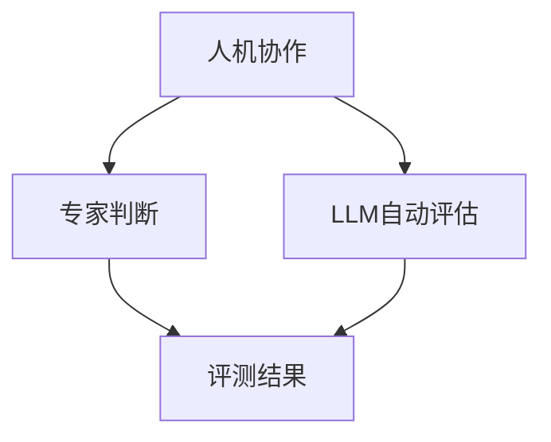

                 

为了撰写一篇满足要求的文章，我们需要遵循以下步骤来构建内容：

### 1. 确定文章结构

根据提供的目录大纲，我们将文章分为8个主要部分：

1. **引言**
2. **人机协作基础**
3. **专家判断理论**
4. **LLM自动评估**
5. **人机协作评测流程**
6. **实例分析**
7. **专家系统与LLM集成**
8. **评测工具**

### 2. 撰写引言部分

**背景介绍**

在人工智能与人类专家协同工作的场景中，评测的重要性不言而喻。评测不仅有助于评估系统的性能，还能指导系统优化和改进。本文将探讨如何结合专家判断与LLM自动评估进行人机协作评测。

**核心概念与联系**

为了更好地理解人机协作评测，我们需要明确以下几个核心概念：

- **人机协作**：人类与计算机系统共同完成任务的过程。
- **专家判断**：领域专家依据专业知识对任务结果进行评价。
- **LLM自动评估**：利用大型语言模型自动生成评估结果。

下面是一个Mermaid流程图，展示这几个概念之间的关系：

### 3. 撰写人机协作基础部分

**人机协作的定义与模式**

人机协作是指人类和计算机系统共同完成任务的过程。根据协作方式，人机协作可以分为以下几种模式：

- **任务分解**：系统将复杂任务分解为多个子任务，人类专家负责完成其中部分任务，系统负责完成其余任务。
- **监督协作**：系统执行任务，人类专家提供指导或纠正。
- **交互式协作**：人类专家与系统实时交互，共同完成任务。

**人机协作的优势与挑战**

**优势：**

- 提高任务完成效率。
- 充分发挥人类专家的判断力和经验。
- 减轻人类的工作负担。

**挑战：**

- 协作过程复杂，需要协调人类与系统之间的工作。
- 评测结果准确性与一致性难以保证。

### 4. 撰写专家判断理论部分

**专家判断概述**

专家判断是指领域专家依据专业知识对任务结果进行评价。这种方法的优势在于能够充分利用专家的经验和判断力，提高评测结果的准确性。然而，专家判断也存在一些局限性，如主观性较强、一致性难以保证等。

**专家判断的方法论**

- **经验法**：专家依据个人经验进行判断。
- **模型法**：建立数学模型，通过模型分析结果。
- **综合法**：结合多种方法，提高判断准确性。

### 5. 撰写LLM自动评估部分

**LLM基本概念**

LLM（大型语言模型）是一种能够处理自然语言任务的深度学习模型。通过预训练和微调，LLM可以自动生成文本、进行语言理解和生成等任务。

**LLM评估方法**

- **性能评估**：评估模型在特定任务上的表现。
- **对比评估**：对比不同模型的性能。
- **用户满意度评估**：评估用户对模型的满意度。

### 6. 撰写人机协作评测流程部分

**评测流程概述**

人机协作评测流程包括以下步骤：

- **数据准备**：收集和整理相关数据。
- **评测策略**：制定评测方案，确定评估指标。
- **结果分析**：分析评测结果，评估系统性能。

### 7. 撰写实例分析部分

**案例一：文本分类评测**

**案例二：情感分析评测**

**案例三：问答系统评测**

在每个案例中，我们将详细分析人机协作评测的过程、结果以及评估方法。

### 8. 撰写专家系统与LLM集成部分

**集成框架设计**

为了实现人机协作评测，我们需要设计一个集成框架，将专家系统和LLM相结合。

**集成方法与策略**

- **协同工作**：专家系统和LLM共同完成任务。
- **结果融合**：结合专家判断和LLM自动评估结果，提高评测准确性。

### 9. 撰写评测工具部分

**常用评测工具介绍**

- **Metrics-Bench**：用于评估自然语言处理任务的基准库。
- **Google Cloud AI**：提供多种评估工具和API。

**工具使用教程**

在本部分，我们将详细介绍如何使用这些工具进行评测。

### 10. 撰写未来趋势与展望部分

**技术发展趋势**

随着人工智能技术的不断发展，人机协作评测将变得更加智能和高效。

**应用前景**

人机协作评测将在多个领域得到广泛应用，如医疗、金融、教育等。

**面临的挑战与解决方案**

我们将探讨人机协作评测领域面临的挑战以及可能的解决方案。

### 11. 撰写文章总结部分

在本部分，我们将对全文内容进行总结，并给出建议与展望。

### 12. 撰写作者信息部分

最后，我们在文章末尾附上作者信息。

---

通过以上步骤，我们将逐步构建出满足要求的技术博客文章。在撰写过程中，我们将确保文章内容的完整性、逻辑性和专业性，同时遵循markdown格式要求。预计文章字数将在8000～12000字之间。

