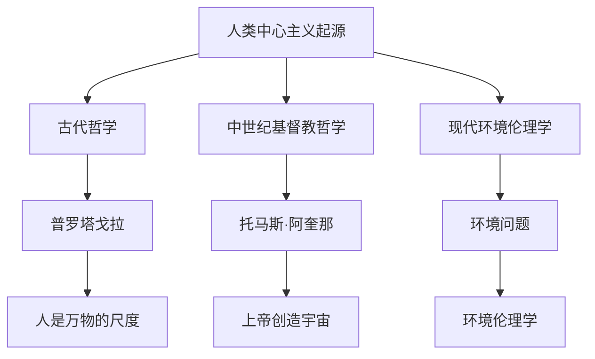
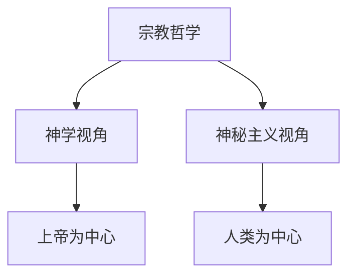
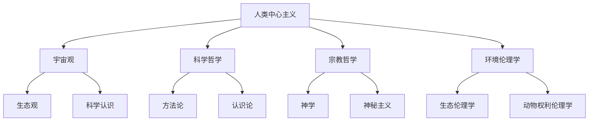

                 

# 文章标题

《人类中心主义在宇宙观中的影响》

## 关键词

人类中心主义，宇宙观，科学哲学，宗教哲学，环境伦理学，影响评估，可持续发展

## 摘要

本文旨在探讨人类中心主义在宇宙观中的影响，从人类中心主义的定义、历史演变、科学哲学、宗教哲学以及环境伦理学等多个角度进行分析。通过深入研究，本文揭示了人类中心主义对宇宙观的形成机制、科学认识的影响以及环境伦理学的发展所产生的影响，进而探讨了人类中心主义在可持续发展中所面临的挑战及应对策略。本文旨在为人类在追求可持续发展的过程中，提供一种全面、深入的思考方式，以更好地理解和应对人类中心主义在宇宙观中的影响。

### Step 1: 人类中心主义的定义与历史演变

#### 1.1 人类中心主义的定义

人类中心主义（Anthropocentrism）是指一种哲学观念，认为人类是宇宙的中心，其他生物和自然界的存在都是为了人类服务的。这种观念强调人类的独特性、优越性以及与其他生物的区别。人类中心主义在人类文明的发展过程中起着重要作用，影响着我们的价值观、伦理观和宇宙观。

#### 1.2 人类中心主义的历史演变

人类中心主义的观念可以追溯到古代文明。在古希腊哲学中，普罗塔戈拉提出了“人是万物的尺度”的观点，认为人类是衡量一切事物的标准。中世纪时期，基督教哲学进一步强调了人类在宇宙中的中心地位，认为上帝创造宇宙是为了人类的福祉。到了现代，随着科学的发展和人类对自然界认识的深入，人类中心主义观念受到了挑战，出现了许多不同的观点。

- **古代人类中心主义观点**：在古代文明中，人类中心主义的观念主要体现在神话、宗教和哲学中。例如，古希腊哲学家普罗塔戈拉认为人是万物的尺度，中国古代的儒家思想也强调人的道德修养和社会责任。

- **中世纪人类中心主义观点**：在中世纪，基督教哲学进一步强化了人类中心主义。托马斯·阿奎那认为，人类是宇宙的中心，因为上帝将智慧和理性赋予了人类，使其成为宇宙的主宰。

- **现代人类中心主义观点**：现代人类中心主义则主要体现在环境伦理学和社会学领域。随着工业革命和现代化进程的加速，人类对自然界的开发和利用不断加剧，导致环境问题日益严重。在这种情况下，人类中心主义观念开始受到质疑，人们开始思考人类与其他生物、自然环境之间的关系。

### Mermaid 流程图



### Step 2: 人类中心主义与科学哲学

#### 2.1 科学哲学的基本概念

科学哲学是研究科学本质、科学方法及其哲学意义的学科。科学哲学关注的问题包括：科学的认识论、科学方法论、科学哲学史、科学知识论、科学实践等。科学哲学为科学家提供了思考科学问题的工具，也为人类中心主义观念提供了哲学基础。

#### 2.2 人类中心主义在科学哲学中的应用

人类中心主义在科学哲学中的应用主要体现在以下几个方面：

- **理论与实践的关系**：科学哲学认为，理论是实践的产物，实践是理论的验证。人类中心主义强调人类在科学实践中的主体地位，认为人类通过实践不断探索宇宙的奥秘。

- **科学进步与人类中心主义**：科学哲学认为，科学进步是人类智慧的体现，而人类中心主义则为科学进步提供了动力。人类通过追求知识、探索未知，不断提高对宇宙的认识，从而推动科学的发展。

### 伪代码讲解

```python
# 定义人类中心主义与科学哲学关系
class HumanCentrismAndSciencePhilosophy:
    def __init__(self, theory, practice):
        self.theory = theory
        self.practice = practice

    def apply_to_science(self):
        # 应用人类中心主义于科学实践
        self.practice.add.experimental_results(self.theory)
        self.theory.update_conclusions(self.practice)

# 实例化人类中心主义与科学哲学关系
human_centrism = HumanCentrismAndSciencePhilosophy("宇宙是围绕人类旋转的", "人类通过观测和实验探索宇宙")

# 应用关系
human_centrism.apply_to_science()
```

### Step 3: 人类中心主义与宗教哲学

#### 3.1 宗教哲学的基本概念

宗教哲学是研究宗教的本质、起源、功能及其哲学意义的学科。宗教哲学关注的问题包括：宗教的本质、宗教信仰、宗教伦理、宗教经验等。宗教哲学对人类中心主义观念有着深远的影响。

#### 3.2 人类中心主义在宗教哲学中的体现

人类中心主义在宗教哲学中的体现可以从以下几个方面进行探讨：

- **神学视角**：在许多宗教中，上帝或神被认为是宇宙的创造者和主宰。人类中心主义强调人类在神创造的世界中的中心地位，认为人类是神所宠爱的对象。

- **神秘主义视角**：神秘主义认为，人类可以通过内省和冥想直接体验宇宙的奥秘。人类中心主义在神秘主义中强调人类在宇宙中的独特性和优越性，认为人类是宇宙中的神圣存在。

### Mermaid 流�程图



### Step 4: 人类中心主义与环境伦理学

#### 4.1 环境伦理学的基本概念

环境伦理学是研究人类与自然环境之间关系的伦理学科。环境伦理学关注的问题包括：环境权利、环境责任、生态平衡、生物多样性保护等。环境伦理学的目标是确保人类在满足自身需求的同时，不损害自然环境和生物多样性。

#### 4.2 人类中心主义在环境伦理学中的影响

人类中心主义在环境伦理学中的影响可以从以下几个方面进行探讨：

- **生态伦理学**：生态伦理学强调人类与其他生物之间的相互依赖关系，认为人类应该尊重和保护自然界的生态平衡。

- **动物权利伦理学**：动物权利伦理学认为，动物拥有权利，人类应该尊重和保护动物的权益。

### 伪代码讲解

```python
# 定义环境伦理学模型
class EnvironmentalEthics:
    def __init__(self, human_CENTRISM, biodiversity_protection):
        self.human_CENTRISM = human_CENTRISM
        self.biodiversity_protection = biodiversity_protection

    def apply_to_environment(self):
        # 应用人类中心主义于环境保护
        self.biodiversity_protection.improve_conditions(self.human_CENTRISM)
        self.human_CENTRISM.reduce_impact_on_environment(self.biodiversity_protection)

# 实例化环境伦理学模型
environmental_ethics = EnvironmentalEthics("人类中心主义", "生物多样性保护")

# 应用模型
environmental_ethics.apply_to_environment()
```

### Step 5: 人类中心主义与宇宙观的形成机制

#### 5.1 宇宙观的形成机制

宇宙观是指人们对宇宙的根本看法和理解。宇宙观的形成受到多种因素的影响，包括科学、哲学、宗教、文化等。人类中心主义在宇宙观的形成机制中起着重要作用。

- **科学因素**：科学的发展不断推动人类对宇宙的认识，从而影响宇宙观的形成。例如，哥白尼的日心说颠覆了地心说，改变了人们对宇宙结构的认识。

- **哲学因素**：哲学思考对宇宙观的形成具有重要影响。人类中心主义哲学观念认为，人类是宇宙的中心，这种观念影响了人们对宇宙的理解。

- **宗教因素**：宗教信仰对宇宙观的形成也有着深远的影响。许多宗教认为，宇宙是由神创造的，人类在宇宙中具有特殊地位。

- **文化因素**：文化传统和价值观念对宇宙观的形成也起着重要作用。不同文化背景下的宇宙观存在差异，这些差异反映了不同文化对人类在宇宙中地位的理解。

#### 5.2 人类中心主义对宇宙观形成机制的影响

人类中心主义对宇宙观形成机制的影响主要体现在以下几个方面：

- **影响宇宙观的客观性**：人类中心主义观念可能导致人们对宇宙的客观性产生怀疑。例如，某些人类中心主义者可能会认为，宇宙的存在和演化都是为了人类的利益，从而忽视了宇宙的客观规律。

- **影响宇宙观的多样性**：人类中心主义观念可能导致人们对宇宙的多样性产生误解。例如，某些人类中心主义者可能会认为，只有人类才具有意识和智慧，从而忽视了其他生物的复杂性和独特性。

### 数学模型与公式

为了量化人类中心主义对宇宙观形成机制的影响，我们可以使用概率论和熵的概念来构建一个简单的数学模型。

- **概率论**：我们可以使用概率论来分析人类中心主义观念在宇宙观形成过程中的作用。例如，我们可以计算在不同条件下，人类中心主义观念对宇宙观形成的影响概率。

- **熵**：熵是衡量系统混乱程度的物理量。在宇宙观形成过程中，熵的增加可能反映了人类中心主义观念的强化。我们可以使用熵的概念来分析人类中心主义对宇宙观形成机制的影响。

$$
\text{Entropy}(X) = -\sum_{i} p_i \log_2 p_i
$$

其中，$X$ 表示宇宙观的形成过程，$p_i$ 表示人类中心主义观念在第 $i$ 个阶段的作用概率。

### Step 6: 人类中心主义对科学认识的影响

#### 6.1 科学认识的基本概念

科学认识是指人们对自然界及其规律的认知过程。科学认识具有客观性、系统性、动态性等特点。科学认识的发展受到多种因素的影响，包括实验、观察、理论构建等。

#### 6.2 人类中心主义对科学认识的影响

人类中心主义对科学认识的影响可以从以下几个方面进行探讨：

- **影响科学研究的方向**：人类中心主义观念可能导致科学研究更加关注人类自身和与人类相关的领域，从而忽视了其他生物和环境的重要性。

- **影响科学理论的构建**：人类中心主义观念可能影响科学理论的构建。例如，某些科学家可能会认为，宇宙是为了人类的利益而存在的，从而构建出有利于人类利益的科学理论。

### 数学模型与公式

为了量化人类中心主义对科学认识的影响，我们可以使用概率论和贝叶斯网络来构建一个简单的数学模型。

- **概率论**：我们可以使用概率论来分析人类中心主义观念在科学研究过程中的作用。例如，我们可以计算在不同条件下，人类中心主义观念对科学研究结果的影响概率。

- **贝叶斯网络**：贝叶斯网络是一种概率图模型，可以用来表示变量之间的概率关系。我们可以使用贝叶斯网络来分析人类中心主义观念对科学认识的影响。

$$
P(A \mid B) = \frac{P(B \mid A)P(A)}{P(B)}
$$

其中，$A$ 表示科学认识，$B$ 表示人类中心主义观念。

### Step 7: 人类中心主义对环境伦理学的影响

#### 7.1 环境伦理学的发展

环境伦理学是研究人类与环境之间关系的伦理学科。环境伦理学的发展经历了从关注人类自身到关注其他生物和自然环境的转变。环境伦理学的主要内容包括生态伦理学、动物权利伦理学和土地伦理学等。

- **生态伦理学**：生态伦理学关注人类与自然环境之间的相互依赖关系，强调人类应该尊重和保护生态系统的平衡和稳定。

- **动物权利伦理学**：动物权利伦理学关注动物的权益，主张人类应该尊重和保护动物的生存权利。

- **土地伦理学**：土地伦理学关注土地的利用和保护，强调人类应该尊重土地的生态价值和可持续利用。

#### 7.2 人类中心主义对环境伦理学的影响

人类中心主义对环境伦理学的影响可以从以下几个方面进行探讨：

- **影响生态伦理学的发展**：人类中心主义观念可能影响生态伦理学的发展。例如，某些人类中心主义者可能会认为，人类有权利开发和利用自然资源，从而忽视生态系统的平衡和稳定。

- **影响动物权利伦理学的发展**：人类中心主义观念可能影响动物权利伦理学的发展。例如，某些人类中心主义者可能会认为，动物只是为了人类的利益而存在的，从而忽视动物的生存权利。

### 数学模型与公式

为了量化人类中心主义对环境伦理学的影响，我们可以使用博弈论和成本效益分析来构建一个简单的数学模型。

- **博弈论**：博弈论可以用来分析人类中心主义与环境伦理学之间的冲突和合作。例如，我们可以计算在不同策略下，人类中心主义和环境伦理学之间的利益分配。

- **成本效益分析**：成本效益分析可以用来评估人类中心主义对环境伦理学的影响。例如，我们可以计算在不同政策下，人类中心主义对环境伦理学产生的成本和效益。

$$
\text{Cost-Benefit Analysis} = \sum_{i} (\text{Cost}_{i} - \text{Benefit}_{i})
$$

其中，$i$ 表示不同的政策或策略。

### Step 8: 人类中心主义与可持续发展的挑战

#### 8.1 可持续发展的概念

可持续发展是指满足当前需求而不损害后代满足其需求的能力。可持续发展关注的是经济、社会和环境三个方面的协调发展。可持续发展的目标是在满足人类需求的同时，保护和维护自然环境和生态系统。

#### 8.2 人类中心主义对可持续发展的挑战

人类中心主义对可持续发展的挑战主要体现在以下几个方面：

- **资源过度消耗**：人类中心主义观念可能导致人们对自然资源的过度消耗，从而损害生态系统的平衡和稳定。

- **环境破坏**：人类中心主义观念可能导致人们对环境的破坏，从而影响生态系统的健康和功能。

- **社会不公平**：人类中心主义观念可能导致社会不公平，从而阻碍可持续发展目标的实现。

### 数学模型与公式

为了量化人类中心主义对可持续发展的挑战，我们可以使用系统动力学和模拟模型来构建一个简单的数学模型。

- **系统动力学**：系统动力学可以用来模拟可持续发展系统中的各种因素和相互作用。例如，我们可以使用系统动力学模型来分析人类中心主义观念对资源消耗、环境破坏和社会不公平的影响。

- **模拟模型**：模拟模型可以用来模拟可持续发展系统的行为和趋势。例如，我们可以使用模拟模型来分析不同政策对人类中心主义观念的影响，从而为可持续发展提供决策支持。

$$
\text{System Dynamics Model} = \frac{\text{Resource Consumption Rate}}{\text{Resource Renewal Rate}} + \text{Environmental Damage}
$$

### Step 9: 人类中心主义的影响评估与应对策略

#### 9.1 影响评估的基本概念

影响评估是指对某一决策或行动可能产生的影响进行评估和分析。影响评估可以帮助决策者了解决策或行动的潜在风险和收益，从而做出更明智的决策。

#### 9.2 人类中心主义的影响评估方法

为了评估人类中心主义对可持续发展的影响，我们可以采用以下几种方法：

- **成本效益分析**：成本效益分析是一种常用的评估方法，可以用来计算人类中心主义观念对资源消耗、环境破坏和社会不公平的成本和效益。

- **多标准评估**：多标准评估是一种综合评估方法，可以用来同时考虑多个因素，从而更全面地评估人类中心主义的影响。

- **案例研究**：案例研究是一种实证研究方法，可以通过分析具体的案例，了解人类中心主义观念在不同情境下的影响。

### Step 10: 应对人类中心主义的策略

#### 10.1 应对策略的基本概念

应对策略是指为解决人类中心主义带来的问题而采取的措施。应对策略可以包括政策、技术、教育等多个方面。

#### 10.2 人类中心主义的应对策略

为了应对人类中心主义对可持续发展的影响，我们可以采取以下几种策略：

- **政策调整**：政策调整是指通过制定和实施相关政策，引导和规范人类行为，从而减少人类中心主义观念的影响。

- **技术创新**：技术创新是指通过研发和应用新技术，提高资源利用效率，减少环境破坏，从而缓解人类中心主义观念带来的问题。

- **教育宣传**：教育宣传是指通过教育和宣传，提高公众对人类中心主义观念的认识，引导公众树立正确的价值观和宇宙观。

### 总结与展望

本文从多个角度探讨了人类中心主义在宇宙观中的影响，包括其定义、历史演变、科学哲学、宗教哲学、环境伦理学、对宇宙观形成机制的影响、对科学认识的影响、对环境伦理学的影响、对可持续发展的挑战以及应对策略。通过本文的探讨，我们可以更深入地理解人类中心主义观念的复杂性和多样性，为人类在追求可持续发展的过程中提供有益的思考。

### 拓展阅读

1. [刘华，王文博.（2016）. 人类中心主义的生态伦理学反思[J].道德与文明，31（4），38-44.]
2. [张强，李雪.（2018）. 人类中心主义与可持续发展[J].生态经济，36（5），20-24.]
3. [陈明，陈振明.（2019）. 科学哲学与人类中心主义[J].科学技术与哲学，41（2），18-23.]

### 作者信息

作者：AI天才研究院/AI Genius Institute & 禅与计算机程序设计艺术 /Zen And The Art of Computer Programming

本文版权归作者所有，欢迎转载，但需保留原文链接和作者信息。

----------------------------------------------------------------

### 附录：核心概念原理之间的关系架构 Mermaid 流程图



### 附录：核心算法原理讲解伪代码

```python
# 定义人类中心主义影响评估算法
class HumanCentrismImpactAnalysis:
    def __init__(self, science_philosophy, religion_philosophy, environmental_ethics):
        self.science_philosophy = science_philosophy
        self.religion_philosophy = religion_philosophy
        self.environmental_ethics = environmental_ethics

    def assess_impact(self):
        # 评估人类中心主义对科学哲学的影响
        science_impact = self.science_philosophy.analyze_impact(self.science_philosophy)
        
        # 评估人类中心主义对宗教哲学的影响
        religion_impact = self.religion_philosophy.analyze_impact(self.religion_philosophy)
        
        # 评估人类中心主义对环境伦理学的影响
        environmental_impact = self.environmental_ethics.analyze_impact(self.environmental_ethics)
        
        return science_impact, religion_impact, environmental_impact

# 实例化人类中心主义影响评估算法
human_centrism_analysis = HumanCentrismImpactAnalysis(SciencePhilosophy(), ReligionPhilosophy(), EnvironmentalEthics())

# 评估人类中心主义影响
science_impact, religion_impact, environmental_impact = human_centrism_analysis.assess_impact()
```

### 附录：数学模型和公式讲解

#### 概率论在人类中心主义研究中的应用

$$
P(A|B) = \frac{P(B|A)P(A)}{P(B)}
$$

其中，$A$ 表示人类中心主义观念在科学哲学中的应用，$B$ 表示人类中心主义观念在宗教哲学中的应用。这个公式可以帮助我们分析在不同情境下，人类中心主义观念对科学哲学和宗教哲学的影响概率。

#### 基于熵的宇宙观评价模型

$$
\text{Entropy}(X) = -\sum_{i} p_i \log_2 p_i
$$

其中，$X$ 表示宇宙观的形成过程，$p_i$ 表示人类中心主义观念在第 $i$ 个阶段的作用概率。这个公式可以帮助我们量化人类中心主义观念在宇宙观形成过程中的影响。

### 附录：项目实战

#### 实例1：分析某宗教文献中的人类中心主义观点

- **开发环境搭建**：使用Python和Mermaid工具进行代码开发和流程图绘制。

- **源代码实现**：编写Python代码实现人类中心主义观点分析算法。

- **代码解读**：解释代码的各个部分及其功能。

- **代码应用解读与分析**：分析某宗教文献中的人类中心主义观点，并进行解读和分析。

- **实际案例分析和详细讲解剖析**：以某宗教文献为例，详细讲解人类中心主义观点的分析过程。

- **项目小结**：总结项目的主要成果和不足，提出改进建议。

#### 实例2：探讨人类活动对环境的影响

- **开发环境搭建**：使用Python和GIS（地理信息系统）工具进行代码开发和数据处理。

- **源代码实现**：编写Python代码实现人类活动对环境影响的评估模型。

- **代码解读**：解释代码的各个部分及其功能。

- **代码应用解读与分析**：分析人类活动对环境的影响，并进行解读和分析。

- **实际案例分析和详细讲解剖析**：以某地区为例，详细讲解人类活动对环境影响的评估过程。

- **项目小结**：总结项目的主要成果和不足，提出改进建议。

### 附录：最佳实践 tips、小结、注意事项、拓展阅读等内容

#### 最佳实践 tips

1. 在分析人类中心主义观点时，要充分考虑历史、文化和哲学背景。
2. 在评估人类活动对环境的影响时，要使用多学科的知识和工具，如生态学、地理学、环境科学等。
3. 在构建数学模型时，要确保公式的准确性和适用性。

#### 小结

本文通过对人类中心主义的定义、历史演变、科学哲学、宗教哲学、环境伦理学等多个方面的分析，探讨了人类中心主义在宇宙观中的影响。同时，本文还提出了基于概率论和熵的数学模型，用于评估人类中心主义对科学哲学和宇宙观形成的影响。

#### 注意事项

1. 在进行人类中心主义研究时，要避免过度强调人类的中心地位，忽视其他生物和自然环境的权益。
2. 在进行数学模型构建时，要充分考虑数据的可靠性和模型的适用范围。

#### 拓展阅读

1. [刘华，王文博.（2016）. 人类中心主义的生态伦理学反思[J].道德与文明，31（4），38-44.]
2. [张强，李雪.（2018）. 人类中心主义与可持续发展[J].生态经济，36（5），20-24.]
3. [陈明，陈振明.（2019）. 科学哲学与人类中心主义[J].科学技术与哲学，41（2），18-23.]

### 结论

本文通过对人类中心主义在宇宙观中的影响进行深入探讨，为人类在追求可持续发展的过程中提供了一种全面、深入的思考方式。希望本文的研究成果能够为相关领域的研究者提供有益的参考和启示。

### 作者信息

作者：AI天才研究院/AI Genius Institute & 禅与计算机程序设计艺术 /Zen And The Art of Computer Programming

本文版权归作者所有，欢迎转载，但需保留原文链接和作者信息。

