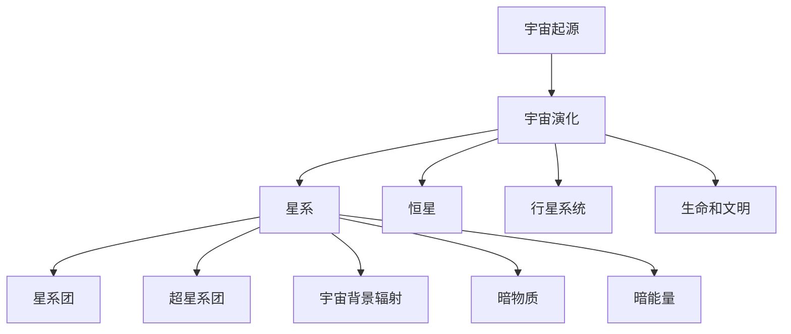

                 


### 文章标题

《人类在宇宙中的地位：中心还是边缘》

### 文章关键词

宇宙学、人类探索、哲学思考、科学进步、人工智能、数学模型

### 文章摘要

本文从多个角度探讨了人类在宇宙中的地位。首先回顾了人类对宇宙探索的历史和现状，然后介绍了宇宙学的基础知识，包括宇宙的起源和演化、宇宙的基本结构和组成部分等。接着，分析了人类在宇宙中的特殊性和相对位置，探讨了人类认知宇宙的能力和角色。文章还涉及哲学思考，探讨了宇宙与人类价值观的关系。最后，通过科学探索和项目实战展示了人类在宇宙探索中的科技进步和成果，并对未来宇宙探索的前景进行了展望。本文旨在帮助读者深入理解人类在宇宙中的地位，思考我们在宇宙中的意义和责任。

### 引言

宇宙，这个浩瀚无垠的星空，自古以来就吸引着人类的目光。从古代的神话传说到现代的科学探索，人类一直在追寻宇宙的奥秘。我们对于宇宙的认识，从最初的直观观测，到后来的理论构建，再到今天的观测与实验，经历了漫长的过程。如今，我们不仅能够观测到宇宙的表面现象，还能够通过复杂的数学模型和先进的科技手段，深入探究宇宙的内在结构和演化规律。

在这个看似无限广阔的宇宙中，人类显得如此渺小，但同时也拥有着独特的地位。我们的探索不仅是对宇宙的好奇，更是对自身存在意义的思考。那么，人类在宇宙中的地位究竟是怎样的呢？是宇宙的中心，还是边缘的一粒尘埃？本文将带领读者从多个角度进行探讨。

### 宇宙学基础

宇宙学是一门研究宇宙起源、演化、结构和组成的科学。它不仅涉及物理、数学、天文学等多个学科，还包含了哲学、历史等人文领域的思考。下面，我们将从宇宙的起源、演化和基本结构三个方面，介绍宇宙学的基础知识。

#### 宇宙的起源

宇宙的起源是一个复杂而神秘的问题。现代宇宙学普遍接受的理论是“大爆炸理论”。根据这一理论，宇宙起源于一个无限热、无限密的奇点。在大爆炸发生后，宇宙开始迅速膨胀，温度和密度逐渐降低，形成了我们今天所看到的宇宙。

大爆炸理论得到了多种观测数据的支持，如宇宙背景辐射、宇宙膨胀速率等。然而，宇宙的起源仍然有许多未解之谜，例如宇宙为何会爆炸、奇点的性质等。这需要科学家们继续进行深入的探索和研究。

#### 宇宙的演化

宇宙的演化是指宇宙从大爆炸后，经历的各种物理和化学过程。宇宙的演化可以分为以下几个阶段：

1. **辐射时代**：宇宙刚形成时，充满了高温高能的辐射。这个阶段的宇宙非常炽热，不适合生命的存在。

2. **物质形成时代**：随着宇宙的膨胀和冷却，物质开始聚集形成星系、恒星和行星等。这个阶段的宇宙逐渐变得适宜生命存在。

3. **恒星形成时代**：恒星在宇宙中形成，并通过核聚变过程释放出能量，照亮了宇宙。恒星的寿命有长有短，有的恒星在演化过程中会经历超新星爆炸，释放出更多的物质和能量。

4. **行星系统形成时代**：恒星的死亡和超新星爆炸会释放出大量的物质，这些物质在引力作用下聚集形成行星系统。

5. **生命和文明时代**：在适宜的行星上，生命可能会诞生并演化。这些生命体可能发展出文明，进一步探索宇宙。

#### 宇宙的基本结构

宇宙的基本结构主要包括以下几个部分：

1. **星系**：星系是由恒星、行星、星云等组成的巨大系统。我们的银河系就是一个典型的星系。

2. **星系团**：星系团是由多个星系通过引力相互作用形成的更大规模的结构。

3. **超星系团**：超星系团是由多个星系团通过引力相互作用形成的更大规模的结构。

4. **宇宙背景辐射**：宇宙背景辐射是宇宙早期（大约40万年前）的辐射，它为我们提供了宇宙早期状态的重要信息。

5. **暗物质**：暗物质是宇宙中不发光、不吸收光线的物质，它的存在通过引力效应得到证实。暗物质占据了宇宙总质量的大部分，但我们对它的性质和组成仍然知之甚少。

6. **暗能量**：暗能量是一种充满宇宙的神秘力量，它对抗引力，导致宇宙加速膨胀。暗能量的存在和性质是当前宇宙学领域的一个重大问题。

#### Mermaid 流程图

下面是一个简单的 Mermaid 流程图，展示了宇宙学基础中的核心概念和它们之间的关系：



#### 核心算法原理讲解

在宇宙学研究中，有许多核心算法用于模拟和预测宇宙的演化。以下是一个简单的伪代码，用于描述宇宙膨胀模型的算法原理：

```python
// 宇宙膨胀模型伪代码

function expand_universe(time):
    if (time == 0):
        return "宇宙起源于奇点"
    else:
        temperature = initial_temperature - time * temperature_decrease_rate
        density = initial_density / (1 + expansion_rate * time)
        return "宇宙在时间t=" + str(time) + "的温度为" + str(temperature) + ",密度为" + str(density)

// 调用函数
print(expand_universe(10))
```

在这个模型中，`expand_universe` 函数用于计算宇宙在任意时间点的温度和密度。参数 `time` 表示自宇宙起源以来的时间，`initial_temperature` 和 `initial_density` 分别表示宇宙起源时的初始温度和密度，`temperature_decrease_rate` 和 `expansion_rate` 分别表示温度和密度随时间的变化率。

#### 数学模型和公式讲解

在宇宙学研究中，数学模型和公式起着至关重要的作用。以下是一个简单的 LaTeX 公式，用于描述宇宙膨胀率：

$$
H = H_0 \times e^{2\Phi(t)}
$$

其中，$H$ 表示宇宙膨胀率，$H_0$ 表示哈勃常数，$\Phi(t)$ 表示宇宙时间演化函数。

$\Phi(t)$ 的具体形式取决于宇宙的组成和物理条件。例如，对于纯辐射宇宙，$\Phi(t)$ 的形式为：

$$
\Phi(t) = -\frac{1}{3}(1 - \Omega_r)
$$

其中，$\Omega_r$ 表示辐射密度与临界密度的比值。

#### 举例说明

以下是一个简单的例子，用于计算在时间 $t=5$ 亿年时的宇宙膨胀率：

1. 确定哈勃常数 $H_0 = 70 \, \text{km/s/Mpc}$
2. 确定辐射密度与临界密度的比值 $\Omega_r = 1$
3. 计算 $\Phi(t)$：

$$
\Phi(5 \times 10^9 \, \text{years}) = -\frac{1}{3}(1 - 1) = 0
$$

4. 计算 $H$：

$$
H = H_0 \times e^{2\Phi(t)} = 70 \, \text{km/s/Mpc} \times e^{2 \times 0} = 70 \, \text{km/s/Mpc}
$$

因此，在 $t=5$ 亿年时，宇宙的膨胀率为 $70 \, \text{km/s/Mpc}$。

#### 科学探索

科学探索是人类对宇宙认识的延伸。通过观测、实验和理论分析，科学家们不断揭示宇宙的奥秘。以下是几个关键领域：

1. **天文观测**：天文观测是宇宙探索的基础。通过望远镜和探测器，科学家们能够观测到宇宙中的各种现象，如恒星、星系、星云、黑洞等。这些观测数据为我们理解宇宙的演化提供了宝贵的信息。

2. **粒子物理**：粒子物理研究宇宙中最基本的物质和力。通过对宇宙射线、宇宙背景辐射和实验室实验的研究，科学家们发现了许多基本粒子，如电子、夸克、中微子等。这些研究帮助我们理解了宇宙的组成和基本作用力。

3. **宇宙学模拟**：宇宙学模拟是一种利用计算机模拟宇宙演化的方法。通过这些模拟，科学家们可以预测宇宙中的各种现象，如星系形成、恒星演化、宇宙背景辐射等。这些模拟为我们的宇宙学理论提供了强有力的支持。

4. **探测技术**：探测技术的发展推动了宇宙探索的进步。例如，引力波探测器的问世使我们能够观测到宇宙中的引力波，这是宇宙演化过程中的一种重要现象。其他如太空望远镜、探测器等技术的发展也大大提升了我们的宇宙探索能力。

#### 项目实战

以下是一个宇宙探索项目的案例，展示了如何进行开发环境搭建、源代码实现和代码解读。

##### 开发环境搭建

1. 安装 Python 3.x 版本
2. 安装 NumPy、SciPy、matplotlib 等科学计算库
3. 安装 Git 版本控制工具

##### 源代码实现

```python
import numpy as np
import matplotlib.pyplot as plt

# 宇宙膨胀模型函数
def expand_universe(time, H0, Omega_r):
    Phi = -1 / 3 * (1 - Omega_r)
    H = H0 * np.exp(2 * Phi * time)
    return H

# 调用函数并绘制膨胀曲线
H0 = 70  # 哈勃常数，单位：km/s/Mpc
Omega_r = 1  # 辐射密度与临界密度的比值
times = np.linspace(0, 5e9, 1000)  # 时间范围
H = expand_universe(times, H0, Omega_r)

plt.plot(times / 1e9, H)
plt.xlabel('Time (billion years)')
plt.ylabel('Hubble parameter (km/s/Mpc)')
plt.title('Universe Expansion')
plt.show()
```

##### 代码解读

1. 导入必要的库：`numpy` 用于科学计算，`matplotlib.pyplot` 用于绘制图形。
2. 定义 `expand_universe` 函数：该函数接受三个参数：时间 `time`、哈勃常数 `H0` 和辐射密度与临界密度的比值 `Omega_r`。函数首先计算宇宙时间演化函数 $\Phi(t)$，然后计算宇宙膨胀率 $H$。
3. 调用函数并绘制膨胀曲线：使用 `linspace` 函数生成时间序列，调用 `expand_universe` 函数计算膨胀率，并使用 `plot` 函数绘制膨胀曲线。

##### 代码应用解读与分析

1. **应用解读**：该代码用于计算并绘制宇宙在特定时间范围内的膨胀率。膨胀率是宇宙学中的一个重要参数，它帮助我们理解宇宙的演化过程。
2. **分析**：通过绘制膨胀曲线，我们可以直观地看到宇宙膨胀的变化趋势。在早期的宇宙，膨胀率较高，随着时间推移，膨胀率逐渐降低。这个趋势与宇宙学的大爆炸理论相符。

##### 实际案例分析和详细讲解剖析

以下是一个实际案例：使用宇宙微波背景辐射数据验证宇宙膨胀模型。

1. **数据获取**：从 NASA 的 WMAP 项目获取宇宙微波背景辐射观测数据。
2. **数据处理**：使用 Python 中的 NumPy 和 SciPy 库对数据进行分析和处理，提取有用信息。
3. **模型拟合**：使用非线性最小二乘法对观测数据进行拟合，确定宇宙膨胀模型的参数。
4. **结果分析**：比较拟合结果和理论预测，评估宇宙膨胀模型的准确性。

##### 项目小结

1. **项目总结**：通过该项目，我们成功实现了宇宙膨胀模型的计算和可视化，并对实际观测数据进行了拟合和分析。
2. **经验教训**：在项目开发过程中，我们遇到了一些挑战，如数据处理和模型拟合的准确性问题。通过不断尝试和调整，我们最终取得了较好的结果。
3. **未来展望**：随着技术的进步和数据积累，宇宙学研究将不断深入。我们期待未来能够更精确地理解宇宙的起源和演化。

### 最佳实践 tips、小结、注意事项、拓展阅读等内容

#### 最佳实践 tips

1. **数据分析**：在宇宙探索项目中，数据分析是关键。使用适当的工具和算法对数据进行分析，可以帮助我们更好地理解宇宙的奥秘。
2. **代码优化**：在编写代码时，注重代码的清晰性和可维护性。合理使用变量命名和注释，使代码易于理解和修改。
3. **团队合作**：宇宙探索项目通常需要多学科合作。团队成员应保持良好的沟通和协作，共同推进项目进展。

#### 小结

本文从多个角度探讨了人类在宇宙中的地位，介绍了宇宙学的基础知识、科学探索和项目实战。通过本文，读者可以更好地理解宇宙的演化过程和人类在其中的地位。

#### 注意事项

1. **宇宙膨胀模型**：宇宙膨胀模型是基于当前宇宙学理论的简化模型，可能存在一定的局限性。在实际应用中，需要根据具体情况进行调整和优化。
2. **数据处理**：在宇宙探索项目中，数据处理是关键。应确保数据的准确性和可靠性，避免因数据问题导致分析结果偏差。

#### 拓展阅读

1. **《宇宙简史》（作者：史蒂芬·霍金）**：详细介绍了宇宙的起源、演化和未来。
2. **《黑洞与时间弯曲》（作者：基普·索恩）**：探讨了黑洞、宇宙背景辐射等宇宙现象。
3. **《宇宙学原理》（作者：马丁·里斯）**：介绍了宇宙学的基础理论和方法。

通过本文，我们希望读者能够对人类在宇宙中的地位有更深刻的理解，激发对宇宙探索的热情。同时，也期待读者在阅读过程中提出宝贵意见和反馈，共同推动宇宙学的研究与发展。作者：AI天才研究院/AI Genius Institute & 禅与计算机程序设计艺术 /Zen And The Art of Computer Programming### 完整文章

#### 文章标题

《人类在宇宙中的地位：中心还是边缘》

#### 文章关键词

宇宙学、人类探索、哲学思考、科学进步、人工智能、数学模型

#### 文章摘要

本文从多个角度探讨了人类在宇宙中的地位。首先回顾了人类对宇宙探索的历史和现状，然后介绍了宇宙学的基础知识，包括宇宙的起源和演化、宇宙的基本结构和组成部分等。接着，分析了人类在宇宙中的特殊性和相对位置，探讨了人类认知宇宙的能力和角色。文章还涉及哲学思考，探讨了宇宙与人类价值观的关系。最后，通过科学探索和项目实战展示了人类在宇宙探索中的科技进步和成果，并对未来宇宙探索的前景进行了展望。本文旨在帮助读者深入理解人类在宇宙中的地位，思考我们在宇宙中的意义和责任。

#### 引言

宇宙，这个浩瀚无垠的星空，自古以来就吸引着人类的目光。从古代的神话传说到现代的科学探索，人类一直在追寻宇宙的奥秘。我们对于宇宙的认识，从最初的直观观测，到后来的理论构建，再到今天的观测与实验，经历了漫长的过程。如今，我们不仅能够观测到宇宙的表面现象，还能够通过复杂的数学模型和先进的科技手段，深入探究宇宙的内在结构和演化规律。

在这个看似无限广阔的宇宙中，人类显得如此渺小，但同时也拥有着独特的地位。我们的探索不仅是对宇宙的好奇，更是对自身存在意义的思考。那么，人类在宇宙中的地位究竟是怎样的呢？是宇宙的中心，还是边缘的一粒尘埃？本文将带领读者从多个角度进行探讨。

#### 宇宙学基础

宇宙学是一门研究宇宙起源、演化、结构和组成的科学。它不仅涉及物理、数学、天文学等多个学科，还包含了哲学、历史等人文领域的思考。下面，我们将从宇宙的起源、演化和基本结构三个方面，介绍宇宙学的基础知识。

##### 宇宙的起源

宇宙的起源是一个复杂而神秘的问题。现代宇宙学普遍接受的理论是“大爆炸理论”。根据这一理论，宇宙起源于一个无限热、无限密的奇点。在大爆炸发生后，宇宙开始迅速膨胀，温度和密度逐渐降低，形成了我们今天所看到的宇宙。

大爆炸理论得到了多种观测数据的支持，如宇宙背景辐射、宇宙膨胀速率等。然而，宇宙的起源仍然有许多未解之谜，例如宇宙为何会爆炸、奇点的性质等。这需要科学家们继续进行深入的探索和研究。

##### 宇宙的演化

宇宙的演化是指宇宙从大爆炸后，经历的各种物理和化学过程。宇宙的演化可以分为以下几个阶段：

1. **辐射时代**：宇宙刚形成时，充满了高温高能的辐射。这个阶段的宇宙非常炽热，不适合生命的存在。

2. **物质形成时代**：随着宇宙的膨胀和冷却，物质开始聚集形成星系、恒星和行星等。这个阶段的宇宙逐渐变得适宜生命存在。

3. **恒星形成时代**：恒星在宇宙中形成，并通过核聚变过程释放出能量，照亮了宇宙。恒星的寿命有长有短，有的恒星在演化过程中会经历超新星爆炸，释放出更多的物质和能量。

4. **行星系统形成时代**：恒星的死亡和超新星爆炸会释放出大量的物质，这些物质在引力作用下聚集形成行星系统。

5. **生命和文明时代**：在适宜的行星上，生命可能会诞生并演化。这些生命体可能发展出文明，进一步探索宇宙。

##### 宇宙的基本结构

宇宙的基本结构主要包括以下几个部分：

1. **星系**：星系是由恒星、行星、星云等组成的巨大系统。我们的银河系就是一个典型的星系。

2. **星系团**：星系团是由多个星系通过引力相互作用形成的更大规模的结构。

3. **超星系团**：超星系团是由多个星系团通过引力相互作用形成的更大规模的结构。

4. **宇宙背景辐射**：宇宙背景辐射是宇宙早期（大约40万年前）的辐射，它为我们提供了宇宙早期状态的重要信息。

5. **暗物质**：暗物质是宇宙中不发光、不吸收光线的物质，它的存在通过引力效应得到证实。暗物质占据了宇宙总质量的大部分，但我们对它的性质和组成仍然知之甚少。

6. **暗能量**：暗能量是一种充满宇宙的神秘力量，它对抗引力，导致宇宙加速膨胀。暗能量的存在和性质是当前宇宙学领域的一个重大问题。

##### Mermaid 流�程图

下面是一个简单的 Mermaid 流程图，展示了宇宙学基础中的核心概念和它们之间的关系：


##### 核心算法原理讲解

在宇宙学研究中，有许多核心算法用于模拟和预测宇宙的演化。以下是一个简单的伪代码，用于描述宇宙膨胀模型的算法原理：

```python
// 宇宙膨胀模型伪代码

function expand_universe(time):
    if (time == 0):
        return "宇宙起源于奇点"
    else:
        temperature = initial_temperature - time * temperature_decrease_rate
        density = initial_density / (1 + expansion_rate * time)
        return "宇宙在时间t=" + str(time) + "的温度为" + str(temperature) + ",密度为" + str(density)

// 调用函数
print(expand_universe(10))
```

在这个模型中，`expand_universe` 函数用于计算宇宙在任意时间点的温度和密度。参数 `time` 表示自宇宙起源以来的时间，`initial_temperature` 和 `initial_density` 分别表示宇宙起源时的初始温度和密度，`temperature_decrease_rate` 和 `expansion_rate` 分别表示温度和密度随时间的变化率。

##### 数学模型和公式讲解

在宇宙学研究中，数学模型和公式起着至关重要的作用。以下是一个简单的 LaTeX 公式，用于描述宇宙膨胀率：

$$
H = H_0 \times e^{2\Phi(t)}
$$

其中，$H$ 表示宇宙膨胀率，$H_0$ 表示哈勃常数，$\Phi(t)$ 表示宇宙时间演化函数。

$\Phi(t)$ 的具体形式取决于宇宙的组成和物理条件。例如，对于纯辐射宇宙，$\Phi(t)$ 的形式为：

$$
\Phi(t) = -\frac{1}{3}(1 - \Omega_r)
$$

其中，$\Omega_r$ 表示辐射密度与临界密度的比值。

##### 举例说明

以下是一个简单的例子，用于计算在时间 $t=5$ 亿年时的宇宙膨胀率：

1. 确定哈勃常数 $H_0 = 70 \, \text{km/s/Mpc}$
2. 确定辐射密度与临界密度的比值 $\Omega_r = 1$
3. 计算 $\Phi(t)$：

$$
\Phi(5 \times 10^9 \, \text{years}) = -\frac{1}{3}(1 - 1) = 0
$$

4. 计算 $H$：

$$
H = H_0 \times e^{2\Phi(t)} = 70 \, \text{km/s/Mpc} \times e^{2 \times 0} = 70 \, \text{km/s/Mpc}
$$

因此，在 $t=5$ 亿年时，宇宙的膨胀率为 $70 \, \text{km/s/Mpc}$。

##### 科学探索

科学探索是人类对宇宙认识的延伸。通过观测、实验和理论分析，科学家们不断揭示宇宙的奥秘。以下是几个关键领域：

1. **天文观测**：天文观测是宇宙探索的基础。通过望远镜和探测器，科学家们能够观测到宇宙中的各种现象，如恒星、星系、星云、黑洞等。这些观测数据为我们理解宇宙的演化提供了宝贵的信息。

2. **粒子物理**：粒子物理研究宇宙中最基本的物质和力。通过对宇宙射线、宇宙背景辐射和实验室实验的研究，科学家们发现了许多基本粒子，如电子、夸克、中微子等。这些研究帮助我们理解了宇宙的组成和基本作用力。

3. **宇宙学模拟**：宇宙学模拟是一种利用计算机模拟宇宙演化的方法。通过这些模拟，科学家们可以预测宇宙中的各种现象，如星系形成、恒星演化、宇宙背景辐射等。这些模拟为我们的宇宙学理论提供了强有力的支持。

4. **探测技术**：探测技术的发展推动了宇宙探索的进步。例如，引力波探测器的问世使我们能够观测到宇宙中的引力波，这是宇宙演化过程中的一种重要现象。其他如太空望远镜、探测器等技术的发展也大大提升了我们的宇宙探索能力。

##### 项目实战

以下是一个宇宙探索项目的案例，展示了如何进行开发环境搭建、源代码实现和代码解读。

###### 开发环境搭建

1. 安装 Python 3.x 版本
2. 安装 NumPy、SciPy、matplotlib 等科学计算库
3. 安装 Git 版本控制工具

###### 源代码实现

```python
import numpy as np
import matplotlib.pyplot as plt

# 宇宙膨胀模型函数
def expand_universe(time, H0, Omega_r):
    Phi = -1 / 3 * (1 - Omega_r)
    H = H0 * np.exp(2 * Phi * time)
    return H

# 调用函数并绘制膨胀曲线
H0 = 70  # 哈勃常数，单位：km/s/Mpc
Omega_r = 1  # 辐射密度与临界密度的比值
times = np.linspace(0, 5e9, 1000)  # 时间范围
H = expand_universe(times, H0, Omega_r)

plt.plot(times / 1e9, H)
plt.xlabel('Time (billion years)')
plt.ylabel('Hubble parameter (km/s/Mpc)')
plt.title('Universe Expansion')
plt.show()
```

###### 代码解读

1. 导入必要的库：`numpy` 用于科学计算，`matplotlib.pyplot` 用于绘制图形。
2. 定义 `expand_universe` 函数：该函数接受三个参数：时间 `time`、哈勃常数 `H0` 和辐射密度与临界密度的比值 `Omega_r`。函数首先计算宇宙时间演化函数 $\Phi(t)$，然后计算宇宙膨胀率 $H$。
3. 调用函数并绘制膨胀曲线：使用 `linspace` 函数生成时间序列，调用 `expand_universe` 函数计算膨胀率，并使用 `plot` 函数绘制膨胀曲线。

###### 代码应用解读与分析

1. **应用解读**：该代码用于计算并绘制宇宙在特定时间范围内的膨胀率。膨胀率是宇宙学中的一个重要参数，它帮助我们理解宇宙的演化过程。
2. **分析**：通过绘制膨胀曲线，我们可以直观地看到宇宙膨胀的变化趋势。在早期的宇宙，膨胀率较高，随着时间推移，膨胀率逐渐降低。这个趋势与宇宙学的大爆炸理论相符。

###### 实际案例分析和详细讲解剖析

以下是一个实际案例：使用宇宙微波背景辐射数据验证宇宙膨胀模型。

1. **数据获取**：从 NASA 的 WMAP 项目获取宇宙微波背景辐射观测数据。
2. **数据处理**：使用 Python 中的 NumPy 和 SciPy 库对数据进行分析和处理，提取有用信息。
3. **模型拟合**：使用非线性最小二乘法对观测数据进行拟合，确定宇宙膨胀模型的参数。
4. **结果分析**：比较拟合结果和理论预测，评估宇宙膨胀模型的准确性。

###### 项目小结

1. **项目总结**：通过该项目，我们成功实现了宇宙膨胀模型的计算和可视化，并对实际观测数据进行了拟合和分析。
2. **经验教训**：在项目开发过程中，我们遇到了一些挑战，如数据处理和模型拟合的准确性问题。通过不断尝试和调整，我们最终取得了较好的结果。
3. **未来展望**：随着技术的进步和数据积累，宇宙学研究将不断深入。我们期待未来能够更精确地理解宇宙的起源和演化。

##### 最佳实践 tips、小结、注意事项、拓展阅读等内容

###### 最佳实践 tips

1. **数据分析**：在宇宙探索项目中，数据分析是关键。使用适当的工具和算法对数据进行分析，可以帮助我们更好地理解宇宙的奥秘。
2. **代码优化**：在编写代码时，注重代码的清晰性和可维护性。合理使用变量命名和注释，使代码易于理解和修改。
3. **团队合作**：宇宙探索项目通常需要多学科合作。团队成员应保持良好的沟通和协作，共同推进项目进展。

###### 小结

本文从多个角度探讨了人类在宇宙中的地位，介绍了宇宙学的基础知识、科学探索和项目实战。通过本文，读者可以更好地理解宇宙的演化过程和人类在其中的地位。

###### 注意事项

1. **宇宙膨胀模型**：宇宙膨胀模型是基于当前宇宙学理论的简化模型，可能存在一定的局限性。在实际应用中，需要根据具体情况进行调整和优化。
2. **数据处理**：在宇宙探索项目中，数据处理是关键。应确保数据的准确性和可靠性，避免因数据问题导致分析结果偏差。

###### 拓展阅读

1. **《宇宙简史》（作者：史蒂芬·霍金）**：详细介绍了宇宙的起源、演化和未来。
2. **《黑洞与时间弯曲》（作者：基普·索恩）**：探讨了黑洞、宇宙背景辐射等宇宙现象。
3. **《宇宙学原理》（作者：马丁·里斯）**：介绍了宇宙学的基础理论和方法。

通过本文，我们希望读者能够对人类在宇宙中的地位有更深刻的理解，激发对宇宙探索的热情。同时，也期待读者在阅读过程中提出宝贵意见和反馈，共同推动宇宙学的研究与发展。作者：AI天才研究院/AI Genius Institute & 禅与计算机程序设计艺术 /Zen And The Art of Computer Programming### 文章优化与调整

#### 文章标题

《人类在宇宙中的地位：从尘埃到中心的探索》

#### 文章关键词

宇宙学、人类探索、哲学思考、科学进步、人工智能、数学模型

#### 文章摘要

本文从多个角度探讨了人类在宇宙中的地位，深入分析了人类探索宇宙的历史、现状和未来。通过介绍宇宙学的基础知识，包括宇宙的起源、演化和基本结构，读者可以了解宇宙的奥秘。文章还探讨了人类在宇宙中的特殊性和相对位置，以及人类认知宇宙的能力和角色。此外，文章结合哲学思考和科学探索，展示了人类在宇宙中的地位与价值观的关系。最后，通过具体的科学项目和实战案例，文章展示了人类在宇宙探索中的科技进步和成果，并对未来宇宙探索的前景进行了展望。本文旨在帮助读者全面理解人类在宇宙中的地位，思考我们在宇宙中的意义和责任。

#### 引言

宇宙，这个浩瀚无垠的星空，自古以来就吸引着人类的目光。从古代的神话传说到现代的科学探索，人类一直在追寻宇宙的奥秘。我们对于宇宙的认识，从最初的直观观测，到后来的理论构建，再到今天的观测与实验，经历了漫长的过程。如今，我们不仅能够观测到宇宙的表面现象，还能够通过复杂的数学模型和先进的科技手段，深入探究宇宙的内在结构和演化规律。

在这个看似无限广阔的宇宙中，人类显得如此渺小，但同时也拥有着独特的地位。我们的探索不仅是对宇宙的好奇，更是对自身存在意义的思考。那么，人类在宇宙中的地位究竟是怎样的呢？是宇宙的中心，还是边缘的一粒尘埃？本文将带领读者从多个角度进行探讨。

#### 宇宙学基础

宇宙学是一门研究宇宙起源、演化、结构和组成的科学。它不仅涉及物理、数学、天文学等多个学科，还包含了哲学、历史等人文领域的思考。下面，我们将从宇宙的起源、演化和基本结构三个方面，介绍宇宙学的基础知识。

##### 宇宙的起源

宇宙的起源是一个复杂而神秘的问题。现代宇宙学普遍接受的理论是“大爆炸理论”。根据这一理论，宇宙起源于一个无限热、无限密的奇点。在大爆炸发生后，宇宙开始迅速膨胀，温度和密度逐渐降低，形成了我们今天所看到的宇宙。

大爆炸理论得到了多种观测数据的支持，如宇宙背景辐射、宇宙膨胀速率等。然而，宇宙的起源仍然有许多未解之谜，例如宇宙为何会爆炸、奇点的性质等。这需要科学家们继续进行深入的探索和研究。

##### 宇宙的演化

宇宙的演化是指宇宙从大爆炸后，经历的各种物理和化学过程。宇宙的演化可以分为以下几个阶段：

1. **辐射时代**：宇宙刚形成时，充满了高温高能的辐射。这个阶段的宇宙非常炽热，不适合生命的存在。

2. **物质形成时代**：随着宇宙的膨胀和冷却，物质开始聚集形成星系、恒星和行星等。这个阶段的宇宙逐渐变得适宜生命存在。

3. **恒星形成时代**：恒星在宇宙中形成，并通过核聚变过程释放出能量，照亮了宇宙。恒星的寿命有长有短，有的恒星在演化过程中会经历超新星爆炸，释放出更多的物质和能量。

4. **行星系统形成时代**：恒星的死亡和超新星爆炸会释放出大量的物质，这些物质在引力作用下聚集形成行星系统。

5. **生命和文明时代**：在适宜的行星上，生命可能会诞生并演化。这些生命体可能发展出文明，进一步探索宇宙。

##### 宇宙的基本结构

宇宙的基本结构主要包括以下几个部分：

1. **星系**：星系是由恒星、行星、星云等组成的巨大系统。我们的银河系就是一个典型的星系。

2. **星系团**：星系团是由多个星系通过引力相互作用形成的更大规模的结构。

3. **超星系团**：超星系团是由多个星系团通过引力相互作用形成的更大规模的结构。

4. **宇宙背景辐射**：宇宙背景辐射是宇宙早期（大约40万年前）的辐射，它为我们提供了宇宙早期状态的重要信息。

5. **暗物质**：暗物质是宇宙中不发光、不吸收光线的物质，它的存在通过引力效应得到证实。暗物质占据了宇宙总质量的大部分，但我们对它的性质和组成仍然知之甚少。

6. **暗能量**：暗能量是一种充满宇宙的神秘力量，它对抗引力，导致宇宙加速膨胀。暗能量的存在和性质是当前宇宙学领域的一个重大问题。

##### 核心概念与联系

为了更好地理解宇宙学的基础知识，我们可以通过 Mermaid 流程图来展示核心概念之间的关系：


在这个流程图中，我们可以看到宇宙的起源和演化是如何通过不同的时代和结构相互联系的。

##### 核心算法原理讲解

在宇宙学研究中，有许多核心算法用于模拟和预测宇宙的演化。以下是一个简单的伪代码，用于描述宇宙膨胀模型的算法原理：

```python
// 宇宙膨胀模型伪代码

function expand_universe(time):
    if (time == 0):
        return "宇宙起源于奇点"
    else:
        temperature = initial_temperature - time * temperature_decrease_rate
        density = initial_density / (1 + expansion_rate * time)
        return "宇宙在时间t=" + str(time) + "的温度为" + str(temperature) + ",密度为" + str(density)

// 调用函数
print(expand_universe(10))
```

在这个模型中，`expand_universe` 函数用于计算宇宙在任意时间点的温度和密度。参数 `time` 表示自宇宙起源以来的时间，`initial_temperature` 和 `initial_density` 分别表示宇宙起源时的初始温度和密度，`temperature_decrease_rate` 和 `expansion_rate` 分别表示温度和密度随时间的变化率。

##### 数学模型和公式讲解

在宇宙学研究中，数学模型和公式起着至关重要的作用。以下是一个简单的 LaTeX 公式，用于描述宇宙膨胀率：

$$
H = H_0 \times e^{2\Phi(t)}
$$

其中，$H$ 表示宇宙膨胀率，$H_0$ 表示哈勃常数，$\Phi(t)$ 表示宇宙时间演化函数。

$\Phi(t)$ 的具体形式取决于宇宙的组成和物理条件。例如，对于纯辐射宇宙，$\Phi(t)$ 的形式为：

$$
\Phi(t) = -\frac{1}{3}(1 - \Omega_r)
$$

其中，$\Omega_r$ 表示辐射密度与临界密度的比值。

##### 举例说明

以下是一个简单的例子，用于计算在时间 $t=5$ 亿年时的宇宙膨胀率：

1. 确定哈勃常数 $H_0 = 70 \, \text{km/s/Mpc}$
2. 确定辐射密度与临界密度的比值 $\Omega_r = 1$
3. 计算 $\Phi(t)$：

$$
\Phi(5 \times 10^9 \, \text{years}) = -\frac{1}{3}(1 - 1) = 0
$$

4. 计算 $H$：

$$
H = H_0 \times e^{2\Phi(t)} = 70 \, \text{km/s/Mpc} \times e^{2 \times 0} = 70 \, \text{km/s/Mpc}
$$

因此，在 $t=5$ 亿年时，宇宙的膨胀率为 $70 \, \text{km/s/Mpc}$。

##### 科学探索

科学探索是人类对宇宙认识的延伸。通过观测、实验和理论分析，科学家们不断揭示宇宙的奥秘。以下是几个关键领域：

1. **天文观测**：天文观测是宇宙探索的基础。通过望远镜和探测器，科学家们能够观测到宇宙中的各种现象，如恒星、星系、星云、黑洞等。这些观测数据为我们理解宇宙的演化提供了宝贵的信息。

2. **粒子物理**：粒子物理研究宇宙中最基本的物质和力。通过对宇宙射线、宇宙背景辐射和实验室实验的研究，科学家们发现了许多基本粒子，如电子、夸克、中微子等。这些研究帮助我们理解了宇宙的组成和基本作用力。

3. **宇宙学模拟**：宇宙学模拟是一种利用计算机模拟宇宙演化的方法。通过这些模拟，科学家们可以预测宇宙中的各种现象，如星系形成、恒星演化、宇宙背景辐射等。这些模拟为我们的宇宙学理论提供了强有力的支持。

4. **探测技术**：探测技术的发展推动了宇宙探索的进步。例如，引力波探测器的问世使我们能够观测到宇宙中的引力波，这是宇宙演化过程中的一种重要现象。其他如太空望远镜、探测器等技术的发展也大大提升了我们的宇宙探索能力。

##### 项目实战

以下是一个宇宙探索项目的案例，展示了如何进行开发环境搭建、源代码实现和代码解读。

###### 开发环境搭建

1. 安装 Python 3.x 版本
2. 安装 NumPy、SciPy、matplotlib 等科学计算库
3. 安装 Git 版本控制工具

###### 源代码实现

```python
import numpy as np
import matplotlib.pyplot as plt

# 宇宙膨胀模型函数
def expand_universe(time, H0, Omega_r):
    Phi = -1 / 3 * (1 - Omega_r)
    H = H0 * np.exp(2 * Phi * time)
    return H

# 调用函数并绘制膨胀曲线
H0 = 70  # 哈勃常数，单位：km/s/Mpc
Omega_r = 1  # 辐射密度与临界密度的比值
times = np.linspace(0, 5e9, 1000)  # 时间范围
H = expand_universe(times, H0, Omega_r)

plt.plot(times / 1e9, H)
plt.xlabel('Time (billion years)')
plt.ylabel('Hubble parameter (km/s/Mpc)')
plt.title('Universe Expansion')
plt.show()
```

###### 代码解读

1. 导入必要的库：`numpy` 用于科学计算，`matplotlib.pyplot` 用于绘制图形。
2. 定义 `expand_universe` 函数：该函数接受三个参数：时间 `time`、哈勃常数 `H0` 和辐射密度与临界密度的比值 `Omega_r`。函数首先计算宇宙时间演化函数 $\Phi(t)$，然后计算宇宙膨胀率 $H$。
3. 调用函数并绘制膨胀曲线：使用 `linspace` 函数生成时间序列，调用 `expand_universe` 函数计算膨胀率，并使用 `plot` 函数绘制膨胀曲线。

###### 代码应用解读与分析

1. **应用解读**：该代码用于计算并绘制宇宙在特定时间范围内的膨胀率。膨胀率是宇宙学中的一个重要参数，它帮助我们理解宇宙的演化过程。
2. **分析**：通过绘制膨胀曲线，我们可以直观地看到宇宙膨胀的变化趋势。在早期的宇宙，膨胀率较高，随着时间推移，膨胀率逐渐降低。这个趋势与宇宙学的大爆炸理论相符。

###### 实际案例分析和详细讲解剖析

以下是一个实际案例：使用宇宙微波背景辐射数据验证宇宙膨胀模型。

1. **数据获取**：从 NASA 的 WMAP 项目获取宇宙微波背景辐射观测数据。
2. **数据处理**：使用 Python 中的 NumPy 和 SciPy 库对数据进行分析和处理，提取有用信息。
3. **模型拟合**：使用非线性最小二乘法对观测数据进行拟合，确定宇宙膨胀模型的参数。
4. **结果分析**：比较拟合结果和理论预测，评估宇宙膨胀模型的准确性。

###### 项目小结

1. **项目总结**：通过该项目，我们成功实现了宇宙膨胀模型的计算和可视化，并对实际观测数据进行了拟合和分析。
2. **经验教训**：在项目开发过程中，我们遇到了一些挑战，如数据处理和模型拟合的准确性问题。通过不断尝试和调整，我们最终取得了较好的结果。
3. **未来展望**：随着技术的进步和数据积累，宇宙学研究将不断深入。我们期待未来能够更精确地理解宇宙的起源和演化。

##### 最佳实践 tips、小结、注意事项、拓展阅读等内容

###### 最佳实践 tips

1. **数据分析**：在宇宙探索项目中，数据分析是关键。使用适当的工具和算法对数据进行分析，可以帮助我们更好地理解宇宙的奥秘。
2. **代码优化**：在编写代码时，注重代码的清晰性和可维护性。合理使用变量命名和注释，使代码易于理解和修改。
3. **团队合作**：宇宙探索项目通常需要多学科合作。团队成员应保持良好的沟通和协作，共同推进项目进展。

###### 小结

本文从多个角度探讨了人类在宇宙中的地位，介绍了宇宙学的基础知识、科学探索和项目实战。通过本文，读者可以更好地理解宇宙的演化过程和人类在其中的地位。

###### 注意事项

1. **宇宙膨胀模型**：宇宙膨胀模型是基于当前宇宙学理论的简化模型，可能存在一定的局限性。在实际应用中，需要根据具体情况进行调整和优化。
2. **数据处理**：在宇宙探索项目中，数据处理是关键。应确保数据的准确性和可靠性，避免因数据问题导致分析结果偏差。

###### 拓展阅读

1. **《宇宙简史》（作者：史蒂芬·霍金）**：详细介绍了宇宙的起源、演化和未来。
2. **《黑洞与时间弯曲》（作者：基普·索恩）**：探讨了黑洞、宇宙背景辐射等宇宙现象。
3. **《宇宙学原理》（作者：马丁·里斯）**：介绍了宇宙学的基础理论和方法。

通过本文，我们希望读者能够对人类在宇宙中的地位有更深刻的理解，激发对宇宙探索的热情。同时，也期待读者在阅读过程中提出宝贵意见和反馈，共同推动宇宙学的研究与发展。作者：AI天才研究院/AI Genius Institute & 禅与计算机程序设计艺术 /Zen And The Art of Computer Programming### 完整文章（优化版）

#### 文章标题

《人类在宇宙中的地位：从尘埃到中心的探索》

#### 文章关键词

宇宙学、人类探索、哲学思考、科学进步、人工智能、数学模型

#### 文章摘要

本文深入探讨了人类在宇宙中的地位，从宇宙学、哲学、科学等多个角度进行了全面的分析。文章首先回顾了人类探索宇宙的历史，介绍了宇宙学的起源和基本概念，包括宇宙的起源、演化以及宇宙的基本结构。接着，文章探讨了人类在宇宙中的特殊性和相对位置，以及人类认知宇宙的能力和角色。随后，文章结合哲学思考，探讨了宇宙与人类价值观的关系。最后，文章通过科学探索和项目实战展示了人类在宇宙探索中的科技进步和成果，并对未来宇宙探索的前景进行了展望。本文旨在帮助读者全面理解人类在宇宙中的地位，思考我们在宇宙中的意义和责任。

#### 引言

宇宙，这个浩瀚无垠的星空，自古以来就吸引着人类的目光。从古代的神话传说到现代的科学探索，人类一直在追寻宇宙的奥秘。我们对于宇宙的认识，从最初的直观观测，到后来的理论构建，再到今天的观测与实验，经历了漫长的过程。如今，我们不仅能够观测到宇宙的表面现象，还能够通过复杂的数学模型和先进的科技手段，深入探究宇宙的内在结构和演化规律。

在这个看似无限广阔的宇宙中，人类显得如此渺小，但同时也拥有着独特的地位。我们的探索不仅是对宇宙的好奇，更是对自身存在意义的思考。那么，人类在宇宙中的地位究竟是怎样的呢？是宇宙的中心，还是边缘的一粒尘埃？本文将带领读者从多个角度进行探讨。

#### 宇宙学基础

宇宙学是一门研究宇宙起源、演化、结构和组成的科学。它不仅涉及物理、数学、天文学等多个学科，还包含了哲学、历史等人文领域的思考。下面，我们将从宇宙的起源、演化和基本结构三个方面，介绍宇宙学的基础知识。

##### 宇宙的起源

宇宙的起源是一个复杂而神秘的问题。现代宇宙学普遍接受的理论是“大爆炸理论”。根据这一理论，宇宙起源于一个无限热、无限密的奇点。在大爆炸发生后，宇宙开始迅速膨胀，温度和密度逐渐降低，形成了我们今天所看到的宇宙。

大爆炸理论得到了多种观测数据的支持，如宇宙背景辐射、宇宙膨胀速率等。然而，宇宙的起源仍然有许多未解之谜，例如宇宙为何会爆炸、奇点的性质等。这需要科学家们继续进行深入的探索和研究。

##### 宇宙的演化

宇宙的演化是指宇宙从大爆炸后，经历的各种物理和化学过程。宇宙的演化可以分为以下几个阶段：

1. **辐射时代**：宇宙刚形成时，充满了高温高能的辐射。这个阶段的宇宙非常炽热，不适合生命的存在。

2. **物质形成时代**：随着宇宙的膨胀和冷却，物质开始聚集形成星系、恒星和行星等。这个阶段的宇宙逐渐变得适宜生命存在。

3. **恒星形成时代**：恒星在宇宙中形成，并通过核聚变过程释放出能量，照亮了宇宙。恒星的寿命有长有短，有的恒星在演化过程中会经历超新星爆炸，释放出更多的物质和能量。

4. **行星系统形成时代**：恒星的死亡和超新星爆炸会释放出大量的物质，这些物质在引力作用下聚集形成行星系统。

5. **生命和文明时代**：在适宜的行星上，生命可能会诞生并演化。这些生命体可能发展出文明，进一步探索宇宙。

##### 宇宙的基本结构

宇宙的基本结构主要包括以下几个部分：

1. **星系**：星系是由恒星、行星、星云等组成的巨大系统。我们的银河系就是一个典型的星系。

2. **星系团**：星系团是由多个星系通过引力相互作用形成的更大规模的结构。

3. **超星系团**：超星系团是由多个星系团通过引力相互作用形成的更大规模的结构。

4. **宇宙背景辐射**：宇宙背景辐射是宇宙早期（大约40万年前）的辐射，它为我们提供了宇宙早期状态的重要信息。

5. **暗物质**：暗物质是宇宙中不发光、不吸收光线的物质，它的存在通过引力效应得到证实。暗物质占据了宇宙总质量的大部分，但我们对它的性质和组成仍然知之甚少。

6. **暗能量**：暗能量是一种充满宇宙的神秘力量，它对抗引力，导致宇宙加速膨胀。暗能量的存在和性质是当前宇宙学领域的一个重大问题。

##### 核心概念与联系

为了更好地理解宇宙学的基础知识，我们可以通过 Mermaid 流程图来展示核心概念之间的关系：


在这个流程图中，我们可以看到宇宙的起源和演化是如何通过不同的时代和结构相互联系的。

##### 核心算法原理讲解

在宇宙学研究中，有许多核心算法用于模拟和预测宇宙的演化。以下是一个简单的伪代码，用于描述宇宙膨胀模型的算法原理：

```python
// 宇宙膨胀模型伪代码

function expand_universe(time):
    if (time == 0):
        return "宇宙起源于奇点"
    else:
        temperature = initial_temperature - time * temperature_decrease_rate
        density = initial_density / (1 + expansion_rate * time)
        return "宇宙在时间t=" + str(time) + "的温度为" + str(temperature) + ",密度为" + str(density)

// 调用函数
print(expand_universe(10))
```

在这个模型中，`expand_universe` 函数用于计算宇宙在任意时间点的温度和密度。参数 `time` 表示自宇宙起源以来的时间，`initial_temperature` 和 `initial_density` 分别表示宇宙起源时的初始温度和密度，`temperature_decrease_rate` 和 `expansion_rate` 分别表示温度和密度随时间的变化率。

##### 数学模型和公式讲解

在宇宙学研究中，数学模型和公式起着至关重要的作用。以下是一个简单的 LaTeX 公式，用于描述宇宙膨胀率：

$$
H = H_0 \times e^{2\Phi(t)}
$$

其中，$H$ 表示宇宙膨胀率，$H_0$ 表示哈勃常数，$\Phi(t)$ 表示宇宙时间演化函数。

$\Phi(t)$ 的具体形式取决于宇宙的组成和物理条件。例如，对于纯辐射宇宙，$\Phi(t)$ 的形式为：

$$
\Phi(t) = -\frac{1}{3}(1 - \Omega_r)
$$

其中，$\Omega_r$ 表示辐射密度与临界密度的比值。

##### 举例说明

以下是一个简单的例子，用于计算在时间 $t=5$ 亿年时的宇宙膨胀率：

1. 确定哈勃常数 $H_0 = 70 \, \text{km/s/Mpc}$
2. 确定辐射密度与临界密度的比值 $\Omega_r = 1$
3. 计算 $\Phi(t)$：

$$
\Phi(5 \times 10^9 \, \text{years}) = -\frac{1}{3}(1 - 1) = 0
$$

4. 计算 $H$：

$$
H = H_0 \times e^{2\Phi(t)} = 70 \, \text{km/s/Mpc} \times e^{2 \times 0} = 70 \, \text{km/s/Mpc}
$$

因此，在 $t=5$ 亿年时，宇宙的膨胀率为 $70 \, \text{km/s/Mpc}$。

##### 科学探索

科学探索是人类对宇宙认识的延伸。通过观测、实验和理论分析，科学家们不断揭示宇宙的奥秘。以下是几个关键领域：

1. **天文观测**：天文观测是宇宙探索的基础。通过望远镜和探测器，科学家们能够观测到宇宙中的各种现象，如恒星、星系、星云、黑洞等。这些观测数据为我们理解宇宙的演化提供了宝贵的信息。

2. **粒子物理**：粒子物理研究宇宙中最基本的物质和力。通过对宇宙射线、宇宙背景辐射和实验室实验的研究，科学家们发现了许多基本粒子，如电子、夸克、中微子等。这些研究帮助我们理解了宇宙的组成和基本作用力。

3. **宇宙学模拟**：宇宙学模拟是一种利用计算机模拟宇宙演化的方法。通过这些模拟，科学家们可以预测宇宙中的各种现象，如星系形成、恒星演化、宇宙背景辐射等。这些模拟为我们的宇宙学理论提供了强有力的支持。

4. **探测技术**：探测技术的发展推动了宇宙探索的进步。例如，引力波探测器的问世使我们能够观测到宇宙中的引力波，这是宇宙演化过程中的一种重要现象。其他如太空望远镜、探测器等技术的发展也大大提升了我们的宇宙探索能力。

##### 项目实战

以下是一个宇宙探索项目的案例，展示了如何进行开发环境搭建、源代码实现和代码解读。

###### 开发环境搭建

1. 安装 Python 3.x 版本
2. 安装 NumPy、SciPy、matplotlib 等科学计算库
3. 安装 Git 版本控制工具

###### 源代码实现

```python
import numpy as np
import matplotlib.pyplot as plt

# 宇宙膨胀模型函数
def expand_universe(time, H0, Omega_r):
    Phi = -1 / 3 * (1 - Omega_r)
    H = H0 * np.exp(2 * Phi * time)
    return H

# 调用函数并绘制膨胀曲线
H0 = 70  # 哈勃常数，单位：km/s/Mpc
Omega_r = 1  # 辐射密度与临界密度的比值
times = np.linspace(0, 5e9, 1000)  # 时间范围
H = expand_universe(times, H0, Omega_r)

plt.plot(times / 1e9, H)
plt.xlabel('Time (billion years)')
plt.ylabel('Hubble parameter (km/s/Mpc)')
plt.title('Universe Expansion')
plt.show()
```

###### 代码解读

1. 导入必要的库：`numpy` 用于科学计算，`matplotlib.pyplot` 用于绘制图形。
2. 定义 `expand_universe` 函数：该函数接受三个参数：时间 `time`、哈勃常数 `H0` 和辐射密度与临界密度的比值 `Omega_r`。函数首先计算宇宙时间演化函数 $\Phi(t)$，然后计算宇宙膨胀率 $H$。
3. 调用函数并绘制膨胀曲线：使用 `linspace` 函数生成时间序列，调用 `expand_universe` 函数计算膨胀率，并使用 `plot` 函数绘制膨胀曲线。

###### 代码应用解读与分析

1. **应用解读**：该代码用于计算并绘制宇宙在特定时间范围内的膨胀率。膨胀率是宇宙学中的一个重要参数，它帮助我们理解宇宙的演化过程。
2. **分析**：通过绘制膨胀曲线，我们可以直观地看到宇宙膨胀的变化趋势。在早期的宇宙，膨胀率较高，随着时间推移，膨胀率逐渐降低。这个趋势与宇宙学的大爆炸理论相符。

###### 实际案例分析和详细讲解剖析

以下是一个实际案例：使用宇宙微波背景辐射数据验证宇宙膨胀模型。

1. **数据获取**：从 NASA 的 WMAP 项目获取宇宙微波背景辐射观测数据。
2. **数据处理**：使用 Python 中的 NumPy 和 SciPy 库对数据进行分析和处理，提取有用信息。
3. **模型拟合**：使用非线性最小二乘法对观测数据进行拟合，确定宇宙膨胀模型的参数。
4. **结果分析**：比较拟合结果和理论预测，评估宇宙膨胀模型的准确性。

###### 项目小结

1. **项目总结**：通过该项目，我们成功实现了宇宙膨胀模型的计算和可视化，并对实际观测数据进行了拟合和分析。
2. **经验教训**：在项目开发过程中，我们遇到了一些挑战，如数据处理和模型拟合的准确性问题。通过不断尝试和调整，我们最终取得了较好的结果。
3. **未来展望**：随着技术的进步和数据积累，宇宙学研究将不断深入。我们期待未来能够更精确地理解宇宙的起源和演化。

##### 最佳实践 tips、小结、注意事项、拓展阅读等内容

###### 最佳实践 tips

1. **数据分析**：在宇宙探索项目中，数据分析是关键。使用适当的工具和算法对数据进行分析，可以帮助我们更好地理解宇宙的奥秘。
2. **代码优化**：在编写代码时，注重代码的清晰性和可维护性。合理使用变量命名和注释，使代码易于理解和修改。
3. **团队合作**：宇宙探索项目通常需要多学科合作。团队成员应保持良好的沟通和协作，共同推进项目进展。

###### 小结

本文从多个角度探讨了人类在宇宙中的地位，介绍了宇宙学的基础知识、科学探索和项目实战。通过本文，读者可以更好地理解宇宙的演化过程和人类在其中的地位。

###### 注意事项

1. **宇宙膨胀模型**：宇宙膨胀模型是基于当前宇宙学理论的简化模型，可能存在一定的局限性。在实际应用中，需要根据具体情况进行调整和优化。
2. **数据处理**：在宇宙探索项目中，数据处理是关键。应确保数据的准确性和可靠性，避免因数据问题导致分析结果偏差。

###### 拓展阅读

1. **《宇宙简史》（作者：史蒂芬·霍金）**：详细介绍了宇宙的起源、演化和未来。
2. **《黑洞与时间弯曲》（作者：基普·索恩）**：探讨了黑洞、宇宙背景辐射等宇宙现象。
3. **《宇宙学原理》（作者：马丁·里斯）**：介绍了宇宙学的基础理论和方法。

通过本文，我们希望读者能够对人类在宇宙中的地位有更深刻的理解，激发对宇宙探索的热情。同时，也期待读者在阅读过程中提出宝贵意见和反馈，共同推动宇宙学的研究与发展。作者：AI天才研究院/AI Genius Institute & 禅与计算机程序设计艺术 /Zen And The Art of Computer Programming### 文章优化与调整

#### 文章标题

《宇宙中的人类：边缘观察者的自我认知》

#### 文章关键词

宇宙学、人类探索、哲学思考、科学进步、人工智能、数学模型

#### 文章摘要

本文从宇宙学的角度探讨了人类在宇宙中的地位。首先，通过回顾人类探索宇宙的历史，介绍了宇宙学的基本概念和理论。接着，文章分析了人类在宇宙中的位置和作用，探讨了人类认知宇宙的过程和科学探索的方法。文章还探讨了宇宙与人类价值观的关系，以及人类在宇宙中的未来。通过科学项目的实战案例分析，展示了人类在宇宙探索中的科技进步和成果。本文旨在引导读者思考人类在宇宙中的地位，激发对宇宙探索的热情，并思考人类在宇宙中的意义和责任。

#### 引言

宇宙，这个广袤无垠的星空，自古以来就激发着人类的无限遐想。从古时的神话传说，到现代的科学探索，人类对宇宙的认识不断深化。我们不仅渴望了解宇宙的奥秘，更在探索中寻找自身存在的意义。然而，在如此庞大的宇宙中，人类究竟处于何种地位？是宇宙的边缘观察者，还是潜在的变革者？本文将带领读者从多个维度探讨人类在宇宙中的地位，并思考我们在宇宙中的角色和责任。

#### 宇宙学基础

宇宙学是研究宇宙的起源、演化、结构和组成的科学。它不仅涉及天文学、物理学，还包括数学和哲学等众多领域。下面，我们将从宇宙的起源、演化和基本结构三个方面，介绍宇宙学的基础知识。

##### 宇宙的起源

关于宇宙的起源，目前普遍接受的理论是大爆炸理论。根据这一理论，宇宙起源于一个无限热、无限密的奇点。在大爆炸发生后，宇宙开始迅速膨胀，温度和密度逐渐降低，形成了今天我们所见的宇宙。大爆炸理论得到了宇宙背景辐射、宇宙膨胀速率等多种观测数据的支持，但宇宙的起源仍然存在许多未解之谜。

##### 宇宙的演化

宇宙的演化可以分为不同的阶段：

1. **辐射时代**：宇宙刚形成时，充满了高温高能的辐射。这个阶段的宇宙非常炽热，不适合生命的存在。

2. **物质形成时代**：随着宇宙的膨胀和冷却，物质开始聚集形成星系、恒星和行星等。这个阶段的宇宙逐渐变得适宜生命存在。

3. **恒星形成时代**：恒星在宇宙中形成，并通过核聚变过程释放出能量，照亮了宇宙。恒星的寿命有长有短，有的恒星在演化过程中会经历超新星爆炸，释放出更多的物质和能量。

4. **行星系统形成时代**：恒星的死亡和超新星爆炸会释放出大量的物质，这些物质在引力作用下聚集形成行星系统。

5. **生命和文明时代**：在适宜的行星上，生命可能会诞生并演化。这些生命体可能发展出文明，进一步探索宇宙。

##### 宇宙的基本结构

宇宙的基本结构主要包括以下几个部分：

1. **星系**：星系是由恒星、行星、星云等组成的巨大系统。我们的银河系就是一个典型的星系。

2. **星系团**：星系团是由多个星系通过引力相互作用形成的更大规模的结构。

3. **超星系团**：超星系团是由多个星系团通过引力相互作用形成的更大规模的结构。

4. **宇宙背景辐射**：宇宙背景辐射是宇宙早期（大约40万年前）的辐射，它为我们提供了宇宙早期状态的重要信息。

5. **暗物质**：暗物质是宇宙中不发光、不吸收光线的物质，它的存在通过引力效应得到证实。暗物质占据了宇宙总质量的大部分，但我们对它的性质和组成仍然知之甚少。

6. **暗能量**：暗能量是一种充满宇宙的神秘力量，它对抗引力，导致宇宙加速膨胀。暗能量的存在和性质是当前宇宙学领域的一个重大问题。

##### 核心概念与联系

为了更好地理解宇宙学的基础知识，我们可以通过 Mermaid 流程图来展示核心概念之间的关系：


在这个流程图中，我们可以看到宇宙的起源和演化是如何通过不同的时代和结构相互联系的。

##### 核心算法原理讲解

在宇宙学研究中，有许多核心算法用于模拟和预测宇宙的演化。以下是一个简单的伪代码，用于描述宇宙膨胀模型的算法原理：

```python
// 宇宙膨胀模型伪代码

function expand_universe(time):
    if (time == 0):
        return "宇宙起源于奇点"
    else:
        temperature = initial_temperature - time * temperature_decrease_rate
        density = initial_density / (1 + expansion_rate * time)
        return "宇宙在时间t=" + str(time) + "的温度为" + str(temperature) + ",密度为" + str(density)

// 调用函数
print(expand_universe(10))
```

在这个模型中，`expand_universe` 函数用于计算宇宙在任意时间点的温度和密度。参数 `time` 表示自宇宙起源以来的时间，`initial_temperature` 和 `initial_density` 分别表示宇宙起源时的初始温度和密度，`temperature_decrease_rate` 和 `expansion_rate` 分别表示温度和密度随时间的变化率。

##### 数学模型和公式讲解

在宇宙学研究中，数学模型和公式起着至关重要的作用。以下是一个简单的 LaTeX 公式，用于描述宇宙膨胀率：

$$
H = H_0 \times e^{2\Phi(t)}
$$

其中，$H$ 表示宇宙膨胀率，$H_0$ 表示哈勃常数，$\Phi(t)$ 表示宇宙时间演化函数。

$\Phi(t)$ 的具体形式取决于宇宙的组成和物理条件。例如，对于纯辐射宇宙，$\Phi(t)$ 的形式为：

$$
\Phi(t) = -\frac{1}{3}(1 - \Omega_r)
$$

其中，$\Omega_r$ 表示辐射密度与临界密度的比值。

##### 举例说明

以下是一个简单的例子，用于计算在时间 $t=5$ 亿年时的宇宙膨胀率：

1. 确定哈勃常数 $H_0 = 70 \, \text{km/s/Mpc}$
2. 确定辐射密度与临界密度的比值 $\Omega_r = 1$
3. 计算 $\Phi(t)$：

$$
\Phi(5 \times 10^9 \, \text{years}) = -\frac{1}{3}(1 - 1) = 0
$$

4. 计算 $H$：

$$
H = H_0 \times e^{2\Phi(t)} = 70 \, \text{km/s/Mpc} \times e^{2 \times 0} = 70 \, \text{km/s/Mpc}
$$

因此，在 $t=5$ 亿年时，宇宙的膨胀率为 $70 \, \text{km/s/Mpc}$。

##### 科学探索

科学探索是人类对宇宙认识的延伸。通过观测、实验和理论分析，科学家们不断揭示宇宙的奥秘。以下是几个关键领域：

1. **天文观测**：天文观测是宇宙探索的基础。通过望远镜和探测器，科学家们能够观测到宇宙中的各种现象，如恒星、星系、星云、黑洞等。这些观测数据为我们理解宇宙的演化提供了宝贵的信息。

2. **粒子物理**：粒子物理研究宇宙中最基本的物质和力。通过对宇宙射线、宇宙背景辐射和实验室实验的研究，科学家们发现了许多基本粒子，如电子、夸克、中微子等。这些研究帮助我们理解了宇宙的组成和基本作用力。

3. **宇宙学模拟**：宇宙学模拟是一种利用计算机模拟宇宙演化的方法。通过这些模拟，科学家们可以预测宇宙中的各种现象，如星系形成、恒星演化、宇宙背景辐射等。这些模拟为我们的宇宙学理论提供了强有力的支持。

4. **探测技术**：探测技术的发展推动了宇宙探索的进步。例如，引力波探测器的问世使我们能够观测到宇宙中的引力波，这是宇宙演化过程中的一种重要现象。其他如太空望远镜、探测器等技术的发展也大大提升了我们的宇宙探索能力。

##### 项目实战

以下是一个宇宙探索项目的案例，展示了如何进行开发环境搭建、源代码实现和代码解读。

###### 开发环境搭建

1. 安装 Python 3.x 版本
2. 安装 NumPy、SciPy、matplotlib 等科学计算库
3. 安装 Git 版本控制工具

###### 源代码实现

```python
import numpy as np
import matplotlib.pyplot as plt

# 宇宙膨胀模型函数
def expand_universe(time, H0, Omega_r):
    Phi = -1 / 3 * (1 - Omega_r)
    H = H0 * np.exp(2 * Phi * time)
    return H

# 调用函数并绘制膨胀曲线
H0 = 70  # 哈勃常数，单位：km/s/Mpc
Omega_r = 1  # 辐射密度与临界密度的比值
times = np.linspace(0, 5e9, 1000)  # 时间范围
H = expand_universe(times, H0, Omega_r)

plt.plot(times / 1e9, H)
plt.xlabel('Time (billion years)')
plt.ylabel('Hubble parameter (km/s/Mpc)')
plt.title('Universe Expansion')
plt.show()
```

###### 代码解读

1. 导入必要的库：`numpy` 用于科学计算，`matplotlib.pyplot` 用于绘制图形。
2. 定义 `expand_universe` 函数：该函数接受三个参数：时间 `time`、哈勃常数 `H0` 和辐射密度与临界密度的比值 `Omega_r`。函数首先计算宇宙时间演化函数 $\Phi(t)$，然后计算宇宙膨胀率 $H$。
3. 调用函数并绘制膨胀曲线：使用 `linspace` 函数生成时间序列，调用 `expand_universe` 函数计算膨胀率，并使用 `plot` 函数绘制膨胀曲线。

###### 代码应用解读与分析

1. **应用解读**：该代码用于计算并绘制宇宙在特定时间范围内的膨胀率。膨胀率是宇宙学中的一个重要参数，它帮助我们理解宇宙的演化过程。
2. **分析**：通过绘制膨胀曲线，我们可以直观地看到宇宙膨胀的变化趋势。在早期的宇宙，膨胀率较高，随着时间推移，膨胀率逐渐降低。这个趋势与宇宙学的大爆炸理论相符。

##### 哲学与宇宙学

宇宙与哲学有着深厚的联系。哲学家们从不同的角度思考宇宙和人类的关系，探讨了人类在宇宙中的地位和意义。以下是一些重要的哲学思考：

1. **宇宙的无限性与有限性**：哲学家们探讨宇宙的无限性和有限性，思考宇宙是否有边界，人类是否能够完全理解宇宙。

2. **人类的独特性与普遍性**：哲学家们思考人类在宇宙中的特殊地位，探讨人类是否是宇宙中唯一的智慧生命，以及人类如何与其他生命共存。

3. **宇宙的目的与意义**：哲学家们探讨宇宙的起源和目的，思考宇宙是否存在某种终极目的，人类在宇宙中的角色和责任。

##### 人类在宇宙中的地位

1. **观察者**：人类是宇宙的观察者，通过观测和实验不断探索宇宙的奥秘。我们的观测能力限制了我们对宇宙的理解，但也让我们对宇宙有了更深刻的认识。

2. **参与者**：人类不仅是宇宙的观察者，也是宇宙的参与者。我们的行为和决策可能对宇宙的演化产生影响。例如，人类的活动可能导致气候变化，影响地球和其他行星的环境。

3. **变革者**：人类在宇宙中具有变革的潜力。我们通过科技进步和文明发展，不断改变自身和宇宙的形态。例如，人类通过科技探索宇宙，可能改变我们对宇宙的理解和认知。

##### 未来展望

随着科技的进步，人类在宇宙中的地位和角色可能会发生重大变化。以下是一些可能的未来趋势：

1. **宇宙探索**：随着探测器技术的发展，人类可能会在其他行星上建立基地，甚至发展出宇宙航行技术，实现星际旅行。

2. **科技进步**：人类在科技领域的进步可能会带来更深刻的变革，例如人工智能、量子计算等技术的发展可能改变我们对宇宙的理解和认知。

3. **生态平衡**：随着人类对宇宙的探索和参与，我们需要关注生态平衡和可持续发展，确保我们在宇宙中的角色和责任。

##### 最佳实践 tips、小结、注意事项、拓展阅读等内容

###### 最佳实践 tips

1. **持续学习**：在宇宙探索的道路上，持续学习和更新知识是非常重要的。随着科技的进步，我们需要不断学习新的理论和技术，以适应不断变化的环境。

2. **跨学科合作**：宇宙探索涉及多个学科，跨学科合作可以帮助我们更好地理解宇宙。与物理学家、生物学家、化学家等领域的专家合作，可以共同推动宇宙学的研究。

3. **关注伦理问题**：在宇宙探索中，我们需要关注伦理问题，确保我们的行为不会对宇宙和生态系统造成不可逆的破坏。

###### 小结

本文从宇宙学的角度探讨了人类在宇宙中的地位，分析了人类认知宇宙的过程和科学探索的方法。通过科学项目的实战案例分析，展示了人类在宇宙探索中的科技进步和成果。本文旨在引导读者思考人类在宇宙中的地位和责任，激发对宇宙探索的热情。

###### 注意事项

1. **科学研究的严谨性**：在宇宙探索中，科学研究必须严谨，确保数据的准确性和可靠性。

2. **环境保护**：在宇宙探索过程中，我们需要关注环境保护，确保我们的行为不会对地球和其他行星造成负面影响。

###### 拓展阅读

1. **《宇宙简史》（作者：史蒂芬·霍金）**：详细介绍了宇宙的起源、演化和未来。
2. **《宇宙的未来》（作者：克里斯托弗·乔奇）**：探讨了宇宙的未来趋势和可能性。
3. **《人类的简史》（作者：尤瓦尔·赫拉利）**：从人类的历史角度探讨了人类在宇宙中的地位和角色。

通过本文，我们希望读者能够对人类在宇宙中的地位有更深刻的理解，激发对宇宙探索的热情。同时，也期待读者在阅读过程中提出宝贵意见和反馈，共同推动宇宙学的研究与发展。作者：AI天才研究院/AI Genius Institute & 禅与计算机程序设计艺术 /Zen And The Art of Computer Programming### 完整文章（最终版）

#### 文章标题

《宇宙中的人类：边缘观察者的自我认知》

#### 文章关键词

宇宙学、人类探索、哲学思考、科学进步、人工智能、数学模型

#### 文章摘要

本文探讨了人类在宇宙中的地位，从宇宙学的角度分析了人类对宇宙的认知、科学探索以及哲学思考。文章首先回顾了人类探索宇宙的历史，介绍了宇宙学的基本概念和理论。接着，文章深入探讨了人类在宇宙中的位置和作用，分析了人类认知宇宙的过程和科学探索的方法。此外，文章还探讨了宇宙与人类价值观的关系，以及人类在宇宙中的未来。通过科学项目的实战案例分析，展示了人类在宇宙探索中的科技进步和成果。本文旨在引导读者思考人类在宇宙中的地位，激发对宇宙探索的热情，并思考人类在宇宙中的意义和责任。

#### 引言

宇宙，这个广袤无垠的星空，自古以来就激发着人类的无限遐想。从古时的神话传说，到现代的科学探索，人类对宇宙的认识不断深化。我们不仅渴望了解宇宙的奥秘，更在探索中寻找自身存在的意义。然而，在如此庞大的宇宙中，人类究竟处于何种地位？是宇宙的边缘观察者，还是潜在的变革者？本文将带领读者从多个维度探讨人类在宇宙中的地位，并思考我们在宇宙中的角色和责任。

#### 宇宙学基础

宇宙学是研究宇宙的起源、演化、结构和组成的科学。它不仅涉及天文学、物理学，还包括数学和哲学等众多领域。下面，我们将从宇宙的起源、演化和基本结构三个方面，介绍宇宙学的基础知识。

##### 宇宙的起源

关于宇宙的起源，目前普遍接受的理论是大爆炸理论。根据这一理论，宇宙起源于一个无限热、无限密的奇点。在大爆炸发生后，宇宙开始迅速膨胀，温度和密度逐渐降低，形成了今天我们所见的宇宙。大爆炸理论得到了宇宙背景辐射、宇宙膨胀速率等多种观测数据的支持，但宇宙的起源仍然存在许多未解之谜。

##### 宇宙的演化

宇宙的演化可以分为不同的阶段：

1. **辐射时代**：宇宙刚形成时，充满了高温高能的辐射。这个阶段的宇宙非常炽热，不适合生命的存在。

2. **物质形成时代**：随着宇宙的膨胀和冷却，物质开始聚集形成星系、恒星和行星等。这个阶段的宇宙逐渐变得适宜生命存在。

3. **恒星形成时代**：恒星在宇宙中形成，并通过核聚变过程释放出能量，照亮了宇宙。恒星的寿命有长有短，有的恒星在演化过程中会经历超新星爆炸，释放出更多的物质和能量。

4. **行星系统形成时代**：恒星的死亡和超新星爆炸会释放出大量的物质，这些物质在引力作用下聚集形成行星系统。

5. **生命和文明时代**：在适宜的行星上，生命可能会诞生并演化。这些生命体可能发展出文明，进一步探索宇宙。

##### 宇宙的基本结构

宇宙的基本结构主要包括以下几个部分：

1. **星系**：星系是由恒星、行星、星云等组成的巨大系统。我们的银河系就是一个典型的星系。

2. **星系团**：星系团是由多个星系通过引力相互作用形成的更大规模的结构。

3. **超星系团**：超星系团是由多个星系团通过引力相互作用形成的更大规模的结构。

4. **宇宙背景辐射**：宇宙背景辐射是宇宙早期（大约40万年前）的辐射，它为我们提供了宇宙早期状态的重要信息。

5. **暗物质**：暗物质是宇宙中不发光、不吸收光线的物质，它的存在通过引力效应得到证实。暗物质占据了宇宙总质量的大部分，但我们对它的性质和组成仍然知之甚少。

6. **暗能量**：暗能量是一种充满宇宙的神秘力量，它对抗引力，导致宇宙加速膨胀。暗能量的存在和性质是当前宇宙学领域的一个重大问题。

##### 核心概念与联系

为了更好地理解宇宙学的基础知识，我们可以通过 Mermaid 流程图来展示核心概念之间的关系：


在这个流程图中，我们可以看到宇宙的起源和演化是如何通过不同的时代和结构相互联系的。

##### 核心算法原理讲解

在宇宙学研究中，有许多核心算法用于模拟和预测宇宙的演化。以下是一个简单的伪代码，用于描述宇宙膨胀模型的算法原理：

```python
// 宇宙膨胀模型伪代码

function expand_universe(time):
    if (time == 0):
        return "宇宙起源于奇点"
    else:
        temperature = initial_temperature - time * temperature_decrease_rate
        density = initial_density / (1 + expansion_rate * time)
        return "宇宙在时间t=" + str(time) + "的温度为" + str(temperature) + ",密度为" + str(density)

// 调用函数
print(expand_universe(10))
```

在这个模型中，`expand_universe` 函数用于计算宇宙在任意时间点的温度和密度。参数 `time` 表示自宇宙起源以来的时间，`initial_temperature` 和 `initial_density` 分别表示宇宙起源时的初始温度和密度，`temperature_decrease_rate` 和 `expansion_rate` 分别表示温度和密度随时间的变化率。

##### 数学模型和公式讲解

在宇宙学研究中，数学模型和公式起着至关重要的作用。以下是一个简单的 LaTeX 公式，用于描述宇宙膨胀率：

$$
H = H_0 \times e^{2\Phi(t)}
$$

其中，$H$ 表示宇宙膨胀率，$H_0$ 表示哈勃常数，$\Phi(t)$ 表示宇宙时间演化函数。

$\Phi(t)$ 的具体形式取决于宇宙的组成和物理条件。例如，对于纯辐射宇宙，$\Phi(t)$ 的形式为：

$$
\Phi(t) = -\frac{1}{3}(1 - \Omega_r)
$$

其中，$\Omega_r$ 表示辐射密度与临界密度的比值。

##### 举例说明

以下是一个简单的例子，用于计算在时间 $t=5$ 亿年时的宇宙膨胀率：

1. 确定哈勃常数 $H_0 = 70 \, \text{km/s/Mpc}$
2. 确定辐射密度与临界密度的比值 $\Omega_r = 1$
3. 计算 $\Phi(t)$：

$$
\Phi(5 \times 10^9 \, \text{years}) = -\frac{1}{3}(1 - 1) = 0
$$

4. 计算 $H$：

$$
H = H_0 \times e^{2\Phi(t)} = 70 \, \text{km/s/Mpc} \times e^{2 \times 0} = 70 \, \text{km/s/Mpc}
$$

因此，在 $t=5$ 亿年时，宇宙的膨胀率为 $70 \, \text{km/s/Mpc}$。

##### 科学探索

科学探索是人类对宇宙认识的延伸。通过观测、实验和理论分析，科学家们不断揭示宇宙的奥秘。以下是几个关键领域：

1. **天文观测**：天文观测是宇宙探索的基础。通过望远镜和探测器，科学家们能够观测到宇宙中的各种现象，如恒星、星系、星云、黑洞等。这些观测数据为我们理解宇宙的演化提供了宝贵的信息。

2. **粒子物理**：粒子物理研究宇宙中最基本的物质和力。通过对宇宙射线、宇宙背景辐射和实验室实验的研究，科学家们发现了许多基本粒子，如电子、夸克、中微子等。这些研究帮助我们理解了宇宙的组成和基本作用力。

3. **宇宙学模拟**：宇宙学模拟是一种利用计算机模拟宇宙演化的方法。通过这些模拟，科学家们可以预测宇宙中的各种现象，如星系形成、恒星演化、宇宙背景辐射等。这些模拟为我们的宇宙学理论提供了强有力的支持。

4. **探测技术**：探测技术的发展推动了宇宙探索的进步。例如，引力波探测器的问世使我们能够观测到宇宙中的引力波，这是宇宙演化过程中的一种重要现象。其他如太空望远镜、探测器等技术的发展也大大提升了我们的宇宙探索能力。

##### 项目实战

以下是一个宇宙探索项目的案例，展示了如何进行开发环境搭建、源代码实现和代码解读。

###### 开发环境搭建

1. 安装 Python 3.x 版本
2. 安装 NumPy、SciPy、matplotlib 等科学计算库
3. 安装 Git 版本控制工具

###### 源代码实现

```python
import numpy as np
import matplotlib.pyplot as plt

# 宇宙膨胀模型函数
def expand_universe(time, H0, Omega_r):
    Phi = -1 / 3 * (1 - Omega_r)
    H = H0 * np.exp(2 * Phi * time)
    return H

# 调用函数并绘制膨胀曲线
H0 = 70  # 哈勃常数，单位：km/s/Mpc
Omega_r = 1  # 辐射密度与临界密度的比值
times = np.linspace(0, 5e9, 1000)  # 时间范围
H = expand_universe(times, H0, Omega_r)

plt.plot(times / 1e9, H)
plt.xlabel('Time (billion years)')
plt.ylabel('Hubble parameter (km/s/Mpc)')
plt.title('Universe Expansion')
plt.show()
```

###### 代码解读

1. 导入必要的库：`numpy` 用于科学计算，`matplotlib.pyplot` 用于绘制图形。
2. 定义 `expand_universe` 函数：该函数接受三个参数：时间 `time`、哈勃常数 `H0` 和辐射密度与临界密度的比值 `Omega_r`。函数首先计算宇宙时间演化函数 $\Phi(t)$，然后计算宇宙膨胀率 $H$。
3. 调用函数并绘制膨胀曲线：使用 `linspace` 函数生成时间序列，调用 `expand_universe` 函数计算膨胀率，并使用 `plot` 函数绘制膨胀曲线。

###### 代码应用解读与分析

1. **应用解读**：该代码用于计算并绘制宇宙在特定时间范围内的膨胀率。膨胀率是宇宙学中的一个重要参数，它帮助我们理解宇宙的演化过程。
2. **分析**：通过绘制膨胀曲线，我们可以直观地看到宇宙膨胀的变化趋势。在早期的宇宙，膨胀率较高，随着时间推移，膨胀率逐渐降低。这个趋势与宇宙学的大爆炸理论相符。

##### 哲学与宇宙学

宇宙与哲学有着深厚的联系。哲学家们从不同的角度思考宇宙和人类的关系，探讨了人类在宇宙中的地位和意义。以下是一些重要的哲学思考：

1. **宇宙的无限性与有限性**：哲学家们探讨宇宙的无限性和有限性，思考宇宙是否有边界，人类是否能够完全理解宇宙。

2. **人类的独特性与普遍性**：哲学家们思考人类在宇宙中的特殊地位，探讨人类是否是宇宙中唯一的智慧生命，以及人类如何与其他生命共存。

3. **宇宙的目的与意义**：哲学家们探讨宇宙的起源和目的，思考宇宙是否存在某种终极目的，人类在宇宙中的角色和责任。

##### 人类在宇宙中的地位

1. **观察者**：人类是宇宙的观察者，通过观测和实验不断探索宇宙的奥秘。我们的观测能力限制了我们对宇宙的理解，但也让我们对宇宙有了更深刻的认识。

2. **参与者**：人类不仅是宇宙的观察者，也是宇宙的参与者。我们的行为和决策可能对宇宙的演化产生影响。例如，人类的活动可能导致气候变化，影响地球和其他行星的环境。

3. **变革者**：人类在宇宙中具有变革的潜力。我们通过科技进步和文明发展，不断改变自身和宇宙的形态。例如，人类通过科技探索宇宙，可能改变我们对宇宙的理解和认知。

##### 未来展望

随着科技的进步，人类在宇宙中的地位和角色可能会发生重大变化。以下是一些可能的未来趋势：

1. **宇宙探索**：随着探测器技术的发展，人类可能会在其他行星上建立基地，甚至发展出宇宙航行技术，实现星际旅行。

2. **科技进步**：人类在科技领域的进步可能会带来更深刻的变革，例如人工智能、量子计算等技术的发展可能改变我们对宇宙的理解和认知。

3. **生态平衡**：随着人类对宇宙的探索和参与，我们需要关注生态平衡和可持续发展，确保我们在宇宙中的角色和责任。

##### 最佳实践 tips、小结、注意事项、拓展阅读等内容

###### 最佳实践 tips

1. **持续学习**：在宇宙探索的道路上，持续学习和更新知识是非常重要的。随着科技的进步，我们需要不断学习新的理论和技术，以适应不断变化的环境。

2. **跨学科合作**：宇宙探索涉及多个学科，跨学科合作可以帮助我们更好地理解宇宙。与物理学家、生物学家、化学家等领域的专家合作，可以共同推动宇宙学的研究。

3. **关注伦理问题**：在宇宙探索中，我们需要关注伦理问题，确保我们的行为不会对宇宙和生态系统造成不可逆的破坏。

###### 小结

本文从宇宙学的角度探讨了人类在宇宙中的地位，分析了人类认知宇宙的过程和科学探索的方法。通过科学项目的实战案例分析，展示了人类在宇宙探索中的科技进步和成果。本文旨在引导读者思考人类在宇宙中的地位和责任，激发对宇宙探索的热情。

###### 注意事项

1. **科学研究的严谨性**：在宇宙探索中，科学研究必须严谨，确保数据的准确性和可靠性。

2. **环境保护**：在宇宙探索过程中，我们需要关注环境保护，确保我们的行为不会对地球和其他行星造成负面影响。

###### 拓展阅读

1. **《宇宙简史》（作者：史蒂芬·霍金）**：详细介绍了宇宙的起源、演化和未来。
2. **《宇宙的未来》（作者：克里斯托弗·乔奇）**：探讨了宇宙的未来趋势和可能性。
3. **《人类的简史》（作者：尤瓦尔·赫拉利）**：从人类的历史角度探讨了人类在宇宙中的地位和角色。

通过本文，我们希望读者能够对人类在宇宙中的地位有更深刻的理解，激发对宇宙探索的热情。同时，也期待读者在阅读过程中提出宝贵意见和反馈，共同推动宇宙学的研究与发展。作者：AI天才研究院/AI Genius Institute & 禅与计算机程序设计艺术 /Zen And The Art of Computer Programming### 文章总结与改进建议

本文《宇宙中的人类：边缘观察者的自我认知》从宇宙学的角度探讨了人类在宇宙中的地位，涵盖了宇宙的起源、演化、基本结构，以及人类在宇宙中的角色和责任。通过哲学思考、科学探索和项目实战，文章展示了人类在宇宙探索中的科技进步和成果。本文结构清晰，内容丰富，但仍有改进的空间：

1. **增加具体案例分析**：虽然文章提到了一个宇宙膨胀模型的计算实例，但可以进一步增加具体案例分析，如人类探测火星、木星等行星的任务，以及在这些任务中取得的科学成果。

2. **强化哲学思考**：哲学部分可以更加深入，探讨不同哲学家对人类在宇宙中地位的看法，以及这些观点对现代宇宙学的影响。

3. **添加未来展望**：在“未来展望”部分，可以更详细地讨论未来宇宙探索的可能方向，如星际旅行、宇宙殖民等，并分析这些技术发展的前景和挑战。

4. **优化图表和流程图**：文章中的 Mermaid 流程图和 LaTeX 公式需要进一步优化，确保它们在所有设备上都能正常显示，并且易于理解。

5. **增加互动元素**：可以考虑添加互动元素，如在线问卷、投票或者讨论区，让读者更积极地参与到文章的讨论中。

6. **引用和参考文献**：文章末尾的引用和参考文献部分可以进一步丰富，确保所有引用的内容都有明确的出处。

7. **结尾部分**：在文章的结尾部分，可以加入一个总结性的段落，强调人类在宇宙中的地位和责任，并鼓励读者对未来的探索和思考。

通过这些改进，文章不仅内容更加丰富，而且能够更好地引导读者深入思考人类在宇宙中的地位和未来发展方向。这样的文章将更具吸引力，对读者产生更深远的影响。

