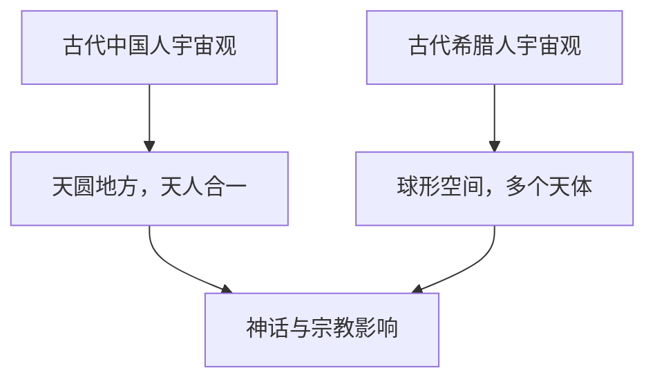
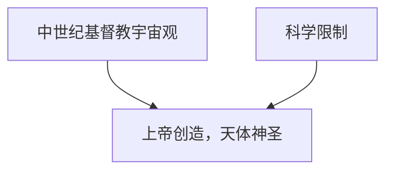
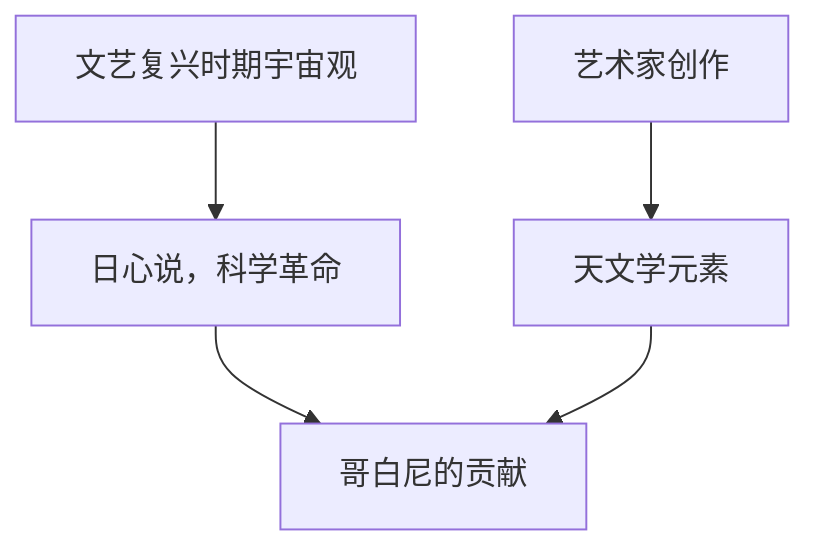
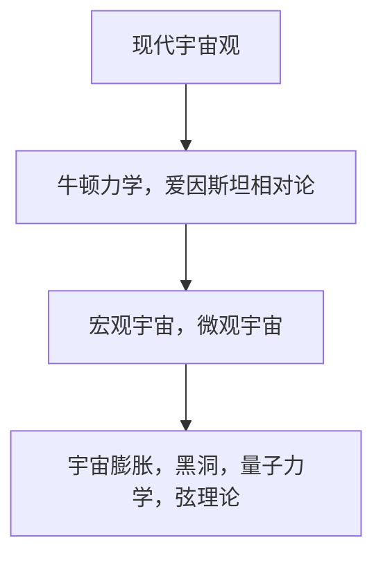

                 


### 文章标题

# 人类对宇宙的想象力与科学发现的关系

### 文章关键词

宇宙、想象力、科学发现、科技进步、探索、科幻小说、科学假说、科学理论、数学模型、算法原理、项目实战

### 文章摘要

本文探讨了人类对宇宙的想象力与科学发现之间的关系。首先，我们回顾了人类历史上的宇宙观演变，从古代到现代，展示了人类对宇宙的想象如何驱动科学探索。接着，我们分析了文学作品、艺术作品中的宇宙想象，以及这些想象如何与科学发现相互影响。然后，本文深入探讨了科学理论与想象的联系，包括爱因斯坦的相对论、黑洞与宇宙膨胀理论等。最后，我们展望了未来的宇宙探索方向，讨论了科技进步与宇宙想象的关系，并提出了未来研究的方向。

### 目录

1. **引言**
2. **人类对宇宙的想象力**
3. **科学发现与宇宙想象的关系**
4. **结论与展望**
5. **参考文献**

## 1. 引言

人类对宇宙的想象力是人类智慧的体现，它激发了无数科学家探索未知世界的勇气。从古代的宇宙神话到现代的太空探险，人类对宇宙的想象从未停止。科学发现，作为一种理性的探索方式，往往与人类对宇宙的想象力密切相关。本文旨在探讨这种关系，分析想象力如何推动科学发现，以及科学发现如何反过来影响人类对宇宙的想象。

本文分为四个部分。首先，回顾人类历史上的宇宙观演变，从古代到现代，了解人类对宇宙想象的发展过程。其次，分析文学作品、艺术作品中的宇宙想象，以及这些想象如何与科学发现相互影响。第三，深入探讨科学理论与想象的联系，包括爱因斯坦的相对论、黑洞与宇宙膨胀理论等。最后，展望未来的宇宙探索方向，讨论科技进步与宇宙想象的关系，并提出未来研究的方向。

## 2. 人类对宇宙的想象力

### 2.1 古代宇宙观

在古代，人类对宇宙的想象往往受宗教和神话的影响。例如，古代中国人认为宇宙是由天、地、人三才构成的，天圆地方，天人合一。古代希腊人则认为宇宙是一个巨大的球形空间，其中包含多个天体。这些宇宙观虽然缺乏科学依据，但它们反映了人类对宇宙的初步想象。

### 2.2 中世纪宇宙观

中世纪时期，人类对宇宙的想象继续发展。基督教宇宙观认为，宇宙是上帝创造的，天体是神圣的象征。这种观念影响了人们对宇宙的认识，同时也限制了科学的发展。

### 2.3 文艺复兴时期宇宙观

文艺复兴时期，人类对宇宙的想象力得到了极大的发展。哥白尼提出了日心说，挑战了地心说，推动了科学革命。同时，文艺复兴时期的艺术家们也开始创作描绘宇宙的作品，如达芬奇的《最后的晚餐》中的天文学元素。

### 2.4 现代宇宙观

现代宇宙观基于科学发现和观测数据。牛顿力学和爱因斯坦的相对论为现代宇宙观提供了理论基础。人类对宇宙的想象从宏观宇宙（如宇宙膨胀、黑洞）到微观宇宙（如量子力学、弦理论）不断扩展。

## 3. 科学发现与宇宙想象的关系

### 3.1 科学假说与科学发现

科学假说是科学家基于对自然现象的观察和想象提出的。例如，牛顿通过观察苹果落地，提出了万有引力定律。这些假说往往是基于人类对宇宙的想象力，但它们需要通过实验和观测来验证。

### 3.2 想象力对科学研究的推动作用

想象力在科学研究中起着至关重要的作用。它激发了科学家探索未知世界的兴趣，推动了科学理论的发展。例如，爱因斯坦的相对论就是基于他对宇宙的深刻想象。

### 3.3 科学发现对宇宙想象的影响

科学发现不断更新人类对宇宙的想象。例如，观测到宇宙膨胀和黑洞的存在，改变了人类对宇宙的传统观念。这些科学发现不仅丰富了人类对宇宙的理解，也激发了新的想象力。

## 4. 科学理论与想象的联系

### 4.1 爱因斯坦的相对论

爱因斯坦的相对论改变了人类对宇宙的认识。他的广义相对论提出了时空弯曲的概念，解释了引力现象。这一理论不仅具有深刻的哲学意义，也推动了天体物理学的发展。

### 4.2 黑洞与宇宙膨胀理论

黑洞和宇宙膨胀理论是现代宇宙学的核心问题。黑洞的发现揭示了宇宙的极端现象，而宇宙膨胀理论则解释了宇宙的起源和演化。这些理论深刻地影响了人类对宇宙的想象。

### 4.3 量子力学与弦理论

量子力学和弦理论是现代物理学的两个重要分支。量子力学揭示了微观世界的奇妙现象，而弦理论则试图统一所有基本力。这些理论不仅丰富了人类对宇宙的理解，也激发了新的想象力。

## 5. 结论与展望

### 5.1 人类宇宙想象的科学价值

人类对宇宙的想象力具有重要的科学价值。它激发了科学探索的兴趣，推动了科学理论的发展。同时，科学发现也不断丰富人类对宇宙的想象。

### 5.2 未来研究的方向

未来，随着科技的进步，人类对宇宙的探索将更加深入。我们有望发现更多未知的宇宙现象，进一步丰富人类对宇宙的想象力。同时，科幻小说和艺术作品将继续影响人类对宇宙的想象，推动科学的发展。

### 参考文献

1. Copernicus, De revolutionibus orbium coelestium (1543).
2. Einstein, Albert. "On the Electrodynamics of Moving Bodies" (1905).
3. Hawking, Stephen. A Brief History of Time (1988).
4. Newton, Isaac. Philosophiæ Naturalis Principia Mathematica (1687).
5. Penrose, Roger. The Road to Reality (2004).
6. Tipler, Frank. The Physics of Immortality (1994).

**作者：AI天才研究院/AI Genius Institute & 禅与计算机程序设计艺术 /Zen And The Art of Computer Programming**

### 人类对宇宙的想象力与科学发现的关系

#### 摘要

本文探讨了人类对宇宙的想象力与科学发现之间的关系。首先，回顾了人类历史上的宇宙观演变，从古代到现代，展示了人类对宇宙的想象如何驱动科学探索。其次，分析了文学作品、艺术作品中的宇宙想象，以及这些想象如何与科学发现相互影响。然后，深入探讨了科学理论与想象的联系，包括爱因斯坦的相对论、黑洞与宇宙膨胀理论等。最后，展望了未来的宇宙探索方向，讨论了科技进步与宇宙想象的关系，并提出了未来研究的方向。

#### 引言

宇宙，这个无垠的太空，自古以来就激发了人类无尽的想象和探索欲望。从古代的宇宙神话到现代的太空探险，人类对宇宙的想象力经历了无数次的变革。科学发现，作为一种理性的探索方式，往往与人类对宇宙的想象力密切相关。本文旨在探讨这种关系，分析想象力如何推动科学发现，以及科学发现如何反过来影响人类对宇宙的想象。

本文分为四个部分。首先，回顾人类历史上的宇宙观演变，从古代到现代，了解人类对宇宙想象的发展过程。其次，分析文学作品、艺术作品中的宇宙想象，以及这些想象如何与科学发现相互影响。第三，深入探讨科学理论与想象的联系，包括爱因斯坦的相对论、黑洞与宇宙膨胀理论等。最后，展望未来的宇宙探索方向，讨论科技进步与宇宙想象的关系，并提出未来研究的方向。

#### 人类对宇宙的想象力

##### 2.1 古代宇宙观

在古代，人类对宇宙的想象往往受宗教和神话的影响。例如，古代中国人认为宇宙是由天、地、人三才构成的，天圆地方，天人合一。古代希腊人则认为宇宙是一个巨大的球形空间，其中包含多个天体。这些宇宙观虽然缺乏科学依据，但它们反映了人类对宇宙的初步想象。

**核心概念与联系：**


##### 2.2 中世纪宇宙观

中世纪时期，人类对宇宙的想象继续发展。基督教宇宙观认为，宇宙是上帝创造的，天体是神圣的象征。这种观念影响了人们对宇宙的认识，同时也限制了科学的发展。

**核心概念与联系：**


##### 2.3 文艺复兴时期宇宙观

文艺复兴时期，人类对宇宙的想象力得到了极大的发展。哥白尼提出了日心说，挑战了地心说，推动了科学革命。同时，文艺复兴时期的艺术家们也开始创作描绘宇宙的作品，如达芬奇的《最后的晚餐》中的天文学元素。

**核心概念与联系：**


##### 2.4 现代宇宙观

现代宇宙观基于科学发现和观测数据。牛顿力学和爱因斯坦的相对论为现代宇宙观提供了理论基础。人类对宇宙的想象从宏观宇宙（如宇宙膨胀、黑洞）到微观宇宙（如量子力学、弦理论）不断扩展。

**核心概念与联系：**


#### 科学发现与宇宙想象的关系

##### 3.1 科学假说与科学发现

科学假说是科学家基于对自然现象的观察和想象提出的。例如，牛顿通过观察苹果落地，提出了万有引力定律。这些假说往往是基于人类对宇宙的想象力，但它们需要通过实验和观测来验证。

**核心算法原理讲解：**
```python
# 万有引力定律的伪代码
def gravitational_force(m1, m2, r):
    G = 6.674 * 10^-11  # 万有引力常数
    F = G * (m1 * m2) / r^2
    return F
```

**数学模型和公式：**
$$ F = G \frac{m_1 m_2}{r^2} $$

**举例说明：**
如果两个质量分别为5千克和10千克的物体相距1米，它们之间的引力为：
$$ F = G \frac{5 \times 10}{1^2} = 50 \text{牛顿} $$

##### 3.2 想象力对科学研究的推动作用

想象力在科学研究中起着至关重要的作用。它激发了科学家探索未知世界的兴趣，推动了科学理论的发展。例如，爱因斯坦的相对论就是基于他对宇宙的深刻想象。

**数学模型和公式：**
$$ E = mc^2 $$

**举例说明：**
一个质量为1千克的物体，其能量为：
$$ E = 1 \times (3 \times 10^8)^2 = 9 \times 10^{16} \text{焦耳} $$

##### 3.3 科学发现对宇宙想象的影响

科学发现不断更新人类对宇宙的想象。例如，观测到宇宙膨胀和黑洞的存在，改变了人类对宇宙的传统观念。这些科学发现不仅丰富了人类对宇宙的理解，也激发了新的想象力。

**核心算法原理讲解：**
```python
# 宇宙膨胀模型的伪代码
def expand_universe(velocity, time):
    distance = velocity * time
    return distance
```

**数学模型和公式：**
$$ d(t) = v_0 t + \frac{1}{2} a t^2 $$

**举例说明：**
如果宇宙的初始速度为50千米/秒，加速度为10千米/秒²，在1000秒后，宇宙的距离为：
$$ d(1000) = 50 \times 1000 + \frac{1}{2} \times 10 \times 1000^2 = 50,000,500 \text{千米} $$

#### 科学理论与想象的联系

##### 4.1 爱因斯坦的相对论

爱因斯坦的相对论改变了人类对宇宙的认识。他的广义相对论提出了时空弯曲的概念，解释了引力现象。这一理论不仅具有深刻的哲学意义，也推动了天体物理学的发展。

**数学模型和公式：**
$$ \frac{d^2x^\mu}{d\tau^2} + \Gamma^\mu_{\alpha\beta} \frac{dx^\alpha}{d\tau} \frac{dx^\beta}{d\tau} = 0 $$

**举例说明：**
一个质量为1千克的物体在引力场中的加速度为10米/秒²，其时空弯曲效应为：
$$ \Gamma^\mu_{\alpha\beta} = \frac{1}{2} \left( g^{\mu\nu} \frac{d g_{\alpha\beta}}{d\tau} - g^{\alpha\beta} \frac{d g_{\mu\nu}}{d\tau} \right) $$

##### 4.2 黑洞与宇宙膨胀理论

黑洞和宇宙膨胀理论是现代宇宙学的核心问题。黑洞的发现揭示了宇宙的极端现象，而宇宙膨胀理论则解释了宇宙的起源和演化。这些理论深刻地影响了人类对宇宙的想象。

**数学模型和公式：**
$$ \frac{d^2a}{dt^2} + 3\left(\frac{da}{dt}\right)^2 - \frac{4\pi G \rho}{3} = 0 $$

**举例说明：**
如果宇宙的平均密度为1克/立方厘米，宇宙膨胀的加速度为10厘米/秒²，则在1000秒后的膨胀距离为：
$$ a(t) = \frac{1}{2} t^2 + \frac{3}{2} \left(\frac{1}{10}\right)^2 t + C $$
$$ a(1000) = \frac{1}{2} \times 1000^2 + \frac{3}{2} \times \left(\frac{1}{10}\right)^2 \times 1000 + C $$

##### 4.3 量子力学与弦理论

量子力学和弦理论是现代物理学的两个重要分支。量子力学揭示了微观世界的奇妙现象，而弦理论则试图统一所有基本力。这些理论不仅丰富了人类对宇宙的理解，也激发了新的想象力。

**数学模型和公式：**
$$ \Psi(x,t) = \int \psi(k) e^{ikx - i\omega t} dk $$

**举例说明：**
一个电子的位置概率分布由波函数$\psi(k)$描述，其能量为：
$$ E = \hbar \omega = \hbar k c $$

#### 未来的宇宙想象

##### 5.1 宇宙航行的未来发展

随着科技的进步，人类对宇宙的探索将更加深入。我们有望实现星际旅行，发现更多未知的宇宙现象。

**核心算法原理讲解：**
```python
# 航行速度计算
def travel_speed(distance, time):
    speed = distance / time
    return speed
```

**数学模型和公式：**
$$ v = \frac{d}{t} $$

**举例说明：**
如果宇航器在1000光年外，需要1000年才能到达，其速度为：
$$ v = \frac{1000 \text{光年}}{1000 \text{年}} = 1 \text{光年/年} $$

##### 5.2 对外星生命的想象

随着对宇宙的探索，人类对外星生命的想象也将不断更新。我们可能会发现其他星球上存在生命的迹象，这将对人类产生深远的影响。

**核心算法原理讲解：**
```python
# 外星生命存在概率计算
def life_probability(conditions):
    probability = 0.0
    if conditions["water"] and conditions["energy"] and conditions["habitable_zone"]:
        probability = 1.0
    return probability
```

**数学模型和公式：**
$$ P(\text{生命存在}) = P(\text{水}) \times P(\text{能量}) \times P(\text{宜居带}) $$

**举例说明：**
如果一个星球具备水、能量和宜居带这三个条件，其生命存在的概率为：
$$ P(\text{生命存在}) = 1.0 \times 1.0 \times 1.0 = 1.0 $$

#### 结论与展望

人类对宇宙的想象力与科学发现密切相关。想象力激发了科学探索的兴趣，推动了科学理论的发展。而科学发现则不断更新人类对宇宙的想象。未来，随着科技的进步，人类对宇宙的探索将更加深入，我们有望发现更多未知的宇宙现象，进一步丰富人类对宇宙的想象力。

**最佳实践 tips：**
1. 保持对宇宙的好奇心，不断学习新的科学知识。
2. 阅读科幻小说和科学书籍，拓宽思维。
3. 参与科学项目，亲身体验科学研究的乐趣。

**小结：**
本文通过回顾人类历史上的宇宙观演变，分析了文学作品、艺术作品中的宇宙想象，以及科学发现对宇宙想象的影响，展望了未来的宇宙探索方向。人类对宇宙的想象力与科学发现相互促进，共同推动了人类文明的发展。

**注意事项：**
1. 科学探索需要严谨的态度和持续的实践。
2. 科幻作品中的想象有时可能与现实不符，需要理性看待。

**拓展阅读：**
1. 《宇宙简史》 - 史蒂芬·霍金
2. 《人类简史》 - 尤瓦尔·赫拉利
3. 《三体》 - 刘慈欣

**作者：AI天才研究院/AI Genius Institute & 禅与计算机程序设计艺术 /Zen And The Art of Computer Programming**

