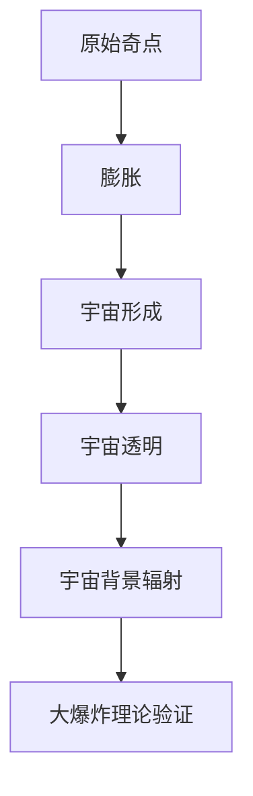
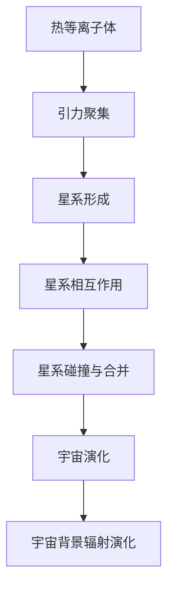
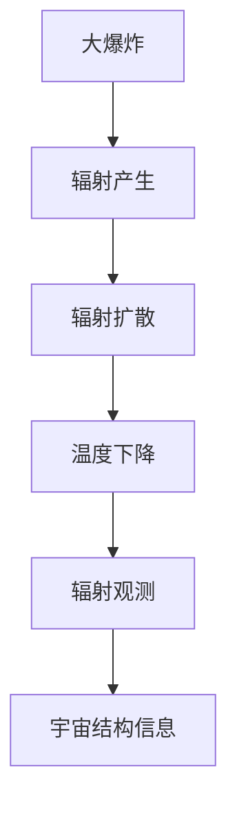
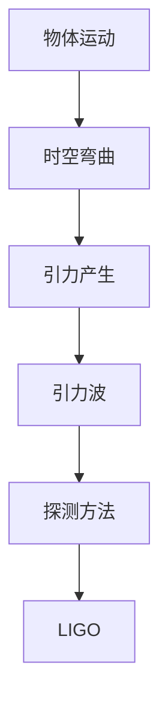
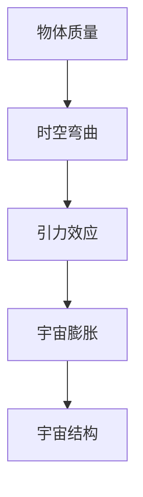
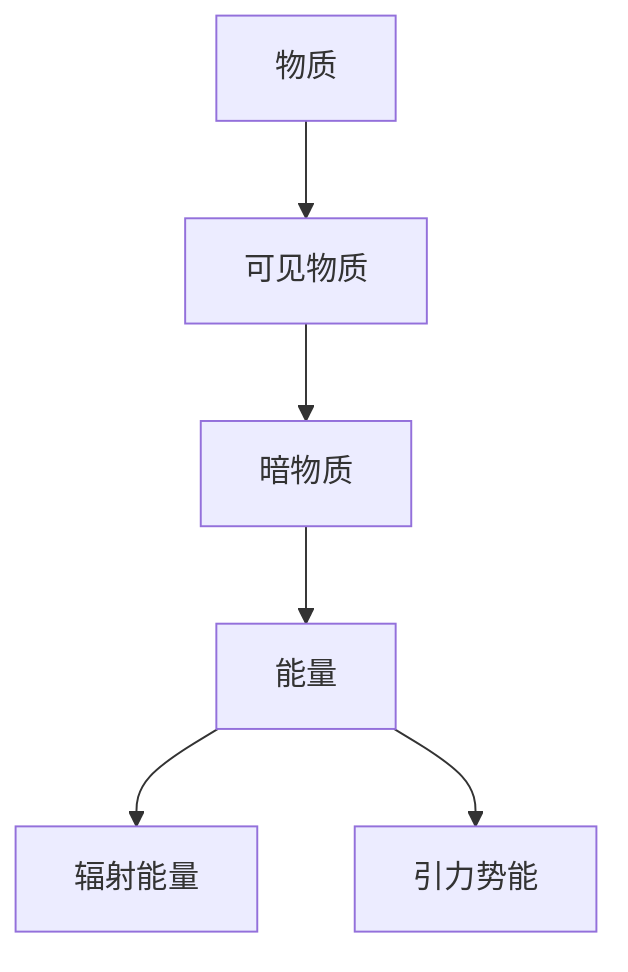
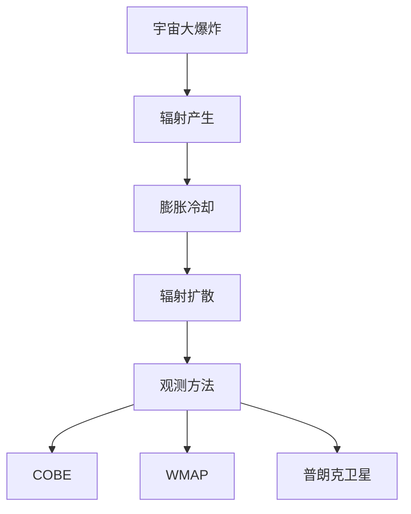
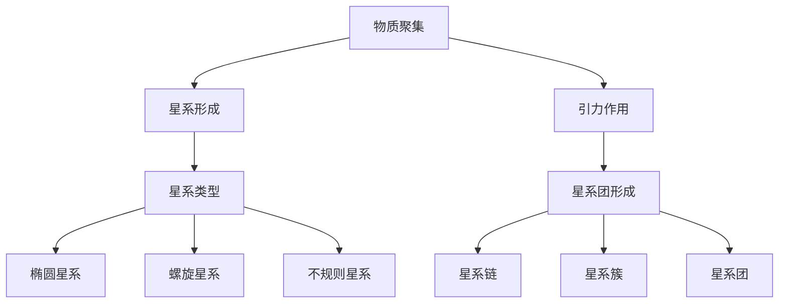

                 

### 2.1 宇宙学基础

#### 2.1.1 宇宙的起源

宇宙的起源一直是科学界最引人入胜的课题之一。现代宇宙学认为，宇宙起源于大约138亿年前的一个极端状态，即所谓的“大爆炸”。这个理论最初由伽莫夫（George Gamow）和他的同事们提出，他们在20世纪40年代提出了一种名为“热大爆炸理论”的模型。

在热大爆炸理论中，宇宙起源于一个极小、极热、极密集的状态，称为“原始奇点”。在这个奇点中，物质和能量处于极高密度和温度的状态，所有的物质和能量都高度集中。随后，宇宙开始迅速膨胀，这个膨胀过程伴随着温度的下降。随着宇宙的膨胀，温度逐渐降低，物质开始形成，宇宙逐渐变得透明。

大爆炸理论的一个重要证据是宇宙背景辐射的发现。宇宙背景辐射是宇宙大爆炸后遗留下来的辐射，它均匀地弥漫在整个宇宙中。1965年，阿诺·彭齐亚斯（Arno Penzias）和罗伯特·威尔逊（Robert Wilson）在研究无线电天线时意外发现了这种辐射，这一发现为热大爆炸理论提供了强有力的证据。

Mermaid 流程图：

#### 2.1.2 宇宙的结构与演化

宇宙的结构与演化是宇宙学研究的核心问题之一。现代宇宙学认为，宇宙的结构是由大量的星系、星系团和超星系团组成的。这些结构在宇宙中的分布不是随机的，而是呈现出一种层次化的结构。

在宇宙的早期阶段，物质以热等离子体的形式存在。随着宇宙的膨胀和冷却，物质开始聚集形成密度较高的区域，这些区域逐渐形成了星系。星系的形成过程涉及到引力作用、气体冷却、恒星形成等多个因素。

星系的形成并不是孤立的过程，星系之间的相互作用和引力相互作用对星系的演化有着重要影响。例如，星系碰撞和合并是星系演化的重要机制，这种相互作用可以改变星系的形态和性质。

宇宙的演化还涉及到宇宙背景辐射的演化。随着宇宙的膨胀，宇宙背景辐射的温度逐渐降低，辐射的波长也逐渐变长。这种辐射的演化为我们提供了宇宙早期状态的信息，帮助我们更好地理解宇宙的起源和演化过程。

Mermaid 流程图：

#### 2.1.3 宇宙背景辐射

宇宙背景辐射是宇宙学中一个非常重要的概念。它是指在宇宙大爆炸后遗留下来的辐射，这种辐射均匀地弥漫在整个宇宙中，并且温度非常低，大约只有2.7开尔文。

宇宙背景辐射的发现为我们提供了宇宙早期状态的重要信息。通过对宇宙背景辐射的观测和分析，我们可以了解宇宙在大爆炸后的几分钟到几十万年的时间内的状态，包括宇宙的膨胀速度、物质密度等。

宇宙背景辐射的观测主要是通过测量其温度和偏振特性来进行的。例如，宇宙微波背景探测器（COBE）和宇宙背景成像实验（BOOMERANG）等任务通过测量宇宙背景辐射的温度波动和偏振模式，提供了宇宙早期结构形成的信息。

Mermaid 流程图：

通过以上对宇宙学基础的介绍，我们可以看到，宇宙的起源、结构和演化是一个复杂而美妙的过程。理解这些基础概念对于深入探索宇宙的奥秘至关重要。

### 2.2 时空与引力

#### 2.2.1 广义相对论与引力波

广义相对论是爱因斯坦于1915年提出的一种描述引力和时空几何关系的理论。与牛顿的引力理论不同，广义相对论将引力视为时空的弯曲，而不是一种作用力。在这个理论框架下，物体的质量和能量会扭曲周围的时空，从而导致其他物体的运动轨迹发生改变。

广义相对论的一个关键预测是引力波的存在。引力波是由加速运动的物体（如双星系统或黑洞合并）产生的扰动，它以光速传播，携带关于产生它们的物体的信息。2015年，LIGO（激光干涉引力波观测站）的科学家们首次直接探测到引力波，这一发现被誉为物理学史上的一次重大突破。

引力波的探测方法基于对激光干涉的精确测量。在LIGO中，两个臂长的管道中装有反射镜，激光束在管道中往返，形成干涉图案。当引力波经过时，管道的长度会发生变化，从而改变干涉图案。通过分析这些干涉图案的变化，科学家们可以探测到引力波的存在。

Mermaid 流程图：

#### 2.2.2 时空的概念与影响

时空是广义相对论的核心概念之一。在牛顿力学中，时间和空间被视为独立的存在，而广义相对论则将它们视为一个统一的整体，称为时空。在这个理论框架下，时空的几何结构对物体的运动和引力有着重要影响。

时空的弯曲是广义相对论的一个重要特征。当物体的质量或能量增加时，它会使得周围的时空发生弯曲。这种弯曲会影响到其他物体的运动轨迹，从而产生引力效应。例如，一个重物体的存在会导致周围的时空弯曲，使得轻物体的运动轨迹发生偏移。

时空的弯曲对宇宙的演化也有着深远的影响。在宇宙学中，时空的弯曲可以影响宇宙的膨胀速度和结构形成。例如，宇宙背景辐射的观测表明，宇宙在早期阶段经历了一个快速膨胀的时期，这个时期被称为“宇宙暴胀”。时空的弯曲在这个时期起到了关键作用，推动了宇宙的快速膨胀。

Mermaid 流程图：

#### 2.2.3 宇宙中的物质与能量

宇宙中的物质与能量是宇宙学研究的另一个重要方面。物质是构成宇宙的基本元素，而能量则是物质的动态表现。在广义相对论中，物质和能量被视为时空的弯曲源，它们对时空的几何结构有着直接的影响。

宇宙中的物质可以分为可见物质和暗物质。可见物质是我们能够直接观测到的物质，包括恒星、星系、行星等。而暗物质则是一种看不见、不发光的物质，它的存在通过引力效应被探测到。暗物质在宇宙的总质量中占据了很大比例，但其具体组成和性质仍然是科学界的研究重点。

能量方面，宇宙中存在多种形式的能量，包括辐射能量、引力势能、动能等。辐射能量主要来自于恒星和星系，而引力势能则与物质的质量和分布有关。这些能量形式在宇宙的演化过程中起着关键作用，影响着宇宙的结构和演化。

Mermaid 流程图：

通过以上对时空与引力的介绍，我们可以看到，这些概念和理论为理解宇宙的奥秘提供了重要的框架。广义相对论和引力波的发现不仅深化了我们对宇宙的理解，也为未来的宇宙探索开辟了新的途径。

### 2.3 宇宙中的物质与能量

#### 2.3.1 宇宙背景辐射

宇宙背景辐射（Cosmic Microwave Background，简称CMB）是宇宙学中一个极为重要的观测现象。它源自于宇宙大爆炸后不久的时期，大约在38万年前，当时的宇宙处于高温高密的状态，随着宇宙的膨胀和冷却，这些早期的辐射逐渐扩散到整个宇宙中，形成了我们今天所观测到的宇宙背景辐射。

宇宙背景辐射的主要特征是它具有非常均匀的温度，大约为2.7开尔文，并且它的光谱呈现出黑体辐射的形式。这些特性为宇宙学提供了宝贵的信息，帮助我们了解宇宙早期的状态。

宇宙背景辐射的观测最早由阿诺·彭齐亚斯（Arno Penzias）和罗伯特·威尔逊（Robert Wilson）在1965年完成。他们使用一个天线阵列探测到来自宇宙空间的热辐射，这一发现后来被证实为宇宙背景辐射，并因此获得了1978年的诺贝尔物理学奖。

观测宇宙背景辐射的方法主要包括全天空扫描和特定天区的精细测量。例如，宇宙背景探测卫星（Cosmic Background Explorer，简称COBE）在1989年发射，通过测量宇宙背景辐射的温度波动，提供了关于宇宙早期结构形成的详细信息。后续的卫星任务，如威尔金森微波各向异性探测器（Wilkinson Microwave Anisotropy Probe，简称WMAP）和普朗克卫星（Planck Satellite），进一步提高了观测的精度和分辨率，帮助我们更深入地了解宇宙的早期状态。

Mermaid 流程图：

#### 2.3.2 星系与星系团

星系和星系团是宇宙中两种基本的天体结构。星系是由大量恒星、气体、尘埃和暗物质组成的系统，而星系团则是由多个星系通过引力相互作用聚集在一起的大型结构。

星系可以分为多种类型，根据其形态和恒星分布，可以分为椭圆星系、螺旋星系和不规则星系。椭圆星系通常较为球形，恒星分布较为均匀；螺旋星系则具有明显的旋臂结构，恒星分布呈螺旋状；不规则星系则没有明显的对称结构。

星系的形成是一个复杂的过程，涉及引力作用、气体冷却、恒星形成等多个因素。在宇宙的早期，物质通过引力聚集形成密度较高的区域，这些区域逐渐形成了星系。星系的演化过程受到其内部恒星演化、恒星形成、星系碰撞和合并等多种因素的影响。

星系团是宇宙中更大规模的结构，由数十个到数千个星系组成。星系团的形成和演化同样受到引力作用的影响。星系团中的星系通过引力相互作用形成复杂的结构，包括星系链、星系簇和星系团。星系团中的星系通常通过引力相互作用保持在一起，但它们之间的距离相对较远，因此相对稳定。

观测星系和星系团的方法主要包括光学观测、射电观测和X射线观测等。光学观测通过望远镜可以观测到星系的形态和恒星分布，射电观测可以探测到星系中的气体和尘埃，而X射线观测则可以探测到星系团中的高能辐射。

Mermaid 流程图：

通过以上对宇宙中的物质与能量的介绍，我们可以看到，宇宙背景辐射、星系和星系团都是宇宙学研究中的重要组成部分。它们不仅帮助我们理解宇宙的起源和演化，也为未来的宇宙探索提供了重要的方向和线索。

