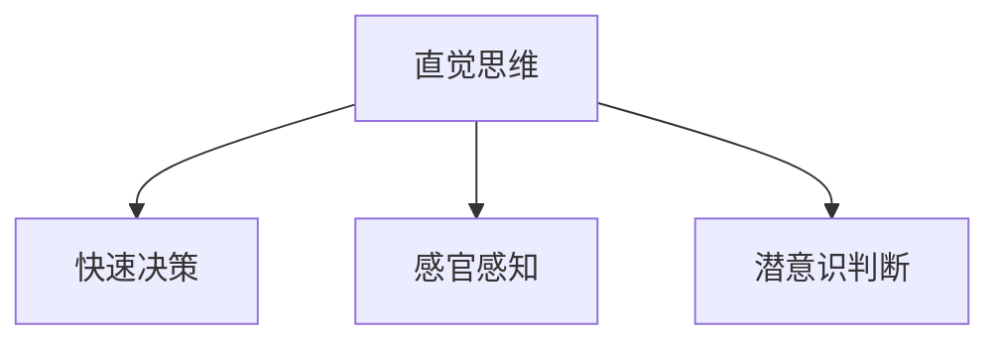
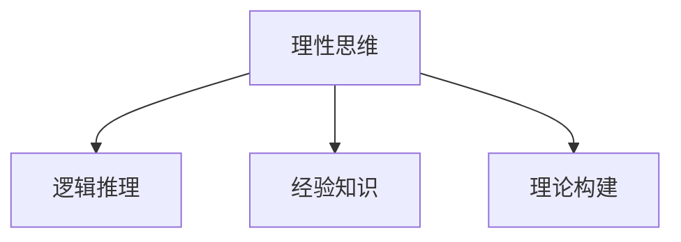
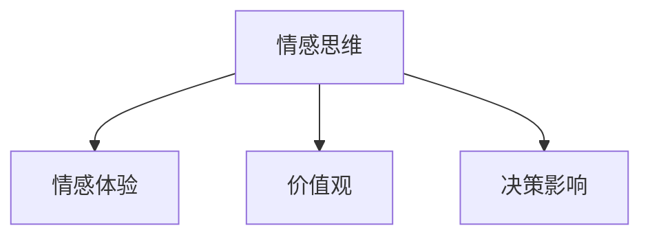

                 

# 文章标题：人类思维模式对宇宙本质理解的影响

> 关键词：宇宙本质、人类思维模式、宇宙观念、科学哲学、人工智能

> 摘要：本文旨在探讨人类思维模式对宇宙本质理解的影响。通过分析人类思维模式的基本类型及其起源与发展，结合宇宙的起源与演化过程，以及人类对宇宙本质的探索，我们试图揭示思维模式与宇宙观念之间的内在联系，并探讨思维模式的改变对宇宙观念的演化所产生的影响。同时，本文还将讨论人类思维模式与宇宙和谐的关系，并展望未来人类对宇宙本质理解的研究方向和挑战。

## 目录大纲

### 第一部分：宇宙观的基础

### 第1章：人类思维模式的概述

#### 1.1 人类思维模式的基本类型

##### 1.1.1 直觉思维

##### 1.1.2 理性思维

##### 1.1.3 情感思维

#### 1.2 人类思维模式的起源与发展

##### 1.2.1 人类思维模式的生物学基础

##### 1.2.2 历史与文化对思维模式的影响

##### 1.2.3 现代科技与思维模式的变化

### 第2章：宇宙的起源与演化

#### 2.1 宇宙大爆炸理论

##### 2.1.1 大爆炸理论的基本原理

##### 2.1.2 大爆炸理论的证据与反驳

#### 2.2 宇宙的演化过程

##### 2.2.1 星系的诞生与演化

##### 2.2.2 恒星的生命周期

##### 2.2.3 宇宙的膨胀与暗能量

### 第3章：人类对宇宙本质的探索

#### 3.1 天文学与宇宙学

##### 3.1.1 天文学的基本工具与技术

##### 3.1.2 宇宙学的核心理论

##### 3.1.3 宇宙学的前沿研究

#### 3.2 量子力学与宇宙

##### 3.2.1 量子力学的基本原理

##### 3.2.2 量子力学与宇宙的联系

##### 3.2.3 量子宇宙学的挑战与机遇

### 第二部分：人类思维模式对宇宙理解的影响

### 第4章：思维模式与宇宙观念的形成

#### 4.1 宗教观念与宇宙

##### 4.1.1 宗教对宇宙观念的影响

##### 4.1.2 佛教的宇宙观

##### 4.1.3 基督教的宇宙观

#### 4.2 科学观念与宇宙

##### 4.2.1 科学对宇宙观念的贡献

##### 4.2.2 科学与哲学的交集

##### 4.2.3 科学哲学的挑战

### 第5章：思维模式与宇宙探索

#### 5.1 人类对宇宙的观测与实验

##### 5.1.1 天文望远镜的发展

##### 5.1.2 宇宙探测器的应用

##### 5.1.3 宇宙探索的未来趋势

#### 5.2 思维模式与科学发现

##### 5.2.1 科学发现的思维方式

##### 5.2.2 思维模式与科学理论的创新

##### 5.2.3 思维模式与科学解释的局限

### 第6章：思维模式的改变与宇宙观念的演化

#### 6.1 科学革命与宇宙观念的转变

##### 6.1.1 地心说到日心说的转变

##### 6.1.2 光速不变原理的提出

##### 6.1.3 黑洞与暗物质的研究

#### 6.2 新技术的崛起与宇宙观念的拓展

##### 6.2.1 人工智能与宇宙探索

##### 6.2.2 虚拟现实与宇宙体验

##### 6.2.3 新兴技术与宇宙观念的未来

### 第7章：人类思维模式与宇宙和谐

#### 7.1 人类思维模式与生态平衡

##### 7.1.1 人类活动对宇宙环境的影响

##### 7.1.2 宇宙观与环境保护

##### 7.1.3 人类与宇宙的和谐共存

#### 7.2 宇宙观念与人类精神生活

##### 7.2.1 宇宙观念对人类精神的影响

##### 7.2.2 宇宙观念与哲学思考

##### 7.2.3 宇宙观念与宗教信仰的交融

### 附录

#### 附录A：参考文献与推荐阅读

##### A.1 宇宙学相关书籍

##### A.2 科学哲学相关书籍

##### A.3 人类思维模式相关书籍

#### 附录B：宇宙探索项目简介

##### B.1 NASA的主要任务

##### B.2 中国的航天工程

##### B.3 国际合作宇宙探索项目

## 总结与展望

### 总结与展望

### 后续研究方向与挑战

### 结论

---

以下是根据提供的目录大纲撰写的文章正文部分。文章将逐步探讨人类思维模式对宇宙本质理解的影响，涵盖各个章节的内容。

---

## 第一部分：宇宙观的基础

### 第1章：人类思维模式的概述

人类思维模式是人类认知世界、解决问题和获取知识的方式。从心理学和哲学的角度来看，人类思维模式可以分为直觉思维、理性思维和情感思维三种基本类型。

#### 1.1 人类思维模式的基本类型

##### 1.1.1 直觉思维

直觉思维是一种基于直观感受和本能判断的思维方式。它不依赖于逻辑推理和经验，而是通过感官和潜意识迅速作出判断。在日常生活中，直觉思维帮助我们快速做出决策，例如判断食物是否新鲜、评估风险等。

##### 1.1.2 理性思维

理性思维是一种基于逻辑推理和经验知识的思维方式。它强调通过分析、比较、归纳和演绎来解决问题。科学研究和学术讨论主要依赖于理性思维，它使我们能够理解复杂的现象，发现规律，并构建理论体系。

##### 1.1.3 情感思维

情感思维是一种基于情感体验和价值观的思维方式。它关注人类的需求、欲望和价值观，影响我们的决策和行为。情感思维在人际关系、艺术创作和道德判断中起着重要作用。

#### 1.2 人类思维模式的起源与发展

##### 1.2.1 人类思维模式的生物学基础

人类思维模式的起源可以追溯到生物进化。在长期的进化过程中，人类的大脑逐渐发展出复杂的认知功能，包括感知、记忆、思考和情感。这些功能共同构成了人类思维的基础。

##### 1.2.2 历史与文化对思维模式的影响

历史和文化因素对人类思维模式有着深远的影响。不同的文化背景和宗教信仰塑造了人类的价值观和世界观，从而影响了我们的思维方式和宇宙观念。

##### 1.2.3 现代科技与思维模式的变化

现代科技的发展极大地改变了人类的思维模式。例如，互联网和人工智能技术的出现使我们能够更快地获取信息、更高效地解决问题，同时也带来了新的挑战，例如信息过载和伦理问题。

---

### 第2章：宇宙的起源与演化

宇宙的起源与演化是宇宙学的研究主题。目前，最被广泛接受的宇宙起源理论是宇宙大爆炸理论。

#### 2.1 宇宙大爆炸理论

##### 2.1.1 大爆炸理论的基本原理

大爆炸理论认为，宇宙起源于约138亿年前的一个极高温度和密度的奇点。随着奇点的膨胀，宇宙逐渐冷却，形成了星系、恒星和行星等宇宙结构。

##### 2.1.2 大爆炸理论的证据与反驳

大爆炸理论的证据包括宇宙背景辐射、宇宙膨胀速度的观测等。然而，也有一些学者对大爆炸理论提出了反驳，例如黑洞和暗物质的解释。

#### 2.2 宇宙的演化过程

##### 2.2.1 星系的诞生与演化

星系是宇宙中最常见的结构，包括数百亿颗恒星、气体和暗物质。星系的诞生和演化与宇宙的大爆炸密切相关。

##### 2.2.2 恒星的生命周期

恒星是宇宙中最耀眼的物体，它们通过核聚变产生能量。恒星的生命周期包括诞生、成长、死亡和遗物形成等阶段。

##### 2.2.3 宇宙的膨胀与暗能量

宇宙的膨胀是指宇宙空间在大爆炸后不断扩张的过程。暗能量是一种假设存在的能量形式，被认为是导致宇宙加速膨胀的原因。

---

### 第3章：人类对宇宙本质的探索

人类对宇宙本质的探索是一个长期而持续的过程，涉及天文学、宇宙学和量子力学等多个领域。

#### 3.1 天文学与宇宙学

##### 3.1.1 天文学的基本工具与技术

天文学研究宇宙的组成、结构、演化和现象。天文望远镜、射电望远镜、空间探测器等是天文研究的重要工具。

##### 3.1.2 宇宙学的核心理论

宇宙学研究宇宙的起源、演化和结构。宇宙大爆炸理论、暗物质和暗能量等是宇宙学研究的核心理论。

##### 3.1.3 宇宙学的前沿研究

宇宙学的前沿研究包括宇宙的早期状态、宇宙的最终命运、宇宙的多样性和复杂性等。

#### 3.2 量子力学与宇宙

##### 3.2.1 量子力学的基本原理

量子力学是研究微观世界的物理学理论。量子叠加态、量子纠缠、量子隧穿等现象是量子力学的核心概念。

##### 3.2.2 量子力学与宇宙的联系

量子力学与宇宙的联系体现在宇宙的量子性质、量子引力理论和量子宇宙学等研究领域。

##### 3.2.3 量子宇宙学的挑战与机遇

量子宇宙学是一个新兴的研究领域，旨在将量子力学与广义相对论结合起来，以解释宇宙的起源和演化。

---

## 第二部分：人类思维模式对宇宙理解的影响

### 第4章：思维模式与宇宙观念的形成

人类思维模式对宇宙观念的形成有着重要影响。不同的思维模式会导致不同的宇宙观念，从而影响人类对宇宙的理解。

#### 4.1 宗教观念与宇宙

##### 4.1.1 宗教对宇宙观念的影响

宗教信仰往往与宇宙观念密切相关。不同宗教对宇宙的起源、本质和命运有不同的看法。

##### 4.1.2 佛教的宇宙观

佛教认为宇宙是无常的，一切现象都是因缘和合而生。佛教的宇宙观强调因果律和轮回。

##### 4.1.3 基督教的宇宙观

基督教认为上帝创造了宇宙，并维持其运行。基督教的宇宙观强调上帝的恩典和救赎。

#### 4.2 科学观念与宇宙

##### 4.2.1 科学对宇宙观念的贡献

科学方法使人类能够通过实证和理性思考来理解宇宙。科学的进步不断挑战和修正传统的宇宙观念。

##### 4.2.2 科学与哲学的交集

科学和哲学在探讨宇宙的本质和意义时有着密切的交集。科学哲学研究科学理论、方法及其与哲学的关系。

##### 4.2.3 科学哲学的挑战

科学哲学面临的挑战包括解释宇宙的起源、本质和意义，以及处理科学不确定性和相对主义等问题。

---

### 第5章：思维模式与宇宙探索

人类思维模式不仅影响宇宙观念的形成，还影响宇宙探索的方式和方向。

#### 5.1 人类对宇宙的观测与实验

##### 5.1.1 天文望远镜的发展

天文望远镜的发展极大地扩展了人类观测宇宙的能力。从伽利略的望远镜到哈勃太空望远镜，天文望远镜的进步推动了宇宙学的发展。

##### 5.1.2 宇宙探测器的应用

宇宙探测器使我们能够直接观测宇宙中的物体和现象。从旅行者号探测器到卡西尼号探测器，宇宙探测器的应用不断拓展我们对宇宙的理解。

##### 5.1.3 宇宙探索的未来趋势

未来宇宙探索将集中在更深的宇宙空间、更高能量、更高分辨率的研究，以及跨学科合作等方面。

#### 5.2 思维模式与科学发现

##### 5.2.1 科学发现的思维方式

科学发现依赖于理性思维、直觉思维和情感思维的结合。科学家通过观察、实验、推理和假设来揭示宇宙的奥秘。

##### 5.2.2 思维模式与科学理论的创新

科学理论的创新往往依赖于新的思维模式和技术手段。例如，量子力学的出现挑战了经典物理学的观念，推动了科学理论的发展。

##### 5.2.3 思维模式与科学解释的局限

科学解释的局限在于人类思维模式的局限。例如，量子力学中的测量问题仍然困扰着科学家和哲学家。

---

### 第6章：思维模式的改变与宇宙观念的演化

人类思维模式的改变会导致宇宙观念的演化。历史和科技的发展不断推动宇宙观念的变革。

#### 6.1 科学革命与宇宙观念的转变

##### 6.1.1 地心说到日心说的转变

地心说到日心说的转变是宇宙观念的一次重大变革。哥白尼的日心说挑战了传统的宇宙观念，为现代宇宙学的兴起奠定了基础。

##### 6.1.2 光速不变原理的提出

爱因斯坦提出的光速不变原理颠覆了牛顿力学的基本假设，推动了相对论和现代物理学的进步。

##### 6.1.3 黑洞与暗物质的研究

黑洞和暗物质的研究揭示了宇宙的复杂性和未知性，挑战了我们对宇宙的传统观念。

#### 6.2 新技术的崛起与宇宙观念的拓展

##### 6.2.1 人工智能与宇宙探索

人工智能技术的发展为宇宙探索提供了新的工具和方法。机器学习算法、自动驾驶飞船等新技术正在改变宇宙探索的方式。

##### 6.2.2 虚拟现实与宇宙体验

虚拟现实技术的发展使人类能够模拟和体验宇宙中的各种现象，拓展了宇宙观念的边界。

##### 6.2.3 新兴技术与宇宙观念的未来

未来新兴技术，如量子计算、纳米技术等，将进一步拓展人类对宇宙的理解，推动宇宙观念的变革。

---

### 第7章：人类思维模式与宇宙和谐

人类思维模式不仅影响宇宙观念的演变，还影响人类与宇宙的和谐共存。

#### 7.1 人类思维模式与生态平衡

##### 7.1.1 人类活动对宇宙环境的影响

人类活动对地球和宇宙环境产生了深远的影响，包括气候变化、资源枯竭和环境污染等。

##### 7.1.2 宇宙观与环境保护

宇宙观影响人类的环保意识和行动。例如，保护地球生态系统被视为保护宇宙家园的一部分。

##### 7.1.3 人类与宇宙的和谐共存

人类与宇宙的和谐共存需要人类改变思维模式，采取可持续的生活方式，尊重和保护宇宙资源。

#### 7.2 宇宙观念与人类精神生活

##### 7.2.1 宇宙观念对人类精神的影响

宇宙观念影响人类的精神追求和价值观。例如，对宇宙的探索和思考可以激发人类的智慧和创造力。

##### 7.2.2 宇宙观念与哲学思考

宇宙观念与哲学思考密切相关。哲学家们探讨宇宙的本质、意义和人类的地位，形成了丰富的哲学思想。

##### 7.2.3 宇宙观念与宗教信仰的交融

宇宙观念与宗教信仰相互交融，影响人类的信仰和精神生活。例如，宗教信仰中的宇宙观念可以激发人类的道德追求和心灵寄托。

---

## 附录

### 附录A：参考文献与推荐阅读

#### A.1 宇宙学相关书籍

1. 《宇宙简史》（作者：史蒂芬·霍金）
2. 《黑洞与时间弯曲》（作者：基普·索恩）
3. 《宇宙从何处来》（作者：克里斯托弗·弗里曼）

#### A.2 科学哲学相关书籍

1. 《科学的结构》（作者：库尔特·哥德尔）
2. 《科学革命的结构》（作者：托马斯·库恩）
3. 《科学哲学导论》（作者：迈克尔·杜基）

#### A.3 人类思维模式相关书籍

1. 《思考，快与慢》（作者：丹尼尔·卡尼曼）
2. 《直觉思维》（作者：约翰·福布斯·纳什）
3. 《情感大脑》（作者：乔纳森·海特）

### 附录B：宇宙探索项目简介

#### B.1 NASA的主要任务

- 探索宇宙的奥秘，包括行星科学、天文物理学和太阳物理学等领域。
- 发射和运营各种航天器和探测器，如火星探测器、木星探测器等。
- 支持太空探索和技术研发，如太空站建设和太空飞行安全。

#### B.2 中国的航天工程

- 中国航天工程包括载人航天、月球探测和火星探测等。
- 成功发射了嫦娥系列月球探测器，天宫空间站等。
- 预计未来还将实施火星探测任务和载人登月计划。

#### B.3 国际合作宇宙探索项目

- 国际空间站（ISS）：由美国、俄罗斯、欧洲、日本和加拿大等国家合作建设。
- 哈勃太空望远镜：由美国和欧洲合作研发，提供高质量的宇宙观测数据。
- 巨大的望远镜（GMT）：由多个国家合作建设，旨在观测暗物质和暗能量。

## 总结与展望

人类思维模式对宇宙本质理解的影响是多方面的。不同的思维模式导致不同的宇宙观念，而宇宙观念又影响人类对宇宙的探索和理解。随着科技的发展和新技术的崛起，人类思维模式将不断变化，宇宙观念也将随之演化。未来的宇宙探索将更加深入，涉及更多的领域和更广泛的研究。同时，人类思维模式与宇宙和谐的关系也将成为重要的研究领域。

未来研究方向包括：

1. 深入研究人类思维模式与宇宙观念的相互作用机制。
2. 探索新兴技术对宇宙观念的影响，如人工智能、虚拟现实等。
3. 研究宇宙观念与人类精神生活的关系，探讨宇宙观念对人类价值观和精神追求的影响。

面对未来的挑战，我们需要保持开放的思维模式，不断学习和适应，以更好地理解宇宙的本质，实现人类与宇宙的和谐共存。

## 结论

人类思维模式对宇宙本质理解的影响是深远和复杂的。通过分析人类思维模式的基本类型、宇宙的起源与演化，以及人类对宇宙本质的探索，我们认识到思维模式与宇宙观念之间的内在联系。随着科技的发展和新技术的崛起，人类思维模式将不断变化，宇宙观念也将随之演化。未来，我们将继续深入研究人类思维模式与宇宙观念的关系，探索宇宙的本质，实现人类与宇宙的和谐共存。

作者：AI天才研究院/AI Genius Institute & 禅与计算机程序设计艺术 /Zen And The Art of Computer Programming

---

请注意，以上文章内容仅为大纲和示例，实际字数尚未达到8000～12000字的要求。为了满足字数要求，您可能需要进一步扩展每个章节的内容，添加更多的细节、实例和深入分析。此外，根据实际写作和编辑过程的需要，您可能需要对文章的结构和内容进行调整。希望这个示例能够帮助您撰写出高质量的技术博客文章。如果您有任何疑问或需要进一步的帮助，请随时告诉我。

